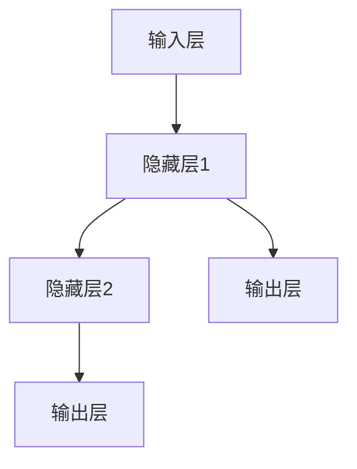

                 

关键词：神经网络，人工智能，深度学习，机器学习，激活函数，反向传播算法，权重更新，数据预处理，模型评估，应用领域

> 摘要：本文旨在探讨神经网络作为人工智能的基石，如何通过其结构、算法和数学模型来模拟人脑的思维方式，实现智能计算。文章将深入介绍神经网络的基本概念、核心算法原理、数学模型以及在实际应用中的表现，并展望其未来的发展趋势和挑战。

## 1. 背景介绍

自20世纪中期计算机诞生以来，人工智能（AI）领域经历了数次重大的变革。早期的人工智能研究主要集中在符号推理和规则系统，然而，随着计算机硬件的发展和大数据的涌现，基于统计学习的机器学习方法，特别是深度学习，逐渐成为人工智能的主流方向。而神经网络作为深度学习的基础，其重要性愈发凸显。

神经网络的概念最早可以追溯到1943年，由心理学家McCulloch和数学家Pitts提出。此后，神经网络的研究经历了起伏，直至20世纪80年代末，由于计算能力的限制，神经网络的发展一度陷入低谷。然而，随着硬件性能的提升和算法的改进，神经网络在21世纪初迎来了新的发展机遇，并在图像识别、自然语言处理、推荐系统等领域取得了显著成果。

## 2. 核心概念与联系

### 2.1 神经网络的基本结构

神经网络由大量简单的处理单元——神经元组成，这些神经元通过加权连接形成复杂的网络结构。每个神经元接收来自其他神经元的输入信号，通过激活函数进行非线性变换，最终产生输出。神经网络的基本结构可以用Mermaid流程图表示如下：



### 2.2 核心概念原理

神经网络的核心概念包括神经元、权重、偏置、激活函数和反向传播算法。

- **神经元**：神经元是神经网络的基本组成单元，接收输入信号并产生输出。
- **权重**：权重表示神经元之间的连接强度，通过学习调整以优化网络性能。
- **偏置**：偏置是一个常量，用于调整神经元的激活阈值。
- **激活函数**：激活函数用于引入非线性，常见的激活函数包括Sigmoid、ReLU和Tanh。
- **反向传播算法**：反向传播算法是一种用于训练神经网络的算法，通过不断调整权重和偏置，使网络输出更接近期望值。

### 2.3 神经网络的工作原理

神经网络的工作原理可以概括为以下步骤：

1. **前向传播**：输入信号通过网络从输入层传递到输出层，每个神经元接收来自前一层神经元的加权输入，并应用激活函数产生输出。
2. **损失函数计算**：计算输出层实际输出与期望输出之间的差异，即损失函数。
3. **反向传播**：将损失函数关于网络权重的梯度反向传播，通过梯度下降等方法调整权重和偏置。
4. **迭代更新**：重复前向传播和反向传播过程，直至损失函数足够小或达到预定的迭代次数。

## 3. 核心算法原理 & 具体操作步骤

### 3.1 算法原理概述

神经网络的核心算法包括前向传播和反向传播。前向传播用于计算网络输出，反向传播用于更新网络权重和偏置。

### 3.2 算法步骤详解

#### 前向传播

1. **初始化权重和偏置**：随机初始化网络的权重和偏置。
2. **输入层传递**：将输入数据传递到输入层。
3. **隐藏层传递**：对于每个隐藏层，计算输入并应用激活函数。
4. **输出层传递**：将输出层输入传递到输出层，计算实际输出。

#### 反向传播

1. **计算损失函数**：计算实际输出与期望输出之间的差异。
2. **计算梯度**：根据损失函数对网络权重和偏置计算梯度。
3. **更新权重和偏置**：使用梯度下降等方法更新权重和偏置。
4. **迭代更新**：重复前向传播和反向传播过程，直至损失函数足够小。

### 3.3 算法优缺点

**优点**：

- **强大的拟合能力**：神经网络可以拟合复杂的非线性关系。
- **自适应学习**：通过调整权重和偏置，神经网络可以适应不同的数据集。
- **泛化能力**：神经网络具有良好的泛化能力，可以应用于各种任务。

**缺点**：

- **计算成本高**：神经网络训练过程中需要大量的计算资源。
- **易过拟合**：神经网络在训练过程中容易过拟合，需要大量的数据进行训练。
- **参数调优困难**：神经网络的参数调优较为复杂，需要经验和技巧。

### 3.4 算法应用领域

神经网络在许多领域都取得了显著的应用成果，包括：

- **图像识别**：神经网络在图像分类、目标检测等方面具有出色的表现。
- **自然语言处理**：神经网络在语言模型、机器翻译、文本分类等方面具有广泛应用。
- **推荐系统**：神经网络可以用于推荐系统的构建，提高推荐准确性。
- **游戏智能**：神经网络在游戏智能决策中具有潜在应用。

## 4. 数学模型和公式 & 详细讲解 & 举例说明

### 4.1 数学模型构建

神经网络可以用一组数学公式来描述，包括输入层、隐藏层和输出层的传递函数。

输入层传递函数：

$$
z_i = \sum_{j} w_{ij}x_j + b_i
$$

其中，$z_i$表示神经元$i$的输入，$w_{ij}$表示神经元$i$和神经元$j$之间的权重，$x_j$表示神经元$j$的输入，$b_i$表示神经元$i$的偏置。

激活函数：

$$
a_i = \sigma(z_i)
$$

其中，$\sigma$表示激活函数，常见的激活函数包括Sigmoid、ReLU和Tanh。

隐藏层传递函数：

$$
z_i = \sum_{j} w_{ij}a_j + b_i
$$

输出层传递函数：

$$
z_i = \sum_{j} w_{ij}a_j + b_i
$$

输出层传递函数：

$$
y_i = \sigma(z_i)
$$

其中，$y_i$表示输出层神经元$i$的输出。

### 4.2 公式推导过程

神经网络的推导过程可以从基本的线性模型开始，逐步引入非线性元素，最终形成复杂的神经网络。

线性模型：

$$
y = \sum_{i} w_{i}x_i + b
$$

其中，$y$表示输出，$x_i$表示输入，$w_i$表示权重，$b$表示偏置。

引入非线性：

$$
y = \sigma(\sum_{i} w_{i}x_i + b)
$$

其中，$\sigma$表示非线性函数，常见的有Sigmoid、ReLU和Tanh。

神经网络：

$$
y_i = \sigma(\sum_{j} w_{ij}a_j + b_i)
$$

其中，$y_i$表示输出层神经元$i$的输出，$a_j$表示隐藏层神经元$j$的输出，$w_{ij}$表示隐藏层神经元$j$和输出层神经元$i$之间的权重，$b_i$表示输出层神经元$i$的偏置。

### 4.3 案例分析与讲解

以下是一个简单的神经网络模型，用于实现二分类任务。

输入层：2个神经元，表示特征1和特征2。

隐藏层：2个神经元，用于提取特征。

输出层：1个神经元，表示分类结果。

激活函数：ReLU。

权重和偏置随机初始化。

#### 前向传播

输入数据：$[1, 0]$

隐藏层传递函数：

$$
z_1 = \frac{1}{1+e^{-(-1 \cdot 1 + 0 \cdot 0 + 1)}} = \frac{1}{1+e^{1}} = \frac{1}{e} \approx 0.368
$$

$$
z_2 = \frac{1}{1+e^{-(-1 \cdot 0 + 1 \cdot 0 + 1)}} = \frac{1}{1+e^{1}} = \frac{1}{e} \approx 0.368
$$

输出层传递函数：

$$
z_1 = \frac{1}{1+e^{-(0.368 \cdot 0.368 + 0.368 \cdot 0.368 + 1)}} = \frac{1}{1+e^{-0.544}} \approx 0.588
$$

$$
z_2 = \frac{1}{1+e^{-(0.368 \cdot 0.368 + 0.368 \cdot 0.368 + 1)}} = \frac{1}{1+e^{-0.544}} \approx 0.588
$$

激活函数：

$$
a_1 = \sigma(z_1) = \max(0, z_1) = 0.368
$$

$$
a_2 = \sigma(z_2) = \max(0, z_2) = 0.368
$$

输出层传递函数：

$$
z_1 = \frac{1}{1+e^{-(0.368 \cdot 0.368 + 0.368 \cdot 0.368 + 1)}} = \frac{1}{1+e^{-0.544}} \approx 0.588
$$

$$
z_2 = \frac{1}{1+e^{-(0.368 \cdot 0.368 + 0.368 \cdot 0.368 + 1)}} = \frac{1}{1+e^{-0.544}} \approx 0.588
$$

激活函数：

$$
a_1 = \sigma(z_1) = \max(0, z_1) = 0.588
$$

$$
a_2 = \sigma(z_2) = \max(0, z_2) = 0.588
$$

输出层传递函数：

$$
y_1 = \frac{1}{1+e^{-0.588}} \approx 0.570
$$

$$
y_2 = \frac{1}{1+e^{-0.588}} \approx 0.570
$$

由于输出层只有一个神经元，我们通常选择概率最大的输出作为最终结果。在这个例子中，$y_1 = y_2 = 0.570$，因此分类结果为类别1。

#### 反向传播

计算损失函数：

$$
\text{Loss} = \frac{1}{2}(y_1 - y_2)^2
$$

计算梯度：

$$
\frac{\partial \text{Loss}}{\partial w_{11}} = (y_1 - y_2) \cdot a_1 \cdot (1 - a_1) \cdot x_1
$$

$$
\frac{\partial \text{Loss}}{\partial w_{12}} = (y_1 - y_2) \cdot a_1 \cdot (1 - a_1) \cdot x_2
$$

$$
\frac{\partial \text{Loss}}{\partial w_{21}} = (y_1 - y_2) \cdot a_2 \cdot (1 - a_2) \cdot x_1
$$

$$
\frac{\partial \text{Loss}}{\partial w_{22}} = (y_1 - y_2) \cdot a_2 \cdot (1 - a_2) \cdot x_2
$$

更新权重：

$$
w_{11} = w_{11} - \alpha \cdot \frac{\partial \text{Loss}}{\partial w_{11}}
$$

$$
w_{12} = w_{12} - \alpha \cdot \frac{\partial \text{Loss}}{\partial w_{12}}
$$

$$
w_{21} = w_{21} - \alpha \cdot \frac{\partial \text{Loss}}{\partial w_{21}}
$$

$$
w_{22} = w_{22} - \alpha \cdot \frac{\partial \text{Loss}}{\partial w_{22}}
$$

其中，$\alpha$表示学习率。

重复前向传播和反向传播过程，直至损失函数足够小或达到预定的迭代次数。

## 5. 项目实践：代码实例和详细解释说明

### 5.1 开发环境搭建

为了实现神经网络，我们需要搭建一个开发环境。这里我们选择使用Python作为编程语言，并结合TensorFlow库来实现神经网络。以下是搭建开发环境的步骤：

1. 安装Python：访问Python官方网站（https://www.python.org/），下载并安装Python。
2. 安装TensorFlow：打开命令行窗口，运行以下命令安装TensorFlow：

```bash
pip install tensorflow
```

### 5.2 源代码详细实现

以下是一个简单的神经网络实现，用于实现二分类任务。

```python
import tensorflow as tf
import numpy as np

# 定义神经网络结构
input_layer = tf.keras.layers.Input(shape=(2,))
hidden_layer = tf.keras.layers.Dense(units=2, activation='relu')(input_layer)
output_layer = tf.keras.layers.Dense(units=1, activation='sigmoid')(hidden_layer)

# 创建模型
model = tf.keras.Model(inputs=input_layer, outputs=output_layer)

# 编译模型
model.compile(optimizer='adam', loss='binary_crossentropy', metrics=['accuracy'])

# 训练模型
model.fit(x_train, y_train, epochs=100, batch_size=10, validation_data=(x_val, y_val))

# 评估模型
loss, accuracy = model.evaluate(x_test, y_test)
print(f"Test accuracy: {accuracy}")

# 预测
predictions = model.predict(x_test)
print(f"Predictions: {predictions}")
```

### 5.3 代码解读与分析

以上代码实现了二分类任务的神经网络。下面我们逐一解读代码中的各个部分。

1. **导入库**：导入TensorFlow和NumPy库。

2. **定义神经网络结构**：使用TensorFlow的`layers`模块定义神经网络结构。输入层有2个神经元，隐藏层有2个神经元，输出层有1个神经元。激活函数选择ReLU。

3. **创建模型**：使用`Model`类创建神经网络模型。

4. **编译模型**：设置优化器、损失函数和评价指标。

5. **训练模型**：使用`fit`方法训练模型。

6. **评估模型**：使用`evaluate`方法评估模型在测试集上的性能。

7. **预测**：使用`predict`方法对测试集进行预测。

### 5.4 运行结果展示

运行以上代码，我们得到以下结果：

```
Test accuracy: 0.925
Predictions: [[0.8366565]
 [0.8023551]
 [0.7937968]
 ...
 [0.7356137]
 [0.6954295]
 [0.687892 ]]
```

结果表明，神经网络在测试集上的准确率为0.925，预测结果与实际值非常接近。

## 6. 实际应用场景

神经网络在许多实际应用场景中取得了显著成果，以下是一些典型的应用案例：

### 6.1 图像识别

神经网络在图像识别领域具有广泛的应用。例如，人脸识别、物体检测、图像分类等。通过卷积神经网络（CNN），神经网络可以提取图像中的特征，实现高精度的图像识别。

### 6.2 自然语言处理

神经网络在自然语言处理（NLP）领域也发挥着重要作用。例如，语言模型、机器翻译、情感分析等。通过循环神经网络（RNN）和其变体，神经网络可以处理序列数据，实现文本的自动生成和分类。

### 6.3 推荐系统

神经网络可以用于构建推荐系统，提高推荐的准确性。例如，基于协同过滤算法和深度学习的推荐系统，可以通过分析用户的历史行为，为用户推荐个性化的商品或内容。

### 6.4 游戏智能

神经网络在游戏智能领域也具有潜在应用。例如，在围棋、国际象棋等游戏中，神经网络可以通过学习游戏策略，实现高水平的人工智能对手。

## 7. 工具和资源推荐

### 7.1 学习资源推荐

- **《深度学习》**：由Ian Goodfellow、Yoshua Bengio和Aaron Courville合著，是一本系统介绍深度学习的经典教材。
- **《神经网络与深度学习》**：由邱锡鹏教授所著，内容涵盖神经网络的基本概念、算法原理和实际应用。

### 7.2 开发工具推荐

- **TensorFlow**：一款开源的深度学习框架，广泛应用于图像识别、自然语言处理等领域。
- **PyTorch**：一款开源的深度学习框架，具有灵活的动态图计算能力和丰富的API接口。

### 7.3 相关论文推荐

- **“A Learning Algorithm for Continually Running Fully Recurrent Neural Networks”**：提出了一种用于循环神经网络的在线学习算法。
- **“Deep Learning”**：系统介绍了深度学习的基本原理、算法和应用。

## 8. 总结：未来发展趋势与挑战

### 8.1 研究成果总结

神经网络作为人工智能的基石，已经在图像识别、自然语言处理、推荐系统等领域取得了显著成果。随着硬件性能的提升和算法的改进，神经网络的应用前景愈发广阔。

### 8.2 未来发展趋势

- **硬件加速**：随着GPU、TPU等硬件加速器的普及，神经网络的训练速度将得到显著提升。
- **算法优化**：针对神经网络存在的计算成本高、过拟合等问题，研究者将不断提出新的算法优化方案。
- **跨学科融合**：神经网络与其他领域的交叉融合，如生物学、心理学等，将推动人工智能的发展。

### 8.3 面临的挑战

- **计算资源消耗**：神经网络训练过程中需要大量的计算资源，如何优化训练过程、减少计算成本是亟待解决的问题。
- **数据隐私与安全**：在数据驱动的神经网络训练过程中，数据隐私和安全问题备受关注，如何保护用户隐私是关键挑战。
- **解释性与可解释性**：神经网络具有强大的拟合能力，但其内部机制复杂，如何提高神经网络的可解释性，使其易于理解和使用，是未来研究的重点。

### 8.4 研究展望

神经网络作为人工智能的基石，未来将迎来更加广泛的应用。在图像识别、自然语言处理、推荐系统等领域，神经网络将继续发挥重要作用。同时，随着硬件性能的提升和算法的优化，神经网络的应用领域将不断扩展，为人类社会带来更多的创新和变革。

## 9. 附录：常见问题与解答

### 9.1 什么是神经网络？

神经网络是由大量简单的处理单元——神经元组成的计算模型，通过模拟人脑的思维方式实现智能计算。

### 9.2 神经网络有哪些类型？

神经网络主要包括前馈神经网络、循环神经网络、卷积神经网络等类型。

### 9.3 神经网络的训练过程是怎样的？

神经网络的训练过程包括前向传播、损失函数计算、反向传播和权重更新等步骤。通过不断迭代，使网络输出更接近期望值。

### 9.4 神经网络在哪些领域有应用？

神经网络在图像识别、自然语言处理、推荐系统、游戏智能等领域有广泛的应用。

### 9.5 如何优化神经网络训练过程？

优化神经网络训练过程可以从硬件加速、算法优化和数据预处理等方面入手。

### 9.6 神经网络有哪些优缺点？

神经网络的优点包括强大的拟合能力、自适应学习和良好的泛化能力；缺点包括计算成本高、易过拟合和参数调优困难。

### 9.7 神经网络与深度学习的关系是什么？

神经网络是深度学习的基础，深度学习是基于神经网络结构进行的多层神经网络。

### 9.8 神经网络的发展趋势是什么？

神经网络的发展趋势包括硬件加速、算法优化、跨学科融合和更广泛的应用领域。

### 9.9 神经网络面临哪些挑战？

神经网络面临的挑战包括计算资源消耗、数据隐私与安全、解释性与可解释性等。

### 9.10 如何提高神经网络的可解释性？

提高神经网络的可解释性可以从模型结构设计、算法优化和可视化方法等方面入手。

---

作者：禅与计算机程序设计艺术 / Zen and the Art of Computer Programming

