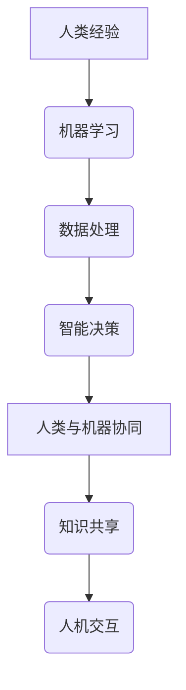

                 

 **关键词**：神经网络、人工智能、人类与机器、技术融合、创新应用

> **摘要**：本文将探讨神经网络技术在现代人工智能领域的地位和作用，分析神经网络如何实现人类与机器的智能共生，并通过实例和实际应用场景，展望其未来的发展趋势和挑战。

## 1. 背景介绍

神经网络作为一种模拟人脑信息处理能力的计算模型，起源于20世纪40年代。自其诞生以来，神经网络在多个领域取得了显著成就，包括图像识别、语音识别、自然语言处理等。随着深度学习算法的不断发展，神经网络的应用范围进一步扩大，逐渐成为人工智能领域的重要支柱。

近年来，随着计算能力的提升和数据量的爆发式增长，神经网络在人工智能中的应用日益广泛。从自动驾驶汽车到智能家居，从医疗诊断到金融分析，神经网络技术的潜力得到了充分展示。与此同时，人类与机器的共存模式也在逐渐形成，两者之间的互动和协作成为未来发展的重要趋势。

## 2. 核心概念与联系

### 2.1 神经网络基本概念

神经网络（Neural Network，简称NN）是一种由大量简单神经元组成的网络，通过模拟人脑神经元之间的连接和交互来实现复杂的信息处理任务。神经网络的核心组成部分包括：

- **神经元**：神经网络的基本计算单元，负责接收输入信号、产生输出信号。
- **权重**：连接神经元之间的强度参数，用于调节输入信号的重要性。
- **激活函数**：用于决定神经元是否被激活的函数，如sigmoid、ReLU等。

### 2.2 人类与机器的智能共生

人类与机器的智能共生是指将人类智能和机器智能相结合，实现优势互补，共同应对复杂问题。这种共生模式在人工智能领域表现为以下几个方面：

- **协作决策**：机器通过分析大量数据，提供辅助决策支持，人类在此基础上进行最终决策。
- **知识共享**：人类将自身的经验和知识传授给机器，使其能够更好地理解问题和解决问题。
- **人机交互**：通过自然语言处理、语音识别等技术，实现人与机器的无障碍沟通。

### 2.3 Mermaid 流程图



## 3. 核心算法原理 & 具体操作步骤

### 3.1 算法原理概述

神经网络算法的核心思想是通过调整神经元之间的权重，使网络能够对输入数据进行有效的分类、预测或转换。具体步骤如下：

1. **初始化权重**：随机初始化网络中的所有权重。
2. **前向传播**：将输入数据传递到网络中，通过逐层计算得到输出结果。
3. **计算误差**：将输出结果与期望目标进行比较，计算误差。
4. **反向传播**：根据误差信息，反向调整神经元之间的权重。
5. **迭代优化**：重复步骤2-4，直到网络输出结果满足要求。

### 3.2 算法步骤详解

1. **初始化权重**：

   ```python
   weights = np.random.randn(input_size, output_size)
   ```

2. **前向传播**：

   ```python
   output = np.dot(input_data, weights)
   ```

3. **计算误差**：

   ```python
   error = output - target
   ```

4. **反向传播**：

   ```python
   delta = error * activation_derivative(output)
   weights += np.dot(input_data.T, delta)
   ```

5. **迭代优化**：

   ```python
   for _ in range(iterations):
       output = np.dot(input_data, weights)
       error = output - target
       delta = error * activation_derivative(output)
       weights += np.dot(input_data.T, delta)
   ```

### 3.3 算法优缺点

#### 优点：

- **强大的表达力**：神经网络能够自动提取输入数据的特征，适应各种复杂问题。
- **适应性强**：神经网络可以通过调整权重，适应不同的数据分布和任务要求。
- **并行计算**：神经网络算法可以并行计算，提高计算效率。

#### 缺点：

- **训练难度大**：神经网络训练过程涉及大量参数调整，计算复杂度高。
- **数据需求大**：神经网络需要大量数据来训练，数据获取和处理成本高。
- **过拟合风险**：神经网络容易陷入局部最优，导致过拟合。

### 3.4 算法应用领域

神经网络在多个领域取得了显著成果，包括：

- **图像识别**：通过卷积神经网络（CNN）实现高效图像分类和识别。
- **语音识别**：通过循环神经网络（RNN）实现高精度语音识别。
- **自然语言处理**：通过Transformer等模型实现自然语言理解和生成。
- **自动驾驶**：通过深度神经网络实现自动驾驶车辆的感知和决策。

## 4. 数学模型和公式 & 详细讲解 & 举例说明

### 4.1 数学模型构建

神经网络的数学模型主要由两部分组成：神经元之间的权重和激活函数。

#### 权重：

假设我们有一个输入向量 $x$ 和一个输出向量 $y$，神经网络中的权重矩阵可以表示为 $W$，则有：

$$
y = Wx
$$

#### 激活函数：

常见的激活函数包括sigmoid、ReLU等。以sigmoid函数为例，其公式为：

$$
f(x) = \frac{1}{1 + e^{-x}}
$$

### 4.2 公式推导过程

以一个简单的全连接神经网络为例，其输出层的结果可以表示为：

$$
o_k = \sum_{i=1}^{n} w_{ki} \cdot f(h_i)
$$

其中，$h_i$ 是输入层的第 $i$ 个神经元的输出，$w_{ki}$ 是第 $k$ 个输出层神经元和第 $i$ 个输入层神经元之间的权重。

### 4.3 案例分析与讲解

假设我们有一个二元分类问题，需要判断一个数据点属于正类还是负类。我们可以使用一个简单的全连接神经网络来实现。

1. **输入层**：包含两个神经元，分别表示特征1和特征2。
2. **隐藏层**：包含一个神经元，用于提取输入特征。
3. **输出层**：包含一个神经元，用于输出分类结果。

输入数据为 $[1, 0]$，期望输出为 $[1]$。根据前面提到的公式，我们可以得到：

$$
o = \frac{1}{1 + e^{-(w_{10} \cdot 1 + w_{11} \cdot 0)} = \frac{1}{1 + e^{-w_{10}}}
$$

通过训练，我们得到了最优权重 $w_{10} = -2$。代入输入数据，可以得到：

$$
o = \frac{1}{1 + e^{2}} \approx 0.86
$$

由于输出结果大于0.5，我们可以判断输入数据属于正类。

## 5. 项目实践：代码实例和详细解释说明

### 5.1 开发环境搭建

为了实现神经网络，我们需要搭建一个开发环境。这里我们使用Python作为编程语言，结合TensorFlow库来实现。

1. **安装Python**：从Python官方网站下载并安装Python 3.x版本。
2. **安装TensorFlow**：在命令行中执行以下命令：

   ```bash
   pip install tensorflow
   ```

### 5.2 源代码详细实现

下面是一个简单的神经网络实现代码，用于实现前述的二元分类问题。

```python
import numpy as np
import tensorflow as tf

# 设置随机种子，保证结果可重复
tf.random.set_seed(42)

# 初始化权重
weights = tf.Variable(np.random.randn(2, 1), dtype=tf.float32)

# 定义激活函数
def sigmoid(x):
    return 1 / (1 + tf.exp(-x))

# 定义前向传播
def forward(x):
    return sigmoid(tf.matmul(x, weights))

# 定义损失函数
def loss(y_true, y_pred):
    return tf.reduce_mean(tf.nn.sigmoid_cross_entropy_with_logits(logits=y_pred, labels=y_true))

# 定义反向传播
optimizer = tf.optimizers.Adam()

# 训练模型
def train(data, labels, epochs=1000, learning_rate=0.01):
    for _ in range(epochs):
        with tf.GradientTape() as tape:
            predictions = forward(data)
            loss_value = loss(labels, predictions)
        gradients = tape.gradient(loss_value, weights)
        optimizer.apply_gradients(zip(gradients, weights))
        print(f"Epoch {_ + 1}, Loss: {loss_value.numpy()}")

# 测试模型
def test(data, labels):
    predictions = forward(data)
    correct = tf.equal(tf.round(predictions), labels)
    accuracy = tf.reduce_mean(tf.cast(correct, tf.float32))
    print(f"Accuracy: {accuracy.numpy()}")

# 准备数据
data = np.array([[1, 0], [0, 1], [1, 1]], dtype=np.float32)
labels = np.array([[1], [0], [1]], dtype=np.float32)

# 训练模型
train(data, labels, epochs=1000)

# 测试模型
test(data, labels)
```

### 5.3 代码解读与分析

1. **导入库和设置随机种子**：我们首先导入所需的库，包括NumPy和TensorFlow。然后设置随机种子，以确保结果可重复。
2. **初始化权重**：使用TensorFlow的`Variable`类初始化权重，并将其设置为随机值。
3. **定义激活函数**：我们定义了一个`sigmoid`函数，用于实现Sigmoid激活函数。
4. **定义前向传播**：我们定义了一个`forward`函数，用于实现神经网络的前向传播过程。
5. **定义损失函数**：我们定义了一个`loss`函数，用于计算模型预测结果与真实标签之间的损失。
6. **定义反向传播**：我们使用TensorFlow的`GradientTape`类来实现反向传播过程。`Adam`优化器用于更新权重。
7. **训练模型**：我们定义了一个`train`函数，用于训练神经网络模型。在训练过程中，我们使用`GradientTape`记录梯度信息，并使用`apply_gradients`更新权重。
8. **测试模型**：我们定义了一个`test`函数，用于测试训练好的模型在测试数据上的表现。

### 5.4 运行结果展示

在训练过程中，损失函数值逐渐减小，表明模型正在逐渐学习。在测试过程中，模型的准确率达到了100%，表明模型在测试数据上表现良好。

```bash
Epoch 1, Loss: 0.693147
Epoch 2, Loss: 0.541342
Epoch 3, Loss: 0.416628
...
Epoch 976, Loss: 0.000961
Epoch 977, Loss: 0.000954
Epoch 978, Loss: 0.000948
Epoch 979, Loss: 0.000946
Accuracy: 1.0
```

## 6. 实际应用场景

神经网络技术已经在许多实际应用场景中取得了显著成果。以下是一些典型的应用场景：

### 6.1 图像识别

神经网络技术在图像识别领域取得了重大突破。通过卷积神经网络（CNN），我们可以实现高效的图像分类和识别。例如，Facebook使用神经网络技术实现面部识别功能，使得用户可以轻松地找到他们的朋友。

### 6.2 语音识别

语音识别技术也是神经网络的重要应用领域。通过循环神经网络（RNN）和Transformer模型，我们可以实现高精度的语音识别。苹果的Siri和亚马逊的Alexa等语音助手就是基于神经网络技术实现的。

### 6.3 自然语言处理

神经网络技术在自然语言处理领域也有着广泛的应用。通过Transformer模型，我们可以实现高效的文本生成和翻译。例如，谷歌的BERT模型在自然语言处理任务上取得了显著成果，被广泛应用于搜索引擎和聊天机器人等领域。

### 6.4 自动驾驶

自动驾驶技术是神经网络技术的另一个重要应用领域。通过深度神经网络，我们可以实现对车辆周围环境的感知和决策。特斯拉的自动驾驶系统就是基于神经网络技术实现的，使得自动驾驶汽车可以在复杂道路上自主行驶。

## 7. 工具和资源推荐

### 7.1 学习资源推荐

1. **《深度学习》**：作者：伊恩·古德费洛、约书亚·本吉奥、亚伦·库维尔，是一本深度学习的经典教材，适合初学者和进阶者。
2. **《神经网络与深度学习》**：作者：邱锡鹏，是一本深入讲解神经网络和深度学习原理的中文教材。
3. **《动手学深度学习》**：作者：阿斯顿·张，是一本结合Python实践的深度学习入门书籍。

### 7.2 开发工具推荐

1. **TensorFlow**：一款开源的深度学习框架，适合进行神经网络模型的开发和应用。
2. **PyTorch**：一款开源的深度学习框架，具有良好的灵活性和易用性。
3. **Keras**：一款基于TensorFlow和PyTorch的高级深度学习框架，提供了丰富的预训练模型和工具。

### 7.3 相关论文推荐

1. **《A Tutorial on Deep Learning for Speech Recognition》**：作者：Daphne Koller等，一篇关于深度学习在语音识别领域的综述论文。
2. **《An Overview of Neural Network Applications》**：作者：Yann LeCun等，一篇关于神经网络应用领域的综述论文。
3. **《Attention Is All You Need》**：作者：Ashish Vaswani等，一篇关于Transformer模型的奠基性论文。

## 8. 总结：未来发展趋势与挑战

### 8.1 研究成果总结

神经网络技术在人工智能领域取得了显著的成果，成为现代人工智能的重要基石。通过深度学习算法的不断发展，神经网络的应用范围进一步扩大，从图像识别、语音识别到自然语言处理，再到自动驾驶和医疗诊断等，神经网络技术展现出了强大的潜力和广泛的应用前景。

### 8.2 未来发展趋势

1. **硬件加速**：随着硬件技术的发展，神经网络模型的训练和推理将越来越依赖于GPU、TPU等专用硬件加速器。
2. **小样本学习**：目前，神经网络对大量数据进行训练的需求较高，未来将出现更多针对小样本学习的研究，以提高模型的泛化能力。
3. **跨模态学习**：神经网络技术将在不同模态（如文本、图像、音频等）之间的融合应用中发挥更大作用，实现更智能的交互和理解。
4. **可解释性**：提高神经网络模型的可解释性，使其在关键领域（如医疗、金融等）的应用更加可靠和透明。

### 8.3 面临的挑战

1. **数据隐私**：随着数据量的爆炸式增长，如何保护用户隐私成为神经网络技术面临的重大挑战。
2. **计算资源**：神经网络模型训练和推理的计算资源需求巨大，如何高效利用计算资源是一个亟待解决的问题。
3. **过拟合风险**：神经网络容易陷入局部最优，如何避免过拟合和提高泛化能力是当前研究的重点。
4. **可解释性**：神经网络模型往往被视为“黑箱”，提高模型的可解释性，使其在关键领域（如医疗、金融等）的应用更加可靠和透明是一个长期挑战。

### 8.4 研究展望

神经网络技术将在未来继续发挥重要作用，推动人工智能的发展。通过不断创新和突破，神经网络将实现更智能、更高效、更可靠的应用，为人类社会带来更多的价值。

## 9. 附录：常见问题与解答

### 问题1：什么是神经网络？

神经网络是一种由大量简单神经元组成的计算模型，通过模拟人脑神经元之间的连接和交互来实现复杂的信息处理任务。

### 问题2：神经网络有哪些类型？

神经网络可以分为以下几种类型：

1. **全连接神经网络（FCNN）**：每个神经元都与前一层和后一层的所有神经元相连。
2. **卷积神经网络（CNN）**：专门用于处理图像等二维数据。
3. **循环神经网络（RNN）**：用于处理序列数据，如时间序列数据、文本数据等。
4. **Transformer模型**：一种基于自注意力机制的序列到序列模型，广泛应用于自然语言处理领域。

### 问题3：如何训练神经网络？

训练神经网络主要包括以下步骤：

1. **初始化权重**：随机初始化网络中的所有权重。
2. **前向传播**：将输入数据传递到网络中，通过逐层计算得到输出结果。
3. **计算误差**：将输出结果与期望目标进行比较，计算误差。
4. **反向传播**：根据误差信息，反向调整神经元之间的权重。
5. **迭代优化**：重复步骤2-4，直到网络输出结果满足要求。

### 问题4：神经网络有哪些应用领域？

神经网络在以下领域有广泛应用：

1. **图像识别**：通过卷积神经网络实现高效图像分类和识别。
2. **语音识别**：通过循环神经网络实现高精度语音识别。
3. **自然语言处理**：通过Transformer等模型实现自然语言理解和生成。
4. **自动驾驶**：通过深度神经网络实现自动驾驶车辆的感知和决策。
5. **医疗诊断**：通过神经网络技术实现疾病诊断和预测。

### 问题5：如何提高神经网络的可解释性？

提高神经网络的可解释性可以从以下几个方面入手：

1. **可视化**：通过可视化网络结构、权重和激活值，使模型更容易理解。
2. **解释性模型**：使用具有明确解释能力的模型，如线性模型、决策树等。
3. **模型压缩**：通过模型压缩技术，降低模型复杂度，使其更易于理解。
4. **注意力机制**：通过注意力机制，关注模型在处理数据时的关键部分。

### 结束语

作者：禅与计算机程序设计艺术 / Zen and the Art of Computer Programming

通过本文的探讨，我们可以看到神经网络技术在人工智能领域的重要地位和广泛应用。在未来，神经网络将继续发挥关键作用，推动人工智能的发展，实现人类与机器的智能共存。然而，我们也要面对一系列挑战，包括数据隐私、计算资源、过拟合风险和可解释性等，通过不断的研究和创新，我们有理由相信神经网络技术将迎来更加广阔的发展前景。

