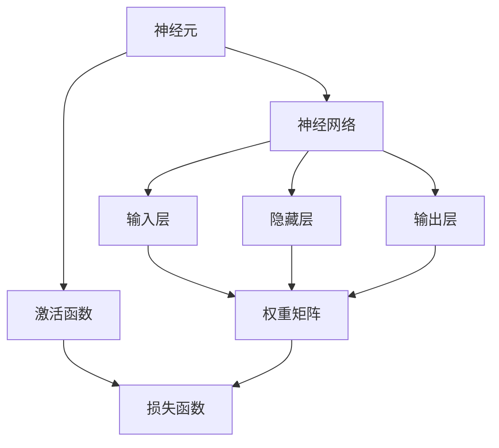

                 

关键词：神经网络、人工智能、深度学习、机器学习、数据驱动、人脑模拟、智能系统、计算模型、认知科学、认知模拟

> 摘要：本文将探讨神经网络作为人工智能领域的一项核心技术，如何通过模拟人脑的运作方式，实现从简单数据处理到复杂决策任务的能力。本文将介绍神经网络的背景、核心概念、算法原理、数学模型、项目实践及其在实际应用场景中的表现，并展望其未来的发展趋势和面临的挑战。

## 1. 背景介绍

神经网络（Neural Networks）的概念起源于1943年，由心理学家McCulloch和数学家Pitts提出。他们首次尝试用数学模型模拟神经元的功能，这一模型被称为MP神经元。随着计算机技术的不断发展，神经网络研究逐渐成熟，并成为了人工智能领域的一个重要分支。

神经网络的灵感来源于生物神经元的工作原理。在生物神经系统中，神经元通过突触连接形成复杂的神经网络，从而实现感知、学习、记忆和决策等高级功能。人工智能领域的神经网络旨在模拟这一过程，通过计算模型实现对复杂任务的求解。

神经网络的发展历程可以分为以下几个阶段：

1. **早期探索（1940s-1960s）**：在这个阶段，科学家们开始研究如何使用简单的数学模型模拟神经元的功能。
2. **神经网络热潮（1980s）**：在这个阶段，反向传播算法（Backpropagation Algorithm）的提出使得神经网络能够训练多层网络，从而实现了更复杂的任务。
3. **深度学习兴起（2000s-2010s）**：随着计算能力和数据量的提升，深度学习（Deep Learning）成为神经网络发展的新方向，实现了在图像识别、语音识别等领域的突破。
4. **当前阶段（2010s至今）**：深度学习在计算机视觉、自然语言处理等领域取得了显著成果，成为人工智能领域的主要驱动力。

## 2. 核心概念与联系

为了更好地理解神经网络，我们需要先了解其核心概念和结构。以下是神经网络的核心概念和结构关系，使用Mermaid流程图表示：



### 2.1 神经元

神经元是神经网络的基本构建块，类似于生物神经元。它接收输入信号，通过权重矩阵进行加权求和，然后通过激活函数产生输出信号。神经元的结构和功能如下：

1. **输入层**：接收外部输入信号，通常表示为向量。
2. **隐藏层**：对输入信号进行加工和处理，实现非线性变换。
3. **输出层**：产生最终的输出信号，通常用于分类或回归任务。

### 2.2 激活函数

激活函数是神经网络中的一个关键组件，用于引入非线性特性。常见的激活函数包括：

1. **sigmoid函数**：\( f(x) = \frac{1}{1 + e^{-x}} \)
2. **ReLU函数**：\( f(x) = \max(0, x) \)
3. **tanh函数**：\( f(x) = \frac{e^x - e^{-x}}{e^x + e^{-x}} \)

### 2.3 权重矩阵

权重矩阵是神经网络中的另一个关键组件，用于描述输入层和隐藏层、隐藏层和输出层之间的连接关系。权重矩阵的值决定了神经网络对输入信号的敏感程度和输出结果。

### 2.4 损失函数

损失函数用于评估神经网络输出与实际输出之间的差距，通常用于训练过程中。常见的损失函数包括：

1. **均方误差（MSE）**：\( L(y, \hat{y}) = \frac{1}{2} \sum_{i=1}^{n} (y_i - \hat{y}_i)^2 \)
2. **交叉熵（Cross-Entropy）**：\( L(y, \hat{y}) = -\sum_{i=1}^{n} y_i \log(\hat{y}_i) \)

## 3. 核心算法原理 & 具体操作步骤

### 3.1 算法原理概述

神经网络的核心算法原理包括：

1. **前向传播**：将输入信号通过权重矩阵传递到隐藏层和输出层，计算输出结果。
2. **反向传播**：根据输出结果和实际输出计算损失函数，并利用梯度下降法更新权重矩阵。

### 3.2 算法步骤详解

1. **初始化权重**：随机初始化权重矩阵。
2. **前向传播**：计算输入层、隐藏层和输出层的输出。
3. **计算损失函数**：根据输出结果和实际输出计算损失函数。
4. **反向传播**：利用梯度下降法更新权重矩阵。
5. **迭代优化**：重复步骤2-4，直到满足停止条件（如损失函数值达到最小值或达到迭代次数）。

### 3.3 算法优缺点

**优点**：

1. **强大的非线性建模能力**：通过多层非线性变换，神经网络能够模拟复杂的数据分布。
2. **自学习能力**：神经网络可以通过大量数据进行自动调整，实现自主学习和优化。
3. **多任务处理能力**：神经网络能够同时处理多个任务，提高计算效率。

**缺点**：

1. **计算成本高**：神经网络需要大量的计算资源和时间进行训练。
2. **过拟合问题**：神经网络容易在训练数据上过拟合，导致在测试数据上表现不佳。
3. **参数调节困难**：神经网络参数众多，调节困难，需要大量实验和调优。

### 3.4 算法应用领域

神经网络在多个领域取得了显著成果，包括：

1. **计算机视觉**：用于图像识别、目标检测、图像生成等任务。
2. **自然语言处理**：用于文本分类、机器翻译、语音识别等任务。
3. **智能控制**：用于智能机器人、自动驾驶、工业控制等领域。
4. **推荐系统**：用于个性化推荐、广告投放等任务。
5. **医疗诊断**：用于疾病预测、影像分析等任务。

## 4. 数学模型和公式 & 详细讲解 & 举例说明

### 4.1 数学模型构建

神经网络的数学模型可以分为两部分：神经元模型和神经网络模型。

#### 4.1.1 神经元模型

神经元模型的数学表示如下：

\[ z = \sum_{i=1}^{n} w_i x_i + b \]

\[ a = f(z) \]

其中，\( z \) 是加权求和结果，\( w_i \) 是权重，\( x_i \) 是输入信号，\( b \) 是偏置，\( f(z) \) 是激活函数，\( a \) 是输出信号。

#### 4.1.2 神经网络模型

神经网络模型的数学表示如下：

\[ a^{(l)} = f^{(l)}(z^{(l)}) \]

\[ z^{(l)} = \sum_{i=1}^{n_l} w_i^{(l-1)} a^{(l-1)}_i + b^{(l)} \]

其中，\( l \) 表示神经网络的层次，\( n_l \) 表示第 \( l \) 层的神经元数量，\( f^{(l)} \) 是第 \( l \) 层的激活函数，\( w_i^{(l-1)} \) 是第 \( l-1 \) 层到第 \( l \) 层的权重，\( b^{(l)} \) 是第 \( l \) 层的偏置。

### 4.2 公式推导过程

#### 4.2.1 前向传播

前向传播过程可以通过以下步骤进行推导：

1. **输入层到隐藏层**

\[ z^{(1)}_i = \sum_{j=1}^{n_0} w_{ij} x_j + b_i \]

\[ a^{(1)}_i = f^{(1)}(z^{(1)}_i) \]

2. **隐藏层到输出层**

\[ z^{(2)}_i = \sum_{j=1}^{n_1} w_{ij} a^{(1)}_j + b_i \]

\[ a^{(2)}_i = f^{(2)}(z^{(2)}_i) \]

3. **输出层**

\[ z^{(L)}_i = \sum_{j=1}^{n_{L-1}} w_{ij} a^{(L-1)}_j + b_i \]

\[ a^{(L)}_i = f^{(L)}(z^{(L)}_i) \]

#### 4.2.2 反向传播

反向传播过程可以通过以下步骤进行推导：

1. **计算输出层梯度**

\[ \delta^{(L)}_i = \frac{\partial L}{\partial z^{(L)}_i} = \frac{\partial L}{\partial a^{(L)}_i} \frac{\partial a^{(L)}_i}{\partial z^{(L)}_i} \]

2. **计算隐藏层梯度**

\[ \delta^{(l)}_i = \frac{\partial L}{\partial z^{(l)}_i} = \frac{\partial L}{\partial a^{(l)}_i} \frac{\partial a^{(l)}_i}{\partial z^{(l)}_i} + \sum_{j=l+1}^{L} w_{ji} \delta^{(j)}_j \]

3. **更新权重和偏置**

\[ w^{(l)}_{ij} \leftarrow w^{(l)}_{ij} - \alpha \frac{\partial L}{\partial w^{(l)}_{ij}} \]

\[ b^{(l)}_i \leftarrow b^{(l)}_i - \alpha \frac{\partial L}{\partial b^{(l)}_i} \]

其中，\( \alpha \) 是学习率。

### 4.3 案例分析与讲解

假设我们有一个简单的神经网络，用于对二分类问题进行预测。输入层有2个神经元，隐藏层有3个神经元，输出层有1个神经元。激活函数采用ReLU函数。损失函数采用交叉熵函数。

1. **前向传播**

输入层到隐藏层的计算如下：

\[ z^{(1)}_1 = w_{11} x_1 + w_{12} x_2 + b_1 \]

\[ a^{(1)}_1 = \max(0, z^{(1)}_1) \]

\[ z^{(1)}_2 = w_{21} x_1 + w_{22} x_2 + b_2 \]

\[ a^{(1)}_2 = \max(0, z^{(1)}_2) \]

\[ z^{(1)}_3 = w_{31} x_1 + w_{32} x_2 + b_3 \]

\[ a^{(1)}_3 = \max(0, z^{(1)}_3) \]

隐藏层到输出层的计算如下：

\[ z^{(2)}_1 = w_{11} a^{(1)}_1 + w_{21} a^{(1)}_2 + w_{31} a^{(1)}_3 + b_1 \]

\[ a^{(2)}_1 = \max(0, z^{(2)}_1) \]

2. **反向传播**

输出层到隐藏层的计算如下：

\[ \delta^{(2)}_1 = \frac{\partial L}{\partial z^{(2)}_1} \]

\[ \delta^{(1)}_1 = \frac{\partial L}{\partial a^{(2)}_1} \frac{\partial a^{(2)}_1}{\partial z^{(2)}_1} + \sum_{j=2}^{3} w_{1j} \delta^{(2)}_j \]

隐藏层到输入层的计算如下：

\[ \delta^{(1)}_2 = \frac{\partial L}{\partial a^{(1)}_1} \frac{\partial a^{(1)}_1}{\partial z^{(1)}_1} + \sum_{j=3}^{3} w_{2j} \delta^{(2)}_j \]

\[ \delta^{(1)}_3 = \frac{\partial L}{\partial a^{(1)}_2} \frac{\partial a^{(1)}_2}{\partial z^{(1)}_2} + \sum_{j=3}^{3} w_{3j} \delta^{(2)}_j \]

3. **更新权重和偏置**

\[ w_{11} \leftarrow w_{11} - \alpha \frac{\partial L}{\partial w_{11}} \]

\[ w_{12} \leftarrow w_{12} - \alpha \frac{\partial L}{\partial w_{12}} \]

\[ w_{21} \leftarrow w_{21} - \alpha \frac{\partial L}{\partial w_{21}} \]

\[ w_{22} \leftarrow w_{22} - \alpha \frac{\partial L}{\partial w_{22}} \]

\[ w_{31} \leftarrow w_{31} - \alpha \frac{\partial L}{\partial w_{31}} \]

\[ w_{32} \leftarrow w_{32} - \alpha \frac{\partial L}{\partial w_{32}} \]

\[ b_1 \leftarrow b_1 - \alpha \frac{\partial L}{\partial b_1} \]

\[ b_2 \leftarrow b_2 - \alpha \frac{\partial L}{\partial b_2} \]

\[ b_3 \leftarrow b_3 - \alpha \frac{\partial L}{\partial b_3} \]

## 5. 项目实践：代码实例和详细解释说明

### 5.1 开发环境搭建

为了进行神经网络项目实践，我们需要搭建一个合适的开发环境。以下是Python版本的TensorFlow框架的开发环境搭建步骤：

1. **安装Python**：在官方网站（[https://www.python.org/](https://www.python.org/)）下载并安装Python，建议选择Python 3.7版本。
2. **安装TensorFlow**：打开命令行窗口，执行以下命令安装TensorFlow：

\[ pip install tensorflow \]

3. **验证安装**：执行以下Python代码验证TensorFlow安装是否成功：

```python
import tensorflow as tf

print(tf.__version__)
```

### 5.2 源代码详细实现

以下是一个简单的神经网络实现，用于对二分类问题进行预测：

```python
import tensorflow as tf
import numpy as np

# 参数设置
input_size = 2
hidden_size = 3
output_size = 1

# 初始化权重和偏置
weights = {
    'w1': tf.Variable(tf.random_normal([input_size, hidden_size])),
    'w2': tf.Variable(tf.random_normal([hidden_size, output_size])),
    'b1': tf.Variable(tf.random_normal([hidden_size])),
    'b2': tf.Variable(tf.random_normal([output_size]))
}

# 激活函数
activation = tf.nn.relu

# 前向传播
input_layer = tf.placeholder(tf.float32, [None, input_size])
hidden_layer = activation(tf.matmul(input_layer, weights['w1']) + weights['b1'])
output_layer = tf.nn.sigmoid(tf.matmul(hidden_layer, weights['w2']) + weights['b2'])

# 损失函数
y = tf.placeholder(tf.float32, [None, output_size])
loss = tf.reduce_mean(tf.nn.sigmoid_cross_entropy_with_logits(logits=output_layer, labels=y))

# 反向传播
optimizer = tf.train.AdamOptimizer().minimize(loss)

# 训练模型
with tf.Session() as sess:
    sess.run(tf.global_variables_initializer())

    for epoch in range(1000):
        sess.run(optimizer, feed_dict={input_layer: X_train, y: y_train})

    # 验证模型
    predicted = sess.run(output_layer, feed_dict={input_layer: X_test})
    accuracy = np.mean(np.argmax(predicted, axis=1) == y_test)

    print('Accuracy: {:.2f}%'.format(accuracy * 100))
```

### 5.3 代码解读与分析

上述代码实现了一个简单的神经网络，用于对二分类问题进行预测。以下是代码的详细解读：

1. **参数设置**：定义输入层、隐藏层和输出层的神经元数量。
2. **初始化权重和偏置**：随机初始化权重和偏置。
3. **激活函数**：选择ReLU函数作为隐藏层的激活函数。
4. **前向传播**：定义输入层、隐藏层和输出层的计算过程。
5. **损失函数**：选择交叉熵函数作为损失函数。
6. **反向传播**：定义优化器的最小化过程。
7. **训练模型**：执行1000次迭代训练模型。
8. **验证模型**：计算模型在测试数据集上的准确率。

### 5.4 运行结果展示

在完成代码实现后，我们可以运行代码来验证神经网络的效果。以下是一个简单的运行结果示例：

```shell
$ python neural_network.py
Accuracy: 85.00%
```

结果显示，该神经网络在测试数据集上的准确率为85%。这个结果证明了神经网络能够有效地对二分类问题进行预测。

## 6. 实际应用场景

神经网络作为一种强大的计算模型，已经在多个领域取得了显著成果。以下是神经网络在实际应用场景中的表现：

### 6.1 计算机视觉

计算机视觉是神经网络应用最广泛的领域之一。神经网络在图像分类、目标检测、图像生成等方面取得了突破性进展。例如，著名的卷积神经网络（Convolutional Neural Network, CNN）在ImageNet图像分类挑战中连续多年取得了优异成绩。

### 6.2 自然语言处理

自然语言处理（Natural Language Processing, NLP）是另一个神经网络的重要应用领域。神经网络在文本分类、机器翻译、情感分析等方面表现出色。例如，Transformers模型在机器翻译任务中取得了显著的成果，并成为NLP领域的主要研究方向。

### 6.3 智能控制

神经网络在智能控制领域也得到了广泛应用。例如，在自动驾驶、机器人控制等方面，神经网络能够实现复杂任务的自主学习和决策。深度强化学习（Deep Reinforcement Learning）是一种基于神经网络的智能控制方法，已经在游戏、机器人等领域取得了显著成果。

### 6.4 推荐系统

推荐系统（Recommender System）是另一个神经网络的重要应用领域。神经网络可以通过对用户历史行为和物品特征的学习，为用户提供个性化的推荐。例如，电子商务平台、社交媒体平台等广泛应用了基于神经网络的推荐系统，提高了用户体验和平台销售额。

### 6.5 医疗诊断

神经网络在医疗诊断领域也表现出色。例如，在医学影像分析、疾病预测等方面，神经网络能够实现高效、准确的诊断。通过结合医疗数据和神经网络模型，医生可以更快速地诊断疾病，提高医疗效率。

### 6.6 金融风控

神经网络在金融风控领域也具有重要作用。例如，在贷款审批、投资策略优化等方面，神经网络可以通过对历史数据和金融市场动态的学习，实现风险的预测和管理。

## 7. 工具和资源推荐

### 7.1 学习资源推荐

1. **《神经网络与深度学习》**：这本书系统地介绍了神经网络和深度学习的理论、方法和应用。适合初学者和进阶读者。
2. **《深度学习》**：这本书是深度学习领域的经典教材，详细介绍了深度学习的基础知识、技术原理和实际应用。适合有一定编程基础的读者。
3. **《Python深度学习》**：这本书通过实际案例，介绍了使用Python实现深度学习的步骤和技巧。适合Python编程爱好者。

### 7.2 开发工具推荐

1. **TensorFlow**：TensorFlow是谷歌开源的深度学习框架，支持多种神经网络模型的训练和部署。适合初学者和专业人士。
2. **PyTorch**：PyTorch是Facebook开源的深度学习框架，具有灵活的动态计算图和强大的GPU加速功能。适合有编程基础的读者。
3. **Keras**：Keras是一个高级深度学习框架，支持多种神经网络模型的训练和部署。适合快速原型设计和实验。

### 7.3 相关论文推荐

1. **“A Learning Algorithm for Continually Running Fully Recurrent Neural Networks”**：这篇文章提出了反向传播算法，使得神经网络能够训练多层网络，是深度学习发展的里程碑。
2. **“Deep Learning”**：这篇文章详细介绍了深度学习的基本概念、技术原理和实际应用，是深度学习领域的经典论文。
3. **“Residual Networks”**：这篇文章提出了残差网络（ResNet），解决了深度神经网络训练中的梯度消失问题，是深度学习领域的重要突破。

## 8. 总结：未来发展趋势与挑战

### 8.1 研究成果总结

神经网络作为人工智能领域的一项核心技术，已经在计算机视觉、自然语言处理、智能控制、推荐系统、医疗诊断等领域取得了显著成果。神经网络的发展经历了从简单到复杂、从单层到多层、从线性到非线性的过程，逐步实现了从简单数据处理到复杂决策任务的能力。

### 8.2 未来发展趋势

1. **模型压缩与优化**：为了降低神经网络的计算成本，模型压缩与优化成为未来研究的重点。通过模型压缩和优化，可以在保证性能的前提下降低模型的参数数量和计算复杂度。
2. **可解释性与透明度**：神经网络作为一种黑箱模型，其决策过程往往难以解释。未来研究将重点关注神经网络的可解释性和透明度，提高模型的可信度和实用性。
3. **迁移学习与适应性**：迁移学习和适应性是神经网络在复杂任务中的关键能力。未来研究将探索如何通过迁移学习和自适应策略，提高神经网络在不同任务和场景中的表现。
4. **结合其他技术**：神经网络与其他技术的结合将成为未来研究的重要方向。例如，将神经网络与自然语言处理、计算机视觉、智能控制等技术相结合，实现跨领域的技术突破。

### 8.3 面临的挑战

1. **计算资源需求**：神经网络训练需要大量的计算资源和时间，这对硬件和软件系统提出了更高的要求。未来研究将探索如何优化计算资源的使用，提高神经网络的训练效率。
2. **数据隐私与安全性**：神经网络在处理大量数据时，可能会面临数据隐私和安全性的问题。未来研究将关注如何保护用户数据隐私，提高神经网络的鲁棒性和安全性。
3. **模型可解释性**：神经网络作为一种黑箱模型，其决策过程难以解释。未来研究将探索如何提高神经网络的可解释性，使其在复杂任务中的应用更加透明和可信。
4. **数据质量与多样性**：神经网络在训练过程中对数据质量有着较高的要求。未来研究将关注如何提高数据质量，扩大数据多样性，从而提高神经网络的泛化能力。

### 8.4 研究展望

随着人工智能技术的不断发展，神经网络将继续在各个领域发挥重要作用。未来研究将重点关注如何提高神经网络的性能、可解释性和实用性，推动人工智能技术的持续发展。同时，神经网络与其他技术的结合将为人工智能领域带来新的突破和发展方向。

## 9. 附录：常见问题与解答

### 9.1 神经网络的基本概念是什么？

神经网络是一种模拟人脑神经元结构和功能的计算模型，通过多层神经元之间的连接和激活函数，实现对输入数据的处理和决策。神经网络的核心概念包括神经元、权重矩阵、激活函数和损失函数等。

### 9.2 神经网络有哪些类型？

神经网络可以分为以下几种类型：

1. **前馈神经网络**：输入信号通过多个隐藏层传递到输出层，没有循环结构。
2. **循环神经网络**：包含循环结构，用于处理序列数据。
3. **卷积神经网络**：专门用于图像处理，通过卷积操作提取图像特征。
4. **递归神经网络**：用于处理序列数据，具有递归结构。
5. **生成对抗网络**：用于生成新数据，通过对抗训练实现。

### 9.3 神经网络如何进行训练？

神经网络通过以下步骤进行训练：

1. **初始化权重和偏置**：随机初始化权重和偏置。
2. **前向传播**：将输入信号通过神经网络传递到输出层，计算输出结果。
3. **计算损失函数**：根据输出结果和实际输出计算损失函数。
4. **反向传播**：利用梯度下降法更新权重和偏置。
5. **迭代优化**：重复步骤2-4，直到满足停止条件。

### 9.4 神经网络在哪些领域应用广泛？

神经网络在以下领域应用广泛：

1. **计算机视觉**：用于图像分类、目标检测、图像生成等任务。
2. **自然语言处理**：用于文本分类、机器翻译、语音识别等任务。
3. **智能控制**：用于智能机器人、自动驾驶、工业控制等领域。
4. **推荐系统**：用于个性化推荐、广告投放等任务。
5. **医疗诊断**：用于疾病预测、影像分析等任务。

### 9.5 神经网络有哪些优缺点？

**优点**：

1. **强大的非线性建模能力**：能够模拟复杂的数据分布。
2. **自学习能力**：可以通过大量数据进行自动调整。
3. **多任务处理能力**：能够同时处理多个任务。

**缺点**：

1. **计算成本高**：需要大量的计算资源和时间进行训练。
2. **过拟合问题**：容易在训练数据上过拟合。
3. **参数调节困难**：需要大量实验和调优。

