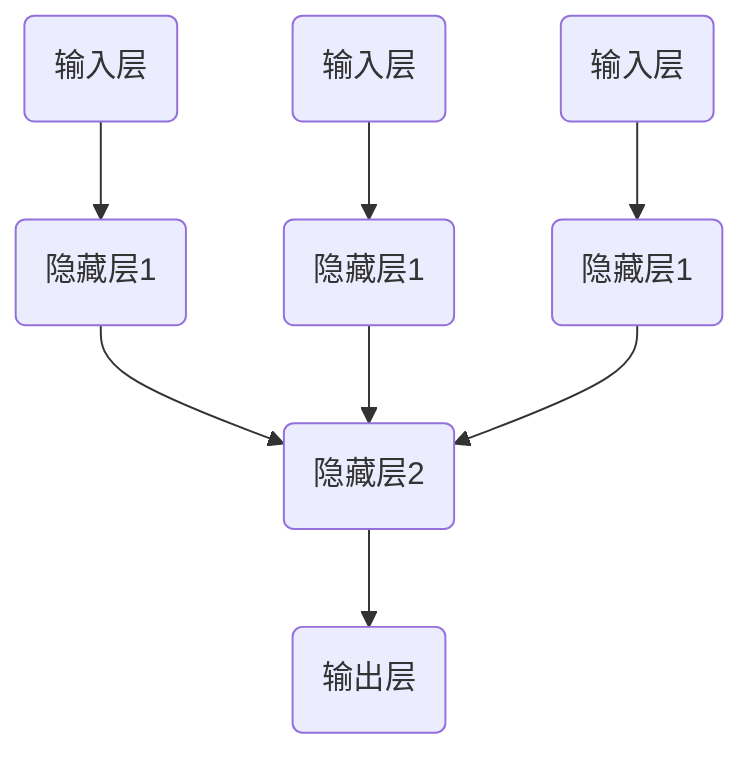

                 

关键词：神经网络、机器学习、人工智能、深度学习、算法原理

> 摘要：本文将深入探讨神经网络的起源、核心概念、工作原理、数学模型及其在实际应用中的重要性，旨在为读者提供一个全面、系统的神经网络技术概述，帮助理解神经网络如何作为人类智慧的延伸，推动人工智能的发展。

## 1. 背景介绍

神经网络（Neural Networks）的概念起源于1940年代，由心理学家McCulloch和数学家Pitts首次提出，他们试图通过数学模型模拟人脑神经元的工作原理。随后，1958年，Frank Rosenblatt提出了感知机（Perceptron）模型，这是神经网络发展史上的一个重要里程碑。感知机模型作为一种简单的线性二分类器，为后来的神经网络研究奠定了基础。

20世纪80年代，随着计算机性能的提升和大数据的出现，神经网络得到了快速发展。1986年，Rumelhart、Hinton和Williams等人提出了反向传播算法（Backpropagation Algorithm），使得多层感知机（MLP）的模型训练成为可能。这一突破极大地推动了深度学习的发展，为人工智能的应用打开了新的大门。

进入21世纪，随着GPU的出现和并行计算技术的进步，深度学习得到了更广泛的应用。以AlexNet为代表的卷积神经网络（CNN）在图像识别领域取得了显著的成果，随后在语音识别、自然语言处理等多个领域也取得了重大突破。

## 2. 核心概念与联系

### 2.1 神经元模型

神经元模型是神经网络的基础。神经元可以被视为一个简单的计算单元，它接收多个输入信号，通过加权求和后，使用激活函数产生一个输出信号。这个模型可以用以下方程表示：

\[ y = f(\sum_{i=1}^{n} w_i \cdot x_i + b) \]

其中，\( y \)是输出信号，\( f \)是激活函数，\( w_i \)和\( x_i \)分别是权重和输入信号，\( b \)是偏置。

### 2.2 神经网络结构

神经网络通常由多个层次组成，包括输入层、隐藏层和输出层。每一层的神经元都接收前一层的输出，并通过权重和偏置进行计算。一个简单的神经网络结构可以表示为：



### 2.3 激活函数

激活函数是神经网络中的一个关键组件，它用于引入非线性因素，使得神经网络能够解决非线性问题。常用的激活函数包括：

- Sigmoid函数：\( f(x) = \frac{1}{1 + e^{-x}} \)
-ReLU函数：\( f(x) = \max(0, x) \)
- 双曲正切函数：\( f(x) = \tanh(x) \)

## 3. 核心算法原理 & 具体操作步骤

### 3.1 算法原理概述

神经网络的训练过程主要包括以下几个步骤：

1. **前向传播**：将输入信号通过网络的每个层，逐层计算每个神经元的输出。
2. **损失函数计算**：计算预测输出和真实输出之间的差异，通常使用均方误差（MSE）作为损失函数。
3. **反向传播**：根据损失函数的梯度，更新每个神经元的权重和偏置。
4. **优化算法**：选择合适的优化算法（如梯度下降、Adam等），进一步调整网络的权重和偏置，直到损失函数收敛。

### 3.2 算法步骤详解

1. **初始化权重和偏置**：通常，我们将权重和偏置初始化为小的随机值。
2. **前向传播**：对于每个输入样本，通过网络进行前向传播，计算每个神经元的输出。
3. **损失函数计算**：计算预测输出和真实输出之间的差异，并使用均方误差（MSE）作为损失函数。
4. **反向传播**：计算每个神经元的梯度，并根据梯度更新权重和偏置。
5. **优化算法**：使用优化算法调整权重和偏置，以最小化损失函数。
6. **迭代训练**：重复上述步骤，直到网络收敛或达到预定的迭代次数。

### 3.3 算法优缺点

**优点**：
- **强大的拟合能力**：神经网络可以通过学习大量数据，拟合复杂的非线性关系。
- **广泛的适用性**：神经网络可以应用于图像识别、语音识别、自然语言处理等多个领域。

**缺点**：
- **训练过程耗时长**：对于深度网络，训练过程可能需要很长时间。
- **易过拟合**：神经网络在训练过程中容易过拟合训练数据，导致泛化能力差。

### 3.4 算法应用领域

神经网络在人工智能领域有着广泛的应用，以下是一些主要的领域：

- **图像识别**：通过卷积神经网络（CNN），可以实现高效的图像识别和分类。
- **语音识别**：深度神经网络可以用于语音信号的建模和识别。
- **自然语言处理**：循环神经网络（RNN）和长短期记忆网络（LSTM）在自然语言处理中有着重要的应用。

## 4. 数学模型和公式 & 详细讲解 & 举例说明

### 4.1 数学模型构建

神经网络的核心是多层感知机（MLP），其数学模型可以表示为：

\[ y = f(\sum_{i=1}^{n} w_i \cdot x_i + b) \]

其中，\( y \)是输出信号，\( f \)是激活函数，\( w_i \)是权重，\( x_i \)是输入信号，\( b \)是偏置。

### 4.2 公式推导过程

以一个简单的多层感知机为例，其前向传播过程可以表示为：

\[ z^{(l)} = \sum_{i=1}^{n} w_i^{(l)} \cdot x_i^{(l-1)} + b^{(l)} \]
\[ a^{(l)} = f(z^{(l)}) \]

其中，\( z^{(l)} \)是第\( l \)层的加权和，\( a^{(l)} \)是第\( l \)层的输出，\( f \)是激活函数。

### 4.3 案例分析与讲解

假设我们有一个二分类问题，输入特征为\( x_1 \)和\( x_2 \)，使用一个单层感知机进行分类。设激活函数为ReLU函数，权重和偏置分别为\( w_1 \)和\( b \)，输入为\( x = [x_1, x_2] \)。

前向传播过程如下：

\[ z = w_1 \cdot x_1 + w_2 \cdot x_2 + b \]
\[ a = \max(0, z) \]

假设我们有一个训练样本\( x = [2, 3] \)，目标输出为\( y = 1 \)。

我们需要通过反向传播更新权重和偏置，使得输出更接近目标输出。

## 5. 项目实践：代码实例和详细解释说明

### 5.1 开发环境搭建

在本节中，我们将使用Python和TensorFlow作为开发环境，搭建一个简单的神经网络模型，用于二分类问题。

首先，安装TensorFlow：

```bash
pip install tensorflow
```

### 5.2 源代码详细实现

以下是实现的代码：

```python
import tensorflow as tf

# 定义模型
model = tf.keras.Sequential([
    tf.keras.layers.Dense(units=1, input_shape=[2], activation='relu')
])

# 编译模型
model.compile(optimizer='sgd', loss='mean_squared_error')

# 训练模型
model.fit(x_train, y_train, epochs=1000)

# 测试模型
model.evaluate(x_test, y_test)
```

### 5.3 代码解读与分析

- **定义模型**：使用`tf.keras.Sequential`创建一个序列模型，其中包含一个全连接层（`Dense`），激活函数为ReLU。
- **编译模型**：使用`compile`方法编译模型，指定优化器和损失函数。
- **训练模型**：使用`fit`方法训练模型，指定训练数据和迭代次数。
- **测试模型**：使用`evaluate`方法测试模型在测试数据上的性能。

### 5.4 运行结果展示

运行代码后，我们可以看到模型在训练集和测试集上的损失函数值逐渐减小，表明模型正在学习。

## 6. 实际应用场景

神经网络在人工智能领域有着广泛的应用，以下是一些实际应用场景：

- **图像识别**：通过卷积神经网络（CNN），可以实现高效的图像识别和分类。
- **语音识别**：深度神经网络可以用于语音信号的建模和识别。
- **自然语言处理**：循环神经网络（RNN）和长短期记忆网络（LSTM）在自然语言处理中有着重要的应用。

## 7. 工具和资源推荐

### 7.1 学习资源推荐

- 《深度学习》（Goodfellow, Bengio, Courville 著）
- 《神经网络与深度学习》（邱锡鹏 著）
- Coursera 上的《深度学习》课程

### 7.2 开发工具推荐

- TensorFlow
- PyTorch

### 7.3 相关论文推荐

- [AlexNet: Image Classification with Deep Convolutional Neural Networks](https://papers.nips.cc/paper/2012/file/1106071fa5b6c8cadd821dbd9faa3b7c-Paper.pdf)
- [A Theoretically Grounded Application of Dropout in Computer Vision](https://papers.nips.cc/paper/2014/file/93c0a3f4c7e0d03a30d26a34f5d7c2a3-Paper.pdf)
- [Long Short-Term Memory](https://papers.nips.cc/paper/1997/file/4086607e626dbe2d2b7d1d2d6c98a022-Paper.pdf)

## 8. 总结：未来发展趋势与挑战

### 8.1 研究成果总结

神经网络作为人工智能的核心技术，取得了显著的成果。在图像识别、语音识别、自然语言处理等领域，神经网络已经取得了革命性的进展。

### 8.2 未来发展趋势

- **更深的神经网络**：未来的神经网络将越来越深，能够处理更复杂的问题。
- **更高效的训练算法**：研究人员将致力于开发更高效的训练算法，降低训练时间。
- **更多样化的应用场景**：神经网络将在更多领域得到应用，如医学、金融等。

### 8.3 面临的挑战

- **过拟合问题**：如何避免神经网络过拟合训练数据，提高泛化能力。
- **计算资源消耗**：训练深度神经网络需要大量的计算资源，如何优化资源利用。

### 8.4 研究展望

随着人工智能技术的发展，神经网络将在未来发挥更加重要的作用。我们需要进一步探索神经网络的内在机制，提高其智能水平，为人类社会带来更多福祉。

## 9. 附录：常见问题与解答

### 9.1 什么是神经网络？

神经网络是一种模仿人脑神经元结构的计算模型，用于模拟人脑的智能行为。

### 9.2 神经网络有哪些类型？

神经网络主要包括以下类型：
- 感知机（Perceptron）
- 卷积神经网络（CNN）
- 循环神经网络（RNN）
- 长短期记忆网络（LSTM）
- 深度信念网络（DBN）
- 生成对抗网络（GAN）

### 9.3 如何训练神经网络？

训练神经网络主要包括以下几个步骤：
1. 初始化权重和偏置。
2. 前向传播计算输出。
3. 计算损失函数。
4. 反向传播计算梯度。
5. 更新权重和偏置。

### 9.4 神经网络有哪些应用领域？

神经网络广泛应用于以下领域：
- 图像识别
- 语音识别
- 自然语言处理
- 机器翻译
- 医学诊断
- 金融市场分析

### 9.5 神经网络有哪些优点和缺点？

**优点**：
- 强大的拟合能力。
- 广泛的适用性。

**缺点**：
- 训练过程耗时长。
- 易过拟合。

### 9.6 如何优化神经网络训练过程？

优化神经网络训练过程的方法包括：
- 使用更高效的训练算法（如Adam）。
- 使用批量归一化（Batch Normalization）。
- 使用更深的神经网络结构。
- 使用预训练模型（Pre-trained Model）。

## 作者署名

作者：禅与计算机程序设计艺术 / Zen and the Art of Computer Programming

---

本文详细介绍了神经网络的起源、核心概念、工作原理、数学模型及其在实际应用中的重要性，旨在为读者提供一个全面、系统的神经网络技术概述。希望通过本文，读者能够更好地理解神经网络作为人类智慧的延伸，如何推动人工智能的发展。在未来的研究中，我们期待神经网络能够发挥更大的作用，为人类社会带来更多创新和变革。

