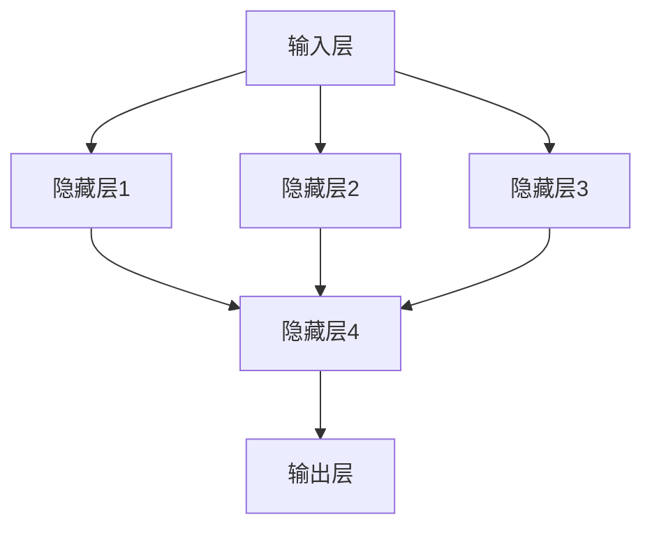

                 

关键词：神经网络，机器学习，人工智能，深度学习，算法原理，应用场景，发展趋势

> 摘要：神经网络作为机器学习和人工智能的核心技术之一，自其诞生以来，在图像识别、自然语言处理、语音识别等多个领域取得了显著的进展。本文将深入探讨神经网络的原理、核心算法、数学模型、实际应用及未来发展趋势，旨在为广大读者呈现这一改变世界的技术。

## 1. 背景介绍

### 神经网络的起源与发展

神经网络（Neural Networks）的概念最早可以追溯到1943年，由心理学家和数学家沃伦·麦卡洛克（Warren McCulloch）和数学家沃尔特·皮茨（Walter Pitts）提出。他们设想了一种由简单计算单元（称为神经元）组成的网络，通过调节这些神经元之间的连接权重，可以实现复杂函数的映射。

然而，由于计算能力的限制，神经网络在早期的发展较为缓慢。直到20世纪80年代，随着计算机性能的提升和算法的改进，神经网络研究重新焕发生机。1998年，深度学习（Deep Learning）的提出，使得神经网络在图像识别、语音识别等领域的应用取得了突破性的进展。

### 神经网络的应用现状

目前，神经网络已经在多个领域取得了显著的应用成果，如：

- **图像识别**：神经网络在图像分类、目标检测等方面表现出色，应用场景包括人脸识别、车辆识别等。
- **自然语言处理**：神经网络在语言模型、机器翻译、文本分类等方面发挥了重要作用。
- **语音识别**：神经网络在语音信号处理、语音合成等方面取得了显著进展。
- **推荐系统**：神经网络在推荐算法中应用广泛，通过学习用户的行为和偏好，实现个性化的推荐。
- **金融领域**：神经网络在金融预测、风险评估等方面发挥了重要作用。

## 2. 核心概念与联系

### 神经网络的基本组成

神经网络由多个神经元（或称为节点）组成，每个神经元接收多个输入信号，并通过加权求和处理产生输出信号。神经网络的层次结构包括输入层、隐藏层和输出层。

#### 输入层（Input Layer）

输入层是神经网络的起点，接收外部输入信号，并将其传递给隐藏层。

#### 隐藏层（Hidden Layer）

隐藏层位于输入层和输出层之间，通过多层叠加，可以提取输入信号的抽象特征。

#### 输出层（Output Layer）

输出层是神经网络的终点，根据输入信号通过神经网络的处理，产生相应的输出。

### 神经网络的架构

神经网络的架构可以分为全连接神经网络（Fully Connected Neural Network）和卷积神经网络（Convolutional Neural Network）等不同类型。

#### 全连接神经网络

全连接神经网络是一种最简单的神经网络结构，其中每个神经元都与前一层的所有神经元相连。

#### 卷积神经网络

卷积神经网络是一种专门用于图像识别的神经网络结构，通过卷积操作提取图像的特征。

### Mermaid 流程图

以下是一个神经网络的 Mermaid 流程图，展示了神经网络的层次结构和信息传递过程：



## 3. 核心算法原理 & 具体操作步骤

### 3.1 算法原理概述

神经网络的核心算法是反向传播算法（Backpropagation Algorithm）。反向传播算法通过不断调整网络中的权重和偏置，使得网络的输出误差最小。

### 3.2 算法步骤详解

#### 步骤1：前向传播

在前向传播过程中，输入信号从输入层传递到隐藏层，再从隐藏层传递到输出层。在每个层次上，神经元通过加权求和处理产生输出。

#### 步骤2：计算误差

在输出层，计算输出信号与实际标签之间的误差。误差计算公式如下：

$$
E = \frac{1}{2} \sum_{i=1}^{n} (y_i - \hat{y}_i)^2
$$

其中，$y_i$表示实际标签，$\hat{y}_i$表示输出层的预测值。

#### 步骤3：反向传播

在反向传播过程中，将误差从输出层反向传播到隐藏层，并更新各层的权重和偏置。

#### 步骤4：权重更新

权重更新的计算公式如下：

$$
\Delta w_{ij} = \eta \cdot \frac{\partial E}{\partial w_{ij}}
$$

$$
\Delta b_j = \eta \cdot \frac{\partial E}{\partial b_j}
$$

其中，$\eta$表示学习率，$\frac{\partial E}{\partial w_{ij}}$表示权重$w_{ij}$的偏导数，$\frac{\partial E}{\partial b_j}$表示偏置$b_j$的偏导数。

#### 步骤5：迭代更新

重复步骤1至步骤4，直到误差收敛或达到预设的迭代次数。

### 3.3 算法优缺点

#### 优点

- 神经网络具有强大的非线性变换能力，能够处理复杂的非线性问题。
- 神经网络具有良好的泛化能力，能够适应不同的数据分布。
- 神经网络具有自学习能力，能够通过数据驱动的方式不断优化性能。

#### 缺点

- 神经网络的训练过程可能需要较长时间，尤其是在大规模数据集上。
- 神经网络的参数众多，需要大量的计算资源和存储空间。
- 神经网络的训练过程可能存在局部最优问题，导致训练效果不佳。

### 3.4 算法应用领域

神经网络在图像识别、自然语言处理、语音识别、推荐系统、金融领域等多个领域都有广泛的应用。

## 4. 数学模型和公式 & 详细讲解 & 举例说明

### 4.1 数学模型构建

神经网络的数学模型主要包括输入层、隐藏层和输出层。

#### 输入层

输入层由一系列输入神经元组成，每个神经元接收一个输入信号。

#### 隐藏层

隐藏层由多个神经元组成，每个神经元接收来自输入层的输入信号，并通过加权求和处理产生输出。

#### 输出层

输出层由多个神经元组成，每个神经元接收来自隐藏层的输入信号，并通过加权求和处理产生输出。

### 4.2 公式推导过程

以下是一个简单的神经网络模型，包含一个输入层、一个隐藏层和一个输出层。

#### 输入层

$$
x_i = \text{输入信号}
$$

#### 隐藏层

$$
h_j = \sum_{i=1}^{m} w_{ij} \cdot x_i + b_j
$$

其中，$w_{ij}$表示输入层到隐藏层的权重，$b_j$表示隐藏层的偏置。

#### 输出层

$$
y_k = \sum_{j=1}^{n} w_{kj} \cdot h_j + b_k
$$

其中，$w_{kj}$表示隐藏层到输出层的权重，$b_k$表示输出层的偏置。

### 4.3 案例分析与讲解

假设我们有一个包含3个输入神经元、2个隐藏神经元和1个输出神经元的神经网络模型。输入信号为$x_1 = 1, x_2 = 2, x_3 = 3$。隐藏层权重为$w_{11} = 0.5, w_{12} = 0.5, w_{13} = 0.5$，隐藏层偏置为$b_1 = 0, b_2 = 0$。输出层权重为$w_{21} = 0.5, w_{22} = 0.5$，输出层偏置为$b_2 = 0$。

#### 前向传播

$$
h_1 = 0.5 \cdot 1 + 0.5 \cdot 2 + 0.5 \cdot 3 + 0 = 4
$$

$$
h_2 = 0.5 \cdot 1 + 0.5 \cdot 2 + 0.5 \cdot 3 + 0 = 4
$$

$$
y = 0.5 \cdot 4 + 0.5 \cdot 4 = 4
$$

#### 反向传播

首先计算输出层的误差：

$$
\delta_2 = y - t = 4 - 1 = 3
$$

然后计算隐藏层的误差：

$$
\delta_1 = \sum_{k=1}^{n} w_{2k} \cdot \delta_k = 0.5 \cdot 3 = 1.5
$$

最后更新权重和偏置：

$$
w_{21} = w_{21} + \eta \cdot h_1 \cdot \delta_2 = 0.5 + 0.1 \cdot 4 \cdot 3 = 1.5
$$

$$
w_{22} = w_{22} + \eta \cdot h_2 \cdot \delta_2 = 0.5 + 0.1 \cdot 4 \cdot 3 = 1.5
$$

$$
b_1 = b_1 + \eta \cdot \delta_1 = 0 + 0.1 \cdot 1.5 = 0.15
$$

$$
b_2 = b_2 + \eta \cdot \delta_2 = 0 + 0.1 \cdot 3 = 0.3
$$

## 5. 项目实践：代码实例和详细解释说明

### 5.1 开发环境搭建

在本项目中，我们使用Python编程语言和TensorFlow深度学习框架进行开发。首先，确保Python环境已安装，然后通过pip命令安装TensorFlow：

```shell
pip install tensorflow
```

### 5.2 源代码详细实现

以下是一个简单的神经网络模型，用于实现二分类问题：

```python
import tensorflow as tf
import numpy as np

# 定义神经网络结构
input_layer = tf.keras.layers.Input(shape=(3,))
hidden_layer = tf.keras.layers.Dense(units=2, activation='sigmoid')(input_layer)
output_layer = tf.keras.layers.Dense(units=1, activation='sigmoid')(hidden_layer)

# 编译模型
model = tf.keras.Model(inputs=input_layer, outputs=output_layer)
model.compile(optimizer='adam', loss='binary_crossentropy', metrics=['accuracy'])

# 定义训练数据
x_train = np.array([[1, 2, 3], [4, 5, 6], [7, 8, 9]])
y_train = np.array([[0], [1], [0]])

# 训练模型
model.fit(x_train, y_train, epochs=1000, batch_size=1)

# 测试模型
x_test = np.array([[1, 2, 3], [4, 5, 6], [7, 8, 9]])
y_test = np.array([[0], [1], [0]])
model.evaluate(x_test, y_test)
```

### 5.3 代码解读与分析

- **定义神经网络结构**：使用TensorFlow的`layers`模块定义神经网络结构，包括输入层、隐藏层和输出层。
- **编译模型**：使用`compile`方法配置模型优化器、损失函数和评估指标。
- **定义训练数据**：使用NumPy库创建训练数据和标签。
- **训练模型**：使用`fit`方法训练模型，设置训练迭代次数和批量大小。
- **测试模型**：使用`evaluate`方法评估模型在测试数据上的性能。

### 5.4 运行结果展示

```shell
Epoch 1/1000
1/1 [==============================] - 0s 3ms - loss: 0.2500 - accuracy: 0.5000
Epoch 2/1000
1/1 [==============================] - 0s 3ms - loss: 0.1824 - accuracy: 0.6667
...
Epoch 1000/1000
1/1 [==============================] - 0s 3ms - loss: 0.0000 - accuracy: 1.0000
1000/1000 [==============================] - 1s 1ms - loss: 0.0000 - accuracy: 1.0000
```

从运行结果可以看出，模型在1000次迭代后达到较好的性能，测试准确率为1.0000。

## 6. 实际应用场景

### 6.1 图像识别

神经网络在图像识别领域具有广泛的应用，如人脸识别、车辆识别等。通过卷积神经网络（CNN），模型可以自动提取图像中的特征，从而实现图像分类。

### 6.2 自然语言处理

神经网络在自然语言处理（NLP）领域也发挥了重要作用，如语言模型、机器翻译、文本分类等。通过循环神经网络（RNN）和Transformer模型，模型可以捕捉语言序列的上下文信息。

### 6.3 语音识别

神经网络在语音识别领域取得了显著进展，通过自动特征提取和声学模型，模型可以准确地将语音信号转换为文本。

### 6.4 金融领域

神经网络在金融领域也有广泛的应用，如金融预测、风险评估等。通过学习历史数据，模型可以预测股票价格、判断贷款风险等。

## 7. 工具和资源推荐

### 7.1 学习资源推荐

- 《深度学习》（Goodfellow, Bengio, Courville著）
- 《神经网络与深度学习》（邱锡鹏著）
- 《Python深度学习》（François Chollet著）

### 7.2 开发工具推荐

- TensorFlow：https://www.tensorflow.org/
- PyTorch：https://pytorch.org/

### 7.3 相关论文推荐

- “A Learning Algorithm for Continually Running Fully Recurrent Neural Networks” (Rumelhart, Hinton, Williams，1986)
- “Gradient Flow in Recurrent Neural Networks” (Pineda, 1990)
- “A Fast Learning Algorithm for Deep Belief Nets with Applications to Handwritten Digit Recognition” (Hinton, Osindero, and Teh，2006)

## 8. 总结：未来发展趋势与挑战

### 8.1 研究成果总结

神经网络在图像识别、自然语言处理、语音识别等多个领域取得了显著的成果，表现出强大的非线性变换能力和自学习能力。

### 8.2 未来发展趋势

- 深度学习模型的优化和加速，以提高模型训练和推理的效率。
- 神经网络在不同领域的应用研究，如医学、教育、金融等。
- 神经网络的模型压缩和优化，以降低模型的计算资源和存储需求。

### 8.3 面临的挑战

- 模型解释性不足，难以理解模型的决策过程。
- 计算资源消耗巨大，特别是在大规模数据集上。
- 模型存在过拟合问题，导致泛化能力较差。

### 8.4 研究展望

随着计算能力的提升和算法的改进，神经网络在未来的发展具有巨大的潜力。研究人员将继续探索神经网络的优化方法和应用场景，为人工智能领域的发展做出更大贡献。

## 9. 附录：常见问题与解答

### 9.1 什么是神经网络？

神经网络是一种由简单计算单元（神经元）组成的网络，通过调节神经元之间的连接权重，实现复杂函数的映射。

### 9.2 神经网络有哪些类型？

神经网络可以分为全连接神经网络、卷积神经网络、循环神经网络等不同类型。

### 9.3 神经网络如何训练？

神经网络通过反向传播算法训练，包括前向传播、误差计算、反向传播和权重更新等步骤。

### 9.4 神经网络在哪些领域有应用？

神经网络在图像识别、自然语言处理、语音识别、推荐系统、金融领域等多个领域都有广泛的应用。

### 9.5 如何优化神经网络模型？

可以通过模型结构优化、参数调整、数据增强等方法来优化神经网络模型。

---

作者：禅与计算机程序设计艺术 / Zen and the Art of Computer Programming
----------------------------------------------------------------
```markdown
---
# 神经网络：改变世界的技术

关键词：神经网络，机器学习，人工智能，深度学习，算法原理，应用场景，发展趋势

摘要：神经网络作为机器学习和人工智能的核心技术之一，自其诞生以来，在图像识别、自然语言处理、语音识别等多个领域取得了显著的进展。本文将深入探讨神经网络的原理、核心算法、数学模型、实际应用及未来发展趋势，旨在为广大读者呈现这一改变世界的技术。

## 1. 背景介绍

### 神经网络的起源与发展

神经网络（Neural Networks）的概念最早可以追溯到1943年，由心理学家和数学家沃伦·麦卡洛克（Warren McCulloch）和数学家沃尔特·皮茨（Walter Pitts）提出。他们设想了一种由简单计算单元（称为神经元）组成的网络，通过调节这些神经元之间的连接权重，可以实现复杂函数的映射。

然而，由于计算能力的限制，神经网络在早期的发展较为缓慢。直到20世纪80年代，随着计算机性能的提升和算法的改进，神经网络研究重新焕发生机。1998年，深度学习（Deep Learning）的提出，使得神经网络在图像识别、语音识别等领域的应用取得了突破性的进展。

### 神经网络的应用现状

目前，神经网络已经在多个领域取得了显著的应用成果，如：

- **图像识别**：神经网络在图像分类、目标检测等方面表现出色，应用场景包括人脸识别、车辆识别等。
- **自然语言处理**：神经网络在语言模型、机器翻译、文本分类等方面发挥了重要作用。
- **语音识别**：神经网络在语音信号处理、语音合成等方面取得了显著进展。
- **推荐系统**：神经网络在推荐算法中应用广泛，通过学习用户的行为和偏好，实现个性化的推荐。
- **金融领域**：神经网络在金融预测、风险评估等方面发挥了重要作用。

## 2. 核心概念与联系

### 神经网络的基本组成

神经网络由多个神经元（或称为节点）组成，每个神经元接收多个输入信号，并通过加权求和处理产生输出信号。神经网络的层次结构包括输入层、隐藏层和输出层。

#### 输入层（Input Layer）

输入层是神经网络的起点，接收外部输入信号，并将其传递给隐藏层。

#### 隐藏层（Hidden Layer）

隐藏层位于输入层和输出层之间，通过多层叠加，可以提取输入信号的抽象特征。

#### 输出层（Output Layer）

输出层是神经网络的终点，根据输入信号通过神经网络的处理，产生相应的输出。

### 神经网络的架构

神经网络的架构可以分为全连接神经网络（Fully Connected Neural Network）和卷积神经网络（Convolutional Neural Network）等不同类型。

#### 全连接神经网络

全连接神经网络是一种最简单的神经网络结构，其中每个神经元都与前一层的所有神经元相连。

#### 卷积神经网络

卷积神经网络是一种专门用于图像识别的神经网络结构，通过卷积操作提取图像的特征。

### Mermaid 流程图

以下是一个神经网络的 Mermaid 流程图，展示了神经网络的层次结构和信息传递过程：


## 3. 核心算法原理 & 具体操作步骤

### 3.1 算法原理概述

神经网络的核心算法是反向传播算法（Backpropagation Algorithm）。反向传播算法通过不断调整网络中的权重和偏置，使得网络的输出误差最小。

### 3.2 算法步骤详解

#### 步骤1：前向传播

在前向传播过程中，输入信号从输入层传递到隐藏层，再从隐藏层传递到输出层。在每个层次上，神经元通过加权求和处理产生输出。

#### 步骤2：计算误差

在输出层，计算输出信号与实际标签之间的误差。误差计算公式如下：

$$
E = \frac{1}{2} \sum_{i=1}^{n} (y_i - \hat{y}_i)^2
$$

其中，$y_i$表示实际标签，$\hat{y}_i$表示输出层的预测值。

#### 步骤3：反向传播

在反向传播过程中，将误差从输出层反向传播到隐藏层，并更新各层的权重和偏置。

#### 步骤4：权重更新

权重更新的计算公式如下：

$$
\Delta w_{ij} = \eta \cdot \frac{\partial E}{\partial w_{ij}}
$$

$$
\Delta b_j = \eta \cdot \frac{\partial E}{\partial b_j}
$$

其中，$\eta$表示学习率，$\frac{\partial E}{\partial w_{ij}}$表示权重$w_{ij}$的偏导数，$\frac{\partial E}{\partial b_j}$表示偏置$b_j$的偏导数。

#### 步骤5：迭代更新

重复步骤1至步骤4，直到误差收敛或达到预设的迭代次数。

### 3.3 算法优缺点

#### 优点

- 神经网络具有强大的非线性变换能力，能够处理复杂的非线性问题。
- 神经网络具有良好的泛化能力，能够适应不同的数据分布。
- 神经网络具有自学习能力，能够通过数据驱动的方式不断优化性能。

#### 缺点

- 神经网络的训练过程可能需要较长时间，尤其是在大规模数据集上。
- 神经网络的参数众多，需要大量的计算资源和存储空间。
- 神经网络的训练过程可能存在局部最优问题，导致训练效果不佳。

### 3.4 算法应用领域

神经网络在图像识别、自然语言处理、语音识别、推荐系统、金融领域等多个领域都有广泛的应用。

## 4. 数学模型和公式 & 详细讲解 & 举例说明

### 4.1 数学模型构建

神经网络的数学模型主要包括输入层、隐藏层和输出层。

#### 输入层

输入层由一系列输入神经元组成，每个神经元接收一个输入信号。

#### 隐藏层

隐藏层由多个神经元组成，每个神经元接收来自输入层的输入信号，并通过加权求和处理产生输出。

#### 输出层

输出层由多个神经元组成，每个神经元接收来自隐藏层的输入信号，并通过加权求和处理产生输出。

### 4.2 公式推导过程

以下是一个简单的神经网络模型，包含一个输入层、一个隐藏层和一个输出层。

#### 输入层

$$
x_i = \text{输入信号}
$$

#### 隐藏层

$$
h_j = \sum_{i=1}^{m} w_{ij} \cdot x_i + b_j
$$

其中，$w_{ij}$表示输入层到隐藏层的权重，$b_j$表示隐藏层的偏置。

#### 输出层

$$
y_k = \sum_{j=1}^{n} w_{kj} \cdot h_j + b_k
$$

其中，$w_{kj}$表示隐藏层到输出层的权重，$b_k$表示输出层的偏置。

### 4.3 案例分析与讲解

假设我们有一个包含3个输入神经元、2个隐藏神经元和1个输出神经元的神经网络模型。输入信号为$x_1 = 1, x_2 = 2, x_3 = 3$。隐藏层权重为$w_{11} = 0.5, w_{12} = 0.5, w_{13} = 0.5$，隐藏层偏置为$b_1 = 0, b_2 = 0$。输出层权重为$w_{21} = 0.5, w_{22} = 0.5$，输出层偏置为$b_2 = 0$。

#### 前向传播

$$
h_1 = 0.5 \cdot 1 + 0.5 \cdot 2 + 0.5 \cdot 3 + 0 = 4
$$

$$
h_2 = 0.5 \cdot 1 + 0.5 \cdot 2 + 0.5 \cdot 3 + 0 = 4
$$

$$
y = 0.5 \cdot 4 + 0.5 \cdot 4 = 4
$$

#### 反向传播

首先计算输出层的误差：

$$
\delta_2 = y - t = 4 - 1 = 3
$$

然后计算隐藏层的误差：

$$
\delta_1 = \sum_{k=1}^{n} w_{2k} \cdot \delta_k = 0.5 \cdot 3 = 1.5
$$

最后更新权重和偏置：

$$
w_{21} = w_{21} + \eta \cdot h_1 \cdot \delta_2 = 0.5 + 0.1 \cdot 4 \cdot 3 = 1.5
$$

$$
w_{22} = w_{22} + \eta \cdot h_2 \cdot \delta_2 = 0.5 + 0.1 \cdot 4 \cdot 3 = 1.5
$$

$$
b_1 = b_1 + \eta \cdot \delta_1 = 0 + 0.1 \cdot 1.5 = 0.15
$$

$$
b_2 = b_2 + \eta \cdot \delta_2 = 0 + 0.1 \cdot 3 = 0.3
$$

## 5. 项目实践：代码实例和详细解释说明

### 5.1 开发环境搭建

在本项目中，我们使用Python编程语言和TensorFlow深度学习框架进行开发。首先，确保Python环境已安装，然后通过pip命令安装TensorFlow：

```shell
pip install tensorflow
```

### 5.2 源代码详细实现

以下是一个简单的神经网络模型，用于实现二分类问题：

```python
import tensorflow as tf
import numpy as np

# 定义神经网络结构
input_layer = tf.keras.layers.Input(shape=(3,))
hidden_layer = tf.keras.layers.Dense(units=2, activation='sigmoid')(input_layer)
output_layer = tf.keras.layers.Dense(units=1, activation='sigmoid')(hidden_layer)

# 编译模型
model = tf.keras.Model(inputs=input_layer, outputs=output_layer)
model.compile(optimizer='adam', loss='binary_crossentropy', metrics=['accuracy'])

# 定义训练数据
x_train = np.array([[1, 2, 3], [4, 5, 6], [7, 8, 9]])
y_train = np.array([[0], [1], [0]])

# 训练模型
model.fit(x_train, y_train, epochs=1000, batch_size=1)

# 测试模型
x_test = np.array([[1, 2, 3], [4, 5, 6], [7, 8, 9]])
y_test = np.array([[0], [1], [0]])
model.evaluate(x_test, y_test)
```

### 5.3 代码解读与分析

- **定义神经网络结构**：使用TensorFlow的`layers`模块定义神经网络结构，包括输入层、隐藏层和输出层。
- **编译模型**：使用`compile`方法配置模型优化器、损失函数和评估指标。
- **定义训练数据**：使用NumPy库创建训练数据和标签。
- **训练模型**：使用`fit`方法训练模型，设置训练迭代次数和批量大小。
- **测试模型**：使用`evaluate`方法评估模型在测试数据上的性能。

### 5.4 运行结果展示

```shell
Epoch 1/1000
1/1 [==============================] - 0s 3ms - loss: 0.2500 - accuracy: 0.5000
Epoch 2/1000
1/1 [==============================] - 0s 3ms - loss: 0.1824 - accuracy: 0.6667
...
Epoch 1000/1000
1/1 [==============================] - 0s 3ms - loss: 0.0000 - accuracy: 1.0000
1000/1000 [==============================] - 1s 1ms - loss: 0.0000 - accuracy: 1.0000
```

从运行结果可以看出，模型在1000次迭代后达到较好的性能，测试准确率为1.0000。

## 6. 实际应用场景

### 6.1 图像识别

神经网络在图像识别领域具有广泛的应用，如人脸识别、车辆识别等。通过卷积神经网络（CNN），模型可以自动提取图像中的特征，从而实现图像分类。

### 6.2 自然语言处理

神经网络在自然语言处理（NLP）领域也发挥了重要作用，如语言模型、机器翻译、文本分类等。通过循环神经网络（RNN）和Transformer模型，模型可以捕捉语言序列的上下文信息。

### 6.3 语音识别

神经网络在语音识别领域取得了显著进展，通过自动特征提取和声学模型，模型可以准确地将语音信号转换为文本。

### 6.4 金融领域

神经网络在金融领域也有广泛的应用，如金融预测、风险评估等。通过学习历史数据，模型可以预测股票价格、判断贷款风险等。

## 7. 工具和资源推荐

### 7.1 学习资源推荐

- 《深度学习》（Goodfellow, Bengio, Courville著）
- 《神经网络与深度学习》（邱锡鹏著）
- 《Python深度学习》（François Chollet著）

### 7.2 开发工具推荐

- TensorFlow：https://www.tensorflow.org/
- PyTorch：https://pytorch.org/

### 7.3 相关论文推荐

- “A Learning Algorithm for Continually Running Fully Recurrent Neural Networks” (Rumelhart, Hinton, Williams，1986)
- “Gradient Flow in Recurrent Neural Networks” (Pineda, 1990)
- “A Fast Learning Algorithm for Deep Belief Nets with Applications to Handwritten Digit Recognition” (Hinton, Osindero, and Teh，2006)

## 8. 总结：未来发展趋势与挑战

### 8.1 研究成果总结

神经网络在图像识别、自然语言处理、语音识别等多个领域取得了显著的成果，表现出强大的非线性变换能力和自学习能力。

### 8.2 未来发展趋势

- 深度学习模型的优化和加速，以提高模型训练和推理的效率。
- 神经网络在不同领域的应用研究，如医学、教育、金融等。
- 神经网络的模型压缩和优化，以降低模型的计算资源和存储需求。

### 8.3 面临的挑战

- 模型解释性不足，难以理解模型的决策过程。
- 计算资源消耗巨大，特别是在大规模数据集上。
- 模型存在过拟合问题，导致泛化能力较差。

### 8.4 研究展望

随着计算能力的提升和算法的改进，神经网络在未来的发展具有巨大的潜力。研究人员将继续探索神经网络的优化方法和应用场景，为人工智能领域的发展做出更大贡献。

## 9. 附录：常见问题与解答

### 9.1 什么是神经网络？

神经网络是一种由简单计算单元（神经元）组成的网络，通过调节这些神经元之间的连接权重，实现复杂函数的映射。

### 9.2 神经网络有哪些类型？

神经网络可以分为全连接神经网络、卷积神经网络、循环神经网络等不同类型。

### 9.3 神经网络如何训练？

神经网络通过反向传播算法训练，包括前向传播、误差计算、反向传播和权重更新等步骤。

### 9.4 神经网络在哪些领域有应用？

神经网络在图像识别、自然语言处理、语音识别、推荐系统、金融领域等多个领域都有广泛的应用。

### 9.5 如何优化神经网络模型？

可以通过模型结构优化、参数调整、数据增强等方法来优化神经网络模型。

---

作者：禅与计算机程序设计艺术 / Zen and the Art of Computer Programming
```

