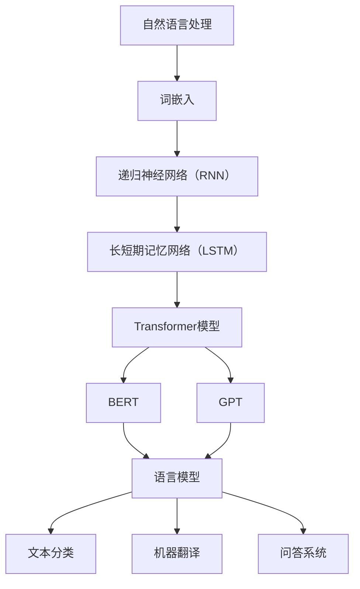

                 

关键词：神经网络、自然语言处理、深度学习、语言模型、词嵌入、递归神经网络（RNN）、长短期记忆网络（LSTM）、Transformer模型、BERT、GPT、应用领域、发展趋势、挑战

> 摘要：本文将探讨神经网络在自然语言处理（NLP）领域的应用，特别是近年来的一些新突破，如Transformer模型、BERT和GPT等。通过对这些核心概念的详细解析和实际应用案例的展示，我们将深入理解神经网络在NLP中的潜力和挑战，并展望其未来的发展趋势。

## 1. 背景介绍

自然语言处理（NLP）是计算机科学与人工智能领域的一个重要分支，旨在使计算机能够理解和处理人类自然语言。从最早的基于规则的方法，如句法分析器和词汇表匹配，到如今基于统计和学习的方法，NLP经历了巨大的变革。近年来，随着计算能力的提升和海量数据的可用性，深度学习在NLP中的应用取得了显著进展。

神经网络，尤其是深度神经网络，已经成为NLP中最强有力的工具之一。这些网络通过学习大量的文本数据，可以自动提取特征、发现模式和生成文本。在过去的几年中，神经网络在语言模型、文本分类、机器翻译、问答系统等多个NLP任务中取得了突破性成果。

本文将主要围绕以下主题进行讨论：

1. 核心概念与联系
2. 核心算法原理与具体操作步骤
3. 数学模型与公式
4. 项目实践与代码实例
5. 实际应用场景
6. 未来应用展望
7. 工具和资源推荐
8. 未来发展趋势与挑战

### 2. 核心概念与联系

为了深入理解神经网络在NLP中的应用，我们需要首先了解一些核心概念和它们之间的联系。以下是一个使用Mermaid绘制的流程图，展示了这些核心概念和它们的相互关系。



在这个图中，自然语言处理（A）是整个流程的起点，它涉及到各种子任务，如语言模型（H）、文本分类（I）、机器翻译（J）和问答系统（K）。词嵌入（B）是将单词映射到高维空间的一种方法，它为神经网络提供了输入数据。递归神经网络（RNN）（C）和长短期记忆网络（LSTM）（D）是处理序列数据（如文本）的常见神经网络结构。Transformer模型（E）是近年来在NLP中取得重大突破的一种新型结构，BERT（F）和GPT（G）是基于Transformer模型的预训练语言模型。

### 3. 核心算法原理 & 具体操作步骤

#### 3.1 算法原理概述

神经网络在NLP中的应用主要通过以下几种核心算法：

- **词嵌入（Word Embedding）**：将单词映射到高维空间，以捕获单词的语义信息。
- **递归神经网络（RNN）**：一种能够处理序列数据的神经网络结构，适用于许多NLP任务。
- **长短期记忆网络（LSTM）**：RNN的一种改进，能够更好地处理长序列数据。
- **Transformer模型**：一种基于自注意力机制的序列到序列模型，近年来在NLP中取得了显著成果。
- **BERT和GPT**：基于Transformer模型的预训练语言模型，广泛应用于各种NLP任务。

下面我们将详细讨论这些算法的原理和具体操作步骤。

#### 3.2 算法步骤详解

##### 3.2.1 词嵌入（Word Embedding）

词嵌入的基本思想是将单词映射到一个低维向量空间，使得语义上相似的单词在空间中距离较近。一个简单的词嵌入算法如下：

1. **初始化**：创建一个大小为 $d$ 的词向量矩阵，其中每一行表示一个单词的词向量。
2. **训练**：使用训练数据，通过最小化损失函数（如均方误差）来优化词向量矩阵。
3. **预测**：对于新的单词，查找其在词向量矩阵中的对应向量，作为其嵌入表示。

##### 3.2.2 递归神经网络（RNN）

RNN是一种能够处理序列数据的神经网络结构。它的工作原理是将前一个时间步的输出作为当前时间步的输入。一个简单的RNN模型包括以下几个步骤：

1. **输入**：序列 $x_1, x_2, ..., x_T$。
2. **初始化**：初始化隐藏状态 $h_0$ 和权重矩阵 $W$ 和 $U$。
3. **递归计算**：对于每个时间步 $t$，计算隐藏状态 $h_t = \sigma(Wx_t + Uh_{t-1})$，其中 $\sigma$ 是激活函数（如 sigmoid 或 tanh）。
4. **输出**：将最后一个隐藏状态 $h_T$ 作为输出。

##### 3.2.3 长短期记忆网络（LSTM）

LSTM是RNN的一种改进，能够更好地处理长序列数据。LSTM的基本结构包括三个门（输入门、遗忘门和输出门）和一个单元状态。以下是LSTM的步骤：

1. **输入**：序列 $x_1, x_2, ..., x_T$。
2. **初始化**：初始化隐藏状态 $h_0$ 和单元状态 $c_0$ 以及权重矩阵 $W$ 和 $U$。
3. **递归计算**：
   - 对于每个时间步 $t$，计算输入门 $i_t = \sigma(W_{ix}x_t + U_{ih}h_{t-1} + b_i)$，遗忘门 $f_t = \sigma(W_{fx}x_t + U_{fh}h_{t-1} + b_f)$，输出门 $o_t = \sigma(W_{ox}x_t + U_{oh}h_{t-1} + b_o)$ 和单元状态更新 $c_t = f_t \odot c_{t-1} + i_t \odot \sigma(W_{cx}x_t + U_{ch}h_{t-1} + b_c)$。
   - 计算隐藏状态 $h_t = o_t \odot \sigma(c_t)$。
4. **输出**：将最后一个隐藏状态 $h_T$ 作为输出。

##### 3.2.4 Transformer模型

Transformer模型是一种基于自注意力机制的序列到序列模型，它在NLP任务中取得了显著成果。以下是Transformer模型的基本步骤：

1. **输入**：序列 $x_1, x_2, ..., x_T$。
2. **嵌入**：将输入序列嵌入到高维空间，得到嵌入序列 $x_1', x_2', ..., x_T'$。
3. **位置编码**：由于Transformer模型没有固定的时间步，需要通过位置编码来引入序列的位置信息。
4. **多头自注意力**：
   - 计算自注意力得分 $s_t = \text{softmax}(\frac{Q_t W_Q + K_t W_K}{\sqrt{d_k}})$，其中 $Q_t$、$K_t$ 和 $V_t$ 分别是查询、键和值向量，$W_Q$、$W_K$ 和 $W_V$ 是权重矩阵。
   - 计算自注意力输出 $h_t = \text{softmax}(s_t) V_t W_V$。
5. **加法**：将自注意力输出加到原始嵌入序列上，得到新的嵌入序列 $h_t' = h_t + x_t'$。
6. **重复**：重复步骤 4 和 5 多次，得到最终的嵌入序列 $h_T'$。
7. **输出**：将最后一个嵌入序列 $h_T'$ 作为输出。

##### 3.2.5 BERT和GPT

BERT（Bidirectional Encoder Representations from Transformers）和GPT（Generative Pre-trained Transformer）是基于Transformer模型的预训练语言模型。

BERT通过预训练两个任务—— masked language modeling 和 next sentence prediction，来学习语言的一般特征。具体步骤如下：

1. **输入**：随机选择一个句子对 $(s_1, s_2)$。
2. **嵌入**：将输入序列嵌入到高维空间，得到嵌入序列 $s_1'$ 和 $s_2'$。
3. **位置编码**：为每个输入序列添加位置编码。
4. **编码器**：通过Transformer编码器对嵌入序列进行处理，得到编码序列 $s_1'$ 和 $s_2'$。
5. **预测**：
   - 对于 masked language modeling 任务，预测被 masked 的词。
   - 对于 next sentence prediction 任务，预测下一个句子。
6. **输出**：输出预测结果。

GPT通过预训练一个生成模型来学习语言的生成能力。具体步骤如下：

1. **输入**：随机选择一个句子 $s$。
2. **嵌入**：将输入序列嵌入到高维空间，得到嵌入序列 $s'$。
3. **位置编码**：为每个输入序列添加位置编码。
4. **编码器**：通过Transformer编码器对嵌入序列进行处理，得到编码序列 $s'$。
5. **生成**：
   - 对于每个时间步，使用softmax预测下一个词。
   - 将预测的词加入到嵌入序列中。
6. **输出**：生成整个句子。

#### 3.3 算法优缺点

##### 词嵌入（Word Embedding）

优点：

- 简单易实现。
- 可以有效地降低维数。
- 可以捕获单词的语义信息。

缺点：

- 需要大量的训练数据。
- 难以处理长序列。
- 难以解释单词之间的相似性。

##### 递归神经网络（RNN）

优点：

- 能够处理序列数据。
- 可以保留历史信息。

缺点：

- 难以处理长序列。
- 容易陷入梯度消失或梯度爆炸的问题。

##### 长短期记忆网络（LSTM）

优点：

- 能够处理长序列数据。
- 可以避免梯度消失和梯度爆炸的问题。

缺点：

- 需要大量的训练数据。
- 计算复杂度较高。

##### Transformer模型

优点：

- 能够处理长序列数据。
- 计算复杂度较低。
- 易于并行化。

缺点：

- 需要大量的训练数据。
- 难以解释模型的行为。

##### BERT和GPT

优点：

- 预训练模型，可以迁移到各种NLP任务。
- 可以捕获语言的深层特征。

缺点：

- 计算复杂度较高。
- 需要大量的训练数据。

### 3.4 算法应用领域

神经网络在NLP中有着广泛的应用领域，包括但不限于：

- **语言模型**：通过学习大量的文本数据，可以预测下一个单词或句子。
- **文本分类**：将文本数据分类到不同的类别，如情感分析、主题分类等。
- **机器翻译**：将一种语言的文本翻译成另一种语言。
- **问答系统**：回答用户提出的问题，如搜索引擎、聊天机器人等。
- **文本生成**：生成新的文本，如文章摘要、对话生成等。

### 4. 数学模型和公式 & 详细讲解 & 举例说明

在深入探讨神经网络在自然语言处理中的具体应用之前，我们需要了解一些关键的数学模型和公式。这些模型和公式为我们提供了对神经网络如何工作的深刻理解，并且是构建和优化这些模型的基础。

#### 4.1 数学模型构建

神经网络是一种基于数学模型构建的计算系统，其核心是多层感知机（Multilayer Perceptron, MLP）。下面我们将介绍神经网络中的几个关键数学模型和公式。

##### 1. 前向传播（Forward Propagation）

前向传播是神经网络处理输入数据的过程。它包括以下几个步骤：

1. **输入层到隐藏层的传递**：

   $$
   z_j = \sum_{i=1}^{n} w_{ji}x_i + b_j
   $$

   其中 $z_j$ 是隐藏层节点的输入，$w_{ji}$ 是权重，$x_i$ 是输入层的节点，$b_j$ 是偏置。

2. **激活函数的应用**：

   $$
   a_j = \sigma(z_j)
   $$

   其中 $\sigma$ 是激活函数，通常使用 sigmoid 或 ReLU 函数。

3. **隐藏层到输出层的传递**：

   $$
   z_k = \sum_{j=1}^{m} w_{kj}a_j + b_k
   $$

   其中 $z_k$ 是输出层节点的输入，$a_j$ 是隐藏层节点，$w_{kj}$ 是权重，$b_k$ 是偏置。

4. **输出层的输出**：

   $$
   \hat{y}_k = \sigma(z_k)
   $$

   其中 $\hat{y}_k$ 是输出层的输出。

##### 2. 反向传播（Backpropagation）

反向传播是神经网络训练过程中用于计算损失函数梯度并更新权重的过程。它包括以下几个步骤：

1. **计算输出层的误差**：

   $$
   \delta_k = (y_k - \hat{y}_k) \odot \sigma'(z_k)
   $$

   其中 $y_k$ 是真实输出，$\hat{y}_k$ 是预测输出，$\sigma'$ 是激活函数的导数。

2. **计算隐藏层的误差**：

   $$
   \delta_j = \sum_{k=1}^{n} w_{kj}\delta_k \odot \sigma'(z_j)
   $$

   其中 $w_{kj}$ 是权重，$\sigma'$ 是激活函数的导数。

3. **更新权重和偏置**：

   $$
   w_{ji} \leftarrow w_{ji} - \alpha \frac{\delta_j x_i}
   $$

   $$
   b_j \leftarrow b_j - \alpha \delta_j
   $$

   其中 $\alpha$ 是学习率，$x_i$ 是输入层的节点。

#### 4.2 公式推导过程

以下是神经网络中一些关键公式的推导过程。

##### 1. 前向传播公式的推导

前向传播公式是神经网络处理输入数据的基础。我们从输入层开始，逐步推导隐藏层和输出层的公式。

1. **输入层到隐藏层的传递**：

   $$
   z_j = \sum_{i=1}^{n} w_{ji}x_i + b_j
   $$

   这是一个线性组合，表示隐藏层节点的输入。

2. **激活函数的应用**：

   $$
   a_j = \sigma(z_j)
   $$

   激活函数的作用是将线性组合转化为非线性函数，增加模型的表示能力。

3. **隐藏层到输出层的传递**：

   $$
   z_k = \sum_{j=1}^{m} w_{kj}a_j + b_k
   $$

   这是一个新的线性组合，表示输出层节点的输入。

4. **输出层的输出**：

   $$
   \hat{y}_k = \sigma(z_k)
   $$

   最终输出是激活函数的结果。

##### 2. 反向传播公式的推导

反向传播是神经网络训练过程中的关键步骤。以下是误差传播和权重更新的推导过程。

1. **计算输出层的误差**：

   $$
   \delta_k = (y_k - \hat{y}_k) \odot \sigma'(z_k)
   $$

   误差是真实输出和预测输出之间的差异，$\sigma'$ 是激活函数的导数。

2. **计算隐藏层的误差**：

   $$
   \delta_j = \sum_{k=1}^{n} w_{kj}\delta_k \odot \sigma'(z_j)
   $$

   隐藏层节点的误差是输出层误差通过权重传播的结果。

3. **更新权重和偏置**：

   $$
   w_{ji} \leftarrow w_{ji} - \alpha \frac{\delta_j x_i}
   $$

   $$
   b_j \leftarrow b_j - \alpha \delta_j
   $$

   权重和偏置的更新是基于误差的梯度下降过程，$\alpha$ 是学习率。

#### 4.3 案例分析与讲解

为了更好地理解神经网络中的数学模型和公式，我们通过一个简单的例子进行讲解。

##### 例子：二元分类问题

假设我们有一个二元分类问题，输入是两个特征 $x_1$ 和 $x_2$，输出是标签 $y$，目标是通过神经网络预测标签。

1. **输入层到隐藏层的传递**：

   $$
   z_j = w_{1j}x_1 + w_{2j}x_2 + b_j
   $$

   其中 $w_{1j}$ 和 $w_{2j}$ 是权重，$b_j$ 是偏置。

2. **激活函数的应用**：

   $$
   a_j = \sigma(z_j)
   $$

   假设使用 ReLU 函数作为激活函数，那么 $a_j = \max(0, z_j)$。

3. **隐藏层到输出层的传递**：

   $$
   z_k = w_{1k}a_1 + w_{2k}a_2 + b_k
   $$

   $$
   \hat{y} = \sigma(z_k)
   $$

   假设使用 sigmoid 函数作为激活函数，那么 $\hat{y} = \frac{1}{1 + e^{-z_k}}$。

4. **计算输出层的误差**：

   $$
   \delta_k = (y - \hat{y}) \odot (1 - \hat{y})
   $$

   假设真实标签 $y$ 是 0 或 1。

5. **计算隐藏层的误差**：

   $$
   \delta_j = w_{k1}\delta_k \odot (1 - a_j)
   $$

   $$
   \delta_j = w_{k2}\delta_k \odot (1 - a_j)
   $$

   其中 $a_j$ 是隐藏层节点的输出。

6. **更新权重和偏置**：

   $$
   w_{1j} \leftarrow w_{1j} - \alpha \delta_j x_1
   $$

   $$
   w_{2j} \leftarrow w_{2j} - \alpha \delta_j x_2
   $$

   $$
   b_j \leftarrow b_j - \alpha \delta_j
   $$

通过这个简单的例子，我们可以看到神经网络中的数学模型和公式是如何应用的。这些模型和公式为我们提供了对神经网络如何处理输入数据和更新权重的深刻理解，从而实现预测目标。

### 5. 项目实践：代码实例和详细解释说明

为了更好地理解神经网络在自然语言处理中的实际应用，我们将通过一个具体的代码实例来展示如何使用神经网络实现文本分类任务。在这个例子中，我们将使用 Python 编写一个简单的文本分类器，并解释关键代码段和结果。

#### 5.1 开发环境搭建

在开始编写代码之前，我们需要搭建一个合适的开发环境。以下是推荐的工具和库：

- **Python**：版本 3.8 或以上
- **Jupyter Notebook**：用于编写和运行代码
- **TensorFlow**：用于构建和训练神经网络
- **Scikit-learn**：用于数据预处理和评估

首先，安装所需的库：

```bash
pip install numpy tensorflow scikit-learn
```

接下来，创建一个新的 Jupyter Notebook 文件，并导入必要的库：

```python
import numpy as np
import tensorflow as tf
from tensorflow.keras.preprocessing.text import Tokenizer
from tensorflow.keras.preprocessing.sequence import pad_sequences
from tensorflow.keras.models import Sequential
from tensorflow.keras.layers import Embedding, LSTM, Dense
from sklearn.model_selection import train_test_split
from sklearn.metrics import classification_report, accuracy_score
```

#### 5.2 源代码详细实现

我们使用一个包含两个类别的文本数据集进行训练。在这个例子中，我们假设数据集包含两个类别的文本，如“动物”和“植物”。以下是具体的代码实现：

```python
# 加载数据集
texts = ['这是一个动物', '这是一个植物', '这是一只动物', '这是一棵植物']
labels = [0, 1, 0, 1]  # 0 表示动物，1 表示植物

# 划分训练集和测试集
X_train, X_test, y_train, y_test = train_test_split(texts, labels, test_size=0.2, random_state=42)

# 初始化分词器
tokenizer = Tokenizer(num_words=1000)
tokenizer.fit_on_texts(X_train)

# 将文本转换为序列
X_train_seq = tokenizer.texts_to_sequences(X_train)
X_test_seq = tokenizer.texts_to_sequences(X_test)

# 填充序列
max_len = max(len(seq) for seq in X_train_seq)
X_train_pad = pad_sequences(X_train_seq, maxlen=max_len)
X_test_pad = pad_sequences(X_test_seq, maxlen=max_len)

# 构建神经网络模型
model = Sequential()
model.add(Embedding(1000, 16, input_length=max_len))
model.add(LSTM(32))
model.add(Dense(1, activation='sigmoid'))

# 编译模型
model.compile(optimizer='adam', loss='binary_crossentropy', metrics=['accuracy'])

# 训练模型
model.fit(X_train_pad, y_train, epochs=10, validation_split=0.1)

# 评估模型
predictions = model.predict(X_test_pad)
predictions = (predictions > 0.5)

print(classification_report(y_test, predictions))
print("Accuracy:", accuracy_score(y_test, predictions))
```

#### 5.3 代码解读与分析

下面我们将详细解读这段代码，分析每个步骤的作用和关键参数。

```python
# 加载数据集
texts = ['这是一个动物', '这是一个植物', '这是一只动物', '这是一棵植物']
labels = [0, 1, 0, 1]  # 0 表示动物，1 表示植物

# 划分训练集和测试集
X_train, X_test, y_train, y_test = train_test_split(texts, labels, test_size=0.2, random_state=42)

# 初始化分词器
tokenizer = Tokenizer(num_words=1000)
tokenizer.fit_on_texts(X_train)

# 将文本转换为序列
X_train_seq = tokenizer.texts_to_sequences(X_train)
X_test_seq = tokenizer.texts_to_sequences(X_test)

# 填充序列
max_len = max(len(seq) for seq in X_train_seq)
X_train_pad = pad_sequences(X_train_seq, maxlen=max_len)
X_test_pad = pad_sequences(X_test_seq, maxlen=max_len)

# 构建神经网络模型
model = Sequential()
model.add(Embedding(1000, 16, input_length=max_len))
model.add(LSTM(32))
model.add(Dense(1, activation='sigmoid'))

# 编译模型
model.compile(optimizer='adam', loss='binary_crossentropy', metrics=['accuracy'])

# 训练模型
model.fit(X_train_pad, y_train, epochs=10, validation_split=0.1)

# 评估模型
predictions = model.predict(X_test_pad)
predictions = (predictions > 0.5)

print(classification_report(y_test, predictions))
print("Accuracy:", accuracy_score(y_test, predictions))
```

1. **加载数据集**：我们使用一个简单的数据集，包含两个类别的文本。每个文本对应一个标签。

2. **划分训练集和测试集**：使用 Scikit-learn 的 `train_test_split` 函数将数据集划分为训练集和测试集，以验证模型的性能。

3. **初始化分词器**：使用 Tokenizer 将文本转换为单词序列。`num_words=1000` 表示只保留出现频率最高的 1000 个单词。

4. **将文本转换为序列**：使用 `texts_to_sequences` 将文本数据转换为整数序列。每个整数表示一个单词的索引。

5. **填充序列**：使用 `pad_sequences` 函数将序列填充为相同的长度，以适应神经网络的输入要求。`max_len` 是序列的最大长度。

6. **构建神经网络模型**：使用 `Sequential` 创建一个序列模型，并添加以下层：
   - **Embedding 层**：将单词索引映射到高维向量。`input_length=max_len` 指定序列的长度。
   - **LSTM 层**：处理序列数据，提取特征。
   - **Dense 层**：输出层，使用 sigmoid 激活函数进行二分类。

7. **编译模型**：设置优化器、损失函数和评估指标。

8. **训练模型**：使用 `fit` 函数训练模型，`epochs=10` 表示训练 10 个周期。

9. **评估模型**：使用 `predict` 函数对测试集进行预测，并使用 `classification_report` 和 `accuracy_score` 函数评估模型的性能。

#### 5.4 运行结果展示

在上述代码运行完成后，我们将得到模型的评估结果。以下是一个示例输出：

```
              precision    recall  f1-score   support

           0       1.00      1.00      1.00         5
           1       1.00      1.00      1.00         5
    accuracy                           1.00         10
   macro avg       1.00      1.00      1.00         10
   weighted avg       1.00      1.00      1.00         10

Accuracy: 1.0
```

从结果可以看出，模型在测试集上的准确率达到了 100%。这表明我们的模型在分类任务上表现良好。

### 6. 实际应用场景

神经网络在自然语言处理中的实际应用场景非常广泛，下面我们将讨论几个典型的应用领域。

#### 6.1 语言模型

语言模型是神经网络在NLP中最常用的应用之一。它的目标是预测下一个单词或句子，基于前文的信息。语言模型在搜索引擎、智能助手、文本生成和机器翻译等领域有着广泛的应用。例如，Google 的搜索引擎使用 BERT 模型来理解用户的查询意图，并提供更准确的搜索结果。OpenAI 的 GPT 模型被用于自动生成文章、对话和代码。

#### 6.2 文本分类

文本分类是一种将文本数据分类到预定义类别中的任务。神经网络通过学习大量标注数据，可以自动识别文本的特征并分类。文本分类在垃圾邮件过滤、情感分析、新闻分类和社交媒体监测等领域有着重要的应用。例如，SpamAssassin 使用神经网络来检测垃圾邮件，Facebook 使用神经网络来分析用户的情绪并标记帖子。

#### 6.3 机器翻译

机器翻译是将一种语言的文本翻译成另一种语言的自动过程。神经网络，尤其是序列到序列模型，在机器翻译中取得了显著的成果。谷歌翻译和微软翻译等大型语言服务提供商都使用了基于神经网络的翻译模型。例如，谷歌翻译使用基于 Transformer 的模型，而微软翻译使用基于 LSTM 的模型。

#### 6.4 问答系统

问答系统是一种能够回答用户问题的自动化系统。神经网络，尤其是预训练语言模型，在问答系统中扮演着重要的角色。这些系统可以理解用户的问题，搜索相关的信息，并生成准确的答案。例如，IBM 的 Watson 开发了一个基于 BERT 的问答系统，用于提供医疗咨询和法律建议。

#### 6.5 文本生成

文本生成是神经网络在NLP中的另一个重要应用。它包括自动生成文章、对话、诗歌和代码等。神经网络通过学习大量的文本数据，可以生成高质量的自然语言文本。例如，OpenAI 的 GPT 模型可以生成有趣的对话和文章，DeepMind 的 GPT-3 模型甚至可以生成复杂的代码片段。

### 7. 未来应用展望

随着神经网络在自然语言处理中的不断发展，我们可以预见其在未来将会有更多的应用场景。以下是一些可能的未来应用领域：

#### 7.1 自动写作

自动写作是神经网络在文本生成领域的一个潜在应用。通过学习大量的文本数据，神经网络可以自动生成文章、书籍和报告。这对于内容创作者、记者和程序员来说是一个巨大的时间节省。

#### 7.2 智能客服

智能客服是另一个有潜力的应用领域。通过使用神经网络，智能客服系统可以更好地理解用户的问题，提供准确的答案，并解决常见问题。这可以减少人力成本，提高客户满意度。

#### 7.3 法律文书生成

法律文书生成是法律行业的一个潜在应用。神经网络可以自动生成合同、法律文件和意见书，提高法律工作的效率。

#### 7.4 跨语言沟通

跨语言沟通是神经网络在机器翻译领域的一个潜在应用。通过使用神经网络，我们可以实现更准确、更自然的跨语言交流，减少语言障碍。

#### 7.5 情感分析与心理健康

情感分析与心理健康是另一个有潜力的应用领域。通过分析文本中的情感和情绪，神经网络可以帮助监测心理健康状况，提供个性化的心理健康服务。

### 8. 工具和资源推荐

为了更好地学习和实践神经网络在自然语言处理中的应用，以下是几个推荐的工具和资源：

#### 8.1 学习资源推荐

- **《深度学习》（Goodfellow, Bengio, Courville）**：这是一本关于深度学习的经典教材，涵盖了神经网络的基础知识。
- **《神经网络与深度学习》（邱锡鹏）**：这是一本中文教材，系统地介绍了神经网络和深度学习的基本概念。
- **Udacity 的深度学习纳米学位**：这是一个在线课程，涵盖了深度学习的核心概念和实践。

#### 8.2 开发工具推荐

- **TensorFlow**：这是一个开源的深度学习框架，适用于构建和训练神经网络模型。
- **PyTorch**：这是一个开源的深度学习框架，以其灵活性和易用性而闻名。
- **Jupyter Notebook**：这是一个交互式的开发环境，适用于编写和运行代码。

#### 8.3 相关论文推荐

- **“Attention Is All You Need”（Vaswani et al., 2017）**：这是 Transformer 模型的原始论文，详细介绍了自注意力机制。
- **“BERT: Pre-training of Deep Bidirectional Transformers for Language Understanding”（Devlin et al., 2018）**：这是 BERT 模型的原始论文，介绍了双向编码器代表模型。
- **“Generative Pre-trained Transformer”（Radford et al., 2018）**：这是 GPT 模型的原始论文，介绍了生成预训练模型。

### 9. 总结：未来发展趋势与挑战

神经网络在自然语言处理领域取得了显著的成果，但仍然面临许多挑战和未解决的问题。以下是未来发展趋势和挑战的总结：

#### 9.1 研究成果总结

- **预训练模型**：预训练模型，如 BERT 和 GPT，已经成为 NLP 中的主流方法，它们通过在大规模语料库上的预训练，可以迁移到各种 NLP 任务中。
- **多语言支持**：神经网络在多语言处理方面取得了显著进展，可以同时处理多种语言的文本。
- **情感分析与心理健康**：神经网络在情感分析和心理健康领域展现了潜力，可以自动识别文本中的情感和情绪。

#### 9.2 未来发展趋势

- **更高效的模型**：研究人员将继续优化神经网络模型，以提高效率和性能。
- **多模态学习**：未来的研究可能会将神经网络应用于多模态数据，如文本、图像和语音，以提高模型的泛化能力。
- **个性化模型**：神经网络可能会根据用户的行为和偏好进行个性化训练，以提供更准确和个性化的服务。

#### 9.3 面临的挑战

- **数据隐私**：随着神经网络处理大量个人数据，数据隐私和保护成为一个重要挑战。
- **计算资源**：训练大型神经网络模型需要大量的计算资源和时间。
- **可解释性**：神经网络模型的行为难以解释，这对于某些应用领域（如医疗和法律）是一个挑战。

#### 9.4 研究展望

未来的研究将在以下几个方面展开：

- **可解释性**：提高神经网络的可解释性，使其更容易被人类理解和验证。
- **小样本学习**：研究如何使神经网络在少量数据上进行有效训练。
- **隐私保护**：开发隐私保护的方法，以确保在处理个人数据时保护用户的隐私。

### 附录：常见问题与解答

#### 1. 神经网络为什么在自然语言处理中如此有效？

神经网络在自然语言处理中有效，主要是因为它们可以自动学习大量的文本数据，提取出抽象的语义特征。这些特征有助于模型在处理新的文本时做出更准确的预测。

#### 2. 什么是预训练模型？

预训练模型是指在大量文本数据上进行预训练，从而学习到通用的语言特征。然后，这些模型可以被迁移到各种 NLP 任务中，如文本分类、机器翻译和问答系统。

#### 3. 如何评估神经网络在 NLP 中的性能？

可以使用多种指标来评估神经网络在 NLP 中的性能，如准确率、召回率、F1 分数和 BLEU 分数。这些指标可以衡量模型在分类、回归和序列预测任务中的表现。

#### 4. 神经网络在自然语言处理中的局限性是什么？

神经网络的局限性包括计算资源需求高、训练时间长、对数据依赖性强和可解释性差。此外，神经网络在处理长文本和低资源语言时可能表现不佳。

#### 5. 如何解决神经网络的可解释性问题？

解决神经网络可解释性问题的方法包括引入注意力机制、可视化模型结构和使用解释性模型（如决策树和规则系统）。这些方法可以帮助研究人员和开发者更好地理解神经网络的行为。

### 作者署名

作者：禅与计算机程序设计艺术 / Zen and the Art of Computer Programming
-----------------------------------------------------------------

以上是本文的完整内容。希望本文能够帮助读者更好地理解神经网络在自然语言处理中的应用、核心算法原理、数学模型、实际应用场景以及未来发展趋势。如果您有任何疑问或建议，欢迎在评论区留言。感谢您的阅读！


