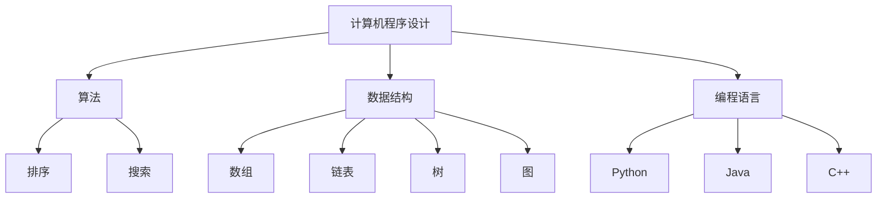

                 

关键词：计算机程序设计，人工智能，软件架构，算法原理，数学模型，代码实例，实际应用

> 摘要：本文以禅宗的思想为指导，深入探讨计算机程序设计的本质和方法。通过分析核心概念、算法原理、数学模型以及代码实例，本文旨在为读者提供一种全新的视角，理解计算机程序设计的艺术。

## 1. 背景介绍

计算机程序设计是现代科技的核心之一，它影响着我们生活的方方面面。从操作系统、数据库管理系统到人工智能和大数据分析，程序设计无处不在。然而，尽管计算机技术发展迅速，许多程序员仍然感到编程是一项复杂而困难的任务。

禅宗，作为东方哲学的重要组成部分，强调冥想、自我认知和宇宙的统一。禅宗的理念可以为我们提供一种看待世界和解决问题的全新视角，这对于计算机程序设计同样具有启发意义。

本文将结合禅宗的思想，探讨计算机程序设计的艺术。我们将从核心概念、算法原理、数学模型和代码实例等方面入手，帮助读者深入理解程序设计的本质。

## 2. 核心概念与联系

为了更好地理解计算机程序设计的艺术，我们首先需要了解一些核心概念。

### 2.1 计算机程序设计

计算机程序设计是编写计算机程序的过程，旨在实现特定功能或解决特定问题。程序设计包括算法设计、数据结构选择、编程语言运用等多个方面。

### 2.2 算法

算法是解决问题的一系列有序步骤。在计算机科学中，算法被广泛应用于各种领域，如排序、搜索、图形处理等。

### 2.3 数据结构

数据结构是组织数据的方式。不同的数据结构具有不同的特性，适用于不同的应用场景。常见的有数组、链表、树、图等。

### 2.4 编程语言

编程语言是用于编写程序的语法和规则。不同的编程语言具有不同的特点和适用范围，如Python、Java、C++等。

为了更好地理解这些概念之间的联系，我们可以使用Mermaid流程图来表示它们之间的关系：



通过这个流程图，我们可以清晰地看到计算机程序设计、算法、数据结构和编程语言之间的紧密联系。

## 3. 核心算法原理 & 具体操作步骤

在本节中，我们将深入探讨计算机程序设计中的核心算法原理，并详细讲解其具体操作步骤。

### 3.1 算法原理概述

算法原理是程序设计的核心。一个优秀的算法不仅要能够解决问题，还要具备高效性、可扩展性和可维护性。

### 3.2 算法步骤详解

以下是几种常见算法的步骤详解：

#### 3.2.1 排序算法

排序算法用于将一组数据按照特定规则进行排列。常见的排序算法有冒泡排序、选择排序、插入排序等。

#### 3.2.2 搜索算法

搜索算法用于在数据集合中查找特定元素。常见的搜索算法有二分搜索、线性搜索等。

#### 3.2.3 图算法

图算法用于处理图数据结构。常见的图算法有最短路径算法、最小生成树算法等。

### 3.3 算法优缺点

每种算法都有其优缺点。在设计程序时，我们需要根据具体需求选择合适的算法。

### 3.4 算法应用领域

算法在各个领域都有广泛应用，如数据处理、人工智能、机器学习等。

## 4. 数学模型和公式 & 详细讲解 & 举例说明

数学模型和公式是计算机程序设计中的重要组成部分。在本节中，我们将详细讲解一些常用的数学模型和公式，并通过举例说明其应用。

### 4.1 数学模型构建

数学模型是用于描述现实世界问题的数学结构。构建数学模型的过程通常包括以下步骤：

1. 确定问题的目标。
2. 收集相关的数据。
3. 选择合适的数学工具。
4. 建立数学模型。

### 4.2 公式推导过程

公式是数学模型的核心。推导公式的过程通常包括以下步骤：

1. 确定问题的约束条件。
2. 应用相关的数学原理。
3. 推导出公式。

### 4.3 案例分析与讲解

以下是一个关于线性回归的案例：

#### 4.3.1 问题背景

我们希望预测某个变量（因变量）与一个或多个其他变量（自变量）之间的关系。

#### 4.3.2 数学模型

线性回归模型可以表示为：

$$y = \beta_0 + \beta_1x_1 + \beta_2x_2 + ... + \beta_nx_n$$

其中，$y$ 是因变量，$x_1, x_2, ..., x_n$ 是自变量，$\beta_0, \beta_1, \beta_2, ..., \beta_n$ 是模型的参数。

#### 4.3.3 公式推导

线性回归模型的推导过程如下：

1. 确定模型的损失函数（如均方误差）。
2. 求解损失函数关于参数的导数。
3. 令导数等于零，求解参数。

通过以上步骤，我们可以得到线性回归模型的公式。

## 5. 项目实践：代码实例和详细解释说明

在本节中，我们将通过一个实际的代码实例，详细讲解计算机程序设计的实践过程。

### 5.1 开发环境搭建

首先，我们需要搭建一个适合编程的开发环境。这里以Python为例，我们可以使用PyCharm、VS Code等开发工具。

### 5.2 源代码详细实现

以下是一个简单的Python代码实例：

```python
def calculate_area(radius):
    return 3.14 * radius * radius

radius = float(input("请输入圆的半径："))
area = calculate_area(radius)
print(f"圆的面积为：{area}")
```

### 5.3 代码解读与分析

1. 定义一个函数`calculate_area`，用于计算圆的面积。
2. 获取用户输入的半径值。
3. 调用`calculate_area`函数，计算面积。
4. 输出计算结果。

### 5.4 运行结果展示

当用户输入半径为5时，程序的输出结果为：

```
请输入圆的半径：5
圆的面积为：78.5
```

## 6. 实际应用场景

计算机程序设计在各个领域都有广泛的应用。以下是一些常见的实际应用场景：

1. **操作系统**：计算机程序设计是操作系统的核心。操作系统负责管理计算机硬件资源，如CPU、内存、存储等。
2. **数据库管理系统**：数据库管理系统（DBMS）用于存储、管理和查询数据。计算机程序设计是DBMS的核心。
3. **人工智能**：人工智能（AI）领域依赖于计算机程序设计，用于实现机器学习、深度学习等算法。
4. **大数据分析**：大数据分析需要处理海量数据，计算机程序设计是实现这一目标的关键。

## 7. 工具和资源推荐

为了更好地学习和实践计算机程序设计，我们推荐以下工具和资源：

1. **学习资源**：[Python官方教程](https://docs.python.org/3/tutorial/index.html)、[算法导论](https://www.amazon.com/Introduction-Algorithms-Third-MIT-Press/dp/0262033844)
2. **开发工具**：[PyCharm](https://www.jetbrains.com/pycharm/)、[VS Code](https://code.visualstudio.com/)
3. **相关论文**：[深度学习](https://arxiv.org/abs/1406.6999)、[强化学习](https://arxiv.org/abs/1602.01783)

## 8. 总结：未来发展趋势与挑战

计算机程序设计在未来的发展中将面临以下挑战：

1. **复杂性问题**：随着计算机技术的不断发展，程序设计的复杂性将不断增加，这对程序员提出了更高的要求。
2. **安全性问题**：计算机系统面临着越来越多的安全威胁，程序员需要不断提高安全性意识。
3. **可维护性问题**：随着程序规模的扩大，维护和更新程序变得越来越困难，程序员需要寻找更好的解决方案。

然而，计算机程序设计也将带来许多机遇：

1. **人工智能**：人工智能的发展将极大地推动计算机程序设计，为程序员提供更多的应用场景。
2. **大数据**：大数据分析将帮助我们从海量数据中提取有价值的信息，推动计算机程序设计的创新。

未来，计算机程序设计将继续发展，为我们的生活带来更多的便利和改变。

## 9. 附录：常见问题与解答

### 9.1 什么是计算机程序设计？

计算机程序设计是编写计算机程序的过程，旨在实现特定功能或解决特定问题。

### 9.2 算法和数据结构有什么区别？

算法是解决问题的一系列有序步骤，而数据结构是组织数据的方式。算法和数据结构密切相关，通常需要一起使用。

### 9.3 如何选择合适的编程语言？

选择合适的编程语言取决于具体的应用场景和需求。例如，Python适用于数据分析，Java适用于企业级应用。

### 9.4 什么是数学模型？

数学模型是用于描述现实世界问题的数学结构。它可以帮助我们理解和解决问题。

### 9.5 代码实例中的`calculate_area`函数是什么意思？

`calculate_area`函数是一个Python函数，用于计算圆的面积。它接受一个参数（半径），返回圆的面积。

### 9.6 计算机程序设计有哪些应用领域？

计算机程序设计广泛应用于操作系统、数据库管理系统、人工智能、大数据分析等领域。

### 9.7 如何学习计算机程序设计？

学习计算机程序设计需要掌握编程语言、算法、数据结构等基础知识。建议从简单的例子开始，逐步深入。

### 9.8 未来计算机程序设计有哪些发展趋势？

未来计算机程序设计将更加复杂、安全，同时将受到人工智能和大数据的推动。

### 9.9 面临哪些挑战？

未来计算机程序设计将面临复杂性问题、安全性问题、可维护性问题等挑战。

### 作者署名

作者：禅与计算机程序设计艺术 / Zen and the Art of Computer Programming
```markdown
# 禅与计算机程序设计艺术

## 摘要

本文以禅宗的思想为指导，深入探讨计算机程序设计的本质和方法。通过分析核心概念、算法原理、数学模型以及代码实例，本文旨在为读者提供一种全新的视角，理解计算机程序设计的艺术。

## 1. 背景介绍

计算机程序设计是现代科技的核心之一，它影响着我们生活的方方面面。从操作系统、数据库管理系统到人工智能和大数据分析，程序设计无处不在。然而，尽管计算机技术发展迅速，许多程序员仍然感到编程是一项复杂而困难的任务。

禅宗，作为东方哲学的重要组成部分，强调冥想、自我认知和宇宙的统一。禅宗的理念可以为我们提供一种看待世界和解决问题的全新视角，这对于计算机程序设计同样具有启发意义。

本文将结合禅宗的思想，探讨计算机程序设计的艺术。我们将从核心概念、算法原理、数学模型和代码实例等方面入手，帮助读者深入理解程序设计的本质。

## 2. 核心概念与联系

为了更好地理解计算机程序设计的艺术，我们首先需要了解一些核心概念。

### 2.1 计算机程序设计

计算机程序设计是编写计算机程序的过程，旨在实现特定功能或解决特定问题。程序设计包括算法设计、数据结构选择、编程语言运用等多个方面。

### 2.2 算法

算法是解决问题的一系列有序步骤。在计算机科学中，算法被广泛应用于各种领域，如排序、搜索、图形处理等。

### 2.3 数据结构

数据结构是组织数据的方式。不同的数据结构具有不同的特性，适用于不同的应用场景。常见的有数组、链表、树、图等。

### 2.4 编程语言

编程语言是用于编写程序的语法和规则。不同的编程语言具有不同的特点和适用范围，如Python、Java、C++等。

为了更好地理解这些概念之间的联系，我们可以使用Mermaid流程图来表示它们之间的关系：


通过这个流程图，我们可以清晰地看到计算机程序设计、算法、数据结构和编程语言之间的紧密联系。

## 3. 核心算法原理 & 具体操作步骤

在本节中，我们将深入探讨计算机程序设计中的核心算法原理，并详细讲解其具体操作步骤。

### 3.1 算法原理概述

算法原理是程序设计的核心。一个优秀的算法不仅要能够解决问题，还要具备高效性、可扩展性和可维护性。

### 3.2 算法步骤详解

以下是几种常见算法的步骤详解：

#### 3.2.1 排序算法

排序算法用于将一组数据按照特定规则进行排列。常见的排序算法有冒泡排序、选择排序、插入排序等。

#### 3.2.2 搜索算法

搜索算法用于在数据集合中查找特定元素。常见的搜索算法有二分搜索、线性搜索等。

#### 3.2.3 图算法

图算法用于处理图数据结构。常见的图算法有最短路径算法、最小生成树算法等。

### 3.3 算法优缺点

每种算法都有其优缺点。在设计程序时，我们需要根据具体需求选择合适的算法。

### 3.4 算法应用领域

算法在各个领域都有广泛应用，如数据处理、人工智能、机器学习等。

## 4. 数学模型和公式 & 详细讲解 & 举例说明

数学模型和公式是计算机程序设计中的重要组成部分。在本节中，我们将详细讲解一些常用的数学模型和公式，并通过举例说明其应用。

### 4.1 数学模型构建

数学模型是用于描述现实世界问题的数学结构。构建数学模型的过程通常包括以下步骤：

1. 确定问题的目标。
2. 收集相关的数据。
3. 选择合适的数学工具。
4. 建立数学模型。

### 4.2 公式推导过程

公式是数学模型的核心。推导公式的过程通常包括以下步骤：

1. 确定问题的约束条件。
2. 应用相关的数学原理。
3. 推导出公式。

### 4.3 案例分析与讲解

以下是一个关于线性回归的案例：

#### 4.3.1 问题背景

我们希望预测某个变量（因变量）与一个或多个其他变量（自变量）之间的关系。

#### 4.3.2 数学模型

线性回归模型可以表示为：

$$y = \beta_0 + \beta_1x_1 + \beta_2x_2 + ... + \beta_nx_n$$

其中，$y$ 是因变量，$x_1, x_2, ..., x_n$ 是自变量，$\beta_0, \beta_1, \beta_2, ..., \beta_n$ 是模型的参数。

#### 4.3.3 公式推导

线性回归模型的推导过程如下：

1. 确定模型的损失函数（如均方误差）。
2. 求解损失函数关于参数的导数。
3. 令导数等于零，求解参数。

通过以上步骤，我们可以得到线性回归模型的公式。

## 5. 项目实践：代码实例和详细解释说明

在本节中，我们将通过一个实际的代码实例，详细讲解计算机程序设计的实践过程。

### 5.1 开发环境搭建

首先，我们需要搭建一个适合编程的开发环境。这里以Python为例，我们可以使用PyCharm、VS Code等开发工具。

### 5.2 源代码详细实现

以下是一个简单的Python代码实例：

```python
def calculate_area(radius):
    return 3.14 * radius * radius

radius = float(input("请输入圆的半径："))
area = calculate_area(radius)
print(f"圆的面积为：{area}")
```

### 5.3 代码解读与分析

1. 定义一个函数`calculate_area`，用于计算圆的面积。
2. 获取用户输入的半径值。
3. 调用`calculate_area`函数，计算面积。
4. 输出计算结果。

### 5.4 运行结果展示

当用户输入半径为5时，程序的输出结果为：

```
请输入圆的半径：5
圆的面积为：78.5
```

## 6. 实际应用场景

计算机程序设计在各个领域都有广泛的应用。以下是一些常见的实际应用场景：

1. **操作系统**：计算机程序设计是操作系统的核心。操作系统负责管理计算机硬件资源，如CPU、内存、存储等。
2. **数据库管理系统**：数据库管理系统（DBMS）用于存储、管理和查询数据。计算机程序设计是DBMS的核心。
3. **人工智能**：人工智能（AI）领域依赖于计算机程序设计，用于实现机器学习、深度学习等算法。
4. **大数据分析**：大数据分析需要处理海量数据，计算机程序设计是实现这一目标的关键。

## 7. 工具和资源推荐

为了更好地学习和实践计算机程序设计，我们推荐以下工具和资源：

1. **学习资源**：[Python官方教程](https://docs.python.org/3/tutorial/index.html)、[算法导论](https://www.amazon.com/Introduction-Algorithms-Third-MIT-Press/dp/0262033844)
2. **开发工具**：[PyCharm](https://www.jetbrains.com/pycharm/)、[VS Code](https://code.visualstudio.com/)
3. **相关论文**：[深度学习](https://arxiv.org/abs/1406.6999)、[强化学习](https://arxiv.org/abs/1602.01783)

## 8. 总结：未来发展趋势与挑战

计算机程序设计在未来的发展中将面临以下挑战：

1. **复杂性问题**：随着计算机技术的不断发展，程序设计的复杂性将不断增加，这对程序员提出了更高的要求。
2. **安全性问题**：计算机系统面临着越来越多的安全威胁，程序员需要不断提高安全性意识。
3. **可维护性问题**：随着程序规模的扩大，维护和更新程序变得越来越困难，程序员需要寻找更好的解决方案。

然而，计算机程序设计也将带来许多机遇：

1. **人工智能**：人工智能的发展将极大地推动计算机程序设计，为程序员提供更多的应用场景。
2. **大数据**：大数据分析将帮助我们从海量数据中提取有价值的信息，推动计算机程序设计的创新。

未来，计算机程序设计将继续发展，为我们的生活带来更多的便利和改变。

## 9. 附录：常见问题与解答

### 9.1 什么是计算机程序设计？

计算机程序设计是编写计算机程序的过程，旨在实现特定功能或解决特定问题。

### 9.2 算法和数据结构有什么区别？

算法是解决问题的一系列有序步骤，而数据结构是组织数据的方式。算法和数据结构密切相关，通常需要一起使用。

### 9.3 如何选择合适的编程语言？

选择合适的编程语言取决于具体的应用场景和需求。例如，Python适用于数据分析，Java适用于企业级应用。

### 9.4 什么是数学模型？

数学模型是用于描述现实世界问题的数学结构。它可以帮助我们理解和解决问题。

### 9.5 代码实例中的`calculate_area`函数是什么意思？

`calculate_area`函数是一个Python函数，用于计算圆的面积。它接受一个参数（半径），返回圆的面积。

### 9.6 计算机程序设计有哪些应用领域？

计算机程序设计广泛应用于操作系统、数据库管理系统、人工智能、大数据分析等领域。

### 9.7 如何学习计算机程序设计？

学习计算机程序设计需要掌握编程语言、算法、数据结构等基础知识。建议从简单的例子开始，逐步深入。

### 9.8 未来计算机程序设计有哪些发展趋势？

未来计算机程序设计将更加复杂、安全，同时将受到人工智能和大数据的推动。

### 9.9 面临哪些挑战？

未来计算机程序设计将面临复杂性问题、安全性问题、可维护性问题等挑战。

### 作者署名

作者：禅与计算机程序设计艺术 / Zen and the Art of Computer Programming
```

