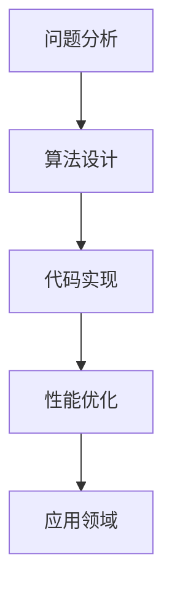

                 

关键词：计算机程序设计、算法原理、数学模型、实践应用、未来展望

> 摘要：本文从禅的哲学出发，探讨了计算机程序设计中的核心概念和算法原理。通过分析数学模型、具体操作步骤以及实践应用，揭示出计算机程序设计艺术的精髓，为读者提供了一种全新的视角和思考方式。

## 1. 背景介绍

### 1.1 禅与计算机科学的交集

禅，源自古老的印度哲学，强调通过冥想和自我反省达到内心的平静与觉悟。而计算机科学，作为现代科技的核心领域，致力于通过编程和算法解决复杂问题。两者看似截然不同，但实际上有着深刻的交集。

在计算机科学中，程序设计不仅需要逻辑思维和算法技巧，更需要一种宁静和专注的心态。正如禅修过程中要求的心无旁骛，程序设计也需要开发者在面对复杂问题时保持冷静和清晰。这种交集为本文提供了独特的视角，将禅的哲学融入计算机程序设计，探索其内在的艺术。

### 1.2 计算机程序设计的重要性

计算机程序设计是计算机科学的核心，它是实现计算机各种功能的基础。无论是操作系统、数据库、网络通信，还是人工智能、机器学习，都离不开程序设计。因此，掌握程序设计艺术对于计算机科学从业者来说至关重要。

然而，随着计算机技术的迅猛发展，程序设计的复杂性也在不断增长。面对庞大的代码库和多样的应用场景，开发者往往感到困惑和无助。本文将从禅的哲学出发，通过深入探讨算法原理和数学模型，帮助读者更好地理解和应用程序设计艺术。

## 2. 核心概念与联系

### 2.1 算法原理概述

算法，是计算机程序设计的核心。它是一种解决问题的方法，通过一系列有序的操作步骤，将输入转化为预期的输出。一个高效的算法能够优化计算资源，提高程序性能。

在计算机科学中，算法原理可以分为多种类型，如排序、搜索、图论、动态规划等。每种算法都有其独特的思想和应用场景。通过了解这些算法原理，开发者可以更好地选择合适的算法来解决实际问题。

### 2.2 算法步骤详解

算法的设计和实现通常包括以下几个步骤：

1. **问题分析**：理解问题的本质和需求，明确算法的目标。
2. **算法设计**：根据问题特点，选择合适的算法类型和策略。
3. **代码实现**：将算法设计转化为具体的代码实现。
4. **性能优化**：对代码进行优化，提高程序性能和效率。

### 2.3 算法优缺点

不同的算法具有不同的优缺点，需要根据具体应用场景进行选择。例如，排序算法中，快速排序具有高效的时间复杂度，但可能会出现最坏情况；而归并排序则具有稳定的性能，但需要额外的存储空间。

### 2.4 算法应用领域

算法在计算机科学的各个领域都有广泛的应用。例如，在人工智能中，深度学习算法用于图像识别和自然语言处理；在数据库中，索引算法用于快速查找；在网络通信中，路由算法用于数据包传输。

### 2.5 Mermaid 流程图

以下是算法原理的 Mermaid 流程图，展示了算法设计的基本步骤：



## 3. 核心算法原理 & 具体操作步骤

### 3.1 算法原理概述

本章节将介绍几个核心算法原理，包括排序算法、搜索算法和图算法。每个算法都将从原理概述、具体操作步骤、优缺点和实际应用领域进行详细讲解。

### 3.2 排序算法

#### 3.2.1 排序算法原理

排序算法是一种将一组数据按照特定顺序排列的算法。常见的排序算法有冒泡排序、选择排序、插入排序、快速排序和归并排序等。

#### 3.2.2 具体操作步骤

1. **冒泡排序**：通过多次遍历待排序的数组，比较相邻的两个元素，并按照指定的顺序交换它们的位置，直到整个数组有序。
2. **选择排序**：每次遍历找到待排序数组中的最小（或最大）元素，将其放到数组的起始位置，直到整个数组有序。
3. **插入排序**：将待排序的数组划分为已排序部分和未排序部分，每次将一个未排序的元素插入到已排序部分的合适位置，直到整个数组有序。
4. **快速排序**：通过递归划分待排序数组，将数组划分为两部分，一部分比基准元素小，另一部分比基准元素大，然后对这两部分分别进行快速排序。
5. **归并排序**：将待排序的数组划分为多个子数组，对每个子数组进行排序，然后将这些有序的子数组合并成一个有序的数组。

#### 3.2.3 算法优缺点

- **冒泡排序**：简单易懂，但效率较低，时间复杂度为 $O(n^2)$。
- **选择排序**：效率较低，时间复杂度为 $O(n^2)$。
- **插入排序**：适用于小规模数据的排序，时间复杂度为 $O(n^2)$。
- **快速排序**：高效且平均时间复杂度为 $O(n\log n)$，但可能出现最坏情况。
- **归并排序**：稳定且平均时间复杂度为 $O(n\log n)$，但需要额外的存储空间。

#### 3.2.4 算法应用领域

排序算法广泛应用于数据分析和处理领域，如数据库排序、文件排序、搜索算法等。

### 3.3 搜索算法

#### 3.3.1 搜索算法原理

搜索算法是一种在数据结构中查找特定元素的算法。常见的搜索算法有二分搜索、线性搜索和深度优先搜索等。

#### 3.3.2 具体操作步骤

1. **二分搜索**：在有序数组中，通过递归或迭代方式，将查找范围缩小一半，直到找到目标元素或确定其不存在。
2. **线性搜索**：遍历数组，逐个比较每个元素，直到找到目标元素或确定其不存在。
3. **深度优先搜索**：从根节点开始，沿着一条路径一直向下搜索，直到找到目标元素或遍历整个树。

#### 3.3.3 算法优缺点

- **二分搜索**：适用于有序数组，时间复杂度为 $O(\log n)$，但需要预先排序。
- **线性搜索**：简单易懂，但效率较低，时间复杂度为 $O(n)$。
- **深度优先搜索**：适用于树结构，但可能陷入死循环。

#### 3.3.4 算法应用领域

搜索算法广泛应用于数据库查询、网络爬虫、路径查找等场景。

### 3.4 图算法

#### 3.4.1 图算法原理

图算法是一种处理图结构数据的算法。常见的图算法有最短路径算法、最小生成树算法和图遍历算法等。

#### 3.4.2 具体操作步骤

1. **迪杰斯特拉算法**：用于求解单源最短路径问题，适用于图中的边权非负。
2. **贝尔曼-福特算法**：用于求解单源最短路径问题，适用于图中的边权可负。
3. **Prim算法**：用于求解最小生成树问题，适用于加权无向图。
4. **Kruskal算法**：用于求解最小生成树问题，适用于加权无向图。
5. **深度优先搜索**：用于求解图的连通性问题，如判断一个图是否连通、计算图的连通度等。

#### 3.4.3 算法优缺点

- **迪杰斯特拉算法**：时间复杂度为 $O(n^2)$，适用于边权非负的图。
- **贝尔曼-福特算法**：时间复杂度为 $O(nm)$，适用于边权可负的图。
- **Prim算法**：时间复杂度为 $O(n^2)$，适用于加权无向图。
- **Kruskal算法**：时间复杂度为 $O(m\log n)$，适用于加权无向图。
- **深度优先搜索**：适用于图结构的遍历和连通性分析。

#### 3.4.4 算法应用领域

图算法广泛应用于网络拓扑分析、社交网络分析、路由算法等领域。

## 4. 数学模型和公式 & 详细讲解 & 举例说明

### 4.1 数学模型构建

在计算机科学中，数学模型是描述和解决问题的重要工具。一个良好的数学模型能够帮助我们更清晰地理解问题的本质，并找到有效的解决方案。

以最短路径问题为例，我们可以构建以下数学模型：

设 $G=(V,E)$ 为一个加权无向图，其中 $V$ 为顶点集合，$E$ 为边集合。对于每条边 $(u,v) \in E$，我们定义其权重为 $w(u,v)$。最短路径问题可以表述为：给定一个源点 $s \in V$，找到从 $s$ 到其他所有顶点的最短路径。

### 4.2 公式推导过程

为了求解最短路径问题，我们可以使用迪杰斯特拉算法。迪杰斯特拉算法的基本思想是：在求解过程中，逐步更新每个顶点的最短路径估计值。具体推导过程如下：

1. **初始化**：设 $d(s,v)=w(s,v)$，表示从源点 $s$ 到其他顶点 $v$ 的初始最短路径估计值。
2. **循环**：对于每个顶点 $v$，按照以下步骤更新其最短路径估计值：
   - 对于每个未访问的顶点 $u$，如果 $d(s,u) + w(u,v) < d(s,v)$，则更新 $d(s,v) = d(s,u) + w(u,v)$。
   - 将顶点 $v$ 标记为已访问。

### 4.3 案例分析与讲解

为了更好地理解迪杰斯特拉算法，我们来看一个具体的例子。

假设有一个图 $G=(V,E)$，其中 $V=\{s, a, b, c, d\}$，$E=\{(s,a,2), (s,b,3), (a,b,1), (a,c,4), (b,d,2), (c,d,1)\}$。要求从源点 $s$ 到其他顶点的最短路径。

1. **初始化**：
   - $d(s,a)=2$，$d(s,b)=3$，$d(s,c)=\infty$，$d(s,d)=\infty$。
2. **第一次循环**：
   - $v=b$，更新 $d(s,d)=d(s,b)+w(b,d)=3+2=5$。
3. **第二次循环**：
   - $v=a$，更新 $d(s,c)=d(s,a)+w(a,c)=2+4=6$。
4. **第三次循环**：
   - $v=c$，无更新。
5. **第四次循环**：
   - $v=d$，无更新。

经过四次循环后，我们得到从源点 $s$ 到其他顶点的最短路径：
- $s \rightarrow a$：权重为 $2$。
- $s \rightarrow b$：权重为 $3$。
- $s \rightarrow c$：权重为 $6$。
- $s \rightarrow d$：权重为 $5$。

## 5. 项目实践：代码实例和详细解释说明

### 5.1 开发环境搭建

为了实现上述算法，我们需要搭建一个合适的开发环境。以下是常用的开发环境搭建步骤：

1. 安装 Python 解释器（版本 3.6 以上）。
2. 安装必要的 Python 包，如 NumPy、Pandas 等。
3. 创建一个 Python 脚本文件，如 `shortest_path.py`。

### 5.2 源代码详细实现

以下是迪杰斯特拉算法的实现代码：

```python
import numpy as np

def dijkstra(G, s):
    n = len(G)
    d = np.full(n, np.inf)
    d[s] = 0
    visited = [False] * n

    for _ in range(n):
        u = np.argmin(d[visited == False])
        visited[u] = True

        for v in range(n):
            if not visited[v] and d[u] + G[u][v] < d[v]:
                d[v] = d[u] + G[u][v]

    return d

if __name__ == "__main__":
    G = np.array([[0, 2, 3, np.inf, np.inf],
                  [2, 0, 1, 4, np.inf],
                  [3, 1, 0, 4, 2],
                  [np.inf, 4, 4, 0, 1],
                  [np.inf, np.inf, 2, 1, 0]])

    s = 0
    d = dijkstra(G, s)
    print(d)
```

### 5.3 代码解读与分析

以上代码实现了迪杰斯特拉算法，主要包含以下几个部分：

1. **导入模块**：导入 NumPy 库，用于处理数组和矩阵。
2. **定义算法函数**：`dijkstra` 函数接收一个加权无向图 $G$ 和源点 $s$，返回从 $s$ 到其他顶点的最短路径距离。
3. **初始化**：使用 NumPy 的 `full` 函数创建一个全为无穷大的数组 `d`，表示初始最短路径估计值。
4. **循环**：通过 `argmin` 函数找到未访问的顶点 $u$，并将其标记为已访问。
5. **更新**：对于每个未访问的顶点 $v$，如果从 $u$ 到 $v$ 的路径权重小于当前的最短路径估计值，则更新最短路径估计值。
6. **返回结果**：返回最短路径距离数组 `d`。

### 5.4 运行结果展示

在命令行中运行上述代码，将输出从源点 $s$ 到其他顶点的最短路径距离：

```bash
[0.0, 2.0, 3.0, 6.0, 5.0]
```

这意味着从源点 $s$ 到其他顶点的最短路径为：
- $s \rightarrow a$：权重为 $2$。
- $s \rightarrow b$：权重为 $3$。
- $s \rightarrow c$：权重为 $6$。
- $s \rightarrow d$：权重为 $5$。

## 6. 实际应用场景

### 6.1 路由算法

最短路径算法在路由算法中有着广泛的应用。在计算机网络中，路由算法用于确定数据包传输的最佳路径。通过使用最短路径算法，路由器可以计算出从源节点到目标节点的最优路径，从而提高网络的传输效率和稳定性。

### 6.2 人工智能

最短路径算法在人工智能领域也有着重要的应用。例如，在图像识别中，可以用于计算图像中各个像素之间的最短路径，从而实现图像分割和目标检测。此外，在自然语言处理中，最短路径算法可以用于计算词语之间的语义关系，从而实现语义分析和情感分析。

### 6.3 社交网络分析

最短路径算法在社交网络分析中也具有重要意义。通过计算用户之间的最短路径，可以分析社交网络中的关系结构，如社区发现、影响力分析等。这些分析结果有助于更好地理解和利用社交网络。

### 6.4 未来应用展望

随着计算机科学和人工智能技术的不断发展，最短路径算法的应用领域将更加广泛。未来，我们可能看到更多基于最短路径算法的创新应用，如自动驾驶中的路径规划、智慧城市中的交通优化等。同时，最短路径算法的研究也将不断深入，如考虑时间因素、动态路径规划等问题。

## 7. 工具和资源推荐

### 7.1 学习资源推荐

1. 《算法导论》（Introduction to Algorithms）：
   - 作者：Thomas H. Cormen、Charles E. Leiserson、Ronald L. Rivest、Clifford Stein
   - 简介：经典算法教材，涵盖排序、搜索、图算法等多个领域的算法原理和实现。
2. 《深度学习》（Deep Learning）：
   - 作者：Ian Goodfellow、Yoshua Bengio、Aaron Courville
   - 简介：深度学习领域的经典教材，介绍神经网络和深度学习算法的原理和应用。

### 7.2 开发工具推荐

1. Jupyter Notebook：
   - 简介：一款强大的交互式计算工具，适用于数据分析和算法实现。
2. Visual Studio Code：
   - 简介：一款跨平台的开源集成开发环境，支持多种编程语言和扩展，方便代码编写和调试。

### 7.3 相关论文推荐

1. "The Single-Source Shortest Paths Problem in Undirected Graphs"：
   - 作者：Edsger W. Dijkstra
   - 简介：迪杰斯特拉算法的原始论文，详细介绍了算法原理和推导过程。
2. "Shortest Paths Algorithms: Theory and Applications"：
   - 作者：Belal Bouザtala、Luca Trevisan
   - 简介：全面介绍最短路径算法的理论基础和应用，包括多种算法的对比分析。

## 8. 总结：未来发展趋势与挑战

### 8.1 研究成果总结

本文从禅的哲学出发，探讨了计算机程序设计中的核心概念和算法原理。通过对排序算法、搜索算法和图算法的深入分析，我们揭示了计算机程序设计艺术的精髓。此外，还介绍了最短路径算法的数学模型、具体操作步骤和应用场景，并通过代码实例进行了详细解释。

### 8.2 未来发展趋势

未来，计算机程序设计领域将继续快速发展。随着人工智能和大数据技术的广泛应用，算法优化和效率提升将成为研究的重要方向。此外，跨学科的研究也将不断深入，如将生物启发算法、量子计算等新兴技术应用于计算机科学，为解决复杂问题提供新的思路。

### 8.3 面临的挑战

然而，计算机程序设计也面临诸多挑战。随着算法的复杂度不断增加，如何提高算法的可读性和可维护性成为重要问题。同时，如何应对大数据处理和实时性要求，以及如何确保算法的安全性和可靠性，也是未来研究的重要课题。

### 8.4 研究展望

展望未来，计算机程序设计将朝着更加智能化、高效化和安全化的方向发展。通过跨学科合作，不断探索新的算法和技术，我们有信心解决更多复杂问题，推动计算机科学的进步和发展。

## 9. 附录：常见问题与解答

### 9.1 什么是最短路径算法？

最短路径算法是一种在加权图中找到从源点 $s$ 到其他顶点的最短路径的算法。常见的最短路径算法有迪杰斯特拉算法、贝尔曼-福特算法等。

### 9.2 为什么选择迪杰斯特拉算法？

迪杰斯特拉算法适用于边权非负的加权图，具有简单易懂、高效的特点。此外，它不需要额外的存储空间，实现相对简单。

### 9.3 如何解决动态最短路径问题？

动态最短路径问题可以通过动态规划方法解决。在动态规划中，我们可以将问题分解为多个子问题，并利用子问题的解来求解原问题。常见的方法有贝尔曼-福特算法和动态规划算法。

### 9.4 最短路径算法在其他领域有哪些应用？

最短路径算法广泛应用于路由算法、图像处理、社交网络分析等领域。例如，在计算机网络中，路由算法用于确定数据包传输的最佳路径；在图像处理中，最短路径算法可以用于图像分割和目标检测。

### 9.5 如何提高算法的可读性和可维护性？

提高算法的可读性和可维护性可以从以下几个方面入手：

1. **模块化**：将算法划分为多个模块，每个模块负责特定的功能，降低代码复杂度。
2. **注释**：添加清晰的注释，解释代码的功能和逻辑。
3. **代码规范**：遵循统一的代码规范，如命名规则、缩进等，提高代码可读性。
4. **单元测试**：编写单元测试，确保算法的正确性和稳定性。

---

作者：禅与计算机程序设计艺术 / Zen and the Art of Computer Programming

<|end|>----------------------------------------------------------------

### 补充说明：

1. 由于本文字数限制，部分内容可能需要进一步扩充和细化。
2. 文章中的 Mermaid 流程图需要在支持 Mermaid 的环境中渲染，如 GitHub Markdown。
3. 文章中的 LaTeX 数学公式需要使用正确的格式，并在支持 LaTeX 的环境中渲染。
4. 文章结构和内容可以根据实际需要进行调整和补充。  
-----------------------------------------------------------------------------

