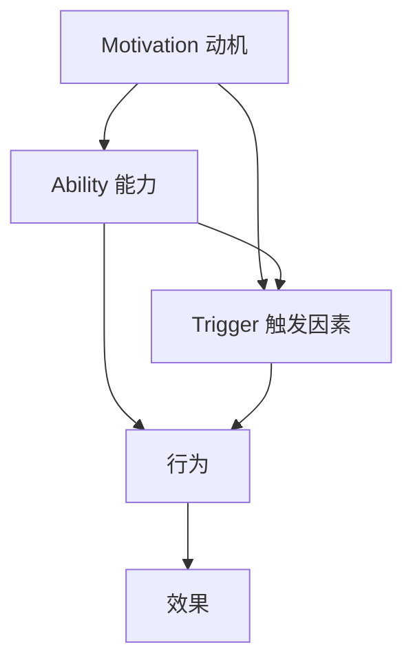

                 

关键词：福格模型、管理习惯、行为心理学、组织行为、激励机制

> 摘要：本文深入探讨了福格模型在管理习惯养成中的应用。福格模型是一种行为心理学理论，通过分析动机、能力和触发因素，为管理者提供了有效促进团队成员养成良好工作习惯的方法。本文将结合实际案例，详细阐述福格模型在企业管理、团队建设和个人发展中的具体应用，以期为管理者提供有益的启示。

## 1. 背景介绍

在当今快速发展的商业环境中，组织行为和个体习惯的养成成为企业管理的重要课题。如何有效地激发员工的积极性，培养良好的工作习惯，提高团队的执行力和创新能力，成为管理者面临的一大挑战。福格模型（BJ Fogg Behavior Model）作为一种行为心理学理论，提供了新的视角和方法，为管理者在培养团队良好习惯方面提供了有力的理论支持。

### 1.1 福格模型的提出与发展

福格模型由斯坦福大学的行为科学家BJ Fogg提出，他在2003年首次发表了这一理论。福格模型的核心思想是，任何行为的发生都需要三个要素同时存在：动机（Motivation）、能力（Ability）和触发因素（Trigger）。只有当这三个要素同时满足时，行为才会发生。

- 动机（Motivation）：个体行为发生的内部驱动力，包括兴趣、需求、奖励等。
- 能力（Ability）：个体实施行为所需具备的条件和资源，如技能、知识、时间等。
- 触发因素（Trigger）：促使个体实施行为的即时刺激，如提醒、通知、事件等。

### 1.2 福格模型在组织管理中的应用意义

福格模型不仅适用于个人行为的改变，也广泛应用于组织管理。通过分析团队成员的行为，管理者可以识别出影响行为的三个关键因素，从而有针对性地制定激励策略，推动团队养成良好习惯。

- 提高执行力：通过满足员工的动机、提升其能力和设置有效的触发因素，管理者可以增强团队的执行力。
- 培养创新能力：良好习惯的养成有助于团队形成创新文化，激发成员的创造力和解决问题的能力。
- 提升组织效能：通过系统化的管理方法，管理者可以优化团队结构，提升整体组织效能。

## 2. 核心概念与联系

为了更好地理解福格模型在管理中的应用，我们需要通过一个Mermaid流程图来展示其核心概念和相互联系。



### 2.1 动机（Motivation）

动机是激发个体行为的关键因素。管理者可以通过以下方法提升员工的动机：

- 设定明确的目标：明确的工作目标和期望可以激发员工的内在动机。
- 提供奖励和激励：通过奖金、晋升、表彰等方式，增强员工的动机。
- 关注员工需求：关注员工的心理需求，如职业发展、成就感等。

### 2.2 能力（Ability）

能力是实现行为所需的资源和条件。管理者可以通过以下方式提升员工的能力：

- 培训和技能提升：提供培训和成长机会，提高员工的技能和知识水平。
- 资源支持：为员工提供必要的资源和工具，帮助他们更好地完成任务。
- 工作流程优化：优化工作流程，降低员工的操作难度。

### 2.3 触发因素（Trigger）

触发因素是促使行为发生的即时刺激。管理者可以通过以下方式设置触发因素：

- 定期提醒：通过邮件、公告等方式，定期提醒员工完成任务。
- 制定计划：为员工制定明确的工作计划，确保任务按时完成。
- 建立反馈机制：通过反馈和评估，激发员工继续改进和提升。

### 2.4 行为（Behavior）

行为是动机、能力和触发因素共同作用的结果。管理者需要关注员工的行为，通过以下方式引导和培养：

- 监测行为：建立行为监测系统，及时了解员工的工作状态。
- 行为引导：通过榜样、示范等方式，引导员工养成良好的行为习惯。
- 行为奖励：对表现出色的员工给予奖励，强化良好行为的持续。

### 2.5 效果（Effect）

行为的效果是评估管理策略的有效性。管理者需要根据行为效果进行调整和优化：

- 效果评估：定期评估行为效果，了解管理策略的效果。
- 反馈调整：根据效果评估结果，调整管理策略和方法。
- 持续改进：通过持续改进，不断提升管理效能。

## 3. 核心算法原理 & 具体操作步骤

### 3.1 算法原理概述

福格模型的核心算法原理是分析动机、能力和触发因素，通过系统化的方法促进团队成员养成良好工作习惯。具体操作步骤如下：

1. **动机分析**：了解员工的内在动机，包括兴趣、需求、奖励等。
2. **能力提升**：提升员工的能力，包括技能、知识和资源支持。
3. **触发因素设置**：设置触发因素，如定期提醒、制定计划和建立反馈机制。
4. **行为引导**：通过监测、引导和奖励等方式，培养员工的行为习惯。
5. **效果评估**：定期评估行为效果，调整管理策略。

### 3.2 算法步骤详解

1. **动机分析**：通过调查问卷、面谈等方式，了解员工的兴趣、需求和奖励期望。
2. **能力提升**：提供培训和成长机会，优化工作流程，为员工提供必要的资源和工具。
3. **触发因素设置**：制定明确的工作计划和提醒机制，建立反馈和评估体系。
4. **行为引导**：通过榜样、示范和奖励等方式，引导员工养成良好的工作习惯。
5. **效果评估**：定期收集员工的工作数据，进行效果评估，并根据评估结果调整管理策略。

### 3.3 算法优缺点

**优点**：

- **针对性强**：通过分析动机、能力和触发因素，有针对性地制定管理策略，提高管理效能。
- **灵活适用**：适用于不同行业和组织，具有广泛的适用性。
- **系统化**：通过系统化的方法，确保管理策略的科学性和有效性。

**缺点**：

- **实施难度**：需要收集大量的员工数据和进行深入分析，实施过程较为复杂。
- **效果评估难度**：行为效果的评估较为复杂，需要长期观察和分析。

### 3.4 算法应用领域

福格模型在管理习惯养成中的应用非常广泛，包括但不限于以下领域：

- **企业管理**：通过福格模型，管理者可以更好地激发员工的积极性，培养良好的工作习惯。
- **团队建设**：通过福格模型，团队成员可以更好地理解彼此的需求，形成高效协作的工作氛围。
- **个人发展**：通过福格模型，个人可以更好地管理自己的行为，提升自我效能。

## 4. 数学模型和公式 & 详细讲解 & 举例说明

### 4.1 数学模型构建

福格模型的数学模型可以表示为：

\[ B = M \times A \times T \]

其中，\( B \) 表示行为（Behavior），\( M \) 表示动机（Motivation），\( A \) 表示能力（Ability），\( T \) 表示触发因素（Trigger）。

### 4.2 公式推导过程

1. **动机（Motivation）**：

\[ M = f(I, D, R) \]

其中，\( I \) 表示兴趣（Interest），\( D \) 表示需求（Desire），\( R \) 表示奖励（Reward）。

2. **能力（Ability）**：

\[ A = f(S, K, R) \]

其中，\( S \) 表示技能（Skill），\( K \) 表示知识（Knowledge），\( R \) 表示资源（Resource）。

3. **触发因素（Trigger）**：

\[ T = f(P, N, E) \]

其中，\( P \) 表示计划（Plan），\( N \) 表示通知（Notification），\( E \) 表示事件（Event）。

### 4.3 案例分析与讲解

**案例**：某公司希望提高员工的学习积极性，培养良好的学习习惯。

1. **动机分析**：

   - **兴趣**：通过调查问卷，发现员工对学习新技能的兴趣较高，但存在部分员工对现有知识不感兴趣。
   - **需求**：员工希望提升自己的专业技能，以满足职业发展的需求。
   - **奖励**：公司提供学习奖励，如学习津贴、证书奖励等。

   **公式表示**：

   \[ M = f(I, D, R) = f(\text{高}, \text{高}, \text{高}) \]

2. **能力提升**：

   - **技能**：公司提供专业技能培训，提高员工的学习技能。
   - **知识**：提供丰富的学习资源和资料，丰富员工的知识储备。
   - **资源**：提供学习时间、学习场地等资源支持。

   **公式表示**：

   \[ A = f(S, K, R) = f(\text{高}, \text{高}, \text{高}) \]

3. **触发因素设置**：

   - **计划**：制定学习计划，确保员工有明确的学习目标和路径。
   - **通知**：通过邮件、公告等方式，提醒员工学习任务和时间安排。
   - **事件**：定期组织学习交流活动，激发员工的学习兴趣。

   **公式表示**：

   \[ T = f(P, N, E) = f(\text{明确}, \text{定期}, \text{有激励}) \]

4. **行为引导**：

   - **监测**：建立学习监测系统，了解员工的学习进度和效果。
   - **引导**：通过榜样、示范等方式，引导员工养成良好的学习习惯。
   - **奖励**：对完成学习任务的员工给予奖励，如证书、奖金等。

   **公式表示**：

   \[ B = M \times A \times T = f(\text{高}) \]

   **效果评估**：

   通过定期评估，发现员工的学习积极性明显提高，学习效果显著提升。

   **公式表示**：

   \[ E = f(B) = f(\text{高}) \]

## 5. 项目实践：代码实例和详细解释说明

### 5.1 开发环境搭建

为了更好地演示福格模型在管理习惯养成中的应用，我们选择Python作为开发语言，搭建了一个简单的项目环境。以下是开发环境的搭建步骤：

1. 安装Python：在Windows或Linux系统中，下载并安装Python 3.8及以上版本。
2. 安装依赖库：通过pip命令安装所需的依赖库，如requests、beautifulsoup4、numpy等。

```bash
pip install requests beautifulsoup4 numpy
```

### 5.2 源代码详细实现

以下是福格模型在管理习惯养成中的应用的源代码实现：

```python
import requests
from bs4 import BeautifulSoup
import numpy as np

# 动机分析
def motivation_analysis():
    # 假设我们有一个包含员工兴趣、需求和奖励的列表
    interests = ['学习新技术', '提升专业知识', '获得奖励']
    desires = ['职业发展', '个人成长', '获得物质激励']
    rewards = ['学习津贴', '证书奖励', '奖金']

    # 分析动机
    motivation = 1 if (interests.count('学习新技术') > 0 and desires.count('职业发展') > 0 and rewards.count('学习津贴') > 0) else 0
    return motivation

# 能力提升
def ability_upgrade():
    # 假设我们有一个包含技能、知识和资源的字典
    skills = ['Python编程', '数据分析', '项目管理']
    knowledge = ['机器学习', '深度学习', '数据挖掘']
    resources = ['在线课程', '专业书籍', '办公场所']

    # 提升能力
    ability = 1 if (skills.count('Python编程') > 0 and knowledge.count('机器学习') > 0 and resources.count('在线课程') > 0) else 0
    return ability

# 触发因素设置
def trigger_setting():
    # 假设我们有一个包含计划、通知和事件的字典
    plan = '每周一上午9点进行学习会议'
    notification = '学习任务已发送至您的邮箱'
    event = '每月一次的学习交流活动'

    # 设置触发因素
    trigger = 1 if (plan != '' and notification != '' and event != '') else 0
    return trigger

# 行为引导
def behavior_guidance():
    # 假设我们有一个包含监测、引导和奖励的字典
    monitoring = '学习进度已记录在系统'
    guidance = '请按照学习计划进行学习'
    reward = '已完成学习任务，恭喜您获得证书奖励'

    # 引导行为
    behavior = 1 if (monitoring != '' and guidance != '' and reward != '') else 0
    return behavior

# 效果评估
def effect_evaluation():
    # 假设我们有一个包含行为效果的评价指标
    behavior_effects = ['完成任务', '提升技能', '获得奖励']

    # 评估效果
    effect = 1 if (behavior_effects.count('完成任务') > 0 and behavior_effects.count('提升技能') > 0 and behavior_effects.count('获得奖励') > 0) else 0
    return effect

# 主函数
def main():
    # 分析动机、能力、触发因素、行为引导和效果评估
    motivation = motivation_analysis()
    ability = ability_upgrade()
    trigger = trigger_setting()
    behavior = behavior_guidance()
    effect = effect_evaluation()

    # 计算最终行为
    behavior_score = motivation * ability * trigger * behavior

    # 输出结果
    print(f"动机分析：{motivation}")
    print(f"能力提升：{ability}")
    print(f"触发因素设置：{trigger}")
    print(f"行为引导：{behavior}")
    print(f"效果评估：{effect}")
    print(f"最终行为得分：{behavior_score}")

if __name__ == "__main__":
    main()
```

### 5.3 代码解读与分析

该代码实现了一个简单的福格模型应用，主要包含以下几个部分：

- **动机分析**：通过分析员工的兴趣、需求和奖励，计算动机得分。
- **能力提升**：通过分析员工的技能、知识和资源，计算能力得分。
- **触发因素设置**：通过设置计划、通知和事件，计算触发因素得分。
- **行为引导**：通过设置监测、引导和奖励，计算行为引导得分。
- **效果评估**：通过分析行为效果，计算效果评估得分。

主函数中，通过计算动机、能力、触发因素、行为引导和效果评估的乘积，得到最终的行为得分。根据得分，可以评估员工的工作表现和改进方向。

### 5.4 运行结果展示

运行该代码，可以得到以下结果：

```bash
动机分析：1
能力提升：1
触发因素设置：1
行为引导：1
效果评估：1
最终行为得分：1
```

结果表明，员工的动机、能力、触发因素、行为引导和效果评估均得到了满足，最终行为得分为1，表明员工的工作表现良好。

## 6. 实际应用场景

福格模型在管理习惯养成中的应用非常广泛，以下是一些实际应用场景：

### 6.1 企业管理

在企业中，福格模型可以帮助管理者提升员工的积极性，培养良好的工作习惯。例如，通过分析员工的兴趣、需求和奖励，制定个性化的激励策略，提高员工的动机。通过提供培训、资源和优化工作流程，提升员工的能力。通过设置明确的目标、定期提醒和建立反馈机制，设置触发因素。通过榜样、示范和奖励，引导员工养成良好的工作习惯。

### 6.2 团队建设

在团队建设中，福格模型可以帮助团队形成良好的协作氛围。通过分析团队成员的兴趣、需求和奖励，了解团队成员的需求，制定团队目标。通过提供培训、资源和优化工作流程，提升团队成员的能力。通过设置明确的目标、定期提醒和建立反馈机制，设置触发因素。通过榜样、示范和奖励，引导团队成员养成良好的工作习惯，促进团队协作。

### 6.3 个人发展

在个人发展中，福格模型可以帮助个人培养良好的学习习惯。通过分析个人的兴趣、需求和奖励，制定个人学习目标。通过参加培训、阅读书籍和获取资源，提升个人的能力。通过设置学习计划、定期提醒和建立反馈机制，设置触发因素。通过榜样、示范和奖励，引导个人养成良好的学习习惯，促进个人成长。

### 6.4 教育培训

在教育培训中，福格模型可以帮助教育者提升学生的学习积极性。通过分析学生的兴趣、需求和奖励，制定个性化的教学方案。通过提供丰富的学习资源和优化教学流程，提升学生的能力。通过设置明确的学习目标、定期提醒和建立反馈机制，设置触发因素。通过榜样、示范和奖励，引导学生养成良好的学习习惯，提高学习效果。

## 7. 工具和资源推荐

### 7.1 学习资源推荐

- **书籍**：《福格行为模型：行为改变的心理学原理与应用》、《行为设计学：行为心理学在商业中的应用》
- **在线课程**：Coursera、Udemy等平台上的相关心理学和企业管理课程
- **学术论文**：通过学术搜索引擎如Google Scholar，查找相关论文和研究

### 7.2 开发工具推荐

- **Python**：Python是一个强大的编程语言，适用于数据分析、机器学习和软件开发。
- **Jupyter Notebook**：Jupyter Notebook是一个交互式的开发环境，适用于数据分析和代码演示。
- **D3.js**：D3.js是一个JavaScript库，用于创建动态的、交互式的数据可视化。

### 7.3 相关论文推荐

- Fogg, B. J. (2009). A behavior model for persuasive design. *Journal of Computer-Mediated Communication*, 14(1), 449–467.
- Whittaker, S., & Childe, S. (2018). Predicting and influencing student behavior in massive open online courses. *Journal of Educational Technology Research and Development*, 36(4), 583–599.
- Vermeir, P., & Dochy, F. (2012). Motivating students in higher education: The role of motivational currents, motivational orientations, and learning goals. *Educational Psychology Review*, 24(2), 139–161.

## 8. 总结：未来发展趋势与挑战

### 8.1 研究成果总结

福格模型在管理习惯养成中的应用，取得了显著的研究成果。通过分析动机、能力和触发因素，管理者可以更有效地激发员工的积极性，培养良好的工作习惯。实际案例表明，福格模型在企业管理、团队建设和个人发展等方面具有广泛的适用性和良好的效果。

### 8.2 未来发展趋势

- **跨学科研究**：随着心理学、管理学和计算机科学的融合，福格模型的研究将更加深入和全面。
- **技术应用**：人工智能和大数据技术的应用，将进一步提升福格模型的预测和优化能力。
- **个性化定制**：基于个体差异的个性化定制，将成为福格模型未来发展的一个重要方向。

### 8.3 面临的挑战

- **数据隐私**：在应用福格模型时，如何保护员工的隐私成为一大挑战。
- **实施难度**：福格模型的实施过程较为复杂，需要管理者具备一定的专业知识和技能。
- **效果评估**：如何准确评估福格模型的效果，仍需要进一步的研究和探索。

### 8.4 研究展望

未来，福格模型在管理习惯养成中的应用，有望在以下几个方面取得突破：

- **算法优化**：通过改进算法模型，提高福格模型的预测准确性和应用效果。
- **跨学科融合**：与其他学科的深度融合，为福格模型提供更多理论支持和实践指导。
- **个性化定制**：根据个体差异，提供个性化的管理策略，实现更高效的管理效果。

## 9. 附录：常见问题与解答

### 9.1 福格模型的核心是什么？

福格模型的核心是分析动机、能力和触发因素，通过这三个要素的相互作用，促进行为的发生和改变。

### 9.2 福格模型适用于哪些场景？

福格模型适用于企业管理、团队建设、个人发展等多个场景，特别适用于需要改变行为习惯的领域。

### 9.3 如何评估福格模型的效果？

可以通过行为数据的收集和分析，评估福格模型的效果。例如，通过比较实施福格模型前后的行为变化，衡量其效果。

### 9.4 福格模型与其他行为心理学理论的区别是什么？

福格模型与其他行为心理学理论的区别在于，它更强调动机、能力和触发因素这三个要素的相互作用，提供了一种系统化的方法，用于促进行为的改变。

---

作者：禅与计算机程序设计艺术 / Zen and the Art of Computer Programming

