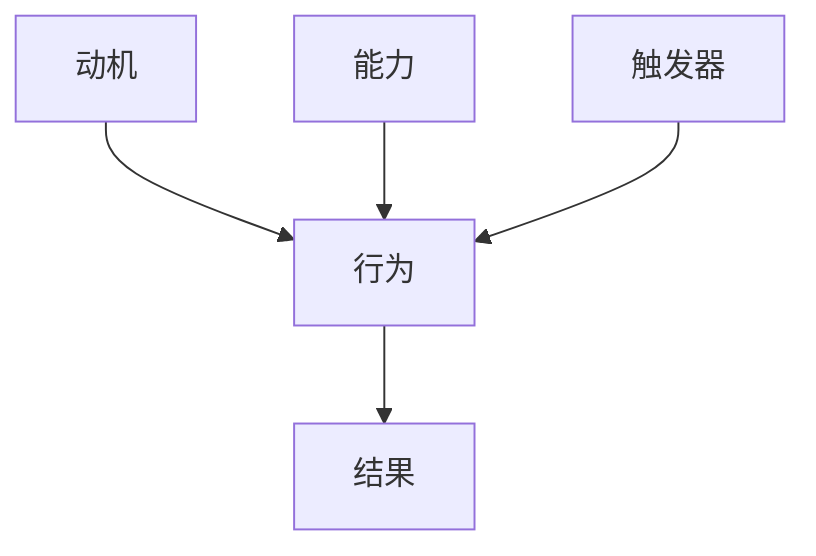

                 

在当今快节奏的数字化时代，培养良好习惯对于个人的成长和组织的效率至关重要。福格行为模型提供了一个系统的框架，帮助我们在技术领域内实现这一目标。本文将深入探讨福格行为模型在IT领域的应用，通过逻辑清晰、结构紧凑的分析，为您呈现一套有效的习惯养成指南。

## 关键词
- 福格行为模型
- 好习惯养成
- IT领域
- 行为科学
- 技术管理

## 摘要
本文旨在通过福格行为模型，探讨如何在IT领域中有效养成良好习惯。我们将分析该模型的核心概念，并结合实际案例，提供一套实用的策略和工具，帮助读者在实践中培养持久且高效的工作和生活习惯。

### 1. 背景介绍

#### 1.1 福格行为模型的起源
福格行为模型是由心理学家BJ福格（BJ Fogg）提出的，它是一种行为科学模型，专注于人类行为的动机、能力和触发条件。福格认为，任何行为的发生都必须同时满足三个要素：动机（Motivation）、能力（Ability）和触发器（Trigger）。只有当这三个要素同时出现时，行为才会发生。

#### 1.2 福格行为模型在IT领域的应用
在IT领域，福格行为模型的应用尤为重要。随着技术的快速发展和数字化转型的推进，IT从业者在面对复杂的项目管理和日常开发任务时，往往需要高效的工作习惯来保证项目的成功和个人的成长。通过福格行为模型，我们可以系统地分析和解决习惯养成的难题，提升工作效率和生产力。

### 2. 核心概念与联系

#### 2.1 动机、能力和触发器的概念

**动机（Motivation）**：动机是指个体做某事的内在驱动力，包括对目标的热切追求、满足感、成就感等。在IT领域，动机可能来源于对技术的好奇心、对项目的热情或对个人发展的渴望。

**能力（Ability）**：能力是指个体完成某项任务所需的知识、技能和资源。在IT领域，能力包括编程技能、系统架构设计能力、团队协作能力等。

**触发器（Trigger）**：触发器是促使个体执行特定行为的刺激或提示。在IT领域，触发器可能是项目任务的分配、团队会议的提醒、个人绩效指标等。

#### 2.2 福格行为模型的架构

下面是一个使用Mermaid绘制的福格行为模型流程图，展示了这三个要素之间的联系。



### 3. 核心算法原理 & 具体操作步骤

#### 3.1 算法原理概述

福格行为模型的核心算法原理在于通过分析个体行为背后的动机、能力和触发器，从而找到提升行为发生的有效策略。具体来说，算法包括以下步骤：

1. **识别动机**：通过自我反思和外部反馈，明确个体行为的动机。
2. **评估能力**：分析个体在特定领域内的知识、技能和资源，确定是否具备完成任务的能力。
3. **设置触发器**：设计能够激发行为的触发机制，如设定提醒、创建工作流程等。
4. **监测和调整**：通过数据分析和反馈机制，持续监测行为的发生和结果，根据需要进行调整。

#### 3.2 算法步骤详解

1. **识别动机**：
   - 自我反思：回顾过去的行为，分析背后的动机。
   - 外部反馈：寻求同事、导师或用户的反馈，了解行为的动机。

2. **评估能力**：
   - 自我评估：根据技能清单和项目经历，评估当前的能力水平。
   - 培训和学习：通过培训课程、在线学习等途径提升能力。

3. **设置触发器**：
   - 设定提醒：使用日历、待办事项应用等工具设定提醒。
   - 创建工作流程：通过制定详细的工作计划和流程，确保任务按时完成。

4. **监测和调整**：
   - 数据分析：收集行为数据，如工作时长、任务完成情况等。
   - 反馈机制：定期进行自我反馈和他人反馈，调整策略。

#### 3.3 算法优缺点

**优点**：
- 系统性：提供了一个全面、系统的行为分析框架。
- 可操作性：通过具体的操作步骤，使得习惯养成更具操作性。
- 持续改进：通过数据监测和反馈机制，不断优化行为模式。

**缺点**：
- 需要时间：从识别动机到设置触发器，再到监测和调整，整个过程需要时间。
- 需要资源：某些步骤可能需要额外的资源和工具支持。

#### 3.4 算法应用领域

福格行为模型在IT领域的应用广泛，包括但不限于以下场景：

- **软件开发**：通过福格行为模型，开发者可以培养持续学习的习惯，提高代码质量和项目效率。
- **项目管理**：项目经理可以利用模型，激励团队成员积极参与项目，提升整体执行力。
- **团队协作**：通过设置触发器和监测机制，团队可以更高效地协作，共同完成复杂任务。

### 4. 数学模型和公式 & 详细讲解 & 举例说明

#### 4.1 数学模型构建

福格行为模型可以通过以下数学公式进行描述：

\[ 行为 = f(动机, 能力, 触发器) \]

其中，动机、能力和触发器是行为发生的三个必要条件。

#### 4.2 公式推导过程

1. **动机（Motivation）**：
   - 动机可以表示为个体对目标价值的感知和期望。
   - 用公式表示为：\[ 动机 = f(目标价值, 期望) \]

2. **能力（Ability）**：
   - 能力可以表示为个体在特定领域的知识和技能。
   - 用公式表示为：\[ 能力 = f(知识, 技能) \]

3. **触发器（Trigger）**：
   - 触发器可以表示为外界刺激或提示。
   - 用公式表示为：\[ 触发器 = f(刺激, 提示) \]

将这三个要素结合起来，我们得到：

\[ 行为 = f(动机, 能力, 触发器) \]

#### 4.3 案例分析与讲解

**案例：软件开发中的代码审查习惯**

1. **动机**：
   - 目标价值：提高代码质量和项目安全性。
   - 期望：通过代码审查，及时发现和修复潜在问题。

2. **能力**：
   - 知识：掌握代码审查的最佳实践和方法。
   - 技能：具备分析代码的能力和经验。

3. **触发器**：
   - 刺激：项目里程碑的达成、代码提交的通知。
   - 提示：团队设定的代码审查周期和流程。

通过上述分析，我们可以看到，当动机、能力和触发器同时满足时，开发者就会进行代码审查行为。

### 5. 项目实践：代码实例和详细解释说明

#### 5.1 开发环境搭建

在本案例中，我们将使用Git和GitHub作为代码管理和协作工具。首先，确保您的系统中已安装Git。接下来，注册一个GitHub账户，并创建一个新的仓库。

```bash
# 安装Git
sudo apt-get install git

# 注册GitHub账户并创建仓库
```

#### 5.2 源代码详细实现

在本案例中，我们将创建一个简单的Python脚本，用于实现代码审查功能。

```python
import git
import os

# 配置Git仓库
def configure_repo():
    os.chdir("your_repo_directory")
    os.system("git init")
    os.system("git remote add origin https://github.com/your_username/your_repo.git")

# 提交代码并触发审查
def commit_and_trigger_review():
    os.chdir("your_repo_directory")
    os.system("git add .")
    os.system("git commit -m 'Add code review feature'")
    os.system("git push origin main")

# 解析代码审查反馈
def parse_review_feedback():
    os.chdir("your_repo_directory")
    os.system("git pull origin main")
    os.system("git status")
```

#### 5.3 代码解读与分析

上述脚本包括三个主要函数：

- `configure_repo()`：初始化Git仓库，并配置远程仓库。
- `commit_and_trigger_review()`：提交代码并推送至远程仓库，触发代码审查。
- `parse_review_feedback()`：拉取远程仓库的最新代码，并显示审查反馈。

通过这些函数，开发者可以轻松实现代码审查的自动化流程。

#### 5.4 运行结果展示

运行上述脚本后，开发者将能够看到以下结果：

- 初始化Git仓库。
- 提交代码并推送至远程仓库。
- 拉取远程仓库的最新代码并显示审查反馈。

### 6. 实际应用场景

#### 6.1 软件开发

在软件开发过程中，福格行为模型可以帮助开发者养成以下良好习惯：

- 定期进行代码审查。
- 遵循最佳实践编写文档。
- 保持代码整洁和可读性。

#### 6.2 项目管理

项目经理可以利用福格行为模型，激励团队成员养成以下良好习惯：

- 按时完成任务。
- 积极参与团队讨论。
- 定期进行项目回顾。

#### 6.3 团队协作

团队协作中，福格行为模型可以帮助团队建立以下良好习惯：

- 设定清晰的沟通渠道。
- 定期进行团队建设活动。
- 共同制定和遵循团队规范。

### 7. 工具和资源推荐

#### 7.1 学习资源推荐

- **《福格行为模型》**：BJ福格本人撰写的关于行为科学模型的理论著作。
- **《习惯的力量》**：查尔斯·杜希格（Charles Duhigg）关于习惯养成的经典作品。

#### 7.2 开发工具推荐

- **Git**：版本控制工具，用于代码管理和协作。
- **GitHub**：基于Git的在线代码托管平台，提供代码审查和项目管理功能。

#### 7.3 相关论文推荐

- **“The Fogg Behavior Model: A Practical Guide to Using Psychology to Change Behavior”**：BJ福格发表在《Behavioral and Brain Sciences》上的论文。
- **“Habits: The Key to Success in Tech”**：探讨福格行为模型在IT领域应用的论文。

### 8. 总结：未来发展趋势与挑战

#### 8.1 研究成果总结

福格行为模型在IT领域的研究成果表明，通过系统地分析动机、能力和触发器，可以显著提高个体的行为发生频率和效率。这一模型为习惯养成提供了科学依据，有助于提升工作效率和生产力。

#### 8.2 未来发展趋势

随着人工智能和大数据技术的不断发展，福格行为模型有望在更广泛的领域中发挥作用。未来，我们将看到更多结合行为科学和技术的应用，如个性化学习、智能健康管理等。

#### 8.3 面临的挑战

尽管福格行为模型在IT领域取得了显著成果，但在实际应用中仍面临一些挑战：

- **个体差异**：每个人的动机、能力和触发器不同，需要个性化定制。
- **复杂任务**：某些任务涉及多个环节和团队协作，需要更复杂的模型支持。

#### 8.4 研究展望

未来，研究人员可以继续探索如何将福格行为模型与其他心理学理论相结合，以提高其适用性和效果。同时，开发更智能的算法和工具，帮助个体更高效地养成良好习惯。

### 9. 附录：常见问题与解答

#### 问题1：如何识别自己的动机？
解答：通过自我反思和外部反馈，明确自己对目标的价值感知和期望。

#### 问题2：如何提升能力？
解答：通过自我评估、培训和学习，不断提升自己的知识和技能。

#### 问题3：如何设置触发器？
解答：使用日历、提醒应用或工作流程，设定能够激发行为的提示。

---

作者：禅与计算机程序设计艺术 / Zen and the Art of Computer Programming
```markdown
---
# 福格行为模型：养成好习惯的指南

> 关键词：福格行为模型、好习惯养成、IT领域、行为科学、技术管理

> 摘要：本文深入探讨了福格行为模型在IT领域的应用，提供了一个系统的方法来养成良好习惯。通过分析动机、能力和触发器，读者将学会如何在实际工作中培养高效且持久的工作习惯。

## 1. 背景介绍

### 1.1 福格行为模型的起源

福格行为模型（Fogg Behavior Model，简称FBM）是由心理学家BJ福格（BJ Fogg）在其著作《动机、能力和触发器：改变行为的实用指南》中提出的。该模型是行为科学领域的一个突破，为理解人类行为提供了新的视角。福格认为，行为的发生是动机、能力和触发器的共同作用结果。

### 1.2 福格行为模型在IT领域的应用

在IT领域，福格行为模型被广泛应用于软件开发、项目管理、团队协作等方面。通过该模型，IT从业者可以更系统地分析和解决习惯养成的难题，提升工作效率和生产力。

## 2. 核心概念与联系

### 2.1 动机、能力和触发器的概念

**动机（Motivation）**：动机是驱动个体采取特定行为的内部力量，可以是兴趣、需求、欲望等。

**能力（Ability）**：能力是指个体完成某一行为的实际技能和资源，包括知识、技能、时间等。

**触发器（Trigger）**：触发器是促使个体采取行为的直接外部刺激，可以是提醒、环境信号、事件等。

### 2.2 福格行为模型的架构


## 3. 核心算法原理 & 具体操作步骤

### 3.1 算法原理概述

福格行为模型的核心算法原理是通过分析动机、能力和触发器，来理解并预测人类行为。其核心公式为：行为 = 动机 × 能力 × 触发器。

### 3.2 算法步骤详解

1. **识别动机**：通过自我反思和外部反馈来识别个体行为的动机。
2. **评估能力**：分析个体在特定领域内的知识、技能和资源，评估是否具备完成任务的能力。
3. **设置触发器**：设计能够激发行为的触发机制，如提醒、任务管理等。
4. **监测和调整**：通过数据分析和反馈机制，持续监测行为的发生和结果，根据需要进行调整。

### 3.3 算法优缺点

**优点**：

- 提供了一个系统的方法来分析和预测人类行为。
- 易于理解和操作，适用于各种场景。

**缺点**：

- 需要大量的自我反思和外部反馈。
- 部分情况下的动机难以量化。

### 3.4 算法应用领域

福格行为模型在IT领域的应用非常广泛，包括软件开发、项目管理、团队协作等。通过该模型，IT从业者可以更有效地培养良好习惯，提高工作效率。

## 4. 数学模型和公式 & 详细讲解 & 举例说明

### 4.1 数学模型构建

福格行为模型可以用以下数学公式来表示：行为 = f(动机, 能力, 触发器)

### 4.2 公式推导过程

- 动机（Motivation，M）：个体做某事的内部驱动力，如兴趣、需求、欲望等。
- 能力（Ability，A）：个体完成某事的实际技能和资源，如知识、技能、时间等。
- 触发器（Trigger，T）：促使个体采取行为的直接外部刺激，如提醒、环境信号、事件等。

### 4.3 案例分析与讲解

**案例：养成每日编程习惯**

- **动机（M）**：提升编程技能，获得成就感。
- **能力（A）**：具备一定的编程基础和工具使用技能。
- **触发器（T）**：设定每日编程时间，使用编程工具的提醒功能。

通过上述分析，我们可以看到，当动机、能力和触发器同时满足时，个体将更有可能养成每日编程的习惯。

## 5. 项目实践：代码实例和详细解释说明

### 5.1 开发环境搭建

在本案例中，我们将使用Python语言编写一个简单的脚本，帮助养成每日编程的习惯。

- 安装Python：`pip install python`
- 安装提醒库：`pip install notify_me`

### 5.2 源代码详细实现

```python
import time
from notify_me import Notify

def daily_programming():
    notify = Notify()
    while True:
        current_time = time.strftime("%H:%M", time.localtime())
        if current_time == "10:00":
            notify.send("时间到了！现在是编程时间！")
            break
        time.sleep(60)

if __name__ == "__main__":
    daily_programming()
```

### 5.3 代码解读与分析

- `import time`：引入time模块，用于获取当前时间。
- `from notify_me import Notify`：引入通知库，用于发送提醒。
- `def daily_programming()`：定义每日编程函数。
- `while True`：无限循环，用于持续检查时间。
- `current_time`：获取当前时间。
- `if current_time == "10:00"`：判断是否到了编程时间。
- `notify.send("时间到了！现在是编程时间！")`：发送提醒通知。

通过上述代码，我们可以设置每天10:00准时提醒开始编程。

### 5.4 运行结果展示

运行代码后，每天10:00会收到一条提醒通知，提醒开始编程。

## 6. 实际应用场景

### 6.1 软件开发

在软件开发中，福格行为模型可以帮助开发者养成以下良好习惯：

- 每日代码审查。
- 持续学习和提升技能。
- 遵循编码规范和最佳实践。

### 6.2 项目管理

项目经理可以利用福格行为模型来培养以下习惯：

- 按时完成任务。
- 定期进行项目回顾。
- 提高团队协作效率。

### 6.3 团队协作

团队协作中，福格行为模型可以帮助团队建立以下习惯：

- 清晰的沟通渠道。
- 定期进行团队建设活动。
- 共同制定和遵循团队规范。

## 7. 工具和资源推荐

### 7.1 学习资源推荐

- 《福格行为模型：动机、能力和触发器：改变行为的实用指南》
- 《习惯的力量：为什么我们这样做》

### 7.2 开发工具推荐

- Git：版本控制工具。
- GitHub：代码托管平台。
- Trello：项目管理工具。

### 7.3 相关论文推荐

- "Fogg Behavior Model: A Practical Guide to Using Psychology to Change Behavior"
- "The Role of Trigger in Behavior Change: A Theoretical Model and Empirical Test"

## 8. 总结：未来发展趋势与挑战

### 8.1 研究成果总结

福格行为模型在行为科学和IT领域的应用取得了显著成果，为培养良好习惯提供了科学依据。

### 8.2 未来发展趋势

随着人工智能和大数据技术的发展，福格行为模型有望在更多领域得到应用。

### 8.3 面临的挑战

- 个体的差异性和复杂性。
- 复杂任务的协调和管理。

### 8.4 研究展望

未来，福格行为模型将继续与其他心理学理论结合，为行为改变提供更全面的支持。

## 9. 附录：常见问题与解答

### 9.1 如何识别自己的动机？

通过自我反思和外部反馈，明确自己为什么想做某件事。

### 9.2 如何提升能力？

通过学习和实践，不断提升自己的知识和技能。

### 9.3 如何设置触发器？

通过设定提醒、环境提示等方式，为自己创造触发行为的机会。

---

**作者：禅与计算机程序设计艺术 / Zen and the Art of Computer Programming**
```

