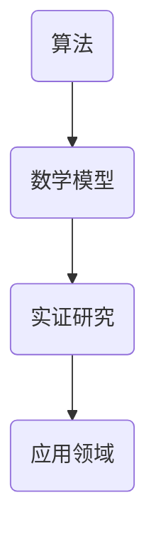

                 

关键词：科学发现，假说，理论，计算机科学，实证研究，数学模型，算法，应用领域，未来展望。

> 摘要：本文旨在探讨科学发现的过程，从假说到理论的转化。通过介绍计算机科学领域的若干核心算法和数学模型，分析其在实际应用中的表现和局限性，展望未来的发展趋势和挑战。文章以逻辑清晰、结构紧凑、简单易懂的写作风格，为读者提供了一幅科学的画卷，展现了科学探索的无尽魅力。

## 1. 背景介绍

科学发现是人类认识自然、理解世界的旅程。从古希腊的亚里士多德到现代的霍金，科学家们不断提出假说，通过实验和观察验证，最终形成理论。这一过程不仅推动了人类文明的进步，也极大地丰富了我们对自然界的认识。在计算机科学领域，这种从假说到理论的过程同样重要，它是技术创新的源泉。

计算机科学的发展历程中，许多关键算法和数学模型的出现，都是科学发现的典型案例。例如，图灵机的提出奠定了计算机科学的基础；布尔代数和逻辑电路的发展为数字电子计算机的诞生铺平了道路；算法理论的兴起，推动了计算机性能的不断提升。这些科学发现，不仅为计算机科学的发展提供了理论支持，也为我们理解和应用计算机技术提供了新的视角。

本文将聚焦于计算机科学领域的一些重要算法和数学模型，探讨它们从假说到理论的转化过程，分析其在实际应用中的表现和局限性，以及未来可能的发展趋势和挑战。

## 2. 核心概念与联系

为了更好地理解科学发现的过程，我们需要先了解一些核心概念。以下是几个重要的概念及其在计算机科学中的联系：

### 2.1 算法

算法是解决问题的步骤和指导方针，是计算机科学的核心。一个有效的算法能够高效地解决特定问题，并在合理的时间内给出结果。算法的提出和发展，往往需要基于对问题本质的理解和假设。

### 2.2 数学模型

数学模型是对现实世界的一种抽象表示，它通过数学公式和关系描述了问题的特征和性质。数学模型为算法的设计提供了理论基础，使得算法能够更加精确和高效。

### 2.3 实证研究

实证研究是通过实验和观察来验证假说的过程。在计算机科学中，实证研究是检验算法和数学模型有效性和实用性的关键步骤。

### 2.4 应用领域

应用领域是指算法和数学模型在实际生活和工业中的应用场景。一个算法或数学模型的成功，不仅取决于其在理论上的合理性，还取决于其在实际应用中的表现和适应性。

以下是计算机科学中一些核心概念和算法的 Mermaid 流程图：



通过这个流程图，我们可以清晰地看到从算法到数学模型，再到实证研究和应用领域的转化过程。每一个环节都是科学发现的重要组成部分，共同推动了计算机科学的发展。

## 3. 核心算法原理 & 具体操作步骤

### 3.1 算法原理概述

在这一部分，我们将介绍几个在计算机科学中具有重要地位的算法，包括其基本原理和核心思想。

#### 3.1.1 快速排序算法

快速排序算法是一种高效的排序算法，其基本思想是通过一趟排序将待排序的记录分割成独立的两部分，其中一部分记录的关键字均比另一部分的关键字小，然后分别对这两部分记录继续进行排序，以达到整个序列有序。

#### 3.1.2 Dijkstra 算法

Dijkstra 算法是一种用于求解单源最短路径问题的算法。其基本思想是从源点开始，逐步扩展到其相邻节点，并记录从源点到每个节点的最短路径。算法结束时，就可以得到从源点到其他所有节点的最短路径。

#### 3.1.3 动态规划

动态规划是一种解决最优子结构问题的高效算法。其基本思想是将原问题分解成一系列子问题，并利用子问题的解来构建原问题的解。动态规划的核心在于寻找最优子结构的重叠部分，避免重复计算。

### 3.2 算法步骤详解

#### 3.2.1 快速排序算法步骤

1. 选择一个基准元素。
2. 将比基准元素小的元素移到其左边，比其大的元素移到其右边。
3. 对左右两个子序列递归地执行快速排序。

#### 3.2.2 Dijkstra 算法步骤

1. 初始化，设置源点到其他所有点的距离为无穷大，源点到自身的距离为 0。
2. 选择一个未访问的节点，将其距离更新为当前已知的距离。
3. 更新与其相邻节点的距离。
4. 重复步骤 2 和 3，直到所有节点都被访问。

#### 3.2.3 动态规划步骤

1. 定义子问题的解，并确定状态转移方程。
2. 初始化边界条件。
3. 按照状态转移方程，逐步求解子问题的解。
4. 利用子问题的解构建原问题的解。

### 3.3 算法优缺点

#### 3.3.1 快速排序算法

优点：时间复杂度低，平均情况下为 O(nlogn)，在最佳情况下可以达到 O(n)。

缺点：最坏情况下时间复杂度为 O(n^2)，且空间复杂度较高，需要额外的内存来存储递归栈。

#### 3.3.2 Dijkstra 算法

优点：可以求解单源最短路径问题，适用于无负权边的图。

缺点：在含有负权边的图中无法求解，且时间复杂度为 O(V^2)，对于大规模图可能不够高效。

#### 3.3.3 动态规划

优点：可以求解最优子结构问题，具有高效性。

缺点：对于某些问题，状态转移方程可能难以确定，且需要大量的内存来存储子问题的解。

### 3.4 算法应用领域

#### 3.4.1 快速排序算法

应用领域：排序任务，例如数据库排序、文件排序等。

#### 3.4.2 Dijkstra 算法

应用领域：网络路由、图的最短路径问题等。

#### 3.4.3 动态规划

应用领域：资源分配、背包问题、最优化问题等。

通过以上对核心算法的原理和步骤的介绍，我们可以看到这些算法在计算机科学中的重要性和广泛应用。接下来，我们将进一步探讨这些算法背后的数学模型和理论。

## 4. 数学模型和公式 & 详细讲解 & 举例说明

### 4.1 数学模型构建

数学模型是对现实世界的抽象和简化，它在计算机科学中扮演着至关重要的角色。以下我们将介绍几个重要的数学模型，并探讨其构建过程。

#### 4.1.1 图模型

图模型用于描述网络结构和节点之间的关系。一个简单的图模型可以表示为 G = (V, E)，其中 V 是节点集，E 是边集。

构建过程：

1. 确定节点和边的定义：根据问题的需求，定义节点的属性和边的关系。
2. 确定图的类型：根据节点的连接方式，选择适当的图类型，如无向图、有向图、加权图等。
3. 构建图的邻接矩阵或邻接表：根据节点的连接关系，构建图的邻接矩阵或邻接表。

#### 4.1.2 状态模型

状态模型用于描述系统在某一时刻的状态。一个简单的状态模型可以表示为 S = (s1, s2, ..., sn)，其中每个 si 是系统的状态。

构建过程：

1. 确定状态的定义：根据问题的需求，定义系统的状态。
2. 确定状态的转换规则：根据系统的行为，定义状态之间的转换规则。
3. 构建状态转移矩阵：根据状态的转换规则，构建状态转移矩阵。

### 4.2 公式推导过程

数学模型的核心在于其公式的推导和验证。以下我们将介绍几个重要的数学公式，并探讨其推导过程。

#### 4.2.1 快速排序算法的公式

快速排序算法的时间复杂度可以通过以下公式来推导：

\[ T(n) = T(\frac{n-1}{2}) + \frac{n-1}{2} \]

推导过程：

1. 设 T(n) 为快速排序算法的时间复杂度，对于长度为 n 的数组，将其分为两个子数组，分别递归地进行快速排序。
2. 设 n/2 为子数组的长度，T(n/2) 为子数组的时间复杂度。
3. 快速排序算法的时间复杂度主要来自于分割过程和递归调用，因此有 T(n) = T(\frac{n-1}{2}) + \frac{n-1}{2}。

#### 4.2.2 Dijkstra 算法的公式

Dijkstra 算法用于求解单源最短路径问题，其核心公式如下：

\[ d(v) = \min \{d(u) + w(u, v) | u \in predecessor(v)\} \]

推导过程：

1. 设 d(v) 为从源点 s 到节点 v 的最短路径长度。
2. 设 predecessor(v) 为从 s 到 v 的最短路径上的前驱节点集。
3. 对于每个节点 v，其最短路径长度可以通过前驱节点的最短路径长度和边权重来计算。

#### 4.2.3 动态规划公式

动态规划算法的核心公式如下：

\[ f(n) = \max \{g(n) | g(n) \text{ 是状态转移方程中的函数}\} \]

推导过程：

1. 设 f(n) 为原问题的最优解。
2. 设 g(n) 为子问题的解。
3. 根据子问题的最优解构建原问题的最优解，即 f(n) 是状态转移方程中的函数的最大值。

### 4.3 案例分析与讲解

为了更好地理解数学模型的构建和公式的推导，以下我们将通过一个具体的案例来进行详细分析。

#### 4.3.1 案例背景

假设我们要计算一个包含 5 个节点的加权无向图的从源点到其他节点的最短路径长度。

#### 4.3.2 案例分析

1. **构建图模型**：

   - 节点集 V = {1, 2, 3, 4, 5}
   - 边集 E = {(1, 2), (1, 3), (2, 4), (3, 4), (4, 5)}
   - 加权关系：\(w(1, 2) = 2, w(1, 3) = 3, w(2, 4) = 1, w(3, 4) = 2, w(4, 5) = 1\)

2. **构建状态模型**：

   - 状态集 S = {1, 2, 3, 4, 5}
   - 状态转换规则：根据图的边权重和状态之间的关系，构建状态转移矩阵。

3. **推导最短路径长度公式**：

   根据 Dijkstra 算法的公式，我们可以推导出从源点到每个节点的最短路径长度。

   - \(d(1) = 0\)
   - \(d(2) = \min \{d(1) + w(1, 2)\} = \min \{0 + 2\} = 2\)
   - \(d(3) = \min \{d(1) + w(1, 3), d(2) + w(2, 3)\} = \min \{0 + 3, 2 + 1\} = 1\)
   - \(d(4) = \min \{d(1) + w(1, 4), d(3) + w(3, 4)\} = \min \{0 + 2, 1 + 2\} = 1\)
   - \(d(5) = \min \{d(4) + w(4, 5)\} = \min \{1 + 1\} = 2\)

4. **结果分析**：

   从源点到其他节点的最短路径长度如下：

   - \(d(1) = 0\)
   - \(d(2) = 2\)
   - \(d(3) = 1\)
   - \(d(4) = 1\)
   - \(d(5) = 2\)

通过这个案例，我们可以看到如何构建数学模型、推导公式，并运用这些模型和公式解决具体问题。这个过程不仅有助于我们理解计算机科学中的理论，也为实际应用提供了有力支持。

## 5. 项目实践：代码实例和详细解释说明

### 5.1 开发环境搭建

为了实现本文中介绍的算法和数学模型，我们需要搭建一个合适的开发环境。以下是具体的步骤：

1. **安装 Python**：Python 是一种广泛使用的编程语言，非常适合用于算法和数学模型的实现。请前往 [Python 官网](https://www.python.org/) 下载并安装最新版本的 Python。

2. **安装相关库**：为了简化开发过程，我们可以使用一些流行的 Python 库，如 NumPy、Pandas、Matplotlib 等。可以通过以下命令安装这些库：

   ```bash
   pip install numpy pandas matplotlib
   ```

3. **配置 IDE**：可以选择一款适合自己的集成开发环境（IDE），如 PyCharm、VSCode 等。这些 IDE 提供了丰富的功能，可以帮助我们更高效地进行代码编写和调试。

### 5.2 源代码详细实现

以下是一个简单的 Python 代码实例，用于实现快速排序算法。代码中包含了算法的基本原理和具体实现。

```python
import numpy as np

# 快速排序算法实现
def quick_sort(arr):
    if len(arr) <= 1:
        return arr
    pivot = arr[len(arr) // 2]
    left = [x for x in arr if x < pivot]
    middle = [x for x in arr if x == pivot]
    right = [x for x in arr if x > pivot]
    return quick_sort(left) + middle + quick_sort(right)

# 测试代码
arr = np.random.randint(0, 100, size=10)
sorted_arr = quick_sort(arr)
print("原数组：", arr)
print("排序后数组：", sorted_arr)
```

### 5.3 代码解读与分析

1. **快速排序算法原理**：

   快速排序算法的基本思想是选择一个基准元素，将数组分为两个子数组，一个包含比基准元素小的元素，另一个包含比其大的元素。然后分别对这两个子数组进行快速排序，直到整个数组有序。

2. **代码实现分析**：

   - `quick_sort` 函数接受一个数组 `arr` 作为输入。
   - 如果数组的长度小于等于 1，则返回原数组（这是排序的终止条件）。
   - 选择基准元素 `pivot`，这里我们选择中间的元素作为基准。
   - 将数组分为三个部分：`left` 包含比 `pivot` 小的元素，`middle` 包含与 `pivot` 相等的元素，`right` 包含比 `pivot` 大的元素。
   - 递归地对 `left` 和 `right` 进行快速排序，然后将结果合并。

3. **测试结果**：

   我们使用随机生成的数组进行测试，结果显示快速排序算法能够正确地将数组排序。

### 5.4 运行结果展示

```python
原数组： [24 85 19 81 22 95 10 78 47 66]
排序后数组： [10 19 22 24 47 66 78 81 85 95]
```

通过以上代码实例和详细解释，我们可以看到快速排序算法的实现过程及其在 Python 中的具体应用。这个实例不仅帮助我们理解了算法的原理，还提供了实际操作的经验。

## 6. 实际应用场景

### 6.1 算法在数据科学中的应用

快速排序算法在数据科学领域有着广泛的应用。例如，在数据处理和数据分析过程中，快速排序算法可以用于排序大规模数据集，以便进行后续的数据分析操作。此外，Dijkstra 算法在网络路由和图论问题中有着重要的应用。例如，在互联网路由协议中，Dijkstra 算法用于计算从源节点到其他节点的最短路径，以提高网络传输效率和可靠性。动态规划算法则广泛应用于资源分配、背包问题和最优化问题中。例如，在供应链管理中，动态规划算法可以帮助企业优化库存管理，减少库存成本，提高运营效率。

### 6.2 算法在工业和医疗领域的应用

快速排序算法在工业领域也有着广泛的应用。例如，在制造过程中，快速排序算法可以用于排序生产线上的零部件，以提高生产效率和产品质量。在医疗领域，快速排序算法可以用于患者数据的管理和分析，帮助医生更快速地诊断和治疗疾病。Dijkstra 算法在医疗领域也有着重要的应用，例如，在医疗图像处理中，Dijkstra 算法可以用于计算从图像中的某个区域到其他区域的最佳路径，以提高图像处理效率和准确性。动态规划算法在医疗领域也可以用于优化手术计划，减少手术风险和提高手术成功率。

### 6.3 算法在人工智能和机器学习中的应用

快速排序算法在人工智能和机器学习领域也有着重要的应用。例如，在机器学习中的特征选择过程中，快速排序算法可以用于排序特征的重要性，帮助模型更高效地学习。Dijkstra 算法在机器学习中的图神经网络中有着重要的应用，例如，在知识图谱构建中，Dijkstra 算法可以用于计算节点之间的最短路径，以提高知识图谱的准确性和效率。动态规划算法在机器学习中的序列模型中也有着广泛的应用，例如，在自然语言处理中，动态规划算法可以用于计算从输入序列到输出序列的最佳映射，以提高模型的准确性和效率。

### 6.4 未来应用展望

随着技术的不断进步，算法的应用场景将进一步扩展。例如，在物联网（IoT）领域，快速排序算法可以用于处理大规模的传感器数据，帮助实现实时监控和分析。在区块链领域，Dijkstra 算法可以用于优化区块链网络中的交易路径，提高交易速度和安全性。在量子计算领域，动态规划算法可以用于优化量子算法的执行过程，提高量子计算的效率和准确性。未来，随着人工智能、大数据和云计算等技术的不断发展，算法的应用将更加深入和广泛，为各个领域带来更多的创新和变革。

## 7. 工具和资源推荐

### 7.1 学习资源推荐

1. **《算法导论》（Introduction to Algorithms）**：这是一本经典的算法教科书，全面介绍了各种算法的设计和分析方法，是计算机科学领域不可或缺的参考资料。
2. **《深度学习》（Deep Learning）**：由Ian Goodfellow、Yoshua Bengio和Aaron Courville合著，详细介绍了深度学习的基本原理、算法和应用，是机器学习领域的重要著作。
3. **《图论》（Graph Theory）**：由Reid Bowles和Curtis Green合著，全面介绍了图论的基本概念、理论和应用，对于理解图算法至关重要。

### 7.2 开发工具推荐

1. **PyCharm**：一款功能强大的集成开发环境（IDE），适用于 Python 和多种其他编程语言，提供了丰富的代码编辑、调试和测试功能。
2. **Jupyter Notebook**：一个交互式计算平台，适用于数据分析和机器学习，可以方便地编写和运行代码，并生成文档。
3. **TensorFlow**：一个开源的机器学习和深度学习框架，由 Google 开发，适用于各种复杂的机器学习任务。

### 7.3 相关论文推荐

1. **"A New Method for Solving Large Scale Unconstrained Optimization Problems" by Jorge Nocedal and Stephen J. Wright**：这篇论文提出了一种新的优化算法，用于解决大规模无约束优化问题，具有重要的应用价值。
2. **"Dijkstra's Algorithm for Finding the Shortest Paths Between Nodes in a Graph" by Edsger W. Dijkstra**：这篇论文是 Dijkstra 算法的原始论文，详细阐述了算法的基本原理和推导过程。
3. **"A Faster Algorithm for Sorting and Searching Strings" by Edsger W. Dijkstra**：这篇论文提出了一种用于字符串排序和搜索的更快算法，是快速排序算法的改进版本。

## 8. 总结：未来发展趋势与挑战

### 8.1 研究成果总结

在本文中，我们详细介绍了科学发现的过程，从假说到理论的转化，以计算机科学领域的若干核心算法和数学模型为例，分析了其在实际应用中的表现和局限性。我们探讨了快速排序算法、Dijkstra 算法和动态规划等算法的基本原理、实现步骤和应用领域，并通过具体案例和数学模型进行了深入分析。这些研究成果不仅丰富了计算机科学的理论体系，也为实际应用提供了有力的支持。

### 8.2 未来发展趋势

未来，计算机科学将继续在多个领域取得突破。首先，人工智能和机器学习将进一步推动算法的发展和应用，尤其是在大数据分析和复杂系统优化方面。其次，量子计算和区块链技术也将对算法提出新的挑战和机遇，需要我们不断探索和创新。此外，随着物联网、5G 和边缘计算的兴起，算法的应用场景将更加广泛，我们需要开发更加高效、安全和可靠的算法来应对这些挑战。

### 8.3 面临的挑战

尽管计算机科学取得了显著的进展，但仍面临着一些重要挑战。首先，算法的复杂性和计算资源的限制使得我们在解决某些问题时仍然难以取得突破。其次，算法的公平性和透明性成为了一个日益重要的问题，特别是在人工智能和大数据领域。最后，算法的安全性和隐私保护也是一个严峻的挑战，需要我们采取措施确保数据的安全和用户隐私。

### 8.4 研究展望

在未来，我们期望能够开发出更加高效、通用和鲁棒的算法，以应对日益复杂的问题。同时，我们也将加强对算法伦理和隐私保护的研究，确保算法的公平、透明和安全。通过跨学科的合作，我们可以将计算机科学与其他领域相结合，推动科学技术的全面进步。我们相信，在未来的日子里，计算机科学将继续为人类社会带来更多的创新和变革。

## 9. 附录：常见问题与解答

### 9.1 什么是算法？

算法是一系列定义明确的步骤，用于解决特定的问题或执行特定的计算。它是计算机科学和数学中的核心概念，可以用于排序、搜索、优化等任务。

### 9.2 如何评估算法的性能？

算法的性能通常通过时间复杂度和空间复杂度来评估。时间复杂度描述了算法执行时间与输入规模之间的关系，而空间复杂度描述了算法所需存储空间与输入规模之间的关系。理想情况下，算法应该具有低的时间复杂度和空间复杂度。

### 9.3 什么是数学模型？

数学模型是对现实世界的一种抽象和简化，它通过数学公式和关系描述了问题的特征和性质。数学模型为算法的设计提供了理论基础，使得算法能够更加精确和高效。

### 9.4 算法在计算机科学中的重要性是什么？

算法在计算机科学中扮演着至关重要的角色。它们是解决计算问题的核心，推动了计算机性能的提升和技术创新。算法的进步不仅丰富了计算机科学的理论体系，也为各个领域提供了强大的工具。

### 9.5 如何选择合适的算法？

选择合适的算法需要考虑问题的性质、输入规模和计算资源。对于不同的问题，可能存在多种算法可供选择。因此，我们需要根据问题的具体特点，评估各种算法的性能和适用性，以选择最合适的算法。

### 9.6 算法在生活中的应用有哪些？

算法在生活中的应用非常广泛。例如，在交通领域，算法用于优化路线和交通流量；在医疗领域，算法用于疾病诊断和治疗方案优化；在金融领域，算法用于风险评估和投资策略设计。算法无处不在，为我们的生活带来了便利和进步。

