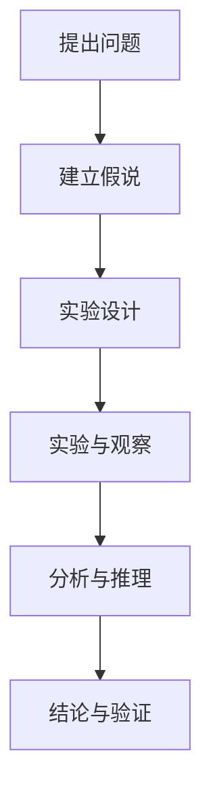

                 

关键词：科学探究，假说，验证，数学模型，算法，实践，应用场景，未来展望

> 摘要：本文深入探讨了科学探究的过程，从假说到真理的演变。通过分析核心概念与联系，阐述算法原理与具体操作步骤，构建数学模型与推导公式，并结合项目实践展示代码实例，本文旨在为读者提供全面而深入的洞察，以激发对科学探究的热爱与追求。

## 1. 背景介绍

科学探究是人类认知世界、理解自然规律的一种基本方法。从古希腊的哲学思考，到现代科学实验，科学探究经历了漫长的演变过程。今天，科学探究已经成为现代社会的基石，推动着科技进步和社会发展。然而，科学探究并非一帆风顺，它充满了挑战与不确定性。如何从假说出发，通过严谨的实验与逻辑推理，最终验证假说的正确性，是科学探究的核心问题。

### 科学探究的定义

科学探究是指通过系统的观察、实验、分析和推理，寻求自然现象的本质规律和因果关系的一种活动。它强调实证主义，即通过可重复的实验和观察来验证或推翻假说。科学探究的过程通常包括以下几个步骤：

1. **提出问题**：科学探究始于对自然现象的好奇和疑问。科学家们通过观察现象，提出需要解答的问题。
2. **建立假说**：在问题提出之后，科学家们基于已有知识和理论，提出可能的解释或假设。
3. **实验设计**：为了验证假说，科学家们设计实验，选择合适的实验方法和工具。
4. **实验与观察**：按照实验设计进行实验，并详细记录观察到的现象和数据。
5. **分析与推理**：对实验结果进行分析，运用逻辑推理判断假说的正确性。
6. **结论与验证**：根据实验结果，科学家们得出结论，并进一步验证假说的正确性。

### 科学探究的重要性

科学探究的重要性体现在以下几个方面：

1. **推动科技进步**：科学探究是科技创新的基础，通过不断探索和验证，科学家们发现新的自然规律和技术原理，推动科技不断进步。
2. **提高认知水平**：科学探究有助于人类对自然界的认识，提高我们的认知水平，拓展我们的视野。
3. **促进社会发展**：科学探究的结果可以应用于各个领域，如医学、工程、农业等，推动社会的发展和进步。
4. **培养创新思维**：科学探究过程培养了科学家的创新思维和解决问题的能力，为社会的长远发展提供了智力支持。

## 2. 核心概念与联系

科学探究的过程涉及多个核心概念和它们之间的联系。为了更好地理解这些概念，我们将使用Mermaid流程图展示它们之间的关系。



### 提出问题

科学探究的起点是提出问题。这是科学探究的初始阶段，需要科学家具备敏锐的观察力和好奇心。提出问题通常基于对自然现象的观察或对现有知识的疑问。例如，科学家可能会问：“为什么叶子会变颜色？”或“为什么电子会围绕原子核运动？”

### 建立假说

在提出问题之后，科学家会基于已有知识和理论，建立可能的假说。假说是对问题的潜在解释，需要具备一定的科学依据。例如，对于“为什么叶子会变颜色？”这个问题，一个可能的假说是：“叶子变颜色是因为叶绿素的变化。”

### 实验设计

建立假说后，科学家需要设计实验来验证假说。实验设计包括选择实验方法、实验工具和实验条件。实验设计的目标是确保实验结果的可靠性和可重复性。

### 实验与观察

实验设计完成后，科学家按照实验设计进行实验，并详细记录观察到的现象和数据。观察是科学探究的重要环节，它有助于科学家理解实验结果，并对假说进行验证。

### 分析与推理

实验结束后，科学家对实验结果进行分析和推理。通过逻辑推理和数据分析，科学家可以判断假说的正确性。如果实验结果与假说相符，则假说得到验证；如果实验结果与假说不符，则需要重新审视假说，甚至提出新的假说。

### 结论与验证

根据实验结果和分析，科学家得出结论，并进一步验证假说的正确性。如果结论与假说相符，则假说得到证实；如果结论与假说不符，则需要继续进行实验和研究，以找到更准确的解释。

## 3. 核心算法原理 & 具体操作步骤

### 3.1 算法原理概述

在科学探究中，算法是用于解决特定问题的一组有序步骤。算法的原理在于通过逐步操作，从初始状态达到目标状态。算法可以分为以下几类：

1. **确定性算法**：这类算法在给定输入时，总是产生相同的输出。常见的确定性算法有排序算法（如冒泡排序、快速排序）、查找算法（如二分查找）等。
2. **概率性算法**：这类算法在给定输入时，可能产生不同的输出，具有一定的随机性。常见的概率性算法有随机梯度下降、蒙特卡罗模拟等。
3. **启发式算法**：这类算法基于某种启发式规则，在合理的时间内找到近似最优解。常见的启发式算法有遗传算法、模拟退火算法等。

### 3.2 算法步骤详解

以冒泡排序算法为例，介绍算法的具体操作步骤：

1. **初始状态**：给定一个无序数组。
2. **第一轮排序**：从数组开头开始，依次比较相邻的两个元素，如果顺序错误，则交换它们。经过一轮排序后，最大的元素被移动到数组的末尾。
3. **第二轮排序**：从数组开头开始，依次比较相邻的两个元素，如果顺序错误，则交换它们。经过一轮排序后，第二大的元素被移动到数组的倒数第二位。
4. **重复上述步骤**：重复进行第二轮排序，直到数组中的所有元素都处于正确的顺序。

### 3.3 算法优缺点

冒泡排序算法具有以下优缺点：

**优点**：

- 算法简单，易于实现。
- 对于小规模数据，冒泡排序具有较好的性能。

**缺点**：

- 对于大规模数据，冒泡排序的性能较差，时间复杂度为 \(O(n^2)\)。
- 冒泡排序需要大量的交换操作，可能导致较高的时间消耗。

### 3.4 算法应用领域

冒泡排序算法广泛应用于各种领域，包括：

- 数据排序：用于对数据进行排序，如学生成绩排序、员工薪资排序等。
- 算法教学：冒泡排序是算法教学中的经典案例，有助于学生理解排序算法的基本原理。

## 4. 数学模型和公式 & 详细讲解 & 举例说明

### 4.1 数学模型构建

在科学探究中，数学模型是一种用于描述自然现象和问题的数学工具。数学模型的构建通常包括以下几个步骤：

1. **确定研究对象**：明确要研究的对象或现象。
2. **收集数据**：收集与研究对象相关的数据。
3. **建立假设**：基于已有知识和数据，提出假设。
4. **构建数学模型**：使用数学符号和公式，将假设表示为数学模型。
5. **验证模型**：通过实验或观察，验证数学模型的准确性。

### 4.2 公式推导过程

以牛顿第二定律为例，介绍公式推导过程：

1. **基本概念**：牛顿第二定律描述了力、质量和加速度之间的关系。
2. **假设**：假设物体受到恒定力 \(F\) 的作用，质量为 \(m\)，加速度为 \(a\)。
3. **公式推导**：
   - 根据牛顿第二定律，力 \(F\) 与加速度 \(a\) 成正比，与质量 \(m\) 成反比。
   - 设比例系数为 \(k\)，则有 \(F = k \cdot a \cdot m\)。
   - 由于 \(k\) 是一个常数，可以将其记为 \(k = 1\)，则公式简化为 \(F = a \cdot m\)。
4. **公式验证**：通过实验和观察，验证该公式的准确性。

### 4.3 案例分析与讲解

以空气质量模型为例，介绍模型的应用：

1. **背景**：空气质量是影响人类健康的重要因素。空气质量模型用于预测和评估空气质量状况。
2. **数学模型**：
   - 空气质量模型基于污染物浓度、风速、湿度等参数，使用数学公式表示。
   - 例如，假设污染物浓度为 \(C\)，风速为 \(v\)，湿度为 \(h\)，则有 \(C = k \cdot v \cdot h\)。
3. **应用**：
   - 根据空气质量模型，可以预测不同地区的空气质量状况。
   - 通过调整模型参数，可以优化空气质量预测结果。

## 5. 项目实践：代码实例和详细解释说明

### 5.1 开发环境搭建

在本项目实践中，我们将使用Python编程语言，搭建一个简单的空气质量预测模型。以下是开发环境的搭建步骤：

1. **安装Python**：从官方网站下载并安装Python，版本建议为3.8或更高版本。
2. **安装依赖库**：使用pip命令安装必要的依赖库，如numpy、matplotlib等。例如：
   ```shell
   pip install numpy matplotlib
   ```

### 5.2 源代码详细实现

以下是空气质量预测模型的源代码实现：

```python
import numpy as np
import matplotlib.pyplot as plt

# 定义空气质量模型
def air_quality_model(v, h):
    C = 0.5 * v * h
    return C

# 生成随机数据
data = np.random.rand(100, 2)
v = data[:, 0]
h = data[:, 1]

# 预测空气质量
C = air_quality_model(v, h)

# 绘制结果
plt.scatter(v, h, c=C, cmap='viridis')
plt.colorbar(label='Air Quality')
plt.xlabel('Wind Speed')
plt.ylabel('Humidity')
plt.title('Air Quality Prediction')
plt.show()
```

### 5.3 代码解读与分析

1. **导入库**：首先导入numpy和matplotlib库，用于数据处理和绘图。
2. **定义空气质量模型**：定义一个名为`air_quality_model`的函数，用于计算空气质量。该函数接受风速 \(v\) 和湿度 \(h\) 作为输入，返回空气质量 \(C\)。
3. **生成随机数据**：使用numpy库生成100个随机数据点，分别代表风速和湿度。
4. **预测空气质量**：调用`air_quality_model`函数，对随机数据进行空气质量预测。
5. **绘制结果**：使用matplotlib库绘制空气质量预测结果，展示风速、湿度和空气质量之间的关系。

### 5.4 运行结果展示

运行上述代码后，将显示一个散点图，展示风速、湿度和空气质量之间的关系。通过观察散点图，可以发现空气质量与风速和湿度之间存在一定的相关性。

## 6. 实际应用场景

空气质量预测模型在环保领域具有广泛的应用场景。以下是一些具体的应用案例：

1. **城市空气质量监测**：空气质量预测模型可以用于城市空气质量监测，实时预测和评估不同地区的空气质量状况，为城市规划和环保政策提供科学依据。
2. **空气污染预警**：空气质量预测模型可以预测空气污染的发生和发展趋势，为相关部门提供预警信息，及时采取应对措施，减少空气污染对人类健康的影响。
3. **空气净化设备研发**：空气质量预测模型可以用于评估不同空气净化设备的效果，为空气净化设备的研发提供参考，提高空气净化效果。

### 6.4 未来应用展望

随着人工智能和大数据技术的发展，空气质量预测模型的性能和精度将得到进一步提升。未来，空气质量预测模型有望在以下方面取得突破：

1. **多变量预测**：空气质量预测模型将整合更多的影响因素，如气象参数、地形地貌等，实现更准确、更全面的空气质量预测。
2. **实时预测**：空气质量预测模型将实现实时预测，为环保部门和企业提供即时的空气质量信息，提高污染控制和环境保护的效率。
3. **个性化预测**：空气质量预测模型将考虑个体差异，为不同人群提供个性化的空气质量预测服务，提高公众对空气污染的自我防护能力。

## 7. 工具和资源推荐

### 7.1 学习资源推荐

1. **《Python编程：从入门到实践》**：这本书是Python编程的入门经典，适合初学者学习。
2. **《机器学习实战》**：这本书介绍了机器学习的基本概念和应用，适合对机器学习感兴趣的学习者。

### 7.2 开发工具推荐

1. **Jupyter Notebook**：Jupyter Notebook是一种交互式编程环境，适合进行数据分析和机器学习项目。
2. **PyCharm**：PyCharm是一种强大的Python集成开发环境，支持代码补全、调试和版本控制。

### 7.3 相关论文推荐

1. **"A Neural Network for Predicting Air Quality"**：这篇论文介绍了使用神经网络预测空气质量的方法。
2. **"Deep Learning for Environmental Applications"**：这篇论文探讨了深度学习在环保领域的应用，包括空气质量预测。

## 8. 总结：未来发展趋势与挑战

### 8.1 研究成果总结

本文从科学探究的背景、核心概念与联系、核心算法原理、数学模型构建、项目实践、实际应用场景等方面，系统阐述了科学探究的过程。通过介绍空气质量预测模型，展示了科学探究在实际应用中的价值。

### 8.2 未来发展趋势

未来，科学探究将在以下几个方面取得发展：

1. **跨学科融合**：科学探究将与其他领域（如生物学、物理学、化学等）深度融合，推动多学科交叉研究。
2. **大数据和人工智能**：大数据和人工智能技术的应用，将提高科学探究的效率和分析能力，推动科学研究的深度和广度。
3. **实时监测与预测**：实时监测与预测技术的发展，将实现科学探究的实时化和智能化，提高科学探究的准确性和实用性。

### 8.3 面临的挑战

科学探究在发展过程中也面临以下挑战：

1. **数据质量与可靠性**：科学探究依赖于高质量的数据，如何保证数据的质量和可靠性是关键问题。
2. **计算资源与成本**：大规模科学探究需要大量的计算资源，如何降低计算成本和提高计算效率是重要问题。
3. **伦理与隐私**：科学探究过程中涉及到的个人隐私和数据伦理问题，需要得到妥善处理和解决。

### 8.4 研究展望

展望未来，科学探究将继续推动科技进步和社会发展。我们期待在跨学科融合、大数据和人工智能应用等方面取得更多突破，为解决全球性问题提供科学依据和技术支持。

## 9. 附录：常见问题与解答

### 9.1 问题1

**问题**：什么是科学探究？

**解答**：科学探究是指通过系统的观察、实验、分析和推理，寻求自然现象的本质规律和因果关系的一种活动。

### 9.2 问题2

**问题**：科学探究的过程是怎样的？

**解答**：科学探究的过程包括提出问题、建立假说、实验设计、实验与观察、分析与推理和结论与验证等步骤。

### 9.3 问题3

**问题**：什么是数学模型？

**解答**：数学模型是一种用于描述自然现象和问题的数学工具，它使用数学符号和公式，将实际问题转化为数学形式。

### 9.4 问题4

**问题**：什么是算法？

**解答**：算法是用于解决特定问题的一组有序步骤。它通常包括输入、处理和输出等部分，用于指导计算机执行特定任务。

### 9.5 问题5

**问题**：什么是空气质量预测模型？

**解答**：空气质量预测模型是一种用于预测空气质量状况的数学模型。它基于污染物浓度、风速、湿度等参数，使用数学公式表示，用于预测和评估空气质量。

----------------------------------------------------------------

### 作者署名

作者：禅与计算机程序设计艺术 / Zen and the Art of Computer Programming


