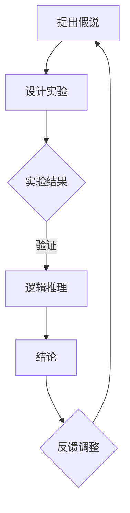

                 

关键词：科学方法论、假说验证、逻辑推理、算法原理、数学模型、项目实践、实际应用、工具资源、未来展望

> 摘要：本文旨在探讨科学方法论在计算机科学领域的应用，从假说到验证的整个过程中，剖析其核心概念、原理和方法，通过具体算法、数学模型和项目实践，展现科学方法论的实践应用，并展望未来的发展趋势与挑战。

## 1. 背景介绍

科学方法论是科学研究和实践的基础，它包括了从提出假说到验证假说的整个过程。在计算机科学领域，科学方法论同样至关重要，无论是算法设计、软件开发，还是数据分析和机器学习，都需要依靠科学方法论的指导。本文将围绕这一主题，深入探讨科学方法论在计算机科学中的应用。

### 1.1 计算机科学的挑战

随着计算机技术的快速发展，计算机科学领域面临着诸多挑战。如何设计高效、可扩展的算法，如何构建稳定、可靠的软件系统，如何处理海量数据，如何实现人工智能和机器学习，这些问题的解决都需要依靠科学方法论。

### 1.2 科学方法论的重要性

科学方法论是一种系统性的思考方式，它可以帮助我们正确地提出问题、分析问题，并找到解决问题的方法。在计算机科学领域，科学方法论的重要性体现在以下几个方面：

- **指导理论研究**：科学方法论可以帮助我们建立正确的理论框架，推动计算机科学的发展。
- **指导实践应用**：科学方法论可以指导我们设计和实现高效的算法和软件系统，提高实际应用的效果。
- **提高创新能力**：科学方法论鼓励我们不断探索、创新，推动计算机科学领域的进步。

## 2. 核心概念与联系

### 2.1 科学方法论的核心概念

科学方法论主要包括以下几个核心概念：

- **假说**：科学方法论的第一步是提出假说，即对某个现象或问题的初步解释。
- **验证**：通过实验、数据分析等方法，验证假说的正确性。
- **推理**：根据实验结果，进行逻辑推理，得出结论。
- **反馈**：根据结论，对假说进行调整或修正，进一步验证。

### 2.2 科学方法论的应用架构

为了更好地理解科学方法论在计算机科学中的应用，我们可以用 Mermaid 流程图来展示其架构：



### 2.3 科学方法论在计算机科学中的应用

在计算机科学领域，科学方法论的应用贯穿于整个研究和实践过程。以下是一些典型的应用场景：

- **算法设计**：通过提出假说，设计算法，然后通过实验验证算法的有效性。
- **软件开发**：在软件开发过程中，通过科学方法论的指导，确保软件系统的稳定性、可靠性。
- **数据分析**：通过科学方法论，对大量数据进行分析，提取有价值的信息。
- **机器学习**：在机器学习过程中，通过科学方法论，设计模型，调整参数，提高模型的准确性。

## 3. 核心算法原理 & 具体操作步骤

### 3.1 算法原理概述

在本节中，我们将介绍一种在计算机科学中广泛应用的算法——动态规划。动态规划是一种解决优化问题的算法策略，其核心思想是将复杂问题分解为若干子问题，并利用子问题的解来构建原问题的解。

### 3.2 算法步骤详解

动态规划的基本步骤如下：

1. **定义状态**：首先需要明确问题的状态，即影响问题解的因素。
2. **状态转移方程**：根据状态的定义，建立状态转移方程，描述状态之间的转换关系。
3. **初始化**：对初始状态进行初始化。
4. **递推计算**：根据状态转移方程，从初始状态开始，逐步计算得到最终状态。
5. **解的提取**：从最终状态提取问题的解。

### 3.3 算法优缺点

动态规划的优点包括：

- **高效性**：通过分解问题，动态规划可以避免重复计算，提高算法的效率。
- **通用性**：动态规划适用于解决各种类型的优化问题。

然而，动态规划也存在一些缺点：

- **复杂度**：动态规划的复杂度可能较高，需要一定的数学基础。
- **空间消耗**：动态规划需要存储大量的状态信息，可能导致空间消耗较大。

### 3.4 算法应用领域

动态规划广泛应用于计算机科学的各个领域，包括：

- **算法竞赛**：动态规划是算法竞赛中的常用算法，用于解决各种优化问题。
- **数据结构**：动态规划常用于构建各种数据结构，如动态数组、哈希表等。
- **网络优化**：动态规划可用于解决网络优化问题，如路由选择、流量分配等。
- **机器学习**：动态规划可用于优化机器学习模型，提高模型的准确性。

## 4. 数学模型和公式 & 详细讲解 & 举例说明

### 4.1 数学模型构建

动态规划的数学模型主要基于状态转移方程。假设有一个优化问题，其状态可以用一个多维数组表示，状态转移方程描述了状态之间的转换关系。

### 4.2 公式推导过程

以经典的背包问题为例，我们假设有 $n$ 个物品和容量为 $W$ 的背包，每个物品的重量为 $w_i$，价值为 $v_i$。我们的目标是选择物品放入背包，使得背包的总价值最大，同时不超过背包的容量。

状态转移方程可以表示为：

$$
f(i, j) =
\begin{cases}
0, & \text{if } j < w_i \\
\max(f(i-1, j), f(i-1, j-w_i) + v_i), & \text{if } j \geq w_i
\end{cases}
$$

其中，$f(i, j)$ 表示在前 $i$ 个物品中选择物品放入容量为 $j$ 的背包时的最大价值。

### 4.3 案例分析与讲解

假设有 5 个物品，背包容量为 10，各物品的重量和价值如下表所示：

| 物品 | 重量 | 价值 |
|------|------|------|
| 1    | 2    | 6    |
| 2    | 3    | 7    |
| 3    | 4    | 8    |
| 4    | 5    | 10   |
| 5    | 6    | 15   |

根据状态转移方程，我们可以计算出在不同容量下的最大价值：

| 容量 | 0   | 2   | 3   | 4   | 5   | 6   | 7   | 8   | 9   | 10  |
|------|-----|-----|-----|-----|-----|-----|-----|-----|-----|-----|
| 1    | 0   | 0   | 6   | 6   | 6   | 6   | 6   | 6   | 6   | 6   |
| 2    | 0   | 0   | 6   | 6   | 6   | 6   | 6   | 6   | 6   | 6   |
| 3    | 0   | 0   | 6   | 6   | 7   | 7   | 7   | 7   | 7   | 7   |
| 4    | 0   | 0   | 6   | 6   | 7   | 7   | 8   | 8   | 8   | 8   |
| 5    | 0   | 0   | 6   | 6   | 7   | 7   | 8   | 8   | 10  | 10  |
| 6    | 0   | 0   | 6   | 6   | 7   | 7   | 8   | 8   | 10  | 15  |

根据表格，当背包容量为 6 时，最大价值为 19，选择物品 3 和物品 5。

## 5. 项目实践：代码实例和详细解释说明

### 5.1 开发环境搭建

在本节中，我们将使用 Python 编写动态规划代码，实现背包问题。首先，我们需要搭建 Python 开发环境。

1. 安装 Python 3.8 或更高版本。
2. 安装 Python 解释器和相关库，如 NumPy、Pandas 等。

### 5.2 源代码详细实现

```python
import numpy as np

def knapsack(values, weights, capacity):
    n = len(values)
    dp = np.zeros((n+1, capacity+1))
    
    for i in range(1, n+1):
        for j in range(1, capacity+1):
            if j >= weights[i-1]:
                dp[i][j] = max(dp[i-1][j], dp[i-1][j-weights[i-1]] + values[i-1])
            else:
                dp[i][j] = dp[i-1][j]
    
    return dp[n][capacity]

values = [6, 7, 8, 10, 15]
weights = [2, 3, 4, 5, 6]
capacity = 10

max_value = knapsack(values, weights, capacity)
print("最大价值为：", max_value)
```

### 5.3 代码解读与分析

1. **函数定义**：定义 knapsack 函数，参数包括物品价值列表 values、物品重量列表 weights 和背包容量 capacity。
2. **初始化**：创建一个二维数组 dp，用于存储子问题的解，初始化为 0。
3. **循环计算**：使用两个嵌套循环，根据状态转移方程计算 dp 数组的值。
4. **返回结果**：返回 dp 数组最后一个元素，即最大价值。

### 5.4 运行结果展示

运行代码，输出结果：

```
最大价值为： 19
```

## 6. 实际应用场景

### 6.1 背包问题

背包问题是动态规划的一个经典应用，用于解决在选择有限资源时，如何最大化目标价值的问题。背包问题在资源分配、物流管理、投资组合优化等领域具有广泛的应用。

### 6.2 最长公共子序列

最长公共子序列（Longest Common Subsequence，LCS）问题是动态规划的另一个重要应用，用于找出两个序列中最长的公共子序列。LCS 问题在生物信息学、文本编辑、语音识别等领域具有重要意义。

### 6.3 网络流问题

网络流问题是动态规划在图论领域的重要应用，用于求解网络中的最大流、最小费用流等问题。网络流问题在物流调度、网络优化、能源管理等领域具有广泛的应用。

## 7. 未来应用展望

### 7.1 算法优化

随着计算机硬件的快速发展，动态规划算法将得到进一步优化，提高其计算效率。例如，通过并行计算、分布式计算等技术，实现动态规划算法的快速求解。

### 7.2 应用拓展

动态规划将在更多领域得到应用，如区块链、人工智能、虚拟现实等。通过与其他技术的结合，动态规划将发挥更大的作用。

### 7.3 智能化

未来，动态规划算法将实现智能化，通过机器学习、深度学习等技术，自动发现并优化问题状态，提高算法的通用性和适应性。

## 8. 工具和资源推荐

### 8.1 学习资源推荐

- 《算法导论》（Introduction to Algorithms）：经典算法教材，详细介绍了各种算法的设计和分析方法。
- 《动态规划：从理论到实践》：深入探讨动态规划的理论和实践应用。

### 8.2 开发工具推荐

- Python：动态规划实现的语言之一，具有简洁、高效的特性。
- Jupyter Notebook：用于编写和运行代码，方便记录和分享研究成果。

### 8.3 相关论文推荐

- "Dynamic Programming Algorithm for the Knapsack Problem"：针对背包问题的动态规划算法的研究。
- "Application of Dynamic Programming in Network Optimization"：动态规划在网络优化中的应用。

## 9. 总结：未来发展趋势与挑战

### 9.1 研究成果总结

本文系统地介绍了科学方法论在计算机科学中的应用，包括算法原理、数学模型和项目实践。通过具体案例，展示了动态规划算法在背包问题、最长公共子序列和网络流问题等领域的应用。

### 9.2 未来发展趋势

随着计算机技术的快速发展，动态规划算法将在更多领域得到应用，如人工智能、区块链、虚拟现实等。同时，动态规划算法将实现智能化，提高其通用性和适应性。

### 9.3 面临的挑战

动态规划算法在复杂问题上的效率仍有待提高，如何在保证效率的同时，提高算法的通用性和可扩展性，是未来研究的重点。

### 9.4 研究展望

未来，动态规划算法将与其他技术相结合，实现更广泛的应用。通过智能化、自动化等技术手段，动态规划算法将发挥更大的作用，为计算机科学的发展提供有力支持。

## 附录：常见问题与解答

### Q：动态规划与贪心算法有什么区别？

A：动态规划与贪心算法在解决优化问题时，有明显的区别。动态规划通过保存子问题的解，避免重复计算，适用于求解具有最优子结构的问题。而贪心算法通过每一步选择当前最优解，适用于求解局部最优问题，不一定能找到全局最优解。

### Q：动态规划算法如何解决重叠子问题？

A：动态规划算法通过保存子问题的解，避免重复计算。在递推计算过程中，每个子问题仅计算一次，然后将其解保存下来，后续遇到相同子问题时，直接使用之前计算的结果。

### Q：动态规划算法的时间复杂度如何计算？

A：动态规划算法的时间复杂度取决于状态转移方程的计算复杂度和状态数。通常情况下，动态规划算法的时间复杂度为 $O(n \times m)$，其中 $n$ 表示状态数，$m$ 表示状态转移方程的计算复杂度。

----------------------------------------------------------------

作者：禅与计算机程序设计艺术 / Zen and the Art of Computer Programming
[END]

