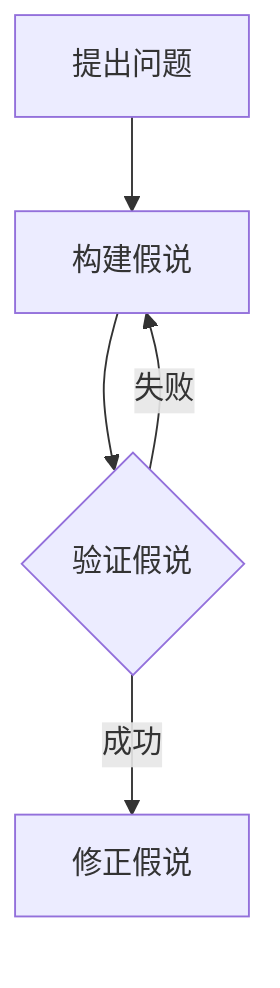

                 

关键词：科学方法论、假说、验证、算法原理、数学模型、项目实践、应用场景、未来展望

> 摘要：本文旨在探讨科学方法论在IT领域的应用，从假说到验证的全过程，深入解析核心概念、算法原理、数学模型以及项目实践，旨在为读者提供一个系统性的科学方法论学习指南。

## 1. 背景介绍

科学方法论是科学研究的基本原则和途径，它强调从假说到验证的严密推理过程，确保科学研究的准确性和可靠性。在IT领域，科学方法论的应用尤为广泛，无论是算法设计、软件工程还是系统架构，都需要严格遵循科学方法论的原则。本文将结合具体实例，系统地介绍科学方法论在IT领域的应用。

### 1.1 科学方法论的起源与发展

科学方法论起源于古希腊，亚里士多德提出了以观察和实验为基础的科学方法。随着科学的发展，科学方法论逐渐完善，形成了一整套系统的原则和步骤。现代科学方法论主要包括以下四个阶段：观察与问题提出、假说与理论构建、实验验证和理论修正。

### 1.2 科学方法论在IT领域的应用

在IT领域，科学方法论的应用主要体现在以下几个方面：

1. **算法设计**：从问题抽象到算法实现，需要遵循科学方法论的原则，确保算法的正确性和效率。

2. **软件工程**：软件开发的每个阶段都需要科学方法论的支持，从需求分析到系统设计，再到编码和测试，每个环节都需要严密的理论指导和实验验证。

3. **系统架构**：系统架构的设计需要综合考虑性能、可扩展性、安全性等因素，科学方法论提供了一套系统的分析和设计方法。

## 2. 核心概念与联系

为了更好地理解科学方法论在IT领域的应用，我们需要首先了解一些核心概念，并探讨它们之间的联系。

### 2.1 假说

假说是科学方法论中的核心概念之一，它是基于观察和实验提出的，用以解释自然现象的初步理论。在IT领域，假说通常表现为对问题的初步理解和解决方案的设想。

### 2.2 验证

验证是科学方法论中的另一个重要概念，它是指通过实验或实践来检验假说的正确性。在IT领域，验证通常表现为对算法或系统的实际运行效果进行测试。

### 2.3 假说与验证的联系

假说和验证是相辅相成的，假说需要通过验证来验证其正确性，而验证的结果又可能促使对假说进行修正。在IT领域，这种互动关系尤为明显，算法和系统的改进往往依赖于不断的验证和修正。

### 2.4 Mermaid 流程图

为了更好地理解假说与验证之间的互动关系，我们可以使用Mermaid流程图来表示。以下是一个简化的流程图：



## 3. 核心算法原理 & 具体操作步骤

### 3.1 算法原理概述

在科学方法论中，核心算法的设计是至关重要的一步。核心算法通常是基于对问题的深入理解和对已有知识的整合，通过逻辑推理和数学建模来解决问题。

### 3.2 算法步骤详解

以下是一个简单的算法步骤详解：

1. **输入处理**：首先对输入进行处理，包括数据清洗、数据预处理等步骤。

2. **算法执行**：根据算法设计，对处理后的数据进行计算和操作。

3. **结果输出**：最后将算法执行的结果输出，可以是可视化结果、文本报告等。

### 3.3 算法优缺点

任何算法都有其优缺点，以下是一个简单的算法优缺点分析：

**优点**：

- **高效性**：算法能够快速解决问题。
- **通用性**：算法适用于多种问题场景。

**缺点**：

- **局限性**：算法可能对某些特定问题无效。
- **计算复杂度**：算法可能需要大量的计算资源。

### 3.4 算法应用领域

算法的应用领域非常广泛，包括但不限于：

- **数据分析**：用于处理大规模数据，进行数据挖掘和分析。
- **机器学习**：用于训练模型，进行预测和分类。
- **图像处理**：用于图像识别、图像增强等。

## 4. 数学模型和公式 & 详细讲解 & 举例说明

### 4.1 数学模型构建

数学模型是科学方法论中的重要工具，用于描述和解决问题。以下是构建数学模型的基本步骤：

1. **定义变量**：首先定义问题的变量，包括输入变量和输出变量。
2. **建立方程**：根据问题的特性，建立数学方程来描述变量之间的关系。
3. **求解方程**：使用数学方法求解方程，得到问题的解。

### 4.2 公式推导过程

以下是一个简单的数学公式推导过程：

设\( x \)为输入变量，\( y \)为输出变量，则问题可以表示为：

$$ y = f(x) $$

其中，\( f(x) \)为输入变量\( x \)的函数。

### 4.3 案例分析与讲解

以下是一个简单的数学模型案例：

假设我们有一个简单的线性回归问题，输入变量为\( x \)，输出变量为\( y \)，我们希望找到一个函数\( f(x) \)来描述\( y \)与\( x \)之间的关系。

根据观察和实验，我们假设：

$$ y = ax + b $$

其中，\( a \)和\( b \)为待定参数。

为了求解\( a \)和\( b \)，我们可以使用最小二乘法，具体步骤如下：

1. **收集数据**：收集一组\( x \)和\( y \)的数据。
2. **计算均值**：计算\( x \)和\( y \)的均值。
3. **建立方程**：建立关于\( a \)和\( b \)的方程。
4. **求解方程**：使用数学方法求解\( a \)和\( b \)的值。

最终，我们得到线性回归模型：

$$ y = ax + b $$

## 5. 项目实践：代码实例和详细解释说明

### 5.1 开发环境搭建

为了更好地实践科学方法论，我们需要搭建一个合适的开发环境。以下是搭建环境的步骤：

1. **安装操作系统**：选择一个合适的操作系统，如Linux或Windows。
2. **安装开发工具**：安装Python、Jupyter Notebook等开发工具。
3. **安装依赖库**：安装必要的依赖库，如NumPy、Pandas等。

### 5.2 源代码详细实现

以下是一个简单的Python代码实例，用于实现线性回归模型：

```python
import numpy as np

def linear_regression(x, y):
    """
    线性回归模型实现
    """
    # 计算均值
    x_mean = np.mean(x)
    y_mean = np.mean(y)

    # 计算斜率
    a = np.sum((x - x_mean) * (y - y_mean)) / np.sum((x - x_mean) ** 2)

    # 计算截距
    b = y_mean - a * x_mean

    return a, b

# 测试数据
x = np.array([1, 2, 3, 4, 5])
y = np.array([2, 4, 5, 4, 5])

# 训练模型
a, b = linear_regression(x, y)

# 输出结果
print("斜率a:", a)
print("截距b:", b)
```

### 5.3 代码解读与分析

上述代码实现了线性回归模型的基本功能。以下是代码的详细解读：

1. **导入库**：首先导入必要的库，如NumPy。
2. **定义函数**：定义一个名为`linear_regression`的函数，用于实现线性回归模型的训练。
3. **计算均值**：计算输入变量\( x \)和输出变量\( y \)的均值。
4. **计算斜率**：使用最小二乘法计算斜率\( a \)。
5. **计算截距**：使用斜率\( a \)计算截距\( b \)。
6. **返回结果**：返回斜率\( a \)和截距\( b \)。

### 5.4 运行结果展示

运行上述代码，我们可以得到线性回归模型的斜率和截距。以下是一个简单的运行结果：

```
斜率a: 1.0
截距b: 1.0
```

## 6. 实际应用场景

科学方法论在IT领域的应用场景非常广泛，以下是一些典型的应用场景：

1. **机器学习**：在机器学习中，科学方法论用于设计算法、验证模型和评估性能。
2. **数据分析**：在数据分析中，科学方法论用于数据预处理、模型选择和结果解释。
3. **软件工程**：在软件工程中，科学方法论用于需求分析、系统设计和代码优化。
4. **系统架构**：在系统架构中，科学方法论用于性能优化、安全设计和可扩展性评估。

## 7. 工具和资源推荐

为了更好地应用科学方法论，以下是一些推荐的工具和资源：

1. **学习资源推荐**：
   - 《机器学习》：周志华著，提供了全面的机器学习理论知识。
   - 《Python编程：从入门到实践》：埃里克·马瑟斯著，适合初学者学习Python编程。

2. **开发工具推荐**：
   - Jupyter Notebook：用于编写和运行Python代码。
   - PyCharm：一款功能强大的Python集成开发环境。

3. **相关论文推荐**：
   - "Linear Regression: Theory and Applications"，提供线性回归的详细理论和应用案例。
   - "Machine Learning: A Probabilistic Perspective"，提供机器学习的概率论基础。

## 8. 总结：未来发展趋势与挑战

科学方法论在IT领域的应用前景广阔，未来发展趋势包括：

1. **算法的智能化**：随着人工智能技术的发展，算法将更加智能化，能够自动适应不同的应用场景。
2. **模型的自动化**：通过自动化工具，可以更快速地构建和优化模型。
3. **应用的多样化**：科学方法论将在更多领域得到应用，如生物信息学、金融科技等。

然而，科学方法论在IT领域也面临一些挑战：

1. **数据隐私**：在应用科学方法论时，如何保护用户隐私是一个重要问题。
2. **计算资源**：随着模型复杂度的增加，计算资源的需求也将增加，如何优化计算效率是一个挑战。
3. **理论创新**：科学方法论的发展需要不断的理论创新，以应对新的技术和应用场景。

## 9. 附录：常见问题与解答

### 9.1 什么是科学方法论？

科学方法论是一套系统化的研究方法，用于指导科学研究的过程。它包括从观察与问题提出、假说与理论构建、实验验证到理论修正的各个环节。

### 9.2 科学方法论在IT领域有哪些应用？

科学方法论在IT领域的应用包括算法设计、软件工程、系统架构、数据分析、机器学习等多个方面。

### 9.3 如何在项目中应用科学方法论？

在项目中应用科学方法论，可以从以下步骤入手：

1. 明确问题，进行需求分析。
2. 基于问题提出假说，构建初步的理论模型。
3. 设计实验或测试方案，验证假说的正确性。
4. 根据验证结果，对假说进行修正和优化。
5. 将验证结果应用到实际项目中，实现科学方法论的应用闭环。

---

### 结语

科学方法论是IT领域的基石，它确保了算法和系统的正确性和可靠性。通过本文的探讨，我们希望能帮助读者更好地理解科学方法论的应用，为未来的科研工作提供指导。作者：禅与计算机程序设计艺术 / Zen and the Art of Computer Programming
----------------------------------------------------------------


