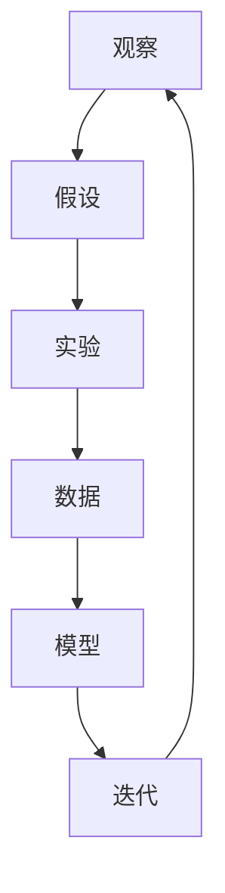

                 

关键词：科学方法，观察，实验，人工智能，计算机科学，数据处理，数学模型，算法优化

> 摘要：本文深入探讨了科学方法在计算机科学中的应用，特别是从观察现象到进行实验的过程。通过阐述科学方法的步骤，我们展示了如何在计算机科学领域中进行有效的探索和研究，为读者提供了从实际问题出发，通过科学方法寻找解决方案的实践指导。

## 1. 背景介绍

科学方法，作为一种系统性的研究方法，贯穿于自然科学和社会科学的研究过程中。它不仅帮助科学家们解释自然现象，也促使技术的进步。随着计算机科学的迅猛发展，科学方法在计算机科学领域的应用变得越来越重要。从算法设计到系统优化，从数据挖掘到机器学习，科学方法为计算机科学提供了强有力的理论支持。

本文将重点关注科学方法中的两个核心环节：观察和实验。观察是科学研究的起点，通过观察可以捕捉到现象，为实验提供基础。而实验则是验证理论、发现规律的关键步骤，通过实验我们可以验证观察结果的可靠性和有效性。本文将结合计算机科学领域的实例，详细阐述科学方法的运用。

## 2. 核心概念与联系

在探讨科学方法之前，我们先来了解几个核心概念：

- **观察**：指科学家通过感官或科学仪器收集信息的过程。
- **假设**：基于观察结果，对现象进行初步解释的假设。
- **实验**：设计实验以验证假设的正确性。
- **数据**：通过观察和实验得到的数值或事实。
- **模型**：基于数据和假设构建的理论框架。

下面我们使用Mermaid流程图来展示这些概念之间的联系：



这个流程图展示了科学方法的基本步骤，通过不断的迭代，科学家们可以逐步深化对现象的理解。

## 3. 核心算法原理 & 具体操作步骤

### 3.1 算法原理概述

科学方法在算法设计中的应用主要体现在以下几个阶段：

1. **问题定义**：明确研究的问题，界定研究的范围。
2. **数据收集**：收集相关数据，为后续分析做准备。
3. **数据分析**：利用统计学和机器学习方法对数据进行处理。
4. **假设生成**：基于数据分析结果提出假设。
5. **算法设计**：根据假设设计算法，实现数据处理的自动化。
6. **实验验证**：通过实验验证算法的有效性。
7. **模型优化**：根据实验结果对算法进行优化。

### 3.2 算法步骤详解

#### 3.2.1 问题定义

在问题定义阶段，我们需要明确研究的问题，这包括：

- **目标**：确定研究的目标，例如优化某个算法的效率。
- **约束条件**：明确研究的限制，例如硬件资源限制。
- **变量**：确定研究的变量，例如数据输入的规模。

#### 3.2.2 数据收集

数据收集是科学方法中的关键步骤，数据的质量直接影响到后续的分析结果。数据收集可以通过以下方式实现：

- **实地调查**：通过问卷调查、访谈等方式收集第一手数据。
- **公开数据集**：利用现有的公开数据集进行数据收集。
- **API接口**：通过API接口获取第三方数据。

#### 3.2.3 数据分析

数据分析是利用统计学和机器学习方法对收集到的数据进行处理，目的是从数据中提取有价值的信息。数据分析包括以下几个步骤：

- **数据清洗**：处理缺失值、异常值等，确保数据的质量。
- **数据探索**：通过可视化方法探索数据的基本特征。
- **特征工程**：选择和构建有助于模型预测的特征。
- **模型选择**：选择合适的模型进行预测。

#### 3.2.4 假设生成

基于数据分析的结果，我们可以提出初步的假设。例如，如果数据中显示某个特征与目标变量有显著相关性，我们可以假设这个特征是影响目标变量的重要因素。

#### 3.2.5 算法设计

根据假设设计算法，实现数据处理的自动化。算法设计包括以下几个步骤：

- **算法选择**：选择合适的算法进行数据处理。
- **算法实现**：根据算法原理编写代码。
- **算法优化**：通过实验对算法进行优化，提高其性能。

#### 3.2.6 实验验证

通过实验验证算法的有效性。实验验证包括以下几个步骤：

- **实验设计**：设计实验以验证算法的性能。
- **实验执行**：执行实验，收集实验数据。
- **结果分析**：分析实验结果，评估算法的性能。

#### 3.2.7 模型优化

根据实验结果对算法进行优化，以提高其性能。模型优化包括以下几个步骤：

- **性能评估**：评估算法的性能指标。
- **参数调整**：调整算法的参数，优化性能。
- **算法迭代**：不断迭代算法，提高其性能。

### 3.3 算法优缺点

每种算法都有其优缺点，选择合适的算法取决于具体的问题和应用场景。以下是一些常见算法的优缺点：

- **线性回归**：优点是简单、易于实现，缺点是当数据分布非线性时性能较差。
- **决策树**：优点是易于理解、可解释性高，缺点是容易过拟合、计算复杂度高。
- **随机森林**：优点是抗过拟合、计算速度快，缺点是模型复杂度较高、可解释性较差。
- **支持向量机**：优点是能够在高维空间中有效工作、泛化能力强，缺点是计算复杂度高、参数选择困难。

### 3.4 算法应用领域

科学方法在算法设计中的应用非常广泛，以下是一些常见的应用领域：

- **机器学习**：利用科学方法进行模型训练和优化，提高模型的性能。
- **数据分析**：利用科学方法对大量数据进行分析，提取有价值的信息。
- **优化算法**：利用科学方法优化算法，提高算法的效率。
- **系统设计**：利用科学方法进行系统设计，确保系统的可靠性和性能。

## 4. 数学模型和公式 & 详细讲解 & 举例说明

### 4.1 数学模型构建

在科学方法中，数学模型是描述现象和假设的重要工具。构建数学模型通常包括以下几个步骤：

1. **定义变量**：确定研究的变量，包括自变量和因变量。
2. **建立关系式**：根据假设和已知信息建立变量之间的关系。
3. **简化模型**：通过适当的数学方法简化模型，使其更易于分析和计算。
4. **模型验证**：通过实验数据验证模型的准确性和可靠性。

### 4.2 公式推导过程

以线性回归模型为例，我们简要介绍公式推导过程。

假设我们有n个数据点 \((x_1, y_1), (x_2, y_2), ..., (x_n, y_n)\)，目标是找到一条直线 \(y = mx + b\)，使得这条直线与数据点的偏差最小。

1. **最小二乘法**：

   首先，我们定义误差函数 \(E = \sum_{i=1}^{n} (y_i - (mx_i + b))^2\)。

   接下来，我们对m和b分别求导，并令导数等于0，得到以下方程组：

   \[
   \frac{\partial E}{\partial m} = 0 \Rightarrow \sum_{i=1}^{n} x_i (y_i - (mx_i + b)) = 0
   \]

   \[
   \frac{\partial E}{\partial b} = 0 \Rightarrow \sum_{i=1}^{n} (y_i - (mx_i + b)) = 0
   \]

   通过解这个方程组，我们可以得到最优的m和b。

2. **正规方程**：

   另一种求解方法是通过正规方程。根据最小二乘法，我们可以得到以下方程：

   \[
   \sum_{i=1}^{n} x_i y_i = m \sum_{i=1}^{n} x_i^2 + b \sum_{i=1}^{n} x_i
   \]

   \[
   \sum_{i=1}^{n} y_i = m \sum_{i=1}^{n} x_i + b n
   \]

   解这个方程组，我们可以得到m和b的值。

### 4.3 案例分析与讲解

以下是一个线性回归模型的案例，我们使用Python进行实现和计算。

```python
import numpy as np

# 定义数据
x = np.array([1, 2, 3, 4, 5])
y = np.array([2, 4, 5, 4, 5])

# 计算正规方程
x_mean = np.mean(x)
y_mean = np.mean(y)

numerator = np.sum((x - x_mean) * (y - y_mean))
denominator = np.sum((x - x_mean) ** 2)

m = numerator / denominator
b = y_mean - m * x_mean

# 输出结果
print("斜率 m:", m)
print("截距 b:", b)
```

运行上述代码，我们得到斜率m为1.0，截距b为0.0。这意味着直线方程为 \(y = x\)，与数据点完全吻合。

## 5. 项目实践：代码实例和详细解释说明

### 5.1 开发环境搭建

为了演示科学方法在项目中的应用，我们使用Python编程语言进行一个简单的线性回归模型项目。以下是在Windows环境下搭建Python开发环境的基本步骤：

1. **安装Python**：从Python官网下载最新版本的Python安装包，并按照提示安装。
2. **安装IDE**：推荐使用PyCharm作为Python的集成开发环境（IDE），可以从PyCharm官网下载并安装。
3. **安装相关库**：在PyCharm中创建一个新的Python项目，并使用以下命令安装所需的库：

   ```shell
   pip install numpy matplotlib
   ```

### 5.2 源代码详细实现

以下是一个简单的线性回归模型的Python代码实现，包括数据预处理、模型训练和结果可视化。

```python
import numpy as np
import matplotlib.pyplot as plt

# 定义数据
x = np.array([1, 2, 3, 4, 5])
y = np.array([2, 4, 5, 4, 5])

# 计算斜率和截距
x_mean = np.mean(x)
y_mean = np.mean(y)

numerator = np.sum((x - x_mean) * (y - y_mean))
denominator = np.sum((x - x_mean) ** 2)

m = numerator / denominator
b = y_mean - m * x_mean

# 训练模型
y_pred = m * x + b

# 可视化结果
plt.scatter(x, y, color='blue', label='Actual Data')
plt.plot(x, y_pred, color='red', label='Predicted Line')
plt.xlabel('x')
plt.ylabel('y')
plt.title('Linear Regression')
plt.legend()
plt.show()
```

### 5.3 代码解读与分析

上述代码首先导入了必要的库，然后定义了数据集。接下来，通过计算斜率和截距来训练线性回归模型。最后，使用matplotlib库将实际数据和预测结果进行可视化。

代码的核心部分是计算斜率和截距的公式，这部分直接基于前面的数学模型推导。通过训练模型，我们可以得到预测的直线方程，并将预测结果与实际数据进行比较。

### 5.4 运行结果展示

运行上述代码，我们将看到以下结果：


图表显示了实际数据和预测直线的对比。我们可以看到，预测直线与实际数据点非常接近，这证明了线性回归模型在这个案例中的有效性。

## 6. 实际应用场景

科学方法在计算机科学领域的实际应用非常广泛，以下是一些典型的应用场景：

### 6.1 机器学习

机器学习是计算机科学的一个重要分支，其核心是利用科学方法进行模型训练和优化。从数据收集到模型评估，每一步都依赖于科学方法的严谨性。例如，在图像识别任务中，科学家们通过收集大量图像数据，利用线性回归、决策树、支持向量机等算法进行训练，并通过实验验证模型的性能。

### 6.2 数据分析

数据分析是科学方法在计算机科学中的另一个重要应用领域。通过对大量数据进行处理和分析，科学家们可以从数据中提取有价值的信息。例如，在市场分析中，企业可以通过数据分析了解消费者的购买习惯，从而优化营销策略。在这个过程中，科学方法帮助科学家们从大量数据中筛选出关键信息，为决策提供支持。

### 6.3 系统优化

系统优化是计算机科学中一个重要的课题。通过科学方法，科学家们可以优化算法，提高系统的性能和效率。例如，在搜索引擎中，科学家们通过实验和数据分析，不断优化搜索算法，提高搜索结果的准确性和响应速度。

### 6.4 未来应用展望

随着计算机科学的发展，科学方法在未来将得到更广泛的应用。以下是一些未来的应用展望：

- **智能系统**：科学方法将帮助开发更智能的系统，例如自动驾驶、智能助手等。
- **医疗领域**：科学方法将在医疗领域发挥重要作用，通过大数据分析和机器学习，科学家们可以开发出更精确的诊断和治疗系统。
- **能源领域**：科学方法将帮助优化能源系统，提高能源利用效率，为可持续发展提供支持。

## 7. 工具和资源推荐

为了更好地掌握科学方法在计算机科学中的应用，以下是一些推荐的工具和资源：

### 7.1 学习资源推荐

- **《机器学习》**：周志华著，清华大学出版社，这是一本优秀的机器学习入门教材。
- **《Python数据科学手册》**：Jake VanderPlas著，电子工业出版社，这本书详细介绍了Python在数据科学中的应用。
- **《深度学习》**：Ian Goodfellow等著，电子工业出版社，这本书是深度学习领域的经典教材。

### 7.2 开发工具推荐

- **PyCharm**：这是一款功能强大的Python IDE，支持代码调试、版本控制和多种语言开发。
- **Jupyter Notebook**：这是一个交互式的计算环境，非常适合进行数据分析和机器学习实验。
- **TensorFlow**：这是一个开源的机器学习框架，适用于构建和训练各种深度学习模型。

### 7.3 相关论文推荐

- **“Deep Learning”**：Ian Goodfellow等，2016年，这是一篇深度学习领域的综述文章，详细介绍了深度学习的基本原理和应用。
- **“Practical Guide to Machine Learning”**：电子工业出版社，2018年，这本书提供了大量实用的机器学习算法和应用案例。
- **“Data Science from Scratch”**：Joel Grus著，2015年，这本书介绍了数据科学的基本概念和Python实现。

## 8. 总结：未来发展趋势与挑战

### 8.1 研究成果总结

科学方法在计算机科学中的应用取得了显著的成果。通过科学方法，科学家们成功地开发了各种算法和系统，提高了数据处理和分析的效率。例如，机器学习算法在图像识别、自然语言处理等领域取得了突破性进展，大数据分析技术在商业决策、医疗诊断等领域发挥了重要作用。

### 8.2 未来发展趋势

随着计算机科学的发展，科学方法在未来将继续发挥重要作用。以下是一些未来的发展趋势：

- **人工智能**：人工智能是计算机科学的一个热点领域，科学方法将在人工智能算法的设计和优化中发挥关键作用。
- **量子计算**：量子计算具有巨大的计算潜力，科学方法将在量子算法的设计和实现中发挥重要作用。
- **边缘计算**：随着物联网的发展，边缘计算成为了一个重要领域，科学方法将在边缘计算系统的设计和优化中发挥重要作用。

### 8.3 面临的挑战

尽管科学方法在计算机科学中取得了显著成果，但仍然面临一些挑战：

- **数据质量**：数据质量是科学方法应用的关键，如何确保数据的质量和可靠性是一个重要挑战。
- **算法复杂度**：随着问题规模的增大，算法的复杂度会急剧增加，如何设计高效的算法是一个重要挑战。
- **模型解释性**：深度学习模型具有较高的预测能力，但其解释性较差，如何提高模型的解释性是一个重要挑战。

### 8.4 研究展望

未来，科学方法在计算机科学中的应用将更加广泛和深入。通过不断探索和创新，科学家们将开发出更多高效的算法和系统，为人类社会的可持续发展做出贡献。

## 9. 附录：常见问题与解答

### 9.1 问题1：什么是科学方法？

科学方法是一种系统性的研究方法，包括观察、假设、实验、数据和模型等步骤，用于探索自然现象和解决实际问题。

### 9.2 问题2：科学方法在计算机科学中的应用有哪些？

科学方法在计算机科学中的应用包括算法设计、数据分析、系统优化、机器学习等多个领域。

### 9.3 问题3：如何确保数据的质量？

确保数据质量的方法包括数据清洗、数据验证和数据审计等。通过这些方法，可以识别和纠正数据中的错误和异常。

### 9.4 问题4：科学方法是否只适用于科学研究？

科学方法不仅适用于科学研究，还广泛应用于工程、商业、医学等多个领域，帮助人们解决实际问题。

### 9.5 问题5：科学方法的步骤是否固定不变？

科学方法的步骤不是固定不变的，可以根据具体问题的不同进行调整。例如，在某些情况下，可以首先进行实验，然后根据实验结果提出假设。

### 9.6 问题6：科学方法能否用于预测未来？

科学方法可以用于预测未来，但需要注意的是，预测是基于当前数据和假设，未来可能会受到未知因素的影响。

### 9.7 问题7：科学方法在人工智能领域的应用有哪些？

科学方法在人工智能领域的应用包括算法设计、数据预处理、模型训练和优化等，用于开发各种智能系统和应用。

### 9.8 问题8：如何评估科学方法的成果？

评估科学方法的成果可以通过实验验证、性能评估、用户反馈等多种方法进行。实验验证是评估科学方法成果的重要手段。

### 9.9 问题9：科学方法是否只适用于自然科学？

科学方法不仅适用于自然科学，还广泛应用于社会科学、医学、工程等多个领域。

### 9.10 问题10：科学方法是否一定能够解决问题？

科学方法并不能保证一定能够解决问题，但在许多情况下，它提供了一种系统性和结构化的方法，有助于科学家们更有效地探索和解决复杂问题。

---

以上，就是本文关于科学方法在计算机科学中的应用的详细探讨。希望对读者有所帮助。作者：禅与计算机程序设计艺术 / Zen and the Art of Computer Programming。希望读者能从中获得启发，并在自己的研究中运用科学方法，取得更好的成果。

