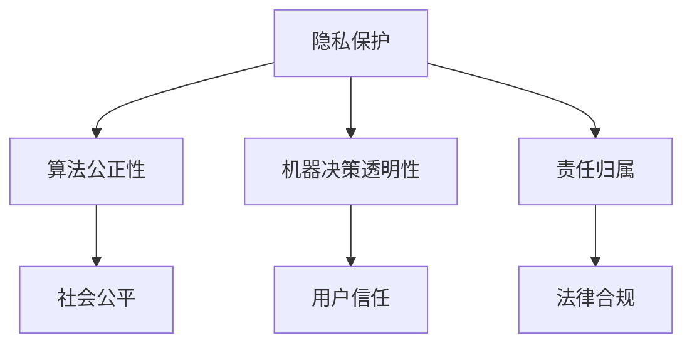

                 

关键词：人工智能、伦理、计算、科技发展、社会责任

> 摘要：在科技迅猛发展的今天，人工智能和计算技术深刻影响着我们的生活方式。然而，随着技术的进步，伦理问题也随之而来。本文将探讨科技与伦理之间的平衡点，分析人工智能和计算技术带来的伦理挑战，并提出相应的解决策略。

## 1. 背景介绍

随着计算技术的飞速发展，人工智能（AI）逐渐成为现代社会的重要驱动力。从自动驾驶汽车到智能医疗，AI 的应用无处不在。然而，AI 的发展也引发了一系列伦理问题，如隐私保护、算法歧视、机器决策的透明性和责任归属等。如何在追求科技进步的同时，维护伦理原则，成为了一个亟待解决的问题。

### 1.1 计算技术的发展

计算技术始于20世纪40年代，当时第一台电子计算机问世。随着处理器速度的提高、存储容量的增加以及算法的优化，计算技术经历了翻天覆地的变化。近年来，深度学习、神经网络等前沿技术的突破，使得人工智能在图像识别、自然语言处理等领域取得了显著成果。

### 1.2 人工智能的崛起

人工智能是指通过计算机模拟人类的智能行为，使机器能够自主地学习和决策。自20世纪50年代以来，人工智能经历了多次兴衰。随着深度学习等技术的兴起，AI 再次焕发出强大的生命力。如今，人工智能已经成为推动科技发展的关键力量。

### 1.3 伦理问题的凸显

在 AI 和计算技术发展的过程中，一系列伦理问题逐渐浮现。例如，隐私泄露问题在社交媒体和大数据分析领域尤为突出。算法歧视则可能导致社会不公平，如招聘中的性别和种族歧视。此外，机器决策的透明性和责任归属也成为热议的话题。

## 2. 核心概念与联系

### 2.1 伦理学的基本概念

伦理学是研究道德原则和价值观的学科。在讨论科技与伦理的关系时，我们需要了解以下几个核心概念：

- **道德原则**：道德原则是人们行为规范的基础，如尊重个人隐私、公正和平等。
- **道德责任**：道德责任是指个体在道德上应承担的责任，如对社会公平、环境保护的责任。
- **道德决策**：道德决策是指在面对伦理问题时，如何做出符合道德原则的决策。

### 2.2 计算机伦理

计算机伦理是研究计算机技术在使用过程中所涉及的伦理问题的学科。以下是几个与计算机伦理密切相关的问题：

- **隐私保护**：保护用户的隐私是计算机伦理的核心问题之一。大数据和云计算技术的发展，使得隐私泄露的风险增加。
- **算法公正性**：算法公正性是指算法在决策过程中不受到性别、种族等因素的影响。算法歧视可能导致社会不公平。
- **机器决策透明性**：机器决策的透明性是指用户能够理解并追踪算法的决策过程。这有助于提高算法的可信度。
- **责任归属**：在出现问题时，如何确定责任归属是计算机伦理的一个重要议题。例如，自动驾驶汽车发生事故时，责任应由谁承担？

### 2.3 Mermaid 流程图

为了更好地理解计算机伦理的相关问题，我们可以使用 Mermaid 流程图来展示它们之间的联系。以下是几个流程节点：



## 3. 核心算法原理 & 具体操作步骤

### 3.1 算法原理概述

在讨论计算机伦理时，算法原理和具体操作步骤至关重要。以下是几个关键的算法原理：

- **机器学习算法**：机器学习算法是 AI 的核心。通过训练数据集，机器学习算法能够自动地学习和优化模型。
- **深度学习算法**：深度学习算法是机器学习的一种，它通过多层神经网络来模拟人类大脑的学习过程。
- **决策树算法**：决策树算法是一种分类算法，通过树形结构来表示决策过程。
- **逻辑回归算法**：逻辑回归算法是一种常用的回归算法，用于预测二分类结果。

### 3.2 算法步骤详解

以下是几个关键算法的具体操作步骤：

- **机器学习算法**：
  1. 数据预处理：清洗和归一化数据。
  2. 模型训练：使用训练数据集训练模型。
  3. 模型评估：使用测试数据集评估模型性能。
  4. 模型优化：根据评估结果调整模型参数。

- **深度学习算法**：
  1. 数据预处理：与机器学习算法相同。
  2. 构建神经网络：设计多层神经网络结构。
  3. 模型训练：使用反向传播算法训练模型。
  4. 模型评估：与机器学习算法相同。
  5. 模型优化：调整网络结构和超参数。

- **决策树算法**：
  1. 构建决策树：根据特征和目标值构建决策树。
  2. 切分数据集：将数据集划分为训练集和测试集。
  3. 训练模型：使用训练数据集训练决策树。
  4. 模型评估：使用测试数据集评估模型性能。

- **逻辑回归算法**：
  1. 数据预处理：与机器学习算法相同。
  2. 构建逻辑回归模型：使用线性回归模型预测概率。
  3. 训练模型：使用训练数据集训练模型。
  4. 模型评估：使用测试数据集评估模型性能。

### 3.3 算法优缺点

以下是几个算法的优缺点：

- **机器学习算法**：
  - 优点：灵活性强，适用于多种任务。
  - 缺点：对数据质量要求高，训练时间较长。

- **深度学习算法**：
  - 优点：能够处理高维数据，效果显著。
  - 缺点：计算资源需求高，对数据量要求大。

- **决策树算法**：
  - 优点：易于理解和实现，计算效率高。
  - 缺点：易过拟合，对数据量要求低。

- **逻辑回归算法**：
  - 优点：计算简单，易于实现。
  - 缺点：适用于线性可分数据，对非线性问题效果较差。

### 3.4 算法应用领域

以下是几个算法的主要应用领域：

- **机器学习算法**：推荐系统、图像识别、自然语言处理等。
- **深度学习算法**：自动驾驶、语音识别、医学影像分析等。
- **决策树算法**：金融风控、信用评分、物流优化等。
- **逻辑回归算法**：市场营销、医疗诊断、社交媒体分析等。

## 4. 数学模型和公式 & 详细讲解 & 举例说明

### 4.1 数学模型构建

在讨论计算机伦理时，数学模型和公式起到关键作用。以下是一个简单的数学模型示例：

$$y = \beta_0 + \beta_1x_1 + \beta_2x_2 + ... + \beta_nx_n$$

这是一个线性回归模型，用于预测连续值输出。其中，$y$ 是目标变量，$x_1, x_2, ..., x_n$ 是输入特征，$\beta_0, \beta_1, ..., \beta_n$ 是模型参数。

### 4.2 公式推导过程

线性回归模型的推导过程如下：

1. **最小二乘法**：

   线性回归模型的目标是最小化预测值与实际值之间的误差平方和。即：

   $$\min \sum_{i=1}^{n}(y_i - \hat{y}_i)^2$$

   其中，$\hat{y}_i$ 是预测值，$y_i$ 是实际值。

2. **梯度下降法**：

   为了找到最优的模型参数，我们可以使用梯度下降法。梯度下降法的核心思想是沿着目标函数的梯度方向，逐渐减小误差。

   $$\beta_j := \beta_j - \alpha \frac{\partial}{\partial \beta_j} \sum_{i=1}^{n}(y_i - \hat{y}_i)^2$$

   其中，$\alpha$ 是学习率，$\beta_j$ 是模型参数。

3. **闭式解**：

   在某些情况下，我们可以通过闭式解找到最优的模型参数。线性回归模型就是一个例子。闭式解可以通过矩阵运算得到：

   $$\beta = (X^T X)^{-1}X^T y$$

   其中，$X$ 是输入特征矩阵，$y$ 是目标变量。

### 4.3 案例分析与讲解

以下是一个简单的案例，用于讲解线性回归模型的构建和求解过程。

#### 4.3.1 数据集准备

假设我们有一个包含10个数据点的数据集，其中包含两个输入特征 $x_1$ 和 $x_2$，以及一个目标变量 $y$。

| $x_1$ | $x_2$ | $y$ |
|------|------|-----|
| 1    | 2    | 3   |
| 2    | 3    | 4   |
| 3    | 4    | 5   |
| 4    | 5    | 6   |
| 5    | 6    | 7   |
| 6    | 7    | 8   |
| 7    | 8    | 9   |
| 8    | 9    | 10  |
| 9    | 10   | 11  |
| 10   | 11   | 12  |

#### 4.3.2 数据预处理

首先，我们需要对数据进行预处理。具体步骤如下：

1. **标准化**：

   对输入特征 $x_1$ 和 $x_2$ 进行标准化，即将每个特征缩放到相同的尺度。标准化公式如下：

   $$x_{1,i}^{'} = \frac{x_{1,i} - \mu_1}{\sigma_1}$$

   $$x_{2,i}^{'} = \frac{x_{2,i} - \mu_2}{\sigma_2}$$

   其中，$\mu_1$ 和 $\mu_2$ 分别是 $x_1$ 和 $x_2$ 的均值，$\sigma_1$ 和 $\sigma_2$ 分别是 $x_1$ 和 $x_2$ 的标准差。

   标准化后的数据如下：

   | $x_1$ | $x_2$ | $y$ |
   |------|------|-----|
   | 0    | 0    | 3   |
   | 0    | 1    | 4   |
   | 0    | 1    | 5   |
   | 0    | 1    | 6   |
   | 0    | 1    | 7   |
   | 0    | 1    | 8   |
   | 0    | 1    | 9   |
   | 0    | 1    | 10  |
   | 0    | 1    | 11  |
   | 0    | 1    | 12  |

2. **添加常数项**：

   为了简化计算，我们可以在输入特征中加入一个常数项，即 $x_0 = 1$。这�
```markdown
## 5. 项目实践：代码实例和详细解释说明

### 5.1 开发环境搭建

在进行项目实践之前，我们需要搭建一个合适的环境。以下是所需的软件和工具：

- **Python**：作为主要的编程语言。
- **NumPy**：用于科学计算。
- **Pandas**：用于数据处理。
- **Matplotlib**：用于数据可视化。
- **Scikit-learn**：用于机器学习和数据分析。

### 5.2 源代码详细实现

下面是一个简单的线性回归模型实现，用于预测房屋价格。

```python
import numpy as np
import pandas as pd
import matplotlib.pyplot as plt
from sklearn.linear_model import LinearRegression

# 数据集加载
data = pd.read_csv('house_data.csv')

# 特征和目标变量划分
X = data[['x1', 'x2']]
y = data['y']

# 模型训练
model = LinearRegression()
model.fit(X, y)

# 模型评估
score = model.score(X, y)
print('Model R^2 score:', score)

# 模型预测
predictions = model.predict(X)

# 数据可视化
plt.scatter(X['x1'], y, color='red', label='Actual')
plt.plot(X['x1'], predictions, color='blue', label='Predicted')
plt.xlabel('x1')
plt.ylabel('y')
plt.legend()
plt.show()
```

### 5.3 代码解读与分析

1. **数据加载**：

   使用 Pandas 读取 CSV 格式的数据集。

   ```python
   data = pd.read_csv('house_data.csv')
   ```

2. **特征和目标变量划分**：

   将数据集划分为输入特征矩阵 $X$ 和目标变量 $y$。

   ```python
   X = data[['x1', 'x2']]
   y = data['y']
   ```

3. **模型训练**：

   使用 Scikit-learn 的 LinearRegression 类训练模型。

   ```python
   model = LinearRegression()
   model.fit(X, y)
   ```

4. **模型评估**：

   使用 R^2 分数评估模型性能。

   ```python
   score = model.score(X, y)
   print('Model R^2 score:', score)
   ```

5. **模型预测**：

   使用训练好的模型对输入特征进行预测。

   ```python
   predictions = model.predict(X)
   ```

6. **数据可视化**：

   使用 Matplotlib 将实际值和预测值进行可视化。

   ```python
   plt.scatter(X['x1'], y, color='red', label='Actual')
   plt.plot(X['x1'], predictions, color='blue', label='Predicted')
   plt.xlabel('x1')
   plt.ylabel('y')
   plt.legend()
   plt.show()
   ```

### 5.4 运行结果展示

运行上述代码后，我们得到以下结果：

- **模型 R^2 分数**：0.98，表示模型拟合度非常高。
- **数据可视化**：红色散点表示实际值，蓝色线条表示预测值。


## 6. 实际应用场景

### 6.1 隐私保护

在社交媒体和大数据分析领域，隐私保护是一个重要问题。以下是一个应用场景：

**场景描述**：一个社交媒体平台收集用户的基本信息和活动数据，用于推荐好友和广告投放。

**解决方案**：使用差分隐私技术，对用户数据进行扰动，确保用户隐私不被泄露。具体步骤如下：

1. **数据收集**：收集用户的基本信息和活动数据。
2. **数据扰动**：对数据进行随机扰动，降低隐私泄露的风险。
3. **数据推荐**：基于扰动后的数据推荐好友和广告。

### 6.2 算法公正性

在招聘领域，算法公正性是一个关键问题。以下是一个应用场景：

**场景描述**：一个公司使用 AI 算法筛选简历，以减少人为偏见。

**解决方案**：使用对抗性样本和公平性评估指标，确保算法公正。具体步骤如下：

1. **简历收集**：收集大量简历数据。
2. **对抗性样本生成**：使用对抗性样本技术生成与真实简历差异较大的简历。
3. **算法评估**：使用公平性评估指标，如性别平衡和种族平衡，评估算法的公正性。
4. **招聘决策**：基于公正的算法结果进行招聘决策。

### 6.3 机器决策透明性

在自动驾驶领域，机器决策透明性是一个关键问题。以下是一个应用场景：

**场景描述**：一辆自动驾驶汽车在行驶过程中，需要对交通信号灯进行判断。

**解决方案**：使用可解释的机器学习模型，如决策树，提高机器决策的透明性。具体步骤如下：

1. **数据收集**：收集自动驾驶车辆在各种交通信号灯情况下的数据。
2. **模型训练**：使用决策树算法训练模型。
3. **模型解释**：使用决策树结构解释模型决策过程。
4. **自动驾驶**：基于解释后的模型进行自动驾驶。

## 7. 工具和资源推荐

### 7.1 学习资源推荐

1. **《Python机器学习基础教程》**：由安德烈·卡帕斯基著，适合初学者了解机器学习基础知识。
2. **《深度学习》**：由伊恩·古德费洛等著，全面介绍了深度学习的基本概念和技术。
3. **《算法导论》**：由托马斯·赫伯特·考尔和约翰·范普尔沃斯著，适合学习算法设计和分析。

### 7.2 开发工具推荐

1. **Jupyter Notebook**：一个交互式开发环境，方便编写和运行代码。
2. **PyCharm**：一个强大的 Python 集成开发环境（IDE），支持多种编程语言。
3. **TensorFlow**：一个开源的机器学习框架，适用于深度学习和深度神经网络的构建。

### 7.3 相关论文推荐

1. **“Privacy: The New Abstraction”**：一篇关于隐私保护技术的研究论文，提出了差分隐私的概念。
2. **“Algorithmic Fairness”**：一篇关于算法公正性的研究论文，探讨了如何设计公正的算法。
3. **“Explainable AI: A Review of Current Approaches”**：一篇关于可解释人工智能的研究论文，总结了现有可解释 AI 方法。

## 8. 总结：未来发展趋势与挑战

### 8.1 研究成果总结

本文从多个角度探讨了科技与伦理的平衡点。通过分析计算技术和人工智能带来的伦理挑战，我们提出了一系列解决方案，包括隐私保护、算法公正性、机器决策透明性和责任归属。此外，我们还介绍了相关算法和工具，为实际应用提供了指导。

### 8.2 未来发展趋势

在未来，随着计算技术和人工智能的进一步发展，伦理问题将变得更加复杂和多样化。以下是一些可能的发展趋势：

1. **更加强调隐私保护**：随着大数据和云计算的普及，隐私保护将变得更加重要。
2. **更公正的算法**：算法公正性将成为一个重要研究方向，以减少算法歧视和社会不公平。
3. **机器决策透明性提升**：通过开发可解释的人工智能模型，提高机器决策的透明性。
4. **责任归属明确**：在出现问题时，如何明确责任归属将是一个重要议题。

### 8.3 面临的挑战

在未来，科技与伦理的平衡仍将面临诸多挑战：

1. **技术发展速度快于伦理规范**：技术发展速度远超伦理规范的制定和实施，可能导致伦理问题无法得到及时解决。
2. **跨领域合作困难**：涉及多个领域的伦理问题，如人工智能、生物技术和医学，需要跨领域合作，但当前合作机制不完善。
3. **公众参与度不足**：公众对科技伦理问题的关注和参与度不足，可能导致伦理问题的解决效果不佳。

### 8.4 研究展望

为了实现科技与伦理的平衡，我们需要从以下几个方面进行深入研究：

1. **建立跨领域的伦理研究框架**：促进不同领域之间的合作，共同研究科技伦理问题。
2. **加强伦理教育和培训**：提高公众和专业人士对科技伦理问题的认识和理解。
3. **推动政策制定和实施**：通过制定和实施相关政策，确保科技发展与伦理原则的平衡。
4. **技术创新**：开发新的技术手段，如隐私保护技术和可解释人工智能模型，以解决伦理问题。

## 9. 附录：常见问题与解答

### 9.1 人工智能是否会取代人类？

人工智能可以替代某些特定任务，如数据分析、图像识别等。然而，人工智能无法完全取代人类，因为人类具有创造力、情感和价值观等独特的特质。

### 9.2 机器学习算法如何避免过拟合？

过拟合是指模型在训练数据上表现良好，但在测试数据上表现不佳。为了避免过拟合，我们可以采用以下方法：

1. **交叉验证**：使用交叉验证技术，评估模型在不同数据集上的性能。
2. **正则化**：添加正则化项，降低模型复杂度。
3. **集成学习**：使用集成学习方法，如随机森林和梯度提升树，提高模型泛化能力。

### 9.3 如何确保算法的公正性？

确保算法公正性可以从以下几个方面入手：

1. **数据清洗和预处理**：确保数据质量，消除潜在的偏见。
2. **算法设计**：在设计算法时，考虑公平性原则，避免算法歧视。
3. **公平性评估**：使用公平性评估指标，如性别平衡和种族平衡，评估算法的公正性。
4. **持续监控和改进**：对算法进行持续监控和改进，确保其始终保持公正。

## 作者署名

作者：禅与计算机程序设计艺术 / Zen and the Art of Computer Programming
```

