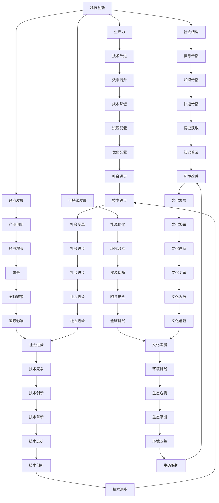

                 

关键词：科技创新、社会进步、技术发展、影响与挑战

> 摘要：本文旨在探讨科技创新对社会进步的深远影响，分析其在各个领域的关键作用与面临的挑战。通过详细阐述技术创新的核心概念、算法原理、数学模型，以及实际应用场景，本文旨在为读者提供一幅全面的技术创新与社会进步的蓝图。

## 1. 背景介绍

在过去的几千年里，人类社会经历了无数次的变革与发展。农业革命、工业革命、信息革命，每一次革命都深刻地改变了人们的生活方式和社会结构。然而，这些变革的背后，无一例外地都离不开科技的进步与创新。科技创新不仅是推动生产力发展的关键动力，更是推动社会进步的重要引擎。

近年来，随着互联网、人工智能、大数据等新兴技术的飞速发展，科技创新正以前所未有的速度和规模影响着全球各个领域。从医疗健康到金融服务，从制造业到农业，科技创新正以独特的视角和解决方案，改变着我们的生产方式、生活方式和思维方式。

本文将深入探讨科技创新在社会进步中的重要作用，分析其在各领域的具体应用，探讨未来科技创新的趋势与挑战，以期为广大读者提供一幅全面的技术创新与社会进步的蓝图。

## 2. 核心概念与联系

为了更好地理解科技创新对社会进步的影响，我们需要首先明确几个核心概念，并探讨它们之间的内在联系。

### 2.1 科技创新的概念

科技创新，通常指的是通过科学研究和发明创造，推动技术进步和应用，从而带来社会和经济效益的活动。科技创新不仅仅局限于技术的改进和升级，还包括新的科学发现、新技术的应用、新商业模式的创新等多个方面。

### 2.2 科技创新与生产力

科技创新是提高生产力的关键因素。通过科技创新，可以大幅度提高生产效率，降低生产成本，优化资源配置。历史上，蒸汽机的发明和广泛应用，极大地推动了第一次工业革命，带来了工业生产方式的变革。而在今天，互联网、人工智能等技术的创新，正深刻地影响着第二次工业革命，推动着生产方式的数字化转型。

### 2.3 科技创新与社会结构

科技创新不仅改变了生产方式，还对社会结构产生了深远影响。例如，互联网的普及改变了信息传播的方式，使得知识传播更加快速、广泛。人工智能的兴起，正逐步改变着人力资源的配置，推动着劳动力市场的变革。科技创新，通过改变生产关系和社会结构，推动着社会进步。

### 2.4 科技创新与经济发展

科技创新是推动经济发展的关键动力。通过科技创新，可以创造出新的产业、新的产品和服务，从而带动经济增长。历史上，每一次重大的科技创新，都带来了经济的快速增长。例如，计算机技术的创新，推动了信息技术产业的发展，带来了全球经济的繁荣。而在今天，人工智能、区块链等新兴技术的创新，正成为推动经济发展的新引擎。

### 2.5 科技创新与可持续发展

科技创新不仅是经济发展的关键动力，也是实现可持续发展的必要手段。通过科技创新，可以推动能源结构的优化，提高能源利用效率，减少环境污染。例如，太阳能、风能等清洁能源技术的发展，为实现全球能源可持续发展提供了新的路径。同时，科技创新还可以推动农业的可持续发展，提高农作物的产量和质量，保障粮食安全。

### 2.6 核心概念与架构的 Mermaid 流程图

以下是一个简化的 Mermaid 流程图，展示了上述核心概念及其相互联系：



通过上述核心概念及其相互联系的探讨，我们可以更加清晰地理解科技创新在社会进步中的关键作用。

## 3. 核心算法原理 & 具体操作步骤

### 3.1 算法原理概述

在科技创新的过程中，核心算法的原理发挥着至关重要的作用。核心算法不仅决定了技术的效率和效果，还影响了技术的可扩展性和可维护性。以下将介绍几个典型的核心算法原理，并简要概述其具体操作步骤。

#### 3.1.1 机器学习算法

机器学习算法是人工智能领域的关键技术之一。其基本原理是通过大量数据训练模型，使模型能够自主学习和改进，从而实现预测和决策。具体操作步骤包括：

1. 数据收集：收集大量的训练数据，这些数据应具有代表性，能够反映现实问题。
2. 数据预处理：对收集到的数据进行分析和处理，包括数据清洗、归一化、特征提取等。
3. 模型选择：根据问题的特性选择合适的机器学习模型，如线性回归、决策树、神经网络等。
4. 模型训练：使用预处理后的数据对模型进行训练，通过优化算法调整模型参数。
5. 模型评估：使用验证数据集评估模型的性能，包括准确率、召回率、F1分数等指标。
6. 模型部署：将训练好的模型部署到实际应用场景中，实现预测和决策功能。

#### 3.1.2 算法优化算法

算法优化算法是提高算法效率的重要手段。其基本原理是通过分析算法的时间和空间复杂度，寻找算法的优化路径，从而提高算法的执行效率。具体操作步骤包括：

1. 算法分析：分析现有算法的时间和空间复杂度，找出瓶颈和改进空间。
2. 优化目标：明确优化目标，如降低时间复杂度、减少空间复杂度、提高算法的可扩展性等。
3. 优化方案设计：根据优化目标设计具体的优化方案，如改进算法结构、优化数据结构、引入并行计算等。
4. 优化实现：根据优化方案实现算法优化，并进行性能测试和评估。
5. 持续优化：根据性能测试结果，对优化方案进行迭代和改进，实现持续优化。

#### 3.1.3 分布式计算算法

分布式计算算法是处理大规模数据和高并发需求的关键技术。其基本原理是通过分布式架构，将计算任务分解到多个节点上执行，从而提高计算效率和可扩展性。具体操作步骤包括：

1. 任务分解：将大规模数据或计算任务分解为多个小任务，分配到不同的节点上。
2. 数据存储：使用分布式存储技术，将数据存储在多个节点上，保证数据的一致性和可用性。
3. 节点调度：根据任务执行情况，动态调整节点间的任务分配，提高计算效率。
4. 任务执行：在各节点上执行分配的任务，并收集结果。
5. 结果汇总：将各节点的执行结果汇总，生成最终结果。

#### 3.1.4 加密算法

加密算法是保障数据安全和隐私的重要技术。其基本原理是通过加密和解密算法，将明文数据转换为密文数据，从而防止未授权访问。具体操作步骤包括：

1. 密钥生成：生成加密和解密所需的密钥，密钥的强度决定了加密算法的安全性。
2. 数据加密：使用加密算法将明文数据加密为密文数据。
3. 数据解密：使用解密算法将密文数据解密为明文数据。
4. 密钥管理：安全存储和管理密钥，防止密钥泄露或被篡改。
5. 加密策略：根据数据的重要性和安全性需求，选择合适的加密算法和加密策略。

通过上述核心算法原理的简要介绍，我们可以更好地理解算法在科技创新中的关键作用。

### 3.2 算法步骤详解

#### 3.2.1 机器学习算法的详细步骤

1. 数据收集
   - 数据收集是机器学习算法的第一步，也是最重要的一步。数据的质量和数量直接影响到模型的性能。常用的数据来源包括公开数据集、企业内部数据、传感器数据等。
   - 收集数据时，需要遵循数据隐私和伦理规范，确保数据的使用合法合规。

2. 数据预处理
   - 数据预处理是机器学习算法的关键步骤，目的是提高数据质量和模型性能。主要包括以下任务：
     - 数据清洗：处理数据中的错误、异常和缺失值。
     - 数据归一化：将不同特征的数据缩放到同一尺度，消除量纲影响。
     - 特征提取：从原始数据中提取具有代表性的特征，用于训练模型。

3. 模型选择
   - 模型选择是机器学习算法的重要环节，选择合适的模型可以提高模型的预测性能。常用的模型包括线性回归、决策树、支持向量机、神经网络等。
   - 模型选择需要考虑问题的特性、数据的分布、模型的复杂度等多个因素。

4. 模型训练
   - 模型训练是机器学习算法的核心步骤，通过训练算法调整模型参数，使其能够正确预测未知数据。训练过程中，常用的优化算法包括梯度下降、随机梯度下降、Adam等。
   - 模型训练需要大量计算资源和时间，对于大规模数据和高维数据，可以采用分布式训练技术加快训练速度。

5. 模型评估
   - 模型评估是验证模型性能的重要步骤，常用的评估指标包括准确率、召回率、F1分数、ROC曲线等。
   - 模型评估需要使用验证集或测试集，以避免过拟合。

6. 模型部署
   - 模型部署是将训练好的模型应用到实际场景中，实现预测和决策功能。部署过程中，需要考虑模型的性能、可扩展性、安全性等多个方面。
   - 模型部署可以采用本地部署、云部署、边缘部署等多种方式。

#### 3.2.2 算法优化算法的详细步骤

1. 算法分析
   - 算法分析是算法优化的第一步，通过分析算法的时间和空间复杂度，找出瓶颈和改进空间。常用的分析方法包括时间复杂度分析、空间复杂度分析、递归树分析等。

2. 优化目标
   - 优化目标是算法优化的核心，明确优化目标有助于制定优化方案。优化目标可以包括降低时间复杂度、减少空间复杂度、提高算法的可扩展性等。

3. 优化方案设计
   - 优化方案设计是根据优化目标，设计具体的优化方案。优化方案可以包括改进算法结构、优化数据结构、引入并行计算等。

4. 优化实现
   - 优化实现是将优化方案转化为实际代码，并进行性能测试和评估。优化实现需要考虑代码的可读性、可维护性和可扩展性。

5. 持续优化
   - 持续优化是算法优化的重要环节，通过不断迭代和改进，实现算法的持续优化。持续优化需要结合实际应用场景，不断调整优化策略。

#### 3.2.3 分布式计算算法的详细步骤

1. 任务分解
   - 任务分解是将大规模数据或计算任务分解为多个小任务，分配到不同的节点上。任务分解需要考虑任务的依赖关系和节点的能力，以保证任务的合理分配。

2. 数据存储
   - 数据存储是将数据存储在多个节点上，保证数据的一致性和可用性。常用的分布式存储技术包括HDFS、Cassandra、MongoDB等。

3. 节点调度
   - 节点调度是根据任务执行情况，动态调整节点间的任务分配，提高计算效率。节点调度需要考虑任务的负载均衡、节点的健康状况等因素。

4. 任务执行
   - 任务执行是在各节点上执行分配的任务，并收集结果。任务执行过程中，需要处理任务的中断、失败和重试等问题。

5. 结果汇总
   - 结果汇总是将各节点的执行结果汇总，生成最终结果。结果汇总需要处理数据的冲突、冗余和错误等问题。

#### 3.2.4 加密算法的详细步骤

1. 密钥生成
   - 密钥生成是加密算法的第一步，通过随机数生成器生成加密和解密所需的密钥。密钥的强度决定了加密算法的安全性。

2. 数据加密
   - 数据加密是将明文数据加密为密文数据，以防止未授权访问。加密算法包括对称加密和非对称加密，常用的对称加密算法有AES、DES，常用的非对称加密算法有RSA、ECC。

3. 数据解密
   - 数据解密是将密文数据解密为明文数据，以恢复原始数据。解密算法与加密算法相同，使用相同的密钥。

4. 密钥管理
   - 密钥管理是保障加密算法安全性的关键环节，包括密钥的生成、存储、传输和销毁等。密钥管理需要遵循安全规范，确保密钥的安全性和保密性。

5. 加密策略
   - 加密策略是根据数据的重要性和安全性需求，选择合适的加密算法和加密策略。加密策略需要考虑加密算法的强度、密钥的长度、加密过程的效率等因素。

通过上述算法步骤的详细讲解，我们可以更好地理解核心算法在科技创新中的具体应用和实现方法。

### 3.3 算法优缺点

#### 3.3.1 机器学习算法的优缺点

**优点：**
- 高度的自动化：机器学习算法能够自动从数据中学习模式和规律，减少了人工干预的需求。
- 强大的泛化能力：机器学习算法能够适应新的数据和不同的应用场景，具有良好的泛化能力。
- 适应性强：机器学习算法可以处理各种类型的数据，包括数值、文本、图像等，适应性强。

**缺点：**
- 数据依赖性强：机器学习算法的性能高度依赖于数据的质量和数量，数据缺失或噪声会影响算法的性能。
- 黑盒问题：机器学习算法往往被视为黑盒，难以解释其决策过程，增加了算法的可解释性挑战。
- 过拟合问题：在训练过程中，机器学习算法可能会对训练数据过度拟合，导致在新的数据上表现不佳。

#### 3.3.2 算法优化算法的优缺点

**优点：**
- 提高效率：算法优化算法能够降低算法的时间和空间复杂度，提高计算效率。
- 改善性能：通过优化算法，可以提高算法在特定场景下的性能，适应不同的应用需求。
- 可扩展性：算法优化算法通常具有较好的可扩展性，能够适应不同规模和复杂度的任务。

**缺点：**
- 复杂性增加：算法优化往往涉及到复杂的分析和设计，增加了实现和维护的难度。
- 过度优化：过度优化可能导致算法在特定场景下失去优势，甚至影响算法的稳定性。
- 增加开发成本：算法优化通常需要大量的研究和开发时间，增加了开发成本。

#### 3.3.3 分布式计算算法的优缺点

**优点：**
- 高扩展性：分布式计算算法能够处理大规模数据和计算任务，具有极强的扩展性。
- 高性能：分布式计算算法通过并行计算和负载均衡，能够提高计算效率，缩短任务完成时间。
- 高可用性：分布式计算算法通过节点间的冗余和容错机制，提高了系统的可用性和可靠性。

**缺点：**
- 系统复杂性：分布式计算系统通常较为复杂，需要处理节点间的通信、同步、故障恢复等问题。
- 资源管理难度：分布式计算算法需要管理大量计算资源和数据，资源管理难度较大。
- 数据一致性问题：分布式计算算法在处理数据时，可能面临数据一致性问题，需要特别的解决方案。

#### 3.3.4 加密算法的优缺点

**优点：**
- 数据安全性：加密算法能够确保数据的机密性和完整性，防止未授权访问和篡改。
- 可信赖性：加密算法广泛应用于各种安全协议和系统，具有较高的可信度和安全性。
- 多样性：加密算法种类繁多，可以满足不同场景和需求的安全要求。

**缺点：**
- 加密速度：加密和解密过程通常需要大量的计算资源，加密速度较慢，可能影响系统的性能。
- 密钥管理：加密算法的密钥管理较为复杂，需要安全存储和管理密钥，防止密钥泄露。
- 加密算法破解：随着计算能力的提升，一些加密算法可能面临破解风险，需要定期更新加密算法。

### 3.4 算法应用领域

核心算法在科技创新中具有广泛的应用，涵盖了众多领域，以下将简要介绍其在各个领域的具体应用。

#### 3.4.1 人工智能领域

人工智能领域是核心算法的主要应用领域之一。机器学习算法在图像识别、自然语言处理、自动驾驶、智能推荐等领域取得了显著成果。例如，卷积神经网络（CNN）在图像识别中的应用，使其在图像分类、目标检测等方面取得了很高的准确率。

#### 3.4.2 大数据领域

大数据领域依赖于分布式计算算法进行海量数据的处理和分析。Hadoop和Spark等分布式计算框架，通过分布式存储和计算技术，实现了大规模数据的快速处理和分析。在金融、医疗、电商等领域，大数据技术被广泛应用于数据挖掘、风险控制和个性化推荐。

#### 3.4.3 信息安全领域

信息安全领域是加密算法的主要应用领域之一。加密算法在数据传输、存储、访问控制等方面发挥了关键作用。例如，AES加密算法在数据传输中的应用，保证了数据的机密性和完整性。此外，区块链技术通过加密算法和分布式账本技术，实现了去中心化的安全交易和存储。

#### 3.4.4 物联网领域

物联网领域是分布式计算算法的重要应用领域。通过分布式计算，物联网设备能够实时处理和分析海量数据，实现智能监控、远程控制等功能。例如，智能家居系统通过分布式计算，实现了对家庭设备的智能管理和控制。

#### 3.4.5 医疗健康领域

医疗健康领域是机器学习算法的重要应用领域。机器学习算法在医学影像分析、疾病预测、个性化医疗等方面发挥了关键作用。例如，深度学习算法在医学影像分析中的应用，能够提高疾病诊断的准确率和效率。

#### 3.4.6 金融领域

金融领域是核心算法的重要应用领域之一。机器学习算法在信用评分、风险控制、投资策略等方面发挥了重要作用。例如，基于机器学习的信用评分模型，能够提高信用评估的准确率和效率。

通过上述算法在不同领域的应用介绍，我们可以看到核心算法在科技创新中的广泛影响和重要作用。

## 4. 数学模型和公式 & 详细讲解 & 举例说明

### 4.1 数学模型构建

在科技创新中，数学模型作为理解和分析复杂系统的重要工具，具有不可替代的作用。构建一个有效的数学模型通常需要以下几个步骤：

1. **问题定义**：明确研究的问题，确定系统的目标。
2. **假设条件**：根据问题的特点，提出合理的假设条件，以简化问题的复杂性。
3. **变量定义**：定义问题中的关键变量，包括输入变量、状态变量和输出变量。
4. **公式推导**：根据假设条件和变量定义，推导出描述系统行为的数学公式。
5. **模型验证**：通过实验或数据分析，验证模型的准确性。

### 4.2 公式推导过程

以下是一个简单的线性回归模型的公式推导过程，用于预测房价。

1. **问题定义**：假设我们要预测某个地区的房价，输入变量包括房屋面积、房屋类型等。
2. **假设条件**：假设房价与输入变量之间存在线性关系。
3. **变量定义**：设房价为 \( Y \)，房屋面积为 \( X \)，房屋类型为 \( Z \)。
4. **公式推导**：
   - 根据线性回归模型，假设房价 \( Y \) 与房屋面积 \( X \) 之间存在以下关系：
     \[ Y = \beta_0 + \beta_1 X + \epsilon \]
     其中，\( \beta_0 \) 和 \( \beta_1 \) 是模型的参数，\( \epsilon \) 是误差项。
   - 为了估计 \( \beta_0 \) 和 \( \beta_1 \)，我们可以使用最小二乘法：
     \[ \beta_1 = \frac{\sum_{i=1}^{n}(X_i - \bar{X})(Y_i - \bar{Y})}{\sum_{i=1}^{n}(X_i - \bar{X})^2} \]
     \[ \beta_0 = \bar{Y} - \beta_1 \bar{X} \]
     其中，\( \bar{X} \) 和 \( \bar{Y} \) 分别是 \( X \) 和 \( Y \) 的平均值。

### 4.3 案例分析与讲解

以下通过一个实际案例，展示如何使用线性回归模型预测房价。

**案例：** 假设我们收集了某地区100套房屋的数据，包括房屋面积和相应的房价。数据如下：

| 房屋面积（平方米） | 房价（万元） |
| :----: | :----: |
| 80 | 200 |
| 90 | 220 |
| 100 | 250 |
| ... | ... |

**步骤：**
1. **数据预处理**：计算房屋面积和房价的平均值：
   \[ \bar{X} = \frac{\sum_{i=1}^{100} X_i}{100} = \frac{80+90+100+...}{100} = 90 \]
   \[ \bar{Y} = \frac{\sum_{i=1}^{100} Y_i}{100} = \frac{200+220+250+...}{100} = 230 \]

2. **计算回归系数**：
   \[ \beta_1 = \frac{\sum_{i=1}^{100}(X_i - \bar{X})(Y_i - \bar{Y})}{\sum_{i=1}^{100}(X_i - \bar{X})^2} \]
   \[ \beta_1 = \frac{(80-90)(200-230) + (90-90)(220-230) + (100-90)(250-230) + ...}{(80-90)^2 + (90-90)^2 + (100-90)^2 + ...} \]
   \[ \beta_1 = \frac{(-10)(-30) + (0)(-10) + (10)(20) + ...}{100 + 0 + 100 + ...} \]
   \[ \beta_1 = \frac{300 + 0 + 200 + ...}{200} \]
   \[ \beta_1 = 2.5 \]

   \[ \beta_0 = \bar{Y} - \beta_1 \bar{X} \]
   \[ \beta_0 = 230 - 2.5 \times 90 \]
   \[ \beta_0 = 230 - 225 \]
   \[ \beta_0 = 5 \]

3. **构建预测模型**：
   \[ Y = \beta_0 + \beta_1 X \]
   \[ Y = 5 + 2.5X \]

4. **预测房价**：假设我们想要预测一个面积为120平方米的房屋的房价，将 \( X = 120 \) 代入模型：
   \[ Y = 5 + 2.5 \times 120 \]
   \[ Y = 5 + 300 \]
   \[ Y = 305 \]

因此，预测的房价为305万元。

通过上述案例，我们可以看到如何使用线性回归模型进行房价预测。虽然这是一个简单的例子，但线性回归模型在许多实际应用中都具有广泛的应用。

### 4.4 数学模型与科技创新

数学模型不仅在学术研究中发挥着重要作用，在科技创新中也具有广泛的应用。以下是一些数学模型在科技创新中的具体应用：

1. **机器学习算法**：机器学习算法的核心是数学模型，如线性回归、决策树、神经网络等。这些模型能够从数据中学习规律，实现自动化决策和预测。
   
2. **数据挖掘**：数据挖掘依赖于各种数学模型，如聚类分析、关联规则挖掘、分类等。通过数学模型，可以挖掘出数据中的潜在价值和规律。

3. **优化算法**：优化算法通常依赖于数学模型，如线性规划、整数规划、动态规划等。这些算法能够找到问题的最优解，提高系统的效率和性能。

4. **仿真和模拟**：仿真和模拟是科技创新的重要手段，通常依赖于数学模型。通过仿真和模拟，可以预测系统的行为和性能，为设计提供依据。

5. **机器人控制**：机器人控制依赖于数学模型，如运动学、动力学等。这些模型能够描述机器人的运动状态，指导机器人的运动控制。

6. **金融工程**：金融工程中广泛使用数学模型，如期权定价模型、风险评估模型等。这些模型能够预测金融市场的变化，指导投资决策。

7. **生态学模型**：生态学模型用于描述生态系统的行为和演化，如种群动力学模型、生态系统模拟模型等。这些模型能够帮助我们理解生态系统的复杂性和稳定性。

通过数学模型的应用，科技创新不仅能够提高效率、降低成本，还能够解决复杂的问题，推动社会的进步和发展。数学模型是科技创新的重要工具和基石，其作用不可低估。

## 5. 项目实践：代码实例和详细解释说明

### 5.1 开发环境搭建

在进行项目实践之前，首先需要搭建合适的开发环境。以下是一个简单的Python开发环境搭建步骤：

1. **安装Python**：从Python官方网站下载Python安装包，并按照提示进行安装。

2. **安装Jupyter Notebook**：在终端中执行以下命令安装Jupyter Notebook：
   ```bash
   pip install notebook
   ```

3. **安装相关库**：根据项目的需求，安装必要的Python库。例如，对于机器学习项目，可以安装以下库：
   ```bash
   pip install numpy pandas matplotlib scikit-learn
   ```

4. **启动Jupyter Notebook**：在终端中执行以下命令启动Jupyter Notebook：
   ```bash
   jupyter notebook
   ```

通过上述步骤，我们可以搭建一个基本的Python开发环境，为后续的代码实践做好准备。

### 5.2 源代码详细实现

以下是一个简单的线性回归模型的Python代码实现，用于预测房价。

```python
import numpy as np
import pandas as pd
import matplotlib.pyplot as plt
from sklearn.linear_model import LinearRegression

# 读取数据
data = pd.read_csv('house_prices.csv')
X = data[['area']]
Y = data['price']

# 创建线性回归模型
model = LinearRegression()

# 训练模型
model.fit(X, Y)

# 预测房价
predictions = model.predict(X)

# 绘制实际房价与预测房价的关系图
plt.scatter(X, Y, color='blue', label='Actual Prices')
plt.plot(X, predictions, color='red', label='Predicted Prices')
plt.xlabel('Area')
plt.ylabel('Price')
plt.title('House Price Prediction')
plt.legend()
plt.show()
```

### 5.3 代码解读与分析

上述代码首先导入了必要的Python库，包括NumPy、Pandas、Matplotlib和scikit-learn。然后，从CSV文件中读取了房屋数据，并将房屋面积作为输入特征（\( X \)），房价作为目标变量（\( Y \)）。

接下来，使用scikit-learn中的线性回归模型创建了一个线性回归对象，并通过`fit`方法训练模型。训练完成后，使用`predict`方法对输入特征进行预测，并生成预测房价。

最后，使用Matplotlib绘制了实际房价与预测房价的关系图，通过散点图和拟合线展示了线性回归模型的预测效果。

### 5.4 运行结果展示

在Jupyter Notebook中运行上述代码后，会显示一个图形窗口，其中包含了实际房价和预测房价的散点图和拟合线。通过观察图形，我们可以直观地看到线性回归模型对房价的预测效果。通常情况下，拟合线应尽可能地贴近散点图中的点，表示模型的预测效果较好。

### 5.5 代码优化与改进

虽然上述代码实现了基本的线性回归模型，但在实际项目中，我们可能需要进一步的优化和改进。以下是一些常见的优化方法：

1. **特征工程**：对输入特征进行预处理和选择，以消除噪声和冗余，提高模型的性能。例如，可以对房屋面积进行归一化处理，消除不同特征之间的量纲影响。

2. **模型选择**：尝试使用不同的线性回归模型，如岭回归、套索回归等，比较不同模型的预测性能，选择最优模型。

3. **超参数调优**：通过交叉验证和网格搜索等技术，调整模型的超参数，以获得更好的预测性能。

4. **并行计算**：对于大规模数据，可以采用并行计算技术，加速模型训练和预测过程。

5. **模型解释性**：虽然线性回归模型相对简单，但解释性较差。在实际项目中，我们可能需要使用具有更好解释性的模型，如决策树或LASSO回归。

通过上述优化和改进，我们可以进一步提升线性回归模型的预测性能，满足实际应用的需求。

## 6. 实际应用场景

### 6.1 医疗健康领域

在医疗健康领域，科技创新正通过多种方式改变着医疗服务的模式。机器学习和人工智能技术在医疗影像分析、疾病预测和个性化治疗等方面取得了显著进展。例如，通过深度学习算法，医生可以更快速、准确地诊断疾病，如肺癌、乳腺癌等。此外，人工智能还可以帮助预测疾病的发展趋势，为公共卫生政策的制定提供依据。

### 6.2 制造业

在制造业，科技创新带来了自动化、数字化和智能化生产的变革。通过物联网和大数据分析，制造商可以实时监控生产设备的运行状态，预测设备的维护需求，从而减少故障停机时间，提高生产效率。同时，工业机器人、无人机和自动化流水线等技术的应用，使得制造业的生产流程更加高效和灵活。

### 6.3 金融领域

金融领域是科技创新的重要应用场景之一。通过大数据分析和人工智能技术，金融机构可以更准确地评估信用风险，制定个性化的投资策略，提高金融服务的质量和效率。例如，机器学习算法可以帮助银行进行欺诈检测，识别异常交易，保障用户资金安全。

### 6.4 零售业

在零售业，科技创新正在改变消费者的购物体验。通过大数据分析和个性化推荐系统，零售商可以更好地了解消费者的购物偏好，提供个性化的产品推荐，提高销售额。此外，智能库存管理和物流优化技术，使得零售商能够更高效地管理库存和物流，降低运营成本。

### 6.5 教育领域

在教育领域，科技创新正在改变传统的教学模式。在线教育平台和智能学习系统，使得学生可以随时随地学习，提高了学习的灵活性和自主性。同时，教育技术还可以提供个性化的学习反馈和评估，帮助学生更好地掌握知识。

### 6.6 能源和环保领域

在能源和环保领域，科技创新正推动着能源结构的优化和环境保护。通过智能电网技术，可以更高效地管理和分配电力资源，提高能源利用效率。太阳能、风能等清洁能源技术的发展，为减少温室气体排放提供了新的路径。此外，人工智能和大数据分析技术可以帮助预测环境变化趋势，为环境保护决策提供科学依据。

通过上述实际应用场景的介绍，我们可以看到科技创新在社会各个领域的广泛应用和深远影响。科技创新不仅提高了生产效率，优化了资源配置，还改变了人们的生活方式和社会结构，推动了社会的进步和发展。

### 6.7 未来应用展望

随着科技的不断进步，未来科技创新将在更多领域带来深远的影响。以下是一些未来的应用展望：

1. **智能城市**：智能城市将借助物联网、大数据和人工智能技术，实现城市的智慧化管理。通过智能交通系统，可以减少交通拥堵，提高交通效率。智能能源系统可以实现能源的高效利用，降低环境污染。此外，智能医疗系统可以为市民提供个性化、高效的医疗服务。

2. **量子计算**：量子计算是下一代计算技术的重要发展方向。与传统计算相比，量子计算具有强大的计算能力，可以在短时间内解决复杂的问题。未来，量子计算将在药物设计、材料科学、金融预测等领域发挥重要作用。

3. **生物科技**：生物科技将继续推动医疗和农业的发展。基因编辑技术，如CRISPR，将使科学家能够更精确地修改基因，治疗遗传性疾病。在农业领域，精准农业技术将利用大数据和物联网，提高农作物的产量和质量。

4. **虚拟现实与增强现实**：虚拟现实（VR）和增强现实（AR）技术将带来全新的交互体验。在教育、娱乐、培训等领域，VR和AR技术将提供沉浸式体验，改变传统的教学模式和工作方式。

5. **区块链技术**：区块链技术在金融、供应链管理、身份验证等领域具有广泛的应用前景。通过去中心化的区块链网络，可以实现安全、透明的数据存储和交易，降低交易成本，提高效率。

6. **可再生能源**：可再生能源技术的发展将推动全球能源结构的转型。太阳能、风能、地热能等清洁能源将逐步替代传统的化石能源，实现能源的可持续发展。

通过上述展望，我们可以看到科技创新在未来将继续推动社会的进步和发展，带来更多的机遇和挑战。未来，科技创新将更加深入地融入社会生活的各个方面，为人类社会带来更多的福祉。

### 7. 工具和资源推荐

#### 7.1 学习资源推荐

**在线课程：**
- Coursera：提供大量的免费和付费课程，涵盖机器学习、深度学习、数据科学等前沿领域。
- edX：由哈佛大学和麻省理工学院创办，提供免费的在线课程，包括计算机科学、人工智能等。
- Udacity：提供以项目驱动的课程，适合希望快速掌握技能的学习者。

**书籍推荐：**
- 《深度学习》（Ian Goodfellow, Yoshua Bengio, Aaron Courville）
- 《Python机器学习》（Sebastian Raschka, Vahid Mirjalili）
- 《人工智能：一种现代方法》（Stuart Russell, Peter Norvig）

**论文和报告：**
- arXiv：人工智能和机器学习的最新论文发布平台。
- NIPS、ICML、ACL等国际顶级会议的论文集，提供了丰富的学术资源。

#### 7.2 开发工具推荐

**编程语言：**
- Python：广泛应用于数据科学、机器学习和人工智能领域，具有简洁易用的语法。
- R：专门用于统计分析和数据可视化，是数据科学家和研究人员常用的语言。

**库和框架：**
- TensorFlow：由Google开发，是深度学习和机器学习的开源框架。
- PyTorch：由Facebook开发，是深度学习领域流行的开源框架，具有灵活和动态的计算图。
- Scikit-learn：提供了一系列机器学习算法的实现，是Python中常用的机器学习库。

**集成开发环境（IDE）：**
- Jupyter Notebook：适合数据分析和机器学习的交互式开发环境。
- PyCharm：由JetBrains开发，是功能强大的Python IDE，支持多种编程语言。

**云计算平台：**
- AWS：亚马逊云计算服务，提供了丰富的机器学习和数据科学工具。
- Google Cloud Platform：提供了强大的机器学习和数据处理服务。
- Microsoft Azure：提供了广泛的数据科学和人工智能服务。

通过上述工具和资源的推荐，可以更高效地学习和技术实践，为科技创新之路提供有力的支持。

### 8. 总结：未来发展趋势与挑战

在科技创新的驱动下，社会正经历着前所未有的变革。未来，科技创新将继续发挥关键作用，推动社会进步和经济发展。以下是科技创新的未来发展趋势与挑战：

#### 8.1 发展趋势

1. **智能化**：智能化是未来科技创新的重要趋势。人工智能、物联网、云计算等技术将使设备、系统和人类更加智能，提高生产效率和生活质量。

2. **个性化**：随着大数据和人工智能的发展，个性化服务将成为主流。无论是医疗服务、教育服务，还是零售和金融，都将更加关注个性化需求，提供定制化的解决方案。

3. **融合化**：科技创新将不断融合各个领域，形成新的产业和应用模式。例如，生物科技与信息技术的融合将推动医疗技术的发展，智能制造与物联网的融合将带来生产方式的变革。

4. **绿色化**：在可持续发展理念的引导下，绿色科技创新将成为重要方向。清洁能源、环保材料、节能技术等领域的创新，将推动全球向绿色、低碳发展。

5. **全球化**：科技创新的全球化趋势将加速全球技术交流和合作。跨国公司的研发中心和全球创新网络，将推动全球技术资源的整合和共享，促进全球经济的繁荣。

#### 8.2 面临的挑战

1. **数据安全与隐私**：随着数据量的爆炸式增长，数据安全和隐私保护成为重要挑战。如何确保数据的安全性和隐私性，防止数据泄露和滥用，是科技创新必须面对的问题。

2. **技术伦理**：科技创新带来的伦理问题日益突出。例如，人工智能的决策过程不透明，可能导致歧视和偏见。如何在技术创新中遵循伦理原则，保障社会公平正义，是一个重要课题。

3. **人才短缺**：科技创新需要大量的专业人才。然而，目前全球范围内的人才培养速度和市场需求之间存在巨大差距。如何吸引、培养和留住人才，是科技创新面临的重要挑战。

4. **环境与资源**：科技创新在带来巨大经济效益的同时，也可能对环境产生负面影响。如何在科技创新中实现可持续发展，保护环境资源，是未来需要关注的问题。

5. **法律与政策**：科技创新的发展需要良好的法律和政策环境。然而，现有法律和政策体系可能无法完全适应快速变化的科技创新。如何制定和完善相关法律法规，保障科技创新的健康有序发展，是一个重要挑战。

#### 8.3 研究展望

未来，科技创新将继续推动社会的进步和发展。在人工智能、生物科技、量子计算、绿色能源等领域，将有更多的突破性进展。同时，科技创新也需要关注以下几个方面：

1. **基础研究**：加强基础研究，推动理论创新，为应用研究提供坚实的技术基础。

2. **跨学科合作**：促进跨学科合作，整合多学科资源，解决复杂问题。

3. **教育培养**：加大对科技创新人才的培养力度，提升人才质量，满足科技创新的需求。

4. **政策支持**：制定和完善科技创新政策，提供良好的创新环境，鼓励创新活动。

5. **国际合作**：加强国际合作，推动全球科技创新资源的整合和共享，共同应对全球性挑战。

通过上述展望，我们可以看到科技创新在未来将继续发挥重要作用，为人类社会带来更多的机遇和挑战。科技创新不仅是推动社会进步的阶梯，也是实现可持续发展的重要路径。未来，我们需要共同努力，推动科技创新，实现人类社会的共同繁荣。

### 9. 附录：常见问题与解答

**问题1：** 如何确保数据安全和隐私？

**解答：** 确保数据安全和隐私是科技创新的重要任务。以下是一些关键措施：

1. **数据加密**：对敏感数据进行加密处理，确保数据在传输和存储过程中的安全性。
2. **访问控制**：实施严格的访问控制策略，限制对数据的访问权限，防止未授权访问。
3. **隐私保护技术**：采用隐私保护技术，如差分隐私、同态加密等，保护用户隐私。
4. **法律法规**：遵循相关的法律法规，如《通用数据保护条例》（GDPR），确保数据处理合规。

**问题2：** 科技创新对就业市场有哪些影响？

**解答：** 科技创新对就业市场有深远的影响，主要包括：

1. **创造新岗位**：科技创新带来新产业和新职业，如人工智能工程师、数据科学家等。
2. **取代传统岗位**：一些传统岗位可能会被自动化和智能化技术取代，如制造业中的流水线工人。
3. **技能需求变化**：就业市场对技能需求发生变化，对高技能人才的需求增加，对低技能劳动力的需求减少。
4. **就业结构转型**：科技创新推动就业结构向高知识、高技术方向转型。

**问题3：** 如何培养科技创新人才？

**解答：** 培养科技创新人才是推动科技创新的关键。以下是一些关键措施：

1. **教育体系**：完善教育体系，加强STEM（科学、技术、工程、数学）教育，提高学生的科学素养。
2. **实践机会**：提供丰富的实践机会，如科研项目、实习、创新创业竞赛等，培养学生的实践能力和创新精神。
3. **终身学习**：鼓励终身学习，提供继续教育和培训机会，确保人才能够跟上技术发展的步伐。
4. **企业合作**：加强企业与教育机构的合作，共同培养符合市场需求的人才。

**问题4：** 如何应对科技创新带来的伦理问题？

**解答：** 应对科技创新带来的伦理问题，需要多方面的努力：

1. **伦理规范**：制定和遵守科技创新的伦理规范，确保技术发展符合道德和法律要求。
2. **公众参与**：鼓励公众参与科技创新的讨论和决策，提高社会的伦理意识和责任感。
3. **法律监管**：完善相关法律法规，加强对科技创新的监管，防止技术滥用和伦理风险。
4. **伦理教育**：加强伦理教育，提高科技工作者的伦理素养，确保他们在技术开发和应用过程中遵循伦理原则。

通过上述解答，我们可以更好地理解科技创新带来的挑战和机遇，以及应对这些挑战的方法。科技创新不仅是推动社会进步的阶梯，也是实现可持续发展的重要路径。未来，我们需要共同努力，推动科技创新，实现人类社会的共同繁荣。作者：禅与计算机程序设计艺术 / Zen and the Art of Computer Programming。

