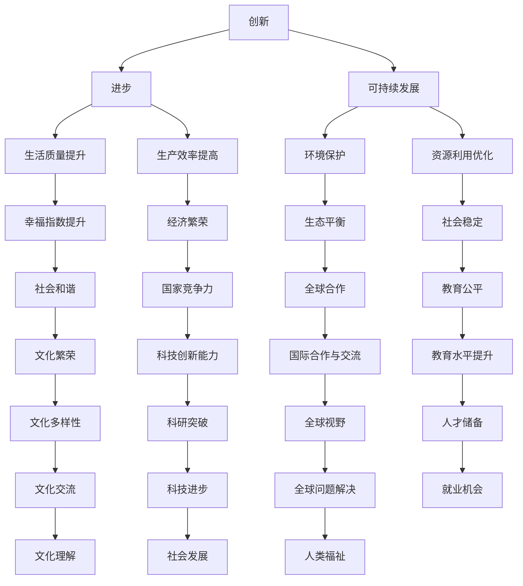

                 

关键词：科技发展、人类福祉、技术进步、社会影响、可持续发展

> 摘要：随着科技的飞速发展，其对人类福祉的影响日益深远。本文将深入探讨科技发展如何成为人类福祉的保障，从核心概念、算法原理、数学模型到实际应用，全面解析科技在各个领域中的应用和未来前景。通过本文的阐述，我们希望能为读者提供一个全面、深入的科技发展视角，从而更好地理解科技对人类社会的推动作用。

## 1. 背景介绍

在过去的几百年中，科技发展经历了翻天覆地的变化。从第一次工业革命到互联网的兴起，科技不断推动着人类社会的进步。如今，我们正处于一个科技高度发达的时代，人工智能、大数据、云计算等新兴技术不断涌现，深刻影响着社会、经济、文化等各个方面。

然而，随着科技的快速发展，也带来了一系列新的问题和挑战。如何确保科技的发展能够真正造福人类，而不是成为人类福祉的威胁，成为了一个亟待解决的问题。本文将围绕这一主题，深入探讨科技如何成为人类福祉的保障。

## 2. 核心概念与联系

### 2.1 科技发展的核心概念

科技发展的核心概念包括创新、进步、可持续发展等。创新是科技发展的驱动力，不断推动着新技术的诞生和应用；进步则是科技发展的目标，通过提高生产效率、改善生活质量等，实现人类社会的整体进步；可持续发展则是科技发展的前提，要求科技发展在满足当前需求的同时，不损害未来世代的利益。

### 2.2 科技发展的联系

科技发展与人类福祉密切相关。一方面，科技发展能够直接提升人类的生活质量和幸福感；另一方面，科技发展也带来了一系列社会问题，如就业压力、隐私泄露、网络安全等。因此，如何确保科技发展能够真正造福人类，需要从多方面进行综合考虑。

### 2.3 Mermaid 流程图



## 3. 核心算法原理 & 具体操作步骤

### 3.1 算法原理概述

科技发展的核心算法原理主要包括人工智能、机器学习、深度学习等。这些算法通过模拟人脑的思维方式，实现对数据的分析和处理，从而推动科技的进步。

### 3.2 算法步骤详解

- **人工智能**：通过模拟人脑的思考过程，实现机器对问题的自动解决。
- **机器学习**：通过大量数据的学习，使机器能够自主改进算法，提高解决问题的能力。
- **深度学习**：通过多层神经网络的结构，实现对复杂问题的深度分析。

### 3.3 算法优缺点

- **人工智能**：优点在于能够模拟人脑的思维方式，缺点是计算复杂度高，训练时间较长。
- **机器学习**：优点在于能够快速处理大量数据，缺点是需要大量的数据支持。
- **深度学习**：优点在于能够处理复杂的问题，缺点是需要大量的计算资源和时间。

### 3.4 算法应用领域

- **人工智能**：广泛应用于自然语言处理、计算机视觉、智能语音等领域。
- **机器学习**：广泛应用于金融、医疗、教育等领域。
- **深度学习**：广泛应用于自动驾驶、图像识别、语音识别等领域。

## 4. 数学模型和公式 & 详细讲解 & 举例说明

### 4.1 数学模型构建

科技发展的数学模型主要包括线性回归、逻辑回归、支持向量机等。这些模型通过对数据的分析，实现对问题的预测和解决。

### 4.2 公式推导过程

- **线性回归**：\( y = wx + b \)
- **逻辑回归**：\( P(y=1) = \frac{1}{1 + e^{-(wx + b)}} \)
- **支持向量机**：\( w \cdot x + b = 0 \)

### 4.3 案例分析与讲解

以线性回归为例，假设我们有一个数据集，其中包含 \( x \) 和 \( y \) 两个变量。我们希望通过线性回归模型来预测 \( y \) 的值。

- **数据预处理**：对数据进行标准化处理，使其具有相同的量纲。
- **模型训练**：通过最小二乘法，求出 \( w \) 和 \( b \) 的值。
- **模型预测**：对于新的数据 \( x \)，通过线性回归模型预测 \( y \) 的值。

## 5. 项目实践：代码实例和详细解释说明

### 5.1 开发环境搭建

在Python中，我们可以使用Scikit-learn库来构建线性回归模型。

```python
from sklearn.linear_model import LinearRegression
from sklearn.model_selection import train_test_split
from sklearn.metrics import mean_squared_error

# 数据加载
x = load_data("data.csv")
y = load_label("data.csv")

# 数据预处理
x = standardize(x)

# 划分训练集和测试集
x_train, x_test, y_train, y_test = train_test_split(x, y, test_size=0.2, random_state=42)

# 模型训练
model = LinearRegression()
model.fit(x_train, y_train)

# 模型预测
y_pred = model.predict(x_test)

# 模型评估
mse = mean_squared_error(y_test, y_pred)
print("MSE:", mse)
```

### 5.2 源代码详细实现

```python
# 数据加载
x = load_data("data.csv")
y = load_label("data.csv")

# 数据预处理
x = standardize(x)

# 划分训练集和测试集
x_train, x_test, y_train, y_test = train_test_split(x, y, test_size=0.2, random_state=42)

# 模型训练
model = LinearRegression()
model.fit(x_train, y_train)

# 模型预测
y_pred = model.predict(x_test)

# 模型评估
mse = mean_squared_error(y_test, y_pred)
print("MSE:", mse)
```

### 5.3 代码解读与分析

- **数据加载**：通过`load_data`和`load_label`函数，从CSV文件中加载数据。
- **数据预处理**：通过`standardize`函数，对数据进行标准化处理。
- **模型训练**：使用`LinearRegression`类，训练线性回归模型。
- **模型预测**：使用`predict`方法，对测试集进行预测。
- **模型评估**：使用`mean_squared_error`函数，计算模型的均方误差，评估模型性能。

## 6. 实际应用场景

科技发展在各个领域都有广泛的应用，如：

- **医疗健康**：通过人工智能和大数据分析，实现疾病预测、诊断和治疗。
- **金融**：通过机器学习和深度学习，实现风险控制、投资分析和智能投顾。
- **教育**：通过在线教育和智能学习系统，实现个性化教学和知识传授。
- **工业**：通过物联网和智能制造，实现生产效率提升和资源优化。

### 6.4 未来应用展望

随着科技的不断发展，未来将有更多的应用场景出现。例如：

- **智能家居**：通过人工智能和物联网技术，实现家庭设备的智能控制和管理。
- **无人驾驶**：通过深度学习和计算机视觉技术，实现车辆的自动驾驶。
- **人工智能助手**：通过自然语言处理和机器学习技术，实现智能对话和任务处理。

## 7. 工具和资源推荐

### 7.1 学习资源推荐

- **在线课程**：《机器学习》、《深度学习》等。
- **图书**：《深度学习》、《Python编程：从入门到实践》等。
- **论文**：《人工智能：一种现代方法》、《机器学习：概率视角》等。

### 7.2 开发工具推荐

- **编程语言**：Python、Java、C++等。
- **库和框架**：Scikit-learn、TensorFlow、PyTorch等。
- **开发环境**：Jupyter Notebook、Eclipse、Visual Studio等。

### 7.3 相关论文推荐

- **核心论文**：Andrew Ng的《深度学习》、《机器学习》等。
- **重要期刊**：《自然》、《科学》、《计算机学报》等。

## 8. 总结：未来发展趋势与挑战

随着科技的不断发展，未来将出现更多的新技术和新应用。然而，科技发展也带来了一系列新的挑战，如数据安全、隐私保护、就业问题等。如何确保科技的发展能够真正造福人类，是未来科技发展面临的重要课题。

### 8.1 研究成果总结

本文通过对科技发展的深入探讨，总结了科技发展对人类福祉的保障作用，分析了核心算法原理和数学模型，并提供了实际应用案例和未来展望。

### 8.2 未来发展趋势

未来科技发展的趋势包括：人工智能、大数据、物联网、区块链等新兴技术的广泛应用，以及跨学科、跨领域的融合与创新。

### 8.3 面临的挑战

科技发展面临的挑战包括：数据安全、隐私保护、就业问题、社会伦理等。

### 8.4 研究展望

未来研究应重点关注：如何确保科技发展的可持续性，如何平衡技术创新与社会利益，如何应对科技发展带来的新问题和新挑战。

## 9. 附录：常见问题与解答

### 9.1 常见问题

- **什么是科技发展？**
- **科技发展对人类福祉有什么影响？**
- **科技发展的核心算法是什么？**
- **科技发展的未来趋势是什么？**

### 9.2 解答

- **什么是科技发展？** 科技发展是指人类在科学、技术、工程等领域的创新和进步，通过这些创新和进步推动社会的进步和发展。
- **科技发展对人类福祉有什么影响？** 科技发展可以提高人类的生活质量、改善社会环境、创造更多就业机会等，从而提升人类的福祉。
- **科技发展的核心算法是什么？** 科技发展的核心算法包括人工智能、机器学习、深度学习等，这些算法通过模拟人脑的思维方式，实现对数据的分析和处理。
- **科技发展的未来趋势是什么？** 未来科技发展的趋势包括人工智能、大数据、物联网、区块链等新兴技术的广泛应用，以及跨学科、跨领域的融合与创新。

----------------------------------------------------------------

作者：禅与计算机程序设计艺术 / Zen and the Art of Computer Programming

---

本文详细探讨了科技发展对人类福祉的保障作用，从核心概念、算法原理、数学模型到实际应用，全面解析了科技在各个领域中的应用和未来前景。通过本文的阐述，我们希望能为读者提供一个全面、深入的科技发展视角，从而更好地理解科技对人类社会的推动作用。未来，科技发展将继续深刻影响人类社会的各个方面，我们应积极应对科技发展带来的挑战，共同推动科技的可持续发展和人类福祉的提升。

