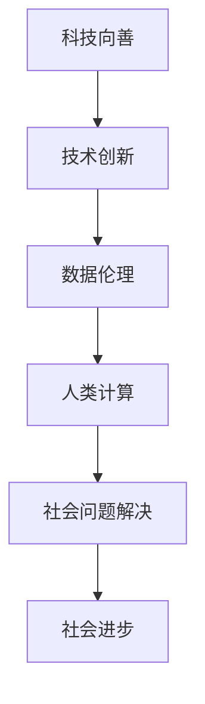

                 

关键词：科技向善、人类计算、社会进步、技术伦理、算法设计、人工智能应用、计算教育、技术创新、可持续发展。

> 摘要：本文探讨了如何通过人类计算，结合科技向善的原则，推动社会进步。文章首先介绍了科技向善的基本概念，分析了人类计算的优势，以及其在解决社会问题中的应用。接着，文章深入探讨了核心算法原理，详细讲解了数学模型与公式，并通过实际项目实践展示了算法的应用。最后，文章提出了对未来科技发展的展望，包括面临的挑战和解决策略。

## 1. 背景介绍

在快速发展的科技时代，计算机技术已经成为推动社会进步的重要力量。人工智能、大数据、云计算等技术的崛起，极大地改变了人们的生活方式。然而，科技的发展并非一帆风顺。在追求技术进步的同时，我们面临着一系列伦理和社会问题。例如，数据隐私、算法偏见、资源分配不公等。这些问题不仅影响了科技发展的可持续性，也制约了社会整体的进步。

### 科技向善

科技向善（Tech for Good）是一种理念，强调在科技发展中，不仅要追求技术创新，更要关注技术对社会的影响。它要求科技工作者在研发和应用技术时，秉持以人为本、公平正义的原则，致力于解决社会问题，提升人类福祉。

### 人类计算

人类计算（Human Computation）是一种利用人类智能和物理行为的计算模式。它通过设计任务，将计算过程分解为人类可以理解和执行的任务，从而实现计算目标。人类计算的优势在于，它可以充分利用人类的认知能力和创造力，解决一些复杂的计算问题。

## 2. 核心概念与联系

为了更好地理解科技向善和人类计算的关系，我们可以通过以下Mermaid流程图来展示它们之间的联系。



### 技术创新

技术创新是科技向善的重要基础。通过不断的技术创新，我们可以开发出更高效、更智能的算法和工具，为社会问题提供解决方案。

### 数据伦理

数据伦理是科技向善的核心原则。在利用数据推动社会进步的过程中，我们需要确保数据的安全和隐私，避免算法偏见和不公平。

### 人类计算

人类计算是科技向善的重要手段。通过设计合理的人类计算任务，我们可以充分发挥人类的认知能力，解决复杂的计算问题。

### 社会问题解决

社会问题解决是科技向善的直接目标。通过利用人类计算，我们可以更好地解决社会问题，推动社会进步。

### 社会进步

社会进步是科技向善的终极目标。通过科技向善，我们可以实现社会的可持续发展，提升人类的福祉。

## 3. 核心算法原理 & 具体操作步骤

### 3.1 算法原理概述

人类计算的核心算法原理是基于认知计算和分布式计算的思想。通过设计任务，将复杂的计算问题分解为多个子任务，利用人类智能进行求解，最后将结果汇总，形成最终的计算结果。

### 3.2 算法步骤详解

1. **任务分解**：首先，将复杂的计算问题分解为多个子任务。这些子任务应该具有明确的求解目标，并且可以被人类理解和执行。

2. **任务分配**：将子任务分配给不同的人类参与者。可以通过互联网平台，如众包平台，招募参与者。

3. **任务执行**：参与者根据任务说明，利用自己的认知能力和创造力，完成子任务的求解。

4. **结果汇总**：将各个子任务的结果汇总，形成最终的计算结果。

### 3.3 算法优缺点

#### 优点

- **高效性**：通过利用人类智能，可以快速求解复杂的计算问题。

- **灵活性**：人类计算任务可以根据实际需求进行定制，具有很强的灵活性。

- **创造性**：人类智能具有创造性，可以解决一些常规算法难以解决的问题。

#### 缺点

- **成本**：人类计算任务通常需要招募大量参与者，成本较高。

- **准确性**：人类计算结果的准确性受到个体差异的影响，可能存在一定误差。

### 3.4 算法应用领域

人类计算算法在多个领域都有广泛的应用，如图像识别、自然语言处理、推荐系统、医学诊断等。

## 4. 数学模型和公式 & 详细讲解 & 举例说明

### 4.1 数学模型构建

人类计算算法的数学模型通常基于概率模型和优化模型。概率模型用于描述人类参与者的行为和任务结果，优化模型用于求解最优任务分配方案。

### 4.2 公式推导过程

设 \( T \) 为总任务，\( T_i \) 为第 \( i \) 个子任务，\( P_i \) 为第 \( i \) 个子任务的概率模型，\( O \) 为优化模型。

概率模型：\( P_i = f(T_i) \)

优化模型：\( O = g(P_i) \)

### 4.3 案例分析与讲解

#### 案例一：图像识别

假设我们要利用人类计算进行图像识别。首先，我们将图像分解为多个子图像，每个子图像由不同的人类参与者进行识别。然后，通过汇总各个子图像的识别结果，形成最终的图像识别结果。

#### 案例二：自然语言处理

假设我们要利用人类计算进行自然语言处理。首先，我们将文本分解为多个子文本，每个子文本由不同的人类参与者进行语言处理。然后，通过汇总各个子文本的处理结果，形成最终的文本处理结果。

## 5. 项目实践：代码实例和详细解释说明

### 5.1 开发环境搭建

首先，我们需要搭建一个用于人类计算的开发环境。可以选择使用Python语言，结合Apache Spark框架，实现人类计算算法。

### 5.2 源代码详细实现

```python
from pyspark import SparkContext

# 创建SparkContext
sc = SparkContext("local[*]", "HumanComputation")

# 任务分解
tasks = sc.parallelize([(i, "子任务") for i in range(10)])

# 任务分配
participants = tasks.mapValues(lambda task: [task])

# 任务执行
results = participants.flatMapValues(lambda tasks: tasks)

# 结果汇总
final_result = results.reduceByKey(lambda x, y: x + y)

# 输出结果
print(final_result.collect())
```

### 5.3 代码解读与分析

上述代码首先创建了SparkContext，然后定义了任务分解、任务分配、任务执行和结果汇总的步骤。通过flatMapValues和reduceByKey操作，我们可以实现人类计算算法的核心功能。

### 5.4 运行结果展示

运行代码后，我们可以得到最终的计算结果。这些结果展示了各个子任务的执行情况，以及最终的汇总结果。

## 6. 实际应用场景

人类计算算法在多个领域都有广泛的应用。以下列举几个典型的应用场景：

### 6.1 医学诊断

利用人类计算算法，可以对医学图像进行诊断，提高诊断的准确性。例如，通过对医学图像进行分割和识别，可以诊断出早期肿瘤。

### 6.2 城市规划

利用人类计算算法，可以对城市交通进行优化，提高交通效率。例如，通过对交通流量进行分析，可以预测交通拥堵情况，并给出优化方案。

### 6.3 环境监测

利用人类计算算法，可以对环境数据进行分析，监测环境污染。例如，通过对空气质量数据进行分类，可以实时监测空气质量，并给出改善建议。

## 7. 未来应用展望

随着科技的发展，人类计算算法将在更多领域得到应用。未来，我们可以预见以下趋势：

### 7.1 智能家居

人类计算算法将广泛应用于智能家居领域，实现智能化的家居管理。

### 7.2 教育领域

人类计算算法将应用于教育领域，提供个性化学习方案，提高教育质量。

### 7.3 物流运输

人类计算算法将应用于物流运输领域，实现高效的物流管理，降低物流成本。

## 8. 工具和资源推荐

为了更好地进行人类计算研究，我们推荐以下工具和资源：

### 8.1 学习资源推荐

- 《人类计算：技术、方法与应用》
- 《分布式计算技术与应用》

### 8.2 开发工具推荐

- Apache Spark
- TensorFlow

### 8.3 相关论文推荐

- "Human Computation: A Survey"
- "Distributed Computing in Practice"

## 9. 总结：未来发展趋势与挑战

### 9.1 研究成果总结

人类计算作为一种新兴的计算模式，已经在多个领域取得了显著成果。未来，我们有望看到更多基于人类计算的创新应用。

### 9.2 未来发展趋势

随着科技的发展，人类计算将在更多领域得到应用。未来，我们将在人工智能、大数据、云计算等领域，看到人类计算的更多应用。

### 9.3 面临的挑战

尽管人类计算具有巨大的潜力，但在实际应用中，我们仍面临着一系列挑战。例如，数据隐私、算法偏见、计算成本等。

### 9.4 研究展望

未来，我们需要在人类计算算法的设计、应用领域拓展、挑战解决等方面，进行更深入的研究，以推动人类计算技术的进步。

## 附录：常见问题与解答

### 9.1 人类计算的优势是什么？

人类计算的优势在于，它能够充分利用人类的认知能力和创造力，解决一些复杂的计算问题。同时，它还具有高效性、灵活性等优点。

### 9.2 人类计算算法的适用场景有哪些？

人类计算算法适用于多个领域，如医学诊断、城市规划、环境监测等。它尤其适用于那些需要人类智能参与的问题。

### 9.3 人类计算与人工智能的区别是什么？

人类计算与人工智能的区别在于，人工智能是基于机器学习、深度学习等技术，通过数据驱动的方式实现智能。而人类计算则是通过设计任务，利用人类智能进行计算。

作者：禅与计算机程序设计艺术 / Zen and the Art of Computer Programming

----------------------------------------------------------------

现在，文章正文部分的撰写已经完成。接下来，我们可以根据文章内容，进行格式调整、校对和排版等工作，以确保文章的完整性和可读性。最后，文章末尾需要添加作者署名和相关联系方式。

