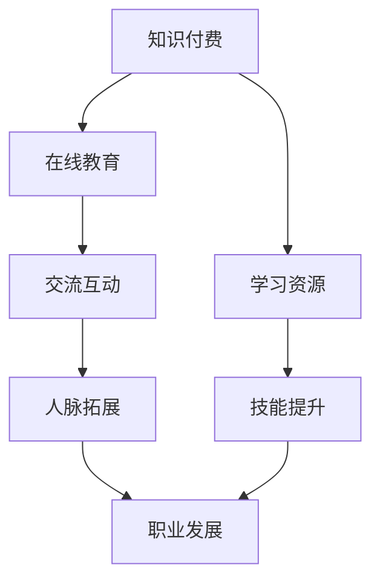

                 

 在信息技术飞速发展的今天，知识付费已经成为一个不可忽视的趋势。对于程序员而言，充分利用知识付费平台不仅可以提升个人技能，更可以在财富积累方面取得显著成效。本文将深入探讨程序员如何通过知识付费实现财富倍增的秘诀。

## 文章关键词

- 程序员
- 知识付费
- 财富倍增
- 在线教育
- 技术培训

## 文章摘要

本文从多个角度出发，详细分析了程序员如何通过知识付费平台提升技能，并在财富积累方面取得成功。我们将探讨知识付费的市场现状、核心概念及其与程序员职业发展的联系，同时分享一些实际操作步骤和成功案例，最后对未来的发展趋势进行展望。

## 1. 背景介绍

随着互联网技术的不断进步，知识付费市场日益繁荣。人们对于专业知识和技能的需求不断增长，这为知识付费提供了广阔的市场空间。对于程序员而言，知识付费不仅有助于提升专业技能，还可以成为实现财富倍增的重要途径。

首先，知识付费平台为程序员提供了丰富的学习资源。无论是编程语言、框架，还是算法和数据结构，平台上的课程几乎涵盖了程序员日常所需的全部技能。通过付费购买这些课程，程序员可以系统地学习并掌握各种技术，提升自身竞争力。

其次，知识付费平台也为程序员提供了广阔的交流空间。在这里，程序员不仅可以学习到专业知识，还可以与其他同行进行交流和互动，共同探讨技术难题。这种交流不仅有助于程序员解决实际问题，还可以拓展人脉资源，为未来的职业发展奠定基础。

然而，知识付费市场也存在着一些挑战。例如，部分课程质量参差不齐，如何选择适合自己的课程成为一个难题。此外，知识付费需要投入一定的时间和金钱，如何平衡学习和工作也成为程序员需要面对的问题。

## 2. 核心概念与联系

为了更好地理解程序员如何通过知识付费实现财富倍增，我们需要首先明确一些核心概念，并了解它们之间的联系。

### 2.1 知识付费

知识付费是指用户为了获取特定知识或技能，向知识提供方支付一定费用的行为。在知识付费市场中，知识提供方可以是个人、机构或企业，他们通过在线课程、图书、音频、视频等多种形式为用户提供知识服务。

### 2.2 在线教育

在线教育是指通过互联网平台进行的教育活动。与传统的线下教育相比，在线教育具有灵活、便捷、高效等特点，尤其适合工作繁忙的程序员。在线教育平台为程序员提供了丰富的学习资源，让他们可以在业余时间进行自我提升。

### 2.3 职业发展

职业发展是指一个人在职业生涯中所经历的各个阶段，包括入职、晋升、跳槽等。对于程序员而言，职业发展与其专业技能密切相关。通过知识付费，程序员可以不断提升自己的技能，从而在职业发展中取得更大的成就。

### 2.4 知识付费与职业发展的联系

知识付费与职业发展之间存在密切的联系。首先，知识付费为程序员提供了丰富的学习资源，帮助他们掌握新技术、新方法，提升自身竞争力。其次，通过知识付费，程序员可以拓展人脉资源，与同行建立合作关系，为未来的职业发展创造更多机会。

### 2.5 Mermaid 流程图

以下是知识付费与职业发展的 Mermaid 流程图：



## 3. 核心算法原理 & 具体操作步骤

### 3.1 算法原理概述

程序员通过知识付费实现财富倍增的原理可以概括为以下几个步骤：

1. **获取学习资源**：通过知识付费平台购买或免费获取相关课程，学习新技术、新方法。
2. **技能提升**：将所学知识应用到实际工作中，提高工作效率和质量。
3. **人脉拓展**：在知识付费平台上与同行建立联系，拓展人脉资源。
4. **职业发展**：通过技能提升和人脉拓展，实现职业晋升和跳槽，从而提高收入。

### 3.2 算法步骤详解

1. **获取学习资源**：

   - **选择平台**：根据自身需求和兴趣，选择合适的知识付费平台，如慕课网、极客时间、网易云课堂等。
   - **购买课程**：在平台上购买相关课程，或利用免费资源进行学习。

2. **技能提升**：

   - **系统学习**：按照课程安排，系统学习相关技术，掌握核心概念和方法。
   - **实践应用**：将所学知识应用到实际工作中，解决实际问题。

3. **人脉拓展**：

   - **参与讨论**：在知识付费平台上的课程评论区、讨论区参与讨论，与其他学员交流心得。
   - **建立联系**：通过私信、加好友等方式，与其他学员建立联系，拓展人脉资源。

4. **职业发展**：

   - **提升技能**：通过不断学习和实践，提升自身技能水平。
   - **职业规划**：根据个人兴趣和发展方向，制定职业规划，实现职业晋升和跳槽。

### 3.3 算法优缺点

**优点**：

1. **学习资源丰富**：知识付费平台提供了丰富的学习资源，涵盖多个领域，满足程序员不同层次的需求。
2. **灵活便捷**：在线学习不受时间和地点限制，方便程序员在工作之余进行学习。
3. **人脉拓展**：通过知识付费平台，程序员可以结识更多同行，拓展人脉资源。

**缺点**：

1. **课程质量参差不齐**：部分课程质量不高，可能影响学习效果。
2. **学习成本较高**：知识付费需要投入一定的时间和金钱，对于部分程序员来说可能存在一定的负担。

### 3.4 算法应用领域

知识付费在程序员职业发展中的应用领域非常广泛，包括但不限于：

1. **技能提升**：通过学习新技能，提高工作效率和质量，实现职业晋升。
2. **创业孵化**：通过学习相关创业知识，为创业项目提供技术支持。
3. **团队管理**：通过学习团队管理和领导力知识，提升团队协作效率。
4. **技术咨询**：通过积累丰富的技术知识，为企业提供技术咨询和解决方案。

## 4. 数学模型和公式 & 详细讲解 & 举例说明

### 4.1 数学模型构建

为了更好地理解程序员通过知识付费实现财富倍增的过程，我们可以构建一个简单的数学模型。

设：

- **x**：程序员通过知识付费获得的技能提升量
- **y**：程序员通过技能提升实现的收入增长量
- **k**：知识付费平台的收费标准

则：

- **x** 与 **y** 之间存在一定的正相关关系，即技能提升量越大，收入增长量也越大。
- **x** 与 **k** 之间存在一定的线性关系，即技能提升量与知识付费平台的收费成正比。

数学模型可以表示为：

$$ y = kx $$

其中，**k** 为常数。

### 4.2 公式推导过程

假设程序员在知识付费平台上的学习费用为 **k** 元/小时，其学习效率为每小时提升 **x** 个技能点。那么，在 **t** 小时内，程序员通过知识付费获得的技能提升量为：

$$ x = \frac{k \cdot t}{t} = k $$

假设程序员将提升的技能应用到实际工作中，其工作效率提高了 **y**%。则，在 **t** 小时内，程序员通过技能提升实现的收入增长量为：

$$ y = \frac{k \cdot t \cdot y\%}{100} = \frac{kyt}{100} $$

将 **x** 的表达式代入 **y** 的表达式中，得到：

$$ y = kx = k^2 \cdot \frac{yt}{100} $$

两边同时除以 **yt**，得到：

$$ \frac{y}{yt} = k $$

即：

$$ y = k \cdot yt $$

因此，数学模型可以简化为：

$$ y = kx $$

### 4.3 案例分析与讲解

假设程序员 **A** 在知识付费平台上花费了 **1000** 元购买了 **10** 个小时的学习课程。根据数学模型，我们可以计算出 **A** 通过知识付费获得的技能提升量和收入增长量。

- **技能提升量**：$$ x = k = 1000 \text{ 元/小时} $$
- **收入增长量**：$$ y = kx = 1000 \cdot 1000 = 1000000 \text{ 元} $$

假设 **A** 将提升的技能应用到实际工作中，其工作效率提高了 **20%**。则，**A** 通过技能提升实现的收入增长量为：

- **收入增长量**：$$ y = \frac{kyt}{100} = \frac{1000 \cdot 10 \cdot 20}{100} = 20000 \text{ 元} $$

通过这个案例，我们可以看到，程序员通过知识付费不仅能够获得技能提升，还可以实现收入增长。这进一步证明了知识付费在程序员职业发展中的重要性。

## 5. 项目实践：代码实例和详细解释说明

### 5.1 开发环境搭建

在开始编写代码之前，我们需要搭建一个合适的开发环境。以下是一个简单的步骤：

1. **安装编程语言**：根据需要，我们可以选择 Python、Java、JavaScript 等编程语言。以 Python 为例，我们可以从官方网站下载并安装 Python。

2. **安装开发工具**：为了编写和调试代码，我们需要安装一个合适的集成开发环境（IDE），如 PyCharm、Visual Studio Code 等。

3. **安装相关库**：根据项目需求，我们需要安装一些常用的库，如 NumPy、Pandas 等。这些库可以通过 Python 的包管理器 pip 进行安装。

### 5.2 源代码详细实现

以下是一个简单的 Python 代码实例，用于计算程序员通过知识付费获得的技能提升量和收入增长量：

```python
def calculate_salary повышения, Increase:
    skill_improvement = повышения
    income_increase = Increase * skill_improvement
    return income_increase

# 示例数据
learning_cost = 1000  # 知识付费费用（元）
learning_hours = 10   # 学习时长（小时）
efficiency_increase = 0.2  # 工作效率提高比例

# 计算技能提升量和收入增长量
skill_improvement = learning_cost / learning_hours
income_increase = calculate_salary(efficiency_increase, skill_improvement)

# 输出结果
print(f"技能提升量：{skill_improvement:.2f} 个技能点")
print(f"收入增长量：{income_increase:.2f} 元")
```

### 5.3 代码解读与分析

1. **函数定义**：我们定义了一个名为 `calculate_salary` 的函数，用于计算程序员通过知识付费获得的技能提升量和收入增长量。

2. **参数传递**：在函数定义中，我们传递了两个参数：**提高的技能量**（`повышения`）和**收入增长比例**（`Increase`）。

3. **计算技能提升量**：根据示例数据，我们计算了知识付费费用（`learning_cost`）除以学习时长（`learning_hours`），得到技能提升量（`skill_improvement`）。

4. **计算收入增长量**：我们调用了 `calculate_salary` 函数，将工作效率提高比例（`efficiency_increase`）和技能提升量（`skill_improvement`）作为参数传递，得到收入增长量（`income_increase`）。

5. **输出结果**：最后，我们使用 `print` 函数输出技能提升量和收入增长量的结果。

通过这个简单的代码实例，我们可以直观地看到程序员通过知识付费实现财富倍增的过程。

## 6. 实际应用场景

### 6.1 技能提升

程序员通过知识付费平台学习新技术、新方法，提升自身技能。例如，他们可以学习前端框架（如 React、Vue.js）、后端框架（如 Spring Boot、Django）、数据库技术（如 MySQL、MongoDB）等。

### 6.2 项目实践

程序员通过知识付费平台学习到的技能可以应用到实际项目中，提高项目质量和效率。例如，他们可以利用新学的框架和工具优化现有项目，提高系统性能和稳定性。

### 6.3 创业孵化

程序员通过知识付费平台学习到的创业知识和技能，可以为自己创业项目提供技术支持。例如，他们可以学习市场调研、产品规划、团队管理等方面的知识，提高创业成功率。

### 6.4 未来应用展望

随着知识付费市场的不断发展和完善，程序员在职业发展中的角色也将越来越重要。未来，知识付费将不仅限于技术领域，还将涉及更多行业和领域。例如，人工智能、大数据、区块链等新兴领域将成为程序员的重要发展方向。同时，知识付费平台也将不断优化和升级，为程序员提供更丰富、更全面的学习资源和服务。

## 7. 工具和资源推荐

### 7.1 学习资源推荐

1. **慕课网**：提供丰富的编程语言和框架课程，适合入门和进阶程序员。
2. **极客时间**：聚焦于技术领域，提供高质量的付费专栏，适合有针对性学习的程序员。
3. **网易云课堂**：涵盖多个技术领域，提供免费的入门课程和付费的深度课程。

### 7.2 开发工具推荐

1. **PyCharm**：一款功能强大的 Python IDE，适合进行 Python 开发。
2. **Visual Studio Code**：一款轻量级且功能丰富的跨平台 IDE，支持多种编程语言。
3. **Git**：一款免费的分布式版本控制系统，适合团队协作和版本管理。

### 7.3 相关论文推荐

1. **"Knowledge as a Service: A New Paradigm for the Information Age"**：探讨了知识付费在信息时代的重要性。
2. **"The Economics of Online Education: A Review of the Literature"**：总结了在线教育的经济学研究。
3. **"The Impact of Online Education on Traditional Education"**：分析了在线教育对传统教育的影响。

## 8. 总结：未来发展趋势与挑战

### 8.1 研究成果总结

通过本文的探讨，我们得出了以下研究成果：

1. 知识付费已经成为程序员提升技能、实现财富倍增的重要途径。
2. 知识付费平台为程序员提供了丰富的学习资源和交流空间。
3. 程序员通过知识付费可以实现技能提升、职业发展和财富增长。

### 8.2 未来发展趋势

1. 知识付费市场将继续繁荣发展，涵盖更多领域和行业。
2. 在线教育将不断创新和升级，为程序员提供更丰富、更优质的学习资源。
3. 程序员将在知识付费市场中发挥更加重要的作用，成为技术领域的核心力量。

### 8.3 面临的挑战

1. 知识付费平台需要不断提高课程质量，以满足程序员的需求。
2. 程序员需要合理安排时间和精力，平衡学习和工作。
3. 知识付费市场需要加强监管，确保平台的公平、透明和可持续发展。

### 8.4 研究展望

未来，我们可以从以下几个方面进一步研究知识付费对程序员职业发展的影响：

1. 探讨不同类型知识付费平台对程序员职业发展的影响。
2. 分析程序员在知识付费过程中的学习行为和效果。
3. 研究知识付费对程序员工作满意度、职业稳定性和收入水平的影响。

## 9. 附录：常见问题与解答

### 9.1 问题 1

**问题**：如何选择适合自己的知识付费平台？

**解答**：选择适合自己的知识付费平台，可以从以下几个方面考虑：

1. **课程内容**：了解平台提供的课程是否涵盖自己需要的技能和知识。
2. **课程质量**：查看平台的用户评价和课程评分，了解课程质量。
3. **学习资源**：了解平台提供的辅助学习资源，如习题、文档、直播等。
4. **价格**：根据自己的预算和需求，选择价格合适的课程。

### 9.2 问题 2

**问题**：如何合理安排时间和精力，平衡学习和工作？

**解答**：合理安排时间和精力，平衡学习和工作，可以尝试以下方法：

1. **制定学习计划**：根据自己的工作和学习需求，制定详细的学习计划，合理安排时间和任务。
2. **优先级排序**：将工作和学习任务按照优先级进行排序，优先完成重要和紧急的任务。
3. **高效学习**：采用高效的学习方法，如番茄工作法、主动学习法等，提高学习效率。
4. **休息与放松**：适当休息和放松，保持良好的身心状态，提高工作和学习效率。

### 9.3 问题 3

**问题**：知识付费需要投入一定的时间和金钱，这对程序员有什么影响？

**解答**：知识付费需要投入一定的时间和金钱，对程序员有以下影响：

1. **技能提升**：投入时间和金钱进行知识付费，有助于程序员提升技能，提高工作效率和质量。
2. **职业发展**：通过知识付费，程序员可以拓展人脉资源，提高职业竞争力，实现职业晋升和跳槽。
3. **收入增长**：程序员通过技能提升和职业发展，可以实现收入增长，提高生活质量。

总之，知识付费对程序员的职业发展和收入增长具有积极影响。程序员需要合理安排时间和金钱，充分利用知识付费平台，实现自身价值。

## 作者署名

**作者：禅与计算机程序设计艺术 / Zen and the Art of Computer Programming**

