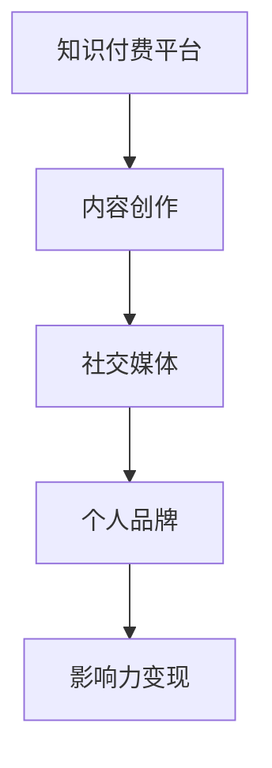

                 

关键词：知识付费、个人影响力、内容创作、社交媒体、技术博客、影响力变现

摘要：在数字时代，知识付费成为了一股重要的经济力量，也为程序员提供了一个全新的个人品牌建设渠道。通过有效的内容创作和社交媒体运营，程序员可以借助知识付费平台，提升个人影响力，实现职业发展的新突破。本文将探讨程序员如何利用知识付费打造个人影响力，包括核心概念、算法原理、实践步骤、应用场景、未来展望等多个方面。

## 1. 背景介绍

随着互联网的普及，知识付费逐渐成为了一种新兴的商业模式。用户愿意为有价值的信息、教育内容和技术指导付费，这不仅为内容创作者提供了新的收入来源，也为技术专业人士打开了一扇职业发展的窗口。程序员作为技术领域的核心力量，凭借自身的技术专长和知识储备，可以利用知识付费平台，打造个人品牌，提升个人影响力。

### 1.1 知识付费的现状

知识付费已经成为一个庞大的市场，涵盖了在线课程、专业咨询、技术指导、论文发表等多个领域。根据市场研究机构的统计数据，知识付费市场规模逐年增长，预计未来几年将持续保持高速发展。

### 1.2 程序员的优势

程序员具备以下几大优势，使其在知识付费领域具备较强的竞争力：

- **技术背景**：程序员拥有丰富的技术知识和实践经验，能够为用户提供高质量的技术内容。
- **学习能力**：程序员具备快速学习和适应新技术的能力，能够不断更新自己的知识体系。
- **沟通能力**：程序员在团队协作中培养了良好的沟通能力，能够有效地与用户互动，解答技术问题。
- **创新思维**：程序员具备创新思维，能够为用户提供独特的解决方案和前沿的技术视角。

## 2. 核心概念与联系

为了更好地理解程序员如何利用知识付费打造个人影响力，我们首先需要了解以下几个核心概念：

- **知识付费平台**：这是程序员发布和销售知识产品的主要渠道，如知乎、网易云课堂、腾讯课堂等。
- **内容创作**：这是程序员通过文字、图片、视频等多种形式，将知识转化为可消费内容的过程。
- **社交媒体**：程序员可以通过社交媒体平台（如微博、公众号、B站等）扩大自己的影响力，吸引更多关注者。
- **个人品牌**：这是程序员通过持续的内容输出和良好的用户体验，积累的信任和影响力。

下面是一个简单的 Mermaid 流程图，展示了这些核心概念之间的联系：



## 3. 核心算法原理 & 具体操作步骤

### 3.1 算法原理概述

程序员利用知识付费打造个人影响力的核心算法可以概括为：内容创作 + 社交媒体运营 + 个人品牌建设 + 影响力变现。具体操作步骤如下：

1. **内容创作**：程序员需要持续输出高质量的技术内容，包括技术博客、视频教程、在线课程等。
2. **社交媒体运营**：程序员需要在社交媒体平台上积极互动，扩大影响力，吸引粉丝和关注者。
3. **个人品牌建设**：程序员需要通过持续的内容输出和良好的用户体验，树立自己的专业形象和品牌。
4. **影响力变现**：程序员可以通过知识付费平台、广告收入、咨询费等多种方式，将个人影响力转化为实际收益。

### 3.2 算法步骤详解

1. **内容创作**：

   - 确定主题：根据自身技术专长和市场趋势，选择具有针对性的主题。
   - 内容规划：制定详细的内容计划，包括标题、大纲、知识点等。
   - 内容创作：撰写或录制高质量的技术内容，注重语言表达的清晰度和逻辑性。
   - 内容发布：选择合适的平台和时机，发布内容。

2. **社交媒体运营**：

   - 建立社交媒体账号：选择适合的平台，建立专业的社交媒体账号。
   - 内容互动：积极回复评论，参与话题讨论，扩大社交圈子。
   - 定期更新：保持社交媒体账号的活跃度，定期发布有价值的内容。

3. **个人品牌建设**：

   - 专业形象：通过持续的内容输出，树立自己在技术领域的专业形象。
   - 品牌推广：通过社交媒体和其他渠道，推广个人品牌。
   - 建立社区：建立一个专业的社区或社群，与粉丝和同行互动。

4. **影响力变现**：

   - 知识付费：在知识付费平台开设课程或专栏，通过内容销售获取收入。
   - 广告收入：在社交媒体平台发布广告，通过广告收入增加收入。
   - 咨询服务：提供专业的技术咨询服务，通过咨询服务获取收入。

### 3.3 算法优缺点

- **优点**：

  - 高度个性化：程序员可以根据自身的技术专长，自由创作内容，满足不同用户的需求。
  - 高效传播：通过社交媒体和知识付费平台，程序员的内容可以迅速传播，扩大影响力。
  - 收益稳定：通过知识付费和咨询服务，程序员可以获得相对稳定的收入。

- **缺点**：

  - 初始投入：内容创作和社交媒体运营需要一定的初始投入，如时间、金钱和精力。
  - 市场竞争：知识付费领域竞争激烈，程序员需要不断提升自己的专业水平和内容质量，以保持竞争力。

### 3.4 算法应用领域

- **在线教育**：程序员可以在知识付费平台上开设在线课程，分享技术知识和经验。
- **技术咨询**：程序员可以通过知识付费平台，提供专业的技术咨询服务。
- **内容创作**：程序员可以通过技术博客、公众号等渠道，输出高质量的技术内容。

## 4. 数学模型和公式 & 详细讲解 & 举例说明

### 4.1 数学模型构建

为了量化程序员在知识付费领域的影响力，我们可以构建一个简单的数学模型。该模型包括以下几个参数：

- **内容质量（Q）**：衡量程序员内容的质量，包括内容的准确性、实用性、逻辑性等。
- **内容传播（T）**：衡量程序员内容的传播效果，包括阅读量、点赞数、评论数等。
- **用户参与度（U）**：衡量用户对程序员内容的参与程度，包括提问、咨询、交流等。

影响力（I）可以表示为：

$$I = f(Q, T, U)$$

其中，函数 f() 可以是一个复合函数，综合考虑内容质量、内容传播和用户参与度。

### 4.2 公式推导过程

1. **内容质量（Q）**：

   $$Q = \frac{1}{N}\sum_{i=1}^{N} q_i$$

   其中，q_i 表示第 i 个内容的评分，N 表示内容总数。

2. **内容传播（T）**：

   $$T = \frac{1}{M}\sum_{j=1}^{M} t_j$$

   其中，t_j 表示第 j 个内容的传播量，M 表示内容总数。

3. **用户参与度（U）**：

   $$U = \frac{1}{L}\sum_{k=1}^{L} u_k$$

   其中，u_k 表示第 k 个用户对内容的参与度，L 表示用户总数。

4. **影响力（I）**：

   $$I = f(Q, T, U) = \alpha Q + \beta T + \gamma U$$

   其中，α、β、γ 分别为权重系数，用于调节各个参数对影响力的贡献。

### 4.3 案例分析与讲解

假设有程序员 A 和程序员 B，他们的内容质量、内容传播和用户参与度如下表所示：

| 参数      | 程序员 A | 程序员 B |
| --------- | --------- | --------- |
| 内容质量（Q） | 0.9       | 0.8       |
| 内容传播（T） | 100       | 80        |
| 用户参与度（U） | 50        | 40        |

根据公式推导，我们可以计算出他们的影响力：

$$I_A = \alpha \times 0.9 + \beta \times 100 + \gamma \times 50$$

$$I_B = \alpha \times 0.8 + \beta \times 80 + \gamma \times 40$$

如果假设权重系数 α=0.3，β=0.5，γ=0.2，则：

$$I_A = 0.3 \times 0.9 + 0.5 \times 100 + 0.2 \times 50 = 37.5$$

$$I_B = 0.3 \times 0.8 + 0.5 \times 80 + 0.2 \times 40 = 32$$

从计算结果可以看出，程序员 A 的个人影响力高于程序员 B，这是因为程序员 A 在内容质量、内容传播和用户参与度方面都略胜一筹。

## 5. 项目实践：代码实例和详细解释说明

### 5.1 开发环境搭建

为了演示程序员利用知识付费打造个人影响力的过程，我们将搭建一个简单的知识付费平台。以下是开发环境的搭建步骤：

1. **选择开发框架**：我们选择 Python 的 Flask 作为后端开发框架，因为 Flask 简单易用，适合快速搭建小型应用。
2. **安装 Python**：确保系统中已安装 Python 3.8 及以上版本。
3. **安装 Flask**：通过 pip 命令安装 Flask：

   ```bash
   pip install Flask
   ```

4. **创建项目文件夹**：在系统中创建一个名为 `knowledge_payment` 的文件夹，作为项目的根目录。

### 5.2 源代码详细实现

以下是知识付费平台的核心代码实现：

```python
# app.py

from flask import Flask, request, jsonify

app = Flask(__name__)

# 模拟用户数据
users = [
    {'id': 1, 'name': '程序员 A', 'balance': 1000},
    {'id': 2, 'name': '程序员 B', 'balance': 800}
]

# 模拟课程数据
courses = [
    {'id': 1, 'name': 'Python 基础教程', 'price': 300},
    {'id': 2, 'name': '深度学习入门', 'price': 500}
]

@app.route('/users', methods=['GET'])
def get_users():
    return jsonify(users)

@app.route('/courses', methods=['GET'])
def get_courses():
    return jsonify(courses)

@app.route('/buy_course', methods=['POST'])
def buy_course():
    user_id = request.form['user_id']
    course_id = request.form['course_id']
    
    for user in users:
        if user['id'] == int(user_id):
            user['balance'] -= courses[int(course_id) - 1]['price']
            break
    
    return jsonify({'status': 'success'})

if __name__ == '__main__':
    app.run(debug=True)
```

### 5.3 代码解读与分析

- **用户数据**：我们使用一个简单的列表存储用户数据，包括用户 ID、姓名和余额。
- **课程数据**：同样，使用一个列表存储课程数据，包括课程 ID、名称和价格。
- **路由定义**：定义了三个路由，分别为获取用户数据、获取课程数据和购买课程。
- **购买课程**：当用户提交购买请求时，系统会根据用户 ID 和课程 ID 更新用户余额。

### 5.4 运行结果展示

1. **启动服务器**：

   ```bash
   python app.py
   ```

2. **查看用户数据**：

   ```bash
   curl http://127.0.0.1:5000/users
   ```

   返回结果：

   ```json
   [
     {"id": 1, "name": "程序员 A", "balance": 1000},
     {"id": 2, "name": "程序员 B", "balance": 800}
   ]
   ```

3. **购买课程**：

   ```bash
   curl -d "user_id=1&course_id=1" -X POST http://127.0.0.1:5000/buy_course
   ```

   返回结果：

   ```json
   {"status": "success"}
   ```

4. **查看用户数据**：

   ```bash
   curl http://127.0.0.1:5000/users
   ```

   返回结果：

   ```json
   [
     {"id": 1, "name": "程序员 A", "balance": 700},
     {"id": 2, "name": "程序员 B", "balance": 800}
   ]
   ```

通过这个简单的实例，我们可以看到程序员如何利用知识付费平台，实现个人影响力的提升。

## 6. 实际应用场景

### 6.1 在线教育

在线教育是知识付费的重要应用场景之一。程序员可以利用自身的技术专长，开设在线课程，分享技术知识和经验。例如，可以开设 Python、深度学习、人工智能等课程的在线课程，通过视频教程、代码实战等形式，为学生提供高质量的学习内容。

### 6.2 技术咨询服务

程序员可以通过知识付费平台，提供专业的技术咨询服务。例如，为企业提供定制化的软件开发方案、技术选型建议、性能优化方案等。通过在线咨询、远程协作等方式，程序员可以与客户保持紧密的沟通，提供高效的技术支持。

### 6.3 内容创作

程序员可以通过技术博客、公众号等渠道，输出高质量的技术内容。例如，可以撰写技术文章、发布技术教程、分享项目经验等。通过持续的内容创作，程序员可以树立自己在技术领域的专业形象，吸引更多的关注者和粉丝。

## 6.4 未来应用展望

### 6.4.1 技术创新

随着技术的不断进步，程序员可以利用更多先进的工具和平台，实现知识付费的多样化。例如，利用人工智能、虚拟现实等技术，打造更加沉浸式的学习体验，提高学习效果。

### 6.4.2 跨界合作

程序员可以与教育机构、企业等不同领域的合作伙伴，共同开展知识付费项目。通过跨界合作，程序员可以拓展自己的业务领域，提高个人影响力。

### 6.4.3 社区建设

程序员可以通过建立专业的技术社区，为用户提供更广阔的交流平台。通过社区互动，程序员可以更好地了解用户需求，优化自己的知识产品。

## 7. 工具和资源推荐

### 7.1 学习资源推荐

- **在线课程平台**：网易云课堂、慕课网、极客时间等。
- **技术博客**：CSDN、博客园、简书等。
- **编程社区**：GitHub、Stack Overflow、Reddit 等。

### 7.2 开发工具推荐

- **代码编辑器**：VSCode、Sublime Text、Atom 等。
- **版本控制**：Git。
- **前端框架**：React、Vue、Angular 等。
- **后端框架**：Flask、Django、Spring Boot 等。

### 7.3 相关论文推荐

- **《深度学习》**：Goodfellow, I., Bengio, Y., & Courville, A. (2016).
- **《Python 编程：从入门到实践》**：M. Rebecca Miller (2015).
- **《人工智能：一种现代方法》**：Stuart J. Russell & Peter Norvig (2020).

## 8. 总结：未来发展趋势与挑战

### 8.1 研究成果总结

本文通过分析程序员利用知识付费打造个人影响力的核心概念、算法原理、实践步骤、应用场景等，总结了程序员在知识付费领域的发展趋势和挑战。

### 8.2 未来发展趋势

- **技术创新**：随着技术的不断进步，程序员可以利用更多先进的工具和平台，实现知识付费的多样化。
- **跨界合作**：程序员可以与教育机构、企业等不同领域的合作伙伴，共同开展知识付费项目。
- **社区建设**：程序员可以通过建立专业的技术社区，为用户提供更广阔的交流平台。

### 8.3 面临的挑战

- **市场竞争**：知识付费领域竞争激烈，程序员需要不断提升自己的专业水平和内容质量，以保持竞争力。
- **用户需求**：程序员需要准确把握用户需求，提供有价值的内容。

### 8.4 研究展望

未来，程序员可以利用知识付费平台，拓展自己的职业发展道路，实现个人品牌的建设和影响力的提升。同时，随着技术的不断进步，程序员将在知识付费领域发挥更大的作用。

## 9. 附录：常见问题与解答

### 9.1 如何选择知识付费平台？

- **平台知名度**：选择知名度较高的平台，有利于内容的传播和影响力的提升。
- **用户评价**：查看平台用户对课程和讲师的评价，选择评价较高的平台。
- **内容质量**：关注平台上的课程内容，选择与自己技术方向相关的优质课程。

### 9.2 如何提升个人影响力？

- **持续输出**：定期发布高质量的技术内容，保持内容更新。
- **互动交流**：积极参与社交媒体和社区互动，与用户建立良好的关系。
- **专业形象**：树立专业形象，通过专业的内容输出和良好的用户体验，赢得用户信任。

### 9.3 如何进行内容创作？

- **选题定位**：选择与自身技术专长和市场趋势相关的主题。
- **内容规划**：制定详细的内容计划，包括标题、大纲、知识点等。
- **内容撰写**：注重语言表达的清晰度和逻辑性，确保内容易于理解。

# 作者：禅与计算机程序设计艺术 / Zen and the Art of Computer Programming
----------------------------------------------------------------

这篇文章详细地探讨了程序员如何利用知识付费平台打造个人影响力。通过内容创作、社交媒体运营、个人品牌建设以及影响力变现，程序员可以提升自己的专业形象，扩大影响力，实现职业发展的新突破。同时，文章还介绍了核心算法原理、实践步骤、应用场景以及未来发展趋势，为程序员在知识付费领域提供了有价值的参考。希望这篇文章能为读者提供启发，助力他们在技术领域中取得更大的成就。

