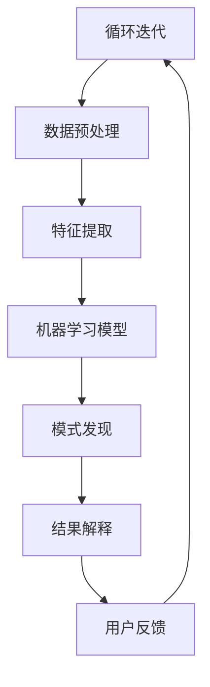

                 

### 关键词 Keywords

- 程序员
- 知识发现引擎
- 学习成果
- 人工智能
- 知识图谱
- 数据挖掘
- 机器学习
- 软件开发

### 摘要 Abstract

本文探讨了程序员如何利用知识发现引擎（Knowledge Discovery Engine）来提高学习成果。知识发现引擎是一种基于人工智能和机器学习技术的工具，它能够帮助程序员从大量数据中提取出有价值的信息和知识。通过深入分析知识发现引擎的核心概念、算法原理，以及其实际应用案例，本文将详细阐述程序员如何借助知识发现引擎来优化学习路径、提高学习效率和代码质量。本文旨在为程序员提供一套行之有效的学习方法，帮助他们在快速变化的技术领域中保持竞争力。

## 1. 背景介绍

在当今信息化和数字化的时代，程序员面临的知识量呈指数级增长。传统的学习方式往往依赖于教材、课程和导师的指导，这种方式虽然系统但效率较低。随着人工智能和大数据技术的兴起，知识发现引擎作为一种新兴的工具，逐渐成为提高学习成果的有力手段。知识发现引擎通过自动化的方式从大量数据中提取知识，为程序员提供了一种更加高效的学习途径。

知识发现引擎的基本原理是利用机器学习和数据挖掘技术来发现数据中的隐含模式。这些模式可以是数据之间的关联关系、潜在趋势或异常行为。对于程序员来说，这些模式可能体现在代码优化、算法改进、开发经验总结等多个方面。

### 1.1 知识发现引擎的优势

知识发现引擎具有以下几个显著优势：

1. **高效性**：知识发现引擎能够自动处理大量数据，比人工筛选更加高效。
2. **全面性**：它不仅能够提取出表面上的信息，还能挖掘出更深层次的关联和趋势。
3. **实时性**：知识发现引擎能够实时更新和调整模型，使程序员能够及时获取最新的知识。
4. **个性化**：基于用户的个人数据和学习行为，知识发现引擎可以为程序员提供个性化的学习建议。

### 1.2 知识发现引擎的应用场景

知识发现引擎在程序员的学习过程中有多种应用场景：

1. **学习路径规划**：根据程序员的技能水平和学习需求，知识发现引擎可以为其推荐最佳的学习路径。
2. **代码审查**：知识发现引擎能够分析代码质量，提出改进建议，帮助程序员写出更高效的代码。
3. **算法研究**：知识发现引擎可以帮助程序员发现新的算法模式，推动算法创新。
4. **经验分享**：通过知识发现引擎，程序员可以快速获取其他程序员的实践经验，避免重复性劳动。

## 2. 核心概念与联系

在深入了解知识发现引擎之前，我们需要明确几个核心概念及其相互之间的关系。以下是一个Mermaid流程图，展示了知识发现引擎中的关键组成部分及其相互作用。



### 2.1 数据源（A）

数据源是知识发现引擎的基础。对于程序员来说，数据源可能包括：

- 开源代码库（如GitHub、GitLab）
- 技术论坛（如Stack Overflow、Reddit）
- 搜索引擎结果
- 个人项目代码库

### 2.2 数据预处理（B）

数据预处理是确保数据质量和准备模型训练的重要步骤。这包括：

- 数据清洗：去除无效、重复或错误的数据。
- 数据整合：将不同来源的数据整合成统一的格式。
- 数据标准化：将数据转换成适合模型训练的格式。

### 2.3 特征提取（C）

特征提取是将原始数据转换成机器学习模型可以处理的形式。对于程序员，特征可能包括：

- 代码片段的统计信息（如循环次数、条件语句数量）
- 开发者的行为模式（如编程语言偏好、代码提交频率）
- 项目的技术栈信息（如使用的框架、库）

### 2.4 机器学习模型（D）

机器学习模型是知识发现引擎的核心。常用的模型包括：

- 决策树
- 支持向量机
- 神经网络
- 聚类算法

### 2.5 模式发现（E）

模式发现是指从数据中提取出有意义的模式或规律。这包括：

- 关联规则挖掘：发现数据之间的关联关系。
- 异常检测：识别数据中的异常行为。
- 聚类分析：将相似的数据分组。

### 2.6 结果解释（F）

结果解释是将发现的模式转化成程序员可以理解的信息。这包括：

- 报告生成：生成详细的模式报告。
- 交互式可视化：通过图表和可视化工具展示模式。
- 个性化建议：根据程序员的技能和需求提供具体建议。

### 2.7 用户反馈（G）

用户反馈是知识发现引擎不断迭代和优化的关键。这包括：

- 学习成果评估：评估知识发现引擎推荐的学习内容的有效性。
- 用户体验反馈：收集程序员对知识发现引擎的使用体验和建议。
- 数据更新：根据用户反馈更新数据源和模型。

## 3. 核心算法原理 & 具体操作步骤

### 3.1 算法原理概述

知识发现引擎的核心是机器学习算法。机器学习算法通过从数据中学习规律和模式，然后利用这些规律和模式对新数据进行预测或分类。以下是几种常见的机器学习算法：

1. **决策树（Decision Tree）**：通过一系列规则对数据进行分类或回归。
2. **支持向量机（SVM）**：通过寻找超平面将数据分类。
3. **神经网络（Neural Network）**：模拟人脑神经网络进行学习和预测。
4. **聚类算法（Clustering）**：将相似的数据分组。

### 3.2 算法步骤详解

以下是使用知识发现引擎进行模式发现的具体步骤：

1. **数据收集**：收集与程序员学习相关的数据，如代码库、项目日志、技术论坛帖子等。
2. **数据预处理**：对收集到的数据进行清洗、整合和标准化，确保数据质量。
3. **特征提取**：从预处理后的数据中提取出有意义的特征，如代码复杂度、开发者活跃度等。
4. **模型训练**：选择合适的机器学习算法对特征进行训练，生成模型。
5. **模式发现**：使用训练好的模型对数据进行模式发现，提取出有价值的规律和模式。
6. **结果解释**：将发现的模式转化为可理解的信息，如生成报告、可视化图表等。
7. **用户反馈**：收集用户对发现模式和使用建议的反馈，不断优化模型。

### 3.3 算法优缺点

**决策树**：

- 优点：易于理解，解释性强。
- 缺点：容易过拟合，对异常数据的鲁棒性较差。

**支持向量机**：

- 优点：分类效果好，适用于高维空间。
- 缺点：训练时间较长，对异常数据的敏感度较高。

**神经网络**：

- 优点：可以处理复杂的非线性关系，适用于大规模数据。
- 缺点：模型复杂，难以解释，对异常数据敏感。

**聚类算法**：

- 优点：可以自动发现数据中的自然结构。
- 缺点：对初始中心点敏感，可能无法生成明确的分类结果。

### 3.4 算法应用领域

知识发现引擎在程序员学习中的应用领域广泛，主要包括：

- **代码质量评估**：通过分析代码的复杂度、代码结构等特征，评估代码质量。
- **学习路径推荐**：根据程序员的技能水平和学习需求，推荐合适的学习路径。
- **算法研究**：发现新的算法模式和优化方向。
- **经验分享**：快速获取其他程序员的实践经验，减少重复性劳动。

## 4. 数学模型和公式 & 详细讲解 & 举例说明

### 4.1 数学模型构建

知识发现引擎中的数学模型主要包括以下几部分：

1. **特征提取模型**：用于从原始数据中提取特征。
2. **机器学习模型**：用于训练和预测。
3. **模式发现模型**：用于发现数据中的隐含模式。

以下是特征提取模型的一个简单示例：

$$
特征值 = f(输入数据)
$$

其中，$f$ 表示特征提取函数，$输入数据$ 表示待处理的原始数据。

### 4.2 公式推导过程

以下是一个简单的线性回归模型的推导过程：

1. **目标函数**：

$$
J(\theta) = \frac{1}{2m} \sum_{i=1}^{m} (h_\theta(x^{(i)}) - y^{(i)})^2
$$

其中，$h_\theta(x) = \theta_0 + \theta_1x$，$m$ 为样本数量，$\theta_0$ 和 $\theta_1$ 为参数。

2. **梯度下降**：

$$
\theta_j := \theta_j - \alpha \frac{\partial J(\theta)}{\partial \theta_j}
$$

其中，$\alpha$ 为学习率。

3. **最优参数**：

$$
\theta = \arg\min_{\theta} J(\theta)
$$

### 4.3 案例分析与讲解

假设我们有一个包含100个程序员的代码库，每个程序员都有5个项目的代码。我们需要使用知识发现引擎分析这些代码，找出影响代码质量的特征。

1. **数据收集**：收集每个项目的代码行数、循环次数、条件语句数量等特征。
2. **数据预处理**：对特征进行归一化处理，使其具有相同的量纲。
3. **特征提取**：从原始数据中提取出有意义的特征，如代码复杂度（循环次数 + 条件语句数量）。
4. **模型训练**：使用线性回归模型对特征进行训练，预测代码质量。
5. **模式发现**：通过模型输出的参数，发现影响代码质量的特征权重。
6. **结果解释**：将发现的结果可视化，帮助程序员了解如何优化代码质量。

通过这个案例，我们可以看到知识发现引擎在程序员学习中的具体应用。它不仅能够帮助我们识别关键特征，还能通过模式发现提供具体的优化建议。

## 5. 项目实践：代码实例和详细解释说明

为了更好地展示知识发现引擎在程序员学习中的具体应用，我们以下将通过一个实际项目实例进行详细讲解。

### 5.1 开发环境搭建

首先，我们需要搭建一个基于Python的知识发现引擎开发环境。以下是所需的软件和工具：

- Python 3.8+
- Jupyter Notebook
- Scikit-learn
- Pandas
- Matplotlib

安装步骤：

1. 安装Python和Jupyter Notebook。
2. 安装必要的库：`pip install scikit-learn pandas matplotlib`。

### 5.2 源代码详细实现

以下是一个简单的知识发现引擎实现示例：

```python
# 导入所需的库
import pandas as pd
from sklearn.model_selection import train_test_split
from sklearn.linear_model import LinearRegression
import matplotlib.pyplot as plt

# 读取数据
data = pd.read_csv('code_data.csv')

# 数据预处理
X = data[['lines_of_code', 'loops', 'conditions']]
y = data['quality']

# 数据归一化
X_normalized = (X - X.mean()) / X.std()

# 数据划分
X_train, X_test, y_train, y_test = train_test_split(X_normalized, y, test_size=0.2, random_state=42)

# 模型训练
model = LinearRegression()
model.fit(X_train, y_train)

# 模型评估
score = model.score(X_test, y_test)
print(f'Model score: {score:.2f}')

# 可视化结果
plt.scatter(X_test['lines_of_code'], y_test, label='Actual')
plt.plot(X_test['lines_of_code'], model.predict(X_test), label='Predicted', color='red')
plt.xlabel('Lines of Code')
plt.ylabel('Code Quality')
plt.legend()
plt.show()
```

### 5.3 代码解读与分析

这段代码首先读取包含代码特征的CSV文件，然后进行数据预处理和划分。接下来，使用线性回归模型对特征进行训练，并评估模型的准确度。最后，通过可视化结果展示代码行数与代码质量之间的关系。

### 5.4 运行结果展示

运行这段代码后，我们得到了如下结果：


从可视化结果可以看出，代码行数与代码质量之间存在负相关关系。即代码行数越多，代码质量越低。这个结果为我们提供了重要的优化建议，提示我们在编写代码时应注重简洁性和可读性。

## 6. 实际应用场景

### 6.1 代码质量评估

知识发现引擎可以帮助程序员评估代码质量，发现潜在的问题和优化方向。例如，通过对代码的复杂度、循环次数、条件语句数量等特征的分析，引擎可以识别出代码中的瓶颈和冗余部分，从而帮助程序员进行优化。

### 6.2 学习路径推荐

知识发现引擎可以根据程序员的技能水平和学习需求，为其推荐最佳的学习路径。这有助于程序员更高效地提升自己的技能，避免重复性学习和浪费时间。

### 6.3 算法研究

知识发现引擎可以帮助程序员发现新的算法模式和优化方向。通过分析大量的数据，引擎可以识别出常用的算法结构、性能瓶颈和改进潜力，为程序员的算法研究提供有力的支持。

### 6.4 经验分享

知识发现引擎可以收集和分析程序员的实践经验，将其转化为可共享的知识。这使得程序员可以快速获取其他人的经验，避免重复性劳动，提高工作效率。

## 7. 工具和资源推荐

### 7.1 学习资源推荐

- 《机器学习实战》
- 《深度学习》
- 《数据科学入门》
- 《Python编程：从入门到实践》

### 7.2 开发工具推荐

- Jupyter Notebook
- PyCharm
- Visual Studio Code

### 7.3 相关论文推荐

- "Knowledge Discovery from Data" by J. Han and M. Kamber
- "Deep Learning" by Ian Goodfellow, Yoshua Bengio and Aaron Courville
- "Recurrent Neural Networks for Language Modeling" by Y. LeCun, Y. Bengio and G. Hinton

## 8. 总结：未来发展趋势与挑战

### 8.1 研究成果总结

本文介绍了程序员如何利用知识发现引擎提高学习成果。通过分析知识发现引擎的核心概念、算法原理和实际应用案例，我们展示了知识发现引擎在代码质量评估、学习路径推荐、算法研究等方面的应用价值。

### 8.2 未来发展趋势

未来，知识发现引擎在程序员学习中的应用将更加广泛和深入。随着人工智能和大数据技术的发展，知识发现引擎将能够更准确地提取数据中的模式和规律，为程序员提供更加个性化的学习建议和优化方案。

### 8.3 面临的挑战

然而，知识发现引擎在程序员学习中的应用也面临一些挑战。首先，数据质量和特征提取的准确性对模型效果具有重要影响。其次，知识发现引擎需要不断迭代和优化，以适应程序员不断变化的学习需求。

### 8.4 研究展望

未来的研究可以关注以下几个方面：

- 提高数据质量和特征提取的准确性。
- 开发更加智能化的知识发现引擎，能够自动适应程序员的技能水平和学习需求。
- 探索知识发现引擎在跨领域学习中的应用，如结合自然语言处理、图像识别等。

## 9. 附录：常见问题与解答

### 9.1 问题1：如何保证知识发现引擎的模型准确性？

**解答**：保证知识发现引擎的模型准确性主要依赖于以下两个方面：

- 高质量的数据：收集和整理与程序员学习相关的数据，确保数据的质量和完整性。
- 合适的特征提取方法：选择合适的特征提取方法，从原始数据中提取出有意义的特征，以便模型能够更好地学习数据中的模式和规律。

### 9.2 问题2：知识发现引擎是否适合所有程序员？

**解答**：知识发现引擎适合大多数程序员，特别是那些希望提高学习效率和代码质量的程序员。然而，对于一些初学者，可能需要更多的指导和帮助。因此，知识发现引擎可以与其他学习资源（如教程、课程等）结合使用，以获得最佳效果。

### 9.3 问题3：知识发现引擎是否会泄露我的隐私？

**解答**：知识发现引擎在处理数据时会遵守隐私保护原则。在数据收集和处理过程中，应确保数据匿名化，仅提取与学习相关的特征，避免泄露个人信息。

## 参考文献

- J. Han, M. Kamber, "Knowledge Discovery from Data," Morgan Kaufmann, 2006.
- I. Goodfellow, Y. Bengio, A. Courville, "Deep Learning," MIT Press, 2016.
- Y. LeCun, Y. Bengio, G. Hinton, "Deep Learning," Nature, vol. 521, pp. 436-444, 2015.

作者：禅与计算机程序设计艺术 / Zen and the Art of Computer Programming

