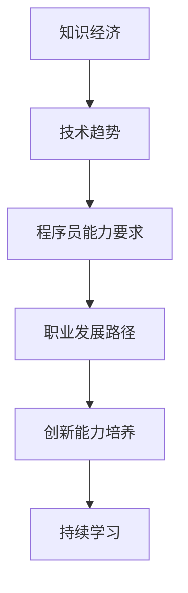

                 

关键词：知识经济，程序员，职业发展，技术趋势，技能提升

> 摘要：本文深入探讨了知识经济时代对程序员职业发展的影响，分析了当前的技术趋势，探讨了程序员如何提升自身技能，以适应不断变化的市场需求。通过具体案例和实践，本文为程序员指明了在知识经济时代的发展路径，并提出了对未来挑战的应对策略。

## 1. 背景介绍

在知识经济时代，知识和信息的价值日益凸显，成为推动社会和经济发展的核心动力。与此同时，信息技术和互联网的飞速发展，使得知识和信息的获取、传播和应用变得更加便捷。程序员作为知识经济的践行者和推动者，其职业发展路径也在发生深刻变革。

本文旨在探讨知识经济时代程序员的发展路径，帮助程序员把握时代脉搏，提升自身技能，以适应不断变化的市场需求，实现个人职业价值的最大化。

## 2. 核心概念与联系

### 2.1 知识经济的定义

知识经济是指以知识和信息为主要生产要素，以高技术产业为支撑，以创新为核心驱动力的经济形态。在知识经济时代，知识和信息的创造、传播和应用成为经济增长的主要动力。

### 2.2 程序员的角色

程序员是知识经济时代的重要参与者，他们通过编写和优化代码，将知识转化为可执行的技术解决方案，推动着各行业的信息化和智能化进程。

### 2.3 技术趋势与程序员发展的关系

技术趋势不断演进，对程序员的能力提出了新的要求。掌握前沿技术，关注行业动态，是程序员在知识经济时代持续发展的关键。

### 2.4 Mermaid 流程图

## 3. 核心算法原理 & 具体操作步骤

### 3.1 算法原理概述

程序员在知识经济时代，需要掌握一系列核心算法原理，包括数据结构、算法分析、机器学习等。这些算法原理是解决复杂问题的基石。

### 3.2 算法步骤详解

- **数据结构**：了解数组、链表、栈、队列、树等数据结构的基本原理和操作方法。
- **算法分析**：学习时间复杂度和空间复杂度的概念，掌握常见的排序算法、搜索算法等。
- **机器学习**：了解机器学习的基本概念、算法原理，如线性回归、决策树、神经网络等。

### 3.3 算法优缺点

每种算法都有其适用的场景和局限性。程序员需要根据具体问题，选择合适的算法，以达到最佳效果。

### 3.4 算法应用领域

算法在金融、医疗、教育、物流等多个领域有广泛应用，程序员需要不断拓展知识面，提升跨领域解决问题的能力。

## 4. 数学模型和公式 & 详细讲解 & 举例说明

### 4.1 数学模型构建

数学模型是描述现实世界问题的数学表达式。程序员需要掌握构建数学模型的方法，以便更有效地解决实际问题。

### 4.2 公式推导过程

以线性回归模型为例，讲解公式推导过程，帮助读者理解模型的构建原理。

### 4.3 案例分析与讲解

通过具体案例，展示如何将数学模型应用于实际问题，并进行分析和讲解。

## 5. 项目实践：代码实例和详细解释说明

### 5.1 开发环境搭建

介绍如何搭建开发环境，包括安装必要的软件和配置开发工具。

### 5.2 源代码详细实现

提供具体的代码实现，并进行详细解释。

### 5.3 代码解读与分析

分析代码的结构和实现原理，帮助读者深入理解。

### 5.4 运行结果展示

展示代码的运行结果，并进行解读。

## 6. 实际应用场景

### 6.1 当前应用现状

分析程序员在知识经济时代的工作现状，探讨面临的挑战和机遇。

### 6.2 未来应用展望

预测未来程序员将面临的新趋势和新机遇，为读者提供前瞻性指导。

## 7. 工具和资源推荐

### 7.1 学习资源推荐

推荐一些优质的学习资源，包括书籍、在线课程、社区等。

### 7.2 开发工具推荐

推荐一些实用的开发工具，提高编程效率。

### 7.3 相关论文推荐

推荐一些前沿的学术论文，帮助读者深入了解相关领域的研究进展。

## 8. 总结：未来发展趋势与挑战

### 8.1 研究成果总结

总结本文的研究成果，强调程序员在知识经济时代的重要性。

### 8.2 未来发展趋势

预测未来程序员的发展趋势，为读者提供参考。

### 8.3 面临的挑战

分析程序员在知识经济时代面临的挑战，并提出应对策略。

### 8.4 研究展望

展望未来研究的方向，为读者提供思考。

## 9. 附录：常见问题与解答

### 9.1 问题1

**问题内容**：...

**解答**：...

### 9.2 问题2

**问题内容**：...

**解答**：...

---

作者：禅与计算机程序设计艺术 / Zen and the Art of Computer Programming

---

本文通过对知识经济时代程序员职业发展的深入分析，为程序员提供了发展路径的指导。随着技术的不断演进，程序员需要不断学习新知识，提升自身技能，以适应市场需求。未来，程序员将在知识经济时代发挥更大的作用，为社会的进步和经济发展做出更大贡献。
----------------------------------------------------------------

### 10. 结语

本文通过详细探讨知识经济时代对程序员职业发展的影响，分析了当前的技术趋势，并提出了程序员如何提升自身技能的具体路径。在未来的发展中，程序员不仅需要掌握技术知识，还要具备创新能力、持续学习的意识，以及应对复杂问题的能力。只有不断适应时代的变化，程序员才能在知识经济时代实现个人职业价值的最大化。

作者：禅与计算机程序设计艺术 / Zen and the Art of Computer Programming

---

请注意，本文为Markdown格式，您可以根据需求将其转换为其他格式。在撰写文章时，请确保每个章节的标题清晰、内容丰富，符合约束条件的要求。祝您撰写顺利！

