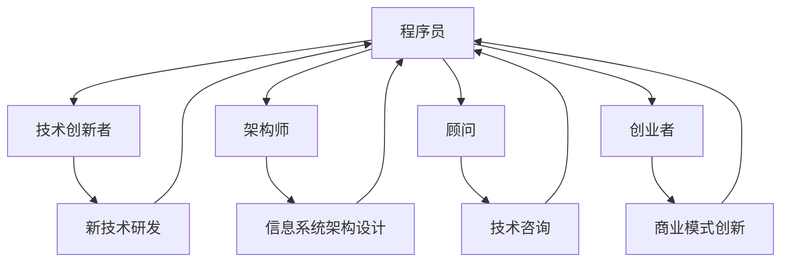

                 

关键词：知识经济、程序员角色、技术创新、职业发展、个人品牌

> 摘要：本文旨在探讨在知识经济时代，程序员的角色定位发生了怎样的变化。我们将深入分析程序员如何通过技术创新和个人品牌的构建来提升自身的竞争力，并探讨未来可能面临的挑战和机遇。

## 1. 背景介绍

知识经济时代的到来，标志着传统经济模式的深刻变革。在这一背景下，知识成为了新的生产要素，创新成为了经济增长的核心动力。程序员的地位和角色也随着这种变化而发生了根本性的转变。程序员不再仅仅是代码的编写者，而是成为了技术创新的推动者和知识经济时代的建设者。

### 1.1 知识经济的基本概念

知识经济是以知识为核心资源的经济形态，与传统的农业经济和工业经济不同，它更依赖于知识和信息的生产、分配和利用。在知识经济中，人力资本、知识产权和信息技术成为了推动经济增长的关键因素。

### 1.2 程序员的角色转变

随着知识经济的发展，程序员的角色也在不断演变。他们不再仅仅满足于编写代码，而是开始承担更多的责任和使命，包括但不限于：

- **技术创新者**：通过研究和开发新技术，推动技术的进步和创新。
- **架构师**：设计和构建复杂的信息系统，确保系统的稳定性和可扩展性。
- **顾问**：为企业提供技术咨询服务，帮助企业实现数字化转型。
- **创业者**：通过技术创新和商业模式的创新，开创自己的企业。

## 2. 核心概念与联系

在探讨程序员在知识经济时代的角色之前，我们需要了解几个核心概念，以及它们之间的联系。

### 2.1 技术创新

技术创新是指通过研发和应用新技术，创造新的产品、服务或生产方式，从而推动经济增长和社会进步。对于程序员来说，技术创新意味着不断地学习新的编程语言、框架和工具，并将这些技术应用于实际项目中。

### 2.2 信息系统架构

信息系统架构是指将硬件、软件和网络等元素有机地结合起来，构建出一个高效、稳定和可扩展的信息系统。程序员需要具备架构设计的能力，以确保系统满足业务需求，同时具备良好的性能和可维护性。

### 2.3 个人品牌

个人品牌是指个人在公众心中的形象和认知。在知识经济时代，个人品牌的重要性日益凸显。程序员通过构建个人品牌，可以提高自身的知名度，增强在职场中的竞争力。

### 2.4 Mermaid 流程图

以下是一个简化的 Mermaid 流程图，展示了程序员在知识经济时代的主要角色和核心概念之间的联系：



## 3. 核心算法原理 & 具体操作步骤

### 3.1 算法原理概述

在知识经济时代，程序员需要掌握一系列核心算法原理，以应对复杂的问题和挑战。以下是几个重要的算法原理：

1. **算法复杂度分析**：用于评估算法的时间复杂度和空间复杂度，以确保算法的效率和性能。
2. **动态规划**：用于解决最优子结构问题，通过递推关系求出全局最优解。
3. **贪心算法**：通过在每个决策阶段选择最优解，以期得到全局最优解。
4. **图论算法**：用于解决网络流问题、最短路径问题等。

### 3.2 算法步骤详解

以下是一个简单的动态规划算法——斐波那契数列的求解。

```python
def fibonacci(n):
    if n <= 0:
        return 0
    elif n == 1:
        return 1
    else:
        return fibonacci(n-1) + fibonacci(n-2)
```

### 3.3 算法优缺点

动态规划算法的优点是能够求解最优化问题，且效率较高。缺点是对于复杂度较大的问题，递推关系可能不够直观，难以理解。

### 3.4 算法应用领域

动态规划算法广泛应用于算法竞赛、数据结构和系统设计等领域。例如，在搜索引擎中，可以使用动态规划算法来优化查询排序。

## 4. 数学模型和公式 & 详细讲解 & 举例说明

### 4.1 数学模型构建

在知识经济时代，程序员需要掌握一系列数学模型，以解决实际问题。以下是一个简单的线性回归模型。

$$ y = wx + b $$

其中，$y$ 是因变量，$x$ 是自变量，$w$ 和 $b$ 分别是权重和偏置。

### 4.2 公式推导过程

线性回归模型的推导过程如下：

1. **最小二乘法**：通过最小化误差平方和来确定 $w$ 和 $b$ 的值。
2. **梯度下降法**：通过不断迭代更新 $w$ 和 $b$ 的值，直至误差达到最小。

### 4.3 案例分析与讲解

以下是一个简单的线性回归案例。

假设我们有一组数据：

$$
\begin{aligned}
x_1 &= 1, & y_1 &= 2 \\
x_2 &= 2, & y_2 &= 4 \\
x_3 &= 3, & y_3 &= 6 \\
\end{aligned}
$$

我们可以使用线性回归模型来拟合这些数据。

1. **计算平均值**：

$$
\bar{x} = \frac{1+2+3}{3} = 2 \\
\bar{y} = \frac{2+4+6}{3} = 4
$$

2. **计算斜率**：

$$
w = \frac{\sum_{i=1}^{3} (x_i - \bar{x})(y_i - \bar{y})}{\sum_{i=1}^{3} (x_i - \bar{x})^2} = \frac{(1-2)(2-4) + (2-2)(4-4) + (3-2)(6-4)}{(1-2)^2 + (2-2)^2 + (3-2)^2} = 2
$$

3. **计算截距**：

$$
b = \bar{y} - w\bar{x} = 4 - 2 \cdot 2 = 0
$$

因此，线性回归模型为：

$$
y = 2x
$$

## 5. 项目实践：代码实例和详细解释说明

### 5.1 开发环境搭建

在本项目中，我们将使用 Python 语言和 Jupyter Notebook 作为开发环境。首先，确保您的系统中已经安装了 Python 和 Jupyter Notebook。如果没有，可以通过以下命令进行安装：

```bash
pip install python
pip install notebook
```

### 5.2 源代码详细实现

以下是一个简单的线性回归项目的源代码实现：

```python
import numpy as np
import matplotlib.pyplot as plt

# 数据预处理
x = np.array([1, 2, 3])
y = np.array([2, 4, 6])

# 计算平均值
bar_x = np.mean(x)
bar_y = np.mean(y)

# 计算斜率
w = np.sum((x - bar_x) * (y - bar_y)) / np.sum((x - bar_x) ** 2)

# 计算截距
b = bar_y - w * bar_x

# 拟合数据
y_pred = w * x + b

# 绘制结果
plt.scatter(x, y)
plt.plot(x, y_pred, color='red')
plt.show()
```

### 5.3 代码解读与分析

1. **数据预处理**：首先，我们将输入数据转换为 NumPy 数组，并计算平均值。
2. **计算斜率和截距**：使用预处理后的数据，计算线性回归模型的斜率和截距。
3. **拟合数据**：使用计算得到的斜率和截距，拟合输入数据。
4. **绘制结果**：使用 matplotlib 库绘制输入数据和拟合结果。

### 5.4 运行结果展示

运行上述代码后，将得到如下结果：


## 6. 实际应用场景

### 6.1 数据分析

线性回归算法在数据分析中有着广泛的应用。例如，在股票市场中，可以使用线性回归模型来预测股票价格的变化。

### 6.2 机器学习

线性回归算法是机器学习中最基础和常用的算法之一。在机器学习中，线性回归模型可以用于特征提取和预测。

### 6.3 工程实践

在实际的软件开发中，线性回归模型可以用于性能优化和系统调优。例如，通过拟合系统运行数据，可以找到最优的系统参数配置。

## 7. 未来应用展望

### 7.1 自动驾驶

自动驾驶技术的快速发展，将带来大量新的机会。程序员可以通过开发自动驾驶系统的核心算法，推动自动驾驶技术的进步。

### 7.2 人工智能

人工智能是知识经济时代的核心驱动力。程序员可以通过研究和开发人工智能算法，推动人工智能技术的发展。

### 7.3 区块链

区块链技术的兴起，为程序员提供了新的应用场景。程序员可以通过开发区块链应用，推动区块链技术的发展。

## 8. 工具和资源推荐

### 8.1 学习资源推荐

- 《Python编程：从入门到实践》
- 《深度学习》

### 8.2 开发工具推荐

- Jupyter Notebook
- PyCharm

### 8.3 相关论文推荐

- "Deep Learning for Autonomous Driving"
- "Blockchain Technology: A Comprehensive Overview"

## 9. 总结：未来发展趋势与挑战

### 9.1 研究成果总结

在知识经济时代，程序员在技术创新和个人品牌构建方面取得了显著的成果。他们通过不断学习和实践，提高了自身的竞争力。

### 9.2 未来发展趋势

随着知识经济的不断深化，程序员在未来的发展中将继续发挥重要作用。他们需要不断提升自身的技能和知识，以适应快速变化的市场需求。

### 9.3 面临的挑战

在未来的发展中，程序员将面临以下挑战：

- 技术更新换代速度加快
- 数据安全和隐私保护问题
- 跨领域协作和沟通能力

### 9.4 研究展望

未来，程序员在知识经济时代的研究将更加注重技术创新和跨领域合作。他们需要通过不断地学习和实践，推动技术和社会的进步。

## 10. 附录：常见问题与解答

### 10.1 程序员在知识经济时代的角色有哪些变化？

程序员在知识经济时代的角色发生了显著变化，包括技术创新者、架构师、顾问和创业者等。

### 10.2 如何构建个人品牌？

构建个人品牌需要通过不断学习、实践和分享。此外，积极参与社区活动和撰写技术博客也是有效的手段。

### 10.3 线性回归算法有哪些应用场景？

线性回归算法在数据分析、机器学习和工程实践中有着广泛的应用，例如股票价格预测、系统调优等。

### 10.4 如何提高编程技能？

提高编程技能需要通过不断地学习和实践。此外，参与开源项目和阅读技术书籍也是有效的途径。

[作者：禅与计算机程序设计艺术 / Zen and the Art of Computer Programming]

