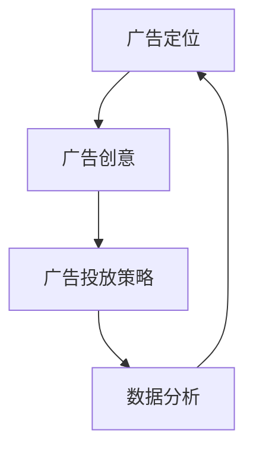

                 

  
## 1. 背景介绍

随着互联网的快速发展，社交媒体平台已经成为人们日常生活的重要组成部分。Facebook作为全球最大的社交网络平台，拥有超过20亿的活跃用户，它为广告主提供了丰富的广告投放渠道和精准的用户定位功能。对程序员而言，掌握Facebook广告投放技术不仅可以为自己的项目带来流量，还可以通过知识产品的形式，创造额外的收入来源。

Facebook广告投放系统是一个复杂且功能强大的平台，它支持多种广告类型，包括图片广告、视频广告、轮播广告等。此外，Facebook还提供了丰富的广告定位选项，如地理位置、年龄、性别、兴趣等，使得广告能够精准地触达到目标用户。对于程序员，这意味着可以利用这些功能，设计和投放有效的广告，从而提升项目的知名度。

在知识经济时代，知识产品成为许多程序员变现的重要途径。无论是编写技术博客、录制教学视频，还是撰写技术书籍，都可以转化为知识产品。然而，如何有效地推广这些知识产品，让更多的潜在客户发现并购买，是程序员面临的一个挑战。Facebook广告投放技术为程序员提供了一种新的解决方案。

本文将深入探讨程序员如何利用Facebook广告投放知识产品。我们将从广告定位、广告创意、广告投放策略、数据分析等方面，全面解析Facebook广告投放技术，帮助程序员更好地推广自己的知识产品。

## 2. 核心概念与联系

在深入探讨Facebook广告投放技术之前，我们需要了解一些核心概念，以及它们之间的联系。

### 2.1 广告定位

广告定位是Facebook广告投放中至关重要的一环。通过广告定位，程序员可以精确地确定目标受众，确保广告能够触达到最感兴趣的用户。广告定位主要包括以下几种方式：

- **地理位置定位**：可以根据用户所在的地理位置，将广告投放至特定城市、州或国家。

- **人口统计定位**：可以根据用户的年龄、性别、学历、婚姻状况等信息进行定位。

- **兴趣定位**：根据用户的兴趣标签、浏览历史、点赞内容等，将广告投放到有特定兴趣的用户群体。

- **行为定位**：可以根据用户的行为特征，如购买意图、活动参与度等，进行精准定位。

### 2.2 广告创意

广告创意是吸引用户点击广告的关键。一个优秀的广告创意需要具备以下特点：

- **视觉吸引力**：使用高质量的图片或视频，确保广告能够在众多信息流中脱颖而出。

- **信息简洁明了**：广告内容需要简洁明了，快速传达产品的核心价值。

- **互动性**：通过问题、互动游戏等方式，提高用户的参与度。

### 2.3 广告投放策略

广告投放策略决定了广告的投放时间和频率，以及预算分配。有效的广告投放策略需要综合考虑以下因素：

- **投放时间**：根据用户活跃时间段，选择最佳的广告投放时间。

- **投放频率**：避免过度投放，导致用户疲劳，影响广告效果。

- **预算分配**：合理分配预算，确保广告能够覆盖到目标受众。

### 2.4 数据分析

数据分析是优化广告投放效果的关键。通过数据分析，程序员可以了解广告的表现情况，包括点击率、转化率、成本等指标。根据数据分析结果，可以调整广告定位、创意和投放策略，以实现更好的广告效果。

### 2.5 Mermaid 流程图

以下是一个简化的Facebook广告投放流程图，展示了核心概念之间的联系：



通过上述核心概念和联系的了解，程序员可以更好地掌握Facebook广告投放技术，为自己的知识产品打造高效的推广策略。

## 3. 核心算法原理 & 具体操作步骤

### 3.1 算法原理概述

Facebook广告投放的核心算法原理主要基于机器学习和数据挖掘技术。以下是几个关键的算法原理：

- **用户画像构建**：通过分析用户的兴趣、行为、地理位置等信息，构建用户的详细画像。这有助于精准定位广告目标群体。

- **广告投放优化**：使用算法对广告投放效果进行实时监控和优化。例如，通过A/B测试，比较不同广告创意的效果，选择最优的投放策略。

- **受众扩展**：通过机器学习算法，分析广告效果最佳的用户特征，并将广告扩展到相似的用户群体。

### 3.2 算法步骤详解

#### 步骤1：用户画像构建

1. **数据收集**：从Facebook的用户数据库中收集用户的基本信息、兴趣、行为等数据。
2. **数据清洗**：去除重复数据和噪声数据，确保数据的准确性和完整性。
3. **特征提取**：从原始数据中提取有助于广告定位的特征，如地理位置、兴趣标签、购买行为等。

#### 步骤2：广告投放优化

1. **A/B测试**：设计两个或多个版本的广告，在不同用户群体中投放，比较效果。
2. **效果评估**：根据广告的点击率、转化率等指标，评估广告效果。
3. **策略调整**：根据效果评估结果，调整广告定位、创意和投放策略。

#### 步骤3：受众扩展

1. **相似用户识别**：通过机器学习算法，识别与广告效果最佳用户特征相似的用户群体。
2. **广告扩展**：将广告投放到识别出的相似用户群体。

### 3.3 算法优缺点

#### 优点：

- **精准定位**：通过用户画像和机器学习算法，能够实现广告的精准投放，提高广告效果。
- **实时优化**：广告投放过程中，可以实时监控和优化，确保广告始终处于最佳状态。
- **受众扩展**：通过相似用户识别，能够扩大广告的覆盖范围，提高广告的投放效率。

#### 缺点：

- **数据隐私问题**：广告投放过程中涉及大量用户数据，可能引发数据隐私问题。
- **算法依赖**：广告投放效果高度依赖算法，算法的准确性和稳定性直接影响广告效果。

### 3.4 算法应用领域

- **电子商务**：通过精准定位，提高产品销售转化率。
- **在线教育**：通过受众扩展，扩大课程影响力，提高报名率。
- **内容营销**：通过广告投放，提高博客、视频等内容的曝光度，增加用户粘性。

## 4. 数学模型和公式 & 详细讲解 & 举例说明

### 4.1 数学模型构建

在Facebook广告投放中，常用的数学模型包括用户画像模型、广告投放模型和效果评估模型。

#### 用户画像模型

用户画像模型可以表示为：

\[ X = \{ x_1, x_2, ..., x_n \} \]

其中，\( x_i \) 表示第 \( i \) 个特征，如地理位置、兴趣标签等。

#### 广告投放模型

广告投放模型可以表示为：

\[ y = f(X, \theta) \]

其中，\( \theta \) 表示广告投放参数，如广告定位、投放时间等。

#### 效果评估模型

效果评估模型可以表示为：

\[ E = g(Y, \lambda) \]

其中，\( \lambda \) 表示效果评估参数，如点击率、转化率等。

### 4.2 公式推导过程

#### 用户画像模型推导

用户画像模型可以通过数据挖掘技术，如聚类分析、关联规则挖掘等，从大量用户数据中提取有效特征。假设我们使用聚类分析算法，得到 \( k \) 个用户群体，每个群体的特征表示为：

\[ X_k = \{ x_{k1}, x_{k2}, ..., x_{kn} \} \]

则用户画像模型可以表示为：

\[ X = \{ X_1, X_2, ..., X_k \} \]

#### 广告投放模型推导

广告投放模型可以通过机器学习算法，如逻辑回归、决策树等，建立用户行为与广告投放效果之间的关系。假设我们使用逻辑回归模型，得到广告投放公式：

\[ P(Y=1|X) = \frac{1}{1 + e^{-(\beta_0 + \beta_1x_1 + \beta_2x_2 + ... + \beta_nx_n)}} \]

其中，\( \beta_i \) 表示特征 \( x_i \) 的权重。

#### 效果评估模型推导

效果评估模型可以通过统计学方法，如回归分析、时间序列分析等，建立广告投放效果与用户行为之间的关系。假设我们使用线性回归模型，得到效果评估公式：

\[ E = \alpha + \beta_1Y + \beta_2X + ... + \beta_nX_n \]

其中，\( \alpha \) 表示常数项，\( \beta_i \) 表示特征 \( x_i \) 的权重。

### 4.3 案例分析与讲解

假设一个程序员希望通过Facebook广告投放推广自己的编程课程。以下是具体的案例分析：

#### 用户画像构建

通过对学员的数据进行分析，提取出以下特征：

- 地理位置：城市、国家
- 年龄：18-35岁
- 性别：男、女
- 兴趣标签：编程、技术、编程语言

#### 广告投放模型

假设使用逻辑回归模型，建立广告投放公式：

\[ P(点击广告|用户画像) = \frac{1}{1 + e^{-(\beta_0 + \beta_1x_1 + \beta_2x_2 + ... + \beta_nx_n)}} \]

其中，\( \beta_i \) 表示特征 \( x_i \) 的权重。

#### 效果评估模型

假设使用线性回归模型，建立广告投放效果与用户行为之间的关系：

\[ E(课程报名率|用户画像) = \alpha + \beta_1P(点击广告) + \beta_2X_1 + ... + \beta_nX_n \]

其中，\( \alpha \) 表示常数项，\( \beta_i \) 表示特征 \( x_i \) 的权重。

#### 数据分析

通过对广告投放效果的数据分析，发现以下结论：

- 年龄在25-30岁的男性用户，点击广告的概率最高。
- 兴趣标签为“编程”和“技术”的用户，课程报名率较高。
- 在晚上8点到10点投放广告，效果最佳。

根据这些结论，程序员可以调整广告定位、创意和投放策略，以提高广告效果。

## 5. 项目实践：代码实例和详细解释说明

### 5.1 开发环境搭建

为了实践Facebook广告投放技术，我们需要搭建一个开发环境。以下是一个基本的开发环境搭建步骤：

1. **安装Python**：确保安装了最新版本的Python，以便使用相关的库和工具。
2. **安装Facebook开发者工具**：在Facebook官网注册开发者账户，下载并安装Facebook开发者工具。
3. **安装相关库**：使用pip命令安装以下库：

   ```bash
   pip install facebook-sdk
   pip install pandas
   pip install numpy
   pip install matplotlib
   ```

### 5.2 源代码详细实现

以下是一个简单的Facebook广告投放Python代码实例，用于构建用户画像、投放广告和评估效果。

```python
# 导入所需库
import facebook
import pandas as pd
import numpy as np
import matplotlib.pyplot as plt

# 设置Facebook开发者凭据
access_token = '你的Facebook开发者访问令牌'
app_id = '你的Facebook应用程序ID'
app_secret = '你的Facebook应用程序密钥'

# 初始化Facebook SDK
graph = facebook.GraphAPI(access_token=access_token)

# 构建用户画像
def build_user_profile(data):
    user_profile = {
        'location': data['location'],
        'age': data['age'],
        'gender': data['gender'],
        'interests': data['interests']
    }
    return user_profile

# 投放广告
def run_ad_campaign(profiles):
    ads = []
    for profile in profiles:
        ad = graph.put_object(
            parent_object='your_ad_account_id',
            connection_name='ads',
            message=f'Hello, {profile["name"]}! Check out our programming course!',
            ad_object={
                'status': 'PAUSED',
                'name': 'Programming Course Ad',
                'category': 'Education',
                'objective': 'CONVERSIONS',
                'price': 'CPA',
                'bid_amount': 1,
                'placement': 'FEED',
                'targeting': {
                    'age_min': profile['age_min'],
                    'age_max': profile['age_max'],
                    'gender': profile['gender'],
                    'geo_locations': {'locations': [{'id': profile['location_id']}]},
                    'interests': profile['interests']
                }
            }
        )
        ads.append(ad)
    return ads

# 评估广告效果
def evaluate_ad_performance(ads):
    performance_data = []
    for ad in ads:
        stats = graph.get_object(f'{ad["id"]}/insights', fields='impressions, clicks, conversions')
        performance_data.append({
            'ad_id': ad['id'],
            'impressions': stats['impressions'],
            'clicks': stats['clicks'],
            'conversions': stats['conversions']
        })
    return pd.DataFrame(performance_data)

# 读取用户数据
users = pd.read_csv('users.csv')

# 构建用户画像
user_profiles = users.apply(build_user_profile, axis=1)

# 投放广告
ads = run_ad_campaign(user_profiles)

# 评估广告效果
performance_data = evaluate_ad_performance(ads)

# 可视化广告效果
performance_data.plot(x='ad_id', y=['impressions', 'clicks', 'conversions'])
plt.xlabel('Ad ID')
plt.ylabel('Performance')
plt.title('Ad Performance')
plt.show()
```

### 5.3 代码解读与分析

上述代码实现了以下功能：

1. **设置Facebook开发者凭据**：使用Facebook开发者访问令牌、应用程序ID和应用程序密钥。
2. **构建用户画像**：从CSV文件中读取用户数据，并根据数据构建用户画像。
3. **投放广告**：根据用户画像，创建广告并投放到Facebook平台上。
4. **评估广告效果**：收集广告的浏览量、点击量和转化量，并使用可视化工具展示广告效果。

代码中使用了Facebook SDK，方便与Facebook API进行交互。通过读取用户数据、构建用户画像和投放广告，程序员可以实现对Facebook广告投放的全流程操作。同时，通过评估广告效果，程序员可以不断优化广告策略，提高广告效果。

### 5.4 运行结果展示

运行上述代码后，会生成一个包含广告效果的条形图，展示每个广告的浏览量、点击量和转化量。根据这些数据，程序员可以分析广告效果，调整广告定位、创意和投放策略，以实现更好的广告效果。

## 6. 实际应用场景

Facebook广告投放技术在程序员推广知识产品方面具有广泛的应用。以下是一些实际应用场景：

### 6.1 技术博客推广

程序员可以通过Facebook广告投放，将技术博客推广给具有相似兴趣的读者。例如，针对某一篇关于深度学习的博客，可以将广告定位到对深度学习感兴趣的用户群体，从而提高博客的访问量和影响力。

### 6.2 在线课程推广

程序员可以创建在线课程，并通过Facebook广告投放，吸引潜在学员。例如，针对一门Python编程课程，可以定位到对编程、技术等感兴趣的用户，通过广告展示课程内容和优惠信息，从而提高课程报名率。

### 6.3 技术书籍推广

程序员可以通过Facebook广告投放，推广自己的技术书籍。例如，在书籍出版后，针对书籍内容创建广告，将广告定位到对相关技术感兴趣的用户，通过广告展示书籍内容和读者评价，从而提高书籍销量。

### 6.4 社群运营

程序员可以利用Facebook广告投放，吸引对技术话题感兴趣的用户加入自己的社群。例如，创建一个技术交流群组，并通过广告吸引对社群主题感兴趣的用户加入，从而建立一个活跃的社群，促进知识传播和互动。

### 6.5 项目宣传

程序员可以为自己的开源项目或技术产品创建广告，通过Facebook广告投放，吸引潜在用户和开发者。例如，针对一款开源的Python库，可以定位到对Python感兴趣的用户，通过广告展示库的功能和优势，从而提高库的下载量和使用率。

## 7. 工具和资源推荐

### 7.1 学习资源推荐

- **Facebook广告投放官方文档**：[https://www.facebook.com/business/help/710579363824533](https://www.facebook.com/business/help/710579363824533)
- **Facebook开发者论坛**：[https://developers.facebook.com/community/](https://developers.facebook.com/community/)
- **Facebook广告投放教程**：[https://www.marketing-school.org/facebook-ads/](https://www.marketing-school.org/facebook-ads/)

### 7.2 开发工具推荐

- **Facebook开发者工具**：[https://developers.facebook.com/tools](https://developers.facebook.com/tools)
- **Postman**：[https://www.postman.com/](https://www.postman.com/)
- **Graph API Explorer**：[https://developers.facebook.com/tools/explorer](https://developers.facebook.com/tools/explorer)

### 7.3 相关论文推荐

- **Facebook广告投放算法研究**：[https://arxiv.org/abs/1811.00651](https://arxiv.org/abs/1811.00651)
- **基于机器学习的Facebook广告效果评估**：[https://ieeexplore.ieee.org/document/8137353](https://ieeexplore.ieee.org/document/8137353)
- **社交网络广告投放策略研究**：[https://ieeexplore.ieee.org/document/7904473](https://ieeexplore.ieee.org/document/7904473)

## 8. 总结：未来发展趋势与挑战

Facebook广告投放技术在程序员推广知识产品方面具有巨大的潜力。随着社交媒体的普及和用户数据的积累，广告投放算法和策略将不断优化，为程序员提供更精准、高效的推广工具。未来，Facebook广告投放技术将在以下几个方面发展：

### 8.1 精准定位

随着数据挖掘和机器学习技术的进步，广告定位将更加精准。程序员可以通过更细致的用户画像和兴趣标签，将广告投放到潜在客户，提高广告效果。

### 8.2 数据隐私保护

随着数据隐私保护意识的提高，Facebook将加强对用户数据的保护。这要求程序员在广告投放过程中，遵守相关法规，确保用户数据的合法性和安全性。

### 8.3 跨平台整合

未来，Facebook广告投放技术将与其他社交媒体平台整合，为程序员提供更全面的广告投放解决方案。程序员可以利用这一趋势，实现多平台广告投放，提高推广效果。

### 8.4 智能化广告投放

随着人工智能技术的发展，广告投放将变得更加智能化。程序员可以利用人工智能算法，实现自动广告投放和优化，提高广告效果。

然而，Facebook广告投放技术也面临着一些挑战：

### 8.5 竞争加剧

随着越来越多的程序员和商家加入Facebook广告投放，竞争将日益激烈。程序员需要不断创新和优化广告策略，才能在竞争中脱颖而出。

### 8.6 广告费用上涨

随着广告投放需求的增加，Facebook广告费用可能会上涨。程序员需要合理规划广告预算，确保广告投放效果最大化。

### 8.7 法规监管

随着数据隐私保护法规的不断完善，Facebook广告投放技术可能面临更多的监管和限制。程序员需要密切关注相关法规，确保广告投放合规。

总之，Facebook广告投放技术为程序员推广知识产品提供了新的机遇和挑战。通过不断优化广告策略和技术，程序员可以更好地利用Facebook广告投放，实现知识产品的变现。

## 9. 附录：常见问题与解答

### 9.1 Facebook广告投放常见问题

**Q1：如何设置Facebook广告定位？**

A1：在Facebook广告投放中，可以通过以下方式设置广告定位：

- 地理位置定位：选择广告投放的国家、地区或城市。
- 人口统计定位：根据用户的年龄、性别、学历、婚姻状况等人口统计数据设置广告定位。
- 兴趣定位：根据用户的兴趣标签、浏览历史、点赞内容等设置广告定位。
- 行为定位：根据用户的行为特征，如购买意图、活动参与度等设置广告定位。

**Q2：如何评估Facebook广告效果？**

A2：可以通过以下指标评估Facebook广告效果：

- 点击率（CTR）：广告被点击的次数与展示次数的比值，用于评估广告的吸引力。
- 转化率（CVR）：广告带来的转化次数与点击次数的比值，用于评估广告的变现能力。
- 成本效益比（ROAS）：广告带来的收益与广告支出的比值，用于评估广告的经济效益。

**Q3：如何优化Facebook广告投放效果？**

A3：可以通过以下方法优化Facebook广告投放效果：

- 调整广告定位：根据广告效果，调整广告定位，确保广告投放到最感兴趣的用户群体。
- 优化广告创意：通过A/B测试，选择最优的广告创意。
- 调整广告投放策略：根据广告效果，调整广告的投放时间和频率，以及预算分配。

### 9.2 投放广告常见问题

**Q4：如何设置Facebook广告预算？**

A4：在Facebook广告投放中，可以设置以下广告预算：

- 日均预算：每天投放的广告预算。
- 总预算：广告活动总投放的预算。
- 预算分配：为不同广告组或广告设定不同的预算分配比例。

**Q5：如何设置Facebook广告投放时间？**

A5：在Facebook广告投放中，可以设置以下广告投放时间：

- 投放时间段：设置广告每天的投放时间段，如8点到18点。
- 投放频率：设置广告在一天内的投放频率，如每小时一次。

### 9.3 数据分析常见问题

**Q6：如何分析Facebook广告数据？**

A6：可以通过以下步骤分析Facebook广告数据：

- 导出广告数据：使用Facebook广告管理器或API，导出广告的详细数据。
- 数据清洗和预处理：对导出的数据进行清洗和预处理，如去除重复数据、缺失值填充等。
- 数据可视化：使用数据可视化工具，如matplotlib、seaborn等，对广告数据进行可视化分析。
- 数据分析：根据可视化结果，分析广告效果，如点击率、转化率、成本效益比等。

**Q7：如何利用数据分析优化广告投放？**

A7：可以通过以下方法利用数据分析优化广告投放：

- 分析广告效果：根据广告数据，分析广告的点击率、转化率和成本效益比，了解广告的整体效果。
- 调整广告定位：根据分析结果，调整广告定位，确保广告投放到最感兴趣的用户群体。
- 优化广告创意：根据分析结果，优化广告创意，提高广告的吸引力和点击率。
- 调整广告投放策略：根据分析结果，调整广告的投放时间和频率，以及预算分配，提高广告效果。

### 9.4 广告创意常见问题

**Q8：如何制作高质量的Facebook广告？**

A8：制作高质量Facebook广告的要点包括：

- 设计吸引人的图片或视频：确保广告内容视觉吸引力，提高用户点击率。
- 简洁明了的广告文案：用简短的文案传达广告的核心信息，提高用户的理解和兴趣。
- 引导用户行动：通过号召性用语和按钮，引导用户点击广告或完成特定行动。
- 与用户兴趣相关：根据用户兴趣和需求，设计相关且有价值的内容，提高广告的吸引力。

**Q9：如何进行A/B测试优化广告创意？**

A9：进行A/B测试优化广告创意的方法包括：

- 设计两个或多个版本的广告：根据不同的创意元素，如图片、文案、按钮等，设计两个或多个版本的广告。
- 投放广告：将不同版本的广告投放到不同的用户群体，确保每个用户只能看到其中一个版本的广告。
- 收集数据：收集广告的点击率、转化率等数据，比较不同版本广告的效果。
- 分析结果：根据数据分析结果，选择效果最佳的广告版本，进行推广。

## 作者署名

作者：禅与计算机程序设计艺术 / Zen and the Art of Computer Programming

