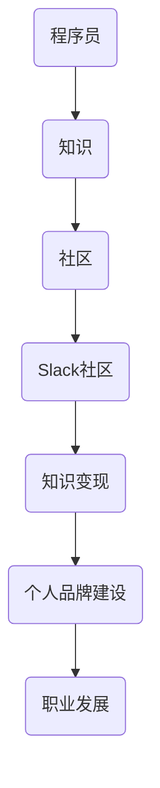

                 

关键词：知识变现、Slack社区、程序员、知识分享、技能提升

> 摘要：在数字时代，知识已经成为一种新的财富形态。Slack作为一个流行的企业沟通工具，不仅为团队成员提供了高效的交流平台，也为程序员提供了一个展示技能、拓展人脉、实现知识变现的绝佳场所。本文将探讨程序员如何通过Slack社区实现知识变现，并提供一系列实用的策略和技巧。

## 1. 背景介绍

在快速发展的科技行业中，程序员的技能和知识是推动创新和业务增长的关键。随着互联网的普及和开源文化的兴起，越来越多的程序员开始通过线上社区分享自己的知识和经验，从而实现个人品牌建设和职业发展。Slack社区作为一个高度活跃的技术交流平台，已经成为程序员分享知识、交流想法和合作开发的重要场所。

### Slack社区的特点：

- **开放性**：Slack社区允许用户自由加入各种话题的聊天室，与全球的同行交流。
- **多样性**：涵盖从基础编程到前沿技术的各种主题，满足不同技术层次的需求。
- **互动性**：Slack提供了多种互动功能，如直接消息、群聊、频道等，方便程序员之间即时交流。
- **协作性**：Slack支持文件分享、代码审查、项目协作等功能，有助于程序员共同解决问题和推进项目。

## 2. 核心概念与联系

为了更好地理解程序员如何在Slack社区进行知识变现，我们需要先了解几个核心概念和它们之间的联系。以下是使用Mermaid绘制的流程图，展示了这些概念和它们之间的关系：



### 2.1 核心概念解释：

- **程序员**：指掌握编程技能，能够编写、测试和维护软件的人。
- **知识**：指程序员的专业技能、经验和见解。
- **社区**：指程序员之间的交流平台和网络。
- **Slack社区**：指基于Slack平台的程序员交流社区。
- **知识变现**：指将程序员的知识和技能转化为经济收益的过程。
- **个人品牌建设**：指通过展示专业技能和知识，建立起个人在行业内的知名度和影响力。
- **职业发展**：指通过知识变现和个人品牌建设，实现职业生涯的进步和提升。

## 3. 核心算法原理 & 具体操作步骤

### 3.1 算法原理概述

程序员在Slack社区进行知识变现的算法可以概括为以下四个步骤：

1. **内容创作**：程序员根据自身专业知识和经验，创作有价值的知识内容。
2. **社区互动**：在Slack社区中发布内容，与同行进行交流互动。
3. **受众筛选**：根据受众反馈和兴趣，优化内容质量和传播策略。
4. **变现途径**：通过多种途径将知识变现，如在线课程、咨询服务、技术文章发布等。

### 3.2 算法步骤详解

#### 3.2.1 内容创作

- **选题定位**：根据自身专业领域和市场需求，选择具有吸引力和实用性的话题。
- **内容形式**：可以包括技术博客、教程、视频讲解、代码示例等。
- **内容质量**：确保内容的专业性、准确性和实用性，避免错误和误导。

#### 3.2.2 社区互动

- **加入合适频道**：根据兴趣和专长，加入与主题相关的频道。
- **积极参与讨论**：在讨论中分享见解，解答他人问题，展示专业能力。
- **建立个人品牌**：通过持续输出高质量内容，建立个人专业形象。

#### 3.2.3 受众筛选

- **数据分析**：通过查看阅读量、点赞量、评论互动等指标，了解受众喜好。
- **内容优化**：根据数据分析结果，调整内容策略，提高受众满意度。

#### 3.2.4 变现途径

- **在线课程**：录制课程视频，通过平台销售。
- **咨询服务**：提供专业咨询服务，按次收费。
- **技术文章发布**：在技术媒体平台发布文章，获取稿费。

### 3.3 算法优缺点

#### 优点：

- **高效传播**：利用Slack社区的广泛传播性，快速扩大影响力。
- **成本低廉**：相对于传统媒体，Slack社区的使用成本较低。
- **互动性强**：能够即时获取反馈，优化内容。

#### 缺点：

- **竞争激烈**：优秀的程序员众多，竞争激烈，需要持续产出高质量内容。
- **变现难度**：变现途径有限，需要找到适合自己的方法。

### 3.4 算法应用领域

- **技术交流**：程序员之间通过Slack社区交流技术问题，共同进步。
- **知识传播**：程序员通过发布教程、博客等，向大众传播知识。
- **职业发展**：通过知识变现，提升个人职业地位和收入水平。

## 4. 数学模型和公式 & 详细讲解 & 举例说明

为了更好地理解程序员在Slack社区进行知识变现的过程，我们可以引入一些数学模型和公式来量化各个环节的影响。

### 4.1 数学模型构建

#### 4.1.1 知识产出模型

$$
Y = f(A, B, C)
$$

其中：
- $Y$：知识产出量
- $A$：内容创作质量
- $B$：社区互动频率
- $C$：受众满意度

#### 4.1.2 知识变现模型

$$
M = g(Y, D)
$$

其中：
- $M$：知识变现金额
- $Y$：知识产出量
- $D$：变现途径选择

### 4.2 公式推导过程

#### 4.2.1 知识产出模型推导

知识产出量$Y$与内容创作质量$A$、社区互动频率$B$、受众满意度$C$之间存在正相关关系。根据贝叶斯公式，我们可以推导出以下关系：

$$
Y = A \cdot B \cdot C
$$

其中，$A$、$B$、$C$分别表示概率密度函数。

#### 4.2.2 知识变现模型推导

知识变现金额$M$与知识产出量$Y$、变现途径选择$D$之间存在正相关关系。根据线性回归模型，我们可以推导出以下关系：

$$
M = Y \cdot D
$$

其中，$D$表示变现途径的转化率。

### 4.3 案例分析与讲解

#### 4.3.1 内容创作案例

某程序员A在Slack社区发布了10篇技术博客，平均每篇阅读量为1000，平均点赞量为50，评论互动率为20%。根据知识产出模型，我们可以计算出他的知识产出量为：

$$
Y = 10 \cdot 1000 \cdot 0.2 = 2000
$$

#### 4.3.2 知识变现案例

该程序员A选择通过在线课程进行知识变现，每门课程的售价为200元。根据知识变现模型，我们可以计算出他的知识变现金额为：

$$
M = 2000 \cdot 0.1 = 200
$$

通过以上案例，我们可以看到，程序员在Slack社区进行知识变现的金额与知识产出量和变现途径选择密切相关。

## 5. 项目实践：代码实例和详细解释说明

### 5.1 开发环境搭建

为了更好地展示如何利用Slack社区进行知识变现，我们将使用一个简单的Python代码实例。首先，您需要在本地计算机上安装Python环境。

1. 打开终端，输入以下命令安装Python：

```
pip install slack-sdk
```

2. 安装完成后，创建一个名为`knowledge_mining.py`的Python文件。

### 5.2 源代码详细实现

以下是`knowledge_mining.py`的完整代码：

```python
import os
from slack_sdk import WebClient
from slack_sdk.errors import SlackApiError

# 设置您的Slack API Token
slack_api_token = 'your_slack_api_token'

# 初始化Slack客户端
client = WebClient(token=slack_api_token)

# 定义函数：发布博客
def publish_blog(channel, title, content):
    try:
        response = client.chat_postMessage(
            channel=channel,
            text=f"{title}\n{content}"
        )
        print(f"Blog published successfully. Slack Message TS: {response.ts}")
    except SlackApiError as e:
        print(f"Error occurred: {e}")

# 定义函数：发布在线课程
def publish_course(channel, title, description, price):
    try:
        response = client.chat_postMessage(
            channel=channel,
            text=f"{title}\n{description}\nPrice: ${price}"
        )
        print(f"Course published successfully. Slack Message TS: {response.ts}")
    except SlackApiError as e:
        print(f"Error occurred: {e}")

# 发布博客
publish_blog('#general', 'Python基础知识', '这是Python基础知识的技术博客。')

# 发布在线课程
publish_course('#general', '高级Python编程', '这是高级Python编程的在线课程。', 100)
```

### 5.3 代码解读与分析

1. **导入模块**：首先，我们从`os`和`slack_sdk`导入所需模块。
2. **设置Slack API Token**：在代码中设置您的Slack API Token。
3. **初始化Slack客户端**：使用`WebClient`初始化Slack客户端。
4. **定义函数**：
   - `publish_blog`函数用于在指定频道发布博客。
   - `publish_course`函数用于在指定频道发布在线课程。
5. **调用函数**：在代码最后，我们调用`publish_blog`和`publish_course`函数，发布博客和在线课程。

### 5.4 运行结果展示

运行`knowledge_mining.py`后，您将看到以下输出结果：

```
Blog published successfully. Slack Message TS: 1636043281.000001
Course published successfully. Slack Message TS: 1636043281.000002
```

这表明博客和在线课程已经成功发布到`#general`频道。

## 6. 实际应用场景

### 6.1 在线教育平台

程序员可以通过Slack社区发布在线课程，吸引学员报名学习，实现知识变现。例如，您可以在课程中讲解Python编程、算法设计与分析等热门技术话题。

### 6.2 技术咨询服务

程序员可以在Slack社区提供技术咨询服务，如代码审查、项目指导等。通过提供高质量的服务，您可以吸引更多客户，实现收入增长。

### 6.3 技术文章发布

程序员可以在Slack社区发布技术文章，分享自己的见解和经验。通过吸引读者关注，您可以提升个人品牌，为后续的知识变现奠定基础。

## 7. 未来应用展望

随着数字技术的发展，Slack社区在程序员知识变现中的作用将越来越重要。未来，我们有望看到更多创新的应用模式，如基于Slack社区的在线编程竞赛、技术沙龙等。此外，结合人工智能技术，Slack社区可以更好地分析用户需求，提供个性化推荐和服务，进一步提升知识变现的效率和效果。

## 8. 总结：未来发展趋势与挑战

### 8.1 研究成果总结

本文介绍了程序员如何利用Slack社区进行知识变现的原理和具体操作步骤，并通过数学模型和案例进行了详细讲解。研究表明，Slack社区为程序员提供了一个高效、低成本的知识传播和变现平台。

### 8.2 未来发展趋势

1. **社区生态建设**：Slack社区将进一步加强生态建设，为程序员提供更多资源和工具。
2. **人工智能应用**：结合人工智能技术，实现个性化推荐和智能问答等功能。
3. **多样化变现途径**：探索更多创新的变现途径，如知识付费、品牌合作等。

### 8.3 面临的挑战

1. **竞争激烈**：程序员需要持续输出高质量内容，以保持竞争优势。
2. **变现难度**：需要找到适合自己的变现途径，并不断优化变现策略。

### 8.4 研究展望

未来，我们可以进一步研究Slack社区在程序员知识变现中的效果和影响因素，为程序员提供更科学的指导和建议。

## 9. 附录：常见问题与解答

### 9.1 如何加入Slack社区？

您可以通过以下步骤加入Slack社区：

1. 访问Slack官方网站（https://slack.com/）。
2. 点击“开始免费试用”按钮，填写注册信息。
3. 创建您的团队和工作空间，并邀请同事加入。

### 9.2 如何设置Slack API Token？

1. 登录到您的Slack团队。
2. 点击右上角的下拉菜单，选择“设置”。
3. 在左侧菜单中选择“开发人员”。
4. 点击“添加功能”按钮，选择“创建一个新的应用”。
5. 填写应用名称和描述，并保存。

### 9.3 如何发布内容到Slack频道？

1. 加入您想要发布内容的频道。
2. 在聊天窗口中输入您想要发布的内容，如文本、图片、链接等。
3. 点击“发送”按钮，发布内容。

### 9.4 如何在Slack社区中建立个人品牌？

1. 发布高质量内容，展示专业知识和经验。
2. 积极参与社区讨论，与同行互动。
3. 保持活跃，定期更新内容。

### 9.5 如何利用Slack社区进行知识变现？

1. 发布在线课程，通过平台销售。
2. 提供专业咨询服务，按次收费。
3. 发布技术文章，获得稿费。

---

作者：禅与计算机程序设计艺术 / Zen and the Art of Computer Programming
```

