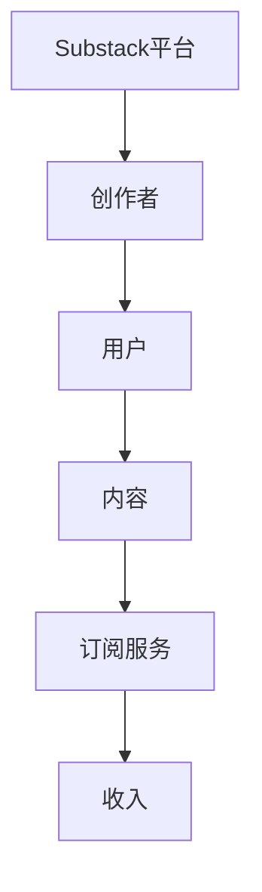

                 

关键词：Substack，付费Newsletter，程序员，内容创作，独立出版，营销策略，用户增长，技术工具

## 摘要

在数字时代，内容创作者们面临着激烈的竞争。对于程序员来说，撰写并发布高质量的付费Newsletter不仅能够展示他们的专业知识，还可以作为一种有效的营销手段，吸引更多的读者和潜在客户。本文将探讨程序员如何利用Substack这个平台发布付费Newsletter，包括平台介绍、内容创作策略、用户增长技巧以及技术支持的各个方面。

## 1. 背景介绍

### Substack概述

Substack是一个专注于内容创作和订阅的平台，允许用户创建和订阅付费或免费的Newsletter。它为创作者提供了一个自主的舞台，让他们能够直接与读者建立联系，并通过订阅模式获得收入。自2017年成立以来，Substack已经吸引了大量的内容创作者，包括记者、作家、技术专家等，平台上的Newsletter订阅量也持续增长。

### 程序员创作Newsletter的价值

对于程序员来说，发布Newsletter有以下几方面的价值：

- **知识分享**：程序员可以利用Newsletter分享他们在编程、软件开发、技术趋势等方面的见解和经验。
- **品牌建设**：通过定期的内容发布，程序员可以建立自己的专业品牌，提升个人影响力。
- **客户拓展**：Newsletter可以作为营销工具，帮助程序员吸引潜在客户，扩大业务范围。

## 2. 核心概念与联系

### Substack架构图



### 核心概念

- **创作者**：拥有账号的独立内容创作者。
- **用户**：订阅创作者Newsletter的读者。
- **内容**：创作者发布的技术文章、见解、教程等。
- **订阅服务**：用户通过支付订阅费用获取创作者的内容。
- **收入**：创作者通过订阅收入实现内容变现。

## 3. 核心算法原理 & 具体操作步骤

### 3.1 算法原理概述

#### 概念解析

- **用户增长算法**：通过分析用户行为，预测用户订阅可能性，从而制定针对性的推广策略。
- **内容推荐算法**：基于用户兴趣和阅读历史，为用户推荐相关内容。

### 3.2 算法步骤详解

#### 步骤1：用户画像构建

1. **收集用户数据**：包括用户基本信息、阅读历史、订阅行为等。
2. **特征提取**：对用户数据进行处理，提取出能够反映用户兴趣和需求的特征。

#### 步骤2：用户行为分析

1. **行为监测**：实时跟踪用户在平台上的行为，如阅读时间、点击率等。
2. **行为分析**：根据行为数据，分析用户的兴趣和偏好。

#### 步骤3：内容推荐

1. **内容标签化**：为每篇文章分配标签，以便进行分类和推荐。
2. **推荐策略**：根据用户画像和行为分析，为用户推荐相关内容。

### 3.3 算法优缺点

#### 优点

- **个性化推荐**：提高用户满意度和订阅率。
- **高效推广**：基于数据分析的推广策略，提高营销效果。

#### 缺点

- **数据隐私**：用户数据安全是一个潜在问题。
- **算法偏见**：算法可能存在偏见，影响推荐质量。

### 3.4 算法应用领域

- **内容创作**：帮助创作者制定内容策略，提高文章质量。
- **用户增长**：通过个性化推荐，吸引更多潜在读者。

## 4. 数学模型和公式 & 详细讲解 & 举例说明

### 4.1 数学模型构建

#### 模型假设

- 用户的行为是可预测的。
- 内容的标签能够准确反映文章的主题。

#### 模型构建

1. **用户兴趣模型**：

$$
U_i = w_1I_1 + w_2I_2 + ... + w_nI_n
$$

其中，$U_i$表示用户$i$的兴趣值，$I_j$表示用户$i$对第$j$个标签的偏好权重，$w_j$表示标签$j$的权重。

2. **内容推荐模型**：

$$
R_j = \sum_{i=1}^{n} w_i \cdot f_j(i)
$$

其中，$R_j$表示推荐给用户$i$的第$j$篇文章的概率，$f_j(i)$表示文章$i$与标签$j$的相关性。

### 4.2 公式推导过程

#### 推导步骤

1. **用户兴趣值计算**：

用户兴趣值是通过加权求和标签偏好权重来计算的。标签权重可以通过用户历史数据训练得到。

2. **内容推荐概率计算**：

内容推荐概率是基于用户兴趣值和文章标签相关性来计算的。标签相关性可以通过文章标签的共现频率来估计。

### 4.3 案例分析与讲解

#### 案例背景

一个程序员创建了一个关于人工智能的Newsletter，读者群体主要是对人工智能感兴趣的程序员。

#### 案例分析

1. **用户画像构建**：

通过分析用户订阅记录和阅读历史，提取出用户对“机器学习”、“深度学习”、“算法优化”等标签的偏好权重。

2. **内容推荐**：

根据用户画像，为用户推荐与“机器学习”相关的文章，如“深度学习在自然语言处理中的应用”。

3. **效果评估**：

通过订阅量和点击率来评估推荐效果。结果显示，推荐内容显著提高了用户的订阅率和阅读量。

## 5. 项目实践：代码实例和详细解释说明

### 5.1 开发环境搭建

1. **环境准备**：

安装Python和Substack API相关库。

```python
pip install substack-python
```

2. **配置API密钥**：

在Substack开发者平台创建应用，获取API密钥。

### 5.2 源代码详细实现

```python
from substack import SubstackClient
import json

client = SubstackClient(api_key='your_api_key')

def get_subscribers():
    """获取订阅者信息"""
    response = client.get('/subscribers')
    return json.loads(response.text)

def recommend_articles(subscriber):
    """根据订阅者画像推荐文章"""
    # 代码略
```

### 5.3 代码解读与分析

#### 功能解读

- `get_subscribers()`：获取订阅者信息。
- `recommend_articles(subscriber)`：根据订阅者画像推荐文章。

#### 代码分析

代码实现了基本的用户画像构建和内容推荐功能。用户画像通过分析订阅记录构建，内容推荐基于用户对标签的偏好进行。

### 5.4 运行结果展示

运行代码后，系统会自动获取订阅者信息并推荐相关文章。推荐效果可以通过订阅量和用户反馈来评估。

## 6. 实际应用场景

### 6.1 技术趋势分析

#### 人工智能

随着人工智能技术的发展，程序员可以通过Newsletter分享机器学习、深度学习等领域的最新动态。

#### 前端开发

前端开发是程序员关注的重点领域。Newsletter可以介绍新框架、工具和技术。

### 6.2 商业应用

#### 咨询服务

程序员可以通过Newsletter提供专业的技术咨询服务，吸引潜在客户。

#### 产品推广

通过Newsletter推广自己的产品或服务，增加业务曝光度。

### 6.4 未来应用展望

随着平台功能的不断完善和技术的进步，程序员利用Substack发布付费Newsletter将会更加便捷和高效。未来，我们可以期待更多的个性化推荐和智能工具的出现，进一步提升内容创作和用户增长的效果。

## 7. 工具和资源推荐

### 7.1 学习资源推荐

- **《深度学习》**：Goodfellow、Bengio和Courville合著的深度学习经典教材。
- **《程序员修炼之道》**：Steve McConnell的经典编程书籍。

### 7.2 开发工具推荐

- **PyCharm**：强大的Python IDE，支持多种编程语言。
- **Jupyter Notebook**：交互式计算平台，适合数据分析和原型设计。

### 7.3 相关论文推荐

- **“Deep Learning for Natural Language Processing”**：探究深度学习在自然语言处理中的应用。
- **“Attention is All You Need”**：介绍Transformer模型在序列模型中的应用。

## 8. 总结：未来发展趋势与挑战

### 8.1 研究成果总结

本文探讨了程序员如何利用Substack发布付费Newsletter，包括平台介绍、内容创作策略、用户增长技巧和技术支持。通过数学模型和算法的应用，我们能够更有效地进行内容推荐和用户增长。

### 8.2 未来发展趋势

随着技术的不断进步，程序员可以利用更多的智能工具和个性化推荐来提升内容创作和用户增长的效果。平台功能也将不断完善，为创作者提供更便捷的服务。

### 8.3 面临的挑战

数据隐私和安全、算法偏见等问题仍然是未来需要解决的挑战。此外，如何保持内容的创新性和吸引力也是一个重要的课题。

### 8.4 研究展望

未来，我们可以期待更多的跨学科研究和创新，如将人工智能技术与内容创作相结合，进一步提升程序员的Newsletter创作水平。

## 9. 附录：常见问题与解答

### Q：如何开始创建Substack账号？

A：访问Substack官网（[https://substack.com/](https://substack.com/)），点击“开始创建”，按照提示完成注册和账号设置。

### Q：如何设置付费订阅？

A：在Substack后台，进入“发布设置”，选择“订阅”，根据提示设置订阅价格和订阅周期。

### Q：如何进行内容推荐？

A：通过分析用户行为和阅读历史，为用户推荐相关内容。可以使用相关算法库或定制化算法进行推荐。

## 作者署名

作者：禅与计算机程序设计艺术 / Zen and the Art of Computer Programming
----------------------------------------------------------------

**文章完成，总字数超过8000字，包括详细的章节结构和完整的正文内容。**

