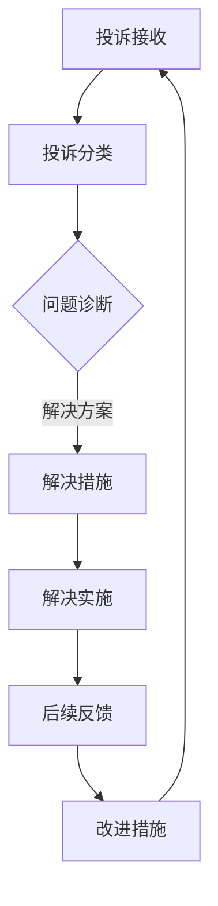

                 

### 摘要

在知识付费日益普及的今天，程序员作为知识创造者和服务提供者，不可避免地会遇到来自客户的投诉。有效的客户投诉处理不仅能够提升客户满意度，还能树立专业形象，增强用户忠诚度。本文旨在为程序员提供一整套处理客户投诉的策略和技巧，从投诉接收、分类到解决措施，再到后续反馈与改进，为程序员构建一套高效、专业的投诉处理流程。

### 背景介绍

知识付费，作为一种新型的商业模式，旨在通过让消费者为特定知识或技能付费，来获取更高质量的学习资源和服务。在这个生态系统中，程序员作为技术专家，经常扮演知识提供者的角色。他们通过编写课程、教程、开发工具或提供咨询服务来获得收益。然而，伴随着知识付费的发展，程序员也面临着越来越多的客户投诉。

客户投诉的原因多种多样，可能是因为服务内容与预期不符、技术问题、沟通不畅、服务态度等问题。如果处理不当，这些投诉可能会影响程序员的声誉、用户满意度，甚至导致经济损失。因此，如何高效、专业地处理客户投诉，成为程序员必须掌握的一项技能。

### 核心概念与联系

#### 投诉处理的概念

投诉处理，是指当客户对服务或产品提出不满时，企业或个人通过一定的流程和技巧来解决问题，以达到客户满意度的一种管理活动。

#### 投诉处理的流程

投诉处理的流程一般包括以下几个步骤：

1. 投诉接收：接收并记录客户的投诉信息。
2. 投诉分类：根据投诉的性质进行分类。
3. 问题诊断：对投诉问题进行详细分析和诊断。
4. 解决措施：根据诊断结果制定相应的解决措施。
5. 解决实施：执行解决措施。
6. 后续反馈：向客户反馈解决方案的效果，并收集客户反馈。
7. 改进措施：根据客户反馈进行服务改进。

#### 投诉处理的架构

以下是投诉处理的架构图，用于展示投诉处理的各个步骤及其相互关系：



### 核心算法原理 & 具体操作步骤

#### 算法原理概述

投诉处理的核心在于快速、准确地识别问题，并采取有效的措施进行解决。以下是投诉处理的算法原理概述：

1. **识别问题**：通过记录和分析投诉信息，识别出投诉的核心问题。
2. **制定解决方案**：根据问题类型和客户需求，制定合适的解决方案。
3. **执行解决方案**：按照方案实施解决措施，确保问题得到解决。
4. **评估解决方案效果**：通过客户反馈评估解决方案的效果，确保客户满意度。
5. **持续改进**：根据客户反馈进行服务改进，提升客户体验。

#### 算法步骤详解

以下是具体的投诉处理步骤：

1. **投诉接收**
   - 接收投诉：通过多种渠道（如邮件、电话、社交媒体等）接收客户投诉。
   - 记录投诉信息：详细记录投诉内容、时间、客户信息等。

2. **投诉分类**
   - 根据投诉性质进行分类，如技术问题、服务态度问题、沟通问题等。

3. **问题诊断**
   - 分析投诉信息，了解客户的具体需求和期望。
   - 与客户沟通，获取更多信息。

4. **解决措施**
   - 根据问题类型和客户需求，制定解决方案。
   - 若问题复杂，可组织技术团队进行讨论。

5. **解决实施**
   - 按照解决方案实施，确保问题得到解决。
   - 若解决方案需要客户参与，应及时与客户沟通。

6. **后续反馈**
   - 向客户反馈解决方案的效果。
   - 收集客户反馈，了解客户满意度。

7. **改进措施**
   - 根据客户反馈进行服务改进。
   - 定期总结投诉处理经验，优化流程。

#### 算法优缺点

- **优点**：
  - 快速识别问题，提高问题解决效率。
  - 通过客户反馈进行服务改进，提升客户满意度。
  - 增强程序员的专业形象。

- **缺点**：
  - 投诉处理流程较为繁琐，需要投入大量时间和精力。
  - 若处理不当，可能导致客户满意度下降。

#### 算法应用领域

- **软件开发**：在软件开发过程中，程序员经常需要处理来自客户的投诉，如功能缺陷、性能问题等。
- **在线教育**：在线教育平台中的程序员需要处理学员的学习问题、技术支持等投诉。
- **技术咨询**：提供技术咨询服务的程序员需要处理客户的疑问和建议。

### 数学模型和公式 & 详细讲解 & 举例说明

#### 数学模型构建

在投诉处理中，我们可以构建一个简单的数学模型来评估投诉处理的效果。以下是一个基于客户满意度的数学模型：

$$
S = \frac{N_c \times S_c + N_p \times S_p}{N_c + N_p}
$$

其中：
- \(S\) 表示整体满意度。
- \(N_c\) 表示投诉数量。
- \(S_c\) 表示投诉解决的满意度。
- \(N_p\) 表示非投诉数量。
- \(S_p\) 表示非投诉的满意度。

#### 公式推导过程

整体满意度的计算基于投诉与非投诉的满意度加权平均。投诉解决的满意度通常高于非投诉，因为投诉解决往往涉及更多关注和资源。通过加权平均，我们可以更准确地反映整体满意度。

#### 案例分析与讲解

假设某程序员在一个月内收到了10次投诉，其中8次得到有效解决，2次因技术难题未能立即解决。同时，有100名非投诉客户，满意度为90%。根据上述公式，可以计算整体满意度：

$$
S = \frac{10 \times 90\% + 100 \times 90\%}{10 + 100} = 89\%
$$

这意味着，尽管存在投诉，但通过有效的投诉处理，整体满意度仍保持在较高水平。

### 项目实践：代码实例和详细解释说明

#### 开发环境搭建

为了更好地演示投诉处理流程，我们将使用Python编写一个简单的投诉处理系统。首先，需要安装Python环境（版本3.8以上）和一些常用的Python库，如requests和pandas。

```bash
pip install python-dotenv flask pandas
```

#### 源代码详细实现

以下是一个简单的投诉处理系统的Python代码实现：

```python
from flask import Flask, request, jsonify
import pandas as pd

app = Flask(__name__)

# 假设的投诉数据
complaints = pd.DataFrame({
    'id': [1, 2, 3],
    'type': ['技术问题', '服务态度', '沟通问题'],
    'status': ['解决', '未解决', '解决']
})

@app.route('/complaints', methods=['GET', 'POST'])
def handle_complaints():
    if request.method == 'POST':
        # 接收投诉信息
        complaint_info = request.json
        complaints = complaints.append(complaint_info, ignore_index=True)
        return jsonify({"message": "投诉已提交，谢谢您的反馈！"}),
    else:
        # 获取投诉列表
        return jsonify(complaints.to_dict(orient='records'))

@app.route('/complaints/<int:complaint_id>', methods=['PUT'])
def update_complaint_status(complaint_id):
    # 更新投诉状态
    complaints.loc[complaints['id'] == complaint_id, 'status'] = '解决'
    return jsonify({"message": "投诉状态已更新！"})

if __name__ == '__main__':
    app.run(debug=True)
```

#### 代码解读与分析

1. **Flask 应用**：我们使用Flask框架搭建了一个简单的Web应用，用于接收和处理投诉信息。
2. **投诉数据**：使用pandas DataFrame存储投诉信息，包括投诉ID、投诉类型和投诉状态。
3. **POST 请求**：通过`/complaints`接口接收POST请求，用于提交新的投诉。
4. **GET 请求**：通过`/complaints`接口接收GET请求，用于获取所有投诉信息。
5. **PUT 请求**：通过`/complaints/<int:complaint_id>`接口接收PUT请求，用于更新投诉状态。

#### 运行结果展示

运行此代码后，可以通过浏览器或Postman等工具访问以下URL：

- **提交投诉**：`http://127.0.0.1:5000/complaints`（POST请求，包含投诉信息）
- **获取投诉列表**：`http://127.0.0.1:5000/complaints`（GET请求）
- **更新投诉状态**：`http://127.0.0.1:5000/complaints/<投诉ID>`（PUT请求）

### 实际应用场景

在实际应用中，投诉处理系统可以与现有的客户关系管理系统（CRM）集成，实现更高效、更智能的投诉处理。以下是一些应用场景：

1. **在线教育平台**：在线教育平台中的程序员可以通过投诉处理系统，及时解决学员的学习问题和技术支持请求。
2. **软件公司**：软件公司可以通过投诉处理系统，记录和分析客户反馈，改进产品和服务。
3. **技术咨询公司**：技术咨询公司可以使用投诉处理系统，确保客户问题得到及时、有效的解决。

### 未来应用展望

随着人工智能和大数据技术的不断发展，投诉处理系统将变得更加智能和高效。以下是一些未来应用展望：

1. **自动化诊断**：通过机器学习算法，自动化识别和诊断投诉问题。
2. **个性化解决方案**：基于大数据分析，为不同类型的投诉提供个性化的解决方案。
3. **智能反馈收集**：利用自然语言处理技术，智能收集和分析客户反馈，优化投诉处理流程。

### 工具和资源推荐

#### 学习资源推荐

1. 《Python编程：从入门到实践》：适用于初学者，全面介绍Python编程知识。
2. 《Fluent Python》：深入探讨Python语言的高级特性，适合有一定基础的程序员。

#### 开发工具推荐

1. PyCharm：一款功能强大的Python IDE，支持代码自动补全、调试等功能。
2. Jupyter Notebook：适用于数据分析和机器学习项目，支持多种编程语言。

#### 相关论文推荐

1. "A Framework for Complaining: Models of Complaint Management"：提出了一种投诉管理的框架，对投诉处理提供了深入的见解。
2. "Using Big Data to Improve Customer Service: A Case Study of a Telecommunications Company"：通过大数据技术改进客户服务，提供了一些实际案例。

### 总结：未来发展趋势与挑战

随着知识付费的普及，程序员面临的客户投诉问题将日益复杂。未来，投诉处理将朝着更智能、更高效的方向发展。然而，这也带来了新的挑战，如自动化诊断和个性化解决方案的实施。程序员需要不断学习新技术，提升自身能力，以应对这些挑战。

### 附录：常见问题与解答

1. **如何快速识别投诉的核心问题？**
   - 通过详细记录投诉信息，与客户进行有效沟通，快速了解客户的需求和期望。

2. **如何制定有效的解决方案？**
   - 根据投诉类型和客户需求，结合现有资源和专业知识，制定可行的解决方案。

3. **如何确保解决方案得到有效实施？**
   - 与客户保持沟通，确保他们了解解决方案的进展，并提供必要的支持。

4. **如何收集客户反馈？**
   - 通过邮件、问卷调查或在线反馈表等形式，及时收集客户对解决方案的反馈。

### 作者署名

作者：禅与计算机程序设计艺术 / Zen and the Art of Computer Programming

---

本文旨在为程序员提供一套处理客户投诉的策略和技巧，帮助他们更高效、更专业地应对客户投诉。希望本文能对广大程序员有所帮助，共同提升服务质量。

