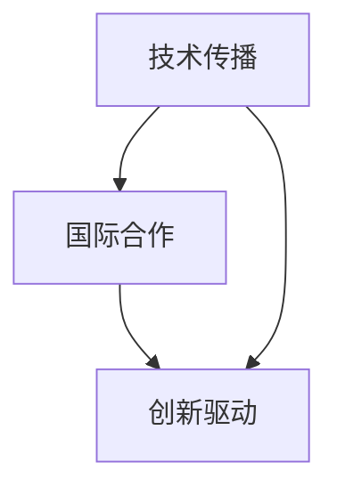

                 

关键词：全球化竞争、程序员技能、国际合作、技术传播、创新驱动

> 摘要：本文将探讨在全球竞争环境中，程序员如何通过提升自身技能、建立国际合作、加强技术传播和创新驱动来应对挑战，以保持竞争力并推动个人职业发展。

## 1. 背景介绍

随着全球化进程的加速，信息技术行业成为全球经济发展的重要引擎。各国之间的技术交流与合作日益频繁，程序员作为技术实施者和创新者，在全球竞争中扮演着至关重要的角色。然而，面对日益激烈的竞争，程序员需要不断提升自己的技能，以适应不断变化的技术环境。

本文旨在探讨程序员如何应对全球化竞争，具体内容包括：

- 核心概念与联系
- 核心算法原理与具体操作步骤
- 数学模型和公式及其应用
- 项目实践与代码实例
- 实际应用场景分析
- 未来发展趋势与挑战
- 工具和资源推荐
- 总结与展望

## 2. 核心概念与联系

在全球化竞争的背景下，程序员需要掌握以下核心概念：

- 技术传播：技术传播是指新技术、新方法在全球范围内的传播与应用。程序员应关注最新技术动态，积极参与技术交流，以便将先进技术引入本国或本团队。
- 国际合作：国际合作是程序员应对全球化竞争的关键。通过跨国团队合作，程序员可以拓宽视野，提高问题解决能力，同时也能学习到不同的工作文化和方法。
- 创新驱动：创新是保持竞争力的核心。程序员应不断寻求创新，从技术突破、业务模式创新等多个方面推动个人和团队的发展。

以下是核心概念原理和架构的 Mermaid 流程图：



## 3. 核心算法原理 & 具体操作步骤

### 3.1 算法原理概述

在全球化竞争中，程序员需要掌握高效的算法，以提高问题解决能力。本文将介绍一种常见的排序算法——快速排序（Quick Sort）。

快速排序是一种基于分治策略的排序算法。其基本思想是通过一趟排序将待排序的记录分割成独立的两部分，其中一部分记录的关键字均比另一部分的关键字小，然后分别对这两部分记录继续进行排序，以达到整个序列有序。

### 3.2 算法步骤详解

快速排序的基本步骤如下：

1. 选择一个基准元素（通常选择中间位置的元素）。
2. 将序列划分为两个子序列，其中一个子序列的所有元素均小于基准元素，另一个子序列的所有元素均大于基准元素。
3. 递归地对两个子序列进行快速排序。

### 3.3 算法优缺点

快速排序的优点包括：

- 平均时间复杂度为 \(O(n \log n)\)。
- 对数据几乎进行均匀划分，有利于提高排序效率。

快速排序的缺点包括：

- 最坏情况下的时间复杂度为 \(O(n^2)\)，当数据已经有序或接近有序时，效率较低。
- 需要额外的栈空间来存储递归调用的中间结果。

### 3.4 算法应用领域

快速排序广泛应用于数据排序和搜索场景，如数据库索引排序、文本编辑器的自动排序功能等。

## 4. 数学模型和公式 & 详细讲解 & 举例说明

### 4.1 数学模型构建

在全球化竞争中，程序员需要具备一定的数学基础，以便更好地理解和应用各种算法。本文将介绍一种常见的数学模型——线性规划（Linear Programming）。

线性规划是指在一定约束条件下，求线性目标函数的最大值或最小值。其数学模型可以表示为：

\[
\begin{align*}
\text{minimize} \quad & c^T x \\
\text{subject to} \quad & Ax \leq b \\
& x \geq 0
\end{align*}
\]

其中，\(c\) 为目标函数系数向量，\(x\) 为变量向量，\(A\) 为约束条件矩阵，\(b\) 为约束条件向量。

### 4.2 公式推导过程

线性规划的推导过程通常包括以下几个步骤：

1. 构建目标函数和约束条件。
2. 将约束条件转换为标准形式。
3. 利用单纯形法求解最优解。

### 4.3 案例分析与讲解

假设一家公司需要安排生产两种产品，产品A和产品B。每个产品都有不同的生产成本和利润。公司希望最大化总利润，同时满足以下约束条件：

1. 每个产品的生产数量不能超过可用资源限制。
2. 每个产品的生产数量必须为整数。

以下是一个简化的线性规划模型：

\[
\begin{align*}
\text{maximize} \quad & z = 5x_1 + 3x_2 \\
\text{subject to} \quad & 2x_1 + x_2 \leq 10 \\
& x_1 + 2x_2 \leq 8 \\
& x_1, x_2 \geq 0
\end{align*}
\]

通过求解该模型，我们可以得到最优解，从而确定生产计划，最大化总利润。

## 5. 项目实践：代码实例和详细解释说明

### 5.1 开发环境搭建

在本节中，我们将使用 Python 编写快速排序算法的实现。首先，确保安装了 Python 3 和必要的库，如 NumPy 和 Matplotlib。

### 5.2 源代码详细实现

以下是快速排序算法的 Python 实现代码：

```python
import numpy as np
import matplotlib.pyplot as plt

def quick_sort(arr):
    if len(arr) <= 1:
        return arr
    pivot = arr[len(arr) // 2]
    left = [x for x in arr if x < pivot]
    middle = [x for x in arr if x == pivot]
    right = [x for x in arr if x > pivot]
    return quick_sort(left) + middle + quick_sort(right)

def plot_sort(arr, sort_func):
    plt.scatter(range(len(arr)), arr, label="Original")
    sorted_arr = sort_func(arr.copy())
    plt.scatter(range(len(sorted_arr)), sorted_arr, label="Sorted")
    plt.legend()
    plt.show()

# 示例
arr = np.random.randint(0, 100, size=20)
plot_sort(arr, quick_sort)
```

### 5.3 代码解读与分析

上述代码首先定义了快速排序函数 `quick_sort`，该函数采用递归方法实现。然后，定义了 `plot_sort` 函数用于可视化排序过程。最后，创建一个随机数组并调用 `plot_sort` 函数，展示排序过程。

### 5.4 运行结果展示

运行上述代码后，将显示一个散点图，其中蓝色点表示原始数组，红色点表示排序后的数组。通过可视化结果，可以直观地观察快速排序算法的执行过程。

## 6. 实际应用场景

快速排序算法在实际应用中具有广泛的应用。以下是一些典型应用场景：

1. 数据库排序：在数据库系统中，快速排序算法可以用于快速检索和排序数据。
2. 文本编辑器：在文本编辑器中，快速排序算法可以用于快速对输入文本进行排序。
3. 数据分析：在数据分析过程中，快速排序算法可以用于对大量数据进行预处理，以便后续分析。

## 7. 未来应用展望

随着人工智能、大数据和云计算等技术的不断发展，快速排序算法将在更多领域得到应用。未来，快速排序算法有望在以下方面取得突破：

1. 高维排序：针对高维数据，快速排序算法可以结合其他排序算法，提高排序效率。
2. 并行排序：利用并行计算技术，快速排序算法可以实现高效的大规模数据处理。
3. 分布式排序：在分布式系统中，快速排序算法可以应用于分布式排序任务，提高数据处理效率。

## 8. 工具和资源推荐

为了帮助程序员更好地应对全球化竞争，以下是一些建议的工具和资源：

1. 学习资源推荐：
   - 《算法导论》（Introduction to Algorithms）：一本经典的算法教材，涵盖各种算法及其应用。
   - 《线性代数及其应用》（Linear Algebra and Its Applications）：一本介绍线性代数基础及其在计算机科学中应用的教材。

2. 开发工具推荐：
   - Visual Studio Code：一款功能强大的集成开发环境（IDE），支持多种编程语言。
   - PyCharm：一款针对 Python 开发的强大 IDE，提供丰富的编程支持和调试工具。

3. 相关论文推荐：
   - "Fast Sort"：一篇关于快速排序算法的综述论文，介绍快速排序的原理和应用。
   - "Linear Programming and Its Applications"：一篇介绍线性规划及其应用的论文，涵盖线性规划的数学模型和求解方法。

## 9. 总结：未来发展趋势与挑战

在全球化竞争的背景下，程序员需要不断提升自身技能，以适应快速变化的技术环境。未来，程序员将面临以下发展趋势和挑战：

1. 技术多样化：随着技术的快速发展，程序员需要掌握多种编程语言和框架，以应对不同的应用场景。
2. 人工智能：人工智能技术的发展将影响编程模式和算法设计，程序员需要关注人工智能领域的前沿动态。
3. 国际合作：国际合作将进一步加强，程序员需要具备跨文化沟通和团队合作能力。
4. 持续学习：持续学习是程序员应对竞争的关键，程序员需要不断更新知识和技能，以保持竞争力。

作者：禅与计算机程序设计艺术 / Zen and the Art of Computer Programming
```markdown
```

