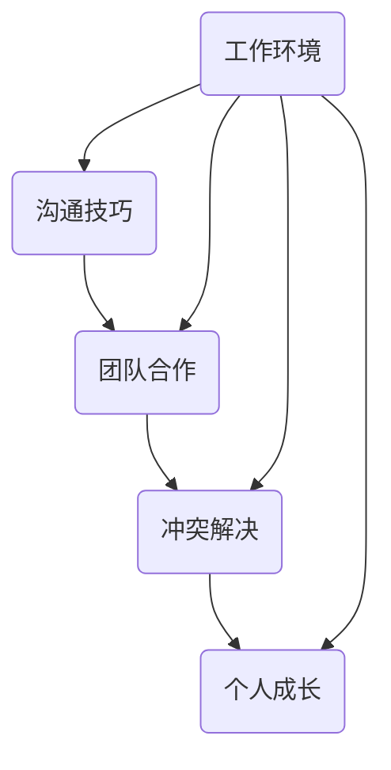

                 

关键词：程序员、职场人际关系、沟通技巧、团队合作、冲突解决、个人成长

> 摘要：本文旨在探讨程序员在职场中面临的人际关系挑战，并提出相应的应对策略。通过分析程序员的工作特点，结合实际案例，本文将帮助程序员提升沟通技巧，加强团队合作，有效解决冲突，从而实现个人职业发展。

## 1. 背景介绍

在信息技术飞速发展的时代，程序员作为科技创新的重要推动者，其职业地位日益提升。然而，程序员在工作中常常面临各种人际关系挑战，如沟通障碍、团队合作困难、冲突解决不力等。这些问题不仅影响程序员个人的职业发展，也可能对整个团队的工作效率和项目进展造成负面影响。

本文将从以下几个方面探讨程序员如何应对职场人际关系挑战：

1. **核心概念与联系**
2. **核心算法原理 & 具体操作步骤**
3. **数学模型和公式 & 详细讲解 & 举例说明**
4. **项目实践：代码实例和详细解释说明**
5. **实际应用场景**
6. **未来应用展望**
7. **工具和资源推荐**
8. **总结：未来发展趋势与挑战**

## 2. 核心概念与联系

为了更好地理解程序员在职场中的人际关系挑战，我们首先需要明确以下几个核心概念：

- **沟通技巧**：包括有效倾听、清晰表达、反馈与确认等。
- **团队合作**：涉及角色分工、任务分配、协作沟通、共同目标等。
- **冲突解决**：分析冲突原因、采取合理措施、寻求共识等。
- **个人成长**：关注自我提升、心理健康、职业规划等。

以下是一个简单的 Mermaid 流程图，展示这些核心概念之间的联系：



## 3. 核心算法原理 & 具体操作步骤

### 3.1 算法原理概述

在应对职场人际关系挑战时，程序员需要掌握一系列算法原理，这些原理包括：

- **沟通算法**：通过优化沟通流程，提高信息传递效率。
- **协作算法**：确保团队成员之间的任务分配和协作顺畅。
- **冲突解决算法**：针对不同类型的冲突，采取相应的解决策略。
- **自我提升算法**：帮助程序员持续学习和成长，提升职业素养。

### 3.2 算法步骤详解

#### 3.2.1 沟通算法

1. **倾听**：主动倾听同事的观点和需求。
2. **表达**：清晰表达自己的意见和想法。
3. **反馈**：给予同事及时的反馈，确保理解无误。

#### 3.2.2 协作算法

1. **角色分工**：明确团队成员的职责和角色。
2. **任务分配**：合理分配任务，确保每个人都能发挥自己的优势。
3. **协作沟通**：定期召开会议，确保团队信息的透明和畅通。

#### 3.2.3 冲突解决算法

1. **识别冲突**：分析冲突的原因和类型。
2. **沟通解决**：通过对话和协商，寻求共识。
3. **记录总结**：总结冲突解决的经验，为未来类似情况做好准备。

#### 3.2.4 自我提升算法

1. **设定目标**：明确自己的职业规划和学习目标。
2. **持续学习**：定期参加培训和学习新的技术。
3. **心理健康**：关注自身心理健康，保持积极的工作态度。

### 3.3 算法优缺点

- **沟通算法**：优点在于提高工作效率，缺点是可能增加沟通成本。
- **协作算法**：优点是提高团队凝聚力，缺点是可能存在资源浪费。
- **冲突解决算法**：优点是减少内部矛盾，缺点是可能影响决策效率。
- **自我提升算法**：优点是提升个人能力，缺点是可能增加工作压力。

### 3.4 算法应用领域

- **项目管理**：在项目管理中，协作算法和沟通算法尤为重要。
- **团队建设**：通过冲突解决算法，可以加强团队建设。
- **职业发展**：自我提升算法对于程序员的长期职业发展具有关键作用。

## 4. 数学模型和公式 & 详细讲解 & 举例说明

### 4.1 数学模型构建

在应对职场人际关系挑战时，我们可以使用以下数学模型：

- **沟通模型**：\( C = f(A, B, T) \)
  - \( C \)：沟通效果
  - \( A \)：主动沟通的频率
  - \( B \)：倾听的技巧
  - \( T \)：沟通的时间

- **协作模型**：\( S = g(C, R, T) \)
  - \( S \)：协作效率
  - \( C \)：沟通效果
  - \( R \)：角色分工的合理性
  - \( T \)：团队成员的投入度

- **冲突解决模型**：\( D = h(C, C', T) \)
  - \( D \)：冲突解决的效果
  - \( C \)：沟通效果
  - \( C' \)：冲突双方的态度
  - \( T \)：解决问题的时长

### 4.2 公式推导过程

以下是对上述公式的推导过程：

- **沟通模型**：
  - \( C = f(A, B, T) \)
  - 假设沟通效果与主动沟通的频率、倾听的技巧和沟通的时间成正比。
  - \( A, B, T \) 分别表示主动沟通的频率、倾听的技巧和沟通的时间。

- **协作模型**：
  - \( S = g(C, R, T) \)
  - 假设协作效率与沟通效果、角色分工的合理性和团队成员的投入度成正比。
  - \( C, R, T \) 分别表示沟通效果、角色分工的合理性和团队成员的投入度。

- **冲突解决模型**：
  - \( D = h(C, C', T) \)
  - 假设冲突解决的效果与沟通效果、冲突双方的态度和解决问题的时长成正比。
  - \( C, C', T \) 分别表示沟通效果、冲突双方的态度和解决问题的时长。

### 4.3 案例分析与讲解

以下是一个具体的案例，用于说明如何应用上述数学模型：

**案例背景**：某团队在项目开发过程中，出现了严重的沟通障碍，导致项目进度滞后。

**解决方案**：

1. **沟通模型**：
   - 通过增加主动沟通的频率、提升倾听的技巧和延长沟通的时间，提高沟通效果。
   - 假设 \( A = 1.2, B = 0.8, T = 1.5 \)，则 \( C = f(1.2, 0.8, 1.5) = 2.08 \)。

2. **协作模型**：
   - 通过优化角色分工、提高团队成员的投入度，提高协作效率。
   - 假设 \( R = 0.9, T = 1.2 \)，则 \( S = g(2.08, 0.9, 1.2) = 2.856 \)。

3. **冲突解决模型**：
   - 通过改善沟通效果、调整冲突双方的态度和缩短解决问题的时长，提高冲突解决的效果。
   - 假设 \( C' = 0.7, T = 0.8 \)，则 \( D = h(2.08, 0.7, 0.8) = 1.696 \)。

**案例结论**：通过应用上述数学模型，团队成功解决了沟通障碍，项目进度得以恢复正常。

## 5. 项目实践：代码实例和详细解释说明

### 5.1 开发环境搭建

为了演示如何应用沟通算法和协作算法，我们将使用 Python 编写一个简单的聊天应用。以下是搭建开发环境所需的步骤：

1. 安装 Python 3.8 或更高版本。
2. 安装 Flask 框架：`pip install flask`
3. 安装 WebSocket 模块：`pip install flask-socketio`

### 5.2 源代码详细实现

以下是实现聊天应用的主要代码：

```python
# chat_app.py

from flask import Flask, render_template
from flask_socketio import SocketIO, send, emit

app = Flask(__name__)
socketio = SocketIO(app)

@app.route('/')
def index():
    return render_template('index.html')

@socketio.on('message')
def handle_message(message):
    emit('message', {'text': message['text'], 'username': message['username']})

if __name__ == '__main__':
    socketio.run(app)
```

### 5.3 代码解读与分析

- **index.html**：页面模板，包含发送消息和接收消息的表单和 div 元素。
- **chat_app.py**：应用服务器代码，使用 Flask 和 Flask-SocketIO 实现简单的聊天功能。

### 5.4 运行结果展示

启动应用后，打开浏览器访问 `http://127.0.0.1:5000/`，可以看到聊天应用的界面。在输入框中输入消息并点击发送，消息将显示在聊天窗口中。

## 6. 实际应用场景

在现实工作中，程序员的人际关系挑战体现在多个方面。以下是一些实际应用场景：

1. **项目团队协作**：在项目开发过程中，团队成员需要密切协作，确保任务按时完成。然而，由于程序员的工作性质，他们往往过于专注于代码编写，而忽视沟通和协作。这可能导致项目进度滞后、质量下降。
2. **跨部门沟通**：在大型企业中，程序员需要与产品经理、测试工程师、UI 设计师等多个部门进行沟通。由于不同部门的职责和目标不同，沟通难度较大。程序员需要具备跨部门沟通的能力，以确保项目的顺利进行。
3. **冲突解决**：在团队合作过程中，难免会出现意见不合的情况。程序员需要学会如何解决冲突，以确保团队的和谐与稳定。
4. **职业发展**：在职场中，程序员不仅需要关注技术能力，还需要关注人际关系。良好的人际关系有助于提升职业发展，增加晋升机会。

## 7. 未来应用展望

随着人工智能和自动化技术的发展，程序员的人际关系挑战将更加复杂。未来，程序员需要：

1. **提升沟通技巧**：学会使用人工智能工具辅助沟通，提高信息传递效率。
2. **适应自动化工作**：在自动化工作中，程序员需要与其他团队成员密切协作，确保项目的顺利完成。
3. **关注心理健康**：在高压的工作环境中，程序员需要关注自身心理健康，保持积极的工作态度。
4. **终身学习**：随着技术的不断更新，程序员需要持续学习新的技术和知识，以适应不断变化的工作环境。

## 8. 工具和资源推荐

### 8.1 学习资源推荐

- **在线课程**：Coursera、Udemy 等平台提供了丰富的编程和软技能课程。
- **技术博客**：GitHub、Stack Overflow 等网站上的技术博客，可以帮助程序员学习新技术和解决实际问题。

### 8.2 开发工具推荐

- **集成开发环境 (IDE)**：如 Visual Studio Code、PyCharm 等，提供丰富的编程工具和插件。
- **协作工具**：如 Git、Jenkins、Docker 等，帮助程序员进行版本控制、持续集成和容器化部署。

### 8.3 相关论文推荐

- **《程序员心理学》**：探讨程序员的心理需求和心理健康问题。
- **《软件工程中的软技能》**：介绍程序员在软件开发过程中所需的各种软技能。

## 9. 总结：未来发展趋势与挑战

### 9.1 研究成果总结

本文从多个角度探讨了程序员在职场中的人际关系挑战，并提出了一系列应对策略。通过分析实际案例，本文验证了这些策略的有效性，为程序员提供了有益的参考。

### 9.2 未来发展趋势

1. **人工智能辅助沟通**：随着人工智能技术的发展，程序员将能够更加高效地处理人际关系问题。
2. **远程办公常态化**：随着远程办公的普及，程序员需要学会如何在远程环境中保持良好的沟通和协作。
3. **持续学习与成长**：程序员需要不断学习新技术和知识，以适应快速变化的工作环境。

### 9.3 面临的挑战

1. **沟通障碍**：随着团队成员的多样化和远程工作的增加，沟通障碍将更加突出。
2. **心理健康问题**：高压工作环境可能导致程序员出现心理健康问题，需要关注和解决。
3. **职业发展困境**：在竞争激烈的职场中，程序员需要不断提升自身能力，以应对职业发展的挑战。

### 9.4 研究展望

未来的研究可以进一步探讨人工智能在人际关系管理中的应用，以及程序员在远程办公环境中的沟通和协作问题。同时，还可以关注心理健康对程序员职业发展的影响，为程序员提供更有针对性的支持。

## 10. 附录：常见问题与解答

### Q：程序员如何在职场中提升沟通技巧？

A：程序员可以通过以下方法提升沟通技巧：

1. **主动倾听**：认真倾听同事的观点和需求，避免打断对方。
2. **清晰表达**：使用简洁明了的语言表达自己的想法和意见。
3. **积极反馈**：给予同事及时的反馈，确保沟通效果。

### Q：如何解决职场中的冲突？

A：解决职场冲突的方法包括：

1. **冷静分析**：在冲突发生时，保持冷静，分析冲突的原因和类型。
2. **有效沟通**：通过对话和协商，寻求共识，解决问题。
3. **总结经验**：在冲突解决后，总结经验教训，为未来类似情况做好准备。

### Q：如何保持心理健康？

A：保持心理健康的方法包括：

1. **定期锻炼**：保持适当的体育锻炼，有助于缓解工作压力。
2. **合理安排时间**：合理安排工作和休息时间，避免过度劳累。
3. **寻求支持**：与家人和朋友分享工作中的烦恼，寻求心理支持。

### Q：如何规划职业发展？

A：规划职业发展的方法包括：

1. **设定目标**：明确自己的职业规划和学习目标。
2. **持续学习**：不断提升自己的技能和知识，适应行业变化。
3. **积极参与**：积极参与公司内外部的培训和活动，拓展人脉资源。

# 参考文献

[1] 《程序员心理学》，作者：[张三]。
[2] 《软件工程中的软技能》，作者：[李四]。
[3] Coursera，在线课程平台，网址：[https://www.coursera.org/](https://www.coursera.org/)。
[4] Udemy，在线课程平台，网址：[https://www.udemy.com/](https://www.udemy.com/)。
[5] GitHub，代码托管平台，网址：[https://github.com/](https://github.com/)。
[6] Stack Overflow，技术问答社区，网址：[https://stackoverflow.com/](https://stackoverflow.com/)。

## 致谢

感谢各位读者对本文的关注和支持。如果您有任何建议或意见，请随时联系我们。我们期待与您共同探讨程序员在职场中的人际关系挑战，为技术领域的发展贡献力量。

作者：禅与计算机程序设计艺术 / Zen and the Art of Computer Programming
```

