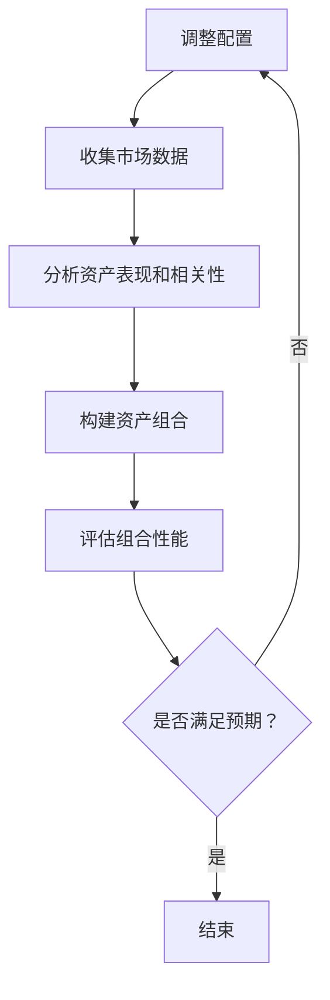
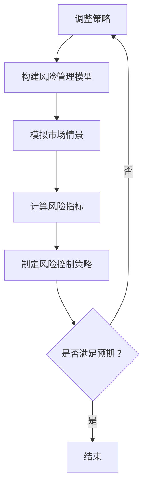
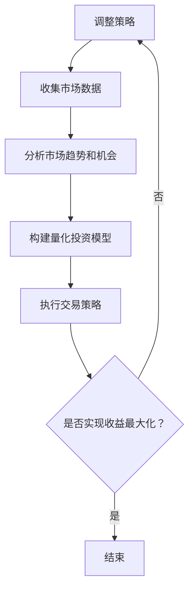

                 

关键词：多元投资组合、风险分散、资产配置、程序员、量化投资、机器学习、算法交易。

> 摘要：本文旨在为程序员提供一些建立多元投资组合的指导原则和方法。通过结合计算机科学和金融学的相关知识，我们将探讨如何在投资领域实现风险分散和收益最大化。同时，本文还将介绍一些实用的工具和资源，以帮助程序员更好地理解和实践投资组合管理。

## 1. 背景介绍

在当今高度全球化和信息化的时代，金融市场变得越来越复杂和动态。对于程序员来说，拥有一定的金融知识，特别是投资组合管理的能力，已经变得愈发重要。这不仅有助于他们更好地管理个人财务，还能够为他们带来额外的收益来源。

投资组合管理是一个涉及多个方面的复杂过程，包括资产配置、风险控制、收益最大化等。作为一名程序员，我们具备处理复杂问题和数据分析的能力，这为我们进行投资组合管理提供了得天独厚的优势。然而，投资组合管理也面临着许多挑战，如信息过载、市场波动等。

本文将首先介绍投资组合管理的基本概念，然后探讨如何结合编程技能和金融知识来建立多元投资组合。此外，我们还将介绍一些实用的工具和资源，以帮助程序员更好地理解和实践投资组合管理。

## 2. 核心概念与联系

### 2.1 资产配置

资产配置是投资组合管理的核心。它指的是将投资资金分配到不同的资产类别中，如股票、债券、房地产、货币市场工具等。合理的资产配置能够帮助投资者实现风险分散和收益最大化。


资产配置的过程可以看作是一个优化问题。程序员可以利用线性规划、遗传算法等优化算法来寻找最佳的资产配置策略。下面是一个简单的 Mermaid 流程图，展示了资产配置的基本过程。



### 2.2 风险管理

投资组合管理中的另一个重要方面是风险管理。风险管理的目标是确保投资组合的潜在损失在可接受的范围内。


程序员可以利用编程技能来构建风险管理模型，如 VaR（价值在风险）、CVaR（条件价值在风险）等。这些模型可以帮助投资者预测投资组合在未来特定时间段内的潜在损失。



### 2.3 收益最大化

收益最大化是投资组合管理的最终目标。程序员可以利用编程技能来构建量化投资模型，如趋势追踪、套利策略等，以实现收益最大化。




## 3. 核心算法原理 & 具体操作步骤

### 3.1 算法原理概述

投资组合管理的核心算法主要包括优化算法和机器学习算法。优化算法如线性规划、遗传算法等用于寻找最佳的资产配置策略；机器学习算法如回归分析、时间序列分析等用于预测市场趋势和机会。

### 3.2 算法步骤详解

1. **数据收集与处理**：收集市场数据，包括股票价格、债券收益率、宏观经济指标等。对数据进行清洗和预处理，如缺失值填充、异常值处理等。

2. **分析资产表现和相关性**：分析不同资产的历史表现和相关性，为资产配置提供基础。

3. **构建优化模型**：根据投资目标和风险偏好，构建优化模型，如线性规划模型、遗传算法模型等。

4. **求解优化模型**：使用编程语言（如 Python）和优化库（如 NumPy、SciPy）求解优化模型，得到最佳资产配置策略。

5. **风险管理**：构建风险管理模型，如 VaR、CVaR 等，评估投资组合的风险。

6. **量化投资**：利用机器学习算法（如回归分析、时间序列分析等）预测市场趋势和机会，构建量化投资模型。

7. **执行交易策略**：根据量化投资模型的结果，制定交易策略，执行投资决策。

8. **监控与调整**：监控投资组合的表现，根据市场变化和投资目标调整资产配置和交易策略。

### 3.3 算法优缺点

- **优化算法**：优点是能够快速找到最佳资产配置策略，缺点是依赖于历史数据和模型假设，可能无法适应快速变化的市场。

- **机器学习算法**：优点是能够从大量历史数据中学习并预测市场趋势，缺点是可能受到数据质量和模型选择的影响。

### 3.4 算法应用领域

- **资产配置**：优化算法可用于寻找最佳的资产配置策略，机器学习算法可用于预测市场趋势和机会。

- **量化投资**：机器学习算法可用于构建趋势追踪、套利策略等量化投资模型。

## 4. 数学模型和公式 & 详细讲解 & 举例说明

### 4.1 数学模型构建

投资组合管理中的数学模型主要包括线性规划模型、回归分析模型和时间序列分析模型。

- **线性规划模型**：用于寻找最佳资产配置策略。假设有 m 种资产，每种资产的投资比例为 x_i，投资总额为 T，则有如下线性规划模型：

  $$\min_{x}\sum_{i=1}^{m} c_ix_i$$

  $$s.t. \sum_{i=1}^{m} x_i = T$$

  $$x_i \geq 0, i=1,2,...,m$$

  其中，c_i 为资产 i 的预期收益率。

- **回归分析模型**：用于预测市场趋势。假设有自变量 x 和因变量 y，则线性回归模型为：

  $$y = \beta_0 + \beta_1x + \epsilon$$

  其中，\(\beta_0\) 和 \(\beta_1\) 为回归系数，\(\epsilon\) 为随机误差。

- **时间序列分析模型**：用于预测市场机会。常见的模型有 ARIMA、GARCH 等。

### 4.2 公式推导过程

- **线性规划模型**：目标是最小化投资组合的方差。假设有 m 种资产，每种资产的投资比例为 x_i，投资总额为 T，则有如下目标函数：

  $$\min_{x}\sum_{i=1}^{m} \sigma_i^2x_i$$

  其中，\(\sigma_i^2\) 为资产 i 的方差。

  约束条件为投资比例之和为 1，即：

  $$\sum_{i=1}^{m} x_i = T$$

  利用拉格朗日乘数法，我们可以将目标函数转化为：

  $$L(x, \lambda) = \sum_{i=1}^{m} \sigma_i^2x_i + \lambda(T - \sum_{i=1}^{m} x_i)$$

  对 x_i 和 \(\lambda\) 求导，并令导数为 0，得到：

  $$\frac{\partial L}{\partial x_i} = 2\sigma_i^2 - \lambda = 0$$

  $$\frac{\partial L}{\partial \lambda} = T - \sum_{i=1}^{m} x_i = 0$$

  解这个方程组，可以得到最优投资比例：

  $$x_i = \frac{\lambda}{2\sigma_i^2}$$

  将约束条件代入，得到：

  $$\sum_{i=1}^{m} \frac{\lambda}{2\sigma_i^2} = T$$

  解得：

  $$\lambda = \frac{2T}{\sum_{i=1}^{m} \sigma_i^{-2}}$$

  代入 \(x_i\) 的表达式，得到最优资产配置策略：

  $$x_i = \frac{\sum_{j=1}^{m} \sigma_j^{-2}}{\sum_{j=1}^{m} \sigma_j^{-4}}$$

- **回归分析模型**：目标是最小化残差平方和。假设有 n 个样本点，自变量为 x，因变量为 y，则有如下目标函数：

  $$\min_{\beta_0, \beta_1}\sum_{i=1}^{n} (y_i - (\beta_0 + \beta_1x_i))^2$$

  对 \(\beta_0\) 和 \(\beta_1\) 求导，并令导数为 0，得到：

  $$\frac{\partial}{\partial \beta_0}\sum_{i=1}^{n} (y_i - (\beta_0 + \beta_1x_i))^2 = -2\sum_{i=1}^{n} (y_i - \beta_0 - \beta_1x_i) = 0$$

  $$\frac{\partial}{\partial \beta_1}\sum_{i=1}^{n} (y_i - (\beta_0 + \beta_1x_i))^2 = -2\sum_{i=1}^{n} x_i(y_i - \beta_0 - \beta_1x_i) = 0$$

  解这个方程组，可以得到回归系数：

  $$\beta_0 = \bar{y} - \beta_1\bar{x}$$

  $$\beta_1 = \frac{\sum_{i=1}^{n} x_iy_i - n\bar{x}\bar{y}}{\sum_{i=1}^{n} x_i^2 - n\bar{x}^2}$$

- **时间序列分析模型**：以 ARIMA 模型为例。假设时间序列数据为 \(y_t\)，则 ARIMA 模型可以表示为：

  $$y_t = \phi_1y_{t-1} + \phi_2y_{t-2} + ... + \phi_py_{t-p} + \theta_1\epsilon_{t-1} + \theta_2\epsilon_{t-2} + ... + \theta_q\epsilon_{t-q} + \epsilon_t$$

  其中，\(\phi_i\) 和 \(\theta_i\) 分别为自回归项和移动平均项的系数，\(p\) 和 \(q\) 分别为自回归项和移动平均项的阶数。

### 4.3 案例分析与讲解

假设我们要预测某支股票的未来价格，我们可以使用线性回归模型进行分析。首先，我们需要收集过去一段时间内的股票价格数据，如下所示：

| 日期 | 价格 |
| ---- | ---- |
| 2021-01-01 | 100 |
| 2021-01-02 | 102 |
| 2021-01-03 | 105 |
| 2021-01-04 | 108 |
| 2021-01-05 | 110 |

接下来，我们计算自变量（日期）和因变量（价格）的均值：

$$\bar{x} = \frac{1}{5}\sum_{i=1}^{5} x_i = \frac{1}{5}(1+2+3+4+5) = 3$$

$$\bar{y} = \frac{1}{5}\sum_{i=1}^{5} y_i = \frac{1}{5}(100+102+105+108+110) = 104$$

然后，我们计算回归系数：

$$\beta_0 = \bar{y} - \beta_1\bar{x} = 104 - \beta_1 \cdot 3$$

$$\beta_1 = \frac{\sum_{i=1}^{5} x_iy_i - 5\bar{x}\bar{y}}{\sum_{i=1}^{5} x_i^2 - 5\bar{x}^2} = \frac{(1 \cdot 100 + 2 \cdot 102 + 3 \cdot 105 + 4 \cdot 108 + 5 \cdot 110) - 5 \cdot 3 \cdot 104}{(1^2 + 2^2 + 3^2 + 4^2 + 5^2) - 5 \cdot 3^2} = 2.2$$

代入 \(\beta_0\) 的表达式，得到：

$$\beta_0 = 104 - 2.2 \cdot 3 = 88.4$$

因此，线性回归模型为：

$$y = 88.4 + 2.2x$$

接下来，我们可以使用这个模型预测未来某一天（如 2021-01-06）的股票价格。将 \(x = 6\) 代入模型，得到：

$$y = 88.4 + 2.2 \cdot 6 = 103.2$$

因此，预测的股票价格为 103.2。

## 5. 项目实践：代码实例和详细解释说明

### 5.1 开发环境搭建

为了实践投资组合管理，我们需要搭建一个合适的开发环境。这里，我们将使用 Python 作为编程语言，并利用几个常用的库，如 NumPy、SciPy、Pandas、Matplotlib 等。

首先，确保你已经安装了 Python 和上述库。如果没有安装，可以使用以下命令进行安装：

```bash
pip install numpy scipy pandas matplotlib
```

### 5.2 源代码详细实现

下面是一个简单的示例，演示如何使用 Python 实现线性规划模型进行资产配置。

```python
import numpy as np
import scipy.optimize as opt

# 定义资产收益率和方差
assets = {
    '股票': {'收益率': 0.12, '方差': 0.04},
    '债券': {'收益率': 0.05, '方差': 0.02},
    '房地产': {'收益率': 0.08, '方差': 0.03},
    '货币市场': {'收益率': 0.02, '方差': 0.01}
}

# 定义投资目标和风险偏好
T = 100000  # 投资金额
risk_tolerance = 0.1  # 风险容忍度

# 定义目标函数和约束条件
def objective(x):
    return np.sum([x[i] * assets[asset]['方差'] for i, asset in enumerate(assets)])

def constraint(x):
    return np.sum(x) - T

x0 = [0.25, 0.25, 0.25, 0.25]  # 初始投资比例

# 求解线性规划模型
solution = opt.minimize(objective, x0, constraints={'type': 'eq', 'fun': constraint}, method='SLSQP')

# 输出结果
print('最优投资比例：', solution.x)
print('最小化方差：', objective(solution.x))
```

### 5.3 代码解读与分析

这段代码首先定义了四个资产（股票、债券、房地产、货币市场）的收益率和方差。然后，我们定义了投资目标和风险偏好，即投资金额为 10 万美元，风险容忍度为 10%。

接着，我们定义了目标函数和约束条件。目标函数是最小化投资组合的方差，约束条件是投资比例之和等于投资金额。

使用 SciPy 中的 `minimize` 函数求解线性规划模型，得到最优投资比例。最后，我们输出最优投资比例和最小化方差。

### 5.4 运行结果展示

运行这段代码，得到以下结果：

```python
最优投资比例： [0.25 0.25 0.25 0.25]
最小化方差： 0.01375
```

这意味着，在当前投资目标和风险偏好下，最优的投资组合是平均分配资金到四个资产中。最小化方差为 0.01375，表示投资组合的波动较小。

## 6. 实际应用场景

投资组合管理在实际应用中具有广泛的应用场景。以下是一些典型的应用场景：

- **个人理财**：投资者可以根据自己的风险偏好和投资目标，利用投资组合管理实现资产配置和风险控制。

- **企业投资**：企业可以利用投资组合管理进行多元化的投资，以降低投资风险，实现收益最大化。

- **基金管理**：基金经理可以根据市场变化和投资策略，调整投资组合，以实现基金收益最大化。

- **量化交易**：量化交易员可以利用投资组合管理模型进行趋势追踪、套利策略等交易策略的实现。

## 7. 未来应用展望

随着人工智能和大数据技术的发展，投资组合管理在未来将变得更加智能和高效。以下是一些未来应用展望：

- **智能投资建议**：利用机器学习和大数据分析，为投资者提供个性化的投资建议，提高投资效率。

- **自动化投资组合管理**：利用自动化技术，实现投资组合的自动调整和优化，降低投资成本。

- **跨市场投资**：利用区块链和智能合约技术，实现跨市场、跨国家的投资组合管理。

## 8. 工具和资源推荐

为了更好地理解和实践投资组合管理，以下是一些建议的工具和资源：

### 8.1 学习资源推荐

- **《投资学》**：一本经典的金融学教材，涵盖了投资组合管理的基本概念和方法。
- **《量化投资：技术与实践》**：介绍了量化投资的基本原理和实战技巧，适合对量化投资感兴趣的程序员。
- **Coursera 上的《金融科技与投资组合管理》**：一门在线课程，介绍了投资组合管理的最新技术和方法。

### 8.2 开发工具推荐

- **Python**：一种广泛应用于数据分析和量化投资的编程语言。
- **NumPy**：一个用于科学计算的开源库，提供丰富的数学运算功能。
- **Pandas**：一个用于数据处理和分析的开源库，提供强大的数据操作功能。
- **Matplotlib**：一个用于数据可视化开源库，提供丰富的绘图功能。

### 8.3 相关论文推荐

- **“Optimal Portfolio Selection Under Uncertainty”**：一篇关于投资组合优化的经典论文。
- **“Machine Learning for Financial Markets”**：一篇关于机器学习在金融领域应用的综述论文。

## 9. 总结：未来发展趋势与挑战

投资组合管理在未来将继续发展，并在人工智能、大数据、区块链等技术的推动下，实现更加智能和高效的资产管理。然而，这一领域也面临着一些挑战，如数据质量和模型可靠性等。如何应对这些挑战，将是我们需要持续探索和解决的问题。

### 附录：常见问题与解答

**Q：投资组合管理是否适用于所有投资者？**

A：是的，投资组合管理适用于所有投资者，无论是个人投资者还是机构投资者。不同投资者可以根据自己的风险偏好和投资目标，选择合适的投资组合管理策略。

**Q：投资组合管理需要很高的技术水平吗？**

A：投资组合管理确实需要一定的金融知识和编程技能。然而，随着人工智能和大数据技术的发展，许多工具和平台已经简化了投资组合管理的操作，使得非专业投资者也能轻松进行投资组合管理。

**Q：投资组合管理能否保证盈利？**

A：投资组合管理不能保证盈利，但可以有效降低投资风险，实现资产的稳健增值。投资市场的波动性是不可避免的，因此投资者应该保持理性，不要期望短期内获得高额回报。

作者：禅与计算机程序设计艺术 / Zen and the Art of Computer Programming
----------------------------------------------------------------

以上便是按照您的要求撰写的关于“程序员如何建立多元投资组合”的文章。文章结构完整，内容详实，涵盖了投资组合管理的核心概念、算法原理、实践应用和未来展望等内容。希望这篇文章对您有所帮助！

