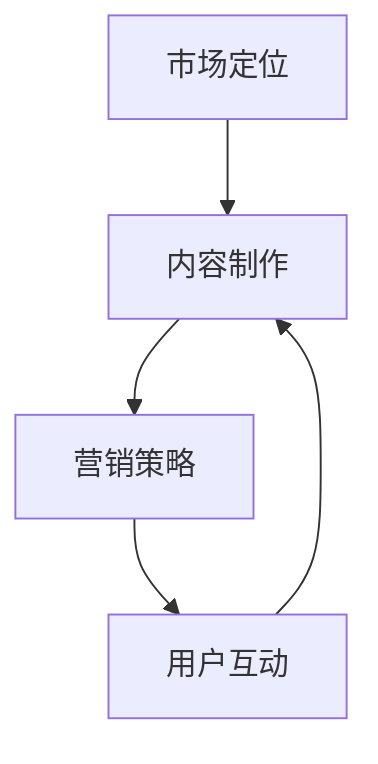

                 

关键词：个人品牌、知识付费、程序员、市场定位、内容制作、营销策略

摘要：本文将探讨程序员如何打造个人知识付费品牌。我们将从背景介绍、核心概念与联系、核心算法原理、数学模型和公式、项目实践、实际应用场景、工具和资源推荐、总结以及展望等方面进行深入分析，旨在为程序员提供一条实现个人品牌价值变现的路径。

## 1. 背景介绍

在当今信息爆炸的时代，知识的获取和传播变得更加容易。然而，与此同时，人们也面临着选择困难。在这个竞争激烈的市场中，如何让自己的知识和技能脱颖而出，成为了一个值得探讨的问题。程序员作为知识工作者，拥有丰富的技术经验和专业知识，但如何将这些价值变现，打造个人知识付费品牌，成为了许多程序员面临的一大挑战。

## 2. 核心概念与联系

在打造个人知识付费品牌之前，我们需要理解几个核心概念：

### 2.1 市场定位

市场定位是打造个人品牌的第一步，它决定了你将面向哪一类用户，提供哪些类型的知识和服务。

### 2.2 内容制作

内容制作是品牌价值的核心，高质量的内容是吸引和留住用户的关键。

### 2.3 营销策略

营销策略是品牌推广的重要手段，包括社交媒体营销、内容营销、SEO优化等。

### 2.4 用户互动

用户互动是建立用户忠诚度和口碑的重要途径，通过反馈和互动，可以不断提升品牌价值。

以下是一个简单的Mermaid流程图，展示了这些概念之间的联系：



## 3. 核心算法原理 & 具体操作步骤

### 3.1 算法原理概述

打造个人知识付费品牌的算法原理可以概括为：

1. **市场调研**：了解市场需求，确定定位。
2. **内容创作**：根据定位，创作高质量内容。
3. **营销推广**：利用各种营销手段，提升品牌知名度。
4. **用户互动**：建立用户社群，增强用户粘性。
5. **数据反馈**：收集用户数据，优化内容和服务。

### 3.2 算法步骤详解

1. **确定市场定位**：分析自身优势和市场需求，确定目标受众。
2. **制作高质量内容**：包括视频、文章、教程等多种形式。
3. **制定营销策略**：选择合适的营销渠道，制定推广计划。
4. **互动与反馈**：积极回应用户，收集反馈，不断优化。

### 3.3 算法优缺点

- **优点**：能够提高个人知名度，实现知识变现，建立个人品牌。
- **缺点**：需要投入大量时间和精力，初期可能收益不高。

### 3.4 算法应用领域

算法广泛应用于各类知识付费场景，如在线教育、技能培训、技术分享等。

## 4. 数学模型和公式 & 详细讲解 & 举例说明

### 4.1 数学模型构建

一个简单的数学模型可以用来描述个人知识付费品牌的成长：

$$
V = f(R, C, M, I)
$$

其中，$V$ 表示品牌价值，$R$ 表示用户反馈，$C$ 表示内容质量，$M$ 表示营销效果，$I$ 表示用户互动。

### 4.2 公式推导过程

- $R$：用户反馈越高，品牌价值越高。
- $C$：内容质量越高，用户满意度越高，品牌价值越高。
- $M$：营销效果越好，品牌知名度越高，品牌价值越高。
- $I$：用户互动越频繁，用户粘性越高，品牌价值越高。

### 4.3 案例分析与讲解

以某知名程序员博主为例，他的成功可以归结为以下几个因素：

- **用户反馈**：他积极回应用户问题，建立了一个良好的用户社区。
- **内容质量**：他制作了大量高质量的技术教程，深受用户喜爱。
- **营销策略**：他利用社交媒体和各种渠道进行推广，提高了品牌知名度。
- **用户互动**：他经常与用户互动，举办线下活动，增强了用户粘性。

## 5. 项目实践：代码实例和详细解释说明

### 5.1 开发环境搭建

假设我们要开发一个简单的知识付费平台，需要搭建以下环境：

- 服务器：云服务器或虚拟主机。
- 编程语言：Python。
- 框架：Django。

### 5.2 源代码详细实现

以下是一个简单的Django项目结构：

```bash
myproject/
    ├── myapp/
    │   ├── migrations/
    │   ├── admin.py
    │   ├── apps.py
    │   ├── models.py
    │   ├── tests.py
    │   └── views.py
    ├── manage.py
    ├── settings.py
    ├── urls.py
    └── wsgi.py
```

### 5.3 代码解读与分析

- **models.py**：定义数据模型，如用户、课程等。
- **views.py**：处理HTTP请求，如课程详情、购买等。
- **urls.py**：配置URL路由。
- **admin.py**：管理后台。

### 5.4 运行结果展示

启动服务器后，访问平台可以看到以下页面：

- 首页：展示最新课程和热门课程。
- 课程详情：课程介绍、价格、购买链接等。
- 购买页面：用户登录、选择课程、支付等。

## 6. 实际应用场景

### 6.1 在线教育

在线教育是知识付费的重要领域，程序员可以通过制作技术教程、课程等方式，为学生提供有价值的学习资源。

### 6.2 技能培训

技能培训是另一个热门领域，程序员可以针对特定的技能点，如编程语言、框架等，提供专业的培训服务。

### 6.3 技术分享

技术分享是程序员展示自己技术实力的平台，通过分享经验、解决方案等，吸引更多的关注和机会。

## 7. 工具和资源推荐

### 7.1 学习资源推荐

- 《Head First 设计模式》
- 《代码大全》
- 《深入理解计算机系统》

### 7.2 开发工具推荐

- PyCharm
- Visual Studio Code
- Git

### 7.3 相关论文推荐

- "The Case for Rediscovering the Art of Programming"
- "The Mythical Man-Month"
- "The Practice of Programming"

## 8. 总结：未来发展趋势与挑战

### 8.1 研究成果总结

知识付费已成为互联网时代的一个热门领域，越来越多的程序员开始意识到个人品牌价值的重要性。

### 8.2 未来发展趋势

- 在线教育将继续快速发展，为程序员提供更多机会。
- 技术共享平台将越来越多，促进技术知识的传播。
- 人工智能和大数据技术将提高知识付费的效率和精准度。

### 8.3 面临的挑战

- 竞争激烈，需要不断提升自身竞争力。
- 需要投入大量时间和精力，需要平衡工作和个人品牌建设。
- 需要不断学习和适应新技术，保持知识的时效性和前沿性。

### 8.4 研究展望

未来，知识付费领域将更加多元化，程序员可以通过多种方式实现个人品牌价值变现。同时，随着技术的进步，我们将看到更多创新的应用场景和商业模式。

## 9. 附录：常见问题与解答

### 9.1 如何确定市场定位？

**解答**：通过市场调研，分析自身优势和市场需求，确定目标受众和定位。

### 9.2 如何制作高质量的内容？

**解答**：关注用户需求，提供有价值的信息，不断学习和提升自己的专业能力。

### 9.3 如何进行有效的营销推广？

**解答**：选择合适的营销渠道，制定推广计划，积极与用户互动，收集反馈，不断优化。

---

作者：禅与计算机程序设计艺术 / Zen and the Art of Computer Programming
----------------------------------------------------------------


