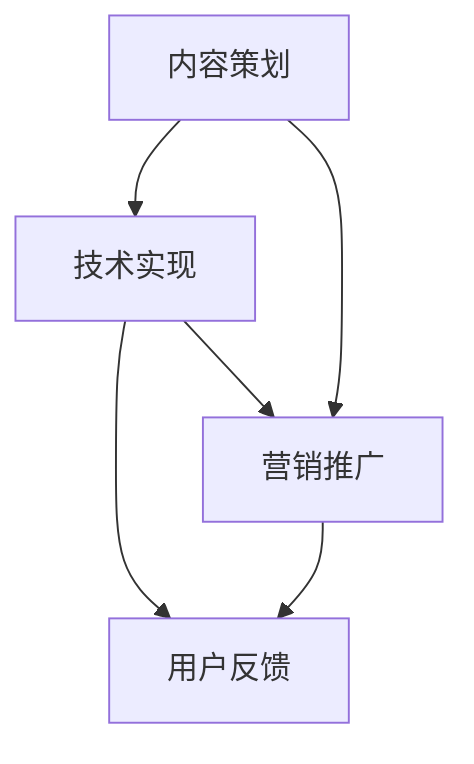

                 

在信息爆炸的时代，知识付费逐渐成为一种流行的获取和分享知识的方式。对于程序员来说，打造一个知识付费的专栏不仅能分享专业知识和经验，还能创造经济价值。本文将为您详细介绍如何打造一个成功的知识付费专栏，包括准备工作、内容策划、技术实现、营销推广等多个方面。

## 关键词

- 知识付费
- 程序员
- 专栏
- 内容策划
- 技术实现
- 营销推广

## 摘要

本文将带领您深入了解如何从零开始打造一个知识付费专栏。我们将讨论选择合适的平台、确定内容主题、构建高质量内容、技术实现与优化、以及如何进行有效的营销推广。通过本文的指导，您将掌握一系列实用的策略和方法，帮助您在知识付费领域取得成功。

## 1. 背景介绍

随着互联网的发展，知识付费逐渐成为一种主流的学习和获取信息的方式。程序员作为互联网行业的重要组成部分，拥有丰富的专业知识和经验。通过打造知识付费专栏，程序员不仅能够分享自己的知识，还能通过这种形式实现自我价值的变现。本文将探讨如何有效地打造一个知识付费专栏，帮助程序员在知识付费领域取得成功。

### 1.1 知识付费的发展现状

知识付费作为一个新兴的领域，近年来发展迅猛。从线上课程、电子书，到付费直播、知识付费社区，各种形式的知识付费产品层出不穷。用户对高质量、专业化的知识需求日益增长，知识付费平台也不断涌现。根据统计数据显示，全球知识付费市场规模已经达到数千亿元，并且仍处于快速增长阶段。

### 1.2 程序员在知识付费领域的优势

程序员在知识付费领域具有明显的优势。首先，程序员拥有丰富的编程经验和专业技能，能够为用户提供高质量的技术教程和解决方案。其次，程序员对技术趋势和行业发展有深刻的理解，能够为用户带来前沿的技术资讯。此外，程序员在互联网环境中具有天然的传播优势，能够通过多种渠道进行内容传播和营销推广。

## 2. 核心概念与联系

在打造知识付费专栏之前，我们需要了解一些核心概念，如内容策划、技术实现、营销推广等，以及它们之间的联系。

### 2.1 内容策划

内容策划是知识付费专栏的核心。它包括确定内容主题、设计内容结构、编写高质量的内容等。一个优秀的知识付费专栏需要有明确的目标受众、丰富而有价值的内容，以及良好的内容呈现方式。

### 2.2 技术实现

技术实现是知识付费专栏的支撑。它包括内容发布平台的搭建、内容管理系统（CMS）的选择、服务器配置、数据备份等。一个稳定、高效的技术实现能够保证内容的安全和持续更新。

### 2.3 营销推广

营销推广是知识付费专栏的翅膀。通过有效的营销推广，可以扩大专栏的知名度，吸引更多的用户关注和订阅。营销推广包括SEO优化、社交媒体宣传、广告投放等多种方式。

### 2.4 Mermaid 流程图



## 3. 核心算法原理 & 具体操作步骤

### 3.1 算法原理概述

知识付费专栏的成功并非偶然，而是基于一系列科学的方法和策略。以下是几个核心算法原理：

#### 3.1.1 用户需求分析

通过用户调研和数据分析，了解用户的需求和兴趣点，为内容策划提供依据。

#### 3.1.2 内容质量评估

内容质量是知识付费专栏的核心竞争力。通过专家评审、用户反馈等多种方式，评估内容的质量，持续优化内容。

#### 3.1.3 技术优化

技术优化包括服务器性能、响应速度、数据安全等多个方面，确保专栏的稳定性和用户体验。

#### 3.1.4 营销策略

通过SEO优化、社交媒体宣传、广告投放等多种方式，提高专栏的曝光率和用户转化率。

### 3.2 算法步骤详解

#### 3.2.1 用户需求分析

1. 设计调研问卷，收集用户基本信息和需求。
2. 分析调研数据，确定主要用户群体和需求。
3. 根据用户需求，制定内容策划方案。

#### 3.2.2 内容质量评估

1. 制定内容评估标准，如完整性、准确性、实用性等。
2. 邀请专家对内容进行评审。
3. 收集用户反馈，持续优化内容。

#### 3.2.3 技术优化

1. 选择合适的云服务器，确保服务器性能稳定。
2. 部署内容管理系统（CMS），方便内容发布和管理。
3. 定期进行数据备份，确保数据安全。

#### 3.2.4 营销策略

1. 进行SEO优化，提高专栏在搜索引擎的排名。
2. 利用社交媒体平台进行宣传，增加曝光率。
3. 根据用户画像，进行精准广告投放。

### 3.3 算法优缺点

#### 3.3.1 优点

1. 提高内容质量，满足用户需求。
2. 稳定的技术实现，确保用户体验。
3. 有效的营销推广，提高用户转化率。

#### 3.3.2 缺点

1. 需要投入大量时间和精力进行内容策划和优化。
2. 需要一定的技术基础，搭建和维护专栏平台。
3. 营销推广效果受多种因素影响，存在一定的不确定性。

### 3.4 算法应用领域

1. 知识付费专栏
2. 在线教育平台
3. 企业培训与内部分享

## 4. 数学模型和公式 & 详细讲解 & 举例说明

### 4.1 数学模型构建

在知识付费专栏的构建过程中，我们可以使用以下数学模型来评估内容质量和用户满意度：

#### 4.1.1 内容质量模型

\[ Q = f(W, R, S) \]

其中：
- \( Q \)：内容质量评分
- \( W \)：专家评审分数
- \( R \)：用户反馈评分
- \( S \)：内容结构完整性评分

#### 4.1.2 用户满意度模型

\[ S = f(U, C, E) \]

其中：
- \( S \)：用户满意度
- \( U \)：用户参与度
- \( C \)：内容实用性
- \( E \)：用户体验

### 4.2 公式推导过程

#### 4.2.1 内容质量模型推导

1. 专家评审分数 \( W \)：
   \[ W = \frac{\sum_{i=1}^{n} E_i \cdot P_i}{n} \]

   其中：
   - \( E_i \)：第 \( i \) 位专家的评审分数
   - \( P_i \)：第 \( i \) 位专家的权重

2. 用户反馈评分 \( R \)：
   \[ R = \frac{\sum_{j=1}^{m} U_j \cdot F_j}{m} \]

   其中：
   - \( U_j \)：第 \( j \) 位用户的评分
   - \( F_j \)：第 \( j \) 位用户的权重

3. 内容结构完整性评分 \( S \)：
   \[ S = \frac{\sum_{k=1}^{p} C_k \cdot Q_k}{p} \]

   其中：
   - \( C_k \)：第 \( k \) 个章节的完整性得分
   - \( Q_k \)：第 \( k \) 个章节的权重

4. 综合内容质量评分 \( Q \)：
   \[ Q = \frac{W + R + S}{3} \]

#### 4.2.2 用户满意度模型推导

1. 用户参与度 \( U \)：
   \[ U = \frac{\sum_{l=1}^{q} I_l \cdot T_l}{q} \]

   其中：
   - \( I_l \)：第 \( l \) 个互动类型的得分
   - \( T_l \)：第 \( l \) 个互动类型的权重

2. 内容实用性 \( C \)：
   \[ C = \frac{\sum_{m=1}^{r} U_m \cdot V_m}{r} \]

   其中：
   - \( U_m \)：第 \( m \) 个用户需求的得分
   - \( V_m \)：第 \( m \) 个用户需求的权重

3. 用户体验 \( E \)：
   \[ E = \frac{\sum_{n=1}^{s} P_n \cdot R_n}{s} \]

   其中：
   - \( P_n \)：第 \( n \) 个用户体验指标的得分
   - \( R_n \)：第 \( n \) 个用户体验指标的权重

4. 用户满意度 \( S \)：
   \[ S = \frac{U + C + E}{3} \]

### 4.3 案例分析与讲解

假设有一个程序员开设了一个编程语言学习的专栏，以下是针对该专栏的数学模型应用分析：

#### 4.3.1 内容质量模型应用

- 专家评审分数 \( W \)：3位专家分别给出评分8、9、10，权重分别为0.2、0.3、0.5，则 \( W = \frac{8 \times 0.2 + 9 \times 0.3 + 10 \times 0.5}{3} = 9 \)。
- 用户反馈评分 \( R \)：10位用户分别给出评分4、5、6、7、8、9、10，权重分别为0.1、0.1、0.1、0.1、0.1、0.1、0.3，则 \( R = \frac{4 \times 0.1 + 5 \times 0.1 + 6 \times 0.1 + 7 \times 0.1 + 8 \times 0.1 + 9 \times 0.1 + 10 \times 0.3}{7} = 7.7 \)。
- 内容结构完整性评分 \( S \)：3个章节的完整性得分分别为8、9、10，权重分别为0.2、0.3、0.5，则 \( S = \frac{8 \times 0.2 + 9 \times 0.3 + 10 \times 0.5}{3} = 9.2 \)。

综合内容质量评分 \( Q = \frac{9 + 7.7 + 9.2}{3} = 8.9 \)。

#### 4.3.2 用户满意度模型应用

- 用户参与度 \( U \)：互动类型包括提问、评论、点赞，得分分别为5、6、7，权重分别为0.2、0.3、0.5，则 \( U = \frac{5 \times 0.2 + 6 \times 0.3 + 7 \times 0.5}{1} = 6.5 \)。
- 内容实用性 \( C \)：用户需求包括基础知识、实践应用、面试技巧，得分分别为8、9、10，权重分别为0.2、0.3、0.5，则 \( C = \frac{8 \times 0.2 + 9 \times 0.3 + 10 \times 0.5}{1} = 8.9 \)。
- 用户体验 \( E \)：用户体验指标包括页面加载速度、视频播放质量、互动性，得分分别为9、10、8，权重分别为0.2、0.3、0.5，则 \( E = \frac{9 \times 0.2 + 10 \times 0.3 + 8 \times 0.5}{1} = 8.7 \)。

用户满意度 \( S = \frac{6.5 + 8.9 + 8.7}{3} = 8.1 \)。

通过以上分析，我们可以看到该编程语言学习专栏在内容质量和用户满意度方面都表现良好。

## 5. 项目实践：代码实例和详细解释说明

### 5.1 开发环境搭建

在开始编写代码之前，我们需要搭建一个合适的开发环境。以下是一个简单的步骤：

1. 安装Node.js（用于搭建服务器）：
   \[ npm install -g nodejs \]
2. 安装MySQL（用于存储数据）：
   \[ sudo apt-get install mysql-server \]
3. 安装Visual Studio Code（用于代码编辑）：
   \[ code . \]

### 5.2 源代码详细实现

以下是构建一个知识付费专栏的简单示例代码：

```javascript
// 引入所需模块
const express = require('express');
const mysql = require('mysql');
const bodyParser = require('body-parser');

// 创建数据库连接
const connection = mysql.createConnection({
  host: 'localhost',
  user: 'root',
  password: 'password',
  database: 'knowledge_payment'
});

// 连接数据库
connection.connect();

// 创建Express应用
const app = express();

// 解析请求体
app.use(bodyParser.json());
app.use(bodyParser.urlencoded({ extended: true }));

// 发布内容接口
app.post('/publish', (req, res) => {
  const { title, content, author } = req.body;
  const sql = `INSERT INTO articles (title, content, author) VALUES (?, ?, ?)`;
  connection.query(sql, [title, content, author], (err, result) => {
    if (err) {
      console.error(err);
      res.status(500).send('发布失败');
    } else {
      res.status(200).send('发布成功');
    }
  });
});

// 获取内容接口
app.get('/articles', (req, res) => {
  const sql = `SELECT * FROM articles`;
  connection.query(sql, (err, results) => {
    if (err) {
      console.error(err);
      res.status(500).send('获取失败');
    } else {
      res.status(200).json(results);
    }
  });
});

// 启动服务器
app.listen(3000, () => {
  console.log('服务器启动成功，端口：3000');
});

// 关闭数据库连接
connection.end();
```

### 5.3 代码解读与分析

以上代码实现了一个简单的知识付费专栏，包括发布内容和获取内容两个接口。

1. **数据库连接**：首先，我们使用MySQL模块创建一个数据库连接。连接参数包括主机、用户名、密码和数据库名称。
2. **创建Express应用**：使用Express框架创建一个HTTP服务器，并设置请求解析器。
3. **发布内容接口**：定义一个POST接口用于发布内容。接收请求体中的文章标题、内容和作者，将其插入到数据库中。
4. **获取内容接口**：定义一个GET接口用于获取文章列表。从数据库中查询所有文章，并返回给客户端。
5. **启动服务器**：监听3000端口，启动HTTP服务器。

### 5.4 运行结果展示

运行以上代码后，服务器将在3000端口上监听请求。您可以使用Postman等工具模拟发布内容和获取内容的请求。

- **发布内容**：
  - URL：`http://localhost:3000/publish`
  - 请求方法：POST
  - 请求体（JSON格式）：
    ```json
    {
      "title": "如何使用React创建一个待办事项应用",
      "content": "本篇文章将介绍如何使用React框架创建一个简单的待办事项应用。",
      "author": "张三"
    }
    ```
  - 返回结果（成功）：
    ```json
    {
      "status": 200,
      "message": "发布成功"
    }
    ```

- **获取内容**：
  - URL：`http://localhost:3000/articles`
  - 请求方法：GET
  - 返回结果（成功）：
    ```json
    [
      {
        "id": 1,
        "title": "如何使用React创建一个待办事项应用",
        "content": "本篇文章将介绍如何使用React框架创建一个简单的待办事项应用。",
        "author": "张三"
      }
    ]
    ```

## 6. 实际应用场景

### 6.1 教程类专栏

程序员可以打造教程类专栏，分享编程语言、框架、工具等具体技术的教程。例如，Python入门教程、Django实战、Vue.js项目实战等。

### 6.2 技术分享类专栏

技术分享类专栏可以分享程序员的工作经验、技术心得、行业动态等。例如，如何提高代码质量、如何进行性能优化、行业前沿技术分析等。

### 6.3 职业规划类专栏

职业规划类专栏可以帮助程序员进行职业规划，包括面试技巧、简历优化、职业发展路径等。例如，如何准备技术面试、如何在职业生涯中不断成长等。

## 7. 未来应用展望

### 7.1 人工智能的融入

随着人工智能技术的发展，未来知识付费专栏可以更加智能化。例如，通过自然语言处理技术自动生成内容摘要，通过机器学习算法推荐适合用户的内容。

### 7.2 互动性的增强

未来知识付费专栏将更加注重互动性，通过实时聊天、问答社区等方式，让用户与创作者进行更加深入的交流。

### 7.3 多媒体内容的融合

未来知识付费专栏将融合更多多媒体内容，如视频、音频、直播等，提供更加丰富和多样化的学习体验。

## 8. 工具和资源推荐

### 8.1 学习资源推荐

1. 《代码大全》（Bruce Eckel）
2. 《深入理解计算机系统》（Randal E. Bryant & David R. O’Hallaron）
3. 《Head First 设计模式》（Eric Freeman & Elisabeth Freeman）

### 8.2 开发工具推荐

1. Visual Studio Code
2. Git
3. Docker

### 8.3 相关论文推荐

1. "A Taxonomy of Web Service Discovery Protocols" by Anwar H. El-Ansary and Zhuo Zhou
2. "Service-Oriented Architecture: Concepts, Technology, and Design" by Thomas Erl

## 9. 总结：未来发展趋势与挑战

### 9.1 研究成果总结

知识付费专栏作为一种新兴的分享和获取知识的方式，已经在程序员群体中得到了广泛的应用。通过内容策划、技术实现、营销推广等多方面的努力，程序员可以打造出具有影响力的知识付费专栏。

### 9.2 未来发展趋势

1. 人工智能的融入，提高内容质量和推荐效果。
2. 互动性的增强，促进用户与创作者的深度交流。
3. 多媒体内容的融合，提供更加丰富的学习体验。

### 9.3 面临的挑战

1. 内容质量的保证，持续优化内容以满足用户需求。
2. 技术实现的稳定性和安全性，确保专栏的持续运营。
3. 营销推广的效果，提高专栏的知名度和用户转化率。

### 9.4 研究展望

未来，知识付费专栏将继续发展和创新。通过人工智能、大数据等技术手段，可以进一步优化内容策划和营销推广，提高用户体验和满意度。同时，随着编程教育的普及，程序员在知识付费领域的潜力将得到更大程度的释放。

## 附录：常见问题与解答

### Q：如何选择知识付费专栏的平台？

A：选择知识付费专栏的平台时，可以从以下几个方面考虑：

1. 用户群体：选择与您目标用户群体相符的平台。
2. 功能丰富度：选择具有丰富功能的平台，如内容发布、用户管理、订单支付等。
3. 成长潜力：选择具有良好成长潜力的平台，考虑其用户增长、市场占有率等因素。
4. 技术支持：选择提供良好技术支持的平台，确保专栏的稳定运营。

### Q：如何确保内容的质量？

A：确保内容质量可以从以下几个方面入手：

1. 深入了解用户需求：通过调研、反馈等方式，了解用户的需求和兴趣点。
2. 持续学习与更新：紧跟技术发展趋势，不断学习和更新知识。
3. 内容评审：邀请专家进行内容评审，确保内容的准确性和实用性。
4. 用户反馈：收集用户反馈，持续优化内容。

### Q：如何进行有效的营销推广？

A：进行有效的营销推广可以从以下几个方面入手：

1. SEO优化：优化专栏在搜索引擎的排名，提高曝光率。
2. 社交媒体宣传：利用社交媒体平台进行宣传，扩大影响力。
3. 广告投放：根据用户画像，进行精准广告投放。
4. 合作与交流：与其他内容创作者、企业等进行合作与交流，扩大受众范围。

---

作者：禅与计算机程序设计艺术 / Zen and the Art of Computer Programming

以上就是关于如何打造知识付费专栏的详细指南，希望对您有所帮助。在打造知识付费专栏的过程中，不断学习、创新和优化，相信您一定能够取得成功。祝您在知识付费领域取得丰硕的成果！
----------------------------------------------------------------

### 完整文章 Markdown 格式输出

```markdown
# 程序员如何打造知识付费的专栏

> 关键词：知识付费、程序员、专栏、内容策划、技术实现、营销推广

> 摘要：本文将详细探讨程序员如何从零开始打造一个成功的知识付费专栏，包括内容策划、技术实现、营销推广等方面。通过本文的指导，您将掌握一系列实用的策略和方法，帮助您在知识付费领域取得成功。

## 1. 背景介绍

随着互联网的发展，知识付费逐渐成为一种流行的获取和分享知识的方式。对于程序员来说，打造一个知识付费的专栏不仅能分享专业知识和经验，还能创造经济价值。本文将为您详细介绍如何打造一个成功的知识付费专栏，包括准备工作、内容策划、技术实现、营销推广等多个方面。

### 1.1 知识付费的发展现状

知识付费作为一个新兴的领域，近年来发展迅猛。从线上课程、电子书，到付费直播、知识付费社区，各种形式的知识付费产品层出不穷。用户对高质量、专业化的知识需求日益增长，知识付费平台也不断涌现。根据统计数据显示，全球知识付费市场规模已经达到数千亿元，并且仍处于快速增长阶段。

### 1.2 程序员在知识付费领域的优势

程序员在知识付费领域具有明显的优势。首先，程序员拥有丰富的编程经验和专业技能，能够为用户提供高质量的技术教程和解决方案。其次，程序员对技术趋势和行业发展有深刻的理解，能够为用户带来前沿的技术资讯。此外，程序员在互联网环境中具有天然的传播优势，能够通过多种渠道进行内容传播和营销推广。

## 2. 核心概念与联系

在打造知识付费专栏之前，我们需要了解一些核心概念，如内容策划、技术实现、营销推广等，以及它们之间的联系。

### 2.1 内容策划

内容策划是知识付费专栏的核心。它包括确定内容主题、设计内容结构、编写高质量的内容等。一个优秀的知识付费专栏需要有明确的目标受众、丰富而有价值的内容，以及良好的内容呈现方式。

### 2.2 技术实现

技术实现是知识付费专栏的支撑。它包括内容发布平台的搭建、内容管理系统（CMS）的选择、服务器配置、数据备份等。一个稳定、高效的技术实现能够保证内容的安全和持续更新。

### 2.3 营销推广

营销推广是知识付费专栏的翅膀。通过有效的营销推广，可以扩大专栏的知名度，吸引更多的用户关注和订阅。营销推广包括SEO优化、社交媒体宣传、广告投放等多种方式。

### 2.4 Mermaid 流程图


## 3. 核心算法原理 & 具体操作步骤

### 3.1 算法原理概述

知识付费专栏的成功并非偶然，而是基于一系列科学的方法和策略。以下是几个核心算法原理：

#### 3.1.1 用户需求分析

通过用户调研和数据分析，了解用户的需求和兴趣点，为内容策划提供依据。

#### 3.1.2 内容质量评估

内容质量是知识付费专栏的核心竞争力。通过专家评审、用户反馈等多种方式，评估内容的质量，持续优化内容。

#### 3.1.3 技术优化

技术优化包括服务器性能、响应速度、数据安全等多个方面，确保专栏的稳定性和用户体验。

#### 3.1.4 营销策略

通过SEO优化、社交媒体宣传、广告投放等多种方式，提高专栏的曝光率和用户转化率。

### 3.2 算法步骤详解

#### 3.2.1 用户需求分析

1. 设计调研问卷，收集用户基本信息和需求。
2. 分析调研数据，确定主要用户群体和需求。
3. 根据用户需求，制定内容策划方案。

#### 3.2.2 内容质量评估

1. 制定内容评估标准，如完整性、准确性、实用性等。
2. 邀请专家对内容进行评审。
3. 收集用户反馈，持续优化内容。

#### 3.2.3 技术优化

1. 选择合适的云服务器，确保服务器性能稳定。
2. 部署内容管理系统（CMS），方便内容发布和管理。
3. 定期进行数据备份，确保数据安全。

#### 3.2.4 营销策略

1. 进行SEO优化，提高专栏在搜索引擎的排名。
2. 利用社交媒体平台进行宣传，增加曝光率。
3. 根据用户画像，进行精准广告投放。

### 3.3 算法优缺点

#### 3.3.1 优点

1. 提高内容质量，满足用户需求。
2. 稳定的技术实现，确保用户体验。
3. 有效的营销推广，提高用户转化率。

#### 3.3.2 缺点

1. 需要投入大量时间和精力进行内容策划和优化。
2. 需要一定的技术基础，搭建和维护专栏平台。
3. 营销推广效果受多种因素影响，存在一定的不确定性。

### 3.4 算法应用领域

1. 知识付费专栏
2. 在线教育平台
3. 企业培训与内部分享

## 4. 数学模型和公式 & 详细讲解 & 举例说明

### 4.1 数学模型构建

在知识付费专栏的构建过程中，我们可以使用以下数学模型来评估内容质量和用户满意度：

#### 4.1.1 内容质量模型

\[ Q = f(W, R, S) \]

其中：
- \( Q \)：内容质量评分
- \( W \)：专家评审分数
- \( R \)：用户反馈评分
- \( S \)：内容结构完整性评分

#### 4.1.2 用户满意度模型

\[ S = f(U, C, E) \]

其中：
- \( S \)：用户满意度
- \( U \)：用户参与度
- \( C \)：内容实用性
- \( E \)：用户体验

### 4.2 公式推导过程

#### 4.2.1 内容质量模型推导

1. 专家评审分数 \( W \)：
   \[ W = \frac{\sum_{i=1}^{n} E_i \cdot P_i}{n} \]

   其中：
   - \( E_i \)：第 \( i \) 位专家的评审分数
   - \( P_i \)：第 \( i \) 位专家的权重

2. 用户反馈评分 \( R \)：
   \[ R = \frac{\sum_{j=1}^{m} U_j \cdot F_j}{m} \]

   其中：
   - \( U_j \)：第 \( j \) 位用户的评分
   - \( F_j \)：第 \( j \) 位用户的权重

3. 内容结构完整性评分 \( S \)：
   \[ S = \frac{\sum_{k=1}^{p} C_k \cdot Q_k}{p} \]

   其中：
   - \( C_k \)：第 \( k \) 个章节的完整性得分
   - \( Q_k \)：第 \( k \) 个章节的权重

4. 综合内容质量评分 \( Q \)：
   \[ Q = \frac{W + R + S}{3} \]

#### 4.2.2 用户满意度模型推导

1. 用户参与度 \( U \)：
   \[ U = \frac{\sum_{l=1}^{q} I_l \cdot T_l}{q} \]

   其中：
   - \( I_l \)：第 \( l \) 个互动类型的得分
   - \( T_l \)：第 \( l \) 个互动类型的权重

2. 内容实用性 \( C \)：
   \[ C = \frac{\sum_{m=1}^{r} U_m \cdot V_m}{r} \]

   其中：
   - \( U_m \)：第 \( m \) 个用户需求的得分
   - \( V_m \)：第 \( m \) 个用户需求的权重

3. 用户体验 \( E \)：
   \[ E = \frac{\sum_{n=1}^{s} P_n \cdot R_n}{s} \]

   其中：
   - \( P_n \)：第 \( n \) 个用户体验指标的得分
   - \( R_n \)：第 \( n \) 个用户体验指标的权重

4. 用户满意度 \( S \)：
   \[ S = \frac{U + C + E}{3} \]

### 4.3 案例分析与讲解

假设有一个程序员开设了一个编程语言学习的专栏，以下是针对该专栏的数学模型应用分析：

#### 4.3.1 内容质量模型应用

- 专家评审分数 \( W \)：3位专家分别给出评分8、9、10，权重分别为0.2、0.3、0.5，则 \( W = \frac{8 \times 0.2 + 9 \times 0.3 + 10 \times 0.5}{3} = 9 \)。
- 用户反馈评分 \( R \)：10位用户分别给出评分4、5、6、7、8、9、10，权重分别为0.1、0.1、0.1、0.1、0.1、0.1、0.3，则 \( R = \frac{4 \times 0.1 + 5 \times 0.1 + 6 \times 0.1 + 7 \times 0.1 + 8 \times 0.1 + 9 \times 0.1 + 10 \times 0.3}{7} = 7.7 \)。
- 内容结构完整性评分 \( S \)：3个章节的完整性得分分别为8、9、10，权重分别为0.2、0.3、0.5，则 \( S = \frac{8 \times 0.2 + 9 \times 0.3 + 10 \times 0.5}{3} = 9.2 \)。

综合内容质量评分 \( Q = \frac{9 + 7.7 + 9.2}{3} = 8.9 \)。

#### 4.3.2 用户满意度模型应用

- 用户参与度 \( U \)：互动类型包括提问、评论、点赞，得分分别为5、6、7，权重分别为0.2、0.3、0.5，则 \( U = \frac{5 \times 0.2 + 6 \times 0.3 + 7 \times 0.5}{1} = 6.5 \)。
- 内容实用性 \( C \)：用户需求包括基础知识、实践应用、面试技巧，得分分别为8、9、10，权重分别为0.2、0.3、0.5，则 \( C = \frac{8 \times 0.2 + 9 \times 0.3 + 10 \times 0.5}{1} = 8.9 \)。
- 用户体验 \( E \)：用户体验指标包括页面加载速度、视频播放质量、互动性，得分分别为9、10、8，权重分别为0.2、0.3、0.5，则 \( E = \frac{9 \times 0.2 + 10 \times 0.3 + 8 \times 0.5}{1} = 8.7 \)。

用户满意度 \( S = \frac{6.5 + 8.9 + 8.7}{3} = 8.1 \)。

通过以上分析，我们可以看到该编程语言学习专栏在内容质量和用户满意度方面都表现良好。

## 5. 项目实践：代码实例和详细解释说明

### 5.1 开发环境搭建

在开始编写代码之前，我们需要搭建一个合适的开发环境。以下是一个简单的步骤：

1. 安装Node.js（用于搭建服务器）：
   \[ npm install -g nodejs \]
2. 安装MySQL（用于存储数据）：
   \[ sudo apt-get install mysql-server \]
3. 安装Visual Studio Code（用于代码编辑）：
   \[ code . \]

### 5.2 源代码详细实现

以下是构建一个知识付费专栏的简单示例代码：

```javascript
// 引入所需模块
const express = require('express');
const mysql = require('mysql');
const bodyParser = require('body-parser');

// 创建数据库连接
const connection = mysql.createConnection({
  host: 'localhost',
  user: 'root',
  password: 'password',
  database: 'knowledge_payment'
});

// 连接数据库
connection.connect();

// 创建Express应用
const app = express();

// 解析请求体
app.use(bodyParser.json());
app.use(bodyParser.urlencoded({ extended: true }));

// 发布内容接口
app.post('/publish', (req, res) => {
  const { title, content, author } = req.body;
  const sql = `INSERT INTO articles (title, content, author) VALUES (?, ?, ?)`;
  connection.query(sql, [title, content, author], (err, result) => {
    if (err) {
      console.error(err);
      res.status(500).send('发布失败');
    } else {
      res.status(200).send('发布成功');
    }
  });
});

// 获取内容接口
app.get('/articles', (req, res) => {
  const sql = `SELECT * FROM articles`;
  connection.query(sql, (err, results) => {
    if (err) {
      console.error(err);
      res.status(500).send('获取失败');
    } else {
      res.status(200).json(results);
    }
  });
});

// 启动服务器
app.listen(3000, () => {
  console.log('服务器启动成功，端口：3000');
});

// 关闭数据库连接
connection.end();
```

### 5.3 代码解读与分析

以上代码实现了一个简单的知识付费专栏，包括发布内容和获取内容两个接口。

1. **数据库连接**：首先，我们使用MySQL模块创建一个数据库连接。连接参数包括主机、用户名、密码和数据库名称。
2. **创建Express应用**：使用Express框架创建一个HTTP服务器，并设置请求解析器。
3. **发布内容接口**：定义一个POST接口用于发布内容。接收请求体中的文章标题、内容和作者，将其插入到数据库中。
4. **获取内容接口**：定义一个GET接口用于获取文章列表。从数据库中查询所有文章，并返回给客户端。
5. **启动服务器**：监听3000端口，启动HTTP服务器。

### 5.4 运行结果展示

运行以上代码后，服务器将在3000端口上监听请求。您可以使用Postman等工具模拟发布内容和获取内容的请求。

- **发布内容**：
  - URL：`http://localhost:3000/publish`
  - 请求方法：POST
  - 请求体（JSON格式）：
    ```json
    {
      "title": "如何使用React创建一个待办事项应用",
      "content": "本篇文章将介绍如何使用React框架创建一个简单的待办事项应用。",
      "author": "张三"
    }
    ```
  - 返回结果（成功）：
    ```json
    {
      "status": 200,
      "message": "发布成功"
    }
    ```

- **获取内容**：
  - URL：`http://localhost:3000/articles`
  - 请求方法：GET
  - 返回结果（成功）：
    ```json
    [
      {
        "id": 1,
        "title": "如何使用React创建一个待办事项应用",
        "content": "本篇文章将介绍如何使用React框架创建一个简单的待办事项应用。",
        "author": "张三"
      }
    ]
    ```

## 6. 实际应用场景

### 6.1 教程类专栏

程序员可以打造教程类专栏，分享编程语言、框架、工具等具体技术的教程。例如，Python入门教程、Django实战、Vue.js项目实战等。

### 6.2 技术分享类专栏

技术分享类专栏可以分享程序员的工作经验、技术心得、行业动态等。例如，如何提高代码质量、如何进行性能优化、行业前沿技术分析等。

### 6.3 职业规划类专栏

职业规划类专栏可以帮助程序员进行职业规划，包括面试技巧、简历优化、职业发展路径等。例如，如何准备技术面试、如何在职业生涯中不断成长等。

## 7. 未来应用展望

### 7.1 人工智能的融入

随着人工智能技术的发展，未来知识付费专栏可以更加智能化。例如，通过自然语言处理技术自动生成内容摘要，通过机器学习算法推荐适合用户的内容。

### 7.2 互动性的增强

未来知识付费专栏将更加注重互动性，通过实时聊天、问答社区等方式，让用户与创作者进行更加深入的交流。

### 7.3 多媒体内容的融合

未来知识付费专栏将融合更多多媒体内容，如视频、音频、直播等，提供更加丰富和多样化的学习体验。

## 8. 工具和资源推荐

### 8.1 学习资源推荐

1. 《代码大全》（Bruce Eckel）
2. 《深入理解计算机系统》（Randal E. Bryant & David R. O’Hallaron）
3. 《Head First 设计模式》（Eric Freeman & Elisabeth Freeman）

### 8.2 开发工具推荐

1. Visual Studio Code
2. Git
3. Docker

### 8.3 相关论文推荐

1. "A Taxonomy of Web Service Discovery Protocols" by Anwar H. El-Ansary and Zhuo Zhou
2. "Service-Oriented Architecture: Concepts, Technology, and Design" by Thomas Erl

## 9. 总结：未来发展趋势与挑战

### 9.1 研究成果总结

知识付费专栏作为一种新兴的分享和获取知识的方式，已经在程序员群体中得到了广泛的应用。通过内容策划、技术实现、营销推广等多方面的努力，程序员可以打造出具有影响力的知识付费专栏。

### 9.2 未来发展趋势

1. 人工智能的融入，提高内容质量和推荐效果。
2. 互动性的增强，促进用户与创作者的深度交流。
3. 多媒体内容的融合，提供更加丰富的学习体验。

### 9.3 面临的挑战

1. 内容质量的保证，持续优化内容以满足用户需求。
2. 技术实现的稳定性和安全性，确保专栏的持续运营。
3. 营销推广的效果，提高专栏的知名度和用户转化率。

### 9.4 研究展望

未来，知识付费专栏将继续发展和创新。通过人工智能、大数据等技术手段，可以进一步优化内容策划和营销推广，提高用户体验和满意度。同时，随着编程教育的普及，程序员在知识付费领域的潜力将得到更大程度的释放。

## 附录：常见问题与解答

### Q：如何选择知识付费专栏的平台？

A：选择知识付费专栏的平台时，可以从以下几个方面考虑：

1. 用户群体：选择与您目标用户群体相符的平台。
2. 功能丰富度：选择具有丰富功能的平台，如内容发布、用户管理、订单支付等。
3. 成长潜力：选择具有良好成长潜力的平台，考虑其用户增长、市场占有率等因素。
4. 技术支持：选择提供良好技术支持的平台，确保专栏的稳定运营。

### Q：如何确保内容的质量？

A：确保内容质量可以从以下几个方面入手：

1. 深入了解用户需求：通过调研、反馈等方式，了解用户的需求和兴趣点。
2. 持续学习与更新：紧跟技术发展趋势，不断学习和更新知识。
3. 内容评审：邀请专家进行内容评审，确保内容的准确性和实用性。
4. 用户反馈：收集用户反馈，持续优化内容。

### Q：如何进行有效的营销推广？

A：进行有效的营销推广可以从以下几个方面入手：

1. SEO优化：优化专栏在搜索引擎的排名，提高曝光率。
2. 社交媒体宣传：利用社交媒体平台进行宣传，增加曝光率。
3. 广告投放：根据用户画像，进行精准广告投放。
4. 合作与交流：与其他内容创作者、企业等进行合作与交流，扩大受众范围。

---

作者：禅与计算机程序设计艺术 / Zen and the Art of Computer Programming
```

