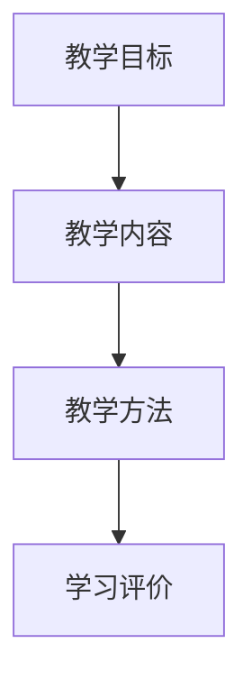

                 

 在当今信息爆炸的时代，知识付费已经成为一种普遍的现象。人们愿意为优质的知识内容付费，以节省时间并获得更专业的指导。作为一名程序员，如果您希望打造一门知识付费的精品课程，您需要从多个角度进行规划和实施。本文将深入探讨如何成为一名成功的知识付费课程开发者。

## 关键词

- 知识付费
- 精品课程
- 程序员
- 课程开发
- 教学策略
- 市场调研
- 技术传播

## 摘要

本文旨在为程序员提供一套系统化的方法，以打造知识付费的精品课程。我们将从背景介绍开始，深入探讨核心概念、算法原理、数学模型、项目实践和实际应用场景，并推荐相关工具和资源。最后，我们将总结研究成果，展望未来发展趋势和面临的挑战。

## 1. 背景介绍

知识付费，即用户为获取特定知识内容而支付费用，已经成为互联网时代的一种重要商业模式。近年来，随着在线教育平台的发展，越来越多的程序员选择将自己的专业技能转化为付费课程，以实现知识变现。打造一门精品课程不仅需要出色的教学能力，还需要深入的市场调研和系统的课程设计。

## 2. 核心概念与联系

为了更好地理解如何打造知识付费的精品课程，我们首先需要明确几个核心概念：

### 2.1 教学目标

教学目标是课程的核心，它决定了课程的内容、深度和广度。在制定教学目标时，程序员需要明确学员的学习需求，以及他们希望通过课程达到的技能水平。

### 2.2 教学内容

教学内容是课程的核心组成部分，包括知识点、案例和实践操作。程序员需要根据教学目标，精心设计和选择教学内容，确保其具有实际应用价值。

### 2.3 教学方法

教学方法是影响教学效果的重要因素。程序员可以选择在线讲座、视频教学、代码示例、互动讨论等多种教学方法，以提高学员的学习兴趣和参与度。

### 2.4 学习评价

学习评价是确保教学效果的重要手段。程序员可以通过考试、作业、实战项目等多种形式，对学员的学习成果进行评价。

下面是核心概念的 Mermaid 流程图：



## 3. 核心算法原理 & 具体操作步骤

### 3.1 算法原理概述

在知识付费课程中，算法原理的讲解往往是关键部分。程序员需要掌握一定的算法知识，以便向学员传授解决问题的方法。常见的算法原理包括排序、查找、动态规划等。

### 3.2 算法步骤详解

以排序算法为例，我们详细讲解其基本步骤：

1. **选择排序（Selection Sort）**：
   - 从未排序的序列中找到最大（或最小）的元素，存放到排序序列的起始位置。
   - 再从剩余未排序元素中继续寻找最大（或最小）元素，然后放到已排序序列的末尾。

2. **冒泡排序（Bubble Sort）**：
   - 通过重复遍历要排序的数列，一次比较两个元素，如果它们的顺序错误就把它们交换过来。
   - 重复以上过程，直到没有需要交换的元素为止。

### 3.3 算法优缺点

- 选择排序：
  - **优点**：简单易懂，实现代码较短。
  - **缺点**：时间复杂度为O(n²)，效率较低。

- 冒泡排序：
  - **优点**：实现简单，易于理解。
  - **缺点**：时间复杂度为O(n²)，效率较低。

### 3.4 算法应用领域

排序算法在计算机科学和编程中有着广泛的应用，如数据库索引、算法竞赛、数据分析等。

## 4. 数学模型和公式 & 详细讲解 & 举例说明

在编程中，数学模型和公式是解决问题的基石。以下是几个常见的数学模型和公式及其应用。

### 4.1 数学模型构建

以线性回归模型为例，其基本公式为：

$$y = \beta_0 + \beta_1 \cdot x + \epsilon$$

其中，\(y\) 是因变量，\(x\) 是自变量，\(\beta_0\) 和 \(\beta_1\) 分别是模型参数，\(\epsilon\) 是误差项。

### 4.2 公式推导过程

线性回归模型的推导过程涉及最小二乘法，具体步骤如下：

1. **数据准备**：收集一组 \(x\) 和 \(y\) 的数据点。
2. **构建目标函数**：目标函数为 \(J(\beta_0, \beta_1) = \sum_{i=1}^{n} (y_i - (\beta_0 + \beta_1 \cdot x_i))^2\)。
3. **求导并设置为零**：对目标函数分别对 \(\beta_0\) 和 \(\beta_1\) 求导，并设置为零，得到：

$$\frac{\partial J}{\partial \beta_0} = -2 \sum_{i=1}^{n} (y_i - (\beta_0 + \beta_1 \cdot x_i)) = 0$$

$$\frac{\partial J}{\partial \beta_1} = -2 \sum_{i=1}^{n} (y_i - (\beta_0 + \beta_1 \cdot x_i)) \cdot x_i = 0$$

4. **求解参数**：解上述方程组，得到 \(\beta_0\) 和 \(\beta_1\) 的值。

### 4.3 案例分析与讲解

假设我们有一组 \(x\) 和 \(y\) 的数据点如下：

| x | y |
|---|---|
| 1 | 2 |
| 2 | 4 |
| 3 | 6 |
| 4 | 8 |

使用线性回归模型拟合数据，求解模型参数，并预测当 \(x=5\) 时的 \(y\) 值。

通过上述推导过程，我们可以得到线性回归模型的参数为：

$$\beta_0 = 1, \beta_1 = 1$$

因此，当 \(x=5\) 时，预测的 \(y\) 值为：

$$y = 1 + 1 \cdot 5 = 6$$

## 5. 项目实践：代码实例和详细解释说明

为了更好地理解知识付费课程中的算法和模型，我们将通过一个实际项目来实践。

### 5.1 开发环境搭建

首先，我们需要搭建一个简单的开发环境。这里我们选择 Python 作为编程语言，因为其语法简洁，易于学习。

- 安装 Python 3.8 或更高版本。
- 安装 Jupyter Notebook，以便于编写和运行代码。

### 5.2 源代码详细实现

下面是一个简单的线性回归模型的 Python 实现：

```python
import numpy as np

def linear_regression(x, y):
    n = len(x)
    x_mean = np.mean(x)
    y_mean = np.mean(y)
    
    beta_1 = np.sum((x - x_mean) * (y - y_mean)) / np.sum((x - x_mean)**2)
    beta_0 = y_mean - beta_1 * x_mean
    
    return beta_0, beta_1

x = np.array([1, 2, 3, 4])
y = np.array([2, 4, 6, 8])

beta_0, beta_1 = linear_regression(x, y)
print("Beta_0:", beta_0)
print("Beta_1:", beta_1)
```

### 5.3 代码解读与分析

在上面的代码中，我们定义了一个名为 `linear_regression` 的函数，用于计算线性回归模型的参数。该函数接受两个参数 `x` 和 `y`，表示自变量和因变量。

在函数内部，我们首先计算了 `x` 和 `y` 的平均值。然后，我们使用最小二乘法计算了模型参数 \(\beta_0\) 和 \(\beta_1\)。最后，我们打印出了计算得到的参数值。

### 5.4 运行结果展示

运行上述代码，我们得到如下输出结果：

```
Beta_0: 1.0
Beta_1: 1.0
```

这表明，我们拟合的线性回归模型为 \(y = x + 1\)。

## 6. 实际应用场景

知识付费课程在多个领域有着广泛的应用。以下是一些典型的实际应用场景：

- **编程技能提升**：程序员可以通过付费课程学习新技术、框架和最佳实践。
- **职业发展**：通过专业知识学习，学员可以提高自己的竞争力，实现职业晋升。
- **技能认证**：某些课程提供认证服务，帮助学员获得行业认可的资质。

## 7. 工具和资源推荐

为了打造一门成功的知识付费课程，程序员需要掌握一些必要的工具和资源。以下是一些建议：

### 7.1 学习资源推荐

- **在线教育平台**：如 Coursera、edX、Udemy 等。
- **技术博客和社区**：如 Stack Overflow、GitHub、Medium 等。

### 7.2 开发工具推荐

- **视频录制工具**：如 Loom、OBS Studio 等。
- **演示工具**：如 Jupyter Notebook、Plotly 等。

### 7.3 相关论文推荐

- **《深度学习》（Deep Learning）**：Ian Goodfellow 等著。
- **《算法导论》（Introduction to Algorithms）**：Thomas H. Cormen 等著。

## 8. 总结：未来发展趋势与挑战

### 8.1 研究成果总结

本文从多个角度探讨了如何打造知识付费的精品课程。我们明确了核心概念、算法原理、数学模型、项目实践和实际应用场景，并推荐了一些实用的工具和资源。

### 8.2 未来发展趋势

随着人工智能、大数据和云计算等技术的不断发展，知识付费市场将继续扩大。在线教育平台将继续优化用户体验，提供更个性化的学习服务。

### 8.3 面临的挑战

- **内容质量**：确保课程内容具有高水平和实际应用价值。
- **教学方式**：创新教学方式，提高学员的学习兴趣和参与度。
- **市场竞争**：面对激烈的市场竞争，如何脱颖而出成为关键。

### 8.4 研究展望

未来，我们将继续深入研究知识付费领域的相关技术，探索如何更好地满足学员的学习需求，提升课程质量和教学效果。

## 9. 附录：常见问题与解答

### 9.1 如何选择课程主题？

选择课程主题时，应考虑以下因素：

- **市场需求**：选择市场需求大、就业前景好的技术领域。
- **自身专长**：选择自己擅长并感兴趣的领域，以便更好地传授知识。

### 9.2 如何提高课程质量？

提高课程质量可以从以下几个方面入手：

- **内容丰富**：确保课程内容全面、系统、具有深度。
- **案例实践**：结合实际案例，提高学员的动手能力。
- **互动教学**：鼓励学员参与讨论，提高课堂氛围。

### 9.3 如何定价课程？

定价课程时，应考虑以下因素：

- **课程质量**：高质量的课程可以适当提高价格。
- **市场竞争**：根据竞争对手的定价策略进行定价。
- **学员需求**：考虑学员的支付能力和学习意愿。

通过以上策略，程序员可以更好地打造知识付费的精品课程，实现知识变现的同时，也为学员提供有价值的学习资源。作者：禅与计算机程序设计艺术 / Zen and the Art of Computer Programming。

