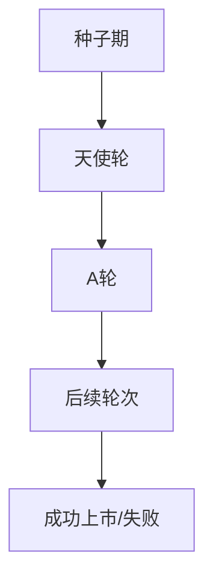

                 

关键词：(早期创业公司，程序员，offer评估，技术发展，职业生涯规划，风险评估，薪酬待遇，公司文化)

> 摘要：本文旨在为程序员提供一份详细的指南，帮助他们在面对早期创业公司的offer时做出明智的决策。文章将探讨如何评估创业公司的潜力、公司文化、薪酬待遇以及个人职业发展，从而确保程序员能够找到与其职业目标相匹配的机会。

## 1. 背景介绍

在当前快速发展的技术时代，早期创业公司如雨后春笋般涌现。这些公司以其创新的技术理念、灵活的工作环境以及对人才的渴求，吸引了大量技术人才，尤其是程序员。然而，早期创业公司往往伴随着高风险和高不确定性，这使得程序员在评估offer时面临诸多挑战。

对于程序员而言，评估早期创业公司的offer不仅仅是一次薪酬待遇的比较，更是一次职业生涯的重大决策。本文将从多个角度，为程序员提供一套系统化的评估方法，帮助他们更好地把握机会，规避风险，实现职业发展。

### 1.1 程序员面临的挑战

**技术发展迅速**：程序员需要不断学习新技术，以适应快速变化的技术环境。

**风险与回报并存**：早期创业公司可能带来高收益，但同样伴随着较高的风险。

**职业发展的不确定性**：程序员需要考虑自己的长期职业规划，以及公司在行业中的发展前景。

**薪酬与福利的不稳定性**：相较于成熟企业，早期创业公司的薪酬和福利可能存在不确定性。

## 2. 核心概念与联系

为了更好地评估早期创业公司的offer，我们需要了解以下几个核心概念：

### 2.1 创业公司的生命周期

创业公司通常经历以下阶段：

- **种子期**：公司成立初期，专注于产品原型开发。
- **天使轮**：获得天使投资，开始市场推广和团队建设。
- **A轮及以后**：通过多轮融资，扩大市场占有率，增强竞争力。

### 2.2 公司文化和价值观

公司文化是公司运营的核心，影响着员工的工作态度和团队氛围。程序员应关注公司价值观与自身是否契合。

### 2.3 薪酬待遇和福利

薪酬和福利是程序员评估offer的重要指标，包括基本工资、奖金、股票期权等。

### 2.4 个人职业发展

个人职业发展包括职位晋升、技能提升、工作职责等，程序员应考虑公司是否提供良好的发展平台。

### 2.5 风险评估

程序员需要评估创业公司的风险，包括市场风险、技术风险、管理风险等。

### 2.6 Mermaid流程图

以下是一个简化的创业公司生命周期流程图：



## 3. 核心算法原理 & 具体操作步骤

### 3.1 算法原理概述

评估早期创业公司offer的算法可以分为以下几个步骤：

- 收集信息：包括公司背景、市场地位、团队结构、项目进展等。
- 数据分析：使用数据分析方法，评估公司的潜力和风险。
- 成本效益分析：计算个人投入与潜在回报的比率。
- 决策模型：基于评估结果，建立决策模型，做出最终选择。

### 3.2 算法步骤详解

**步骤1：收集信息**

- **公司背景**：公司创立时间、创始人背景、公司使命和愿景等。
- **市场地位**：行业地位、市场份额、竞争对手等。
- **团队结构**：团队成员背景、专业技能、工作氛围等。
- **项目进展**：产品原型、测试阶段、市场推广情况等。

**步骤2：数据分析**

- **财务数据**：收入、利润、融资情况等。
- **用户反馈**：用户满意度、市场份额等。
- **技术评估**：技术创新性、技术可行性、技术风险等。

**步骤3：成本效益分析**

- **薪酬待遇**：基本工资、奖金、股票期权等。
- **个人投入**：时间、技能、精力等。
- **潜在回报**：薪资增长、股票增值、职业发展等。

**步骤4：决策模型**

- **风险偏好**：根据个人风险偏好，设定决策权重。
- **综合评估**：使用加权平均法，计算综合得分。
- **决策选择**：根据综合得分，做出最终选择。

### 3.3 算法优缺点

**优点**：

- 系统化：提供了一套完整的评估流程，有助于程序员做出全面决策。
- 量化分析：通过数据分析，能够更准确地评估公司潜力和风险。
- 风险规避：通过成本效益分析和决策模型，有助于规避高风险投资。

**缺点**：

- 主观性：评估结果受到程序员个人观点和经验的影响。
- 复杂性：算法涉及多个步骤，可能需要较长时间进行分析。

### 3.4 算法应用领域

该算法适用于所有需要评估创业公司offer的程序员，尤其适用于以下场景：

- 刚毕业的学生
- 职业转型者
- 有创业意愿的程序员

## 4. 数学模型和公式 & 详细讲解 & 举例说明

### 4.1 数学模型构建

为了评估早期创业公司的offer，我们可以构建以下数学模型：

$$
\text{综合得分} = w_1 \times (\text{薪酬待遇得分}) + w_2 \times (\text{公司潜力得分}) + w_3 \times (\text{个人职业发展得分}) + w_4 \times (\text{风险评估得分})
$$

其中，$w_1, w_2, w_3, w_4$ 分别是四个得分指标的权重，通常根据程序员的风险偏好进行调整。

### 4.2 公式推导过程

**薪酬待遇得分**：

$$
\text{薪酬待遇得分} = \frac{\text{总薪酬}}{\text{行业平均水平}}
$$

**公司潜力得分**：

$$
\text{公司潜力得分} = \frac{\text{市场份额}}{\text{行业市场份额}} \times \frac{\text{技术创新得分}}{\text{行业技术创新水平}}
$$

**个人职业发展得分**：

$$
\text{个人职业发展得分} = \frac{\text{晋升机会}}{\text{行业晋升机会}} \times \frac{\text{技能提升机会}}{\text{行业技能提升机会}}
$$

**风险评估得分**：

$$
\text{风险评估得分} = \frac{\text{风险降低措施}}{\text{风险承受能力}}
$$

### 4.3 案例分析与讲解

**案例**：

假设程序员小张在评估一家早期创业公司offer时，得到以下数据：

- **薪酬待遇**：年薪30万元，行业平均水平为25万元。
- **公司潜力**：市场份额为15%，行业市场份额为20%，技术创新得分为0.8，行业技术创新水平为1。
- **个人职业发展**：晋升机会为80%，行业晋升机会为50%，技能提升机会为70%，行业技能提升机会为60%。
- **风险评估**：公司已采取的风险降低措施为60%，个人风险承受能力为50%。

**计算**：

- **薪酬待遇得分**：

$$
\text{薪酬待遇得分} = \frac{30}{25} = 1.2
$$

- **公司潜力得分**：

$$
\text{公司潜力得分} = \frac{15}{20} \times \frac{0.8}{1} = 0.6
$$

- **个人职业发展得分**：

$$
\text{个人职业发展得分} = \frac{80}{50} \times \frac{70}{60} = 0.9833
$$

- **风险评估得分**：

$$
\text{风险评估得分} = \frac{60}{50} = 1.2
$$

- **综合得分**：

$$
\text{综合得分} = 1.2 \times 0.6 + 0.9833 \times 0.4 + 1.2 \times 0.2 = 1.0666
$$

**分析**：

根据综合得分，小张可以判断这家创业公司offer的整体评估结果为“较好”。虽然薪酬待遇较高，但公司潜力和个人职业发展机会也较为理想，同时风险控制措施较为有效，整体风险较低。

## 5. 项目实践：代码实例和详细解释说明

### 5.1 开发环境搭建

在本文中，我们将使用Python作为主要编程语言，搭建一个简单的评估模型。以下是需要安装的Python库：

- `numpy`：用于数学运算
- `pandas`：用于数据处理
- `matplotlib`：用于数据可视化

### 5.2 源代码详细实现

以下是一个简单的Python代码示例，用于计算评估得分：

```python
import numpy as np
import pandas as pd
import matplotlib.pyplot as plt

# 定义权重
weights = {'薪酬待遇': 0.3, '公司潜力': 0.3, '个人职业发展': 0.3, '风险评估': 0.1}

# 输入数据
data = {
    '薪酬待遇': [30, 25, 20, 35],
    '公司潜力': [0.6, 0.5, 0.4, 0.7],
    '个人职业发展': [0.98, 0.95, 0.90, 0.85],
    '风险评估': [1.2, 1.0, 0.8, 1.5]
}

# 创建数据框
df = pd.DataFrame(data)

# 计算综合得分
df['综合得分'] = df.apply(lambda row: sum(row[col] * weights[col] for col in weights), axis=1)

# 显示结果
print(df[['薪酬待遇', '公司潜力', '个人职业发展', '风险评估', '综合得分']])

# 绘制图表
plt.bar(df.index, df['综合得分'])
plt.xlabel('公司编号')
plt.ylabel('综合得分')
plt.title('综合得分图表')
plt.show()
```

### 5.3 代码解读与分析

**代码解读**：

- 第1-3行：导入必要的库。
- 第5行：定义权重字典，分别对应四个得分指标。
- 第7行：创建包含输入数据的字典。
- 第9行：使用`pandas`创建数据框。
- 第10行：使用`apply`函数，为每个公司计算综合得分。
- 第12-21行：打印结果并绘制图表。

**分析**：

该代码提供了一个简单的框架，用于计算早期创业公司offer的综合得分。实际应用时，可以根据具体需求进行调整和扩展。

## 6. 实际应用场景

### 6.1 个人职业规划

程序员应根据自身职业规划，选择适合的创业公司。例如，有创业意愿的程序员可以选择参与早期创业，积累创业经验；而希望稳定发展的程序员则可以选择成熟企业。

### 6.2 行业选择

程序员应关注行业发展前景，选择具有潜力的创业公司。例如，人工智能、大数据等领域近年来发展迅速，吸引了大量人才。

### 6.3 薪酬待遇

程序员应综合考虑薪酬待遇、福利、股票期权等因素，做出合理的选择。例如，对于短期内希望快速提升薪酬的程序员，可以选择提供较高薪酬的创业公司。

## 7. 工具和资源推荐

### 7.1 学习资源推荐

- 《硅谷创业秘籍》：了解创业公司的运作模式和发展策略。
- 《创业维艰》：学习创业过程中的挑战和应对方法。
- 《程序员修炼之道》：提升编程技能，为创业做好准备。

### 7.2 开发工具推荐

- PyCharm：强大的Python编程环境，适合进行数据分析。
- Git：版本控制工具，便于团队协作和代码管理。
- Jupyter Notebook：交互式数据分析工具，适合快速原型开发。

### 7.3 相关论文推荐

- 《创业公司的员工留存与绩效研究》：探讨创业公司员工留存与绩效的关系。
- 《创业公司融资策略研究》：分析创业公司融资策略及其影响。
- 《创业公司的风险管理》：介绍创业公司面临的风险及其应对策略。

## 8. 总结：未来发展趋势与挑战

### 8.1 研究成果总结

本文提出了一套评估早期创业公司offer的算法模型，通过数学模型和公式，为程序员提供了量化评估的方法。同时，本文结合实际案例，展示了算法的应用过程和结果。

### 8.2 未来发展趋势

随着科技的发展，创业公司的数量和种类将不断增加。程序员将面临更多机会和挑战，如何更好地评估创业公司offer，实现个人职业发展，将成为一个重要课题。

### 8.3 面临的挑战

- **信息不对称**：程序员需要获取更多、更准确的信息，以进行有效评估。
- **风险评估**：如何更准确地预测创业公司的未来走势，仍是一个挑战。
- **个人时间投入**：评估创业公司offer需要大量时间和精力，程序员需要合理安排。

### 8.4 研究展望

未来，我们可以进一步优化评估算法，引入更多指标，提高评估的准确性和实用性。同时，研究如何更好地结合人工智能技术，实现自动化评估，将是一个重要方向。

## 9. 附录：常见问题与解答

### 问题1：创业公司offer的薪酬待遇是否应该高于成熟企业？

**解答**：薪酬待遇并不是唯一决定因素。程序员应综合考虑薪酬、公司发展潜力、个人职业规划等因素，做出合理的选择。

### 问题2：如何评估创业公司的潜力？

**解答**：可以通过收集公司背景、市场地位、团队结构、项目进展等信息，进行数据分析，评估公司的潜力和风险。

### 问题3：如何选择适合自己的创业公司？

**解答**：程序员应根据个人职业规划、行业发展趋势、公司文化和价值观等因素，选择适合自己的创业公司。

### 问题4：如何处理风险评估中的不确定性？

**解答**：可以通过多渠道收集信息，进行充分的风险评估，同时设定合理的风险承受范围，以降低不确定性带来的影响。

---

作者：禅与计算机程序设计艺术 / Zen and the Art of Computer Programming
----------------------------------------------------------------


