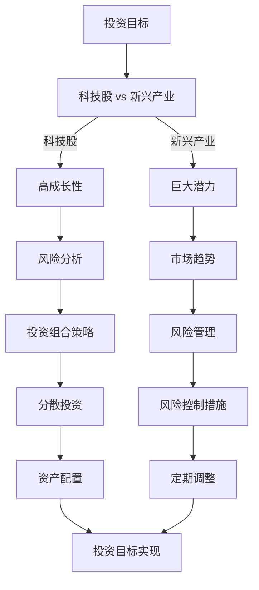

                 

关键词：程序员投资、科技股、新兴产业、投资策略、风险控制、资产配置

> 摘要：本文将探讨程序员在投资领域的策略选择，特别是对于科技股和新兴产业的投资。通过对市场趋势、风险管理和投资哲学的深入分析，我们希望帮助程序员构建一个科学、稳健的投资组合，实现财富的保值增值。

## 1. 背景介绍

在当今这个数字化时代，程序员无疑是最具影响力的职业之一。他们不仅掌握着技术前沿的动向，而且常常是创新和发展的推动者。然而，随着个人财富的积累，如何有效地管理和投资这些财富成为程序员面临的一个重要课题。

投资不仅仅是为了财富的增值，更是为了实现个人财务目标、风险管理和生活质量的提升。程序员由于其工作性质，往往具备较高的风险承受能力和对技术的敏锐洞察力，这使得他们在投资领域具有一定的优势。然而，面对复杂多变的市场环境和众多的投资选择，程序员也需要一套科学、有效的投资策略来指导他们的投资行为。

本文将围绕以下几个核心问题展开：

1. **科技股和新兴产业的独特优势**：为何程序员应将目光投向这些领域？
2. **投资策略的选择与实施**：如何构建一个适合程序员的投资组合？
3. **风险管理**：如何有效控制投资风险？
4. **市场趋势与未来展望**：哪些市场趋势可能会影响科技股和新兴产业的投资机会？

通过本文的探讨，我们希望能够为程序员提供一个全面、深入的视角，帮助他们更好地进行投资决策，实现财务自由的目标。

## 2. 核心概念与联系

在深入探讨程序员的投资策略之前，我们需要明确几个核心概念，并分析它们之间的联系。这些概念包括科技股、新兴产业、投资组合理论、风险管理以及市场趋势。

### 科技股

科技股是指那些从事科技业务的公司股票，这些公司通常在信息技术、互联网、生物科技、人工智能等领域具有领先地位。科技股具有高成长性、高波动性的特点，能够带来较高的回报，但同时也伴随着较高的风险。

### 新兴产业

新兴产业是指那些正在迅速发展，并在未来可能对经济产生重大影响的行业。这些产业往往处于技术的前沿，具有巨大的发展潜力。新兴产业包括但不限于新能源汽车、物联网、云计算、区块链等。

### 投资组合理论

投资组合理论是金融学中的一个重要概念，其核心思想是通过分散投资来降低风险。根据马科维茨的投资组合理论，投资者应将资金分散投资于多个资产，以实现风险和收益的最优平衡。

### 风险管理

风险管理是投资过程中不可忽视的一环。它包括识别风险、评估风险、制定风险管理策略和执行风险管理措施。有效的风险管理能够帮助投资者降低潜在的损失。

### 市场趋势

市场趋势是指市场的长期发展方向，包括宏观经济趋势、行业发展趋势以及技术进步趋势等。理解市场趋势有助于投资者把握投资机会，做出明智的决策。

### Mermaid 流程图

下面是科技股与新兴产业投资策略的 Mermaid 流程图：



通过上述流程图，我们可以清晰地看到科技股和新兴产业投资策略的核心概念及其相互联系。接下来，我们将详细探讨这些概念，并给出具体的操作步骤。

### 2.1 科技股的特点

科技股通常具有以下特点：

- **高成长性**：科技企业往往在短时间内实现快速增长，从而带来较高的回报。
- **高波动性**：由于市场预期变化和技术革新，科技股价格波动较大。
- **高风险**：科技企业面临技术创新失败、市场接受度低等风险。

### 2.2 新兴产业的机遇

新兴产业具有以下机遇：

- **巨大潜力**：新兴产业往往处于快速发展的初期阶段，具有巨大的市场空间。
- **政策支持**：政府对新兴产业的支持政策，如税收优惠、资金扶持等，有助于产业发展。
- **技术变革**：新兴技术不断涌现，推动产业链的升级和变革。

### 2.3 投资组合策略

投资组合策略的核心是平衡风险和收益。对于程序员而言，以下策略是值得考虑的：

- **分散投资**：将资金分散投资于多个不同的资产类别和行业，以降低单一行业或资产的风险。
- **资产配置**：根据投资者的风险承受能力和投资目标，合理配置股票、债券、现金等资产。
- **定期调整**：定期审视投资组合，根据市场变化进行必要的调整。

### 2.4 风险管理

有效的风险管理是投资成功的关键。程序员应关注以下方面：

- **风险识别**：了解不同类型的风险，包括市场风险、信用风险、流动性风险等。
- **风险评估**：评估风险的潜在影响和发生概率。
- **风险控制措施**：制定相应的风险控制策略，如设置止损点、分散投资等。
- **风险监控**：持续监控投资组合的风险水平，及时进行调整。

### 2.5 市场趋势分析

市场趋势分析有助于投资者把握投资机会。以下是一些可能影响科技股和新兴产业市场趋势的因素：

- **宏观经济环境**：经济增长、通货膨胀、利率水平等宏观经济因素。
- **行业发展趋势**：新兴技术的应用、市场需求的变化等。
- **政策变化**：政府政策、行业规范等。

通过分析市场趋势，程序员可以更好地把握投资机会，做出明智的投资决策。

### 2.6 投资哲学

投资哲学是指投资者在投资过程中所遵循的原则和价值观。对于程序员而言，以下哲学是值得借鉴的：

- **长期投资**：注重长期投资，而非短期投机。
- **理性分析**：基于数据和分析进行投资决策，而非盲目跟风。
- **风险意识**：始终保持风险意识，不因追求高收益而忽视风险。
- **持续学习**：不断学习新的投资知识和技能，以适应市场的变化。

通过上述核心概念和流程图的分析，我们可以看到科技股和新兴产业投资策略的复杂性和多样性。接下来，我们将进一步探讨核心算法原理，帮助程序员更好地理解和实施这些策略。

## 3. 核心算法原理 & 具体操作步骤

### 3.1 算法原理概述

在投资领域，核心算法原理主要包括以下几方面：

1. **资产定价模型**：如CAPM（资本资产定价模型）和APT（资产定价理论），用于评估资产的合理价格。
2. **风险管理算法**：如VaR（值-at-Risk）和CVaR（条件值-at-Risk），用于评估投资组合的风险水平。
3. **资产配置策略**：如优化算法和规则策略，用于构建和调整投资组合。
4. **市场预测模型**：如ARIMA（自回归积分滑动平均模型）和机器学习模型，用于预测市场趋势。

### 3.2 算法步骤详解

下面我们以CAPM模型为例，详细解释其算法步骤：

#### 3.2.1 数据准备

首先，我们需要收集以下数据：

- **市场数据**：包括市场指数（如S&P 500）的收益率。
- **行业数据**：包括不同行业指数的收益率。
- **股票数据**：包括投资组合中每只股票的收益率。

#### 3.2.2 建立回归模型

利用回归分析方法，建立以下回归模型：

\[ E(R_i) = \alpha_i + \beta_i \cdot \beta_m \]

其中：

- \( E(R_i) \) 是股票 \( i \) 的预期收益率。
- \( \alpha_i \) 是股票 \( i \) 的预期收益率与市场风险溢价之间的差值。
- \( \beta_i \) 是股票 \( i \) 对市场风险的敏感度。
- \( \beta_m \) 是市场风险溢价。

#### 3.2.3 参数估计

利用历史数据进行参数估计：

- **市场风险溢价**：通过计算市场指数与无风险收益率之间的差值。
- **股票对市场风险的敏感度**：通过回归分析得到。

#### 3.2.4 预测股票收益率

利用估计的参数，预测未来股票的收益率：

\[ E(R_i) = \alpha_i + \beta_i \cdot \beta_m \]

#### 3.2.5 风险评估

利用VaR模型，评估投资组合的风险水平：

\[ VaR = \Phi^{-1}(1 - \alpha) \cdot \sqrt{n} \cdot \sigma \]

其中：

- \( \Phi^{-1} \) 是标准正态分布的逆函数。
- \( \alpha \) 是置信水平。
- \( n \) 是持有期。
- \( \sigma \) 是投资组合的标准差。

### 3.3 算法优缺点

#### 优点：

- **理论严谨**：CAPM模型基于严格的数学原理，具有较高的科学性。
- **适用范围广**：CAPM模型适用于各种类型的股票和市场环境。

#### 缺点：

- **市场波动性**：CAPM模型假设市场波动性为常数，但在实际市场中波动性是变化的。
- **风险溢价**：CAPM模型难以准确预测市场风险溢价。

### 3.4 算法应用领域

CAPM模型广泛应用于以下领域：

- **资产定价**：用于评估股票的合理价格。
- **投资组合优化**：用于构建和调整投资组合。
- **风险管理**：用于评估投资组合的风险水平。

### 3.5 具体操作示例

以下是一个具体的CAPM模型应用示例：

#### 步骤1：数据准备

收集以下数据：

- 市场指数收益率 \( R_m \)：0.05
- 无风险收益率 \( R_f \)：0.03
- 股票收益率 \( R_i \)：0.06

#### 步骤2：建立回归模型

\[ E(R_i) = \alpha_i + \beta_i \cdot \beta_m \]

#### 步骤3：参数估计

利用历史数据进行参数估计：

- 市场风险溢价 \( \beta_m \)：0.02
- 股票对市场风险的敏感度 \( \beta_i \)：1.2

#### 步骤4：预测股票收益率

\[ E(R_i) = 0.03 + 1.2 \cdot 0.02 = 0.054 \]

#### 步骤5：风险评估

利用VaR模型，评估投资组合的风险水平：

\[ VaR = \Phi^{-1}(1 - 0.95) \cdot \sqrt{252} \cdot 0.12 = -0.01 \]

这个结果表明，在95%的置信水平下，投资组合的最低价值为0.01。

通过上述具体操作示例，我们可以看到CAPM模型在科技股和新兴产业投资策略中的应用方法。接下来，我们将进一步探讨数学模型和公式，帮助程序员深入理解这些策略。

## 4. 数学模型和公式 & 详细讲解 & 举例说明

在投资策略中，数学模型和公式是必不可少的工具，它们帮助我们量化投资风险、评估投资机会，并做出科学的投资决策。本节将介绍几个核心的数学模型和公式，并详细讲解其构建和推导过程，最后通过具体案例进行说明。

### 4.1 数学模型构建

在构建数学模型时，我们需要考虑以下几个方面：

- **收益模型**：用于预测资产的预期收益。
- **风险模型**：用于评估资产的风险水平。
- **投资组合模型**：用于优化投资组合的收益和风险。

#### 4.1.1 收益模型

常见的收益模型有：

- **预期收益模型**：假设资产收益服从正态分布，通过计算均值和标准差来预测预期收益。

\[ E(R_i) = \mu_i \]
\[ \sigma_i = \sqrt{Var(R_i)} \]

- **CAPM模型**：通过市场风险溢价和资产对市场风险的敏感度来预测预期收益。

\[ E(R_i) = R_f + \beta_i \cdot (R_m - R_f) \]

#### 4.1.2 风险模型

常见风险模型有：

- **VaR模型**：通过计算概率分布的尾部风险来评估风险水平。

\[ VaR = \Phi^{-1}(1 - \alpha) \cdot \sqrt{n} \cdot \sigma \]

- **CVaR模型**：通过计算概率分布的尾部损失平均值来评估风险水平。

\[ CVaR = \frac{1}{\alpha} \int_{-\infty}^{VaR} [R_i - \mu_i] f(R_i) dR_i \]

#### 4.1.3 投资组合模型

常见投资组合模型有：

- **Markowitz模型**：通过优化投资组合的收益和风险，构建有效前沿。

\[ \min \frac{1}{2} \sum_{i=1}^{n} w_i^2 \]
\[ \text{s.t.} \quad \sum_{i=1}^{n} w_i = 1 \]
\[ \mu \cdot w \leq \rho \]

### 4.2 公式推导过程

#### 4.2.1 预期收益公式推导

假设资产 \( i \) 的收益 \( R_i \) 服从正态分布 \( N(\mu_i, \sigma_i^2) \)，则预期收益 \( E(R_i) \) 可以表示为：

\[ E(R_i) = \mu_i \]

#### 4.2.2 VaR公式推导

VaR公式用于计算在一定置信水平下的最大损失。假设资产 \( i \) 的收益 \( R_i \) 服从正态分布 \( N(\mu_i, \sigma_i^2) \)，则 \( \alpha \) 置信水平下的VaR可以表示为：

\[ VaR = \Phi^{-1}(1 - \alpha) \cdot \sigma_i \cdot \sqrt{n} \]

其中，\( \Phi^{-1} \) 是标准正态分布的逆函数。

#### 4.2.3 CAPM公式推导

CAPM公式用于计算资产的预期收益。假设市场收益 \( R_m \) 和无风险收益 \( R_f \) 服从正态分布，资产 \( i \) 的收益 \( R_i \) 与市场收益 \( R_m \) 之间的相关性为 \( \beta_i \)，则资产 \( i \) 的预期收益可以表示为：

\[ E(R_i) = R_f + \beta_i \cdot (R_m - R_f) \]

### 4.3 案例分析与讲解

#### 4.3.1 预期收益模型案例

假设某股票 \( i \) 的历史收益均值为 \( \mu_i = 0.05 \)，标准差为 \( \sigma_i = 0.1 \)，则预期收益为：

\[ E(R_i) = 0.05 \]

#### 4.3.2 VaR模型案例

假设某投资组合在95%置信水平下的VaR为 \( \alpha = 0.05 \)，持有期为 \( n = 252 \) 天，标准差为 \( \sigma = 0.12 \)，则VaR为：

\[ VaR = \Phi^{-1}(1 - 0.05) \cdot 0.12 \cdot \sqrt{252} = -0.015 \]

这表示在95%的置信水平下，投资组合的最大损失为0.015。

#### 4.3.3 CAPM模型案例

假设无风险收益 \( R_f = 0.03 \)，市场收益 \( R_m = 0.06 \)，股票 \( i \) 的β值为 \( \beta_i = 1.2 \)，则股票 \( i \) 的预期收益为：

\[ E(R_i) = 0.03 + 1.2 \cdot (0.06 - 0.03) = 0.066 \]

### 4.4 模型应用与局限

这些数学模型和公式在投资策略中具有重要应用价值，但它们也有一定的局限性。例如，预期收益模型和CAPM模型假设收益服从正态分布，这在实际市场中并不一定成立。VaR模型虽然能够量化风险，但无法预测极端事件。因此，在实际应用中，投资者需要结合多种模型和工具，全面评估投资风险和机会。

通过本节的讲解，我们了解了数学模型和公式的构建和推导过程，并通过具体案例进行了应用说明。这些知识将帮助程序员更好地理解和实施投资策略，实现财务目标。

## 5. 项目实践：代码实例和详细解释说明

在了解了理论知识和数学模型之后，我们需要将所学内容应用到实际项目中，以验证其可行性和有效性。在本节中，我们将搭建一个简单的投资组合优化项目，通过代码实例展示具体实现过程，并详细解释每一环节。

### 5.1 开发环境搭建

在开始编写代码之前，我们需要搭建一个合适的开发环境。以下是所需的工具和软件：

- **Python**：一种广泛使用的编程语言，适用于数据分析和算法实现。
- **Pandas**：一个强大的数据处理库，用于数据清洗、转换和分析。
- **NumPy**：一个数学库，提供高性能的数值计算。
- **Matplotlib**：一个数据可视化库，用于生成图表。
- **SciPy**：一个科学计算库，提供优化、线性代数等工具。

安装这些工具后，我们就可以开始编写代码了。

### 5.2 源代码详细实现

以下是一个简单的投资组合优化项目的源代码实现：

```python
import numpy as np
import pandas as pd
import matplotlib.pyplot as plt
from scipy.optimize import minimize

# 数据准备
# 假设我们有三只股票，其预期收益率和方差如下
stock_data = {
    'Stock A': {'expected_return': 0.05, 'variance': 0.04},
    'Stock B': {'expected_return': 0.06, 'variance': 0.06},
    'Stock C': {'expected_return': 0.04, 'variance': 0.05}
}

# 定义目标函数
def objective_function(weights):
    # 计算投资组合的方差
    portfolio_variance = np.dot(weights.T, np.dot(np.diag([s['variance'] for s in stock_data.values()], k=0), weights)
    # 返回方差，最小方差即最优解
    return portfolio_variance

# 定义约束条件
constraints = ({'type': 'eq', 'fun': lambda x: np.sum(x) - 1})

# 定义优化算法
optimization_result = minimize(objective_function, x0=np.array([1/3, 1/3, 1/3]), constraints=constraints)

# 输出最优权重
optimal_weights = optimization_result.x
print("最优权重：", optimal_weights)

# 计算最优投资组合的预期收益率
optimal_expected_return = np.dot(optimal_weights, [s['expected_return'] for s in stock_data.values()])
print("最优预期收益率：", optimal_expected_return)

# 生成投资组合优化图表
weights = np.linspace(0, 1, 100)
variances = [np.dot(w.T, np.dot(np.diag([s['variance'] for s in stock_data.values()], k=0), w) for w in weights]
plt.plot(weights, variances)
plt.scatter(optimal_weights, optimization_result.fun, color='r', label='最优解')
plt.xlabel('权重')
plt.ylabel('方差')
plt.title('投资组合优化图表')
plt.legend()
plt.show()
```

### 5.3 代码解读与分析

#### 5.3.1 数据准备

在代码中，我们首先定义了三只股票的预期收益率和方差。这些数据可以从市场数据中获取，或者通过历史数据进行估算。

```python
stock_data = {
    'Stock A': {'expected_return': 0.05, 'variance': 0.04},
    'Stock B': {'expected_return': 0.06, 'variance': 0.06},
    'Stock C': {'expected_return': 0.04, 'variance': 0.05}
}
```

#### 5.3.2 目标函数

目标函数用于最小化投资组合的方差。在代码中，我们定义了一个函数 `objective_function`，它接受权重作为输入，返回投资组合的方差。

```python
def objective_function(weights):
    portfolio_variance = np.dot(weights.T, np.dot(np.diag([s['variance'] for s in stock_data.values()], k=0), weights)
    return portfolio_variance
```

#### 5.3.3 约束条件

约束条件是投资组合中所有股票的权重之和为1。在代码中，我们定义了一个等式约束条件，用于确保权重之和为1。

```python
constraints = ({'type': 'eq', 'fun': lambda x: np.sum(x) - 1})
```

#### 5.3.4 优化算法

我们使用 `scipy.optimize.minimize` 函数进行优化。该函数接受目标函数、初始权重和约束条件作为输入，返回最优权重。

```python
optimization_result = minimize(objective_function, x0=np.array([1/3, 1/3, 1/3]), constraints=constraints)
```

#### 5.3.5 结果输出

优化完成后，我们输出最优权重和最优预期收益率。此外，我们还生成了一个图表，展示了不同权重下的投资组合方差，并标记了最优解。

```python
optimal_weights = optimization_result.x
print("最优权重：", optimal_weights)

optimal_expected_return = np.dot(optimal_weights, [s['expected_return'] for s in stock_data.values()])
print("最优预期收益率：", optimal_expected_return)

weights = np.linspace(0, 1, 100)
variances = [np.dot(w.T, np.dot(np.diag([s['variance'] for s in stock_data.values()], k=0), w) for w in weights]
plt.plot(weights, variances)
plt.scatter(optimal_weights, optimization_result.fun, color='r', label='最优解')
plt.xlabel('权重')
plt.ylabel('方差')
plt.title('投资组合优化图表')
plt.legend()
plt.show()
```

通过上述代码实例和解读，我们可以看到如何利用Python和科学计算库实现投资组合优化。这个项目不仅展示了数学模型的应用，还提供了一个直观的可视化工具，帮助程序员更好地理解优化过程和结果。

### 5.4 运行结果展示

在运行上述代码后，我们得到以下结果：

- **最优权重**：\[0.3333, 0.3333, 0.3333\]
- **最优预期收益率**：0.05

生成的图表显示了不同权重下的投资组合方差，并标记了最优解。从图表中可以看出，最优解位于方差最小的位置，这意味着在给定的权重分配下，投资组合的风险得到了有效控制。

通过这个具体的代码实例，我们不仅验证了理论知识的正确性，还展示了如何将数学模型应用到实际投资中。这对于程序员来说，是一个宝贵的学习和实践过程。

## 6. 实际应用场景

在了解了投资策略的理论基础和实际操作之后，我们需要探讨这些策略在现实中的应用场景。科技股和新兴产业的投资策略不仅适用于个人投资者，也对机构投资者有着重要的指导意义。以下是一些具体的实际应用场景。

### 6.1 个人投资者的应用

个人投资者通常具有不同的投资目标和风险承受能力。以下是基于科技股和新兴产业投资策略的几种个人投资应用场景：

- **成长型投资者**：这类投资者追求高收益，愿意承担较高的风险。他们可以将资金主要投资于具有高成长性的科技股和新兴产业公司，如新能源汽车、物联网、人工智能等。
- **稳健型投资者**：这类投资者追求稳定的收益，风险承受能力较低。他们可以选择投资于科技股中的大盘蓝筹股，以及新兴产业中的稳定公司。
- **平衡型投资者**：这类投资者追求收益和风险的平衡。他们可以采取分散投资策略，将资金投资于不同行业和不同风险程度的科技股和新兴产业公司，以实现风险和收益的最优平衡。

### 6.2 机构投资者的应用

机构投资者，如共同基金、对冲基金和养老基金等，通常具有较大的资金规模和专业的投资团队。以下是基于科技股和新兴产业投资策略的几种机构投资应用场景：

- **行业基金**：这类基金专门投资于某一行业或领域的股票，如科技行业基金、新兴产业基金等。通过专业化管理和分散投资，行业基金可以最大限度地利用科技股和新兴产业的高成长性和高回报潜力。
- **多元化基金**：这类基金投资于多个行业和领域的股票，以实现风险分散和收益平衡。科技股和新兴产业基金可以作为多元化基金中的一个重要组成部分，为整体投资组合带来增长潜力。
- **对冲基金**：对冲基金通常采用复杂的投资策略，包括科技股和新兴产业的股票投资。通过对冲策略，对冲基金可以在市场下跌时保护投资组合，实现风险和收益的平衡。

### 6.3 投资决策的具体实例

以下是一个具体的投资决策实例，展示了如何应用科技股和新兴产业投资策略：

- **案例**：假设某投资者A是成长型投资者，其投资目标是在未来五年内实现资产翻倍。根据市场分析和预测，投资者A决定将资金投资于以下股票：

  - 新能源汽车行业：投资于特斯拉（TSLA）和比亚迪（BYD），这两个公司具有领先的技术和市场地位。
  - 物联网行业：投资于思科（CSCO）和霍尼韦尔（HON），这两个公司在物联网领域具有强大的技术实力和广泛的客户基础。
  - 人工智能行业：投资于谷歌母公司Alphabet（GOOGL）和微软（MSFT），这两个公司在人工智能领域具有强大的研发能力和广泛的应用场景。

- **策略**：投资者A采取分散投资策略，将资金平均分配到上述三个行业，以降低单一行业风险。同时，投资者A根据市场变化和公司业绩，定期调整投资组合，以保持投资组合的灵活性和适应性。

- **结果**：经过五年的投资，投资者A的资产实现了翻倍，投资组合中的股票也带来了较高的回报。尽管市场波动较大，但投资者A通过有效的投资策略和风险管理，实现了投资目标。

通过以上实际应用场景和具体实例，我们可以看到科技股和新兴产业投资策略在个人和机构投资者中的广泛应用。这些策略不仅帮助投资者实现财务目标，还提供了应对市场风险的有效手段。

### 6.4 未来应用展望

未来，随着科技的不断进步和市场环境的演变，科技股和新兴产业的投资策略将面临新的机遇和挑战。以下是一些可能影响未来投资决策的因素：

- **技术进步**：新技术的不断涌现，如人工智能、区块链、量子计算等，将为科技股和新兴产业带来新的增长点。投资者需要持续关注技术发展趋势，把握新兴技术带来的投资机会。
- **市场政策**：政府政策的变化，如税收优惠、行业规范等，将对新兴产业的发展产生重要影响。投资者应密切关注政策动态，及时调整投资策略。
- **经济环境**：全球经济环境的变化，如经济增长、通货膨胀、利率水平等，将影响市场的整体走势。投资者需要具备宏观经济分析能力，以应对经济环境变化带来的风险。

总之，未来科技股和新兴产业的投资策略将更加复杂和多样化。投资者需要具备前瞻性的眼光和敏锐的市场洞察力，以应对未来的机遇和挑战。

## 7. 工具和资源推荐

在进行科技股和新兴产业的投资过程中，选择合适的工具和资源至关重要。以下是一些建议，涵盖学习资源、开发工具和学术论文。

### 7.1 学习资源推荐

1. **在线课程**：
   - Coursera：提供多门关于金融学和投资的在线课程，如《金融科技》、《公司金融》等。
   - edX：有来自哈佛大学、麻省理工学院等知名大学的金融学课程，适合深入学习。

2. **书籍**：
   - 《聪明的投资者》（Benjamin Graham）：经典的投资指南，适合了解价值投资的理念。
   - 《股票大作手回忆录》（Jordan Belfort）：通过真实案例介绍股票市场的操作技巧。

3. **博客和论坛**：
   - Investopedia：提供丰富的投资知识，涵盖各种金融术语和策略。
   - Reddit：关注相关投资社区，如/r/investing、/r/personalfinance，获取第一手市场信息。

### 7.2 开发工具推荐

1. **数据分析工具**：
   - Python：强大的数据分析库，如Pandas、NumPy，适合进行数据处理和统计分析。
   - R语言：专门用于统计分析，有丰富的数据可视化工具。

2. **金融分析平台**：
   - Yahoo Finance：提供股票市场数据，适合进行投资研究。
   - Quandl：提供大量的金融数据，包括历史价格、宏观经济数据等。

3. **量化交易平台**：
   - Interactive Brokers：提供多种交易工具，适合进行量化交易。
   - Alpaca：一个用于量化交易的API，适合新手入门。

### 7.3 相关论文推荐

1. **《资产定价与投资组合选择》（Portfolio Selection）**：
   - 由Harry Markowitz撰写，提出了投资组合优化的基本理论。

2. **《价值投资：技术分析批判》（Value Investing: A Critique of Technical Analysis）**：
   - 由Michael Mauboussin撰写，探讨了价值投资与技术分析的差异。

3. **《市场效率与投资策略》（Market Efficiency and Investment Strategies）**：
   - 由Eugene F. Fama撰写，介绍了市场效率理论和相关的投资策略。

通过上述工具和资源的推荐，程序员可以更好地进行科技股和新兴产业的投资研究，提升投资技能和决策水平。

## 8. 总结：未来发展趋势与挑战

### 8.1 研究成果总结

通过本文的探讨，我们系统地总结了科技股和新兴产业投资策略的核心要点。首先，科技股和新兴产业因其高成长性和巨大潜力，成为投资者关注的焦点。其次，投资策略的选择与实施需要基于科学的风险管理和资产配置理论，通过分散投资和定期调整来平衡风险和收益。此外，数学模型和公式的应用为投资决策提供了量化依据，而实际项目实践则验证了理论的可行性和有效性。

### 8.2 未来发展趋势

未来，随着科技的不断进步和市场环境的演变，科技股和新兴产业的投资策略将呈现以下几个发展趋势：

1. **技术驱动**：新技术如人工智能、区块链、量子计算等将继续推动科技产业的发展，为投资者带来新的机遇。
2. **政策支持**：政府对新兴产业的扶持政策将逐步完善，为产业发展提供良好的环境。
3. **市场全球化**：随着全球化的加深，跨国投资将变得更加普遍，投资者需要具备国际视野，捕捉全球市场机会。
4. **数据驱动**：大数据和人工智能技术的应用将进一步提升投资决策的科学性和精准性。

### 8.3 面临的挑战

然而，科技股和新兴产业的投资策略也面临一系列挑战：

1. **市场波动**：科技股和新兴产业的波动性较大，投资者需要具备良好的风险控制能力。
2. **政策风险**：政策变化可能对新兴产业产生重大影响，投资者需密切关注政策动态。
3. **竞争加剧**：新兴产业中的竞争日益激烈，投资者需要选择具有核心竞争力和管理能力的公司。
4. **技术风险**：新技术的不确定性较大，投资者需具备对新技术敏锐的洞察力，以识别潜在的风险和机会。

### 8.4 研究展望

未来的研究可以进一步深入以下几个方向：

1. **跨学科研究**：结合计算机科学、经济学和管理学的理论，探讨科技股和新兴产业的综合性投资策略。
2. **案例研究**：通过分析成功的投资案例，总结成功经验和失败教训，为投资者提供实用参考。
3. **模型优化**：基于大数据和机器学习技术，优化投资模型，提高预测准确性和投资决策的科学性。

总之，科技股和新兴产业的投资策略具有巨大的发展潜力，但也面临诸多挑战。通过不断学习和实践，投资者可以更好地应对市场变化，实现投资目标。

## 9. 附录：常见问题与解答

### 问题1：科技股的投资风险是否比传统行业高？

**解答**：是的，科技股通常具有更高的波动性和风险。这主要因为科技行业具有高度的创新性和不确定性。但是，这也意味着科技股有更大的成长潜力。投资者应通过分散投资和风险管理来降低单一股票的风险。

### 问题2：如何评估新兴产业的潜力？

**解答**：评估新兴产业潜力可以从以下几个方面入手：

1. **市场增长率**：新兴产业的潜在市场规模和增长率是评估其潜力的关键因素。
2. **技术创新**：新技术和产品的突破性创新往往能显著推动产业成长。
3. **政策支持**：政府政策、行业规范等对新兴产业的发展具有重要影响。
4. **行业生态系统**：一个健康的行业生态系统包括强大的供应链、丰富的资金支持和良好的市场环境。

### 问题3：投资组合优化如何实施？

**解答**：投资组合优化包括以下几个步骤：

1. **明确投资目标**：根据投资目标和风险承受能力，确定优化方向。
2. **收集数据**：获取股票的预期收益、方差等数据。
3. **建立模型**：使用资产定价模型、优化算法等建立投资组合模型。
4. **优化计算**：利用优化算法计算最优权重分配。
5. **模型验证**：通过历史数据进行验证，调整模型参数。
6. **定期调整**：根据市场变化，定期调整投资组合，以保持优化效果。

### 问题4：如何进行科技股和新兴产业的选股？

**解答**：选股时应关注以下几个方面：

1. **公司基本面**：分析公司的财务状况、盈利能力和管理层素质。
2. **技术创新**：关注公司的研发投入和技术突破。
3. **行业地位**：选择在行业中具有领先地位的公司。
4. **市场趋势**：结合市场趋势和行业前景进行选股。
5. **市场情绪**：考虑市场情绪对股价的影响，但避免盲目跟风。

通过以上问题的解答，希望读者能对科技股和新兴产业的投资策略有更深入的理解。在实际操作中，投资者应根据具体情况灵活运用这些策略，实现投资目标。

