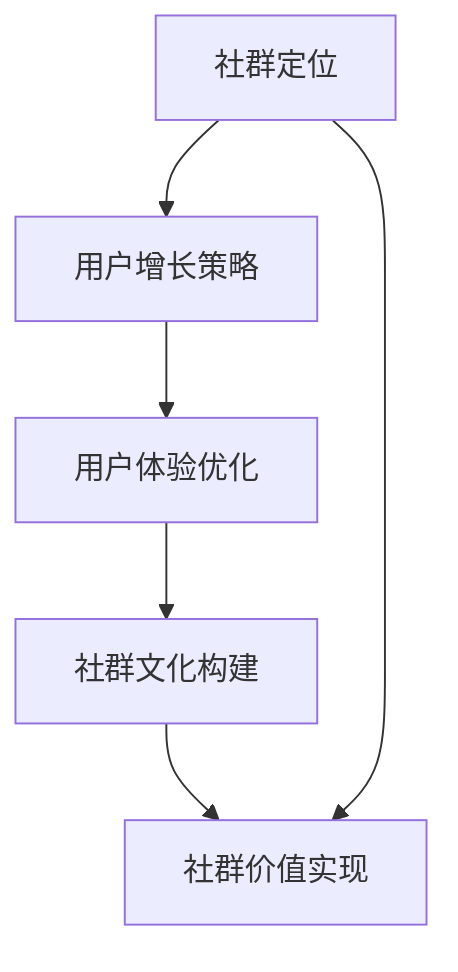

                 

关键词：程序员、知识社群、运营、增长策略、用户获取、用户体验、互动设计

> 摘要：本文将深入探讨程序员在创建和维护知识社群时的策略与技巧。从社群的创立初期，到用户数量的稳步增长，再到构建积极互动的社群文化，我们将分析各个环节的关键要素，帮助程序员构建一个充满活力和价值的知识社群。

## 1. 背景介绍

随着互联网技术的迅猛发展，程序员不再仅仅局限于编写代码，他们的角色逐渐多元化，成为技术社区的活跃分子。知识社群作为一种新兴的网络组织形式，逐渐成为程序员交流、学习、分享的重要平台。然而，如何有效地运营这样一个社群，吸引并留住用户，成为许多程序员面临的挑战。

本文旨在探讨程序员如何从零开始构建一个知识社群，并逐步实现用户数量的增长，最终形成一个有深度和温度的社群生态。本文将围绕以下几个方面展开讨论：

- **社群定位与目标设定**：明确社群的核心价值和目标，为后续的运营和推广奠定基础。
- **用户增长策略**：通过有效的推广和运营手段，实现用户数量的增长。
- **用户体验优化**：设计符合用户需求的功能和互动方式，提升用户满意度和粘性。
- **社群文化构建**：建立积极、健康的社群氛围，培养用户的归属感和参与感。

## 2. 核心概念与联系

在讨论程序员的知识社群运营之前，我们需要了解一些核心概念及其相互关系。以下是一个简化的 Mermaid 流程图，展示了这些概念之间的联系。



### 2.1 社群定位

社群定位是社群运营的基石。一个清晰的定位能够帮助社群吸引到与其价值观相符的用户，并明确社群的发展方向。

### 2.2 用户增长策略

用户增长策略是社群实现快速增长的关键。有效的推广、活动和内容创作都是这一环节的重要组成部分。

### 2.3 用户体验优化

用户体验优化关注的是如何让用户在使用社群时感到舒适和满意。良好的用户体验能够提高用户的忠诚度和活跃度。

### 2.4 社群文化构建

社群文化构建是维系社群成员关系和氛围的重要手段。一个积极、健康的社群文化能够增强用户的归属感和参与感。

### 2.5 社群价值实现

社群价值实现是指社群为成员带来的实际收益和成长。这包括知识共享、职业发展、人脉拓展等方面。

## 3. 核心算法原理 & 具体操作步骤

### 3.1 算法原理概述

在程序员的知识社群运营中，我们可以借鉴一些经典的算法原理，如网络爬虫算法、推荐系统算法等。这些算法的核心思想在于：

- **数据抓取**：通过爬虫技术获取有价值的信息和数据。
- **数据分析**：利用数据分析技术，挖掘用户的兴趣和行为模式。
- **内容推荐**：根据用户的兴趣和行为，推荐相关的内容和活动。

### 3.2 算法步骤详解

#### 3.2.1 数据抓取

数据抓取是社群运营的第一步。我们需要确定抓取的目标网站和数据类型，然后使用爬虫工具进行数据采集。常用的爬虫工具包括 Python 的 `requests` 和 `BeautifulSoup` 等。

#### 3.2.2 数据分析

数据抓取完成后，我们需要对数据进行清洗和处理，提取出有用的信息。常用的数据分析工具包括 Python 的 `Pandas` 和 `NumPy` 等。

#### 3.2.3 内容推荐

基于用户兴趣和行为分析，我们可以使用推荐系统算法，为用户推荐相关的内容和活动。常用的推荐算法包括协同过滤算法、基于内容的推荐算法等。

### 3.3 算法优缺点

#### 优点

- **高效性**：算法能够快速获取和处理大量数据，提高运营效率。
- **个性化**：通过推荐系统，能够为用户提供个性化的内容和服务，提升用户体验。

#### 缺点

- **数据隐私**：爬虫技术可能涉及数据隐私问题，需要严格遵守相关法律法规。
- **计算成本**：数据分析过程可能需要大量计算资源，增加运营成本。

### 3.4 算法应用领域

算法在程序员的知识社群运营中有着广泛的应用。例如：

- **内容推荐**：根据用户兴趣推荐相关文章、教程和活动。
- **用户增长**：通过数据分析，识别潜在用户，制定针对性的推广策略。
- **社群管理**：利用算法分析用户行为，优化社群结构和氛围。

## 4. 数学模型和公式 & 详细讲解 & 举例说明

在程序员的知识社群运营中，数学模型和公式可以帮助我们更精确地描述和预测社群的行为和趋势。以下是一个简单的数学模型，用于预测社群的用户增长。

### 4.1 数学模型构建

假设社群的用户增长遵循指数增长模型，其数学公式如下：

\[ P(t) = P_0 \cdot e^{rt} \]

其中，\( P(t) \) 表示时间 \( t \) 时社群的用户数量，\( P_0 \) 是初始用户数量，\( r \) 是增长速率，\( e \) 是自然对数的底数。

### 4.2 公式推导过程

指数增长模型的推导基于以下假设：

- 社群的用户增长是连续且稳定的。
- 新用户的引入是线性的，与时间成比例。

### 4.3 案例分析与讲解

假设一个知识社群在创立初期有 100 名用户，每月增长率为 10%，我们可以使用上述公式预测 6 个月后的用户数量。

\[ P(6) = 100 \cdot e^{0.1 \cdot 6} \approx 162 \]

这意味着在 6 个月后，社群的用户数量将达到约 162 人。

## 5. 项目实践：代码实例和详细解释说明

### 5.1 开发环境搭建

在本案例中，我们将使用 Python 编写一个简单的社群用户增长预测脚本。首先，确保安装了 Python 和必要的库，如 `numpy` 和 `matplotlib`。

### 5.2 源代码详细实现

```python
import numpy as np
import matplotlib.pyplot as plt

# 初始参数
P_0 = 100  # 初始用户数量
r = 0.1    # 每月增长率
t = np.arange(0, 6, 0.1)  # 时间序列

# 指数增长模型计算
P_t = P_0 * np.exp(r * t)

# 绘图展示
plt.plot(t, P_t)
plt.xlabel('Time (Months)')
plt.ylabel('Number of Users')
plt.title('Community User Growth Prediction')
plt.grid()
plt.show()
```

### 5.3 代码解读与分析

- `import numpy as np` 和 `import matplotlib.pyplot as plt`：导入必要的库。
- `P_0 = 100` 和 `r = 0.1`：设置初始参数。
- `t = np.arange(0, 6, 0.1)`：生成时间序列。
- `P_t = P_0 * np.exp(r * t)`：计算指数增长模型的结果。
- `plt.plot(t, P_t)`：绘制用户增长曲线。
- `plt.xlabel('Time (Months)')`、`plt.ylabel('Number of Users')` 和 `plt.title('Community User Growth Prediction')`：设置坐标轴标签和标题。
- `plt.grid()`：添加网格线。
- `plt.show()`：显示绘图。

### 5.4 运行结果展示

运行上述代码，我们可以看到一个随时间增长的曲线，预测了社群在未来 6 个月内的用户数量。

## 6. 实际应用场景

程序员的知识社群可以在多个领域发挥重要作用，以下是一些典型的应用场景：

- **技术交流**：程序员可以分享最新的技术动态、经验教训和解决方案，促进技术交流。
- **知识共享**：社群成员可以共同学习和探讨技术知识，提高个人和团队的技能水平。
- **职业发展**：通过社群，程序员可以拓展人脉、寻求职业机会，实现个人和职业的成长。
- **项目合作**：社群成员可以基于共同兴趣，发起和参与项目合作，推动技术进步和创新。

## 7. 未来应用展望

随着人工智能和大数据技术的不断发展，程序员的知识社群将迎来更加广阔的应用前景。以下是一些未来应用展望：

- **个性化推荐**：基于用户兴趣和行为分析，提供更加精准和个性化的内容推荐。
- **智能社群管理**：利用人工智能技术，实现社群的自动化管理和优化，提高运营效率。
- **多语言支持**：拓展社群的国际影响力，支持多种语言，吸引全球程序员参与。
- **虚拟社群体验**：结合虚拟现实技术，打造沉浸式的社群体验，提升用户粘性。

## 8. 工具和资源推荐

### 8.1 学习资源推荐

- **技术博客**：例如，GitHub、Medium 等平台上的技术文章，可以帮助程序员学习最新的技术动态。
- **在线教程**：例如，Udemy、Coursera 等在线教育平台，提供丰富的编程课程和教程。
- **技术社区**：例如，Stack Overflow、Reddit 等技术社区，是程序员交流和解决问题的优秀平台。

### 8.2 开发工具推荐

- **版本控制工具**：例如，Git，用于代码的版本管理和协作开发。
- **集成开发环境**：例如，Visual Studio Code、PyCharm，提供强大的编程功能和工具支持。
- **自动化测试工具**：例如，JUnit、TestNG，用于编写和执行自动化测试。

### 8.3 相关论文推荐

- **"Community Structure in Social Media"**：研究社交媒体中的社群结构，探讨社群的形成和发展机制。
- **"The Science of Programming"**：探讨编程的本质和方法论，对程序员的知识社群运营有启示意义。

## 9. 总结：未来发展趋势与挑战

程序员的知识社群在未来将继续快速发展，面临以下发展趋势和挑战：

### 9.1 研究成果总结

- **社群个性化**：通过大数据分析和人工智能技术，实现更加精准和个性化的社群服务。
- **跨界融合**：不同领域的程序员和专业人士将在社群中融合，推动技术发展和创新。

### 9.2 未来发展趋势

- **智能社群**：利用人工智能技术，实现社群的自动化管理和优化，提高运营效率。
- **国际社群**：拓展社群的国际影响力，吸引全球程序员参与，促进跨文化交流。

### 9.3 面临的挑战

- **数据隐私**：在利用大数据分析的同时，要确保用户数据的隐私和安全。
- **社群管理**：如何维护社群的秩序和氛围，保持社群的活力和健康。

### 9.4 研究展望

- **跨学科研究**：结合社会学、心理学等多学科知识，深入研究程序员社群的行为和机制。
- **技术创新**：不断探索和应用新技术，为程序员的知识社群提供更高效、更便捷的服务。

## 10. 附录：常见问题与解答

### 10.1 如何选择社群的定位？

- **确定目标用户**：明确社群面向的用户群体，了解他们的需求和兴趣。
- **分析竞争对手**：研究同类型的社群，分析其优势和不足，确定自身的差异化定位。
- **长期发展规划**：考虑社群的未来发展方向和目标，确保定位与规划一致。

### 10.2 如何提升用户体验？

- **优化内容质量**：提供高质量、有价值的内容，满足用户的需求。
- **简化操作流程**：简化用户的操作流程，提高使用便捷性。
- **互动设计**：设计多样化的互动方式，如问答、讨论、活动等，增加用户的参与度。
- **个性化推荐**：根据用户兴趣和行为，提供个性化的内容推荐。

### 10.3 如何维护社群文化？

- **树立榜样**：鼓励社群中的优秀成员发挥榜样作用，树立正面形象。
- **规范管理**：制定合理的社群规则，明确奖惩机制，维护社群秩序。
- **持续沟通**：定期与社群成员沟通，了解他们的意见和建议，及时解决问题。
- **文化建设活动**：组织多样化的文化建设活动，如社群庆典、主题日等，增强成员的归属感。

作者：禅与计算机程序设计艺术 / Zen and the Art of Computer Programming

以上，是关于程序员的知识社群运营：从0到10000用户的一篇完整技术博客文章。希望对您在构建和运营知识社群时有所帮助。如果还有其他问题或需求，欢迎随时提问。

