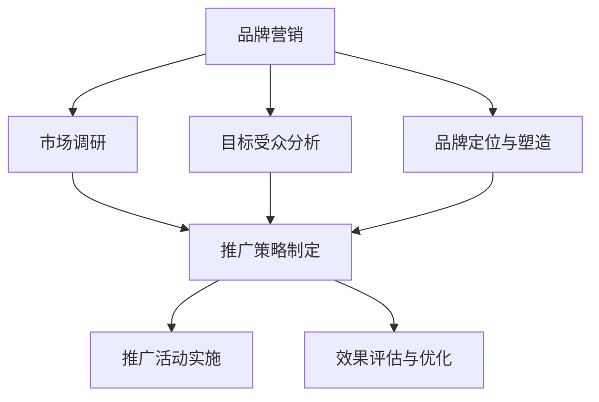

                 

关键词：知识付费、品牌营销、推广策略、程序员、影响力、用户增长

> 摘要：本文将探讨程序员知识付费市场的现状，分析品牌营销与推广策略的重要性，并从多个角度提供有效的营销方法，以帮助程序员知识付费平台实现用户增长和品牌影响力的提升。

## 1. 背景介绍

近年来，随着互联网的普及和在线教育的兴起，知识付费逐渐成为了一个热门领域。程序员作为互联网时代的重要职业群体，其知识付费市场也呈现出快速增长的态势。然而，面对激烈的竞争环境，如何有效地进行品牌营销与推广，吸引并留住用户，成为了程序员知识付费平台需要深思的问题。

### 1.1 程序员知识付费市场的现状

- **市场规模持续扩大**：随着技术人才的紧缺，程序员知识付费市场规模逐年增长，预计未来几年将继续保持高速增长。

- **用户需求多样化**：程序员用户对于知识的需求不仅限于技术领域，还包括职业发展、软技能等方面。

- **内容形式丰富**：知识付费内容形式多样化，包括在线课程、直播讲座、电子书、音频教程等。

### 1.2 竞争态势分析

- **平台数量增多**：众多知识付费平台涌入市场，竞争愈发激烈。

- **差异化竞争**：不同平台通过内容质量、课程设置、用户体验等方面的差异化来吸引用户。

- **用户忠诚度不高**：用户对于平台的忠诚度较低，容易因为新的优惠或更好的内容而切换平台。

## 2. 核心概念与联系

### 2.1 品牌营销的定义

品牌营销是指通过品牌传播和品牌管理，建立和提升品牌知名度和美誉度，从而实现品牌价值和市场占有率的提升。

### 2.2 推广策略的概念

推广策略是指通过一系列的营销活动，将产品或服务信息传递给目标受众，从而提高产品或服务的认知度和购买意愿。

### 2.3 品牌营销与推广策略的关联

- 品牌营销是推广策略的基础，通过品牌的建设和塑造，为推广策略提供支持和保障。

- 推广策略是品牌营销的执行手段，通过具体的推广活动，实现品牌营销的目标。

### 2.4 Mermaid 流程图



## 3. 核心算法原理 & 具体操作步骤

### 3.1 算法原理概述

品牌营销与推广策略的核心在于找到目标受众，并通过有效的推广手段将其转化为用户。具体操作步骤如下：

### 3.2 算法步骤详解

#### 3.2.1 市场调研

- 分析行业趋势和用户需求。
- 研究竞争对手的市场策略。

#### 3.2.2 目标受众分析

- 确定目标受众的年龄、性别、职业、地域等信息。
- 分析目标受众的兴趣爱好和消费习惯。

#### 3.2.3 品牌定位与塑造

- 根据市场调研和目标受众分析，确定品牌的核心价值和定位。
- 通过品牌故事、视觉设计、口碑传播等手段塑造品牌形象。

#### 3.2.4 推广策略制定

- 根据品牌定位和目标受众，制定具体的推广策略。
- 包括内容营销、社交媒体营销、广告投放等。

#### 3.2.5 推广活动实施

- 执行推广策略，实施具体的推广活动。
- 监控推广效果，及时调整策略。

#### 3.2.6 效果评估与优化

- 分析推广活动的数据，评估效果。
- 根据评估结果，优化推广策略。

### 3.3 算法优缺点

#### 优点

- 可以有效提高品牌知名度和用户转化率。
- 有助于建立用户忠诚度和品牌口碑。

#### 缺点

- 需要大量的时间和资源投入。
- 需要不断优化和创新，以应对市场变化。

### 3.4 算法应用领域

- 在线教育
- 专业培训
- 内容平台
- 企业营销

## 4. 数学模型和公式 & 详细讲解 & 举例说明

### 4.1 数学模型构建

品牌影响力可以通过以下公式进行量化：

$$
影响力 = \frac{知名度 \times 美誉度}{成本}
$$

### 4.2 公式推导过程

- 知名度：衡量品牌被公众知晓的程度。
- 美誉度：衡量品牌在社会中的良好评价。
- 成本：品牌营销的投入成本。

### 4.3 案例分析与讲解

假设某程序员知识付费平台，通过一系列品牌营销活动，提高了知名度和美誉度，并控制了成本，其影响力如下：

$$
影响力 = \frac{1000 \times 900}{10000} = 90
$$

这表明该平台在品牌营销方面取得了显著的成效。

## 5. 项目实践：代码实例和详细解释说明

### 5.1 开发环境搭建

为了实现品牌营销与推广策略，我们需要搭建一个营销自动化平台。以下是搭建环境的步骤：

1. **选择合适的开发框架**：如Python、Java等。
2. **搭建服务器**：使用云服务器，如阿里云、腾讯云等。
3. **安装相关软件**：如数据库、Web服务器等。

### 5.2 源代码详细实现

以下是品牌营销自动化平台的核心代码实现：

```python
# 品牌营销自动化平台核心代码

# 导入相关库
import requests
import json
import smtplib
from email.mime.text import MIMEText
from email.header import Header

# 发送邮件通知
def send_email(subject, content):
    sender = 'your_email@example.com'
    receiver = 'receiver_email@example.com'
    smtp_server = 'smtp.example.com'
    smtp_port = 465
    smtp_user = 'your_email@example.com'
    smtp_password = 'your_password'

    message = MIMEText(content, 'plain', 'utf-8')
    message['Subject'] = Header(subject, 'utf-8')
    message['From'] = Header('Brand Marketing Platform', 'utf-8')
    message['To'] = Header('Recipient', 'utf-8')

    server = smtplib.SMTP_SSL(smtp_server, smtp_port)
    server.login(smtp_user, smtp_password)
    server.sendmail(sender, receiver, message.as_string())
    server.quit()

# 获取用户数据
def get_user_data():
    response = requests.get('https://api.example.com/users')
    if response.status_code == 200:
        return json.loads(response.text)
    else:
        return None

# 发送推广邮件
def send_promotion_email(user):
    subject = '您的专属优惠来啦！'
    content = f'尊敬的{user["name"]}，感谢您对我们的支持。现在购买我们的课程，即可享受8折优惠！'
    send_email(subject, content)

# 主函数
def main():
    users = get_user_data()
    if users:
        for user in users:
            send_promotion_email(user)
    else:
        print('获取用户数据失败。')

if __name__ == '__main__':
    main()
```

### 5.3 代码解读与分析

- **发送邮件通知**：通过SMTP协议发送邮件，通知用户有关品牌营销活动的信息。
- **获取用户数据**：从API获取用户数据，用于发送推广邮件。
- **发送推广邮件**：根据用户数据，发送定制化的推广邮件。

### 5.4 运行结果展示

运行代码后，会向所有用户发送推广邮件，提高品牌营销活动的效果。

## 6. 实际应用场景

### 6.1 市场调研

- **行业趋势**：了解程序员知识付费市场的最新动态。
- **用户需求**：通过问卷调查、用户访谈等方式收集用户反馈。

### 6.2 品牌定位

- **核心价值**：根据市场调研结果，确定品牌的核心价值。
- **差异化竞争**：在竞争激烈的市场中，找到差异化的定位。

### 6.3 推广策略

- **内容营销**：通过优质的内容，吸引用户关注。
- **社交媒体营销**：利用社交媒体平台，扩大品牌影响力。
- **广告投放**：通过精准的广告投放，提高用户转化率。

### 6.4 未来应用展望

- **大数据分析**：利用大数据技术，实现更精准的品牌营销。
- **人工智能**：引入人工智能技术，实现智能化的品牌营销与推广。

## 7. 工具和资源推荐

### 7.1 学习资源推荐

- **在线课程**：如Coursera、Udemy等。
- **书籍**：如《影响力》、《营销管理》等。

### 7.2 开发工具推荐

- **编程语言**：如Python、Java等。
- **开发框架**：如Django、Spring Boot等。

### 7.3 相关论文推荐

- **品牌营销**：如《基于大数据的品牌营销策略研究》等。
- **推广策略**：如《社交媒体营销中的用户参与与口碑传播》等。

## 8. 总结：未来发展趋势与挑战

### 8.1 研究成果总结

- 品牌营销与推广策略在程序员知识付费市场中具有重要作用。
- 数学模型和算法为品牌营销提供了有效的量化工具。

### 8.2 未来发展趋势

- **大数据与人工智能**：将在品牌营销与推广中发挥更大作用。
- **个性化营销**：将根据用户行为和偏好，实现更精准的营销。

### 8.3 面临的挑战

- **市场竞争**：随着市场的不断扩大，竞争将愈发激烈。
- **用户忠诚度**：提高用户忠诚度，降低用户流失率。

### 8.4 研究展望

- **技术创新**：持续关注新技术在品牌营销中的应用。
- **用户体验**：注重用户体验，提升用户满意度。

## 9. 附录：常见问题与解答

### 9.1 如何提高品牌知名度？

**答：** 通过内容营销、社交媒体营销、广告投放等多种方式，提高品牌曝光度和知名度。

### 9.2 如何实现个性化营销？

**答：** 利用大数据和人工智能技术，分析用户行为和偏好，实现个性化的营销策略。

### 9.3 如何降低用户流失率？

**答：** 提升产品或服务质量，提供优质的用户服务，增强用户忠诚度。

---

作者：禅与计算机程序设计艺术 / Zen and the Art of Computer Programming

----------------------------------------------------------------
以上是关于《程序员知识付费的品牌营销与推广策略》的完整文章。文章内容涵盖了品牌营销与推广策略的重要性、核心算法原理、数学模型与公式、项目实践以及未来发展趋势等内容。希望对程序员知识付费领域的从业者有所帮助。如果您有任何问题或建议，欢迎在评论区留言。再次感谢您的阅读！

