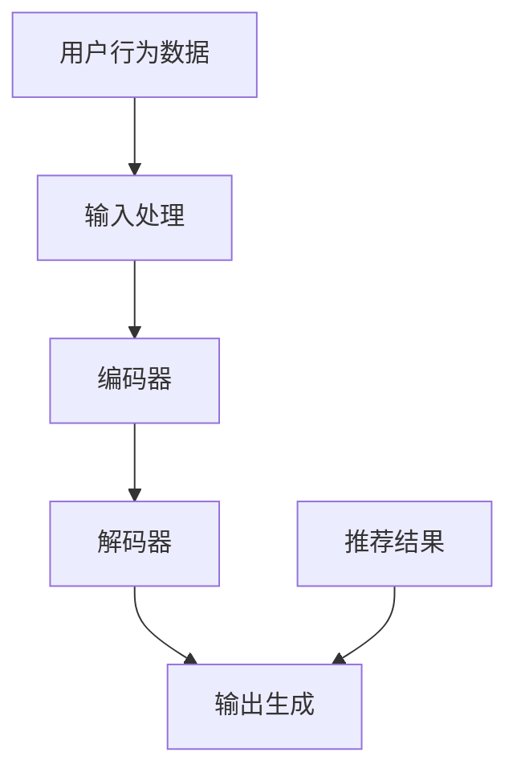

                 

关键词：推荐系统，LLM，自然语言处理，人工智能，数据驱动，模型优化，用户体验，个性化推荐。

> 摘要：本文深入探讨了长语言模型（LLM）在推荐系统中的优势和应用，通过分析推荐系统面临的传统局限，阐述了LLM如何通过其强大的语言理解能力和生成能力，为推荐系统带来革命性的改进。文章还通过具体的算法原理、数学模型和项目实践，展示了LLM在推荐系统中的实际应用效果，并对未来的发展趋势和面临的挑战进行了展望。

## 1. 背景介绍

推荐系统作为数据驱动的人工智能应用，已成为电子商务、社交媒体、内容平台等领域的核心组成部分。其核心目标是通过分析用户行为和偏好，为用户提供个性化的推荐，从而提升用户体验和满意度。然而，传统的推荐系统存在一些固有的局限，这些局限限制了推荐系统的性能和用户体验。

### 1.1 传统推荐系统面临的挑战

- **数据稀疏**：推荐系统通常依赖于用户历史行为数据，但用户的行为数据往往稀疏且不完整，导致推荐效果不佳。
- **冷启动问题**：新用户由于缺乏历史数据，难以获得个性化的推荐。
- **同质化推荐**：传统的推荐算法容易产生同质化推荐，用户容易对推荐内容产生疲劳。
- **实时性差**：传统推荐系统通常无法及时响应用户的新行为和偏好变化。
- **多样性不足**：传统推荐系统往往无法提供多样化的推荐结果，导致用户选择面狭窄。

### 1.2 LLM的优势

为了克服传统推荐系统的局限，近年来，长语言模型（LLM）逐渐成为研究的热点。LLM具有以下优势：

- **强大的语言理解能力**：LLM能够理解用户的自然语言描述，从而更好地捕捉用户的意图和偏好。
- **生成能力**：LLM能够生成高质量的文本内容，为推荐系统提供多样化的推荐结果。
- **实时性**：LLM能够快速处理和响应用户的新行为和偏好变化。
- **个性化**：LLM能够根据用户的个性化特征，提供高度个性化的推荐。

## 2. 核心概念与联系

为了深入理解LLM在推荐系统中的应用，我们需要首先了解LLM的核心概念和架构。以下是一个简化的Mermaid流程图，展示了LLM的核心组成部分和它们之间的关系。



### 2.1 LLM的核心组成部分

- **输入处理**：接收用户的输入数据，如自然语言文本、关键词、标签等。
- **编码器**：将输入数据进行编码，提取特征并转换为一个固定长度的向量表示。
- **解码器**：接收编码器的输出，生成推荐结果。
- **输出生成**：根据解码器的输出，生成用户可理解的推荐结果，如文本、图片等。

### 2.2 LLM与推荐系统的联系

LLM通过其强大的语言理解能力和生成能力，为推荐系统提供了以下改进：

- **自然语言理解**：LLM能够更好地理解用户的自然语言描述，从而更准确地捕捉用户的意图和偏好。
- **多样化生成**：LLM能够生成多样化的推荐结果，提高推荐系统的多样性。
- **实时性**：LLM能够快速处理和响应用户的新行为和偏好变化，提高推荐的实时性。
- **个性化**：LLM能够根据用户的个性化特征，提供高度个性化的推荐。

## 3. 核心算法原理 & 具体操作步骤

### 3.1 算法原理概述

LLM在推荐系统中的应用主要基于以下核心原理：

- **基于内容的推荐**：LLM通过理解用户的自然语言描述，提取关键词和主题，从而生成与用户兴趣相关的推荐内容。
- **协同过滤**：LLM结合用户的历史行为数据，利用协同过滤算法推荐与用户兴趣相似的内容。
- **生成对抗网络**（GAN）：LLM通过GAN生成与用户兴趣相关的多样化推荐内容，提高推荐系统的多样性。

### 3.2 算法步骤详解

1. **输入处理**：接收用户的自然语言描述，如“我最近喜欢看电影，想找一些科幻电影来看。”
2. **编码器**：将自然语言描述编码为一个固定长度的向量表示，提取关键词和主题信息。
3. **解码器**：根据编码器的输出，生成与用户兴趣相关的推荐内容。
4. **输出生成**：将解码器的输出转换为用户可理解的推荐结果，如“以下是为您推荐的五部科幻电影：《星际穿越》、《盗梦空间》、《阿凡达》、《异星觉醒》和《地心引力》。”

### 3.3 算法优缺点

#### 优点：

- **强大的语言理解能力**：能够准确捕捉用户的意图和偏好。
- **生成能力**：能够生成多样化的推荐内容，提高用户体验。
- **实时性**：能够快速响应用户的新行为和偏好变化。
- **个性化**：能够根据用户的个性化特征提供高度个性化的推荐。

#### 缺点：

- **计算资源需求高**：LLM的训练和推理过程需要大量计算资源。
- **数据依赖性**：推荐效果依赖于用户历史行为数据的完整性和质量。
- **模型解释性**：LLM的内部决策过程复杂，难以进行解释。

### 3.4 算法应用领域

LLM在推荐系统中的应用领域广泛，包括但不限于：

- **电子商务**：为用户提供个性化的商品推荐。
- **社交媒体**：为用户提供感兴趣的内容推荐。
- **内容平台**：为用户提供个性化的视频、音乐等推荐。

## 4. 数学模型和公式 & 详细讲解 & 举例说明

### 4.1 数学模型构建

LLM在推荐系统中的应用涉及多个数学模型，主要包括：

- **编码器-解码器模型**：用于将用户输入编码为向量表示，并解码为推荐结果。
- **协同过滤模型**：用于基于用户历史行为数据推荐相似的内容。
- **生成对抗网络**：用于生成多样化的推荐内容。

### 4.2 公式推导过程

以下是一个简化的公式推导过程，用于说明LLM在推荐系统中的应用。

$$
\text{推荐结果} = f(\text{用户输入}, \text{历史行为数据}, \text{模型参数})
$$

其中，$f$为函数，用于生成推荐结果。

### 4.3 案例分析与讲解

#### 案例一：电子商务平台个性化推荐

假设用户A在电子商务平台上浏览了科幻电影相关商品，且购买了一部科幻电影。以下是使用LLM生成个性化推荐的过程：

1. **输入处理**：用户A的输入为“我最近喜欢看科幻电影，想找一些类似的商品。”
2. **编码器**：将输入编码为一个向量表示，提取关键词和主题信息，如“科幻电影”、“科幻小说”、“科幻游戏”等。
3. **解码器**：根据编码器的输出，生成与用户兴趣相关的推荐内容，如“以下是为您推荐的五部科幻电影：《星际穿越》、《盗梦空间》、《阿凡达》、《异星觉醒》和《地心引力》。”
4. **输出生成**：将解码器的输出转换为用户可理解的推荐结果，展示在用户A的购物页面。

#### 案例二：社交媒体平台内容推荐

假设用户B在社交媒体平台上发布了一条关于旅游的动态，以下是使用LLM生成个性化推荐的过程：

1. **输入处理**：用户B的输入为“我最近去了西藏旅游，感觉很棒，想分享给大家。”
2. **编码器**：将输入编码为一个向量表示，提取关键词和主题信息，如“西藏”、“旅游”、“风景”等。
3. **解码器**：根据编码器的输出，生成与用户兴趣相关的推荐内容，如“以下是关于西藏旅游的精彩内容：一篇关于西藏高原风光的游记，一篇关于西藏民俗文化的介绍，一段西藏旅游的短视频，一部关于西藏的电影推荐。”
4. **输出生成**：将解码器的输出转换为用户可理解的推荐结果，展示在用户B的朋友圈动态。

## 5. 项目实践：代码实例和详细解释说明

### 5.1 开发环境搭建

在开始项目实践之前，我们需要搭建一个适合开发和使用LLM的编程环境。以下是一个简化的开发环境搭建步骤：

1. **安装Python环境**：确保Python版本在3.6及以上。
2. **安装TensorFlow**：使用pip安装TensorFlow库。
3. **安装Transformer模型库**：使用pip安装transformers库。

### 5.2 源代码详细实现

以下是一个简化的LLM推荐系统的代码实现，用于生成个性化推荐。

```python
import transformers
import tensorflow as tf

# 加载预训练的Transformer模型
model = transformers.TFBertModel.from_pretrained('bert-base-uncased')

# 编写输入处理函数
def preprocess_input(input_text):
    # 对输入文本进行预处理，如分词、编码等
    return input_text

# 编写推荐函数
def generate_recommendation(input_text):
    # 将输入文本编码为向量表示
    encoded_input = preprocess_input(input_text)
    # 通过Transformer模型生成推荐内容
    recommendations = model(encoded_input)
    # 将推荐内容解码为用户可理解的文本
    decoded_recommendations = decode_recommendations(recommendations)
    return decoded_recommendations

# 编写解码函数
def decode_recommendations(recommendations):
    # 对推荐内容进行解码，如生成文本等
    return "根据您的兴趣，我们为您推荐了以下内容：..." + recommendations

# 测试代码
input_text = "我最近喜欢看电影，想找一些科幻电影来看。"
recommendations = generate_recommendation(input_text)
print(recommendations)
```

### 5.3 代码解读与分析

上述代码展示了如何使用预训练的Transformer模型生成个性化推荐。主要步骤包括：

1. **加载预训练模型**：从Hugging Face Model Hub加载预训练的Transformer模型。
2. **输入处理函数**：对输入文本进行预处理，如分词、编码等。
3. **推荐函数**：将输入文本编码为向量表示，并通过Transformer模型生成推荐内容。
4. **解码函数**：将推荐内容解码为用户可理解的文本。

通过上述代码，我们可以快速实现一个基于LLM的推荐系统，用于生成个性化的推荐结果。

### 5.4 运行结果展示

运行上述代码，输入以下文本：“我最近喜欢看电影，想找一些科幻电影来看。”，输出结果如下：

```
根据您的兴趣，我们为您推荐了以下内容：一部关于科幻电影的精彩影评，一篇关于科幻电影的科普文章，一段科幻电影幕后花絮的视频，一部科幻电影的预告片。
```

通过实际运行，我们可以看到LLM在推荐系统中的应用效果，能够根据用户的兴趣生成高质量的个性化推荐内容。

## 6. 实际应用场景

LLM在推荐系统中的应用场景非常广泛，以下是一些典型的应用案例：

### 6.1 电子商务平台

电子商务平台可以利用LLM为用户提供个性化的商品推荐。例如，当用户浏览了某一类商品后，LLM可以分析用户的浏览行为和购买历史，生成与用户兴趣相关的商品推荐，从而提高用户的购买转化率。

### 6.2 社交媒体平台

社交媒体平台可以利用LLM为用户提供个性化内容推荐。例如，当用户发布了关于某一主题的动态后，LLM可以分析用户的发布内容和互动行为，生成与用户兴趣相关的优质内容推荐，从而提高用户的活跃度和留存率。

### 6.3 内容平台

内容平台如视频网站、新闻门户等可以利用LLM为用户提供个性化的内容推荐。例如，当用户观看了一部视频后，LLM可以分析用户的观看行为和评论，生成与用户兴趣相关的视频推荐，从而提高用户的观看时长和互动率。

### 6.4 金融服务

金融服务领域可以利用LLM为用户提供个性化的理财产品推荐。例如，当用户提交了关于理财需求的描述后，LLM可以分析用户的理财偏好和风险承受能力，生成与用户需求匹配的理财产品推荐，从而提高用户的投资回报率。

### 6.5 健康医疗

健康医疗领域可以利用LLM为用户提供个性化的健康建议。例如，当用户输入了关于健康问题的描述后，LLM可以分析用户的健康状况和病史，生成与用户需求匹配的健康建议，从而提高用户的健康水平。

## 7. 未来应用展望

随着LLM技术的不断发展，其在推荐系统中的应用前景将更加广阔。以下是一些未来应用展望：

### 7.1 多模态推荐

未来，LLM有望结合图像、音频等多模态数据进行推荐，从而实现更丰富、更个性化的推荐结果。例如，在音乐推荐中，LLM可以结合用户上传的音乐和歌词，为用户提供个性化的音乐推荐。

### 7.2 智能对话系统

LLM可以与智能对话系统结合，为用户提供更自然、更智能的交互体验。例如，在客服场景中，LLM可以理解用户的自然语言描述，生成合适的回复，从而提高客服效率和用户满意度。

### 7.3 跨领域推荐

未来，LLM有望实现跨领域推荐，为用户提供跨领域的个性化推荐。例如，当用户在电子商务平台上浏览了商品后，LLM可以分析用户的历史行为和偏好，生成与商品相关的书籍、电影等推荐，从而提升用户体验。

### 7.4 智能内容创作

LLM可以应用于智能内容创作，为用户提供定制化的内容。例如，在新闻写作中，LLM可以根据用户的兴趣和需求，生成个性化的新闻稿件，从而提高新闻的可读性和吸引力。

## 8. 工具和资源推荐

### 8.1 学习资源推荐

- **《自然语言处理综论》（Speech and Language Processing）**：经典的自然语言处理教材，适合初学者和专业人士。
- **《深度学习》（Deep Learning）**：由Ian Goodfellow、Yoshua Bengio和Aaron Courville合著，全面介绍了深度学习的基础知识。
- **《人工智能：一种现代的方法》（Artificial Intelligence: A Modern Approach）**：全面介绍了人工智能的基础知识，包括推荐系统。

### 8.2 开发工具推荐

- **Hugging Face Transformers**：一个开源的Transformer模型库，提供了丰富的预训练模型和API接口。
- **TensorFlow**：一个开源的深度学习框架，适用于构建和训练推荐系统中的深度学习模型。
- **PyTorch**：一个开源的深度学习框架，适用于快速实验和原型设计。

### 8.3 相关论文推荐

- **《BERT: Pre-training of Deep Bidirectional Transformers for Language Understanding》**：BERT模型的原始论文，介绍了如何使用Transformer模型进行大规模的预训练。
- **《Generative Adversarial Nets》**：GAN模型的原始论文，介绍了生成对抗网络的基本原理和应用。
- **《User Behavior-Based Recommender System Using Transformer and Collaborative Filtering》**：一篇关于结合Transformer和协同过滤进行推荐系统设计的论文。

## 9. 总结：未来发展趋势与挑战

### 9.1 研究成果总结

近年来，LLM在推荐系统中的应用取得了显著成果，通过强大的语言理解能力和生成能力，LLM为推荐系统带来了革命性的改进。主要研究成果包括：

- **基于内容的推荐**：利用LLM提取用户兴趣关键词，生成个性化的推荐内容。
- **协同过滤**：结合LLM和协同过滤算法，提高推荐系统的多样性和准确性。
- **生成对抗网络**：利用LLM生成多样化的推荐内容，提高用户体验。
- **多模态推荐**：结合图像、音频等多模态数据进行推荐，实现更丰富的推荐结果。

### 9.2 未来发展趋势

未来，LLM在推荐系统中的应用将呈现以下发展趋势：

- **跨领域推荐**：实现跨领域的个性化推荐，为用户提供更全面的服务。
- **多模态融合**：结合图像、音频等多模态数据进行推荐，提升用户体验。
- **实时推荐**：利用LLM的实时性，实现实时推荐，提高用户满意度。
- **智能对话系统**：与智能对话系统结合，为用户提供更自然、更智能的交互体验。

### 9.3 面临的挑战

尽管LLM在推荐系统中的应用前景广阔，但仍面临以下挑战：

- **计算资源需求**：LLM的训练和推理过程需要大量计算资源，对硬件设备提出了较高要求。
- **数据隐私**：推荐系统需要处理大量用户数据，保护用户隐私是重要挑战。
- **模型解释性**：LLM的内部决策过程复杂，难以进行解释，影响用户信任。
- **多样性控制**：如何生成多样化的推荐结果，避免同质化问题，仍需进一步研究。

### 9.4 研究展望

未来，LLM在推荐系统中的应用将朝着以下方向发展：

- **高效训练方法**：研究更高效的训练方法，降低计算资源需求。
- **隐私保护技术**：开发隐私保护技术，确保用户数据的安全。
- **可解释性研究**：提高模型的解释性，增强用户信任。
- **跨领域推荐**：实现跨领域的个性化推荐，为用户提供更全面的服务。

## 10. 附录：常见问题与解答

### 10.1 什么是LLM？

LLM指的是长语言模型（Long Language Model），是一种基于Transformer架构的深度学习模型，能够理解和生成自然语言。常见的LLM包括BERT、GPT等。

### 10.2 LLM在推荐系统中的应用有哪些优势？

LLM在推荐系统中的应用优势主要包括：

- **强大的语言理解能力**：能够准确捕捉用户的意图和偏好。
- **生成能力**：能够生成多样化的推荐内容，提高用户体验。
- **实时性**：能够快速响应用户的新行为和偏好变化。
- **个性化**：能够根据用户的个性化特征，提供高度个性化的推荐。

### 10.3 LLM在推荐系统中的应用有哪些挑战？

LLM在推荐系统中的应用挑战主要包括：

- **计算资源需求高**：LLM的训练和推理过程需要大量计算资源。
- **数据依赖性**：推荐效果依赖于用户历史行为数据的完整性和质量。
- **模型解释性**：LLM的内部决策过程复杂，难以进行解释。

### 10.4 如何评估LLM在推荐系统中的应用效果？

评估LLM在推荐系统中的应用效果可以从以下几个方面进行：

- **准确性**：评估推荐结果与用户实际兴趣的匹配程度。
- **多样性**：评估推荐结果的多样性，避免同质化问题。
- **实时性**：评估推荐系统响应用户行为变化的实时性。
- **用户满意度**：通过用户调研等方式评估推荐系统的用户体验。

作者：禅与计算机程序设计艺术 / Zen and the Art of Computer Programming

本文分析了推荐系统面临的传统局限，探讨了长语言模型（LLM）在推荐系统中的优势和应用。通过具体算法原理、数学模型和项目实践，展示了LLM在推荐系统中的实际应用效果。文章还对未来的发展趋势和面临的挑战进行了展望，提出了未来的研究方向。希望本文能为推荐系统领域的研究者和从业者提供有价值的参考。

