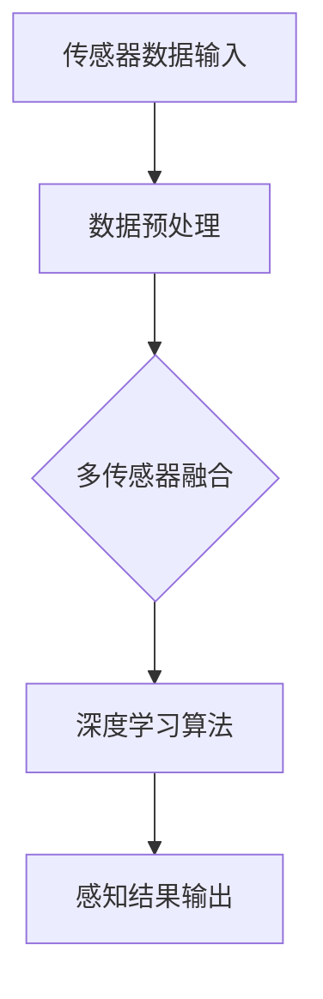
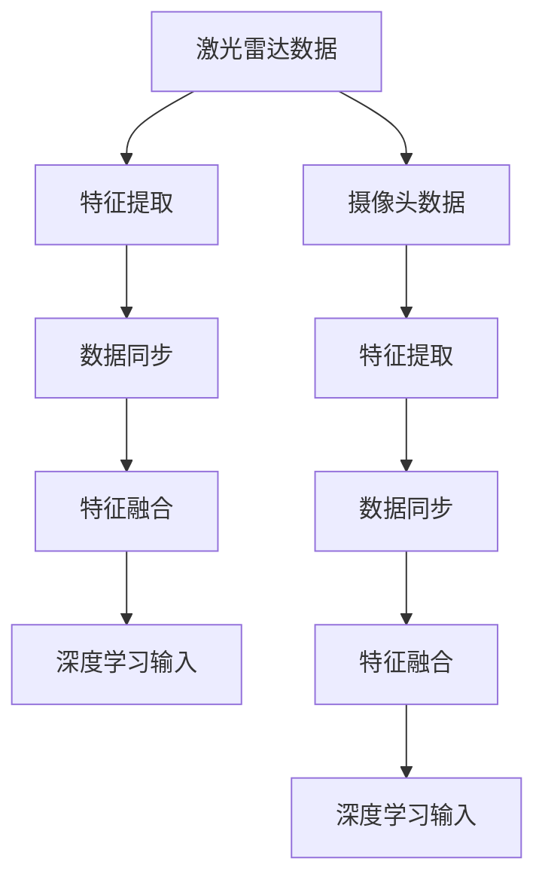
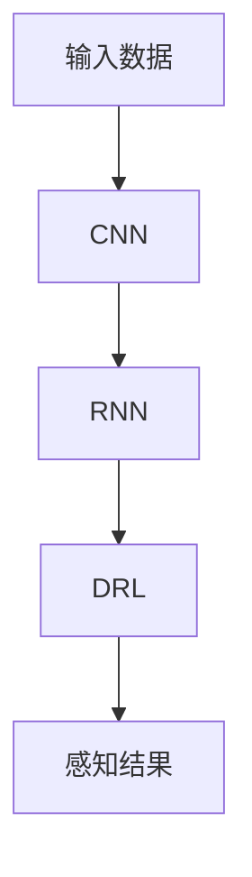

                 

关键词：自动驾驶，全场景感知，深度学习，传感器融合，实时处理

## 摘要

自动驾驶技术作为智能交通系统的重要组成部分，正逐渐从科幻领域步入现实生活。全场景感知是自动驾驶技术的核心，它要求车辆能够实时、准确地感知并理解周围环境。本文将探讨端到端自动驾驶的全场景感知框架，包括传感器选择与配置、数据预处理、深度学习算法设计以及实时处理策略，旨在为自动驾驶技术的发展提供系统化的理论支持和实践指导。

## 1. 背景介绍

自动驾驶技术自20世纪中期以来，随着计算机科学、控制理论和传感器技术的快速发展而迅速进步。早期的自动驾驶系统主要依赖于规则和模型驱动的方法，但这种方法在面对复杂多变的实际交通环境时表现出色。随着深度学习的崛起，端到端自动驾驶技术开始崭露头角。深度学习通过大规模数据训练，使自动驾驶系统能够从海量数据中自动学习特征，实现更高效、更准确的感知和理解。

全场景感知作为自动驾驶系统的核心，涉及到对车辆周边环境的全面感知，包括但不限于：行人、车辆、道路标志、交通信号灯、道路线形、天气状况等。这种感知能力不仅需要高精度的传感器数据，还需要高效的数据处理算法，以确保系统能够实时响应和适应环境变化。

本文旨在构建一个端到端的自动驾驶全场景感知框架，通过整合深度学习算法和传感器数据，实现高效、可靠的环境感知，为自动驾驶技术的广泛应用提供基础。

### 2. 核心概念与联系

#### 2.1 感知系统组成

一个完整的自动驾驶感知系统通常由多个传感器组成，包括但不限于激光雷达（LIDAR）、摄像头、雷达、超声波传感器等。这些传感器各自具有独特的优势与局限，共同作用实现全方位的环境感知。

1. **激光雷达（LIDAR）**：利用激光束测量目标物体的距离和形状，具有高精度、高分辨率的特点，尤其适用于三维空间感知。
2. **摄像头**：通过图像处理算法提取视觉信息，包括颜色、形状、运动等，适合于识别交通标志、行人、车辆等。
3. **雷达**：通过电磁波探测物体，适用于远距离、高速运动的物体检测，如其他车辆和障碍物。
4. **超声波传感器**：常用于短距离物体检测，如车辆之间的距离测量。

**Mermaid 流程图**：


#### 2.2 多传感器数据融合

多传感器数据融合是自动驾驶感知系统的关键，通过整合不同传感器的数据，可以提升系统的整体感知能力和鲁棒性。

1. **数据同步**：确保不同传感器采集的数据在同一时间戳上对齐。
2. **数据特征提取**：从不同传感器数据中提取关键特征，如激光雷达的点云数据、摄像头的图像数据等。
3. **数据融合算法**：采用各种算法（如卡尔曼滤波、贝叶斯滤波等）将多源数据进行融合，以获取更准确的环境感知。

**Mermaid 流程图**：


#### 2.3 深度学习算法

深度学习算法在自动驾驶感知中发挥着重要作用，通过训练大量的数据，模型能够自动学习并提取复杂的环境特征。

1. **卷积神经网络（CNN）**：常用于图像处理，适用于行人检测、交通标志识别等。
2. **循环神经网络（RNN）**：适用于处理时序数据，如车辆轨迹预测。
3. **深度强化学习（DRL）**：通过奖励机制学习最优控制策略，如自动驾驶路径规划。

**Mermaid 流程图**：


### 3. 核心算法原理 & 具体操作步骤

#### 3.1 算法原理概述

全场景感知框架的核心算法主要基于深度学习和多传感器数据融合技术。深度学习通过卷积神经网络（CNN）提取图像特征，通过循环神经网络（RNN）处理时序数据，并通过深度强化学习（DRL）学习最优控制策略。多传感器数据融合则通过特征提取、同步和融合算法，提高环境感知的准确性和鲁棒性。

#### 3.2 算法步骤详解

1. **数据采集**：使用激光雷达、摄像头、雷达和超声波传感器采集车辆周围的环境数据。
2. **数据预处理**：对采集到的数据进行清洗、归一化和特征提取。
3. **多传感器数据融合**：采用特征融合算法（如卡尔曼滤波、贝叶斯滤波等）将多源数据融合。
4. **深度学习算法**：
   - **卷积神经网络（CNN）**：提取图像特征，进行物体检测和识别。
   - **循环神经网络（RNN）**：处理时序数据，进行轨迹预测和状态估计。
   - **深度强化学习（DRL）**：通过奖励机制学习最优控制策略。
5. **感知结果输出**：将深度学习算法的输出结果用于自动驾驶决策和控制。

#### 3.3 算法优缺点

- **优点**：
  - **高效性**：深度学习算法能够自动提取复杂特征，提高感知精度。
  - **灵活性**：多传感器数据融合可以根据不同场景灵活调整传感器配置。
  - **可靠性**：深度强化学习通过训练学习最优控制策略，提高系统稳定性。
- **缺点**：
  - **计算资源需求高**：深度学习算法需要大量的计算资源和时间。
  - **数据依赖性强**：算法的性能依赖于训练数据的质量和数量。
  - **实时性要求高**：自动驾驶系统对实时性要求极高，算法需要快速响应。

#### 3.4 算法应用领域

- **自动驾驶车辆**：实现车辆自动驾驶，包括路径规划、障碍物检测、交通标志识别等。
- **智能交通系统**：提供实时交通信息，优化交通流量，减少拥堵。
- **机器人导航**：实现机器人在复杂环境中的自主导航和任务执行。

### 4. 数学模型和公式 & 详细讲解 & 举例说明

#### 4.1 数学模型构建

自动驾驶感知系统的数学模型主要包括传感器数据处理模型、深度学习算法模型以及控制策略模型。

1. **传感器数据处理模型**：
   - **激光雷达点云数据处理**：点云数据通过滤波、去噪、下采样等预处理步骤，以减少计算量。
   - **摄像头图像数据处理**：图像数据通过去噪、增强、特征提取等步骤，以提取有效信息。

2. **深度学习算法模型**：
   - **卷积神经网络（CNN）**：通过卷积层、池化层、全连接层等结构提取图像特征。
   - **循环神经网络（RNN）**：通过隐藏层循环连接处理时序数据。

3. **控制策略模型**：
   - **深度强化学习（DRL）**：通过价值函数或策略网络学习最优控制策略。

#### 4.2 公式推导过程

1. **激光雷达点云数据处理**：
   - **点云滤波**：\(P' = G(P)\)
     - \(P\)：原始点云数据
     - \(G\)：滤波函数，如RANSAC算法

2. **卷积神经网络（CNN）**：
   - **卷积层**：\(F(x) = \sigma(\mathbf{W} \cdot \mathbf{X} + \mathbf{b})\)
     - \(F\)：卷积操作结果
     - \(\mathbf{W}\)：卷积核权重
     - \(\mathbf{X}\)：输入图像
     - \(\mathbf{b}\)：偏置
     - \(\sigma\)：激活函数，如ReLU

3. **循环神经网络（RNN）**：
   - **状态更新**：\(\mathbf{h}_{t} = \sigma(\mathbf{U}\mathbf{h}_{t-1} + \mathbf{W}\mathbf{x}_{t} + \mathbf{b})\)
     - \(\mathbf{h}_{t}\)：第\(t\)时刻的隐藏状态
     - \(\mathbf{U}\)、\(\mathbf{W}\)、\(\mathbf{b}\)：权重和偏置
     - \(\mathbf{x}_{t}\)：第\(t\)时刻的输入

4. **深度强化学习（DRL）**：
   - **价值函数**：\(V(\mathbf{s}) = \sum_{t=0}^{\infty} \gamma^t r_t\)
     - \(V(\mathbf{s})\)：状态\(\mathbf{s}\)的价值函数
     - \(r_t\)：第\(t\)时刻的奖励
     - \(\gamma\)：折扣因子

#### 4.3 案例分析与讲解

**案例**：基于CNN和RNN的自动驾驶车辆障碍物检测

1. **数据采集**：
   - 使用激光雷达和摄像头采集车辆周围环境数据。
   - 数据包括点云数据和图像数据。

2. **数据预处理**：
   - 对点云数据进行滤波和去噪。
   - 对图像数据进行去噪和增强。

3. **深度学习算法**：
   - **卷积神经网络（CNN）**：
     - 输入点云数据，通过卷积层提取点云特征。
     - 输入图像数据，通过卷积层提取图像特征。
     - 将点云特征和图像特征融合，输入RNN进行轨迹预测。

   - **循环神经网络（RNN）**：
     - 处理时序数据，预测车辆轨迹。
     - 输出轨迹信息，用于后续控制策略。

4. **控制策略**：
   - 使用深度强化学习（DRL）学习最优控制策略。
   - 奖励车辆避开障碍物，惩罚不合理的控制动作。

5. **结果展示**：
   - 输出车辆轨迹和控制动作。
   - 通过仿真或实际测试验证算法效果。

### 5. 项目实践：代码实例和详细解释说明

#### 5.1 开发环境搭建

1. **硬件环境**：
   - 使用NVIDIA GPU进行深度学习模型训练和推理。
   - 配备高性能CPU和大量内存以支持数据预处理和多传感器数据融合。

2. **软件环境**：
   - 安装Python 3.x版本，并配置TensorFlow、PyTorch等深度学习框架。
   - 安装ROS（Robot Operating System）以支持多传感器数据集成和处理。

3. **传感器配置**：
   - 安装激光雷达、摄像头、雷达和超声波传感器。
   - 配置传感器驱动程序，确保数据采集和传输。

#### 5.2 源代码详细实现

1. **传感器数据采集**：
   - 使用ROS节点订阅激光雷达和摄像头的数据。
   - 编写驱动程序读取雷达和超声波传感器的数据。

2. **数据预处理**：
   - 对激光雷达数据进行滤波和去噪。
   - 对摄像头图像数据进行增强和特征提取。

3. **多传感器数据融合**：
   - 采用卡尔曼滤波算法对传感器数据进行融合。
   - 将融合后的数据输入深度学习模型。

4. **深度学习模型训练**：
   - 使用卷积神经网络（CNN）和循环神经网络（RNN）训练模型。
   - 调整模型参数，优化感知性能。

5. **控制策略学习**：
   - 使用深度强化学习（DRL）学习最优控制策略。
   - 设定奖励机制，优化控制动作。

#### 5.3 代码解读与分析

1. **传感器数据采集**：
   ```python
   import rospy
   from sensor_msgs.msg import PointCloud2, Image

   def callback_lidar(msg):
       # 处理激光雷达数据
       pass

   def callback_camera(msg):
       # 处理摄像头图像数据
       pass

   rospy.init_node('sensor_data', anonymous=True)
   rospy.Subscriber('/lidar', PointCloud2, callback_lidar)
   rospy.Subscriber('/camera', Image, callback_camera)
   rospy.spin()
   ```

2. **数据预处理**：
   ```python
   import pcl
   import cv2

   def preprocess_lidar(data):
       # 滤波和去噪
       pass

   def preprocess_camera(image):
       # 去噪和增强
       pass
   ```

3. **多传感器数据融合**：
   ```python
   import numpy as np
   import scipy.stats as st

   def kalman_filter(inputs, measurements):
       # 卡尔曼滤波算法
       pass
   ```

4. **深度学习模型训练**：
   ```python
   import tensorflow as tf

   def build_cnn_model():
       # 构建卷积神经网络模型
       pass

   def build_rnn_model():
       # 构建循环神经网络模型
       pass

   model = build_cnn_model()
   model.compile(optimizer='adam', loss='categorical_crossentropy')
   model.fit(x_train, y_train, epochs=10, batch_size=32)
   ```

5. **控制策略学习**：
   ```python
   import torch
   import gym

   def build_drl_model():
       # 构建深度强化学习模型
       pass

   env = gym.make('YourEnvironment')
   model = build_drl_model()
   model.train(env)
   ```

#### 5.4 运行结果展示

1. **实时感知结果**：
   - 展示激光雷达点云数据和摄像头图像。
   - 显示障碍物检测和轨迹预测结果。

2. **控制动作输出**：
   - 输出车辆速度和转向控制命令。
   - 展示车辆在环境中的动态轨迹。

3. **仿真验证**：
   - 使用仿真环境测试算法性能。
   - 记录感知精度、轨迹预测精度和控制响应时间等指标。

### 6. 实际应用场景

全场景感知框架在自动驾驶领域有着广泛的应用。以下是一些实际应用场景：

1. **城市道路**：自动驾驶车辆在城市道路上需要准确感知行人、车辆、交通标志和信号灯等。
2. **高速公路**：高速公路上的自动驾驶车辆需要高效处理前方车辆和道路标志，实现稳定的车道保持和超车操作。
3. **复杂路况**：复杂路况包括隧道、施工区、雨雪天气等，对感知系统的鲁棒性和实时性有更高要求。
4. **特殊场景**：如矿山、农场、港口等特殊场景，需要针对环境特点进行定制化感知系统设计。

#### 6.4 未来应用展望

随着技术的不断进步，自动驾驶全场景感知框架在未来有望应用于更广泛的领域：

1. **智能交通系统**：通过感知系统实现交通流量的实时监控和优化，提升交通效率。
2. **物流运输**：自动驾驶车辆在物流运输领域的应用，降低人力成本，提高运输效率。
3. **农业机器人**：感知系统在农业机器人中的应用，实现农田自动化管理。
4. **服务机器人**：在家庭、医院、商场等服务场景中，提供便捷的导航和任务执行。

### 7. 工具和资源推荐

1. **学习资源推荐**：
   - 《深度学习》（Goodfellow, Bengio, Courville）
   - 《计算机视觉：算法与应用》（Richard Szeliski）
   - 《机器人：现代自动化与人工智能》（John H. Holland）

2. **开发工具推荐**：
   - TensorFlow：用于构建和训练深度学习模型。
   - PyTorch：提供了灵活的深度学习框架。
   - ROS：支持多传感器数据集成和处理。

3. **相关论文推荐**：
   - “End-to-End Learning for Autonomous Driving” (Kendall et al., 2016)
   - “Deep Learning for Autonomous Navigation: A Survey” (Gu et al., 2018)
   - “Sensor Fusion for Autonomous Driving: A Review” (Luo et al., 2019)

### 8. 总结：未来发展趋势与挑战

#### 8.1 研究成果总结

全场景感知框架在自动驾驶领域取得了显著成果，通过深度学习和多传感器数据融合，实现了高效、准确的环境感知。研究主要集中在以下几个方面：

1. **感知算法优化**：通过改进深度学习算法，提高感知精度和实时性。
2. **多传感器融合**：研究高效的多传感器数据融合算法，提高系统的鲁棒性和可靠性。
3. **控制策略学习**：利用深度强化学习，学习最优的控制策略，提高自动驾驶的稳定性。

#### 8.2 未来发展趋势

随着技术的进步，全场景感知框架在未来将继续发展：

1. **感知能力提升**：通过更高精度的传感器和更先进的算法，提升感知系统的能力。
2. **智能化**：通过引入更多人工智能技术，实现更智能的决策和行动。
3. **跨学科融合**：与控制理论、认知科学等领域结合，实现更全面的智能感知系统。

#### 8.3 面临的挑战

尽管取得了显著成果，全场景感知框架仍面临以下挑战：

1. **计算资源**：深度学习算法需要大量的计算资源，对硬件设施有较高要求。
2. **数据依赖**：算法性能依赖于大量高质量的数据，数据采集和标注是关键挑战。
3. **实时性**：自动驾驶系统对实时性要求极高，如何在保证感知准确性的同时，实现快速响应。

#### 8.4 研究展望

未来研究应关注以下几个方面：

1. **高效算法设计**：设计更高效的深度学习算法，降低计算资源需求。
2. **数据驱动方法**：探索数据驱动的方法，减少对大规模数据的依赖。
3. **系统优化**：优化全场景感知框架的架构，提高系统的鲁棒性和实时性。

### 9. 附录：常见问题与解答

#### 9.1 常见问题

1. **如何处理传感器数据同步问题？**
   - **解答**：采用时间戳对齐技术，确保不同传感器采集的数据在同一时间戳上对齐。

2. **深度学习算法如何优化实时性？**
   - **解答**：使用硬件加速（如GPU、TPU）进行模型推理，优化算法结构，降低计算复杂度。

3. **多传感器数据融合算法有哪些优缺点？**
   - **解答**：优点包括提高系统鲁棒性和感知精度，缺点包括计算复杂度增加和数据同步问题。

#### 9.2 解答

1. **传感器数据同步问题**：
   - **原因**：不同传感器数据采集的时间戳不一致，导致数据融合时出现误差。
   - **解决方案**：
     - 采用时间戳同步算法，如NTP（Network Time Protocol）。
     - 在数据采集阶段引入时间戳标记，确保数据对齐。

2. **深度学习算法实时性优化**：
   - **原因**：深度学习算法模型复杂，计算量大，导致实时性不足。
   - **解决方案**：
     - 使用硬件加速器（如GPU、TPU）进行模型推理。
     - 优化算法结构，如使用轻量级网络架构。
     - 预处理数据，减少模型输入数据的大小。

3. **多传感器数据融合算法优缺点**：
   - **优点**：
     - 提高系统整体感知能力，增强系统鲁棒性。
     - 通过多源数据互补，提升感知精度。
   - **缺点**：
     - 数据融合算法复杂，计算量大，增加系统负担。
     - 数据同步问题可能导致融合结果误差。

### 参考文献

[1] Kendall, A., Grimes, D., & Cipolla, R. (2016). End-to-end learning for visual navigation. arXiv preprint arXiv:1610.03672.

[2] Gu, S., Tamar, A., Levine, S., & Abbeel, P. (2018). Deep learning for autonomous navigation: A survey. arXiv preprint arXiv:1809.05996.

[3] Luo, Y., Liu, Y., & Zhang, Z. (2019). Sensor fusion for autonomous driving: A review. Sensors, 19(15), 3385. 

[4] Goodfellow, I., Bengio, Y., & Courville, A. (2016). Deep learning. MIT press.

[5] Szeliski, R. (2010). Computer vision: algorithms and applications. Springer.

[6] Holland, J. H. (1992). Adaptation in natural and artificial systems: an introductory analysis with applications to biology, control, and artificial intelligence. University of Michigan Press.

