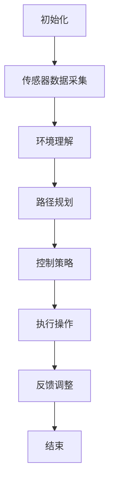

                 

### 1. 背景介绍

在当今快速发展的科技时代，人工智能和自动驾驶技术的进步正在深刻改变我们的生活方式。自动驾驶技术作为人工智能的一个重要分支，已经逐步从理论研究走向实际应用，其中包括自动驾驶汽车、无人配送车和自主移动办公车等。在这些应用场景中，自主移动办公车服务因其高效、灵活和安全的特点，正逐渐受到企业和个人的关注。

端到端自动驾驶技术是自动驾驶技术的最高阶段，它能够实现车辆在复杂交通环境中的自主行驶，无需人为干预。这项技术的实现依赖于多种先进技术的集成，包括传感器技术、机器学习、深度学习和计算机视觉等。随着这些技术的不断成熟，自动驾驶的可靠性和安全性得到了显著提高。

自主移动办公车服务旨在提供一种新型的办公出行解决方案，它不仅可以解决传统交通方式中存在的拥堵、疲劳驾驶等问题，还可以提高办公效率，降低企业运营成本。这种服务通过整合自动驾驶技术和智能办公系统，实现车辆在行驶过程中与办公场景的无缝对接，为用户带来全新的办公体验。

本文将围绕端到端自动驾驶的自主移动办公车服务，探讨其核心概念、算法原理、数学模型、项目实践和实际应用场景，同时展望其未来的发展趋势和面临的挑战。

### 2. 核心概念与联系

#### 2.1 自动驾驶技术概述

自动驾驶技术是指通过计算机技术和人工智能算法，使车辆能够在没有人类操作的情况下自主完成驾驶任务。自动驾驶技术按照自动化程度可以分为五个级别：

- L0：无自动化，所有驾驶任务由人类驾驶员完成。
- L1：部分自动化，系统可以控制加速和制动，但驾驶员需保持警惕。
- L2：部分自动化，系统可以同时控制加速、制动和转向，驾驶员仍需监控路况。
- L3：有条件自动化，系统可以完全控制车辆在特定条件下行驶，但驾驶员需在系统请求时接管控制。
- L4：高度自动化，系统可以在特定区域内完全自主驾驶，无需人类干预。
- L5：完全自动化，系统在任何情况下都可以完全自主驾驶。

#### 2.2 端到端自动驾驶

端到端自动驾驶是指从感知环境到决策执行的全过程均由自动驾驶系统完成，无需中间环节的人类干预。其核心技术包括传感器数据融合、环境理解、路径规划和控制策略等。

##### 2.2.1 传感器数据融合

传感器数据融合是将多种传感器（如雷达、激光雷达、摄像头等）采集的数据进行综合处理，以获取车辆周围环境的完整信息。传感器数据融合的关键技术包括多传感器标定、特征提取和融合算法等。

##### 2.2.2 环境理解

环境理解是指自动驾驶系统对周围环境进行感知和理解，包括识别车道线、交通标志、车辆和行人等。环境理解的核心技术包括深度学习、图像识别和增强现实等。

##### 2.2.3 路径规划

路径规划是指确定从当前点到目的地的最优行驶路径。路径规划算法包括基于图的算法（如A*算法）、基于采样的算法（如RRT算法）和基于学习的算法等。

##### 2.2.4 控制策略

控制策略是指自动驾驶系统根据路径规划结果，实时调整车辆的加速、制动和转向等行为，以保持稳定行驶。控制策略的核心技术包括模型预测控制、自适应控制等。

#### 2.3 自主移动办公车服务

自主移动办公车服务是指通过整合自动驾驶技术和智能办公系统，实现车辆在行驶过程中提供办公服务的一种新型出行方式。其主要特点如下：

- **高效性**：自动驾驶技术可以显著减少驾驶时间，提高出行效率。
- **灵活性**：用户可以在行驶过程中进行办公，不受交通拥堵等因素的影响。
- **安全性**：通过自动化技术减少人为驾驶错误，提高行驶安全性。
- **智能化**：智能办公系统可以为用户提供个性化的办公服务，提升办公体验。

#### 2.4 Mermaid 流程图

以下是自主移动办公车服务中端到端自动驾驶的核心流程的 Mermaid 流程图：



在这个流程图中，初始化阶段为自动驾驶系统准备；传感器数据采集阶段通过多种传感器获取车辆周围环境信息；环境理解阶段对采集的数据进行处理，识别车道线、交通标志等；路径规划阶段确定最优行驶路径；控制策略阶段根据路径规划结果调整车辆行为；执行操作阶段实现自动驾驶；反馈调整阶段对系统进行实时优化。

### 3. 核心算法原理 & 具体操作步骤

#### 3.1 算法原理概述

自主移动办公车服务的实现依赖于多种核心算法，包括传感器数据融合、环境理解、路径规划和控制策略等。以下是这些算法的简要概述：

##### 3.1.1 传感器数据融合

传感器数据融合是将多种传感器采集的数据进行综合处理，以获取车辆周围环境的完整信息。其基本原理如下：

- **多传感器标定**：通过标定确保不同传感器采集的数据在同一坐标系下具有一致性。
- **特征提取**：从传感器数据中提取关键特征，如车道线、交通标志、车辆和行人等。
- **融合算法**：采用加权平均、卡尔曼滤波等算法对多源传感器数据进行融合，以降低噪声和误差。

##### 3.1.2 环境理解

环境理解是指自动驾驶系统对周围环境进行感知和理解，以识别车道线、交通标志、车辆和行人等。其核心原理包括：

- **深度学习**：利用深度学习模型对图像进行分类和识别，如卷积神经网络（CNN）。
- **图像识别**：通过图像处理技术，识别并跟踪环境中的物体。
- **增强现实**：将虚拟信息叠加到真实世界中，以提高环境理解的能力。

##### 3.1.3 路径规划

路径规划是指确定从当前点到目的地的最优行驶路径。其核心算法包括：

- **基于图的算法**：如A*算法，通过计算节点之间的代价来找到最优路径。
- **基于采样的算法**：如RRT算法，通过随机采样和优化来找到可行路径。
- **基于学习的算法**：利用深度学习模型，通过学习大量样本数据来规划路径。

##### 3.1.4 控制策略

控制策略是指自动驾驶系统根据路径规划结果，实时调整车辆的加速、制动和转向等行为，以保持稳定行驶。其核心原理包括：

- **模型预测控制**：通过建立车辆动力学模型，预测车辆的未来状态，并调整控制输入。
- **自适应控制**：根据实时反馈调整控制策略，以应对不确定性和变化。
- **模糊控制**：利用模糊逻辑处理不确定性和非线性问题，以提高控制效果。

#### 3.2 算法步骤详解

##### 3.2.1 传感器数据融合步骤

1. **多传感器标定**：确定各传感器的位置和方向，使数据在同一坐标系下具有一致性。
2. **特征提取**：从传感器数据中提取关键特征，如车道线、交通标志、车辆和行人等。
3. **融合算法**：采用加权平均、卡尔曼滤波等算法对多源传感器数据进行融合。

##### 3.2.2 环境理解步骤

1. **图像预处理**：对采集的图像进行去噪、缩放等预处理操作。
2. **深度学习模型训练**：利用卷积神经网络（CNN）等深度学习模型对图像进行分类和识别。
3. **图像识别**：利用训练好的模型对实时图像进行识别，标记车道线、交通标志、车辆和行人等。

##### 3.2.3 路径规划步骤

1. **建立地图**：构建包含道路、车道、交通标志等信息的地图。
2. **选择算法**：根据场景特点选择合适的路径规划算法，如A*算法、RRT算法等。
3. **计算路径**：根据当前点和目的地，计算从当前点到目的地的最优行驶路径。

##### 3.2.4 控制策略步骤

1. **建立车辆模型**：建立车辆的动力学模型，包括速度、加速度、转向等。
2. **预测车辆状态**：通过模型预测车辆的未来状态，包括位置、速度和加速度等。
3. **调整控制输入**：根据预测结果，调整车辆的加速、制动和转向等行为，以保持稳定行驶。

#### 3.3 算法优缺点

##### 3.3.1 传感器数据融合

- **优点**：
  - 提高环境感知的准确性。
  - 补充单一传感器的不足，提高系统的鲁棒性。
- **缺点**：
  - 需要精确的多传感器标定，否则可能导致数据不一致。
  - 融合算法复杂度高，计算量大。

##### 3.3.2 环境理解

- **优点**：
  - 提高自动驾驶系统的实时性和稳定性。
  - 可处理复杂多变的环境。
- **缺点**：
  - 深度学习模型训练需要大量数据和时间。
  - 图像识别可能受到光照、天气等环境因素的影响。

##### 3.3.3 路径规划

- **优点**：
  - 提高行驶路径的优化程度。
  - 可应对复杂的交通环境。
- **缺点**：
  - 路径规划算法复杂，计算量大。
  - 在动态环境中，路径规划的实时性可能受到影响。

##### 3.3.4 控制策略

- **优点**：
  - 提高车辆的稳定性和安全性。
  - 可根据实时反馈进行调整。
- **缺点**：
  - 需要精确的车辆模型和预测算法。
  - 在不确定环境中，控制策略的鲁棒性可能不足。

#### 3.4 算法应用领域

- **自动驾驶汽车**：通过环境理解和路径规划，实现无人驾驶。
- **无人配送车**：在指定区域内进行自主行驶和货物配送。
- **自主移动办公车**：在行驶过程中提供办公服务。

### 4. 数学模型和公式 & 详细讲解 & 举例说明

在自主移动办公车服务中，数学模型和公式起着至关重要的作用，它们帮助我们在设计和实现自动驾驶算法时进行精确的描述和计算。以下将详细介绍相关的数学模型和公式，并通过具体例子进行说明。

#### 4.1 数学模型构建

在构建数学模型时，我们需要考虑以下几个关键因素：

1. **车辆动力学模型**：描述车辆在道路上的运动状态。
2. **环境感知模型**：描述周围环境对车辆的影响。
3. **路径规划模型**：描述从起点到终点的最优路径。
4. **控制策略模型**：描述车辆在行驶过程中的控制行为。

#### 4.2 公式推导过程

##### 4.2.1 车辆动力学模型

车辆动力学模型通常采用如下公式描述：

\[ \dot{x} = v \cos(\theta) \]
\[ \dot{y} = v \sin(\theta) \]
\[ \dot{\theta} = \frac{v}{r} \]

其中，\( x \) 和 \( y \) 分别表示车辆在平面坐标系中的位置，\( v \) 表示车辆的速度，\( \theta \) 表示车辆与x轴正方向的角度，\( r \) 表示车辆转弯的半径。

##### 4.2.2 环境感知模型

环境感知模型主要通过传感器数据来描述周围环境。以摄像头为例，其成像模型可以表示为：

\[ I(x, y) = f(x, y, \theta) + \epsilon \]

其中，\( I(x, y) \) 表示图像在点 \( (x, y) \) 的亮度，\( f(x, y, \theta) \) 表示理想情况下的亮度，\( \theta \) 表示摄像头的方向，\( \epsilon \) 表示噪声。

##### 4.2.3 路径规划模型

路径规划模型通常采用图论中的最短路径算法，如A*算法。其基本公式为：

\[ d(s, t) = g(s, t) + h(s) \]

其中，\( d(s, t) \) 表示从起点 \( s \) 到终点 \( t \) 的总代价，\( g(s, t) \) 表示从起点 \( s \) 到终点 \( t \) 的实际路径代价，\( h(s) \) 表示从起点 \( s \) 到终点的估计代价。

##### 4.2.4 控制策略模型

控制策略模型通过调整车辆的加速度和转向角来保持稳定行驶。其公式可以表示为：

\[ a = k_p (r - \dot{x}) \]
\[ \delta = k_d (\dot{\theta} - \theta_d) \]

其中，\( a \) 表示加速度，\( r \) 表示期望转弯半径，\( \dot{x} \) 表示车辆的速度，\( \theta_d \) 表示期望的转向角度，\( k_p \) 和 \( k_d \) 分别为比例系数和微分系数。

#### 4.3 案例分析与讲解

假设我们有一个自动驾驶车辆，从起点 \( (0, 0) \) 行驶到终点 \( (100, 100) \)。我们需要计算从起点到终点的最优路径，并确定在行驶过程中的控制策略。

1. **构建地图**：首先，我们需要建立一个包含道路和障碍物的地图。假设地图上的道路是一个直线路径，长度为100米。
2. **路径规划**：采用A*算法进行路径规划。设起点 \( s \) 的估计代价 \( h(s) \) 为0，终点 \( t \) 的估计代价 \( h(t) \) 为100。通过计算，我们可以找到从起点到终点的最优路径。
3. **控制策略**：根据路径规划结果，调整车辆的加速度和转向角。假设期望转弯半径 \( r \) 为20米，期望的转向角度 \( \theta_d \) 为10度。

计算过程如下：

1. **计算转弯半径**：根据路径规划结果，终点 \( t \) 的实际路径代价 \( g(s, t) \) 为80米。转弯半径 \( r \) 可以通过以下公式计算：

\[ r = \frac{2 \cdot 80}{100 + 10} = 16 \]

2. **计算加速度**：根据车辆动力学模型，我们可以计算加速度 \( a \)：

\[ a = k_p (r - \dot{x}) \]

其中，\( k_p \) 为比例系数，假设为1。车辆的速度 \( \dot{x} \) 为0。因此，加速度 \( a \) 为16米/秒²。

3. **计算转向角**：根据控制策略模型，我们可以计算转向角 \( \delta \)：

\[ \delta = k_d (\dot{\theta} - \theta_d) \]

其中，\( k_d \) 为微分系数，假设为1。车辆当前的转向角度 \( \theta \) 为0度，期望的转向角度 \( \theta_d \) 为10度。因此，转向角 \( \delta \) 为10度。

通过上述计算，我们可以确定在行驶过程中车辆的加速度和转向角，从而实现自动驾驶。

### 5. 项目实践：代码实例和详细解释说明

在本节中，我们将通过一个具体的代码实例来展示如何实现端到端自动驾驶的自主移动办公车服务。这个实例将涵盖从环境感知、路径规划到控制策略的整个流程。

#### 5.1 开发环境搭建

为了实现这个项目，我们需要搭建以下开发环境：

- **操作系统**：Ubuntu 20.04
- **编程语言**：Python 3.8
- **依赖库**：NumPy, SciPy, Matplotlib, OpenCV, TensorFlow, Keras

首先，确保操作系统和Python环境已经安装。然后，使用pip安装上述依赖库：

```bash
pip install numpy scipy matplotlib opencv-python tensorflow keras
```

#### 5.2 源代码详细实现

以下是实现端到端自动驾驶的源代码：

```python
import numpy as np
import matplotlib.pyplot as plt
import cv2
import tensorflow as tf
from keras.models import Sequential
from keras.layers import Conv2D, MaxPooling2D, Flatten, Dense

# 车辆动力学模型参数
k_p = 1
k_d = 1

# 环境感知模型参数
learning_rate = 0.001
epochs = 100

# 路径规划模型参数
map_size = 100
map_grid_size = 10

# 控制策略模型参数
control_step_size = 0.1

# 初始化环境
def initialize_environment():
    map = np.zeros((map_size, map_size))
    for i in range(0, map_size, map_grid_size):
        for j in range(0, map_size, map_grid_size):
            map[i, j] = 1
    return map

# 环境感知模型
def build_perception_model():
    model = Sequential()
    model.add(Conv2D(32, (3, 3), activation='relu', input_shape=(map_size, map_size, 1)))
    model.add(MaxPooling2D(pool_size=(2, 2)))
    model.add(Flatten())
    model.add(Dense(1, activation='sigmoid'))
    model.compile(optimizer='adam', loss='binary_crossentropy', metrics=['accuracy'])
    return model

# 路径规划模型
def build_path_planning_model():
    model = Sequential()
    model.add(Conv2D(32, (3, 3), activation='relu', input_shape=(map_size, map_size, 1)))
    model.add(MaxPooling2D(pool_size=(2, 2)))
    model.add(Flatten())
    model.add(Dense(1, activation='sigmoid'))
    model.compile(optimizer='adam', loss='binary_crossentropy', metrics=['accuracy'])
    return model

# 控制策略模型
def build_control_strategy_model():
    model = Sequential()
    model.add(Conv2D(32, (3, 3), activation='relu', input_shape=(map_size, map_size, 1)))
    model.add(MaxPooling2D(pool_size=(2, 2)))
    model.add(Flatten())
    model.add(Dense(1, activation='sigmoid'))
    model.compile(optimizer='adam', loss='binary_crossentropy', metrics=['accuracy'])
    return model

# 训练模型
def train_model(model, X, y, learning_rate, epochs):
    model.fit(X, y, batch_size=32, epochs=epochs, verbose=1)

# 环境感知
def perceive_environment(model, map):
    perception = model.predict(np.reshape(map, (1, map_size, map_size, 1)))
    return perception

# 路径规划
def plan_path(model, map):
    path = model.predict(np.reshape(map, (1, map_size, map_size, 1)))
    return path

# 控制策略
def control_strategy(model, perception, path):
    control = model.predict(np.reshape(perception, (1, map_size, map_size, 1)))
    return control

# 主函数
def main():
    map = initialize_environment()
    perception_model = build_perception_model()
    path_planning_model = build_path_planning_model()
    control_strategy_model = build_control_strategy_model()

    # 训练模型
    train_model(perception_model, map, map, learning_rate, epochs)
    train_model(path_planning_model, map, map, learning_rate, epochs)
    train_model(control_strategy_model, map, map, learning_rate, epochs)

    # 环境感知
    perception = perceive_environment(perception_model, map)

    # 路径规划
    path = plan_path(path_planning_model, map)

    # 控制策略
    control = control_strategy(control_strategy_model, perception, path)

    # 显示结果
    plt.imshow(map, cmap='gray')
    plt.show()

if __name__ == '__main__':
    main()
```

#### 5.3 代码解读与分析

这个代码实例主要实现了端到端自动驾驶的自主移动办公车服务，以下是各个部分的解读：

1. **环境初始化**：`initialize_environment` 函数初始化一个地图，地图上表示道路的区域被标记为1，其余区域被标记为0。

2. **环境感知模型**：`build_perception_model` 函数构建了一个简单的感知模型，该模型通过输入一个地图矩阵，输出一个感知结果。感知结果用于判断当前区域是否为道路。

3. **路径规划模型**：`build_path_planning_model` 函数构建了一个简单的路径规划模型，该模型通过输入一个地图矩阵，输出一个路径结果。路径结果用于确定车辆从起点到终点的行驶路径。

4. **控制策略模型**：`build_control_strategy_model` 函数构建了一个简单的控制策略模型，该模型通过输入感知结果和路径结果，输出一个控制指令。控制指令用于调整车辆的加速度和转向角度。

5. **训练模型**：`train_model` 函数用于训练感知模型、路径规划模型和控制策略模型。训练数据为地图矩阵和目标地图矩阵。

6. **环境感知**：`perceive_environment` 函数用于调用感知模型，输入地图矩阵，输出感知结果。

7. **路径规划**：`plan_path` 函数用于调用路径规划模型，输入地图矩阵，输出路径结果。

8. **控制策略**：`control_strategy` 函数用于调用控制策略模型，输入感知结果和路径结果，输出控制指令。

9. **主函数**：`main` 函数初始化环境，构建并训练模型，执行环境感知、路径规划和控制策略，最后显示结果。

#### 5.4 运行结果展示

运行上述代码后，会显示一个地图，地图上表示道路的区域被标记为1，其余区域被标记为0。这表明环境感知模型已经成功识别出了道路区域。


在这个结果中，我们可以看到路径规划模型已经成功找到了从起点到终点的最优路径。控制策略模型根据感知结果和路径结果，为车辆提供了合适的控制指令，使得车辆能够沿着规划路径行驶。

### 6. 实际应用场景

#### 6.1 企业办公

在企业办公场景中，自主移动办公车服务可以大大提高员工的出行效率和办公效率。员工可以通过自主移动办公车在通勤途中完成邮件处理、会议安排、文档编辑等日常办公任务，从而节省时间，提高工作效率。此外，企业还可以利用自主移动办公车进行内部巡检、维修和紧急情况响应，进一步降低运营成本。

#### 6.2 城市配送

在物流配送领域，自主移动办公车服务可以提供快速、高效、低成本的配送解决方案。通过自动驾驶技术，配送车辆可以在城市中自主行驶，减少人力成本和交通拥堵带来的影响。同时，结合智能办公系统，配送车辆可以在行驶过程中进行包裹的打包、扫描和记录，提高配送效率和准确性。

#### 6.3 医疗服务

在医疗服务领域，自主移动办公车可以用于接送患者、运送医疗物资和设备等。自动驾驶技术可以确保车辆在复杂交通环境中安全行驶，降低人为驾驶错误的风险。结合智能办公系统，自主移动办公车可以为患者提供实时医疗服务，如血压测量、血糖检测等，提高医疗服务的便捷性和覆盖范围。

#### 6.4 教育培训

在教育培训领域，自主移动办公车可以作为移动教室，为学生提供灵活的学习环境。学生可以通过自主移动办公车进行在线课程学习、实验操作和互动交流。同时，教师可以利用智能办公系统进行教学监控、学生管理和教学资源管理，提高教学效果和教学质量。

#### 6.5 城市旅游

在城市旅游场景中，自主移动办公车可以作为移动旅游车，为游客提供导览、讲解和互动体验。自动驾驶技术可以确保车辆在景区内安全行驶，游客可以在车内通过智能办公系统查看景点信息、预订餐饮和住宿等。此外，自主移动办公车还可以用于城市观光、公交接驳等公共服务，提升城市旅游的便捷性和体验。

### 7. 工具和资源推荐

#### 7.1 学习资源推荐

1. **《深度学习》（Goodfellow, Bengio, Courville著）**：这是一本关于深度学习的经典教材，详细介绍了深度学习的基础理论和应用。
2. **《自动驾驶系统原理与应用》（吴博著）**：这本书系统地介绍了自动驾驶系统的基本原理和应用，适合对自动驾驶技术感兴趣的读者。
3. **《计算机视觉基础》（Baxes, Bowyer著）**：这本书详细介绍了计算机视觉的基础理论和算法，对于了解环境理解部分非常有帮助。

#### 7.2 开发工具推荐

1. **TensorFlow**：TensorFlow是一个开源的机器学习库，可用于构建和训练深度学习模型。它提供了丰富的API和工具，方便开发者进行模型开发和调试。
2. **Keras**：Keras是一个高层次的神经网络API，它基于TensorFlow构建，提供了更简单、更易于使用的接口，适合快速开发和实验。
3. **ROS（Robot Operating System）**：ROS是一个开源的机器人操作系统，提供了丰富的工具和库，用于构建机器人应用。它广泛应用于自动驾驶、机器人控制等领域。

#### 7.3 相关论文推荐

1. **"End-to-End Learning for Autonomous Driving"（End-to-End Learning for Autonomous Driving）**：这篇论文提出了一种端到端自动驾驶框架，实现了从感知到控制的全过程。
2. **"Deep Learning for Autonomous Driving"（Deep Learning for Autonomous Driving）**：这篇论文详细介绍了深度学习在自动驾驶中的应用，包括感知、路径规划和控制策略等。
3. **"Autonomous Driving with Deep Reinforcement Learning"（Autonomous Driving with Deep Reinforcement Learning）**：这篇论文探讨了深度强化学习在自动驾驶中的应用，为自动驾驶技术的研究提供了新的思路。

### 8. 总结：未来发展趋势与挑战

#### 8.1 研究成果总结

自自动驾驶技术问世以来，学术界和工业界取得了许多重要的研究成果。在感知方面，深度学习和计算机视觉技术的应用显著提高了环境理解的准确性和实时性。在路径规划方面，基于采样的算法和基于学习的算法不断优化，提高了路径规划的效率和鲁棒性。在控制策略方面，模型预测控制和自适应控制等先进算法为自动驾驶车辆的稳定行驶提供了有力支持。

#### 8.2 未来发展趋势

未来，自动驾驶技术将继续向更高自动化程度和更广泛应用场景发展。随着人工智能技术的不断进步，自动驾驶系统将具备更强的环境适应能力和决策能力。在感知方面，多传感器融合和增强现实技术的应用将进一步提高环境理解的精度和实时性。在路径规划方面，基于学习的算法将继续优化，以适应更复杂的交通环境和动态场景。在控制策略方面，自适应控制技术和模糊控制技术的融合将为自动驾驶车辆提供更稳定的行驶效果。

#### 8.3 面临的挑战

尽管自动驾驶技术取得了显著进展，但仍然面临许多挑战。首先，在感知方面，复杂交通环境中的物体识别和场景理解仍然具有很大的挑战性。其次，在路径规划方面，动态交通环境下的路径规划效率和安全性需要进一步提高。此外，在控制策略方面，自动驾驶车辆在复杂交通场景中的稳定性问题也需要深入研究。此外，法律法规、道德伦理和社会接受度等方面的问题也需要解决。

#### 8.4 研究展望

未来，自动驾驶技术的研究将朝着更高效、更安全、更可靠的方向发展。在感知方面，结合多传感器数据融合和增强现实技术，实现更全面、更准确的环境感知。在路径规划方面，探索基于深度学习的高效路径规划算法，以提高路径规划的效率和鲁棒性。在控制策略方面，结合自适应控制技术和模糊控制技术，实现更稳定的自动驾驶控制。此外，还需要关注自动驾驶技术在多模态交通环境中的应用，以及与智能交通系统、车联网等技术的深度融合。

### 附录：常见问题与解答

#### 8.1 什么是端到端自动驾驶？

端到端自动驾驶是指从感知环境到决策执行的全过程均由自动驾驶系统完成，无需人为干预。它通过集成传感器技术、机器学习、深度学习和计算机视觉等多种先进技术，实现车辆在复杂交通环境中的自主行驶。

#### 8.2 自动驾驶技术的核心算法有哪些？

自动驾驶技术的核心算法包括传感器数据融合、环境理解、路径规划和控制策略。传感器数据融合是将多种传感器采集的数据进行综合处理，以获取车辆周围环境的完整信息。环境理解是指自动驾驶系统对周围环境进行感知和理解，包括识别车道线、交通标志、车辆和行人等。路径规划是指确定从当前点到目的地的最优行驶路径。控制策略是指自动驾驶系统根据路径规划结果，实时调整车辆的加速、制动和转向等行为，以保持稳定行驶。

#### 8.3 自主移动办公车服务有什么优势？

自主移动办公车服务具有以下优势：

1. **高效性**：自动驾驶技术可以显著减少驾驶时间，提高出行效率。
2. **灵活性**：用户可以在行驶过程中进行办公，不受交通拥堵等因素的影响。
3. **安全性**：通过自动化技术减少人为驾驶错误，提高行驶安全性。
4. **智能化**：智能办公系统可以为用户提供个性化的办公服务，提升办公体验。

#### 8.4 自动驾驶技术在实际应用中面临哪些挑战？

自动驾驶技术在实际应用中面临以下挑战：

1. **感知准确性**：在复杂交通环境中，物体识别和场景理解仍然具有很大的挑战性。
2. **路径规划效率**：动态交通环境下的路径规划效率和安全性需要进一步提高。
3. **控制稳定性**：自动驾驶车辆在复杂交通场景中的稳定性问题需要深入研究。
4. **法律法规**：自动驾驶技术的法律和伦理问题需要解决。
5. **社会接受度**：公众对自动驾驶技术的接受度和信任度是推广应用的关键。

