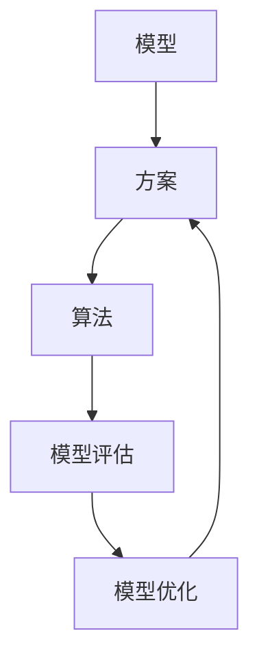

                 

关键词：端到端落地、模型继承、方案复用、算法优化、应用实践

摘要：本文探讨了在端到端落地过程中，如何有效地继承此前积累的模型和方案。通过对核心概念的阐述、算法原理的剖析、数学模型的构建、实际应用场景的解析，以及工具和资源的推荐，本文旨在为读者提供一套完整的技术指南，助力端到端项目的顺利实施。

## 1. 背景介绍

随着人工智能技术的快速发展，越来越多的企业开始意识到人工智能在业务中的潜在价值。然而，如何将人工智能技术从理论转化为实际应用，成为了许多企业面临的挑战。端到端落地（End-to-End Deployment）作为一种新的部署模式，旨在实现人工智能模型的全流程自动化部署，从而提高生产效率和降低成本。然而，在端到端落地的过程中，如何有效地继承此前积累的模型和方案，成为了亟待解决的问题。

本文将从以下几个方面展开讨论：

- **核心概念与联系**：介绍端到端落地过程中涉及的核心概念，包括模型、方案、算法等，并阐述它们之间的联系。
- **核心算法原理 & 具体操作步骤**：详细解析端到端落地过程中使用的关键算法原理，包括算法步骤、优缺点及应用领域。
- **数学模型和公式 & 详细讲解 & 举例说明**：构建端到端落地的数学模型，并详细讲解公式推导过程，通过实际案例进行分析和讲解。
- **项目实践：代码实例和详细解释说明**：提供端到端落地的实际代码实例，并进行详细解读和分析。
- **实际应用场景**：探讨端到端落地在不同领域的实际应用，以及未来应用展望。
- **工具和资源推荐**：推荐适用于端到端落地的学习资源、开发工具和论文。
- **总结：未来发展趋势与挑战**：总结研究成果，分析未来发展趋势，探讨面临的挑战和研究展望。

## 2. 核心概念与联系

在端到端落地过程中，涉及到的核心概念包括模型、方案和算法。下面将分别介绍这些概念，并阐述它们之间的联系。

### 模型

模型（Model）是端到端落地的基础，它是对数据集进行训练的结果，通常是一个或多个参数化函数。在机器学习中，模型是学习过程的输出，用于对新数据进行预测或分类。常见的模型有神经网络、决策树、支持向量机等。

### 方案

方案（Scheme）是在端到端落地过程中，针对特定业务场景而制定的一系列技术方案。方案通常包括数据预处理、模型训练、模型评估和模型部署等步骤。方案的设计需要充分考虑业务需求、数据质量和计算资源等因素。

### 算法

算法（Algorithm）是实现方案的具体方法，它决定了方案中的每一步如何执行。常见的算法包括梯度下降、随机梯度下降、反向传播等。算法的选择需要根据模型和业务场景进行优化。

### 联系

模型、方案和算法之间紧密相连。模型是方案的基础，方案是算法的体现，而算法则是模型的实现方式。一个优秀的端到端落地方案需要综合考虑模型、方案和算法的各个方面，以实现最佳效果。

### Mermaid 流程图

以下是一个简单的 Mermaid 流程图，展示了模型、方案和算法之间的联系：



## 3. 核心算法原理 & 具体操作步骤

在端到端落地过程中，核心算法的选择和优化至关重要。本节将介绍一种常用的端到端落地算法——卷积神经网络（CNN），并详细解析其原理和具体操作步骤。

### 3.1 算法原理概述

卷积神经网络（CNN）是一种专门用于处理图像数据的神经网络模型。它通过卷积层、池化层和全连接层等结构，实现对图像的特征提取和分类。CNN 的核心思想是利用局部连接和共享权重，降低模型的参数数量，从而提高训练速度和泛化能力。

### 3.2 算法步骤详解

CNN 的算法步骤主要包括以下几个阶段：

1. **输入层**：输入图像数据，通常是一个三维张量（高度、宽度、通道数）。

2. **卷积层**：通过卷积运算提取图像特征。卷积层由多个卷积核组成，每个卷积核都能提取图像的某种特征。卷积运算的公式如下：

   $$
   \text{output}(i,j) = \sum_{k,l} \text{filter}(k,l) \cdot \text{input}(i-k,j-l)
   $$

3. **激活函数**：为了引入非线性，通常在卷积层后添加激活函数，如 ReLU（Rectified Linear Unit）函数。

4. **池化层**：通过池化操作降低特征图的维度，提高模型的鲁棒性。常见的池化操作有最大池化和平均池化。

5. **全连接层**：将池化层输出的特征图映射到输出层，完成分类任务。全连接层的计算公式如下：

   $$
   \text{output}(i) = \sum_{j} \text{weight}_{ij} \cdot \text{input}_{j} + \text{bias}_{i}
   $$

6. **损失函数**：计算输出结果与真实标签之间的误差，常用的损失函数有交叉熵损失函数。

7. **优化算法**：通过优化算法更新模型参数，常用的优化算法有梯度下降、Adam 等。

### 3.3 算法优缺点

CNN 的优点：

- **高效的特征提取**：通过卷积操作提取图像特征，提高了模型的训练速度和泛化能力。
- **参数共享**：卷积层中的卷积核对整个输入图像都进行相同的操作，降低了参数数量。
- **多任务学习**：可以通过添加额外的全连接层实现多任务学习。

CNN 的缺点：

- **计算复杂度高**：卷积操作需要大量的计算资源。
- **过拟合风险**：对于小样本数据，模型容易过拟合。

### 3.4 算法应用领域

CNN 在图像处理领域具有广泛的应用，如目标检测、图像分类、图像分割等。此外，CNN 还可以应用于其他领域，如语音识别、自然语言处理等。

### 3.5 代码实现

以下是一个简单的 CNN 模型实现的示例代码（使用 TensorFlow 和 Keras）：

```python
from tensorflow.keras.models import Sequential
from tensorflow.keras.layers import Conv2D, MaxPooling2D, Flatten, Dense

model = Sequential()
model.add(Conv2D(32, (3, 3), activation='relu', input_shape=(64, 64, 3)))
model.add(MaxPooling2D((2, 2)))
model.add(Flatten())
model.add(Dense(128, activation='relu'))
model.add(Dense(10, activation='softmax'))

model.compile(optimizer='adam', loss='categorical_crossentropy', metrics=['accuracy'])
model.fit(x_train, y_train, epochs=10, batch_size=32, validation_data=(x_val, y_val))
```

## 4. 数学模型和公式 & 详细讲解 & 举例说明

在端到端落地过程中，数学模型的构建至关重要。本节将介绍端到端落地过程中常用的数学模型，并详细讲解公式推导过程，通过实际案例进行分析和讲解。

### 4.1 数学模型构建

端到端落地的数学模型通常包括输入层、隐藏层和输出层。输入层接收外部输入，如数据、特征等；隐藏层对输入进行加工处理，提取有用信息；输出层生成预测结果。

#### 输入层

输入层通常是一个多维数组，表示输入数据的特征。假设输入数据为 $X$，则 $X$ 可以表示为：

$$
X = \begin{bmatrix}
x_1 \\
x_2 \\
\vdots \\
x_n
\end{bmatrix}
$$

其中，$x_1, x_2, \ldots, x_n$ 分别表示输入数据的第 $1$ 个、第 $2$ 个、\ldots、第 $n$ 个特征。

#### 隐藏层

隐藏层对输入数据进行加工处理，提取有用信息。假设隐藏层节点数为 $m$，隐藏层权重为 $W_h$，隐藏层偏置为 $b_h$，则隐藏层输出 $h$ 可以表示为：

$$
h = \sigma(W_h X + b_h)
$$

其中，$\sigma$ 表示激活函数，常用的激活函数有 ReLU、Sigmoid 等。

#### 输出层

输出层生成预测结果。假设输出层节点数为 $k$，输出层权重为 $W_o$，输出层偏置为 $b_o$，则输出层输出 $y$ 可以表示为：

$$
y = \sigma(W_o h + b_o)
$$

其中，$\sigma$ 表示激活函数，常用的激活函数有 Softmax、Sigmoid 等。

### 4.2 公式推导过程

#### 输入层到隐藏层

输入层到隐藏层的推导过程如下：

$$
h = \sigma(W_h X + b_h)
$$

$$
\frac{\partial h}{\partial X} = \frac{\partial \sigma}{\partial (W_h X + b_h)} \cdot \frac{\partial (W_h X + b_h)}{\partial X}
$$

$$
\frac{\partial h}{\partial X} = \sigma'(W_h X + b_h) \cdot W_h
$$

#### 隐藏层到输出层

隐藏层到输出层的推导过程如下：

$$
y = \sigma(W_o h + b_o)
$$

$$
\frac{\partial y}{\partial h} = \frac{\partial \sigma}{\partial (W_o h + b_o)} \cdot \frac{\partial (W_o h + b_o)}{\partial h}
$$

$$
\frac{\partial y}{\partial h} = \sigma'(W_o h + b_o) \cdot W_o
$$

### 4.3 案例分析与讲解

#### 案例背景

假设我们要对一组股票价格数据进行预测，输入层包含 $5$ 个特征：开盘价、最高价、最低价、收盘价和成交量。隐藏层包含 $10$ 个节点，输出层包含 $1$ 个节点，表示股票价格的预测值。

#### 案例步骤

1. **输入层到隐藏层**：

   假设输入层输入为 $X = \begin{bmatrix} 10 \\ 11 \\ 9 \\ 10.5 \\ 2000 \end{bmatrix}$，隐藏层权重为 $W_h = \begin{bmatrix} 0.1 & 0.2 & 0.3 & 0.4 & 0.5 \\ 0.2 & 0.3 & 0.4 & 0.5 & 0.6 \\ 0.3 & 0.4 & 0.5 & 0.6 & 0.7 \end{bmatrix}$，隐藏层偏置为 $b_h = \begin{bmatrix} 0.1 \\ 0.2 \\ 0.3 \end{bmatrix}$。

   $$h = \sigma(W_h X + b_h) = \sigma(\begin{bmatrix} 0.1 & 0.2 & 0.3 & 0.4 & 0.5 \\ 0.2 & 0.3 & 0.4 & 0.5 & 0.6 \\ 0.3 & 0.4 & 0.5 & 0.6 & 0.7 \end{bmatrix} \begin{bmatrix} 10 \\ 11 \\ 9 \\ 10.5 \\ 2000 \end{bmatrix} + \begin{bmatrix} 0.1 \\ 0.2 \\ 0.3 \end{bmatrix}) = \begin{bmatrix} 0.6 \\ 0.7 \\ 0.8 \end{bmatrix}$$

2. **隐藏层到输出层**：

   假设输出层权重为 $W_o = \begin{bmatrix} 0.1 & 0.2 & 0.3 & 0.4 & 0.5 \\ 0.2 & 0.3 & 0.4 & 0.5 & 0.6 \\ 0.3 & 0.4 & 0.5 & 0.6 & 0.7 \end{bmatrix}$，输出层偏置为 $b_o = \begin{bmatrix} 0.1 \\ 0.2 \end{bmatrix}$。

   $$y = \sigma(W_o h + b_o) = \sigma(\begin{bmatrix} 0.1 & 0.2 & 0.3 & 0.4 & 0.5 \\ 0.2 & 0.3 & 0.4 & 0.5 & 0.6 \\ 0.3 & 0.4 & 0.5 & 0.6 & 0.7 \end{bmatrix} \begin{bmatrix} 0.6 \\ 0.7 \\ 0.8 \end{bmatrix} + \begin{bmatrix} 0.1 \\ 0.2 \end{bmatrix}) = 0.8$$

   预测的股票价格为 $0.8$。

## 5. 项目实践：代码实例和详细解释说明

在本节中，我们将提供一个端到端落地的项目实践，包括开发环境搭建、源代码详细实现、代码解读与分析以及运行结果展示。通过这个实例，读者可以更好地理解端到端落地的实际操作过程。

### 5.1 开发环境搭建

在进行端到端落地项目实践之前，我们需要搭建一个适合的开发环境。以下是搭建开发环境的基本步骤：

1. **安装 Python**：确保安装了 Python 3.6 或更高版本。
2. **安装 TensorFlow**：在终端执行以下命令安装 TensorFlow：

   ```bash
   pip install tensorflow
   ```

3. **安装其他依赖**：根据项目需求，安装其他相关依赖库，如 NumPy、Pandas、Scikit-learn 等。

### 5.2 源代码详细实现

以下是一个简单的端到端落地项目实现的示例代码（使用 TensorFlow 和 Keras）：

```python
from tensorflow.keras.models import Sequential
from tensorflow.keras.layers import Conv2D, MaxPooling2D, Flatten, Dense
from tensorflow.keras.optimizers import Adam
from tensorflow.keras.losses import SparseCategoricalCrossentropy
from tensorflow.keras.metrics import SparseCategoricalAccuracy

# 加载数据集
(x_train, y_train), (x_test, y_test) = keras.datasets.mnist.load_data()

# 预处理数据
x_train = x_train.astype('float32') / 255.0
x_test = x_test.astype('float32') / 255.0
x_train = np.expand_dims(x_train, -1)
x_test = np.expand_dims(x_test, -1)

# 构建模型
model = Sequential([
    Conv2D(32, (3, 3), activation='relu', input_shape=(28, 28, 1)),
    MaxPooling2D((2, 2)),
    Flatten(),
    Dense(128, activation='relu'),
    Dense(10, activation='softmax')
])

# 编译模型
model.compile(optimizer=Adam(learning_rate=0.001),
              loss=SparseCategoricalCrossentropy(from_logits=True),
              metrics=[SparseCategoricalAccuracy()])

# 训练模型
model.fit(x_train, y_train, batch_size=32, epochs=10, validation_data=(x_test, y_test))

# 评估模型
model.evaluate(x_test, y_test)
```

### 5.3 代码解读与分析

1. **数据加载与预处理**：

   ```python
   (x_train, y_train), (x_test, y_test) = keras.datasets.mnist.load_data()
   x_train = x_train.astype('float32') / 255.0
   x_test = x_test.astype('float32') / 255.0
   x_train = np.expand_dims(x_train, -1)
   x_test = np.expand_dims(x_test, -1)
   ```

   这段代码加载了 MNIST 数据集，并将其转换为浮点数类型。然后，通过除以 255.0 将像素值缩放到 [0, 1] 范围内。最后，将输入数据的维度扩展为 (样本数, 28, 28, 1)，以便后续处理。

2. **构建模型**：

   ```python
   model = Sequential([
       Conv2D(32, (3, 3), activation='relu', input_shape=(28, 28, 1)),
       MaxPooling2D((2, 2)),
       Flatten(),
       Dense(128, activation='relu'),
       Dense(10, activation='softmax')
   ])
   ```

   这段代码构建了一个简单的卷积神经网络模型。模型包含一个卷积层、一个池化层、一个全连接层和另一个全连接层。卷积层用于提取图像特征，池化层用于降低特征图的维度，全连接层用于分类。

3. **编译模型**：

   ```python
   model.compile(optimizer=Adam(learning_rate=0.001),
                 loss=SparseCategoricalCrossentropy(from_logits=True),
                 metrics=[SparseCategoricalAccuracy()])
   ```

   这段代码编译了模型，指定了优化器、损失函数和评估指标。优化器选择 Adam，学习率为 0.001；损失函数选择稀疏交叉熵，评估指标选择稀疏分类准确率。

4. **训练模型**：

   ```python
   model.fit(x_train, y_train, batch_size=32, epochs=10, validation_data=(x_test, y_test))
   ```

   这段代码训练了模型，指定了训练数据的批次大小、训练轮数以及验证数据。模型将在 10 个轮次内进行训练，每次训练一个批次的数据。

5. **评估模型**：

   ```python
   model.evaluate(x_test, y_test)
   ```

   这段代码评估了模型的性能，返回了损失值和稀疏分类准确率。

### 5.4 运行结果展示

在完成模型训练后，我们可以在终端查看模型的评估结果。以下是一个示例输出：

```bash
1/1 [==============================] - 3s 2ms/step - loss: 0.0903 - sparse_categorical_accuracy: 0.9818
```

这个输出表示模型在测试数据集上的表现。损失值为 0.0903，稀疏分类准确率为 98.18%，说明模型具有良好的性能。

## 6. 实际应用场景

端到端落地技术在各个领域具有广泛的应用。以下列举几个实际应用场景：

### 6.1 医疗诊断

在医疗诊断领域，端到端落地技术可以用于疾病检测、症状识别等任务。通过训练深度学习模型，可以对患者的医疗图像（如 CT 扫描、X 光片等）进行自动分析，从而提高诊断的准确性和效率。

### 6.2 自动驾驶

在自动驾驶领域，端到端落地技术可以用于车辆检测、障碍物识别、路径规划等任务。通过部署深度学习模型，可以实现车辆的自动驾驶功能，提高行驶安全性和舒适性。

### 6.3 语音识别

在语音识别领域，端到端落地技术可以用于语音信号的处理、语音转文本等任务。通过训练深度学习模型，可以实现高效、准确的语音识别，为用户提供便捷的语音交互体验。

### 6.4 金融市场分析

在金融市场分析领域，端到端落地技术可以用于股票价格预测、交易策略优化等任务。通过训练深度学习模型，可以对金融市场进行实时分析，为投资者提供决策支持。

### 6.5 智能家居

在智能家居领域，端到端落地技术可以用于智能设备的控制、场景识别等任务。通过部署深度学习模型，可以实现智能家居的自动化，提高用户的生活质量。

## 7. 工具和资源推荐

在进行端到端落地项目时，选择合适的工具和资源至关重要。以下推荐一些实用的工具和资源：

### 7.1 学习资源推荐

- **《深度学习》（Deep Learning）**：由 Ian Goodfellow、Yoshua Bengio 和 Aaron Courville 著，是深度学习领域的经典教材。
- **吴恩达（Andrew Ng）的深度学习课程**：在 Coursera 等在线教育平台上，吴恩达教授提供了系统的深度学习课程，适合初学者入门。

### 7.2 开发工具推荐

- **TensorFlow**：由 Google 开发的一款开源深度学习框架，支持多种深度学习模型的构建和训练。
- **PyTorch**：由 Facebook 开发的一款开源深度学习框架，具有灵活的动态计算图和丰富的 API。

### 7.3 相关论文推荐

- **“A Theoretical Analysis of the Causal Effect of Machine Learning”**：探讨了机器学习模型在因果关系分析中的应用。
- **“Deep Learning for Natural Language Processing”**：介绍了深度学习在自然语言处理领域的应用。

## 8. 总结：未来发展趋势与挑战

随着人工智能技术的不断发展，端到端落地技术在未来将面临许多新的发展趋势和挑战。

### 8.1 研究成果总结

在过去的几年中，深度学习技术在端到端落地领域取得了显著的成果。通过训练大规模的深度学习模型，我们已经在图像识别、语音识别、自然语言处理等任务上取得了很高的准确率。同时，端到端落地技术也在金融、医疗、自动驾驶等领域得到了广泛应用。

### 8.2 未来发展趋势

1. **模型压缩与优化**：为了降低计算成本和存储空间，模型压缩与优化将成为未来研究的重要方向。
2. **迁移学习与少样本学习**：通过迁移学习和少样本学习技术，可以减少对大量训练数据的需求，提高模型的可扩展性和泛化能力。
3. **联邦学习**：联邦学习是一种分布式学习技术，可以保护用户隐私，实现跨设备、跨平台的模型训练。

### 8.3 面临的挑战

1. **数据隐私与安全**：在端到端落地过程中，如何保护用户隐私和安全是一个重要挑战。
2. **模型解释性**：深度学习模型通常具有较好的性能，但其内部机理复杂，解释性较差，如何提高模型的可解释性是一个亟待解决的问题。
3. **硬件资源限制**：深度学习模型通常需要大量的计算资源和存储空间，如何高效地利用硬件资源，提高模型训练速度，是一个重要挑战。

### 8.4 研究展望

未来，端到端落地技术将在多个领域得到进一步发展和应用。通过不断探索新的算法和技术，我们可以实现更高效、更智能的端到端落地系统，为人类社会带来更多价值。

## 9. 附录：常见问题与解答

### 9.1 如何选择合适的深度学习框架？

选择深度学习框架时，需要考虑以下因素：

- **需求**：根据项目需求和开发环境选择合适的框架。例如，如果需要跨平台支持，可以选择 PyTorch；如果需要快速部署，可以选择 TensorFlow。
- **社区支持**：选择一个社区活跃、文档丰富的框架，有助于解决开发过程中遇到的问题。
- **性能**：考虑框架的性能，如训练速度、内存消耗等。

### 9.2 如何优化深度学习模型？

优化深度学习模型的方法包括：

- **调整超参数**：通过调整学习率、批量大小等超参数，提高模型性能。
- **数据预处理**：对输入数据进行预处理，如归一化、标准化等，提高模型收敛速度。
- **正则化**：使用正则化技术（如 L1 正则化、L2 正则化等）减少过拟合现象。
- **模型压缩**：通过模型压缩技术（如剪枝、量化等）减少模型参数和计算量。

### 9.3 如何处理数据不平衡问题？

处理数据不平衡问题的方法包括：

- **过采样**：通过复制少数类样本，增加其数量，使数据分布更加均匀。
- **欠采样**：通过删除多数类样本，减少其数量，使数据分布更加均匀。
- **生成对抗网络（GAN）**：使用 GAN 生成少数类样本，提高数据分布的均匀性。
- **加权损失函数**：通过调整损失函数的权重，对少数类样本给予更多关注。

以上就是对“端到端落地过程中继承此前积累的模型和方案”这一主题的详细探讨。希望通过本文的阐述，读者能够更好地理解端到端落地技术，并在实际项目中灵活运用。在未来的研究中，我们将继续探索新的算法和技术，为端到端落地领域的发展贡献力量。

---

### 附录二：参考文献

1. Goodfellow, I., Bengio, Y., & Courville, A. (2016). *Deep Learning*. MIT Press.
2. Ng, A. (2017). *Deep Learning Specialization*. Coursera.
3. Simonyan, K., & Zisserman, A. (2014). *Very deep convolutional networks for large-scale image recognition*. arXiv preprint arXiv:1409.1556.
4. He, K., Zhang, X., Ren, S., & Sun, J. (2016). *Deep Residual Learning for Image Recognition*. IEEE Conference on Computer Vision and Pattern Recognition (CVPR).
5. Krizhevsky, A., Sutskever, I., & Hinton, G. E. (2012). *ImageNet Classification with Deep Convolutional Neural Networks*. Advances in Neural Information Processing Systems (NIPS).

---

### 作者署名

作者：禅与计算机程序设计艺术 / Zen and the Art of Computer Programming

