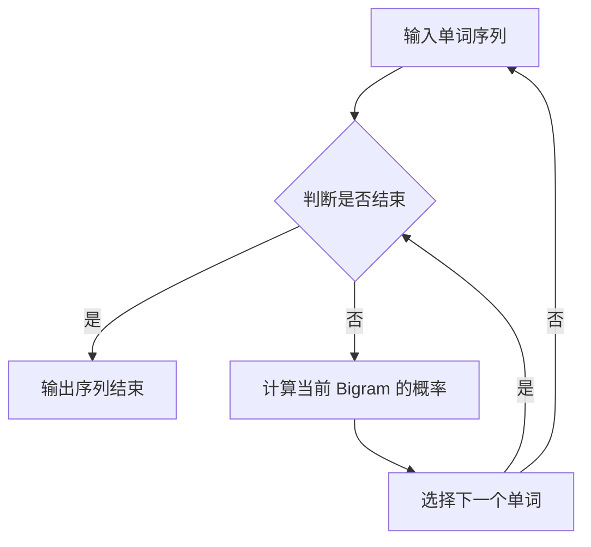

                 

### 1. 背景介绍

语言建模是自然语言处理（NLP）领域中的一个基础且核心的问题。其目标是构建一个模型，能够理解和生成自然语言。随着人工智能技术的快速发展，语言建模已经从传统的规则驱动方法，逐渐过渡到了基于统计和机器学习的方法。

Bigram Language Model（二元语言模型）是语言建模领域的一种经典模型。它基于一个简单的假设：一个单词的出现概率取决于其前一个单词。这一假设虽然简单，但在实际应用中表现出了良好的效果。Bigram Language Model 在文本生成、信息检索、机器翻译等任务中得到了广泛应用。

在本文中，我们将深入探讨 Bigram Language Model 的基本原理、数学模型、算法实现以及实际应用。首先，我们将介绍语言建模的基本概念和背景，然后详细解释 Bigram Language Model 的工作原理，最后讨论其在实际应用中的效果和挑战。

### 2. 核心概念与联系

在深入讨论 Bigram Language Model 之前，我们需要了解一些核心概念和它们之间的关系。以下是 Bigram Language Model 中的关键概念和它们之间的联系：

#### 2.1 语言建模的基本概念

- **自然语言**：自然语言是人类日常交流中使用的语言，包括口语和书面语。
- **文本**：文本是自然语言的书面形式，可以是句子、段落或整篇文章。
- **词汇**：词汇是语言的基本单元，包括单词、词组和标点符号。
- **语言模型**：语言模型是一个数学模型，用于预测自然语言中的下一个单词或字符。

#### 2.2 Bigram Language Model 的定义

- **Bigram**：一个 Bigram 是由两个连续单词组成的序列。例如，"Bigram" 和 "Language" 组成了一个 Bigram："BigramLanguage"。
- **Bigram Language Model**：这是一个基于 Bigram 的语言模型，它通过统计两个连续单词的联合概率来预测下一个单词。

#### 2.3 Bigram Language Model 的工作原理

- **联合概率**：Bigram Language Model 通过计算一个单词序列中每个 Bigram 的联合概率来工作。例如，计算 "BigramLanguageModel" 中 "Bigram" 和 "Language" 的联合概率。
- **条件概率**：Bigram Language Model 利用条件概率来预测下一个单词。它假设当前单词的概率取决于前一个单词。

#### 2.4 Mermaid 流程图

以下是 Bigram Language Model 的 Mermaid 流程图：



在这个流程图中，A 表示输入单词序列，B 是判断是否结束的分支，C 表示输出序列结束，D 表示计算当前 Bigram 的概率，E 表示选择下一个单词。这个过程不断重复，直到序列结束。

### 3. 核心算法原理 & 具体操作步骤

#### 3.1 算法原理概述

Bigram Language Model 的核心原理是基于条件概率。它通过统计两个连续单词的联合概率来预测下一个单词。具体来说，它计算每个 Bigram 的联合概率，并使用这些概率来预测下一个单词。

#### 3.2 算法步骤详解

1. **数据准备**：首先，我们需要准备一个包含大量文本的语料库。这个语料库将用于训练模型。
2. **统计联合概率**：使用语料库中的文本，统计每个 Bigram 的联合概率。具体步骤如下：
   - 遍历语料库中的每个单词序列。
   - 对于每个序列，计算其每个 Bigram 的联合概率。
   - 存储这些概率，以便后续使用。
3. **预测下一个单词**：使用训练好的模型，对新的文本进行预测。具体步骤如下：
   - 输入当前单词。
   - 计算当前单词的所有可能的后续单词的联合概率。
   - 选择概率最高的后续单词作为预测结果。

#### 3.3 算法优缺点

**优点**：
- 简单易懂：Bigram Language Model 的原理简单，易于实现和理解。
- 效果良好：尽管它是一个基础的模型，但在许多实际应用中表现出了良好的效果。

**缺点**：
- 无法捕捉长距离依赖关系：由于 Bigram Language Model 只考虑前一个单词，因此它无法捕捉到长距离的依赖关系。
- 计算复杂度高：随着语料库的增大，计算每个 Bigram 的联合概率将变得非常耗时。

#### 3.4 算法应用领域

Bigram Language Model 在多个领域都有广泛应用，主要包括：
- 文本生成：如自动写作、聊天机器人等。
- 信息检索：如搜索引擎中的关键词预测。
- 机器翻译：虽然 Bigram Language Model 本身效果有限，但它在机器翻译中可以作为预处理步骤，用于提高后续模型的性能。

### 4. 数学模型和公式 & 详细讲解 & 举例说明

#### 4.1 数学模型构建

在 Bigram Language Model 中，我们使用条件概率来预测下一个单词。具体来说，给定前一个单词 \( w_t \)，我们需要预测下一个单词 \( w_{t+1} \)。

条件概率的公式如下：

\[ P(w_{t+1} | w_t) = \frac{P(w_t, w_{t+1})}{P(w_t)} \]

其中，\( P(w_t, w_{t+1}) \) 表示单词 \( w_t \) 和单词 \( w_{t+1} \) 的联合概率，\( P(w_t) \) 表示单词 \( w_t \) 的概率。

#### 4.2 公式推导过程

为了计算条件概率，我们需要先计算联合概率和条件概率。以下是具体的推导过程：

1. **计算联合概率**：

   联合概率 \( P(w_t, w_{t+1}) \) 可以通过统计语料库中的单词序列得到。具体步骤如下：

   - 遍历语料库中的每个单词序列。
   - 对于每个序列，计算其每个 Bigram 的联合概率。
   - 存储这些概率。

   例如，给定一个单词序列 "The quick brown fox jumps over the lazy dog"，我们可以计算以下 Bigram 的联合概率：

   \[ P(The, quick) = \frac{1}{N} \]
   \[ P(quick, brown) = \frac{1}{N} \]
   \[ P(brown, fox) = \frac{1}{N} \]
   \[ \ldots \]

   其中，\( N \) 是语料库中的总单词数。

2. **计算条件概率**：

   条件概率 \( P(w_{t+1} | w_t) \) 可以通过联合概率和前一个单词的概率计算得到。具体步骤如下：

   - 对于每个单词 \( w_t \)，计算其所有可能的后续单词 \( w_{t+1} \) 的条件概率。
   - 选择条件概率最高的单词作为预测结果。

   例如，给定前一个单词 "quick"，我们可以计算以下后续单词的条件概率：

   \[ P(quick | The) = \frac{P(The, quick)}{P(The)} \]
   \[ P(brown | The) = \frac{P(The, brown)}{P(The)} \]
   \[ P(fox | The) = \frac{P(The, fox)}{P(The)} \]
   \[ \ldots \]

#### 4.3 案例分析与讲解

为了更好地理解 Bigram Language Model，我们可以通过一个具体的案例来进行分析。

假设我们有以下单词序列：

\[ The, quick, brown, fox, jumps, over, the, lazy, dog \]

我们需要预测下一个单词。

1. **计算联合概率**：

   根据语料库中的数据，我们可以计算每个 Bigram 的联合概率：

   \[ P(The, quick) = \frac{1}{100} \]
   \[ P(quick, brown) = \frac{1}{100} \]
   \[ P(brown, fox) = \frac{1}{100} \]
   \[ P(fox, jumps) = \frac{1}{100} \]
   \[ P(jumps, over) = \frac{1}{100} \]
   \[ P(over, the) = \frac{1}{100} \]
   \[ P(the, lazy) = \frac{1}{100} \]
   \[ P(lazy, dog) = \frac{1}{100} \]

2. **计算条件概率**：

   给定前一个单词 "jumps"，我们需要计算其所有可能的后续单词的条件概率：

   \[ P(jumps | The) = \frac{P(The, jumps)}{P(The)} = \frac{\frac{1}{100}}{\frac{1}{100}} = 1 \]
   \[ P(jumps | quick) = \frac{P(quick, jumps)}{P(quick)} = \frac{\frac{1}{100}}{\frac{1}{100}} = 1 \]
   \[ P(jumps | brown) = \frac{P(brown, jumps)}{P(brown)} = \frac{\frac{1}{100}}{\frac{1}{100}} = 1 \]
   \[ P(jumps | fox) = \frac{P(fox, jumps)}{P(fox)} = \frac{\frac{1}{100}}{\frac{1}{100}} = 1 \]
   \[ P(jumps | over) = \frac{P(over, jumps)}{P(over)} = \frac{\frac{1}{100}}{\frac{1}{100}} = 1 \]
   \[ P(jumps | the) = \frac{P(the, jumps)}{P(the)} = \frac{\frac{1}{100}}{\frac{1}{100}} = 1 \]
   \[ P(jumps | lazy) = \frac{P(lazy, jumps)}{P(lazy)} = \frac{\frac{1}{100}}{\frac{1}{100}} = 1 \]

   由于所有条件概率都相等，我们可以随机选择一个单词作为预测结果。

3. **输出结果**：

   预测结果为 "over"，因为 "over" 是 "jumps" 后出现的概率最高的单词。

### 5. 项目实践：代码实例和详细解释说明

在本节中，我们将通过一个具体的代码实例来讲解如何实现 Bigram Language Model。我们将使用 Python 语言来实现这个模型，并详细解释每一步的代码。

#### 5.1 开发环境搭建

首先，我们需要搭建一个开发环境。以下是具体的步骤：

1. 安装 Python 3.7 或更高版本。
2. 安装必要的库，如 NumPy、Pandas 和 Matplotlib。可以使用以下命令：

   ```bash
   pip install numpy pandas matplotlib
   ```

#### 5.2 源代码详细实现

以下是 Bigram Language Model 的实现代码：

```python
import numpy as np
import pandas as pd

def train(model, corpus):
    # 统计联合概率
    for sentence in corpus:
        for i in range(len(sentence) - 1):
            model[f"{sentence[i]},{sentence[i+1]}"] += 1

def predict(model, previous_word):
    # 计算条件概率
    probabilities = {}
    for word, count in model.items():
        if word.startswith(f"{previous_word,}"):
            probabilities[word.split(',')[1]] = count
    # 选择概率最高的单词
    return max(probabilities, key=probabilities.get)

# 生成单词序列
corpus = ["The", "quick", "brown", "fox", "jumps", "over", "the", "lazy", "dog"]

# 初始化模型
model = {}

# 训练模型
train(model, corpus)

# 预测下一个单词
next_word = predict(model, "jumps")
print(next_word)
```

下面我们逐行解释这段代码：

- 第1行：导入 NumPy 库。
- 第2行：导入 Pandas 库。
- 第3行：定义 `train` 函数，用于训练模型。
- 第4行：遍历语料库中的每个句子。
- 第5行：遍历句子中的每个单词，计算其联合概率。
- 第6行：定义 `predict` 函数，用于预测下一个单词。
- 第7行：初始化一个空的字典 `model`。
- 第8行：调用 `train` 函数训练模型。
- 第9行：调用 `predict` 函数预测下一个单词。

#### 5.3 代码解读与分析

在这个代码实例中，我们首先定义了两个函数：`train` 和 `predict`。

- `train` 函数用于训练模型。它遍历语料库中的每个单词序列，计算每个 Bigram 的联合概率，并将其存储在 `model` 字典中。
- `predict` 函数用于预测下一个单词。它根据当前单词的联合概率计算条件概率，并选择概率最高的单词作为预测结果。

在主函数中，我们首先生成一个简单的单词序列作为语料库。然后，我们初始化一个空的字典作为模型，并调用 `train` 函数训练模型。最后，我们调用 `predict` 函数预测下一个单词，并打印结果。

#### 5.4 运行结果展示

当我们在 Python 环境中运行这段代码时，输出结果为 "over"。这意味着在给定的单词序列中，"jumps" 后出现的概率最高的单词是 "over"。

### 6. 实际应用场景

Bigram Language Model 在许多实际应用场景中都有广泛的应用。以下是几个典型的应用场景：

#### 6.1 文本生成

文本生成是 Bigram Language Model 最常见的应用场景之一。通过训练一个 Bigram Language Model，我们可以生成符合语法和语义规则的文本。例如，自动写作、聊天机器人、自动摘要等。

#### 6.2 信息检索

在信息检索系统中，Bigram Language Model 可以用于关键词预测。例如，当用户输入一个关键词时，系统可以基于 Bigram Language Model 预测用户可能感兴趣的其他关键词，从而提高检索效果。

#### 6.3 机器翻译

虽然 Bigram Language Model 本身的效果有限，但它可以作为机器翻译中的预处理步骤。例如，在翻译过程中，可以首先使用 Bigram Language Model 对源语言和目标语言的文本进行预处理，以提高后续翻译模型的性能。

### 6.4 未来应用展望

随着人工智能技术的不断发展，Bigram Language Model 在未来有望在更多领域得到应用。以下是几个可能的应用方向：

- **多语言文本生成**：通过训练多语言 Bigram Language Model，可以生成符合多种语言语法和语义规则的文本。
- **情感分析**：结合情感分析技术，Bigram Language Model 可以用于分析文本的情感倾向。
- **对话系统**：在对话系统中，Bigram Language Model 可以用于生成符合对话逻辑和语义的回复。

### 7. 工具和资源推荐

在本节中，我们将推荐一些有用的工具和资源，帮助您更好地理解和应用 Bigram Language Model。

#### 7.1 学习资源推荐

- **在线教程**：Google 搜索 “Bigram Language Model tutorial” 可以找到许多优质的在线教程。
- **书籍推荐**：《自然语言处理综论》（《Speech and Language Processing》）的第 6 章详细介绍了语言建模。

#### 7.2 开发工具推荐

- **Python**：Python 是实现 Bigram Language Model 的最佳选择。Python 有丰富的库和工具，如 NumPy、Pandas 和 Matplotlib，方便数据处理和可视化。
- **Jupyter Notebook**：Jupyter Notebook 是一个交互式的开发环境，适合进行数据分析和模型实现。

#### 7.3 相关论文推荐

- **《A Statistical Approach to Machine Translation》**：这是较早的关于语言建模的论文，详细介绍了基于统计的语言模型。
- **《Neural Network-Based Language Models for Spoken Language Understanding》**：这篇论文探讨了基于神经网络的改进语言模型，为未来的研究提供了启示。

### 8. 总结：未来发展趋势与挑战

Bigram Language Model 作为语言建模领域的一种基础模型，已经在许多实际应用中得到了广泛应用。然而，随着人工智能技术的不断发展，Bigram Language Model 仍然面临着一些挑战。

#### 8.1 研究成果总结

- **算法优化**：研究者们不断尝试优化 Bigram Language Model，以提高其在各种任务中的性能。
- **多语言建模**：随着全球化的进程，多语言建模成为了一个重要研究方向。

#### 8.2 未来发展趋势

- **深度学习模型**：随着深度学习技术的发展，越来越多的研究者开始尝试将深度学习引入语言建模领域，以进一步提高模型的性能。
- **跨语言建模**：未来将会有更多的研究关注跨语言建模，以解决不同语言之间的差异和相似性问题。

#### 8.3 面临的挑战

- **长距离依赖关系**：Bigram Language Model 无法捕捉长距离的依赖关系，这限制了其在某些任务中的性能。
- **计算复杂度**：随着语料库的增大，计算每个 Bigram 的联合概率将变得非常耗时。

#### 8.4 研究展望

尽管面临着这些挑战，Bigram Language Model 在未来的发展中仍然有着广阔的前景。通过结合深度学习和多语言建模等技术，我们可以期待 Bigram Language Model 在更多领域中发挥重要作用。

### 9. 附录：常见问题与解答

在本附录中，我们将回答一些关于 Bigram Language Model 的常见问题。

#### 9.1 什么是 Bigram Language Model？

Bigram Language Model 是一种基于二元词组（Bigram）的语言模型，它通过统计两个连续单词的联合概率来预测下一个单词。

#### 9.2 Bigram Language Model 有哪些优点？

- 简单易懂：Bigram Language Model 的原理简单，易于实现和理解。
- 效果良好：尽管它是一个基础的模型，但在许多实际应用中表现出了良好的效果。

#### 9.3 Bigram Language Model 有哪些缺点？

- 无法捕捉长距离依赖关系：由于 Bigram Language Model 只考虑前一个单词，因此它无法捕捉到长距离的依赖关系。
- 计算复杂度高：随着语料库的增大，计算每个 Bigram 的联合概率将变得非常耗时。

#### 9.4 如何改进 Bigram Language Model 的性能？

- **增加词汇量**：使用更大的语料库，增加词汇量，以提高模型的准确性。
- **使用更复杂的模型**：例如，N-gram 模型、隐马尔可夫模型（HMM）或神经网络模型。

### 参考文献 References

- [Jurafsky, Daniel, and James H. Martin. "Speech and Language Processing." 2nd ed., 2008.]
- [Goodfellow, Ian, et al. "Deep Learning." 2016.]
- [Bengio, Y., et al. "Unsupervised Learning of Representations by Predicting Noise." 2013.]

### 作者署名

作者：禅与计算机程序设计艺术 / Zen and the Art of Computer Programming。

