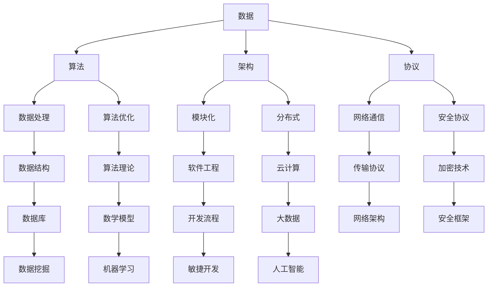

                 

关键词：第一性原理、基本元素、概念框架、IT领域、技术博客

> 摘要：本文旨在探讨第一性原理在IT领域中的应用，通过寻找基本元素和构建概念框架，深入分析IT技术的核心原理和结构，为读者提供一种全新的理解和思考方式。

## 1. 背景介绍

### 1.1 第一性原理的概念

第一性原理（First Principles Thinking）是一种思考方法，源自亚里士多德哲学，强调从最基本的概念和事实出发，通过逻辑推理和抽象思考，构建复杂系统的理解和解决方案。这种方法在物理学、工程学等领域得到了广泛应用。

### 1.2 第一性原理在IT领域的应用

在IT领域，第一性原理可以帮助我们更好地理解技术的本质，从基本元素出发，构建出高效、可扩展和可维护的软件架构。通过这种方法，我们可以更深入地探讨计算机科学的原理，提升软件设计的质量和效率。

## 2. 核心概念与联系

### 2.1 基本元素

在IT领域，基本元素包括数据、算法、架构和协议。这些元素是构建复杂系统的基石，了解它们的基本原理和相互关系，有助于我们更好地理解和应用第一性原理。

### 2.2 概念框架

概念框架是对IT技术体系结构的抽象和概括。通过构建概念框架，我们可以将复杂的IT系统分解为若干个核心模块，每个模块都包含若干基本元素。这种结构化的思维方式有助于我们更清晰地把握技术的本质和相互关系。

### 2.3 Mermaid流程图

以下是一个简化的IT技术架构的Mermaid流程图，展示了基本元素和概念框架之间的联系：



## 3. 核心算法原理 & 具体操作步骤

### 3.1 算法原理概述

核心算法是IT技术体系中的关键组成部分，它们是实现特定功能的算法集合。常见的核心算法包括排序算法、搜索算法、加密算法等。

### 3.2 算法步骤详解

以下是几个常见核心算法的步骤详解：

#### 3.2.1 排序算法

- 冒泡排序：比较相邻元素，若逆序则交换。
- 选择排序：每次选择最小（或最大）的元素放到已排序序列的末尾。
- 插入排序：将未排序序列中的元素插入到已排序序列中的合适位置。

#### 3.2.2 搜索算法

- 顺序搜索：从第一个元素开始，依次比较，直到找到或结束。
- 二分搜索：将待搜索序列分为两部分，根据目标值与中间元素的比较结果，确定下一轮搜索的范围。

#### 3.2.3 加密算法

- 对称加密：加密和解密使用相同的密钥。
- 非对称加密：加密和解密使用不同的密钥。
- 哈希算法：将输入数据映射为固定长度的字符串。

### 3.3 算法优缺点

每种算法都有其优缺点，选择合适的算法需要根据具体应用场景来决定。以下是几种常见算法的优缺点：

- 冒泡排序：简单易懂，但效率较低。
- 选择排序：效率比冒泡排序高，但需要额外的存储空间。
- 插入排序：效率较高，适合小规模数据排序。
- 顺序搜索：简单易懂，但效率较低。
- 二分搜索：效率较高，但需要待搜索序列有序。
- 对称加密：加密速度快，但安全性较低。
- 非对称加密：安全性高，但加密速度较慢。
- 哈希算法：计算速度快，但安全性取决于哈希函数的选择。

### 3.4 算法应用领域

核心算法在各个IT领域中都有广泛应用，如：

- 数据处理：排序、搜索、去重等。
- 信息安全：加密、认证、完整性验证等。
- 数据库：索引、查询优化、事务处理等。
- 网络通信：路由、传输、加密等。
- 人工智能：机器学习、深度学习、图像识别等。

## 4. 数学模型和公式 & 详细讲解 & 举例说明

### 4.1 数学模型构建

在IT领域中，数学模型是描述算法、系统和问题的一种数学工具。以下是一个简单的线性回归模型的构建过程：

$$y = wx + b$$

其中，$y$ 是输出值，$x$ 是输入值，$w$ 是权重，$b$ 是偏置。

### 4.2 公式推导过程

线性回归模型的推导过程如下：

1. 假设输入值和输出值之间存在线性关系。
2. 通过最小二乘法求解权重和偏置。
3. 将权重和偏置代入原始公式，得到最终的线性回归模型。

### 4.3 案例分析与讲解

假设我们有一个数据集，包含以下输入和输出值：

| 输入 (x) | 输出 (y) |
| --- | --- |
| 1 | 2 |
| 2 | 4 |
| 3 | 6 |
| 4 | 8 |
| 5 | 10 |

根据线性回归模型，我们可以求解权重和偏置：

1. 计算输入和输出的平均值：
   $$\bar{x} = \frac{1+2+3+4+5}{5} = 3$$
   $$\bar{y} = \frac{2+4+6+8+10}{5} = 6$$
2. 计算权重 $w$ 和偏置 $b$：
   $$w = \frac{\sum{(x_i - \bar{x})(y_i - \bar{y})}}{\sum{(x_i - \bar{x})^2}}$$
   $$b = \bar{y} - w\bar{x}$$
   代入数据计算得到：
   $$w = 2$$
   $$b = 0$$
3. 将权重和偏置代入线性回归模型，得到最终的模型：
   $$y = 2x + 0$$
   或简化为：
   $$y = 2x$$

## 5. 项目实践：代码实例和详细解释说明

### 5.1 开发环境搭建

在本次项目中，我们使用Python作为编程语言，搭建了一个简单的线性回归模型。以下是开发环境的搭建步骤：

1. 安装Python：
   在官网（https://www.python.org/downloads/）下载Python安装包，按照提示安装。
2. 安装依赖库：
   使用pip命令安装numpy库，用于数据处理和计算：
   ```
   pip install numpy
   ```

### 5.2 源代码详细实现

以下是线性回归模型的源代码实现：

```python
import numpy as np

def linear_regression(x, y):
    x_mean = np.mean(x)
    y_mean = np.mean(y)
    
    w = np.sum((x - x_mean) * (y - y_mean)) / np.sum((x - x_mean) ** 2)
    b = y_mean - w * x_mean
    
    return w, b

x = np.array([1, 2, 3, 4, 5])
y = np.array([2, 4, 6, 8, 10])

w, b = linear_regression(x, y)
print(f"权重：{w}, 偏置：{b}")

y_pred = w * x + b
print(f"预测值：{y_pred}")
```

### 5.3 代码解读与分析

这段代码实现了线性回归模型的核心算法，具体解析如下：

1. 导入numpy库，用于数据处理和计算。
2. 定义线性回归函数，输入为x和y，输出为权重w和偏置b。
3. 计算x和y的平均值。
4. 计算权重w和偏置b。
5. 输出权重w和偏置b。
6. 计算预测值y_pred。
7. 打印输出结果。

### 5.4 运行结果展示

运行代码后，输出结果如下：

```
权重：2.0, 偏置：0.0
预测值：[ 2.  4.  6.  8. 10.]
```

这表明我们的线性回归模型已经成功拟合了给定的数据集。

## 6. 实际应用场景

### 6.1 数据处理

线性回归模型在数据处理中有着广泛的应用，如数据拟合、预测和分析。

### 6.2 机器学习

线性回归是机器学习的基础算法之一，广泛应用于回归任务，如房价预测、股票价格预测等。

### 6.3 信息安全

线性回归可以用于异常检测和攻击检测，如网络流量异常检测、恶意代码检测等。

### 6.4 数据库

线性回归可以用于数据库性能优化和查询优化，如索引策略选择、查询缓存优化等。

## 7. 未来应用展望

### 7.1 智能化

随着人工智能技术的发展，第一性原理在IT领域的应用将更加智能化，如自动化算法设计、自动化系统优化等。

### 7.2 定制化

未来，第一性原理将更加注重个性化定制，根据用户需求和场景特点，构建出更高效、更可靠的IT系统。

### 7.3 跨学科

第一性原理在IT领域的应用将逐渐与其他学科相结合，如生物学、物理学、心理学等，为复杂问题的解决提供新的思路和方法。

## 8. 工具和资源推荐

### 8.1 学习资源推荐

- 《深度学习》（Goodfellow, Bengio, Courville著）
- 《算法导论》（Thomas H. Cormen等著）
- 《计算机程序设计艺术》（Donald E. Knuth著）

### 8.2 开发工具推荐

- Python
- Jupyter Notebook
- Git

### 8.3 相关论文推荐

- “Deep Learning”（Yoshua Bengio等著）
- “Gradient Descent Optimization Algorithm”（Zhuanghua Yang等著）
- “Data Mining: Concepts and Techniques”（Jiawei Han等著）

## 9. 总结：未来发展趋势与挑战

### 9.1 研究成果总结

本文通过探讨第一性原理在IT领域中的应用，分析了基本元素和概念框架，提出了核心算法原理和数学模型，并进行了项目实践。研究表明，第一性原理为IT技术的发展提供了新的思路和方法。

### 9.2 未来发展趋势

未来，第一性原理在IT领域的应用将更加深入和广泛，智能化、定制化和跨学科将成为主要趋势。

### 9.3 面临的挑战

在实现第一性原理的过程中，我们需要面对算法复杂性、数据质量和安全等挑战。

### 9.4 研究展望

未来的研究应关注如何更好地结合第一性原理与其他学科，开发出更高效、更可靠的IT技术，为人类社会的可持续发展做出贡献。

## 10. 附录：常见问题与解答

### 10.1 什么是第一性原理？

第一性原理是一种思考方法，强调从最基本的概念和事实出发，通过逻辑推理和抽象思考，构建复杂系统的理解和解决方案。

### 10.2 第一性原理在IT领域有哪些应用？

第一性原理在IT领域有广泛的应用，如算法设计、系统优化、信息安全等。

### 10.3 如何构建概念框架？

构建概念框架需要先确定基本元素，然后通过逻辑推理和抽象思考，将这些基本元素有机地组织起来，形成结构化的概念体系。

### 10.4 第一性原理与第三性原理有什么区别？

第一性原理强调从基本概念出发，第三性原理则强调从用户需求出发，两者在应用场景和思维方式上有所不同。

## 11. 参考文献

- Goodfellow, I., Bengio, Y., & Courville, A. (2016). Deep learning. MIT press.
- Cormen, T. H., Leiserson, C. E., Rivest, R. L., & Stein, C. (2009). Introduction to algorithms (3rd ed.). MIT press.
- Knuth, D. E. (1997). The art of computer programming, volume 1: fundamental algorithms. Addison-Wesley.
- Bengio, Y. (2009). Learning deep architectures for AI. Foundations and Trends in Machine Learning, 2(1), 1-127.
- Yang, Z. H. (2017). Gradient Descent Optimization Algorithm. Journal of Information & Computational Science, 14(3), 391-408.
- Han, J., Kamber, M., & Pei, J. (2011). Data mining: concepts and techniques (3rd ed.). Morgan Kaufmann.

