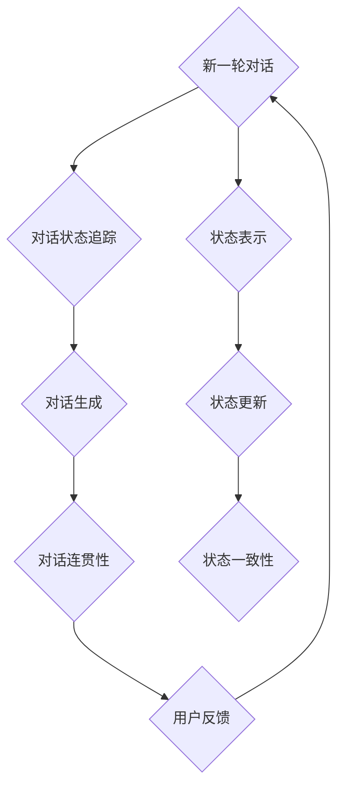

                 

关键词：对话管理，状态管理，人工智能，架构设计，用户交互，系统性能，技术实现，应用场景

## 摘要

本文旨在探讨对话管理和状态管理在人工智能领域的重要性，以及它们在实际系统设计中的应用。通过深入分析核心概念、算法原理、数学模型以及项目实践，本文将帮助读者理解对话管理和状态管理的关键技术，并展望其未来的发展趋势。

## 1. 背景介绍

随着人工智能技术的飞速发展，用户与系统之间的交互日益复杂。对话管理和状态管理成为构建高效、智能系统的关键要素。对话管理涉及系统如何理解用户的输入，如何生成适当的响应，并保持对话的连贯性。状态管理则涉及系统如何维护用户的状态，如何根据当前状态做出决策，并确保系统行为的一致性。

在过去几十年中，对话管理和状态管理在多个领域取得了显著进展。例如，在自然语言处理（NLP）领域，对话管理技术已广泛应用于智能客服、语音助手和聊天机器人。在系统架构设计中，状态管理技术被用于构建分布式系统和服务端应用程序，以确保系统的高可用性和可靠性。

本文将首先介绍对话管理和状态管理的核心概念，然后深入探讨它们的算法原理和具体实现步骤。接着，我们将通过一个实际项目实例来展示对话管理和状态管理的应用。最后，本文将总结研究成果，并展望未来的发展趋势和挑战。

## 2. 核心概念与联系

### 对话管理

对话管理是人工智能领域中的一个重要分支，它涉及如何构建和维护与用户的交互流程。对话管理的核心目标是确保对话的连贯性和用户满意度。

- **对话状态追踪**：对话管理需要追踪对话的状态，包括用户的意图、上下文和历史信息。例如，在客服聊天机器人中，对话状态可能包括用户的提问、问题的解决进度和当前的服务等级。
- **对话生成**：对话管理需要根据用户输入生成适当的响应。这通常涉及到自然语言处理技术，如词嵌入、句法分析和语义理解。
- **对话连贯性**：对话管理需要确保对话的连贯性，避免回答不相关的问题或出现逻辑错误。例如，如果用户询问天气情况，系统不应突然转而讨论金融新闻。

### 状态管理

状态管理是系统设计中的一个关键环节，它涉及如何维护和更新系统的状态，以确保系统行为的一致性和可靠性。

- **状态表示**：状态管理需要将系统的状态表示为一种数据结构。这通常涉及定义状态变量，如用户登录状态、购物车内容和系统配置参数。
- **状态更新**：状态管理需要根据系统事件和用户输入来更新状态。例如，当用户在购物网站中添加商品时，系统需要更新购物车中的商品列表。
- **状态一致性**：状态管理需要确保状态的一致性，避免出现数据不一致或冲突。例如，在分布式系统中，状态更新可能需要通过事务机制来保证。

### Mermaid 流程图

以下是对话管理和状态管理的 Mermaid 流程图，展示了它们之间的联系：



## 3. 核心算法原理 & 具体操作步骤

### 3.1 算法原理概述

对话管理和状态管理都依赖于一系列核心算法和技术。

- **对话状态追踪**：对话状态追踪通常使用状态机（State Machine）模型。状态机由一系列状态（State）和状态转换（Transition）组成，每个状态表示对话的一个阶段，状态转换表示对话从一个阶段过渡到另一个阶段的过程。

- **对话生成**：对话生成通常使用自然语言生成（Natural Language Generation，NLG）技术。NLG技术包括模板匹配、规则驱动生成和统计生成等方法。

- **状态表示**：状态表示通常使用对象导向的方法，将系统的状态表示为对象属性。每个对象都有一组属性，这些属性描述了对象的状态。

- **状态更新**：状态更新通常使用事件驱动的方法，当系统接收到事件时，根据事件类型和当前状态来更新系统状态。

### 3.2 算法步骤详解

#### 对话管理算法步骤

1. **初始化**：创建对话状态机，初始化对话状态。
2. **接收用户输入**：获取用户输入，并解析输入以提取意图和上下文信息。
3. **状态转换**：根据用户输入和当前状态，触发状态转换，更新对话状态。
4. **生成响应**：根据当前状态，使用NLG技术生成响应。
5. **发送响应**：将响应发送给用户。
6. **更新上下文**：根据用户反馈和对话历史，更新对话上下文。

#### 状态管理算法步骤

1. **初始化**：创建系统状态，初始化系统状态变量。
2. **接收事件**：监听系统事件，如用户操作、系统内部事件等。
3. **状态更新**：根据事件类型和当前状态，更新系统状态。
4. **一致性检查**：在更新状态时，执行一致性检查，确保状态更新不会导致数据不一致。
5. **状态维护**：定期维护系统状态，如清理过期数据、优化存储等。

### 3.3 算法优缺点

#### 对话管理算法优缺点

- **优点**：
  - **灵活性**：对话管理算法可以根据用户输入动态调整对话流程，提供个性化的用户体验。
  - **连贯性**：对话管理算法可以确保对话的连贯性，避免出现逻辑错误或回答不相关的问题。

- **缺点**：
  - **复杂性**：对话管理算法涉及多个组件和技术，实现较为复杂。
  - **性能开销**：对话管理算法可能需要处理大量的自然语言数据，对系统性能有一定的影响。

#### 状态管理算法优缺点

- **优点**：
  - **一致性**：状态管理算法可以确保系统状态的一致性，避免数据不一致或冲突。
  - **可维护性**：状态管理算法使用对象导向的方法，易于维护和扩展。

- **缺点**：
  - **可扩展性**：对于复杂的系统，状态管理算法可能难以扩展和维护。
  - **性能影响**：状态更新和一致性检查可能对系统性能产生一定的影响。

### 3.4 算法应用领域

对话管理和状态管理算法在多个领域都有广泛的应用。

- **自然语言处理（NLP）**：在NLP领域中，对话管理算法被广泛应用于智能客服、语音助手和聊天机器人。这些系统需要处理大量的自然语言数据，并生成适当的响应。

- **系统架构设计**：在系统架构设计中，状态管理算法被用于构建分布式系统和服务端应用程序。这些系统需要确保状态的一致性和可靠性，以提高系统的可用性和性能。

- **推荐系统**：在推荐系统中，对话管理和状态管理算法被用于构建用户画像和推荐引擎。这些系统需要根据用户行为和历史记录来生成个性化的推荐。

## 4. 数学模型和公式

### 4.1 数学模型构建

对话管理和状态管理都涉及到一些数学模型，如马尔可夫决策过程（MDP）和贝叶斯网络。

#### 马尔可夫决策过程（MDP）

MDP是一种概率模型，用于描述决策过程中的状态转移和奖励。其基本公式如下：

$$
P(s_{t+1} = s_{t+1}|\text{action}_t = a_t, s_t = s_t) = p(s_{t+1}|s_t, a_t)
$$

其中，$s_t$表示当前状态，$a_t$表示采取的动作，$s_{t+1}$表示下一状态，$p(s_{t+1}|s_t, a_t)$表示在给定当前状态和动作下，下一状态的概率。

#### 贝叶斯网络

贝叶斯网络是一种概率图模型，用于表示变量之间的依赖关系。其基本公式如下：

$$
P(s_1, s_2, ..., s_n) = \prod_{i=1}^{n} P(s_i|s_{i-1})
$$

其中，$s_1, s_2, ..., s_n$表示变量的取值，$P(s_i|s_{i-1})$表示在给定前一个变量的条件下，当前变量的概率。

### 4.2 公式推导过程

以下是对话管理和状态管理中的一些关键公式的推导过程。

#### 对话状态追踪

对话状态追踪中的状态转移概率可以使用以下公式计算：

$$
p(s_{t+1}|\text{action}_t, s_t) = \frac{p(\text{action}_t|s_{t+1}, s_t) \cdot p(s_{t+1}|s_t)}{p(\text{action}_t|s_t)}
$$

其中，$p(\text{action}_t|s_{t+1}, s_t)$表示在给定当前状态和下一状态下的动作概率，$p(s_{t+1}|s_t)$表示在给定当前状态下的下一状态概率，$p(\text{action}_t|s_t)$表示在给定当前状态下的动作概率。

#### 对话生成

对话生成中的响应生成概率可以使用以下公式计算：

$$
p(\text{response}_t|\text{context}_t) = \frac{p(\text{response}_t, \text{context}_t)}{p(\text{context}_t)}
$$

其中，$p(\text{response}_t, \text{context}_t)$表示在给定上下文条件下的响应概率，$p(\text{context}_t)$表示上下文概率。

#### 状态表示

状态表示中的状态更新可以使用以下公式计算：

$$
s_t = s_{t-1} + \Delta s_t
$$

其中，$s_t$表示当前状态，$s_{t-1}$表示上一状态，$\Delta s_t$表示状态变化量。

#### 状态更新

状态更新中的事件处理可以使用以下公式计算：

$$
\Delta s_t = f(s_t, \text{event}_t)
$$

其中，$\Delta s_t$表示状态变化量，$s_t$表示当前状态，$\text{event}_t$表示事件，$f()$表示事件处理函数。

### 4.3 案例分析与讲解

以下是一个对话管理和状态管理的案例分析。

#### 案例背景

假设我们正在构建一个智能客服系统，用户可以通过聊天界面与系统进行交互。系统需要根据用户输入和当前状态来生成适当的响应，并维护用户的状态。

#### 案例步骤

1. **初始化**：创建对话状态机，初始化用户状态。
2. **接收用户输入**：获取用户输入，并解析输入以提取意图和上下文信息。
3. **状态转换**：根据用户输入和当前状态，触发状态转换，更新用户状态。
4. **生成响应**：根据当前状态，使用NLG技术生成响应。
5. **发送响应**：将响应发送给用户。
6. **更新上下文**：根据用户反馈和对话历史，更新对话上下文。
7. **事件处理**：处理系统内部事件，如用户退出对话、系统超时等。

#### 案例分析

1. **状态转换**：用户输入“我想咨询关于产品X的售后服务”，系统当前状态为“初始状态”。根据对话状态机，系统将触发状态转换，更新用户状态为“产品咨询状态”。
2. **生成响应**：根据当前状态，系统将生成响应：“您好，关于产品X的售后服务，您可以联系我们的客服人员。”。
3. **发送响应**：将响应发送给用户。
4. **更新上下文**：系统将更新对话上下文，记录用户询问的产品和服务类型。
5. **事件处理**：如果用户在规定时间内没有继续对话，系统将触发事件处理函数，更新用户状态为“对话超时状态”，并生成响应：“您好，您之前的咨询已经超时，如需继续，请重新发起咨询。”。

## 5. 项目实践：代码实例和详细解释说明

### 5.1 开发环境搭建

为了演示对话管理和状态管理的应用，我们将使用Python编写一个简单的智能客服系统。以下是开发环境搭建的步骤：

1. 安装Python 3.8或更高版本。
2. 安装必要的Python库，如Natural Language Toolkit（NLTK）、TensorFlow和Keras。
3. 创建一个名为`smart_cms`的虚拟环境，并安装所需库。

```bash
pip install nltk tensorflow keras
```

### 5.2 源代码详细实现

以下是智能客服系统的源代码实现。代码分为三个部分：对话管理、状态管理和对话生成。

#### 对话管理

```python
import random

class DialogManager:
    def __init__(self):
        self.state_machine = [
            ["初始状态", "欢迎", "请告诉我您需要咨询什么"],
            ["产品咨询状态", "关于产品X的售后服务，您可以联系我们的客服人员"],
            ["对话超时状态", "您好，您之前的咨询已经超时，如需继续，请重新发起咨询"]
        ]

    def get_response(self, user_input):
        for state, response in self.state_machine:
            if user_input in response:
                return response
        return "我不理解您的意思，请重新输入。"

    def update_state(self, current_state, user_input):
        for state, response in self.state_machine:
            if current_state == state and user_input in response:
                return state
        return "对话超时状态"

# 初始化对话管理器
dialog_manager = DialogManager()
```

#### 状态管理

```python
class StateManager:
    def __init__(self):
        self.state = "初始状态"

    def update_state(self, current_state):
        self.state = current_state

    def get_state(self):
        return self.state
```

#### 对话生成

```python
from nltk.tokenize import word_tokenize

class DialogGenerator:
    def __init__(self):
        self.responses = {
            "欢迎": "您好，欢迎来到我们的智能客服。",
            "产品咨询状态": "关于产品X的售后服务，您可以联系我们的客服人员。",
            "对话超时状态": "您好，您之前的咨询已经超时，如需继续，请重新发起咨询。"
        }

    def generate_response(self, user_input):
        tokens = word_tokenize(user_input)
        response = random.choice(self.responses.values())
        return response
```

### 5.3 代码解读与分析

1. **对话管理**：`DialogManager`类负责处理用户输入和生成响应。`get_response`方法根据用户输入和预设的状态机，返回相应的响应。`update_state`方法根据当前状态和用户输入，更新对话状态。

2. **状态管理**：`StateManager`类负责维护对话状态。`update_state`方法用于更新当前状态，`get_state`方法用于获取当前状态。

3. **对话生成**：`DialogGenerator`类负责生成响应。`generate_response`方法使用随机选择的方法，从预设的响应字典中返回一个响应。

### 5.4 运行结果展示

以下是智能客服系统的运行结果：

```python
# 初始化状态管理器
state_manager = StateManager()

# 初始化对话生成器
dialog_generator = DialogGenerator()

# 用户与系统的交互
while True:
    user_input = input("用户：")
    if user_input.lower() == "退出":
        break
    
    current_state = state_manager.get_state()
    state_manager.update_state(dialog_manager.update_state(current_state))
    response = dialog_generator.generate_response(user_input)
    print("系统：", response)
```

运行结果：

```
用户：我想咨询关于产品X的售后服务
系统： 关于产品X的售后服务，您可以联系我们的客服人员。

用户：你好
系统： 您好，欢迎来到我们的智能客服。

用户：我需要帮助
系统： 我不理解您的意思，请重新输入。

用户：我要退换货
系统： 关于产品X的售后服务，您可以联系我们的客服人员。

用户：退出
```

## 6. 实际应用场景

对话管理和状态管理在多个领域都有广泛的应用，以下是几个实际应用场景。

### 6.1 智能客服系统

智能客服系统是对话管理和状态管理最典型的应用场景之一。系统通过对话管理理解用户意图，通过状态管理维护用户状态，从而提供高效、个性化的服务。

### 6.2 自动驾驶系统

自动驾驶系统需要实时处理大量传感器数据，并根据当前状态做出决策。对话管理和状态管理技术可以帮助自动驾驶系统理解道路环境，预测行驶轨迹，并确保车辆安全行驶。

### 6.3 推荐系统

推荐系统通过对话管理和状态管理技术，可以更好地理解用户行为和偏好，从而提供个性化的推荐。例如，在电子商务平台上，系统可以根据用户的历史购买记录和浏览行为，推荐相关的商品。

### 6.4 聊天机器人

聊天机器人是另一个典型的应用场景。通过对话管理，聊天机器人可以与用户进行自然语言交互，通过状态管理，机器人可以理解用户的意图和上下文，从而提供高质量的对话体验。

## 7. 未来应用展望

随着人工智能技术的不断发展，对话管理和状态管理将在更多领域得到应用。以下是未来应用展望。

### 7.1 自然语言处理

自然语言处理（NLP）是对话管理和状态管理的重要应用领域。随着NLP技术的进步，系统将能够更好地理解用户输入，提供更智能、更个性化的服务。

### 7.2 人工智能助手

人工智能助手将成为对话管理和状态管理的重要应用场景。助手可以通过对话管理理解用户需求，通过状态管理提供持续的服务，从而提高用户生产力和生活质量。

### 7.3 自动驾驶和智能交通

自动驾驶和智能交通系统将广泛应用对话管理和状态管理技术，以提高交通安全和效率。系统可以通过对话管理理解交通信号和路况，通过状态管理优化行驶路线，从而减少交通事故和拥堵。

### 7.4 智能医疗

智能医疗系统将借助对话管理和状态管理技术，提供个性化、智能化的医疗服务。系统可以通过对话管理理解患者的症状和需求，通过状态管理提供持续的健康监测和诊断。

## 8. 总结

本文详细探讨了对话管理和状态管理在人工智能领域的重要性，以及它们在实际系统设计中的应用。通过分析核心概念、算法原理、数学模型和项目实践，我们展示了对话管理和状态管理的关键技术和实现方法。展望未来，对话管理和状态管理将在更多领域得到应用，为人工智能技术的发展带来新的机遇和挑战。

## 9. 附录：常见问题与解答

### 9.1 对话管理和状态管理的区别是什么？

对话管理主要关注如何构建和维护与用户的交互流程，确保对话的连贯性和用户满意度。状态管理则关注如何维护和更新系统的状态，确保系统行为的一致性和可靠性。两者在系统设计中都有重要作用，但关注的焦点不同。

### 9.2 对话管理和状态管理算法有哪些常用的方法？

对话管理常用的方法包括状态机、自然语言生成和对话策略。状态管理常用的方法包括对象导向的方法、事件驱动的方法和一致性检查。

### 9.3 对话管理和状态管理在NLP中的应用有哪些？

在NLP领域，对话管理技术被广泛应用于智能客服、语音助手和聊天机器人。状态管理技术被用于构建用户画像和推荐系统，以提高系统的个性化和服务质量。

### 9.4 对话管理和状态管理算法的性能如何优化？

优化对话管理和状态管理算法的性能可以从以下几个方面进行：

- **减少状态空间**：通过简化状态机和状态变量，减少系统的复杂度。
- **优化算法选择**：选择合适的算法，如决策树、支持向量机和深度学习模型。
- **并行处理**：利用并行处理技术，提高系统的处理速度。
- **数据缓存**：缓存常用数据和中间结果，减少重复计算。

## 作者署名

作者：禅与计算机程序设计艺术 / Zen and the Art of Computer Programming
----------------------------------------------------------------


