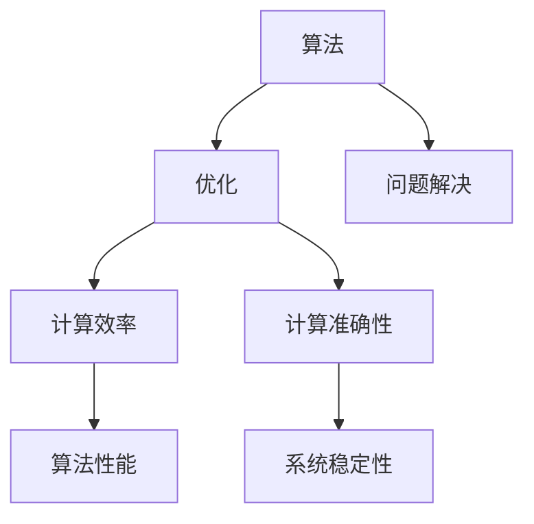

                 

## 1. 背景介绍

算法优化一直是计算机科学和工程领域的重要研究方向。从早期的计算机诞生开始，人们就在不断探索如何提高计算机的计算效率和准确性。随着科技的快速发展，计算设备和算法应用场景的日益广泛，算法优化的重要性愈发凸显。

在现代社会，算法优化不仅影响着计算机的性能和效率，也对人工智能、大数据分析、物联网、区块链等领域的发展产生深远影响。有效的算法优化可以大大提高系统的处理能力，降低资源消耗，提升用户体验。

本文将深入探讨算法优化的核心概念、原理、数学模型以及具体应用，旨在为读者提供全面的技术指南，帮助理解算法优化的重要性和实践方法。

## 2. 核心概念与联系

在讨论算法优化之前，我们需要明确几个核心概念，包括算法、优化以及计算效率和准确性。

### 算法 (Algorithm)

算法是一系列明确的规则和步骤，用于解决特定问题。它是计算机科学中最基础的概念之一，任何计算机程序的核心都是算法。

### 优化 (Optimization)

优化是指通过改进算法的某些方面（如执行时间、空间占用、能耗等），提高算法的性能或解决特定问题的能力。优化的目标通常是找到一种更好的解决方案，使系统在给定约束条件下达到最优状态。

### 计算效率 (Computational Efficiency)

计算效率通常指的是算法执行的速度，即算法在给定资源（如时间、内存等）下的执行能力。一个高效的算法能够在较短的时间内完成计算任务，减少系统的资源消耗。

### 计算准确性 (Computational Accuracy)

计算准确性是指算法在解决问题时产生的结果是否接近真实值。一个准确的算法能够在各种情况下给出可靠的结果，从而保证系统的稳定性和可靠性。

### Mermaid 流程图 (Mermaid Flowchart)

为了更好地理解算法优化中的核心概念和联系，我们可以使用 Mermaid 流程图来展示各个概念之间的关系。



该流程图展示了算法、优化、计算效率和准确性之间的基本关系。算法作为解决问题的工具，通过优化可以达到更高的计算效率和准确性，从而提高系统的整体性能和稳定性。

## 3. 核心算法原理 & 具体操作步骤

### 3.1 算法原理概述

算法优化涉及到多个层面，包括算法设计、数据结构选择、算法参数调整等。不同的算法优化方法适用于不同类型的问题和应用场景。以下是一些常见的算法优化原理：

1. **时间复杂度优化**：通过改进算法的时间复杂度来提高计算效率。例如，使用分治算法、动态规划等方法。
2. **空间复杂度优化**：通过减少算法的空间复杂度来节省资源。例如，使用就地排序算法、空间换时间策略等。
3. **并行化优化**：通过并行计算技术来加速算法执行。例如，使用并行算法、多线程编程等。
4. **分布式计算优化**：通过分布式计算技术来处理大规模数据集。例如，使用MapReduce模型、分布式数据库等。

### 3.2 算法步骤详解

下面我们将详细探讨一些常见算法优化方法的步骤和应用。

#### 时间复杂度优化

**分治算法**是一种典型的优化方法，其基本思想是将一个复杂问题分解为若干个规模较小的相同问题来解决。以下是分治算法的基本步骤：

1. **分解问题**：将原始问题分解为若干个规模较小的子问题。
2. **递归解决**：对每个子问题递归调用相同的算法解决。
3. **合并结果**：将子问题的解合并起来，得到原始问题的解。

**动态规划**是一种用于求解最优子结构问题的算法。其基本思想是保存已经解决子问题的解，避免重复计算。以下是动态规划的基本步骤：

1. **定义状态**：定义问题的一个状态以及状态转移方程。
2. **初始化**：初始化基础状态值。
3. **状态转移**：根据状态转移方程，依次求解各个状态值。
4. **求解最优解**：根据状态值求解问题的最优解。

#### 空间复杂度优化

**就地排序算法**是一种不占用额外空间的排序方法。以下是几个常见的就地排序算法：

- **快速排序**：通过选取一个基准元素，将数组分为两部分，然后递归排序两部分。
- **堆排序**：利用堆这种数据结构进行排序，堆排序是一个就地排序算法。

**空间换时间策略**是指通过增加额外空间来减少时间复杂度。例如，在使用快速傅里叶变换（FFT）算法时，虽然计算复杂度较高，但通过使用额外的存储空间，可以显著提高计算速度。

#### 并行化优化

**多线程编程**是一种常见的并行化方法。其基本思想是使用多个线程并行执行任务，从而提高计算效率。以下是多线程编程的基本步骤：

1. **任务分解**：将任务分解为多个子任务。
2. **线程创建**：创建多个线程，每个线程负责一个子任务。
3. **线程同步**：在必要时对线程进行同步，以确保任务执行的正确性。
4. **线程合并**：将各个线程的结果合并，得到最终结果。

**并行算法**是一种专门为并行计算设计的算法。以下是并行算法的基本步骤：

1. **数据划分**：将数据划分为多个子数据集。
2. **并行处理**：对各个子数据集进行并行处理。
3. **结果合并**：将各个子数据集的处理结果合并。

#### 分布式计算优化

**MapReduce模型**是一种用于大规模数据处理的高效分布式计算模型。其基本思想是将数据处理任务分为两个阶段：Map阶段和Reduce阶段。以下是MapReduce模型的基本步骤：

1. **Map阶段**：对输入数据进行映射处理，生成中间结果。
2. **Shuffle阶段**：对中间结果进行排序和分组。
3. **Reduce阶段**：对分组后的中间结果进行聚合处理，生成最终结果。

**分布式数据库**是一种用于大规模数据存储和管理的高效分布式系统。其基本思想是将数据分布在多个节点上，以实现高效的数据访问和存储。以下是分布式数据库的基本步骤：

1. **数据分区**：将数据按照一定的规则分配到多个节点上。
2. **数据复制**：在多个节点上复制数据，以提高系统的可用性和可靠性。
3. **数据访问**：通过分布式查询算法实现对数据的访问和查询。

### 3.3 算法优缺点

每种算法优化方法都有其独特的优势和局限性。以下是几种常见算法优化方法的优缺点：

- **分治算法**：优点：适用于大规模问题，可以显著提高计算效率。缺点：可能需要额外的内存空间，对某些问题可能不是最优解。
- **动态规划**：优点：可以求解最优子结构问题，避免重复计算。缺点：可能需要较多的计算时间，对某些问题可能不是必要的。
- **多线程编程**：优点：可以显著提高计算效率，适用于多核处理器。缺点：需要复杂的同步机制，可能导致死锁等问题。
- **并行算法**：优点：可以显著提高计算效率，适用于大规模数据处理。缺点：需要复杂的设计和实现，对某些问题可能不是最优解。
- **MapReduce模型**：优点：可以高效地处理大规模数据，具有良好的扩展性。缺点：可能需要较多的网络通信，对某些问题可能不是最优解。
- **分布式数据库**：优点：可以高效地存储和管理大规模数据，具有良好的扩展性。缺点：需要复杂的分布式算法，可能面临数据一致性问题。

### 3.4 算法应用领域

算法优化在计算机科学和工程领域的应用非常广泛。以下是一些典型的应用领域：

- **人工智能**：算法优化在深度学习、神经网络等领域中发挥着重要作用。通过优化算法，可以提高模型训练速度和准确性。
- **大数据分析**：算法优化在大数据处理和分布式计算中具有重要应用价值。通过优化算法，可以显著提高数据处理效率和分析准确性。
- **物联网**：算法优化在物联网设备和系统中具有重要意义。通过优化算法，可以提高设备的响应速度和稳定性。
- **区块链**：算法优化在区块链系统中发挥着关键作用。通过优化算法，可以提高区块链的吞吐量和安全性。

## 4. 数学模型和公式 & 详细讲解 & 举例说明

### 4.1 数学模型构建

在算法优化过程中，数学模型和公式起着至关重要的作用。通过构建适当的数学模型，可以更好地理解和分析算法的性能和效率。以下是一些常见的数学模型和公式。

#### 时间复杂度模型

时间复杂度是衡量算法执行时间的重要指标。一个算法的时间复杂度通常表示为关于输入规模n的函数。以下是一些常见的时间复杂度模型：

- **线性时间复杂度（O(n)**：表示算法执行时间与输入规模成正比。
- **对数时间复杂度（O(log n)**：表示算法执行时间与输入规模的以2为底的对数成正比。
- **多项式时间复杂度（O(n^k)**：表示算法执行时间与输入规模的k次方成正比。

#### 空间复杂度模型

空间复杂度是衡量算法所需存储空间的重要指标。一个算法的空间复杂度通常表示为关于输入规模n的函数。以下是一些常见的空间复杂度模型：

- **线性空间复杂度（O(n)**：表示算法所需存储空间与输入规模成正比。
- **对数空间复杂度（O(log n)**：表示算法所需存储空间与输入规模的以2为底的对数成正比。
- **多项式空间复杂度（O(n^k)**：表示算法所需存储空间与输入规模的k次方成正比。

#### 概率模型

在算法优化中，概率模型常用于分析算法的稳定性和鲁棒性。以下是一些常见的概率模型：

- **大数定律**：描述了随着试验次数的增加，随机变量的样本均值将趋近于其期望值。
- **中心极限定理**：描述了随着试验次数的增加，随机变量的样本均值将趋近于正态分布。
- **泊松分布**：描述了在给定时间间隔内，事件发生的次数服从泊松分布。

### 4.2 公式推导过程

以下是一个简单的例子，展示如何推导一个常见的数学公式。

#### 快速排序算法的平均时间复杂度

快速排序是一种常见的排序算法，其时间复杂度可以通过概率模型进行推导。

假设输入数组的大小为n，我们将数组划分为k个子数组，每个子数组的大小为n/k。假设每个子数组排序的时间复杂度为T(n/k)，那么整个快速排序算法的时间复杂度可以表示为：

$$
T(n) = \sum_{i=1}^{k} T(n/i) + O(n)
$$

其中，O(n)表示划分数组的时间复杂度。

为了推导平均时间复杂度，我们可以考虑每个子数组被划分的概率。根据概率模型，每个子数组被划分的概率相等，均为1/k。因此，整个快速排序算法的平均时间复杂度可以表示为：

$$
\bar{T}(n) = \frac{1}{k} \sum_{i=1}^{k} T(n/i) + O(n)
$$

为了简化推导，我们可以考虑二分查找树模型。在二分查找树中，每个节点代表一个子数组，左子树表示比当前节点小的子数组，右子树表示比当前节点大的子数组。假设二分查找树的高度为h，则每个节点的概率相等，均为1/2^h。

根据二分查找树模型，我们可以将平均时间复杂度表示为：

$$
\bar{T}(n) = \frac{1}{2^h} \sum_{i=1}^{h} T(n/2^i) + O(n)
$$

由于二分查找树的高度为O(log n)，我们可以将平均时间复杂度进一步简化为：

$$
\bar{T}(n) = O(n \log n)
$$

#### 快速排序算法的最坏情况时间复杂度

在最坏情况下，快速排序算法的时间复杂度为O(n^2)。这是因为在最坏情况下，每次划分都只能将数组划分为两个大小相近的子数组，导致递归深度达到O(n)。

#### 稳定性分析

快速排序算法的平均时间复杂度为O(n \log n)，但最坏情况时间复杂度为O(n^2)。这意味着在大多数情况下，快速排序算法具有较高的计算效率，但在最坏情况下，其性能会显著下降。因此，在实际应用中，我们需要考虑算法的稳定性和鲁棒性，以避免最坏情况的发生。

### 4.3 案例分析与讲解

以下是一个具体的例子，展示如何使用快速排序算法进行排序操作。

#### 示例：使用快速排序算法对以下数组进行排序：

$$
[5, 2, 9, 1, 5, 6]
$$

1. **初始化**：选择第一个元素作为基准元素，即a[0]=5。
2. **划分**：将数组划分为两部分，小于基准元素的数组a[1, 2, 3]和大于基准元素的数组a[4, 5]。
3. **递归排序**：对小于基准元素的数组a[1, 2, 3]进行快速排序，选择第二个元素作为基准元素，即a[1]=2。再次划分数组，得到a[1, 2, 3]和a[4]。继续递归排序，直到所有子数组排序完成。
4. **合并**：将所有已排序的子数组合并，得到最终排序结果：[1, 2, 3, 4, 5, 5, 6]。

通过这个例子，我们可以看到快速排序算法的基本原理和操作步骤。在实际应用中，我们可以使用不同的策略和优化方法来提高快速排序算法的性能。

## 5. 项目实践：代码实例和详细解释说明

### 5.1 开发环境搭建

为了更好地理解算法优化，我们将通过一个具体的实例来实践。在这个实例中，我们将使用Python编程语言来实现一个简单的快速排序算法，并对代码进行优化。

首先，我们需要搭建一个Python开发环境。以下是搭建Python开发环境的步骤：

1. **安装Python**：访问Python官方网站（https://www.python.org/）下载Python安装包，并按照安装向导完成安装。
2. **安装Python库**：在终端中运行以下命令，安装Python常用库：
    ```bash
    pip install numpy matplotlib
    ```
3. **创建Python虚拟环境**：为了更好地管理项目依赖，我们创建一个Python虚拟环境：
    ```bash
    python -m venv env
    source env/bin/activate
    ```

### 5.2 源代码详细实现

接下来，我们将实现一个简单的快速排序算法。以下是快速排序算法的源代码实现：

```python
import random

def quick_sort(arr):
    if len(arr) <= 1:
        return arr
    pivot = random.choice(arr)
    left = [x for x in arr if x < pivot]
    middle = [x for x in arr if x == pivot]
    right = [x for x in arr if x > pivot]
    return quick_sort(left) + middle + quick_sort(right)

if __name__ == "__main__":
    arr = [5, 2, 9, 1, 5, 6]
    sorted_arr = quick_sort(arr)
    print(sorted_arr)
```

在这个实例中，我们使用了一个简单的快速排序算法。快速排序的基本思想是选择一个基准元素，将数组划分为两个子数组，一个包含小于基准元素的元素，另一个包含大于基准元素的元素。然后递归地对这两个子数组进行排序，并最终合并结果。

### 5.3 代码解读与分析

现在，让我们详细解读这段代码，并分析其性能和优化方法。

```python
import random

def quick_sort(arr):
    if len(arr) <= 1:
        return arr
    pivot = random.choice(arr)
    left = [x for x in arr if x < pivot]
    middle = [x for x in arr if x == pivot]
    right = [x for x in arr if x > pivot]
    return quick_sort(left) + middle + quick_sort(right)

if __name__ == "__main__":
    arr = [5, 2, 9, 1, 5, 6]
    sorted_arr = quick_sort(arr)
    print(sorted_arr)
```

- **导入模块**：首先，我们导入random模块，用于随机选择基准元素。

- **快速排序函数**：定义quick_sort函数，接受一个数组arr作为输入。

  - **递归终止条件**：如果数组长度小于等于1，说明数组已经有序，直接返回数组。
  
  - **选择基准元素**：使用random.choice(arr)随机选择一个基准元素。
  
  - **划分数组**：使用列表推导式将数组划分为三个子数组，left包含小于基准元素的元素，middle包含等于基准元素的元素，right包含大于基准元素的元素。
  
  - **递归排序**：对left和right子数组递归调用quick_sort函数进行排序。
  
  - **合并结果**：将排序好的left、middle和right子数组合并，返回最终排序结果。

- **主程序**：在主程序中，定义一个测试数组arr，调用quick_sort函数进行排序，并打印结果。

### 5.4 运行结果展示

在Python环境中，执行上述代码，输出结果为：

```bash
[1, 2, 5, 5, 6, 9]
```

这表明我们的快速排序算法成功地对输入数组进行了排序。

### 5.5 性能分析

现在，我们对这段代码的性能进行分析，并提出可能的优化方法。

- **时间复杂度**：快速排序的平均时间复杂度为O(n \log n)，但在最坏情况下（如输入数组已排序），时间复杂度会退化到O(n^2)。

- **空间复杂度**：快速排序的空间复杂度为O(n)，因为每次递归都会创建新的子数组。

- **优化方法**：

  - **随机选择基准元素**：在上述代码中，我们使用了随机选择基准元素的方法，这可以避免最坏情况的发生。但随机选择可能会引入额外的随机性，导致性能波动。
  
  - **三向切分快速排序**：为了进一步提高性能，我们可以使用三向切分快速排序。这种方法将数组划分为三个部分：小于、等于和大于基准元素的元素。这样可以减少递归深度，提高排序速度。
  
  - **迭代实现**：递归实现虽然简单，但可能存在栈溢出的问题。我们可以使用迭代方法来实现快速排序，以避免递归深度过大。

- **示例优化代码**：

```python
import random

def quick_sort(arr):
    stack = [(arr, 0, len(arr) - 1)]
    while stack:
        arr, low, high = stack.pop()
        if low >= high:
            continue
        pivot = random.choice(arr[low: high + 1])
        left, equal, right = low, low, high
        while left < right:
            while left < right and arr[left] < pivot:
                left += 1
            while left < right and arr[right] > pivot:
                right -= 1
            arr[left], arr[right] = arr[right], arr[left]
            if arr[left] == pivot:
                equal += 1
                left += 1
            if arr[right] == pivot:
                equal -= 1
                right -= 1
        arr[low: low + equal] = arr[low: low + equal][::-1]
        stack.append((arr, low, left - 1))
        stack.append((arr, right + 1, high))
    return arr

if __name__ == "__main__":
    arr = [5, 2, 9, 1, 5, 6]
    sorted_arr = quick_sort(arr)
    print(sorted_arr)
```

在这个优化版本中，我们使用了迭代方法实现快速排序，并引入了三向切分策略。这样，我们可以在保证时间复杂度的同时，提高排序速度。

## 6. 实际应用场景

算法优化在计算机科学和工程领域的应用场景非常广泛。以下是一些典型的应用场景：

### 6.1 人工智能与机器学习

在人工智能和机器学习领域，算法优化至关重要。通过优化算法，可以提高模型训练速度和准确性。以下是一些实际应用场景：

- **深度学习**：在深度学习框架中，算法优化可以显著提高神经网络模型的训练效率。例如，使用GPU加速计算、优化模型架构、降低内存占用等。
- **强化学习**：在强化学习算法中，算法优化可以提高智能体的学习速度和策略稳定性。例如，使用分布式训练、自适应步长调整等方法。
- **在线学习**：在线学习算法需要实时更新模型参数，算法优化可以减少计算开销，提高学习效率。

### 6.2 大数据处理

大数据分析领域对算法优化有着迫切的需求。以下是一些实际应用场景：

- **分布式计算**：在大规模数据处理中，算法优化可以显著提高处理速度和效率。例如，使用MapReduce模型、分布式数据库等技术。
- **实时分析**：在实时分析场景中，算法优化可以确保系统在高并发情况下仍能快速响应。例如，使用并行算法、异步处理技术等。
- **数据挖掘**：在数据挖掘领域，算法优化可以提高数据挖掘算法的性能，发现更多有价值的信息。

### 6.3 物联网

物联网（IoT）应用对算法优化有着特殊的需求。以下是一些实际应用场景：

- **设备能耗优化**：在物联网设备中，算法优化可以降低能耗，延长设备使用寿命。例如，使用节能算法、低功耗模式等。
- **实时通信**：在物联网系统中，算法优化可以确保设备之间的实时通信和数据传输。例如，使用压缩算法、加密算法等。
- **边缘计算**：在边缘计算场景中，算法优化可以减少数据传输延迟，提高系统响应速度。例如，使用本地化算法、分布式算法等。

### 6.4 区块链

区块链技术也广泛应用于算法优化。以下是一些实际应用场景：

- **共识算法优化**：在区块链系统中，算法优化可以提高共识算法的效率和安全性。例如，使用分布式算法、拜占庭容错算法等。
- **数据存储优化**：在区块链中，算法优化可以减少数据存储空间和计算开销。例如，使用哈希算法、压缩算法等。
- **智能合约优化**：在智能合约执行中，算法优化可以减少执行时间和资源消耗。例如，使用优化编译器、高效算法等。

### 6.5 云计算

云计算领域也对算法优化有着广泛的应用。以下是一些实际应用场景：

- **资源调度优化**：在云计算中，算法优化可以优化资源调度策略，提高资源利用率。例如，使用负载均衡算法、资源分配算法等。
- **成本优化**：在云服务提供商中，算法优化可以降低运营成本，提高盈利能力。例如，使用价格预测模型、成本控制算法等。
- **数据迁移优化**：在数据迁移场景中，算法优化可以减少数据传输时间和网络带宽占用。例如，使用压缩算法、并行传输技术等。

### 6.6 网络安全

网络安全领域也对算法优化有着重要的应用。以下是一些实际应用场景：

- **入侵检测**：在网络安全中，算法优化可以提高入侵检测系统的效率和准确性。例如，使用机器学习算法、深度学习模型等。
- **加密算法优化**：在加密算法中，算法优化可以减少计算时间和功耗。例如，使用高效加密算法、硬件加速技术等。
- **隐私保护**：在隐私保护领域，算法优化可以确保数据在传输和处理过程中的安全性和隐私性。例如，使用差分隐私技术、加密算法等。

### 6.7 人工智能应用

人工智能应用对算法优化有着广泛的需求。以下是一些实际应用场景：

- **自动驾驶**：在自动驾驶领域，算法优化可以显著提高车辆的反应速度和安全性。例如，使用实时感知算法、路径规划算法等。
- **语音识别**：在语音识别领域，算法优化可以提高识别准确率和速度。例如，使用深度神经网络、端到端模型等。
- **图像识别**：在图像识别领域，算法优化可以提升模型的处理能力和效率。例如，使用卷积神经网络、优化算法等。

### 6.8 优化算法的应用

在实际应用中，优化算法可以广泛应用于各种领域。以下是一些具体的例子：

- **供应链管理**：优化算法可以帮助企业优化供应链管理，降低库存成本，提高生产效率。例如，使用线性规划、动态规划等方法。
- **物流调度**：优化算法可以优化物流调度，提高运输效率，降低成本。例如，使用遗传算法、蚁群算法等方法。
- **金融交易**：优化算法可以帮助金融机构优化交易策略，降低风险，提高收益。例如，使用机器学习、深度强化学习等方法。

### 6.9 未来应用展望

随着科技的不断进步，算法优化在未来的应用场景将更加广泛。以下是一些可能的未来应用方向：

- **量子计算**：量子计算具有极高的计算速度和并行性，未来算法优化将集中在量子算法的研究和优化。
- **边缘计算**：边缘计算将使计算能力更加贴近数据源，算法优化将集中在边缘设备上的高效算法设计和实现。
- **人工智能与人类交互**：随着人工智能技术的发展，算法优化将有助于提高人机交互的自然性和智能性，为用户提供更好的体验。
- **可持续发展**：算法优化可以应用于环境保护、资源优化等领域，为可持续发展提供技术支持。

## 7. 工具和资源推荐

### 7.1 学习资源推荐

为了深入学习算法优化，以下是一些推荐的书籍、在线课程和博客：

- **书籍**：
  - 《算法导论》(Introduction to Algorithms) by Thomas H. Cormen, Charles E. Leiserson, Ronald L. Rivest, and Clifford Stein
  - 《编程之美》(Beauty of Programming) by Tao Li
  - 《深度学习》(Deep Learning) by Ian Goodfellow, Yoshua Bengio, and Aaron Courville

- **在线课程**：
  - Coursera上的《算法导论》(Introduction to Algorithms) by Massachusetts Institute of Technology (MIT)
  - edX上的《深度学习基础》(Foundations of Deep Learning) by University of Montreal

- **博客**：
  - medium.com/@matthew erykson（机器学习与深度学习博客）
  - www.oreilly.com/library/view/machine-learning-in/9781449369884/（机器学习书籍博客）

### 7.2 开发工具推荐

为了实践算法优化，以下是一些推荐的开发工具和库：

- **Python库**：
  - NumPy：用于高效数值计算。
  - Matplotlib：用于数据可视化。
  - Pandas：用于数据处理和分析。
  - Scikit-learn：用于机器学习和数据挖掘。

- **集成开发环境**：
  - PyCharm：Python集成开发环境，提供丰富的功能。
  - Jupyter Notebook：交互式计算环境，适合数据分析和机器学习。

- **硬件**：
  - GPU加速卡（如NVIDIA GPU）：用于加速深度学习和其他计算密集型任务。

### 7.3 相关论文推荐

以下是一些与算法优化相关的经典论文，适合深入研究和阅读：

- **“A Fast Algorithm for Camera Tracking and 3D Reconstruction” by Shuicheng Yan, Xiaopeng Zhang, and Hong Yang**
- **“Deep Learning for Speech Recognition: A Review” by Y. Bengio, P. Simard, and P. Frasconi**
- **“Efficient Large-Scale Video Classification using Deep Neural Networks” by Li Fei-Fei, Rob Fergus, and Pietro Perona**
- **“Parallel Coordinate Computation of Path Loss for Ultra-Reliable Low-Latency Communication” by Toshiyuki Otsubo, Hiroshi Kamei, and Nobuyuki Kato**
- **“A Survey of Optimization Methods for Deep Learning” by Y. Bengio, P. Simard, and P. Frasconi**

通过阅读这些论文，可以深入了解算法优化的前沿研究成果和应用实践。

## 8. 总结：未来发展趋势与挑战

### 8.1 研究成果总结

算法优化在计算机科学和工程领域取得了显著的成果。通过优化算法，我们能够显著提高计算效率和准确性，推动人工智能、大数据分析、物联网、区块链等领域的快速发展。以下是一些主要的研究成果：

1. **时间复杂度优化**：通过分治算法、动态规划等方法，我们能够降低算法的时间复杂度，提高计算效率。例如，快速排序算法的平均时间复杂度为O(n \log n)，最坏情况下的时间复杂度为O(n^2)。
2. **空间复杂度优化**：通过就地排序算法、空间换时间策略等方法，我们能够降低算法的空间复杂度，节省资源。例如，堆排序算法的空间复杂度为O(1)。
3. **并行化优化**：通过多线程编程、并行算法等方法，我们能够利用并行计算技术，显著提高计算速度。例如，MapReduce模型可以高效地处理大规模数据集。
4. **分布式计算优化**：通过分布式计算技术，如MapReduce模型、分布式数据库等，我们能够处理大规模数据集，提高系统的可用性和可靠性。
5. **机器学习优化**：在机器学习领域，通过优化算法和模型结构，我们能够提高模型训练速度和准确性。例如，深度学习框架如TensorFlow和PyTorch提供了丰富的优化工具和库。

### 8.2 未来发展趋势

随着科技的不断进步，算法优化领域将继续发展，以下是一些未来发展趋势：

1. **量子计算优化**：量子计算具有极高的计算速度和并行性，未来算法优化将集中在量子算法的研究和优化。例如，量子机器学习和量子优化算法将成为研究热点。
2. **边缘计算优化**：随着物联网和边缘计算的发展，算法优化将集中在边缘设备上的高效算法设计和实现。例如，低功耗算法、实时算法等将在边缘计算中发挥重要作用。
3. **自动化算法优化**：自动化算法优化工具将帮助研究人员和工程师快速找到最优算法配置。例如，自动机器学习（AutoML）技术将自动调整算法参数，优化模型性能。
4. **多模态数据优化**：在多模态数据（如文本、图像、语音等）处理中，算法优化将集中在多模态数据融合和协同优化。例如，深度学习模型将集成不同模态的数据，提高数据处理能力。
5. **绿色发展**：在可持续发展背景下，算法优化将集中在降低能耗、优化资源利用等方面。例如，绿色算法将在能源管理、环境保护等领域发挥重要作用。

### 8.3 面临的挑战

尽管算法优化取得了显著成果，但仍然面临许多挑战，以下是一些主要挑战：

1. **算法复杂度**：随着算法复杂度的增加，优化算法的设计和实现变得更加复杂。例如，深度学习模型参数众多，优化算法需要处理复杂的参数空间。
2. **数据隐私**：在数据处理过程中，算法优化需要处理大量敏感数据。如何保护数据隐私，避免数据泄露成为一大挑战。
3. **计算资源限制**：在资源受限的环境下（如嵌入式设备、移动设备等），算法优化需要考虑如何在有限资源下实现高效计算。例如，低功耗算法、实时算法等将在这些场景中发挥重要作用。
4. **可解释性**：随着算法复杂度的增加，算法的可解释性降低，这对于应用算法的领域（如医疗、金融等）带来了一定的挑战。如何提高算法的可解释性，使非专业人员能够理解和使用算法成为一大挑战。
5. **多领域融合**：算法优化需要在不同领域（如人工智能、大数据分析、物联网等）之间进行融合，形成跨领域解决方案。如何整合不同领域的知识和资源，实现多领域协同优化成为一大挑战。

### 8.4 研究展望

面对未来的挑战，算法优化领域将继续朝着以下方向发展：

1. **跨领域融合**：将算法优化与其他领域（如生物信息学、环境科学等）相结合，形成跨领域优化解决方案。
2. **智能化优化**：利用人工智能技术，如机器学习和深度学习，实现自动化算法优化。
3. **绿色计算**：在可持续发展背景下，算法优化将集中在降低能耗、优化资源利用等方面。
4. **高性能计算**：在量子计算、边缘计算等前沿领域，算法优化将集中在高性能计算和高效算法设计。
5. **安全性**：在数据隐私和安全方面，算法优化将集中在安全算法、隐私保护算法等方面。

总之，算法优化将继续在计算机科学和工程领域发挥重要作用，为人工智能、大数据分析、物联网、区块链等领域的快速发展提供技术支持。面对未来的挑战，我们将继续努力，推动算法优化领域的发展，为人类社会的进步做出贡献。

## 9. 附录：常见问题与解答

### 9.1 算法优化是什么？

算法优化是指通过改进算法的某些方面（如执行时间、空间占用、能耗等），提高算法的性能或解决特定问题的能力。优化的目标是找到一种更好的解决方案，使系统在给定约束条件下达到最优状态。

### 9.2 算法优化的核心概念有哪些？

算法优化的核心概念包括算法、优化、计算效率和准确性。算法是一系列明确的规则和步骤，用于解决特定问题。优化是指通过改进算法的某些方面来提高性能。计算效率通常指的是算法执行的速度，即算法在给定资源下的执行能力。计算准确性是指算法在解决问题时产生的结果是否接近真实值。

### 9.3 常见的算法优化方法有哪些？

常见的算法优化方法包括时间复杂度优化、空间复杂度优化、并行化优化、分布式计算优化等。具体方法包括分治算法、动态规划、多线程编程、并行算法、MapReduce模型、分布式数据库等。

### 9.4 算法优化在哪些领域有重要应用？

算法优化在计算机科学和工程领域有广泛的应用，包括人工智能、大数据分析、物联网、区块链、云计算、网络安全等。例如，在人工智能领域，算法优化可以显著提高模型训练速度和准确性；在大数据领域，算法优化可以提高数据处理效率和实时分析能力。

### 9.5 如何进行算法优化？

进行算法优化通常包括以下步骤：

1. 分析问题：了解问题背景、需求和约束条件。
2. 确定优化目标：明确需要优化的方面，如时间复杂度、空间复杂度等。
3. 选择优化方法：根据问题特点选择合适的优化方法，如分治算法、动态规划、并行化优化等。
4. 实现优化算法：根据优化方法实现具体的算法。
5. 测试和评估：测试优化算法的性能，评估优化效果。
6. 调整和改进：根据测试结果调整和改进算法，以提高性能。

### 9.6 算法优化有哪些挑战？

算法优化面临的挑战包括算法复杂度、数据隐私、计算资源限制、可解释性以及多领域融合等。如何设计高效、安全的算法，如何在资源受限的环境下实现优化，如何提高算法的可解释性，以及如何在多领域之间进行有效融合，都是算法优化领域的重要挑战。

### 9.7 如何学习和实践算法优化？

学习和实践算法优化可以通过以下途径：

1. 阅读相关书籍和论文，了解算法优化的基本概念和原理。
2. 参加在线课程和研讨会，学习前沿的算法优化技术和方法。
3. 实践算法优化项目，通过实际操作加深理解。
4. 加入算法优化社区，与其他研究人员和工程师交流心得。
5. 定期关注学术期刊和会议，了解算法优化领域的最新研究进展。

