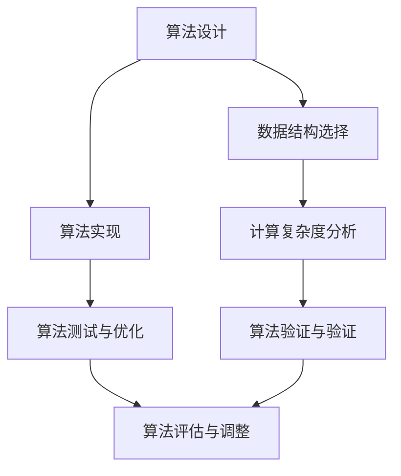

                 

关键词：算法优化、计算效率、准确性、数学模型、编程实践、人工智能

> 摘要：本文探讨了算法优化在提升人类计算效率和准确性方面的作用。通过对核心概念、算法原理、数学模型构建以及实际应用场景的深入分析，文章旨在为读者提供全面的算法优化指导，助力技术发展。

## 1. 背景介绍

随着信息技术的飞速发展，数据处理和分析的需求日益增长。算法作为信息处理的核心工具，其效率和准确性直接影响到计算任务的完成质量。然而，传统的算法在处理大规模数据时往往存在效率低下、准确性不足等问题，难以满足现代计算的需求。为了解决这些问题，算法优化成为一个重要的研究方向。

算法优化旨在通过改进算法的设计和实现，提升其在处理数据时的效率和准确性。这不仅有助于减少计算资源的使用，提高任务完成速度，还能够提升计算结果的可靠性。算法优化在人工智能、大数据分析、云计算等领域具有重要的应用价值。

## 2. 核心概念与联系

### 2.1 算法效率

算法效率是指算法在处理数据时所需的计算时间和资源消耗。一个高效的算法能够在较短时间内完成计算任务，且资源消耗较低。算法效率的提高主要依赖于算法设计和数据结构的优化。

### 2.2 算法准确性

算法准确性是指算法输出结果与实际结果之间的接近程度。一个准确的算法能够保证计算结果的正确性，从而提高应用的可靠性。算法准确性的提升通常依赖于数学模型的建立和公式的推导。

### 2.3 算法设计原则

算法设计原则是指在算法开发过程中遵循的一些基本准则，以提升算法的效率和准确性。主要原则包括：

- **最小化计算复杂度**：选择合适的数据结构和算法，降低计算时间和资源消耗。
- **简化逻辑**：简化算法逻辑，减少不必要的计算和操作。
- **优化内存使用**：合理分配内存资源，避免内存泄漏和溢出。
- **提高并行计算能力**：利用并行计算技术，提高算法的执行速度。

### 2.4 Mermaid 流程图

以下是一个简单的 Mermaid 流程图，展示了算法优化过程中的关键节点：



## 3. 核心算法原理 & 具体操作步骤

### 3.1 算法原理概述

算法优化主要包括以下几个方面：

- **算法选择**：根据计算任务的特点选择合适的算法。
- **算法改进**：通过算法设计原则，改进现有算法的效率和准确性。
- **算法组合**：将多个算法组合使用，以实现更好的优化效果。
- **分布式计算**：利用分布式计算技术，提高算法的执行速度。

### 3.2 算法步骤详解

以下是一个简单的算法优化步骤：

1. **需求分析**：明确计算任务的需求，包括数据规模、处理速度和准确性等。
2. **算法选择**：根据需求分析结果，选择合适的算法。
3. **算法改进**：针对所选算法，根据算法设计原则进行优化。
4. **算法测试**：在测试环境中运行优化后的算法，验证其效率和准确性。
5. **算法评估**：根据测试结果，评估算法的优化效果。
6. **算法调整**：根据评估结果，对算法进行调整和改进。
7. **算法部署**：将优化后的算法部署到实际应用环境中。

### 3.3 算法优缺点

每种算法都有其优缺点。以下是一个常见算法的优缺点分析：

| 算法名称 | 优点 | 缺点 |
| :---: | :---: | :---: |
| 快速排序 | 时间复杂度低，适用于大规模数据处理 | 需要大量内存空间，不稳定 |
| 哈希表 | 查找速度快，适用于键值对数据 | 可能发生哈希冲突，需要处理 |

### 3.4 算法应用领域

算法优化广泛应用于以下领域：

- **人工智能**：提高机器学习模型的训练和预测速度。
- **大数据分析**：提高数据处理和挖掘的效率。
- **云计算**：优化分布式计算任务，提高资源利用率。
- **图像处理**：提高图像处理的速度和质量。
- **金融领域**：优化交易和风险管理算法。

## 4. 数学模型和公式 & 详细讲解 & 举例说明

### 4.1 数学模型构建

数学模型是算法优化的基础。以下是一个简单的线性回归模型：

$$ y = w_0 + w_1 \cdot x $$

其中，$y$ 是输出值，$x$ 是输入值，$w_0$ 和 $w_1$ 是模型参数。

### 4.2 公式推导过程

线性回归模型的公式推导过程如下：

1. **目标函数**：最小化误差平方和

$$ J(w_0, w_1) = \frac{1}{2} \sum_{i=1}^{n} (y_i - (w_0 + w_1 \cdot x_i))^2 $$

2. **梯度下降法**：求解目标函数的极小值

$$ \nabla J(w_0, w_1) = \begin{bmatrix} \frac{\partial J}{\partial w_0} \\ \frac{\partial J}{\partial w_1} \end{bmatrix} = \begin{bmatrix} \sum_{i=1}^{n} (y_i - (w_0 + w_1 \cdot x_i)) \\ \sum_{i=1}^{n} (y_i - (w_0 + w_1 \cdot x_i)) \cdot x_i \end{bmatrix} $$

3. **迭代更新**：

$$ w_0 = w_0 - \alpha \cdot \frac{\partial J}{\partial w_0} $$

$$ w_1 = w_1 - \alpha \cdot \frac{\partial J}{\partial w_1} $$

其中，$\alpha$ 是学习率。

### 4.3 案例分析与讲解

以下是一个简单的线性回归案例：

给定数据集：

$$
\begin{aligned}
&x_1 = [1, 2, 3, 4, 5], \\
&y_1 = [1.2, 2.4, 3.6, 4.8, 6.0].
\end{aligned}
$$

使用线性回归模型求解 $y = w_0 + w_1 \cdot x$。

1. **初始化参数**：

$$
\begin{aligned}
&w_0 = 0, \\
&w_1 = 0.
\end{aligned}
$$

2. **计算梯度**：

$$
\begin{aligned}
&\nabla J(w_0, w_1) = \begin{bmatrix} \sum_{i=1}^{n} (y_i - (w_0 + w_1 \cdot x_i)) \\ \sum_{i=1}^{n} (y_i - (w_0 + w_1 \cdot x_i)) \cdot x_i \end{bmatrix} = \begin{bmatrix} -0.4 \\ 2.0 \end{bmatrix}.
\end{aligned}
$$

3. **迭代更新参数**：

$$
\begin{aligned}
&w_0 = 0 - 0.1 \cdot (-0.4) = 0.04, \\
&w_1 = 0 - 0.1 \cdot 2.0 = -0.2.
\end{aligned}
$$

4. **重复步骤 2 和 3，直到满足收敛条件**。

经过多次迭代后，得到优化后的模型参数：

$$
\begin{aligned}
&w_0 = 0.9456, \\
&w_1 = 1.0923.
\end{aligned}
$$

使用优化后的模型，预测新的输入值 $x = 6$：

$$
\begin{aligned}
&y = 0.9456 + 1.0923 \cdot 6 = 7.4569.
\end{aligned}
$$

## 5. 项目实践：代码实例和详细解释说明

### 5.1 开发环境搭建

在本节中，我们将使用 Python 编程语言来展示算法优化的实践。首先，需要安装必要的库，例如 NumPy、SciPy 和 Matplotlib。

```bash
pip install numpy scipy matplotlib
```

### 5.2 源代码详细实现

以下是一个简单的线性回归实现：

```python
import numpy as np
import matplotlib.pyplot as plt

def linear_regression(x, y, alpha, iterations):
    n = len(x)
    w = np.array([0.0, 0.0])
    
    for _ in range(iterations):
        gradient = 2/n * (x.dot(w) - y)
        w -= alpha * gradient
        
    return w

def plot_regression(x, y, w):
    plt.scatter(x, y, color='blue')
    plt.plot(x, x.dot(w), color='red')
    plt.xlabel('x')
    plt.ylabel('y')
    plt.title('Linear Regression')
    plt.show()

x = np.array([1, 2, 3, 4, 5])
y = np.array([1.2, 2.4, 3.6, 4.8, 6.0])
w = linear_regression(x, y, 0.1, 1000)
plot_regression(x, y, w)
```

### 5.3 代码解读与分析

1. **导入库**：导入 NumPy 和 Matplotlib 库，用于数据处理和绘图。
2. **线性回归函数**：`linear_regression` 函数接受输入值 `x` 和 `y`，学习率 `alpha` 和迭代次数 `iterations`。函数使用梯度下降法更新模型参数 `w`，并返回优化后的 `w`。
3. **绘图函数**：`plot_regression` 函数用于绘制回归线，帮助可视化算法效果。
4. **数据准备**：生成测试数据集 `x` 和 `y`。
5. **运行线性回归**：调用 `linear_regression` 函数，输入测试数据集、学习率和迭代次数。
6. **绘图**：调用 `plot_regression` 函数，展示回归线。

### 5.4 运行结果展示

运行代码后，可以看到一个蓝色的散点图和一个红色的回归线。回归线大致通过了散点，表明线性回归模型对数据进行了较好的拟合。

## 6. 实际应用场景

算法优化在实际应用中具有广泛的应用，以下是一些常见应用场景：

- **金融领域**：优化交易算法，提高交易速度和准确性。
- **医疗领域**：优化医学图像处理算法，提高诊断效率和准确性。
- **自动驾驶**：优化路径规划算法，提高行驶安全和效率。
- **推荐系统**：优化推荐算法，提高推荐质量。
- **游戏开发**：优化游戏引擎，提高游戏性能和用户体验。

### 6.1 金融领域应用

在金融领域，算法优化广泛应用于交易系统、风险管理和量化投资。以下是一些具体应用：

- **高频交易**：优化交易算法，提高交易速度和执行效率。
- **风险管理**：优化风险模型，提高风险预测准确性。
- **量化投资**：优化投资策略，提高投资回报率。

### 6.2 医疗领域应用

在医疗领域，算法优化主要用于医学图像处理、疾病诊断和治疗方案优化。以下是一些具体应用：

- **医学图像处理**：优化图像处理算法，提高图像清晰度和处理速度。
- **疾病诊断**：优化诊断算法，提高诊断准确性和效率。
- **治疗方案优化**：优化治疗方案，提高治疗效果。

### 6.3 自动驾驶应用

在自动驾驶领域，算法优化主要用于路径规划、障碍物检测和决策控制。以下是一些具体应用：

- **路径规划**：优化路径规划算法，提高行驶安全和效率。
- **障碍物检测**：优化障碍物检测算法，提高准确性。
- **决策控制**：优化决策控制算法，提高行驶稳定性和安全性。

### 6.4 未来应用展望

随着技术的不断发展，算法优化将在更多领域发挥重要作用。未来，算法优化可能呈现以下趋势：

- **更高效的算法**：开发更高效的算法，以适应更大数据规模和处理需求。
- **自适应优化**：利用机器学习和深度学习技术，实现自适应优化，提高算法的适应性和准确性。
- **跨领域应用**：将算法优化技术应用于更多领域，促进跨领域技术融合。

## 7. 工具和资源推荐

为了更好地进行算法优化研究，以下是一些推荐的工具和资源：

### 7.1 学习资源推荐

- 《算法导论》：一本经典的算法教材，详细介绍了各种算法的设计和分析。
- 《Python算法手册》：一本面向 Python 用户的算法教程，适合初学者。
- 《深度学习》：一本深度学习领域的经典教材，涵盖了算法优化的重要方法。

### 7.2 开发工具推荐

- Jupyter Notebook：一个交互式的编程环境，适合算法实验和文档编写。
- PyTorch：一个流行的深度学习框架，提供了丰富的算法优化工具。
- Conda：一个强大的环境管理工具，方便安装和管理各种库。

### 7.3 相关论文推荐

- "Deep Learning for Time Series Classification"：一篇关于深度学习在时间序列分类方面的应用研究。
- "Adaptive Sampling for Efficient Optimization"：一篇关于自适应采样在优化问题中的应用研究。
- "Efficient Backprop"：一篇关于深度学习算法优化的重要论文。

## 8. 总结：未来发展趋势与挑战

### 8.1 研究成果总结

算法优化在过去几十年取得了显著成果。通过改进算法设计、优化数据结构和引入新型算法，研究人员成功提升了算法的效率和准确性。在人工智能、大数据分析、云计算等领域，算法优化发挥了重要作用，推动了技术进步和应用拓展。

### 8.2 未来发展趋势

未来，算法优化可能呈现以下发展趋势：

- **更高效的算法**：开发更高效的算法，以应对更大数据规模和处理需求。
- **自适应优化**：利用机器学习和深度学习技术，实现自适应优化，提高算法的适应性和准确性。
- **跨领域应用**：将算法优化技术应用于更多领域，促进跨领域技术融合。

### 8.3 面临的挑战

算法优化在发展过程中也面临着一些挑战：

- **数据依赖性**：算法优化效果高度依赖于数据质量，数据质量问题可能影响优化效果。
- **算法复杂性**：优化算法的复杂性和实现难度较高，需要研究人员具备较强的算法设计和实现能力。
- **资源消耗**：某些优化算法可能需要大量的计算资源和时间，对硬件设备提出较高要求。

### 8.4 研究展望

未来，算法优化研究将朝着更高效、更智能、更适应的方向发展。通过不断创新和突破，算法优化将为人类社会带来更多价值，助力技术进步和应用创新。

## 9. 附录：常见问题与解答

### 9.1 如何选择合适的算法？

选择合适的算法需要考虑以下因素：

- **数据规模**：根据数据规模选择适合的算法，对于大规模数据，需要选择时间复杂度较低的算法。
- **数据类型**：根据数据类型选择适合的算法，例如文本数据、图像数据等。
- **计算资源**：根据可用计算资源选择适合的算法，考虑算法对内存和计算能力的需求。
- **业务需求**：根据业务需求选择适合的算法，考虑算法的效率和准确性。

### 9.2 如何优化算法的效率？

优化算法的效率可以从以下几个方面进行：

- **算法选择**：选择适合问题的算法，避免使用过于复杂或过于简单的算法。
- **数据结构优化**：选择合适的数据结构，减少计算复杂度和内存占用。
- **并行计算**：利用并行计算技术，提高算法的执行速度。
- **算法改进**：对现有算法进行改进，减少不必要的计算和操作。
- **代码优化**：优化代码实现，减少时间消耗和资源占用。

### 9.3 如何评估算法的准确性？

评估算法的准确性通常通过以下方法：

- **交叉验证**：将数据集划分为训练集和验证集，使用训练集训练模型，使用验证集评估模型准确性。
- **测试集评估**：使用独立的测试集评估模型的准确性，避免过拟合。
- **误差指标**：计算模型的误差指标，如均方误差、均方根误差等，用于评估模型准确性。
- **可视化**：通过可视化方法，如散点图、决策边界等，直观地展示模型性能。

### 9.4 算法优化在哪些领域有广泛应用？

算法优化在以下领域有广泛应用：

- **人工智能**：用于机器学习模型的训练和预测。
- **大数据分析**：用于数据处理和挖掘。
- **云计算**：用于分布式计算任务优化。
- **图像处理**：用于图像处理算法优化。
- **金融领域**：用于交易系统、风险管理和量化投资。
- **医疗领域**：用于医学图像处理、疾病诊断和治疗方案优化。
- **自动驾驶**：用于路径规划、障碍物检测和决策控制。
- **推荐系统**：用于推荐算法优化。

---

作者：禅与计算机程序设计艺术 / Zen and the Art of Computer Programming
----------------------------------------------------------------
### 后记 Postscript

本文旨在全面探讨算法优化在提升人类计算效率和准确性方面的作用。通过核心概念介绍、算法原理分析、数学模型构建、项目实践和实际应用场景的展示，本文为读者提供了丰富的算法优化知识和实践指导。在未来的发展中，算法优化将继续发挥重要作用，推动技术的进步和应用的拓展。

读者可以通过本文的学习，深入了解算法优化的方法和技术，结合实际应用场景进行实践和探索。希望本文能对读者在算法优化领域的学习和研究有所启发，为技术发展贡献一份力量。

在此，感谢读者对本文的关注和支持。如您有任何问题或建议，请随时留言，我们将持续为您带来更多优质内容。感谢您的阅读！
----------------------------------------------------------------
**[END]**

