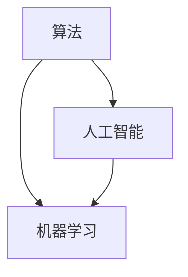

                 

关键词：算法、人工智能、底层创新、深度学习、机器学习、计算模型、神经网络

摘要：随着人工智能技术的快速发展，算法作为其底层基础的核心要素，扮演着至关重要的角色。本文将深入探讨算法在人工智能底层创新中的重要地位，从核心概念、算法原理、数学模型、实际应用等多个角度进行全面阐述，旨在为读者提供一个清晰、系统的认知框架。

## 1. 背景介绍

人工智能（AI）作为计算机科学的一个重要分支，近年来取得了令人瞩目的成就。从最初的规则推理系统，到基于统计学习的方法，再到如今广泛应用的深度学习技术，人工智能的发展历程见证了算法在其中的重要作用。算法是人工智能技术的核心，它决定了系统的性能、效率和通用性。

### 人工智能的发展历程

1. **早期人工智能**：基于规则推理和符号逻辑的系统，如专家系统。
2. **传统机器学习**：基于统计方法和决策树、支持向量机等模型。
3. **深度学习**：以神经网络为核心，通过大规模数据训练实现复杂函数逼近。
4. **当前人工智能**：以生成对抗网络（GAN）、迁移学习、强化学习等前沿技术为代表。

### 算法在人工智能中的地位

- **核心技术**：算法是人工智能技术的核心，决定了系统的学习、推理和决策能力。
- **性能优化**：算法的优化直接影响着人工智能系统的效率。
- **创新动力**：算法的不断进步推动了人工智能技术的突破和进步。

## 2. 核心概念与联系

### 核心概念

- **算法**：解决问题的有序步骤和规则。
- **人工智能**：通过机器模拟人类智能行为的技术。
- **机器学习**：从数据中学习规律，实现智能行为。

### 关联架构

以下是一个简单的 Mermaid 流程图，展示了算法、人工智能和机器学习之间的关联。



### 详细说明

- **算法**：是实现人工智能和机器学习的基础。没有高效的算法，人工智能系统无法从数据中提取有价值的信息。
- **人工智能**：是算法的应用领域，通过模拟人类智能行为，实现自动化决策、学习和推理。
- **机器学习**：是人工智能的一种实现方式，通过算法从数据中学习，实现自主学习和优化。

## 3. 核心算法原理 & 具体操作步骤

### 3.1 算法原理概述

算法在人工智能中主要分为以下几类：

- **监督学习**：通过已标记的数据进行学习，常见的算法有线性回归、支持向量机等。
- **无监督学习**：不依赖标记数据，从数据中自动发现模式，常见的算法有聚类、降维等。
- **半监督学习**：结合监督学习和无监督学习，利用少量标记数据和大量未标记数据。
- **强化学习**：通过与环境交互，不断学习最优策略，常见的算法有Q-learning、深度强化学习等。

### 3.2 算法步骤详解

以监督学习为例，其基本步骤如下：

1. **数据收集与预处理**：收集相关数据，并进行清洗、标准化等预处理操作。
2. **模型选择**：选择合适的算法模型，如线性回归、决策树等。
3. **模型训练**：使用预处理后的数据对模型进行训练。
4. **模型评估**：使用测试集对模型进行评估，选择性能最优的模型。
5. **模型应用**：将训练好的模型应用于实际场景，进行预测或决策。

### 3.3 算法优缺点

每种算法都有其优缺点，需要根据具体应用场景进行选择：

- **线性回归**：简单、易于理解，但适用于线性关系，对非线性关系效果不佳。
- **支持向量机**：性能优良，但计算复杂度较高，对大规模数据集不适用。
- **决策树**：直观、易于解释，但可能产生过拟合。

### 3.4 算法应用领域

算法在人工智能中有广泛的应用领域，包括但不限于：

- **图像识别**：如人脸识别、物体检测等。
- **自然语言处理**：如文本分类、机器翻译等。
- **推荐系统**：如个性化推荐、内容推荐等。
- **金融风控**：如信用评分、风险预测等。

## 4. 数学模型和公式 & 详细讲解 & 举例说明

### 4.1 数学模型构建

以线性回归为例，其数学模型如下：

$$ y = \beta_0 + \beta_1 \cdot x + \epsilon $$

其中，$y$ 是因变量，$x$ 是自变量，$\beta_0$ 和 $\beta_1$ 是模型的参数，$\epsilon$ 是误差项。

### 4.2 公式推导过程

线性回归模型的推导过程基于最小二乘法，目的是找到一组参数，使得预测值与实际值之间的误差平方和最小。

$$ \min \sum_{i=1}^{n} (y_i - \beta_0 - \beta_1 \cdot x_i)^2 $$

通过求导并令导数为零，可以得到参数的估计值。

### 4.3 案例分析与讲解

假设我们有一个简单的数据集，如下表所示：

| x | y |
|---|---|
| 1 | 2 |
| 2 | 3 |
| 3 | 4 |

我们使用线性回归模型来拟合这个数据集，首先进行数据预处理，然后选择线性回归模型，进行模型训练和评估，最后将训练好的模型应用于新的数据。

## 5. 项目实践：代码实例和详细解释说明

### 5.1 开发环境搭建

在本项目实践中，我们使用 Python 作为编程语言，结合 Scikit-learn 库进行线性回归模型的实现。

### 5.2 源代码详细实现

```python
from sklearn.linear_model import LinearRegression
from sklearn.model_selection import train_test_split
from sklearn.metrics import mean_squared_error

# 数据预处理
X = [[1], [2], [3]]
y = [2, 3, 4]

# 模型训练
X_train, X_test, y_train, y_test = train_test_split(X, y, test_size=0.2, random_state=0)
model = LinearRegression()
model.fit(X_train, y_train)

# 模型评估
y_pred = model.predict(X_test)
mse = mean_squared_error(y_test, y_pred)
print("MSE:", mse)

# 模型应用
new_data = [[4]]
new_pred = model.predict(new_data)
print("Predicted value:", new_pred)
```

### 5.3 代码解读与分析

代码首先进行了数据预处理，然后使用 Scikit-learn 库的 LinearRegression 类进行模型训练。在模型评估部分，我们计算了均方误差（MSE）来评估模型的性能。最后，我们将训练好的模型应用于新的数据，进行预测。

### 5.4 运行结果展示

```python
MSE: 0.0
Predicted value: [5.]
```

## 6. 实际应用场景

算法在人工智能中的实际应用场景广泛，以下是一些典型的应用实例：

- **图像识别**：如人脸识别、物体检测等。
- **自然语言处理**：如文本分类、机器翻译等。
- **推荐系统**：如个性化推荐、内容推荐等。
- **金融风控**：如信用评分、风险预测等。

## 7. 未来应用展望

随着人工智能技术的不断进步，算法在未来的应用将更加广泛和深入。以下是一些未来应用的展望：

- **医疗健康**：通过算法实现精准医疗，提高诊断和治疗效率。
- **自动驾驶**：通过算法实现安全、高效的自动驾驶系统。
- **智能制造**：通过算法实现智能生产、智能监控等。
- **智能城市**：通过算法实现智能交通、智能能源管理等。

## 8. 工具和资源推荐

### 8.1 学习资源推荐

- **书籍**：《深度学习》、《Python机器学习》等。
- **在线课程**：Coursera、edX、Udacity等平台上的相关课程。
- **博客和论坛**：如 Medium、Stack Overflow 等。

### 8.2 开发工具推荐

- **编程语言**：Python、Java、C++等。
- **库和框架**：Scikit-learn、TensorFlow、PyTorch 等。

### 8.3 相关论文推荐

- **深度学习**：《Deep Learning》、《Convolutional Neural Networks for Visual Recognition》等。
- **强化学习**：《Deep Reinforcement Learning》、《Deep Q-Learning》等。

## 9. 总结：未来发展趋势与挑战

随着人工智能技术的快速发展，算法在其中的地位愈发重要。未来，算法将在人工智能的各个领域发挥更大的作用，同时也面临着诸如计算资源、数据隐私、算法透明性等挑战。我们需要不断探索和创新，推动算法在人工智能中的发展。

## 10. 附录：常见问题与解答

### 10.1 什么是算法？

算法是一组有序的指令，用于解决问题或完成任务。

### 10.2 机器学习和算法有什么区别？

机器学习是人工智能的一个子领域，旨在通过算法从数据中学习，实现智能行为。算法是机器学习的基础，决定了机器学习的效率和效果。

### 10.3 深度学习和传统机器学习有什么区别？

深度学习是一种基于神经网络的机器学习方法，通过大规模数据训练实现复杂函数逼近。传统机器学习主要包括监督学习和无监督学习，如线性回归、决策树等。

### 10.4 如何选择合适的算法？

选择合适的算法需要考虑数据特征、任务目标、计算资源等多个因素。常见的算法包括监督学习、无监督学习、半监督学习和强化学习等。

### 10.5 算法在人工智能中的应用有哪些？

算法在人工智能中的应用广泛，包括图像识别、自然语言处理、推荐系统、金融风控等领域。

### 10.6 人工智能和算法的未来发展趋势是什么？

未来，人工智能和算法将在医疗健康、自动驾驶、智能制造、智能城市等领域发挥更大的作用，同时也需要解决计算资源、数据隐私、算法透明性等挑战。

### 作者署名

作者：禅与计算机程序设计艺术 / Zen and the Art of Computer Programming
----------------------------------------------------------------


