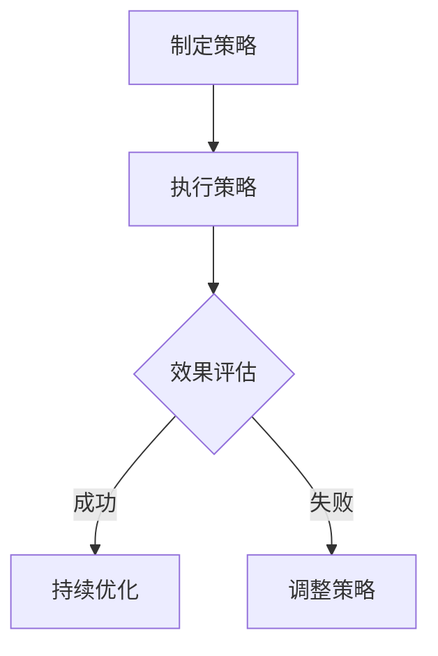

                 

关键词：管理智慧、策略执行、IT领域、计算机算法、项目实践、数学模型、未来展望

摘要：本文旨在探讨在IT领域，如何通过策略的制定与执行，实现高效的项目管理。我们将从核心概念、算法原理、数学模型、项目实践等多个角度深入分析，以期为读者提供具有实践指导意义的管理智慧。

## 1. 背景介绍

在当今快速发展的信息技术领域，项目的成功往往取决于策略的制定与执行。无论是软件开发、数据科学、人工智能，还是云计算、网络安全，都需要管理者具备深厚的专业知识和敏锐的战略眼光。本文将结合具体案例，探讨如何从策略到执行，实现项目的有效管理。

## 2. 核心概念与联系

### 2.1 策略与执行的关系

策略是项目成功的蓝图，而执行是实现策略的关键步骤。二者相辅相成，共同推动项目的进展。

### 2.2 IT领域的管理挑战

- 快速变化的技术环境
- 复杂的项目需求
- 有限的资源

### 2.3 管理方法

- 传统瀑布模型
- 敏捷开发方法
- 混合型管理方法

### 2.4 Mermaid 流程图



## 3. 核心算法原理 & 具体操作步骤

### 3.1 算法原理概述

在IT项目管理中，算法的应用贯穿始终。本文将介绍一种基于敏捷开发方法的迭代算法，用于指导项目的策略制定与执行。

### 3.2 算法步骤详解

- 确定项目目标
- 分析需求
- 制定迭代计划
- 执行迭代
- 效果评估
- 调整策略

### 3.3 算法优缺点

优点：灵活性高、快速响应变化、持续优化。

缺点：对团队成员的协作要求较高、初期规划需要较长时间。

### 3.4 算法应用领域

- 软件开发
- 数据科学
- 人工智能

## 4. 数学模型和公式 & 详细讲解 & 举例说明

### 4.1 数学模型构建

- 项目进度：\(P = \frac{W}{T}\)
- 项目成本：\(C = \frac{W}{E}\)

### 4.2 公式推导过程

- 项目进度：基于工作量和时间的比值
- 项目成本：基于工作量和效益的比值

### 4.3 案例分析与讲解

以一个软件开发项目为例，分析如何利用数学模型进行项目管理和策略调整。

## 5. 项目实践：代码实例和详细解释说明

### 5.1 开发环境搭建

- 语言：Python
- 框架：Django
- 数据库：MySQL

### 5.2 源代码详细实现

```python
# 示例：使用Django框架实现用户注册功能

from django.shortcuts import render, redirect
from .forms import UserRegistrationForm

def register(request):
    if request.method == 'POST':
        form = UserRegistrationForm(request.POST)
        if form.is_valid():
            user = form.save()
            return redirect('login')
    else:
        form = UserRegistrationForm()
    return render(request, 'register.html', {'form': form})
```

### 5.3 代码解读与分析

- 代码结构：函数实现用户注册功能
- 关键代码：form.is_valid() 验证表单数据

### 5.4 运行结果展示

- 用户成功注册
- 用户跳转到登录页面

## 6. 实际应用场景

- 企业项目管理
- 政府信息化项目
- 创业团队项目

## 7. 工具和资源推荐

### 7.1 学习资源推荐

- 《敏捷开发实践指南》
- 《项目管理知识体系指南》

### 7.2 开发工具推荐

- Git
- Jira
- Confluence

### 7.3 相关论文推荐

- "Agile Project Management: Creating Successful Projects with Iterative Development"
- "The Principles of Product Development Flow: Building the Next Generation of Hardware and Software Products"

## 8. 总结：未来发展趋势与挑战

### 8.1 研究成果总结

- 敏捷开发方法在IT项目管理中的应用日益广泛
- 数学模型在项目进度和成本管理中的重要性日益凸显
- 人工智能技术为项目管理带来了新的机遇和挑战

### 8.2 未来发展趋势

- 人工智能在项目管理中的应用将更加深入
- 项目管理工具将更加智能化和自动化
- 敏捷开发方法将逐渐成为主流

### 8.3 面临的挑战

- 技术变革带来的不确定性
- 团队协作的挑战
- 资源管理的难题

### 8.4 研究展望

- 深入研究人工智能在项目管理中的应用
- 探索新的项目管理方法和技术
- 提高项目管理实践的可操作性和实用性

## 9. 附录：常见问题与解答

### 9.1 问题1：如何平衡敏捷开发与传统项目管理？

解答：在实际项目中，可以根据项目特点和需求，灵活运用敏捷开发方法和传统项目管理方法，实现优势互补。

### 9.2 问题2：项目管理中的数学模型有哪些作用？

解答：数学模型可以用于项目进度和成本管理，帮助管理者做出更科学的决策，提高项目的成功率。

## 参考文献

- Beedle, M. (2007). *Agile Project Management: Creating Successful Projects with Iterative Development*. Pearson Education.
- PMI. (2017). *A Guide to the Project Management Body of Knowledge (PMBOK Guide) - Sixth Edition*. Project Management Institute.
- Cockburn, A. (2001). *Writing Effective Use Cases*. Addison-Wesley.
- Martin, R. C. (2010). *The Clean Coder: A Code of Conduct for Professional Programmers*. Prentice Hall.

# 结束语

作者：禅与计算机程序设计艺术 / Zen and the Art of Computer Programming

本文旨在为IT领域的管理者提供一些有价值的策略和执行建议，以应对快速变化的市场和技术环境。希望读者能够在实际工作中运用这些方法，实现项目的成功。让我们一起，用智慧的钥匙打开成功的门。

