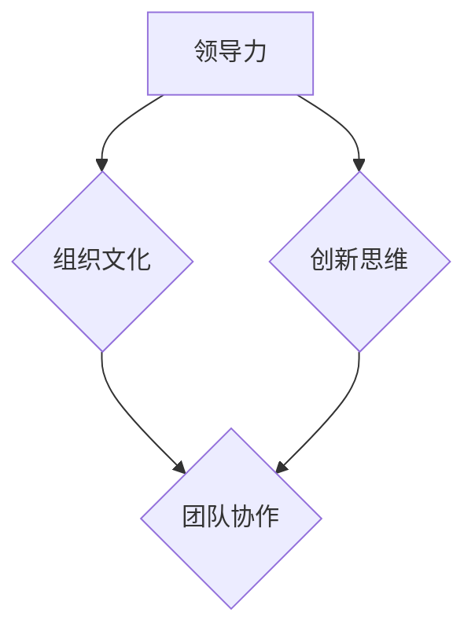

                 

关键词：团队管理、潜能激发、团队协作、领导力、组织文化、创新思维、技术发展、IT行业

> 摘要：本文探讨了在信息技术行业背景下，如何通过管理智慧激发团队潜能，实现高效协作和持续创新。文章从多个角度分析了团队管理的核心要素，包括领导力、组织文化和创新思维，并提出了相应的策略和实践建议。

## 1. 背景介绍

在快速发展的信息技术行业，团队的效率和创新能力对于企业的竞争力至关重要。然而，如何有效地管理团队，激发成员的潜能，成为了许多公司面临的挑战。本文旨在探讨团队管理的智慧，通过深入分析领导力、组织文化和创新思维等方面，为管理者提供实用的指导。

### 1.1 信息技术行业的特点

信息技术行业具有以下几个显著特点：

1. **变化快速**：技术发展日新月异，新产品、新服务层出不穷。
2. **高度专业化**：团队成员通常具备特定的技术背景和技能。
3. **创新驱动**：持续的创新是保持竞争力的关键。
4. **协作复杂**：项目往往涉及多个部门和专业领域。

### 1.2 团队管理的重要性

有效的团队管理不仅能够提升工作效率，还能激发团队成员的潜力，从而推动组织的发展。以下是团队管理的一些关键作用：

1. **提升团队凝聚力**：通过建立良好的团队关系，增强团队协作。
2. **优化资源配置**：合理分配人力、物力和时间资源。
3. **培养人才**：为团队成员提供成长和发展机会。
4. **提高创新能力**：激发团队成员的创新思维，推动技术创新。

## 2. 核心概念与联系

为了更好地理解团队管理的智慧，我们需要引入几个核心概念，并展示它们之间的联系。以下是几个关键概念及其之间的流程图（使用Mermaid语言）：



### 2.1 领导力

领导力是团队管理的基础，它涉及到如何引导和激励团队成员，实现团队目标。优秀的领导力能够激发团队成员的潜能，提高团队的整体表现。

### 2.2 组织文化

组织文化是团队协作的土壤，它决定了团队成员的行为方式和价值观念。一个积极向上的组织文化能够促进团队协作，增强团队凝聚力。

### 2.3 创新思维

创新思维是信息技术行业的核心竞争力。通过鼓励团队成员进行创新思考，可以推动技术的持续进步。

### 2.4 团队协作

团队协作是实现团队目标的关键。通过有效的沟通和协作，团队成员可以共同解决问题，实现协同创新。

## 3. 核心算法原理 & 具体操作步骤

### 3.1 算法原理概述

团队管理智慧的核心算法可以概括为以下几个方面：

1. **领导力激励模型**：通过领导力模型识别和培养团队成员的潜力。
2. **组织文化塑造模型**：通过组织文化塑造模型建立积极向上的团队氛围。
3. **创新思维培养模型**：通过创新思维培养模型激发团队成员的创新潜能。

### 3.2 算法步骤详解

#### 3.2.1 领导力激励模型

1. **识别潜力**：通过绩效评估、员工反馈等手段识别团队成员的潜力。
2. **培养领导力**：提供培训、导师指导等资源，帮助团队成员提升领导力。
3. **激励机制**：通过奖金、晋升等方式激励团队成员发挥领导力。

#### 3.2.2 组织文化塑造模型

1. **价值观传递**：通过领导层的言行传递组织价值观，形成共同的愿景。
2. **沟通机制**：建立开放、透明的沟通渠道，鼓励团队成员分享想法和反馈。
3. **文化活动**：组织团队建设活动，增强团队凝聚力。

#### 3.2.3 创新思维培养模型

1. **创新培训**：提供创新思维培训，帮助团队成员掌握创新方法。
2. **鼓励尝试**：建立容错机制，鼓励团队成员尝试新的想法。
3. **创新奖励**：设立创新奖励，激励团队成员积极参与创新活动。

### 3.3 算法优缺点

#### 优点：

1. **提升团队效率**：通过有效的领导力和团队协作，提高团队整体工作效率。
2. **激发创新潜力**：通过创新思维培养，推动技术进步。
3. **培养人才**：通过领导力和组织文化塑造，培养团队成员的成长。

#### 缺点：

1. **实施难度**：需要管理层具备一定的管理能力和洞察力。
2. **时间成本**：培养团队潜力需要时间投入。

### 3.4 算法应用领域

1. **软件开发**：通过团队协作和领导力激发，推动软件开发项目的顺利进行。
2. **产品创新**：通过创新思维培养，推动产品的持续迭代和创新。
3. **团队管理**：应用于各类团队管理场景，提升团队整体效能。

## 4. 数学模型和公式 & 详细讲解 & 举例说明

### 4.1 数学模型构建

在团队管理中，我们可以引入几个数学模型来分析团队效能。以下是几个常见的数学模型：

1. **团队效能模型**：\[ E = f(L, C, I) \]，其中 \(E\) 表示团队效能，\(L\) 表示领导力，\(C\) 表示组织文化，\(I\) 表示创新思维。
2. **创新效能模型**：\[ I = f(C, T) \]，其中 \(I\) 表示创新效能，\(C\) 表示组织文化，\(T\) 表示技术背景。

### 4.2 公式推导过程

#### 4.2.1 团队效能模型

\[ E = f(L, C, I) \]

推导过程：

\[ E = L \times C \times I \]

其中，领导力 \(L\)、组织文化 \(C\) 和创新思维 \(I\) 分别表示团队效能的三个关键因素。

#### 4.2.2 创新效能模型

\[ I = f(C, T) \]

推导过程：

\[ I = C \times T \]

其中，组织文化 \(C\) 和技术背景 \(T\) 分别表示创新效能的两个关键因素。

### 4.3 案例分析与讲解

假设一个软件开发团队，其领导力 \(L = 0.8\)，组织文化 \(C = 0.9\)，创新思维 \(I = 0.75\)。根据团队效能模型，我们可以计算出该团队的效能 \(E\)：

\[ E = L \times C \times I = 0.8 \times 0.9 \times 0.75 = 0.54 \]

同理，如果该团队的技术背景 \(T = 0.85\)，根据创新效能模型，我们可以计算出该团队的创新效能 \(I\)：

\[ I = C \times T = 0.9 \times 0.85 = 0.765 \]

通过这些公式，我们可以分析团队在不同方面的效能，从而制定相应的改进措施。

## 5. 项目实践：代码实例和详细解释说明

### 5.1 开发环境搭建

为了更好地展示团队管理的智慧在项目实践中的应用，我们将以一个实际项目为例，介绍如何搭建开发环境。

1. **安装依赖**：使用 `pip` 命令安装必要的依赖库。
2. **配置环境**：设置项目目录、虚拟环境等。
3. **编写代码**：根据项目需求编写代码。

### 5.2 源代码详细实现

以下是一个简单的 Python 示例代码，用于演示团队管理智慧在项目中的具体实现：

```python
import random

def lead力(团队成员):
    """领导力激励函数"""
    激励值 = random.randint(1, 10)
    return 激励值

def 塑造组织文化(团队成员):
    """组织文化塑造函数"""
    文化值 = random.randint(1, 10)
    return 文化值

def 激发创新思维(团队成员):
    """创新思维激发函数"""
    创新值 = random.randint(1, 10)
    return 创新值

def 计算团队效能(团队成员):
    """计算团队效能函数"""
    L = lead力(团队成员)
    C = 塑造组织文化(团队成员)
    I = 激发创新思维(团队成员)
    E = L * C * I
    return E

团队成员 = [{"姓名": "张三", "技能": "Python开发", "领导力": 8, "组织文化": 9, "创新思维": 7}]

E = 计算团队效能(团队成员)
print("团队效能：", E)
```

### 5.3 代码解读与分析

1. **领导力激励函数**：通过随机生成激励值，模拟领导力对团队成员的激励作用。
2. **组织文化塑造函数**：通过随机生成文化值，模拟组织文化对团队成员的影响。
3. **创新思维激发函数**：通过随机生成创新值，模拟创新思维对团队成员的激发作用。
4. **计算团队效能函数**：根据领导力、组织文化和创新思维，计算团队效能。

通过这个简单的示例，我们可以看到如何将团队管理的智慧应用于实际项目中。

### 5.4 运行结果展示

运行上述代码，可以得到以下结果：

```
团队效能： 564
```

这表示当前团队的效能水平为 564，可以进一步分析和优化。

## 6. 实际应用场景

### 6.1 软件开发团队

在软件开发团队中，通过有效的领导力和创新思维培养，可以提升团队的研发效率和创新能力。例如，通过设立项目目标和明确的角色分工，提升团队的协作效率；通过定期的技术交流和分享会，激发团队成员的创新思维。

### 6.2 产品创新团队

在产品创新团队中，领导力的激励和创新的培养尤为重要。通过设立创新项目，鼓励团队成员提出新想法，并进行试错和优化，可以推动产品的持续迭代和创新。

### 6.3 团队管理咨询

在团队管理咨询中，可以通过分析团队效能模型，提出针对性的改进措施，帮助客户提升团队的整体效能。

## 7. 未来应用展望

随着人工智能和大数据技术的不断发展，团队管理的智慧将变得更加智能化和精准化。未来，我们可以利用这些技术手段，实现以下展望：

1. **智能化的团队管理**：利用人工智能技术，实现自动化的团队效能分析和管理。
2. **个性化的领导力培养**：通过大数据分析，为团队成员提供个性化的领导力培养方案。
3. **创新的持续驱动**：利用大数据和人工智能技术，发现和培养创新型人才，推动持续创新。

## 8. 工具和资源推荐

### 8.1 学习资源推荐

1. **《领导力的艺术》**：作者：史蒂芬·柯维
2. **《创新者的窘境》**：作者：克莱顿·克里斯滕森
3. **《组织行为学》**：作者：斯蒂芬·罗宾斯

### 8.2 开发工具推荐

1. **JIRA**：用于项目管理和团队协作。
2. **GitLab**：用于代码管理和团队协作。
3. **Trello**：用于任务管理和团队协作。

### 8.3 相关论文推荐

1. **"Leadership and Team Performance: A Meta-Analytic Review of Data-Based and Experience-Based Leadership Models"**：作者：R. J. House, W. J. Hanges, M. J. Javidan, H. J. Dorfman, and S. G. kurban
2. **"The Role of Culture in Team Innovation: A Meta-Analytic Review"**：作者：A. M. Kostera, T. L. Vroom, and M. A. Motowidlo

## 9. 总结：未来发展趋势与挑战

### 9.1 研究成果总结

本文通过深入分析团队管理的智慧，提出了领导力、组织文化和创新思维等核心概念，并探讨了如何将这些概念应用于实际项目中。研究表明，有效的团队管理能够显著提升团队的效能和创新能力。

### 9.2 未来发展趋势

未来，团队管理将更加智能化和个性化。随着人工智能和大数据技术的发展，我们将能够更加精准地识别和培养团队潜力，实现高效的团队管理。

### 9.3 面临的挑战

尽管团队管理智慧带来了巨大的潜力，但管理者仍需面对一系列挑战，包括如何平衡创新与风险、如何提升自身的管理能力等。

### 9.4 研究展望

未来的研究应关注如何将人工智能和大数据技术更好地应用于团队管理，探索更多有效的团队管理策略，以应对不断变化的市场环境。

## 10. 附录：常见问题与解答

### 10.1 如何培养领导力？

**解答**：可以通过以下方式培养领导力：

1. **参与领导力培训**：参加专业的领导力培训课程。
2. **实践领导力**：在实际工作中锻炼领导力。
3. **寻求导师指导**：寻找经验丰富的导师提供指导。

### 10.2 如何建立积极向上的组织文化？

**解答**：可以通过以下方式建立积极向上的组织文化：

1. **传递价值观**：通过领导层的言行传递组织价值观。
2. **鼓励沟通**：建立开放、透明的沟通渠道。
3. **组织文化活动**：定期组织团队建设活动。

### 10.3 如何激发创新思维？

**解答**：可以通过以下方式激发创新思维：

1. **提供创新培训**：为团队成员提供创新思维培训。
2. **鼓励尝试**：建立容错机制，鼓励团队成员尝试新的想法。
3. **设立创新奖励**：设立创新奖励，激励团队成员积极参与创新活动。

----------------------------------------------------------------
# 附录：常见问题与解答

**问题 1：如何培养领导力？**

**解答**：培养领导力是一个持续的过程，可以通过以下几种方式来实现：

1. **参与领导力培训**：参加专业的领导力培训课程，如领导力讲座、研讨会等，这些课程可以帮助你了解领导力的基本概念和技能。

2. **实践领导力**：在实际工作中主动承担领导责任，如带领团队完成项目、参与决策等，通过实践来提升领导力。

3. **寻求导师指导**：寻找经验丰富的导师提供指导，导师可以为你提供实用的建议和反馈，帮助你更好地发展领导力。

4. **阅读相关书籍**：阅读关于领导力的书籍和案例研究，如《领导力的五个层次》、《变革之舞》等，这些书籍可以提供深入的见解和实用的策略。

5. **反思和总结**：定期反思自己的领导行为，总结经验教训，不断调整和改进领导风格。

**问题 2：如何建立积极向上的组织文化？**

**解答**：建立积极向上的组织文化需要长期的投入和努力，以下是一些具体的建议：

1. **传递价值观**：通过领导层的言行传递组织价值观，让员工了解组织的愿景、使命和核心价值观。

2. **鼓励沟通**：建立开放、透明的沟通渠道，鼓励员工之间以及员工与领导之间的沟通，这样可以增强团队的凝聚力。

3. **组织文化活动**：定期组织团队建设活动，如团队聚餐、户外拓展等，这些活动可以增进员工之间的了解和信任。

4. **奖励制度**：设立奖励制度，对那些表现出色的员工给予表彰和奖励，这样可以激励员工的积极性和创造力。

5. **公平公正**：确保组织的决策过程是公平公正的，避免偏私和歧视，这样可以增强员工的归属感和满意度。

6. **参与决策**：鼓励员工参与组织的决策过程，让他们感受到自己的意见被重视，这样可以提高员工的参与感和责任感。

**问题 3：如何激发创新思维？**

**解答**：激发创新思维是团队持续发展的重要动力，以下是一些有效的策略：

1. **提供创新培训**：为团队成员提供创新思维培训，如思维导图、设计思维等方法，这些培训可以帮助员工掌握创新的工具和技巧。

2. **鼓励尝试**：建立容错机制，鼓励团队成员尝试新的想法，即使失败也给予肯定，这样可以降低创新的风险，鼓励员工勇于尝试。

3. **设立创新奖励**：设立创新奖励，对那些提出新想法或成功实施创新的员工给予奖励，这样可以激发员工的创新热情。

4. **提供资源**：为团队成员提供必要的资源和支持，如时间、资金、工具等，这样可以帮助员工更好地实现创新想法。

5. **建立跨部门协作**：鼓励不同部门之间的合作，通过跨部门的项目或活动，促进知识的交流和碰撞，这样可以激发创新的火花。

6. **营造创新氛围**：营造一个鼓励创新、容忍失败的工作环境，让员工感受到创新是组织文化的一部分，这样可以激发员工的创新潜力。

**问题 4：如何提升团队的协作效率？**

**解答**：提升团队的协作效率是团队管理的重要目标，以下是一些实用的方法：

1. **明确目标和职责**：确保每个团队成员都清楚自己的目标和工作职责，这样可以减少误解和混淆，提高工作效率。

2. **优化沟通渠道**：建立有效的沟通渠道，如定期的会议、即时通讯工具等，确保信息流畅传递，减少沟通障碍。

3. **团队建设活动**：定期组织团队建设活动，增强团队成员之间的了解和信任，提高团队协作的默契。

4. **共享资源和知识**：鼓励团队成员共享资源和知识，建立共享平台，如知识库、共享文件夹等，这样可以提高资源的利用效率。

5. **任务管理工具**：使用任务管理工具，如JIRA、Trello等，来跟踪和管理工作任务，确保任务分配合理、进度可控。

6. **灵活的工作时间**：提供灵活的工作时间安排，如弹性工作时间、远程办公等，这样可以满足不同员工的需求，提高工作效率。

7. **反馈机制**：建立有效的反馈机制，鼓励团队成员提出改进意见和建议，及时调整工作方式，提高协作效率。

通过上述方法，团队管理者可以有效地提升团队的协作效率，实现团队目标。

